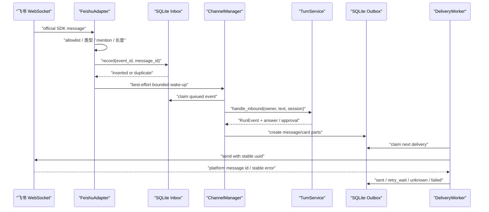

# Phase 4：飞书 Channel 与 Gateway 工程文档

> 状态：核心链路与 `miniclaw gateway` 离线生命周期已实现；真实飞书账号 E2E、部署与 soak 尚未完成
> 当前全仓门禁规模：508 Python tests、27/27 TypeScript tests、28/28 offline Agent cases、32/32 Channel cases

## 1. 现在完成到了哪里

这次交付的不是一个“收到消息就直接调模型”的 Demo，而是一套可恢复的 Channel Core：

- 飞书消息先经过 allowlist、类型、群聊 mention 和长度校验；
- 合法事件先写 SQLite Inbox，再尝试放入有界内存队列；
- Worker 按同一个外部会话串行调用共享 `TurnService`；
- 回复先写 SQLite Delivery Outbox，再由独立 Worker 投递；
- WebSocket 重连、进程重启或发送结果未知时，不会简单重复执行 Agent；
- typing、streaming card 和审批卡片是可降级体验层，失败后仍回到普通文本；
- WebSocket、Inbox、Turn、Delivery 与能力失败共用脱敏 correlation、JSON 日志和 SQLite Audit；
- Channel 不复制 Agent、Policy、Approval 或记忆逻辑。

当前还不能把它称为“飞书生产发布”：仓库虽然已提供 `miniclaw gateway` 进程编排、安全启停与离线 Doctor，
但尚未使用真实 App 凭据完成连接、回调、权限、卡片与重启 E2E。因此进度页标成“Gateway ready / real E2E next”。

## 2. 模块地图

| 文件 | 职责 |
| --- | --- |
| `src/miniclaw/channels/base.py` | `InboundMessage`、`OutboundMessage`、Transport 和稳定错误契约 |
| `src/miniclaw/channels/feishu.py` | 飞书 Adapter、官方 WebSocket SDK Transport、strict security/policy 配置 |
| `src/miniclaw/channels/manager.py` | durable Inbox、有限 Worker、按 Conversation 串行、Turn 与 Delivery 编排 |
| `src/miniclaw/channels/delivery.py` | Unicode-safe 分片、Outbox claim、退避重试和 unknown 恢复 |
| `src/miniclaw/channels/capabilities.py` | typing、streaming card 与普通文本降级 |
| `src/miniclaw/channels/observability.py` | correlation、短哈希、结构化 JSON 日志和 durable Audit |
| `src/miniclaw/channels/approvals.py` | 审批文本/卡片解析，只调用 Core continuation |
| `src/miniclaw/storage/channels.py` | Identity、Inbound、Delivery Repository 与原子状态迁移 |
| `src/miniclaw/storage/migrations/0002_feishu_channel.sql` | Channel Identity、Inbox、Outbox 和幂等约束 |
| `src/miniclaw/runtime.py` | `create_channel_manager()`，复用唯一 `AgentRuntime` |
| `src/miniclaw/gateway.py` | 凭据/SDK 预检、Transport 就绪后启 Worker、SIGTERM drain 与安全关闭 |
| `src/miniclaw/cli.py` | 暴露非 TTY 的 `miniclaw gateway` 维护入口 |
| `src/miniclaw/doctor.py` | 离线检查 TUI 与飞书配置、SDK、表结构和环境变量存在性 |

## 3. 端到端数据流



关键原则是“SQLite 是事实，内存 Queue 只是 wake-up”。队列满时事件仍在 Inbox；feeder 会重新扫描 queued
记录。进程崩溃留下的 running/sending 状态会进入受控恢复，而不是丢失或盲目重放。

## 4. Admission 与身份边界

`FeishuAdapter` 只产出已经规范化的 `InboundMessage`。当前边界包括：

- 默认关闭 Channel，配置不完整时 fail closed；
- 私聊只允许 `allowed_open_ids`；Owner 必须显式包含在 allowlist；
- 群聊默认关闭；打开后只允许 `allowed_chat_ids`，且必须 @机器人；
- 只接受文本消息；机器人、自发消息、空标识和超长文本被忽略；
- `event_id` 保留用于事件冲突诊断；`message_id` 是业务幂等键，不能用一次投递的 event ID 代替；
- `repr()`、异常与审计不包含消息正文、App Secret 或平台标识。

飞书身份映射到一个本地 Owner 与稳定 Session。平台字段不能提供本地 `user_id`、Workspace、Tool 权限或
Approval scope。

## 5. Inbox、并发和幂等

Inbox 同时约束 event ID 和 message ID，但 `InboundEventRepository.record()` 先按
`(channel, account_id, external_message_id)` 判断重复业务消息。`ChannelManager.receive()` 的顺序是：

1. 原子记录事件；
2. 重复事件立即返回，不再次执行 Agent；
3. 尝试 `put_nowait` 到有界 Queue；
4. Queue 满只表示本次没有 wake-up，不表示消息丢失；
5. feeder 周期扫描 queued 记录补回 Queue。

全局 Worker 数有配置上限；同一外部 Conversation 还有独立 Lock，保证同一会话的用户消息按顺序进入
`TurnService`。不同会话可以在预算内并行。

## 6. Delivery 与失败恢复

回复不会在 Agent Worker 内直接发送。`DeliveryRepository.create_parts()` 先生成稳定分片和幂等键，
`DeliveryWorker` 再 claim 投递：

- 长文本优先在段落、换行和空格边界切分；必要时按 Unicode 字符边界切分；
- 每段带 `[n/total]` 前缀，且不超过 `message_max_chars`；
- 成功必须拿到非空 platform message id；
- rate limit 等明确可重试错误进入有上限的指数退避；
- timeout/断进程等结果未知进入 `unknown`，重启后使用同一幂等 UUID 恢复；
- 永久错误进入 `failed`，SDK 原始正文不会进入状态码；
- `sending` crash recovery 不伪装成成功。

## 7. Typing、Streaming Card 与审批

这些能力不能改变事实层：

- typing reaction 是 best effort，添加或移除失败不影响 Turn；
- streaming progress card 只消费公开 `model_text_delta`；reasoning、Tool 参数和内部 Trace 不进入卡片；
- Approval card 只显示 Core 允许的 grant modes；
- 卡片 payload 绑定 Approval ID、Owner 和原参数 hash；
- 进度卡不是权威结果；最终 Markdown 始终提前进入 durable Outbox，卡片失败不会决定最终回复是否存在；
- 文本 `approve/deny` 与 card action 都进入同一个 `continue_approval()`，不会复制执行逻辑。

## 8. 配置与凭据

配置位于 `[channels.feishu]`，关键字段是：

| 字段 | 说明 |
| --- | --- |
| `enabled` | 默认 false；只有显式打开才允许装配 |
| `account_id` | 本地多账号路由键；v0.1 仍只运行一个账号 |
| `app_id_env` / `app_secret_env` | 只保存环境变量名，不把值写入 TOML |
| `domain` | `feishu` 或 `lark` 的稳定枚举 |
| `owner_open_id` / `allowed_open_ids` | Owner 与私聊 allowlist |
| `allowed_chat_ids` / `allow_group_mentions` | 群聊默认关闭的双重开关 |
| `queue_size` / `worker_count` | 内存 wake-up 和 Agent 并发预算 |
| `message_max_chars` | 出站单段上限 |
| `streaming_card` | 体验层开关；关闭后仍可普通文本回复 |

官方 Channel SDK 是可选依赖；本地 TUI、离线 eval 和 Core tests 不要求安装飞书 SDK。凭据只从当前进程环境
取值，并只交给 `FeishuTransport` 构造函数。

## 9. 测试矩阵

当前 Phase 4 测试覆盖：

- Channel contract 与安全 `repr`；
- typed config、缺失 allowlist 与关系校验；
- Identity、Inbox、Outbox 的唯一性、claim 和状态机；
- Queue 满、feeder 补偿、同会话串行和跨会话并发；
- crash recovery、重复事件与重复 Delivery；
- Unicode 分片、retry/unknown/permanent failure；
- Adapter admission、官方 SDK 配置与 WebSocket 生命周期；
- official SDK reconnecting/reconnected 状态、过滤原因与连接状态观测；
- typing、streaming card 降级；
- Inbox / Turn / Delivery correlation、耗时、Tool 数、attempt 与错误恢复 Audit；
- Approval card、文本 fallback、Owner/hash/单次消费；
- Gateway 启动顺序、双信号关闭、缺配置 fail closed 与凭据脱敏；
- Doctor 的十五项离线诊断，不连接飞书也不输出 Secret；
- 最新 Python Core 与 pi-tui 的真实跨进程握手。

发布前门禁：

```bash
MINICLAW_NODE=/absolute/node-22-or-newer \
  uv run python -m unittest discover -s tests -v
pnpm --dir tui test
uv run miniclaw eval run --suite offline --root evals/scenarios
uv run miniclaw eval run --suite channel --root evals/scenarios
uv run miniclaw eval run --suite channel --repeat 20 --root evals/scenarios
uv run ruff check .
uv build
git diff --check
```

当前门禁规模：508 Python tests、27/27 TypeScript、28/28 offline Agent cases、32/32 Channel cases、20 轮
全平台 Channel local soak 为 640/640、Ruff PASS，Python wheel/sdist 构建成功。

## 10. 尚未完成与下一步

Phase 4 的剩余工作不能用单元测试冒充：

1. 用真实测试 App 完成 WebSocket 收消息、文本回复、卡片审批和断线重连 E2E；
2. 验证 macOS/Linux 常驻部署、SIGTERM drain 和真实 Gateway 至少数小时 soak；本地状态机 20 轮 soak 已通过；
3. 形成不含消息正文、Open ID 或凭据的 Phase 4 release record；
4. 再决定是否开放群聊和多账号，而不是提前泛化。

配置、运行、12 条回归、真实 smoke 和排障步骤见
[Phase 4 运行与测试手册](testing-and-operations.md)。
[Phase 4 完成性审计](completion-audit.md)逐项列出 requirement → code → test → live evidence；设计约束见
[Phase 4 飞书 Channel 设计](../../superpowers/specs/2026-08-08-phase-4-feishu-channel-design.md)，
逐步实现记录见 [Phase 4 TDD 计划](../../superpowers/plans/2026-08-08-phase-4-feishu-channel.md)。
