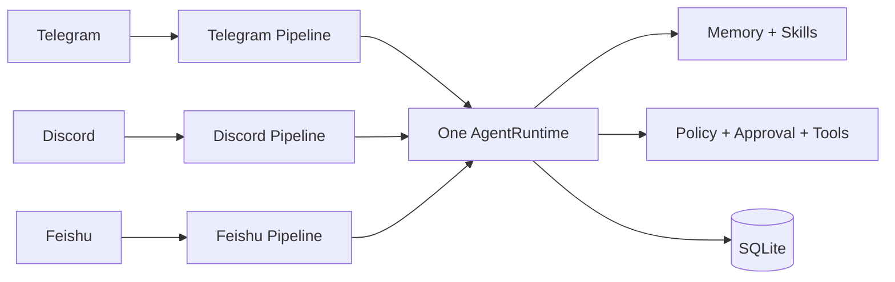
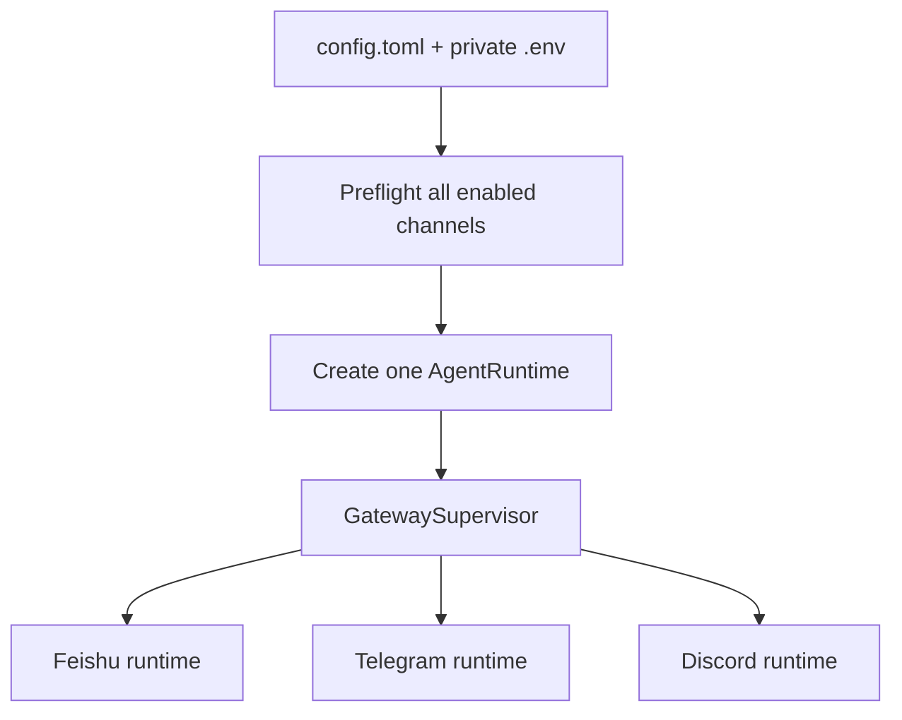
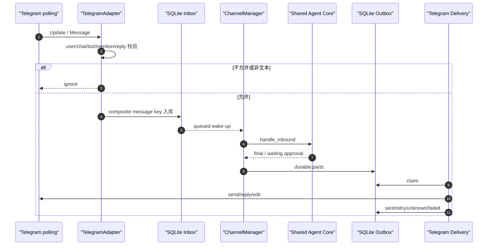
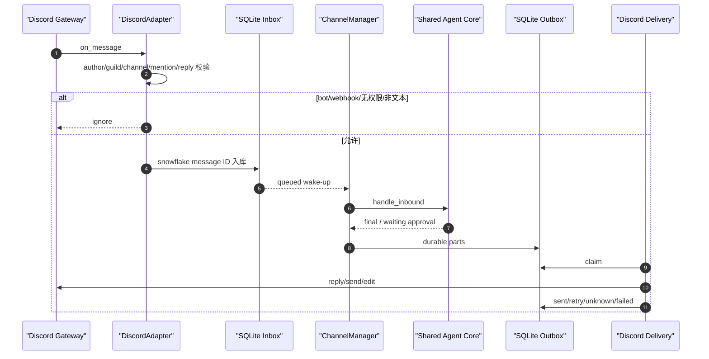
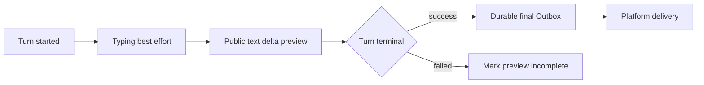
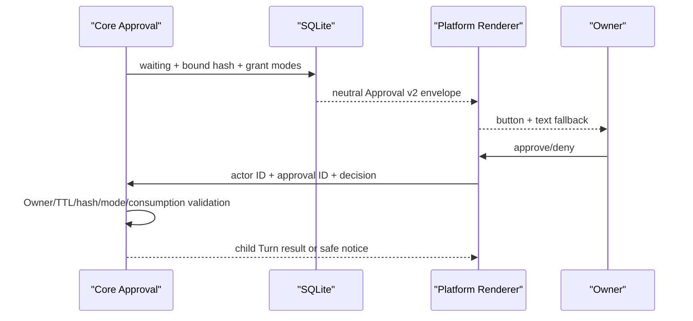
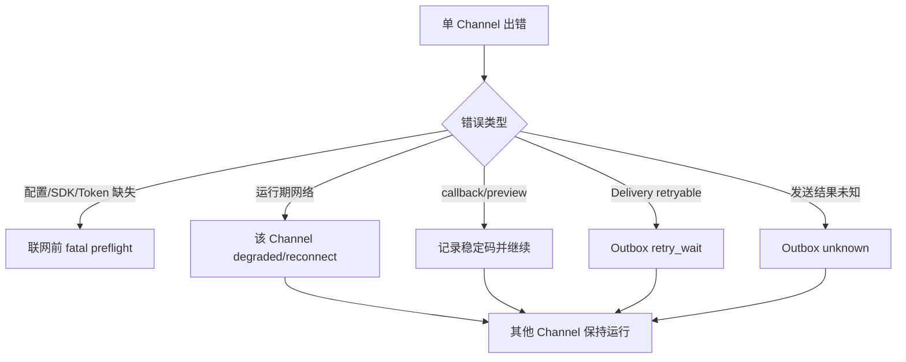

# Phase 5：Telegram 与 Discord 工程落地说明

> 当前状态：**IMPLEMENTATION PASS / TARGETED CALLBACK LIVE VERIFIED / 15-CASE LIVE PENDING**；Telegram/Discord live pending
>
> 当前全仓证据：562/562 Python tests、30/30 TypeScript tests、29/29 Agent cases、
> 32/32 Channel cases、20 轮 640/640 local soak。
>
> 目标：Telegram 与 Discord 同时进入统一 Gateway，共享一个个人 Agent
>
> 说明：本文描述已经锁定的落地方案，不把尚未开发的功能写成已实现

逐文件、逐测试、逐提交的执行步骤见
[Phase 5 Telegram/Discord Implementation Plan](../../superpowers/plans/2026-08-08-phase-5-telegram-discord.md)。

## 1. 大白话说明

Phase 4 已经让 MiniClaw 能把飞书消息安全地送进 Agent。Phase 5 已把同一条生产管线扩展到 Telegram 和
Discord；它没有再复制两个聊天机器人：

```text
平台消息
  → 身份和群聊规则检查
  → SQLite 先保存
  → 有界 Worker 调用同一个 Agent
  → 最终回复先进入 SQLite Outbox
  → 对应平台发送、限流、失败重试
```

三个入口看到的是同一个 MiniClaw：它们共享长期 Memory、Skills、Tool、Policy 和 Owner。不同入口的临时聊天
历史仍分开，避免 Telegram 的上下文突然出现在 Discord 群里。



## 2. 为什么不能只复制 `feishu.py`

当前仓库的 Inbox、Outbox、Manager 和 Observer 已经是平台无关的，但装配和体验层仍有飞书痕迹：

| 当前边界 | Phase 5 必须做的调整 |
| --- | --- |
| `gateway.py` 只启动飞书 | 增加 GatewaySupervisor，启动所有 enabled Channel |
| Manager factory 写死 `feishu` | 用 `ChannelLimits` 装配任意平台 Manager |
| Typing/Progress 使用 card 方法名 | 改成平台无关 Experience 接口 |
| Approval payload 持久化飞书卡片 | 改成中立 v2 envelope，由平台发送时渲染 |
| Delivery 默认错误码带 `feishu_*` | concrete Transport 负责平台码，Worker 只看稳定属性 |

如果不先处理这些边界，新平台就会复制 Agent、审批或重试逻辑。那看起来功能很多，实际会形成三套难以维护的
机器人，不符合 MiniClaw 的产品目标。

## 3. 三个平台如何共存

`miniclaw gateway` 将从“飞书专用命令”升级为“全部已启用 Channel 的统一守护进程”。



每个平台 runtime 都包含：

- 一个 Adapter；
- 一个 Transport；
- 一个 ChannelManager；
- 一个 DeliveryWorker；
- 一个平台 Experience；
- 一个复用 Core 的 Approval Controller。

它们共享 AgentRuntime 和数据库，但不共享内存 queue、Conversation lock 或网络任务。Telegram queue 满时不会挤掉
Discord 的 wake-up；Discord 重连时飞书仍可以继续处理消息。

## 4. 能力矩阵

| 能力 | 飞书 | Telegram | Discord |
| --- | --- | --- | --- |
| 长连接方式 | official WebSocket | long polling | Gateway |
| 公网端口 | 不需要 | 不需要 | 不需要 |
| 私聊文本 | Owner 白名单 | numeric user allowlist | snowflake user allowlist |
| 群聊 | chat allowlist + mention | chat allowlist + mention/reply | guild/channel allowlist + mention/reply/thread |
| 自身消息过滤 | sender type / bot | bot user ID | author.bot / webhook |
| Typing | reaction | chat action | typing context |
| 流式体验 | progress card | preview message edit | preview message edit |
| 最终平台回复 | completed card；失败时 durable text fallback | durable text Outbox | durable text Outbox |
| 字符上限 | 配置软上限 | 4096 | 2000 |
| 平台限流 | SDK/错误码 | RetryAfter | route bucket / retry_after |
| Approval UI | card + text | inline keyboard + text | View/button + text |

## 5. 配置示例

Token 只能写入项目根目录的私密 `.env`：

```dotenv
MINICLAW_TELEGRAM_BOT_TOKEN=
MINICLAW_DISCORD_BOT_TOKEN=
```

`.env` 必须保持 `0600`，不得提交 Git。非秘密配置放在 `~/.miniclaw/config.toml`：

```toml
[channels.telegram]
enabled = false
account_id = "default"
bot_token_env = "MINICLAW_TELEGRAM_BOT_TOKEN"
owner_user_id = 0
allowed_user_ids = []
allowed_chat_ids = []
allow_group_mentions = false
queue_size = 64
worker_count = 2
message_max_chars = 4096
progress_update_interval = 0.8

[channels.discord]
enabled = false
account_id = "default"
bot_token_env = "MINICLAW_DISCORD_BOT_TOKEN"
owner_user_id = 0
allowed_user_ids = []
allowed_guild_ids = []
allowed_channel_ids = []
allow_guild_mentions = false
queue_size = 64
worker_count = 2
message_max_chars = 2000
progress_update_interval = 1.0
typing_renew_interval = 8.0
```

代码实现后才会把这些字段加入正式 Config Schema。在那之前不要手工把它们写入当前配置，因为当前强类型解析器会
正确拒绝未知字段。

## 6. Telegram 消息怎么进入 Agent



Telegram message ID 只在一个 chat 内唯一，因此 MiniClaw 必须用 `chat_id + message_id` 组合业务 key。私聊要求
user allowlist；群聊还要求 chat allowlist，并且明确 @Bot 或 reply Bot。forum topic 会成为独立 Conversation。

首版最终消息不启用 MarkdownV2 parse mode。这样模型输出中的 `_`、`[`、反斜杠等字符不会导致整条发送失败。
格式可能朴素，但交付比错误的富文本更重要。

## 7. Discord 消息怎么进入 Agent



Discord 读取自由文本需要 Message Content Intent。Phase 5 只启用这一项必要 privileged intent，不启用成员列表、
在线状态或语音权限。出站永久使用 `AllowedMentions.none()`，即使模型生成 `@everyone` 也不能真正通知全服。

## 8. Typing 和流式预览不是最终回复

为了让长回答不显得“卡住”，Telegram 和 Discord 都会显示可编辑的预览消息。但预览只是体验层：



- Telegram 最快 800 ms 编辑一次；Discord 最快 1 秒编辑一次；
- 只允许公开 `model_text_delta`，不能展示 reasoning 或 Tool 参数；
- 预览失败后停止本次编辑，不影响 Agent；
- 最终成功回复永远进入 Outbox；
- 预览完成后显示“最终内容见下一条消息”，避免把半截预览当权威结果。

## 9. 长消息和代码块

Telegram 单条最多 4096 字符，Discord 最多 2000 字符。Phase 5 分片器要比当前普通文本切分更了解 Markdown：

```text
优先段落 → 换行 → 空格 → Unicode 字符边界
```

若切点位于 fenced code block 内，当前片主动补三个反引号组成的闭合围栏，下一片重新打开相同语言标记。每片还要预留
`[i/n] ` 前缀，最终长度不能超平台上限。中文、emoji、组合字符和代码围栏必须有专门回归测试。

## 10. Approval 如何跨平台工作

危险 Tool 的批准权仍在 Core，不在 Telegram/Discord 按钮：



平台中立 payload 只含审批编号、Tool 名、安全摘要、Core 允许的 scope 和文本 fallback，不含原始参数。飞书、
Telegram 和 Discord 各自渲染按钮。按钮失效时始终可以使用：

```text
/approve <编号> once|session|always
/deny <编号>
```

非 Owner、篡改、过期和重复消费全部 fail closed。

## 11. 故障与恢复



| 场景 | 结果 |
| --- | --- |
| Telegram polling 断开 | Telegram 重连，Discord/飞书继续 |
| Discord Gateway 断开 | Discord resume/reconnect，其他继续 |
| queue 满 | 消息已在 SQLite，feeder 后续找回 |
| queued 后崩溃 | 重启重新 claim |
| running Tool 中崩溃 | 标记失败，不盲目重放副作用 |
| sending 时取消 | 标记 unknown，保留幂等键 |
| Preview/Typing 失败 | 最终 Outbox 继续 |
| Audit 失败 | 日志标记未持久化，Channel 继续 |

## 12. 安全边界

必须保证：

- Token 只在私密 `.env` 和进程内短期 credentials 中存在；
- 昵称、用户名、群名不能用于授权；
- 完整平台 ID 只在配置/SQLite 业务字段存在，不进入日志和 `repr`；
- raw SDK event 不进入 SQLite、Prompt 或 Audit；
- bot/webhook/self 消息不进入 Inbox；
- Discord 模型文本不能触发 mention；
- Channel 不能直接执行 Tool 或扩大 Approval scope；
- 未确认的发送不能标记成功；
- 测试、release record 和 progress HTML 不保存真实消息或身份。

## 13. Doctor 与安装

实现后的安装方式：

```bash
uv sync --extra telegram
uv sync --extra discord
# 或一次安装全部 Channel
uv sync --extra channels
```

Doctor 仍然完全离线：

```bash
uv run miniclaw doctor
```

它会区分 disabled、配置错误、SDK 缺失、Token 变量缺失和 locally ready，但不会调用平台认证接口。只有 live smoke
可以证明 Token 和平台权限真实可用。

## 14. 回归测试集

Phase 5 已新增 20 条版本化场景：Telegram 10 条、Discord 10 条。已有飞书 12 条继续保留，因此 Channel gate
当前是 32/32。

覆盖能力：

- DM admission；
- group/guild mention admission；
- no-mention/非白名单忽略；
- reply/thread；
- message ID 去重；
- 共享只读 Tool 和 Policy；
- approve/deny；
- 平台分片和 rate limit；
- queued/unknown 重启恢复；
- Telegram/Discord 双向故障隔离。

Local soak：

```bash
uv run miniclaw eval run --suite channel --repeat 20 --root evals/scenarios
```

当前结果是 `640/640` checks。这个数字只证明本地状态机，不证明真实 Token、平台权限和网络。

## 15. 真实验收口径

每个平台分别执行 20 轮私聊、群 mention/non-mention、reply/thread、Memory 重启、Tool、approve/deny、重复消息、
长回复、限流、重启、断网重连和 Preview fallback。

当前没有两个平台的真实验收 evidence，因此准确口径是：

```text
Telegram implementation PASS / live PENDING
Discord implementation PASS / live PENDING
```

不允许把 Discord live PASS 写成整个 Phase 5 production verified，也不允许用 fake Telegram SDK 冒充真实验收。

## 16. 分阶段实施顺序

| 顺序 | 交付 |
| --- | --- |
| 1 | Config、extras、环境变量和 Doctor |
| 2 | 平台无关 Manager factory、Experience、Approval v2、Delivery 错误码 |
| 3 | Telegram Adapter 和 Transport |
| 4 | Discord Adapter 和 Transport |
| 5 | GatewaySupervisor 与三 Pipeline 生命周期 |
| 6 | 20 条新场景、local soak 和 live harness |
| 7 | 全量文档、release gate、progress 和 main push |

每一项都必须执行 RED → GREEN → 相关回归 → 全量门禁，不能先写生产代码再补测试。

## 17. 完成定义

Phase 5 implementation complete 必须同时满足：

- 两个 Adapter、Transport、Experience、Approval 和 Supervisor 已进入生产装配；
- 飞书无回归；
- Python/TypeScript/Agent/至少 32 条 Channel 全绿；
- local soak 至少 640/640；
- Ruff、build、文档链接、Mermaid、HTML、diff check、Secret scan 全绿；
- Doctor、README、PRD、架构、工程索引、运行指南、release record 和进度页同步；
- mixed CN/EN commits 已推送并核验 `origin/main`；
- 未做真实验收的平台明确标为 PENDING。

Phase 5 production verified 还要求 Telegram、Discord 两边真实验收均通过。

## 18. 当前进度

| 项目 | 状态 |
| --- | --- |
| 总体架构和范围 | IMPLEMENTATION PASS |
| Telegram 生产代码 | IMPLEMENTATION PASS |
| Discord 生产代码 | IMPLEMENTATION PASS |
| GatewaySupervisor | IMPLEMENTATION PASS |
| 20 条新回归 | 20/20 PASS；总 Channel 32/32 |
| 20-run local soak | 640/640 PASS |
| Phase 5 合并时 Python / TypeScript | 483/483 + 27/27 PASS；当前总门禁 562/562 + 30/30 |
| 真实 Telegram | LIVE PENDING（当前无账号/凭据） |
| 真实 Discord | LIVE PENDING（本轮未提供凭据） |

完整的接口、配置、错误码、测试矩阵和发布门禁见
[Phase 5 Telegram/Discord 工程设计](../../superpowers/specs/2026-08-08-phase-5-telegram-discord-design.md)。

运行、测试与真实验收见
[测试与 live acceptance](20260808_testing-and-live-acceptance.md)；错误定位见
[故障排查手册](20260808_troubleshooting.md)；逐项 requirement → code → evidence 见
[完成性审计](20260808_completion-audit.md)。
