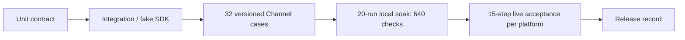
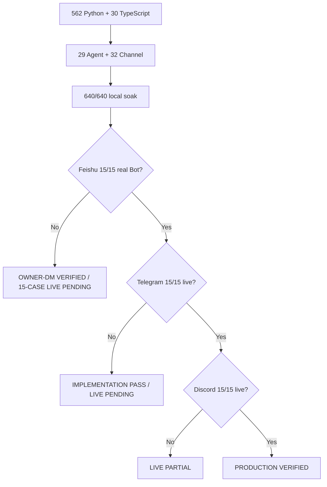

# Phase 5：测试、回归与真实平台验收

> 当前结论：**IMPLEMENTATION PASS**
>
> 当前全仓自动化证据：562/562 Python tests、30/30 TypeScript tests、29/29 offline Agent cases、
> 32/32 Channel cases、20 轮 640/640 Channel checks。
>
> Feishu：**FEISHU OWNER-DM DELIVERY VERIFIED / 15-CASE LIVE PENDING**。
>
> 外部证据：Telegram **LIVE PENDING**；Discord **LIVE PENDING**。

这份文档回答三个问题：每一层测试究竟证明了什么，代码改完后要跑哪些命令，以及为什么 640/640 仍不能写成
“真实 Telegram/Discord 已上线”。

## 1. 五层门禁



| 层 | 运行位置 | 使用真实什么 | 不证明什么 |
| --- | --- | --- | --- |
| Unit | 本地/CI | 真实 Adapter、Parser、状态对象 | 平台 SDK 和网络 |
| Integration | 本地/CI | SQLite、Manager、Delivery、Supervisor、fake SDK | Token、平台权限 |
| Versioned eval | 本地/CI | 场景数据、Workspace、Approval、恢复链路 | 平台 SLA |
| Local soak | 本地/CI | 32 条纵切重复 20 轮 | 真实限流和断网 |
| Live | 人工测试账号 | 官方服务、Token、权限、网络 | 长期生产稳定性 |

结论规则很简单：前四层全部通过叫 `IMPLEMENTATION PASS`；两个平台各自完成 live 才叫
`PRODUCTION VERIFIED`。只有一个平台 live 通过叫 `LIVE PARTIAL`。

## 2. Python 与 TypeScript 全量测试

```bash
uv run python -m unittest discover -s tests -v
pnpm --dir tui test
```

当前新鲜结果：

| Gate | Result |
| --- | ---: |
| Python | Phase 5 exit 483/483 PASS；当前全仓 562/562 PASS |
| TypeScript | 当前全仓 30/30 PASS |

Python 全量覆盖 Config、Provider、Turn、十个 Tool、Approval、Memory、Skills、TUI fallback、三平台 Adapter/
Transport、GatewaySupervisor、Doctor 和 eval harness。TypeScript 覆盖 pi-tui/Bridge 协议、长粘贴、选择、流式
渲染、Trace 与审批交互。

Node 必须满足 `>=22.19.0`。如果 shell 默认 Node 太旧，先修运行时；不要把旧 TypeScript 编译器报错归因到业务
代码。

## 3. 32 条 Channel 场景

数据位置：

```text
evals/scenarios/feishu-channel.v1.jsonl      12
evals/scenarios/telegram-channel.v1.jsonl   10
evals/scenarios/discord-channel.v1.jsonl    10
```

运行：

```bash
uv run miniclaw eval validate --root evals/scenarios
uv run miniclaw eval run --suite channel --root evals/scenarios
```

预期结尾：

```text
Channel eval: 32/32 passed, 0 failed
```

### Telegram 10 条

| ID | 验证事实 |
| --- | --- |
| `TELEGRAM-DM-001` | allowlisted DM 进入标准消息 |
| `TELEGRAM-GROUP-001` | 群聊 mention 进入 Agent |
| `TELEGRAM-GROUP-002` | 未 mention 静默忽略 |
| `TELEGRAM-REPLY-001` | reply Bot 与 topic identity |
| `TELEGRAM-DEDUPE-001` | message ID 只落 Inbox 一次 |
| `TELEGRAM-TOOL-001` | 真实 Workspace read Tool |
| `TELEGRAM-APPROVAL-001` | v2 envelope、Owner once、非 Owner 拒绝 |
| `TELEGRAM-DELIVERY-001` | 分片、retry-after 与幂等键 |
| `TELEGRAM-RESTART-001` | queued Inbox 重启恢复一次 |
| `TELEGRAM-ISOLATION-001` | Telegram 降级，peer reply 仍 durable |

### Discord 10 条

| ID | 验证事实 |
| --- | --- |
| `DISCORD-DM-001` | allowlisted DM 进入标准消息 |
| `DISCORD-GUILD-001` | Guild mention 进入 Agent |
| `DISCORD-GUILD-002` | 未寻址消息静默忽略 |
| `DISCORD-THREAD-001` | Thread 使用独立 conversation identity |
| `DISCORD-DEDUPE-001` | snowflake 只落 Inbox 一次 |
| `DISCORD-TOOL-001` | 真实 Workspace read Tool |
| `DISCORD-APPROVAL-001` | v2 envelope、Owner once、非 Owner 拒绝 |
| `DISCORD-DELIVERY-001` | 2000 上限链路、retry-after 与幂等键 |
| `DISCORD-RESTART-001` | queued Inbox 重启恢复一次 |
| `DISCORD-ISOLATION-001` | Discord 降级，peer reply 仍 durable |

飞书原有 12 条没有删除来“凑新数字”。case ID 全局排序；重复 ID、未知 fixture、错误 schema version、缺字段或
多字段均在 runner 启动前失败关闭。

## 4. 640-check local soak

```bash
uv run miniclaw eval run \
  --suite channel \
  --repeat 20 \
  --json \
  --root evals/scenarios
```

机器报告必须至少包含：

```json
{
  "suite": "channel",
  "suite_version": 1,
  "cases_per_run": 32,
  "repeat": 20,
  "checks": 640,
  "passed": 640,
  "failed": 0
}
```

报告还包含 40 位本地 commit、全部 case ID 与总耗时，但不包含环境变量、正文、路径、Token 或平台外部 ID。每个有
状态的 fixture 都重新建立临时 state，上一轮 SQLite 不会污染下一轮。

## 5. Live harness 的安全规则

Telegram/Discord 入口：

```bash
uv run python scripts/telegram_live_smoke.py
uv run python scripts/discord_live_smoke.py
```

不带 `--confirm-live` 时，两者在读取 `.env`、Token、状态目录或发起网络前退出 2。即使确认，脚本也不会调用 send
API；它只提示你在另一个终端启动 Gateway，并让你从自己的测试客户端发送消息。

真正执行时：

```bash
uv run python scripts/telegram_live_smoke.py --confirm-live
uv run python scripts/discord_live_smoke.py --confirm-live
```

前置条件：

1. 对应 Channel 在 `config.toml` 中 enabled；
2. Owner 在 allowed user list；
3. SDK extra 已安装；
4. `.env` 权限为 `0600` 且 Token 变量存在；
5. 22 项 Doctor 无 FAIL；
6. 全 Gateway preflight 通过；
7. 当前目录能解析出 40 位 commit。

Feishu 使用更严格的半自动 Runner，它自己管理 production Gateway，并只读验证 SQLite：

```bash
uv run python scripts/feishu_live_smoke.py --confirm-live
```

未给 `--confirm-live` 时，三个脚本都必须在读取 `.env`、状态目录和凭据前退出 2。Feishu 额外要求只启用
Feishu、worktree clean、没有旧 pending Approval，并在每个动作前捕获 checkpoint。完整说明见
[真实飞书 Bot 与 Live E2E](20260808_feishu-live-e2e.md)。

## 6. Telegram / Discord 每个平台 15 项真实验收

| Check | 人工动作与通过条件 |
| --- | --- |
| `auth_ready` | Gateway 获得 Telegram `get_me` 或 Discord READY |
| `dm_twenty_rounds` | 私聊连续 20 轮，无丢失/重复 |
| `group_addressing` | mention/reply 进入，未寻址消息静默 |
| `reply_or_thread` | Telegram reply/topic 或 Discord thread 保持独立会话 |
| `memory_restart` | 保存记忆，重启后仍能读取 |
| `read_tool` | 从配置 Workspace 读取合成哨兵文件 |
| `approval_approve_deny` | approve once 执行一次；deny 不执行 |
| `non_owner_denied` | 非 Owner 无法批准 |
| `duplicate_event_once` | 重投相同平台消息不产生第二条回复 |
| `long_text_split` | 中文、emoji、代码块分片完整且顺序正确 |
| `rate_limit_retry_after` | 平台 429 后按 Retry-After 恢复 |
| `gateway_restart_recovery` | queued/unknown 经重启恢复，无双发 |
| `network_reconnect` | 临时断网后当前平台恢复，其他平台不停 |
| `experience_fallback` | typing/preview 失败仍收到最终 durable 文本 |
| `secret_scan_zero` | 日志和 evidence 不含模型 Key/Channel Token |

输入只接受 `p/f/s`。任意 `fail` 或 `skip` 返回 1；只有 15 个全 `pass` 才返回 0。

## 7. Feishu 15 条真实验收

Feishu 不复用上面两个通用人工清单，而是使用 `FEISHU-LIVE-001..015` 版本化数据集：

| 组 | Case | 主要证据 |
| --- | --- | --- |
| 连通 | `001..002` | exact Gateway ready、Inbox、Turn、Delivery、客户端回复 |
| 上下文与 Tool | `003..005` | 同 Session 三轮、`system_info`、`read_file` |
| Approval | `006..008` | pending、跨 case consumed once、deny |
| Admission | `009..011` | 非 Owner/未 mention 静默、测试群 mention 回复 |
| 恢复与输出 | `012..014` | Unicode 分片、两次重启、WebSocket reconnect |
| 隐私 | `015` | Secret、平台 ID、正文与本机路径扫描为 0 |

自动 evidence 来自 checkpoint 后的真实 SQLite；人工只判断客户端可见事实。自动失败时不会出现“输入 p 强制通过”的
机会。Feishu 只有 15/15、Gateway 优雅退出、Secret scan 0、commit 未变化才返回 0。

## 8. Evidence 文件

默认目录：

```text
.local/eval-results/telegram/<UTC>.json
.local/eval-results/discord/<UTC>.json
.local/eval-results/feishu/<UTC>.json
```

`.local/` 已被 Git 忽略。JSON 只允许 channel、commit、起止时间、check name、pass/fail/skip 和匿名状态计数；不
保存 Token、完整 user/chat/guild/message ID、username、群名、正文或截图。脚本还会把内存中的 Secret 与本地小型
日志做精确字节匹配；发现命中时强制把 `secret_scan_zero` 改为 fail，但不会输出 Secret 内容。

Feishu Evidence 进一步使用 strict nested schema、0600、`O_EXCL` 和 `fsync`，并重新推导 count/release status 防止
篡改。当前真实 Gateway handshake 和两条 Owner DM Delivery 已通过，但尚未生成完整 15/15 Evidence，所以状态必须
保持 **OWNER-DM DELIVERY VERIFIED / 15-CASE LIVE PENDING**。真实运行记录见
[飞书 Gateway 运行时与 macOS 常驻](20260808_feishu-gateway-runtime-and-macos-service.md)。

## 9. 发布判定



当前发布结论是 `IMPLEMENTATION PASS`；Feishu 是 `FEISHU OWNER-DM DELIVERY VERIFIED / 15-CASE LIVE PENDING`，Telegram 和
Discord 是 `LIVE PENDING`。不要用 fake SDK、32/32、640/640 或 Runner 自测替代真实平台 evidence。
