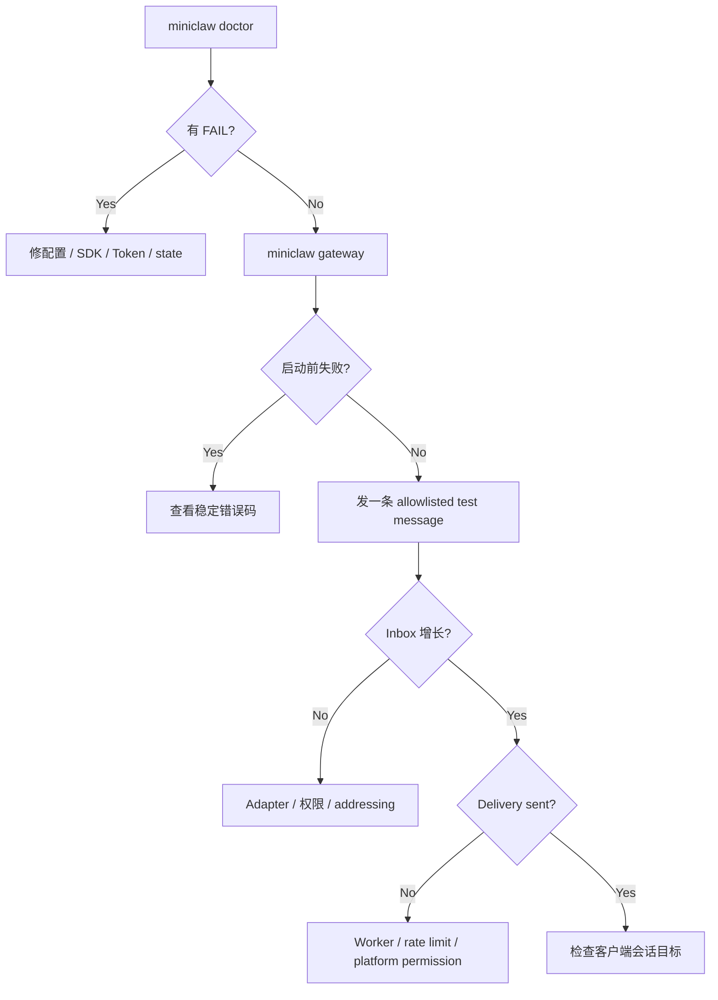

# Phase 5：Feishu / Telegram / Discord 故障排查手册

> 当前状态：**IMPLEMENTATION PASS**；671 Python tests、35 TypeScript、39/39 Agent、32/32 Channel、640/640 local soak。
>
> Feishu 是 **TARGETED CALLBACK LIVE VERIFIED / 15-CASE LIVE PENDING**；
>
> Telegram 与 Discord 都是 **LIVE PENDING**，所以本页给出可执行排查路径，不声称已在真实账号验证。

## 1. 先判断是哪一层坏了



不要一上来改 Provider Prompt。消息没进入 Inbox 时，模型根本还没有被调用。

## 2. Doctor 报 `unknown configuration key: tools.mode`

这是旧实验配置与当前严格 schema 不兼容，不是飞书 SDK、App ID 或模型 Key 失效。先做 owner-only 备份，再把：

```toml
[tools]
mode = "autopilot"
```

替换为：

```toml
[tools]
security = "allowlist"
ask = "on-miss"
```

然后重新运行 `uv run miniclaw doctor`。`allowlist + on-miss` 的含义是：精确规则可以放行，未命中进入 Owner 审批，
危险命令仍 fail closed。不要为恢复启动而把旧 `autopilot` 迁移成无审批执行。

## 3. Doctor 显示 SDK missing

症状：

```text
official Telegram SDK is not installed
official Discord SDK is not installed
```

修复：

```bash
uv sync --extra telegram
uv sync --extra discord
# 或三个平台一次安装
uv sync --extra channels
uv run miniclaw doctor
```

未启用的平台不要求安装 extra。普通 TUI import 也不会因为缺少 Telegram/Discord SDK 失败。

## 4. Token missing / `.env` 被拒绝

检查变量名，不要打印变量值：

```dotenv
MINICLAW_TELEGRAM_BOT_TOKEN=
MINICLAW_DISCORD_BOT_TOKEN=
```

`config.toml` 中 `bot_token_env` 必须指向对应变量名。`.env` 必须是 owner-only regular file：

```bash
chmod 600 .env
uv run miniclaw doctor
```

符号链接、目录、group/world-readable 文件都会在读取 Secret 前失败。不要把 Token 写进 TOML、命令行、日志或 issue。

## 5. Telegram 409 Conflict

含义：同一个 Bot Token 同时被多个 long-polling 进程消费，或者 webhook 仍占用更新来源。

排查：

1. 确认只有一个 `uv run miniclaw gateway`；
2. 停止旧本机进程、VPS service 或另一个开发终端；
3. 如果此前配置过 webhook，在 Bot 管理侧按官方方式移除；
4. 等旧 polling 请求结束后再启动；
5. 不要通过创建第二个 Manager 来“绕过”冲突。

MiniClaw 会把平台错误映射成稳定短码；错误正文和 Token 不进入日志。

## 6. Telegram 私聊没有响应

按顺序检查：

1. `channels.telegram.enabled = true`；
2. `owner_user_id` 是正整数且在 `allowed_user_ids`；
3. 消息来自该 numeric user ID，不使用 username 绑定 Owner；
4. Update 是普通未编辑文本，不是 service/non-text/bot message；
5. Gateway 已完成 `get_me` 并打印 ready；
6. Inbox 是否出现 `telegram/default` queued/running/completed 的匿名计数。

## 7. Telegram 群里不响应

必须同时满足：

- `allow_group_mentions = true`；
- signed chat ID 在 `allowed_chat_ids`；
- 发送者在 `allowed_user_ids`；
- 明确 mention 当前 Bot，或 reply 当前 Bot 的消息；
- 文本长度未超过配置上限。

未 mention 是设计上的静默，不是错误。forum topic 会成为独立 conversation；不要期望它自动继承另一个 topic 的短期
会话历史。

## 8. Discord READY 不到 / intent denied

MiniClaw 只启用：

- guilds；
- guild messages；
- DM messages；
- message content。

不会启用 members、presences、reactions 或 typing events。若登录成功但读不到正文，在 Discord Developer Portal 为测试
Bot 开启 Message Content Intent，并确认邀请权限允许查看频道与读取历史。修改后重启 Gateway。

## 9. Discord 403 / Missing Permissions

区分读取和发送：

- 读不到：View Channel、Read Message History、Message Content Intent；
- 发不出：Send Messages；
- Thread：Send Messages in Threads；
- DM：用户隐私设置或 Bot 与用户无共同 Guild 也可能阻止。

MiniClaw 始终使用 `AllowedMentions.none()`；模型生成 `<@...>` 不会真的 ping 用户。不要为了通过测试打开管理员权限。

## 10. Guild/Thread 消息被静默忽略

Guild 消息需要四层 admission：user、guild、parent channel allowlist，以及 mention/reply addressing。Thread 使用 parent
channel 的 allowlist，但 conversation identity 会附加 thread snowflake。检查的是 numeric snowflake，不是 Guild/
Channel 名称。

## 11. Rate limit 与 retry-after

现象：Delivery 状态进入 `retry_wait`。

这是可恢复状态，不应手工删除 SQLite 行。平台提供 Retry-After 时，Worker 使用该值并受本地最大退避约束；重试继续
复用同一 idempotency key。Telegram/Discord HTTP 本身不承诺该本地 UUID 是服务端幂等键，因此 unknown 状态仍需按
平台回执谨慎恢复。

如果持续限流：

1. 降低 progress update 频率；
2. 避免多个 gateway 使用同一 Token；
3. 查看是否长回复产生大量分片；
4. 等待 `next_attempt_at`，不要快速重启制造请求风暴。

## 12. Preview/Typing 坏了但最终回复正常

这是预期的故障隔离：Typing、可编辑 preview 是 best effort；最终回答一定先进入 durable Outbox。体验层失败会记录稳定
短码，但不会让 Turn 或 Delivery 失败。

只有最终 Delivery 也失败时，才继续排查发送权限、rate limit 或目标 conversation identity。

## 13. 一个平台 degraded，另一个是否该停

不该停。`GatewaySupervisor` 维护三条独立 pipeline：

```text
Transport → DeliveryWorker → ChannelManager
```

它们共享一个 `AgentRuntime`，但不共享网络 task、内存 queue 或 worker pool。运行期 Telegram 断线只把 Telegram 标为
degraded；Discord/飞书保持 ready。启动前静态配置错误则是 all-or-none：任何 enabled 平台配置不完整时，一个都不启动。

## 14. Approval 一直 pending

检查：

1. 命令格式必须精确：`/approve <id> once|session|always` 或 `/deny <id>`；
2. actor external user ID 必须等于配置的 Owner；
3. Approval 未过期、未决定、未消费；
4. Core grant modes 是否允许该 scope；
5. 文件写入不提供 session/always；
6. Gateway 重启后 pending card/text 是否被补发。

平台消息只请求 Core continuation；它不能直接执行 Tool。重复按钮或重复命令必须得到安全提示而不是再次执行。

## 15. Gateway 重启后消息重复或消失

事实源是 SQLite：

- `queued`：新 Manager feeder 恢复；
- `running` 且已绑定 Turn：标 interrupted，不盲目重放可能有副作用的 Tool；
- Delivery `sending`：先变 unknown，再按预算恢复；
- `sent`：不再发送；
- 相同 message ID：Inbox 不插入第二次。

不要删除数据库来“修”恢复问题；先用 32-case gate 复现，再增加稳定事故 case。

## 16. Secret scan 失败

立即停止发布。live harness 只报告命中数量，不显示内容。处理步骤：

1. 旋转可能泄露的模型 Key 和平台 Token；
2. 检查 `.local/eval-results/`、`~/.miniclaw/logs/` 和 shell history；
3. 从未推送 commit 中移除敏感内容；已推送则按平台和 Git 托管方的事故流程处理；
4. 增加回归测试，确保 `repr`、异常、Observer、evidence 不含值；
5. 重新执行 live 15 项，`secret_matches` 必须为 0。

## 17. Feishu Runner preflight 失败

Feishu Runner 只输出稳定错误码：

| 错误码 | 检查方向 |
| --- | --- |
| `feishu_channel_disabled` | 本地 `channels.feishu.enabled` |
| `peer_channel_enabled` | 本轮只允许 Feishu；暂时关闭 Telegram/Discord |
| `repository_commit_unavailable` | 是否在 Git worktree 内、HEAD 是否完整 |
| `repository_dirty` | 先检查并提交本轮代码/文档，不要盲目丢弃用户修改 |
| `doctor_preflight_failed` | 先单独运行 `miniclaw doctor` |
| `pending_approval_exists` | 明确处理上一轮遗留审批，Runner 不自动批准/拒绝 |
| `live_case_count_invalid` | 必须保留 `FEISHU-LIVE-001..015` 恰好 15 条 |
| `feishu_live_preflight_failed` | `.env`、SDK、Owner/App 关系或配置失败 |

未通过 preflight 时没有 Evidence 文件，因为失败发生在 Gateway 和输出目录创建之前。

## 18. Feishu Gateway ready，但收不到消息

按顺序排查：

1. 应用版本已经发布，并且 Owner 在可用范围；
2. 机器人能力已启用；
3. 长连接订阅了 `im.message.receive_v1`；
4. 私聊 read Scope 与 `send_as_bot` Scope 已审批生效；
5. Owner Open ID 是使用同一 Bot App 的 `miniclaw-e2e` profile 发现的；
6. `owner_open_id` 同时在 `allowed_open_ids`；
7. 群聊还需要唯一测试 Chat allowlist、`allow_group_mentions=true` 和明确 mention。

如果 Gateway ready 而 Inbox 没增长，先查平台权限/admission，不要改 Prompt。

### 日志出现 `This event loop is already running`

这是 `lark-channel-sdk 1.2.0` 的导入时 loop 绑定与 MiniClaw `asyncio.run()` 顺序冲突。当前 CLI 会在启动 Core loop
前预加载 SDK，Transport 再调用 `connect_until_ready()`，让 Supervisor 能继续启动 Worker。不要在已运行的 coroutine
里重新惰性 import SDK，也不要把前台阻塞 `connect()` 当 ready signal。

### 明明发了文字，却没有 `channel.inbound.accepted`

先检查 Adapter Audit 的 ignored reason。飞书富文本编辑器可能把普通文字发成 `msg_type=post`。当前实现接受 `text`
和 `post`，但只提取 official SDK 的安全 `body_text`；其他消息类型仍 fail closed。若运行旧提交，`post` 会被标成
`unsupported_message`。

### 回复成功但事后看不到 Typing 表情

Typing reaction 在 claim Inbox 后添加，在成功、失败或等待审批的 `finish()` 中移除。任务完成后查询 reaction 为 0
属于正常清理。最终闭环以 `channel.delivery.sent` 为准；处理期间是否可见需要在客户端实时观察。完整时序见
[飞书 Gateway 运行时与 macOS 常驻](20260808_feishu-gateway-runtime-and-macos-service.md)。

## 19. Feishu Case 007 永远不通过

Case 007 消费 Case 006 已创建的 pending Approval。Runner checkpoint 会保存动作前 pending Approval 的内部 ID，并允许
该行变成 consumed。常见失败原因：

- Case 006 其实没有落下 pending Approval；
- 点击的不是当前 Owner 绑定的卡片；
- Approval 已过期；
- 重复点击导致第一次已经消费，第二次只能安全拒绝；
- Tool 执行失败，因此绑定 ToolRun 不是 succeeded；
- 中途退出后下次 preflight 发现旧 pending，要求先人工处理。

不要通过修改 SQLite 状态来“通过”验收，那会让 Evidence 失去意义。

## 20. Feishu Evidence 或 Secret scan 失败

Evidence 只报告稳定错误码和命中数。它不会告诉你 Secret 或文件路径。如果 `secret_matches > 0`：

1. 停止发布并轮换可能泄露的模型 Key/App Secret；
2. 检查本机 ignored evidence、MiniClaw 日志和 shell history；
3. 确认 App Secret 从 stdin 输入，而不在 argv；
4. 确认日志没有完整 Open ID/Chat ID/Message ID、消息正文或 Home 路径；
5. 修复后重新完成 15 条，人工不能覆盖 `FEISHU-LIVE-015` 自动失败。

## 21. 标准诊断命令

```bash
uv run miniclaw doctor
uv run miniclaw eval run --suite channel --root evals/scenarios
uv run miniclaw eval run --suite channel --repeat 20 --json --root evals/scenarios
uv run python -m unittest tests.test_telegram_transport tests.test_discord_transport -v
uv run python -m unittest tests.test_channel_supervisor tests.test_channel_live_harness -v
uv run python -m unittest tests.test_feishu_live_e2e tests.test_feishu_evals -v
uv run ruff check .
```

当前门禁规模是 671 Python、35 TypeScript、39/39 Agent、32/32 Channel、640/640 local soak。状态为
**IMPLEMENTATION PASS**；Feishu **15-CASE LIVE PENDING**；Telegram/Discord **LIVE PENDING**。
