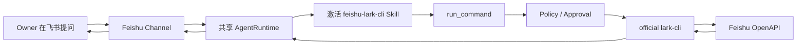
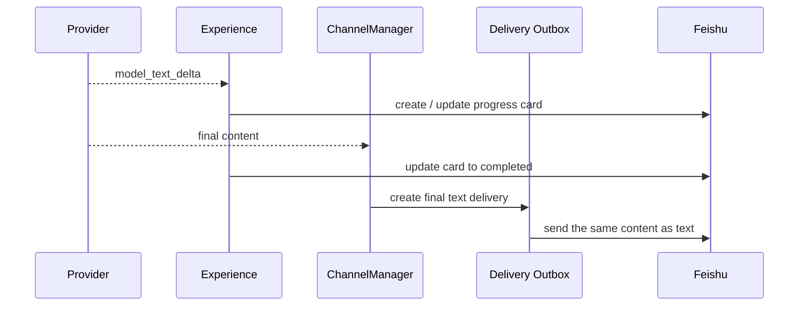
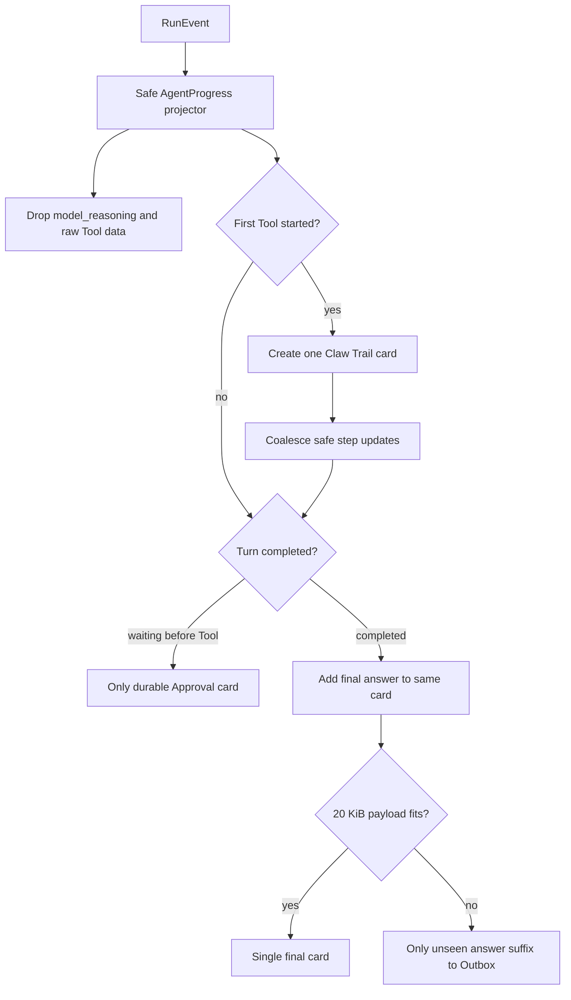
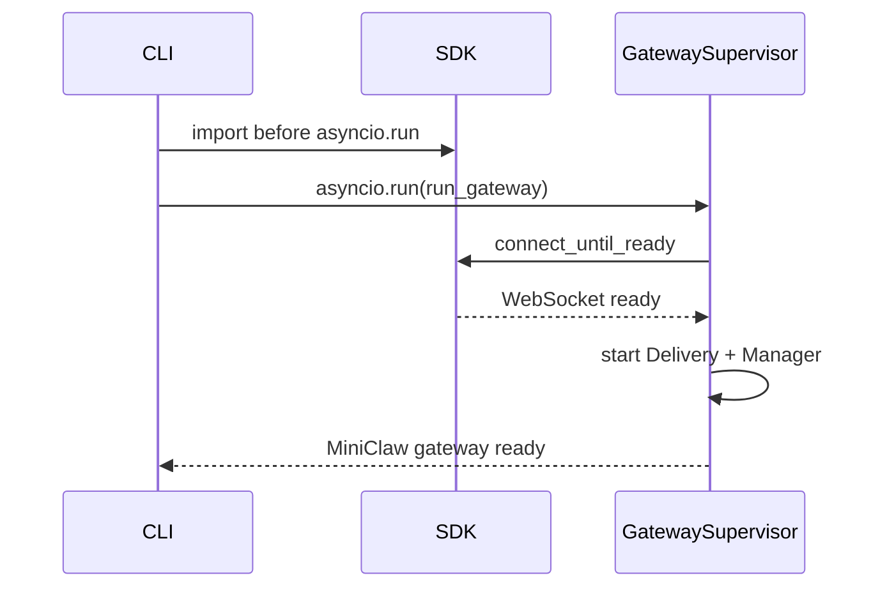

# v0.5.2 Stabilization：飞书单卡片回复与 lark-cli Skill 工程落地

> 编号说明：历史材料曾称“Phase 5.2”；它是稳定化交付版本，不是新的架构 Phase。

> 状态：代码与离线回归已完成；修复后 Owner DM 单卡已确认，完整 15-case 仍为 LIVE PENDING
> 当前基线：562/562 Python tests、30/30 TypeScript tests、29/29 offline Agent cases、32/32 Channel cases、640/640 local soak
> 适用版本：v0.5.2 Stabilization

## 1. 这次到底修了什么

这轮处理的是三个在真实飞书 Bot 上才暴露出来的问题：

1. Gateway 使用官方 Channel SDK 时可能报 `This event loop is already running`，或者 WebSocket 已连接但
   `miniclaw gateway` 一直等不到 ready；
2. 一次正常回答同时出现绿色 `MiniClaw 回复` 卡片和一条内容完全相同的普通文本；
3. 用户问“最近修改的飞书文档”时，Agent 口头回答“没有飞书 API 工具”，没有调用已经安装并登录的官方
   `lark-cli`。

修复后的用户体验是：

- 飞书卡片正文使用 Card JSON 2.0 的 `small`（12px）字号；
- 正常回答能完整放入时只保留一张最终绿色卡片；
- 回答超过 `message_max_chars` 时，卡片保存前缀，只有未展示后缀回复到机器人自己的卡片下方；
- 卡片创建或最终更新失败时才把完整正文回复原用户消息；
- completed Turn 重启恢复时复用稳定 progress UUID，不追加重复普通全文；
- waiting approval 只发布 durable Approval card；
- Telegram / Discord 继续使用 preview + durable final text，不受飞书策略影响；
- 飞书业务查询不新增一套 API Tool，而是由 `feishu-lark-cli` Skill 教 Agent 使用现有
  `run_command(program="lark-cli", args=[...])`；
- Tool Call 流式分片中的空名称续片不会覆盖已经确认的合法 Tool 名。

`small` 只提高屏幕上的视觉密度，不改变飞书 API 的字符上限；真正超过上限的内容仍必须走“卡片前缀 + 后缀回复”。

## 2. 两条“飞书能力”不要混为一谈

MiniClaw 里的飞书有两层：

| 层 | 解决的问题 | 当前实现 |
| --- | --- | --- |
| Channel | 从飞书收到消息、把回答送回飞书 | official Channel SDK + WebSocket + Card |
| Business API | 查询文档、消息、日历、任务等真实业务数据 | Skill + `run_command` + official `lark-cli` |

只接通 Channel，不代表 Agent 自动知道每个业务 API 的命令。旧实现能够收发飞书消息，也能发现并启动
`lark-cli`，但缺少自然语言到 CLI argv 的说明，因此 Provider 选择了口头拒绝。



这条链路刻意不增加 `feishu_search_documents`、`feishu_calendar` 等重复包装 Tool。以后扩展飞书业务域时，优先
更新 Skill 的命令映射；执行、安全、审批、超时、日志和 ToolRun 仍复用同一个 `run_command`。

## 3. 为什么之前会同时发卡片和文本

旧链路把进度卡和最终文本看作两次独立投递：



这个设计对 Telegram / Discord 是合理的：它们的 preview 完成后会提示“最终内容见下一条消息”。飞书卡片本身却已经
能够完整承载最终 Markdown，所以再发文本就是重复。

## 4. 新的单卡片状态机

`ChannelExperience` 新增平台装配参数 `progress_is_final`，默认是 `false`。只有飞书装配时设为 `true`。



关键语义：

- `model_reasoning`、原始 Tool 参数/输出、凭据和文件内容不会被保留或渲染；“过程摘要”只来自公开 preamble 与
  确定性状态文案，不代表隐藏思维链；
- 卡片最多展示 16 步，每字段最多 240 字符；trace metadata 最大 16 KiB，Card JSON 最大 20 KiB；
- `ExperienceOutcome.final_delivery_required=false` 只会在最终卡片成功承载完整正文后出现；
- 超限但最终卡片成功时，Outcome 返回 `final_delivery_offset` 和 `final_reply_to_message_id`，Manager 只切出
  `content[offset:]`，不会重复卡片内前缀；
- 没有 Tool 或流式 delta 时，`finish()` 仍会直接创建一张带最终正文的 completed card；
- `progress_is_final=true` 时第一次 `tool_started` 才建立 Agent 卡；首次 Tool 前等待审批不会创建 progress 卡；
- Provider 在终态前失败时不创建飞书卡片，普通失败提示继续进入 Outbox；
- 卡片创建失败或最终更新失败后，普通文本 fallback 仍存在；
- 即使 tool-call 响应同时带可见 content，waiting approval 也丢弃 preview，因此唯一终态是 durable Approval card；
- `ChannelManager` 只跳过普通 message delivery，不改变 Inbox、Turn、Assistant Message 和 Audit 的结算。

### 4.1 平台行为矩阵

| 场景 | 飞书 | Telegram | Discord |
| --- | --- | --- | --- |
| 正常回答 | 一张 Claw Trail completed card | compact trail + final text | compact trail + final text |
| 回答超过卡片上限 | 12px card 前缀 + 回复卡片的后缀分片 | preview + final text | preview + final text |
| 无流式 delta | finish 时创建 completed card | final text | final text |
| progress 失败 | text fallback | final text | final text |
| Provider 失败 | failure text | incomplete preview + failure text | incomplete preview + failure text |
| waiting approval | Approval card | Approval text | Approval text / platform展示 |

### 4.2 当前持久性边界

Assistant 完整正文始终持久化在 SQLite `messages`，最终脱敏步骤写入同一消息的
`metadata_json.experience_trace`；Inbound/Turn/Audit 也会结算。短回答的成功卡片不额外创建普通 Outbox；长回答只把
卡片未展示的后缀写进 Outbox。重启恢复从 trace 重建同样的 Claw Trail，缺失或损坏的旧 trace 退化为答案单卡。

`ChannelManager.start()` 的恢复流程现在是异步的。发现遗留 running Inbox 对应 completed Turn 时，它读取完整
Assistant Message，用原 Inbox key 派生和首次运行相同的 progress UUID，再次 `create/update` 同一卡片。官方发送
请求的 UUID 与现有 Delivery retry 使用同一幂等原则：若远端卡片已经成功，恢复取得同一 message ID；若尚未发送，恢复
创建并完成它。之后才按 Outcome 幂等创建零条或仅后缀 Delivery，最后结算 Inbox。因此“远端卡片已成功、进程在
`mark_completed()` 前退出”不会再补发重复全文。若卡片恢复失败，系统仍以完整文本 fallback，优先保证正文不丢失。

## 5. Gateway lifecycle 修复

官方 `lark-channel-sdk 1.2.x` 在导入阶段会准备自己的 event loop。旧入口在 `asyncio.run()` 内第一次导入 SDK，导致
SDK 尝试管理已经运行的 loop。

当前 CLI 在进入 `asyncio.run(run_gateway(...))` 前调用 `_prime_gateway_channel_sdks()`。可选 SDK 不存在时不影响
本地 TUI；SDK 自身依赖损坏时返回稳定 `GatewayConfigError`，不输出 App Secret。

第二个问题是 SDK 的 `connect()` 属于前台阻塞入口；MiniClaw 需要“连接 ready 后返回，继续启动 Manager / Delivery”。
`FeishuTransport.connect()` 现在优先调用公开的 `connect_until_ready()`，老 SDK 没有该方法时才兼容回退
`connect()`。



## 6. `feishu-lark-cli` Skill

`miniclaw init` 现在会在文件不存在时创建：

```text
~/.miniclaw/skills/feishu-lark-cli/SKILL.md
```

重复 `init` 不覆盖用户已经修改过的 Skill。`SkillLoader` 只读 frontmatter 参与匹配；当前 Query 命中后才加载正文，
并把 Skill 名、版本和内容 hash 写进 runtime snapshot。

对于事故 Query：

```text
你帮我看看我最近更改的飞书文档是哪两个
```

Skill 给 Provider 的确定映射是：

```json
{
  "program": "lark-cli",
  "args": [
    "drive", "+search", "--as", "user",
    "--query", "",
    "--edited-since", "30d",
    "--sort", "edit_time",
    "--page-size", "2",
    "--format", "json"
  ]
}
```

这里的安全边界没有变化：

- 子进程使用固定 Workspace、最小 PATH、Owner Home、stdin EOF、超时和 1 MiB 双流上限；
- 不经过 Shell，不接受管道、重定向或拼接字符串；
- 个人云数据使用 `--as user`，认证由 `lark-cli` 管理，MiniClaw 不复制凭据；
- `safe` / `smart` 下未命中 exact rule 会生成参数绑定 Approval；
- 可信 Owner 的 `autopilot` / `yolo` 可在硬校验后自动运行；
- 群聊或非 Owner 即使进程处于 autopilot 也会降级到审批；
- 高风险 CLI 动作没有 Owner 的明确批准时不能追加 `--yes`。

## 7. Provider Tool Call 兼容修复

部分 OpenAI-compatible 流式端点会这样发送 Tool Call：

1. 第一片：`name="glob"`，arguments 只有前半段；
2. 第二片：`name=""`，arguments 继续传后半段。

空字符串不是新的 Tool 名，它只是兼容网关的续片占位。Provider 解析器现在只在 `name` 非空时更新聚合器；最终仍要求
必须存在合法 Tool 名和 JSON object 参数。数组、数字、非法 JSON 或从未提供名称仍然 fail closed。

## 8. 回归与验收

新增永久事故场景：

| ID | Query | 必须发生 | 禁止发生 |
| --- | --- | --- | --- |
| `FEISHU-LARK-DOCS-001` | 最近更改的两个飞书文档 | `run_command → lark-cli drive +search` | 声称没有 API、搜索本地 Workspace |

相关自动化覆盖：

- `tests/test_channel_experience.py`：completed card、刚好上限、overflow offset/card target、失败 fallback、无 delta；
- `tests/test_channel_manager.py`：成功无普通全文、后缀回复卡片、waiting approval 单卡片、completed restart UUID 恢复；
- `tests/test_channel_capabilities.py` + `tests/test_feishu_transport.py`：两个 Card renderer 的 12px `small` payload；
- `tests/test_feishu_transport.py`：`connect_until_ready()`；
- `tests/test_cli.py`：SDK 在主 loop 前导入；
- `tests/test_context.py`：飞书 Query 激活 Skill；
- `tests/test_openai_compatible_provider.py`：空 Tool 名续片；
- `tests/test_eval_cases.py` + `personal.v1.jsonl`：直接 lark-cli argv 契约。

发布门禁：

```bash
uv run python -m unittest discover -s tests -q -b
pnpm --dir tui test
uv run miniclaw eval run --suite offline --root evals/scenarios
uv run miniclaw eval run --suite channel --root evals/scenarios
uv run miniclaw eval run --suite channel --repeat 20 --json --root evals/scenarios
uv run ruff check .
uv run python scripts/validate_docs.py
uv build
git diff --check
```

真实验收需要 Owner 单独确认两类外部动作：

1. 通过真实 Bot 再发送短回答与超长回答，人工确认短回答只有一张 12px 卡片，超长回答只在卡片下补充后缀；
2. 通过真实 DeepSeek 运行飞书文档查询，因为标题和 URL 会作为 Tool Result 发送给模型 Provider。

没有明确授权时，自动化门禁不能代替这两条 privacy-sensitive live evidence。
