# Memory Autopilot A～E 工程实现

> 实现日期：2026-08-09
>
> 状态：**IMPLEMENTATION PASS**
>
> 边界：单本地 Owner、Markdown Truth、SQLite Control Plane、离线确定性证据；不声称真实 IM 平台 Live PASS。

MiniClaw 采用混合方案：借鉴腾讯 Agent Memory 的结构化提取、分层状态和可检索 Projection，同时保留
EverOS 风格的 Owner 可见 Markdown、持续整理和可直接维护体验。最终约束是“Markdown 保存已接受语义真相，
SQLite 保存消息、队列、lease、候选、来源、审计、Review 和可重建 FTS5 Projection”。

## 1. 数据流

```mermaid
flowchart LR
    ENTRY["TUI / Feishu / Telegram / Discord"] --> DISCLOSE["DisclosureContext"]
    DISCLOSE --> TURN["TurnService"]
    TURN --> BUFFER["durable source-range buffer"]
    BUFFER --> FLUSH["lease + FlushCoordinator"]
    FLUSH --> EXTRACT["Provider candidate only"]
    EXTRACT --> POLICY["Core validator + promotion"]
    POLICY --> MARKDOWN["owner Markdown truth"]
    MARKDOWN --> UNIT["SQLite Unit + Source"]
    UNIT --> FTS["disposable FTS5 projection"]
    FTS --> CONTEXT["budgeted private recall"]
    POLICY --> REVIEW["Owner Review"]
    REVIEW --> MARKDOWN
```



普通 Turn 只写不复制正文的 durable buffer，不等待模型提取。明确“记住”走同步 Markdown-first 提交，只有
原子替换成功后才向 Agent 报告成功。Worker 在五条 pending Turn、显式 flush、pre-compaction、关闭或十分钟
周期到达时被唤醒；同一 source range、candidate 和 Unit 都有稳定幂等键。

## 2. Owner 与 Disclosure

- 本地 Owner 只有一个 `owner_id`，不同平台账号和 Session 只作为来源；
- TUI 与经过 Core 验证的 Owner 私聊可以读取私人 Memory；
- 群聊、非 Owner、未知身份、映射冲突或缺失 Disclosure 一律返回空结果；
- Channel Adapter 和模型参数不能提供或覆盖 owner、scope、status、source、时间与 hash；
- Memory 只提供上下文，不能扩大 Tool Policy、Workspace、Approval 或 Sandbox 权限。

## 3. 捕获、提取与晋升

`memory_buffers` 保存 Owner、Session、Turn 和 message ID range，不复制消息正文。Flush claim 使用
`BEGIN IMMEDIATE` 与带时区 UTC lease。Provider 只返回候选文本、kind、confidence、sensitivity 和当前批次的
user message IDs；Core 再执行以下确定性判断：

| 输入 | 结果 |
| --- | --- |
| 凭据、Token、OTP、私钥、Authorization | 在 Candidate Repository 前拒绝 |
| 伪造 source、低置信或无直接 User 来源 | 拒绝且不保留正文 |
| 首次低风险事实 | `short_term`，默认 30 天 TTL |
| 独立来源重复确认 | 合并来源并晋升 `active` |
| 高敏事实、行为/权限规则 | `review_required` |
| 与当前 active key 冲突 | `review_required`，旧事实继续生效 |

模型没有 Review approve/reject Tool。只有本地 Owner UI 携带当前 `preview_hash` 才能消费 Review；过期、重放、
跨 Owner 或目标变化均失败。

## 4. Markdown Truth 与恢复

已接受 Unit 位于 `memory/owners/<owner_id>/memory.md`。每个 block 保存稳定 Unit ID、语义 key、正文、状态、
confidence、sensitivity、有效期和内部 SourceRef。写入持有 owner/path lock，并按“同目录临时文件 → flush/fsync →
`os.replace` → 目录 fsync → manifest checkpoint”发布。

Crash 恢复遵循以下顺序：

1. Markdown 前失败：Run 进入指数退避 `retry`，source range 不丢失；
2. Markdown 已提交、Projection 失败：Run 保持 `projection_pending`，重启只重跑 Projection；
3. Projection 与 buffer：在一个 SQLite 事务中完成，避免 Unit 已可见但 buffer 未结算；
4. 过期 `running` lease：启动/周期维护回收到 `retry`；
5. FTS5 丢失或漂移：从 `memory_units` 重建，不改 Markdown 真相。

## 5. Recall、治理与直接维护

FTS5 使用 owner、private scope、`active/short_term` 状态和有效期做 SQL 前后双重过滤。中文查询增加稳定 CJK
搜索 shadow；默认 Recall@5，按完整 Unit 注入固定预算，不截断成失去来源的半条事实。

纠错创建新 Unit 并引用新 User Source，Owner 批准后旧 Unit 才进入 `superseded`。Forget 先创建 hash-bound
预览，批准后进入 `archived`，正文退出 Recall，但保留来源和不含正文的审计。每日维护处理 TTL；每周维护只生成
Profile Review，不静默重写 active Memory。

Owner 可以直接编辑 Markdown。启动、周期和 `/memory rebuild` 会比较 manifest hash/mtime：

- 完整合法文件在一个事务中更新 Unit、Source、搜索 shadow、manifest 与 `manual_edit` 审计；
- 重复 ID/正文、坏 metadata、非法 source/状态、缺块或 Secret 使整次对账 fail closed；
- 坏文件原样保留，最后一次有效 Projection 继续服务，Doctor 只报告路径、行号和短码。

旧 `MEMORY.md` 与 `memory/YYYY-MM-DD.md` 在兼容期只读导入。Importer 以源文件 SHA-256 幂等记录，合成 Source
只保存 hash 与安全 metadata，不复制 legacy 正文；原文件不改、不删。

## 6. 用户与运维入口

Agent Tool surface 包含 `memory_remember`、`memory_search`、`memory_get`、`memory_list`、`memory_flush`、
`memory_forget`、`memory_correct` 和 `memory_review_list`。旧 `read_memory` / `propose_memory` 在兼容期保留。

TUI 支持：

```text
/memory status
/memory list [limit]
/memory search <query>
/memory why <unit-id>
/memory flush
/memory review
/memory forget <unit-id>
/memory approve <review-id> <preview-hash>
/memory reject <review-id> <preview-hash>
/memory rebuild
```

`miniclaw doctor` 的 Memory 项只读报告 parser error、manifest/Projection drift、retry、dead-letter、stale lease
和 legacy migration 计数，不输出 Memory 正文。

## 7. Versioned gate

`evals/scenarios/memory.v1.jsonl` 提供 `MEM-AUTO-001..010`。Schema 只接受十个白名单 production fixture 与
封闭 evidence key，不允许场景携带任意脚本、Owner ID、状态或凭据字段。覆盖：四入口 Owner Space、Disclosure、
明确记忆/重启/遗忘、Secret/source 拒绝、short-term/晋升、Review、冲突/纠错、Provider/Crash 恢复、direct edit、
legacy migration 和中文 Recall@5。

```bash
uv run miniclaw eval validate --root evals/scenarios
uv run miniclaw eval run --suite offline --root evals/scenarios
uv run python -m unittest tests.test_memory_release_smoke -v
```

完整发布证据见 [v0.6.0 Eval Record](../../evals/releases/v0.6.0.md)。
