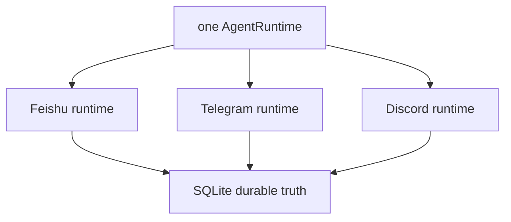

# Phase 5：完成性审计与证据矩阵

> 审计日期：2026-08-08
>
> 发布口径：**IMPLEMENTATION PASS / LIVE PENDING**
>
> 当前全仓门禁：492/492 Python、30/30 TypeScript、28/28 Agent、32/32 Channel、
> 640/640 local soak。

这份表把 Phase 5 的要求逐项映射到代码、自动化证据和仍需真实平台完成的 evidence。它用于防止“代码文件存在”被
误写成“真实可用已经验证”。

## 1. 总体判定

| 范围 | 代码 | 自动化 | Live | 结论 |
| --- | --- | --- | --- | --- |
| Telegram | 完整 | PASS | PENDING | IMPLEMENTATION PASS |
| Discord | 完整 | PASS | PENDING | IMPLEMENTATION PASS |
| Single-runtime Gateway | 完整 | PASS | 三平台并发待凭据 | IMPLEMENTATION PASS |
| 飞书兼容性 | 保持 | 12/12 PASS | 仍 PENDING | 兼容回归 PASS |
| Phase 5 总体 | 完整 | PASS | 两个平台 PENDING | 非 production verified |

## 2. Config、安装与 Doctor

| Requirement | Code | Test / evidence | Result |
| --- | --- | --- | --- |
| 强类型 Telegram 配置 | `config.py: TelegramConfig` | `tests/test_config.py` | PASS |
| 强类型 Discord 配置 | `config.py: DiscordConfig` | `tests/test_config.py` | PASS |
| signed chat ID / snowflake 边界 | config helpers | bool、0、越界、重复 ID tests | PASS |
| enabled Owner 必须 allowlisted | relationship validation | config + preflight tests | PASS |
| Token 只保存 env 变量名 | config + gateway preflight | repr/secret tests | PASS |
| 可选 SDK extras | `pyproject.toml` | lazy import/package tests | PASS |
| bootstrap 默认 disabled | `bootstrap.py` | bootstrap snapshot tests | PASS |
| 离线 22 项 Doctor | `doctor.py` | `tests/test_doctor.py` | PASS |

## 3. 平台无关 Core 边界

| Requirement | Code | Evidence | Result |
| --- | --- | --- | --- |
| 一个 AgentRuntime | `gateway.create_gateway_supervisor` | factory single-runtime test | PASS |
| 每平台独立 pipeline | `channels/supervisor.py` | lifecycle/isolation tests | PASS |
| generic manager limits | `runtime.ChannelLimits` | contract/factory tests | PASS |
| neutral Delivery errors | `ChannelTransportError` | retry-after mapping tests | PASS |
| neutral Approval envelope v2 | `channels/approvals.py` | v1 read/v2 write/parser tests | PASS |
| Feishu v1 pending 仍可读 | parser compatibility | approval fixture | PASS |
| Experience best effort | `channels/experience.py` | typing/preview failure tests | PASS |
| durable final delivery | SQLite Outbox + Worker | delivery/manager tests | PASS |

## 4. Telegram

| Requirement | Implementation | Automated proof | Result |
| --- | --- | --- | --- |
| pure Adapter | `channels/telegram.py` | admission matrix | PASS |
| DM allowlist | numeric user ID | `TELEGRAM-DM-001` | PASS |
| group mention/reply | user + chat + addressing | group/reply cases | PASS |
| forum topic identity | `chat:<id>:topic:<id>` | `TELEGRAM-REPLY-001` | PASS |
| bot/service/edit/non-text filter | Adapter | focused unit tests | PASS |
| official long polling | PTB facade | lifecycle fake SDK tests | PASS |
| message-only updates | allowed updates contract | Transport test | PASS |
| Unicode entity mapping | UTF-16 span conversion | focused tests | PASS |
| safe send/edit/typing | Transport facade | delivery/experience tests | PASS |
| 409/rate limit mapping | stable error codes | transport tests | PASS |
| code-fence-aware split | splitter | boundary tests + eval | PASS |
| real Bot auth/network | external platform | live harness 15 steps | LIVE PENDING |

## 5. Discord

| Requirement | Implementation | Automated proof | Result |
| --- | --- | --- | --- |
| pure Adapter | `channels/discord.py` | admission matrix | PASS |
| DM allowlist | numeric snowflake | `DISCORD-DM-001` | PASS |
| Guild admission | user + guild + channel + addressing | Guild cases | PASS |
| Thread identity | parent allowlist + thread suffix | `DISCORD-THREAD-001` | PASS |
| bot/webhook/system filter | Adapter | focused unit tests | PASS |
| minimal explicit intents | `DiscordIntents` | exact intent tests | PASS |
| login/READY/resume/close | discord.py facade | lifecycle fake SDK tests | PASS |
| AllowedMentions.none | send facade | transport tests | PASS |
| safe send/edit/typing | Transport facade | delivery/experience tests | PASS |
| 403/rate limit/Gateway mapping | stable error codes | transport tests | PASS |
| real Bot auth/network | external platform | live harness 15 steps | LIVE PENDING |

## 6. Supervisor 与恢复

| Requirement | Automated evidence | Result |
| --- | --- | --- |
| enabled channels 固定顺序 | preflight tests | PASS |
| 静态配置 all-or-none | provider/network 未创建断言 | PASS |
| pipeline 内连接→Delivery→Manager | supervisor lifecycle trace | PASS |
| 反向停止且 Runtime 一次关闭 | shutdown/force tests | PASS |
| 运行期 degraded 局部化 | supervisor + isolation eval | PASS |
| queued Inbox 恢复 | Telegram/Discord restart eval | PASS |
| running Turn 不盲重放 | Feishu retained eval/tests | PASS |
| Delivery UUID 跨重试稳定 | two new delivery evals | PASS |

## 7. 回归数据与本地 soak

| Gate | Expected | Actual | Result |
| --- | ---: | ---: | --- |
| Python unittest | all pass | Phase 5 exit 483/483；当前 492/492 | PASS |
| TypeScript | all pass | 25/25 | PASS |
| Offline Agent | all active | 28/28 | PASS |
| Feishu Channel | retain old | 12/12 | PASS |
| Telegram Channel | exact matrix | 10/10 | PASS |
| Discord Channel | exact matrix | 10/10 | PASS |
| Combined Channel | 32 | 32/32 | PASS |
| 20-run soak | 640 | 640/640 | PASS |
| Ruff | no findings | PASS | PASS |

JSON report 包含 `cases_per_run=32`、`repeat=20`、`checks=640`、commit 和 case IDs；没有环境、正文、路径、
Secret 或外部 ID。

## 8. Live harness 审计

| Safety requirement | Evidence | Result |
| --- | --- | --- |
| 默认不读取 Token/状态/网络 | 两脚本 no-confirm subprocess tests | PASS |
| 必须 `--confirm-live` | exit 2 test | PASS |
| 不调用 send API | source contract test | PASS |
| enabled/Doctor/preflight/commit fail closed | focused tests | PASS |
| 固定 15 项 | exact checklist test | PASS |
| skip/fail 返回非零 | evidence test | PASS |
| ignored 本地目录 | `.gitignore: .local/` | PASS |
| evidence allowlist schema | JSON schema assertions | PASS |
| 日志 Secret 精确扫描 | bounded byte scan | PASS |
| Telegram 真实 evidence | 尚无账号/凭据 | LIVE PENDING |
| Discord 真实 evidence | 本轮未提供凭据 | LIVE PENDING |

## 9. 安全不变量

- Token 不进入 config dataclass、SQLite、异常、repr、eval 或文档；
- Owner 只绑定 numeric platform ID，不使用 username/display name；
- 群/Guild 默认关闭；开启后仍需要 allowlist 和 mention/reply；
- 模型文本不能 ping Discord 用户；
- 平台按钮/文本只进入 Core Approval continuation；
- Tool 继续经过同一个 Policy/Executor；
- Typing/preview 不能取代 durable final Delivery；
- 一个 Channel 运行期故障不能关闭另外两个；
- 没有 live evidence 就不能写 production verified。

## 10. 未完成但不阻塞 implementation 的事项

1. Telegram 真实 Bot 15/15；
2. Discord 真实 Bot 15/15；
3. 飞书既有真实 WebSocket exit gate；
4. 长期 VPS soak 与平台 SLA 观察；
5. Phase 6 反馈→提案→评测→人工批准的受控演进；
6. Phase 7 Docker/VPS 发布闭环。

因此当前唯一准确写法是：**Phase 5 IMPLEMENTATION PASS；Telegram LIVE PENDING；Discord LIVE PENDING；
整体不是 PRODUCTION VERIFIED。**
