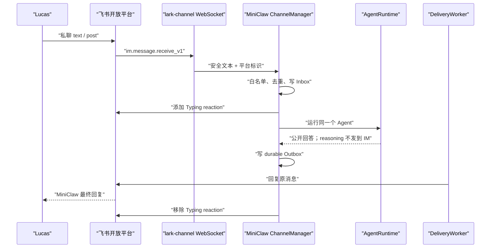
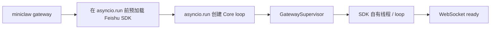
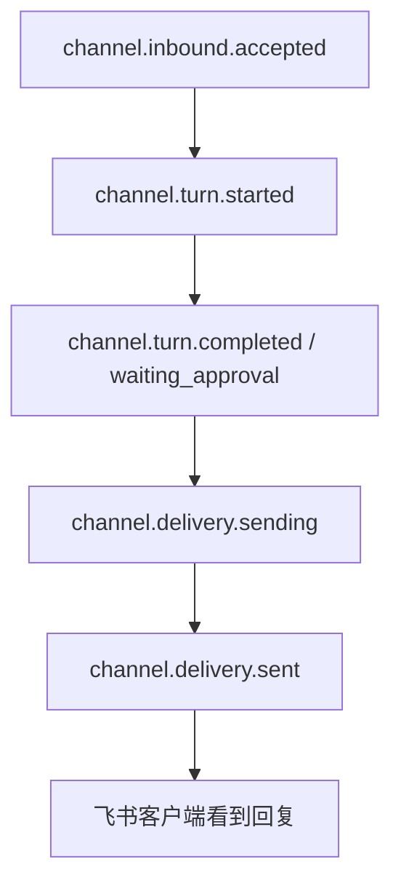
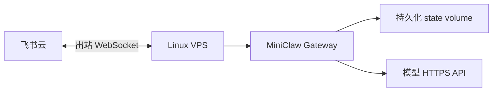

# Phase 5.1：飞书 Gateway 运行时、处理中表情与 macOS 常驻

> 当前状态（2026-08-08）：**REAL BOT CONFIGURED / GATEWAY READY VERIFIED / OWNER-DM DELIVERY VERIFIED / 15-CASE LIVE PENDING**。
>
> 两条真实 Owner 私聊已依次经过 WebSocket、Adapter、durable Inbox、AgentRuntime、durable Outbox 和
> DeliveryWorker；两条 Delivery 都是一次发送成功。全套 `FEISHU-LIVE-001..015` 尚未完成，所以不能写成
> `FEISHU_E2E_VERIFIED`。

这份文档只回答运行时问题：为什么之前收不到消息、现在一条消息怎样被处理、处理中表情何时出现，以及怎样让
Gateway 在 Mac 或 VPS 上长期运行。飞书应用创建、Scope、15 条真实验收和 Evidence 格式见
[真实飞书 Bot 与 Live E2E](feishu-live-e2e.md)。

## 1. 当前真实链路



Typing 是非权威、best-effort 的体验信号；最终回复才是 durable truth。表情在任务完成后会被移除，因此事后查询
最新消息的 reaction 数量为 0 是正常现象。是否真正完成要看 `channel.delivery.sent` 和 `deliveries.status=sent`，
不能只看表情。

## 2. 本次真实故障的根因

### 2.1 SDK Event Loop 绑定错误

`lark-channel-sdk 1.2.0` 在模块导入时保存一个模块级 asyncio event loop。旧实现直到
`asyncio.run()` 已经启动后才惰性导入 SDK，SDK 工作线程随后对同一个运行中的 loop 调用
`run_until_complete()`，最终出现：

```text
This event loop is already running
```

修复后的启动顺序是：



这不是通过吞掉异常处理的；CLI 测试固定了“先预加载、后启动 asyncio loop”的顺序。

### 2.2 错用了前台阻塞连接入口

SDK 的 `connect()` 是前台生命周期入口，正常连接期间不会返回。MiniClaw 需要在 WebSocket ready 后继续启动
Inbox Worker 和 Delivery Worker，所以 Transport 优先调用 `connect_until_ready()`；只有旧版 SDK 不提供该方法时
才回退到 `connect()`。

### 2.3 飞书把看似普通文字送成 `post`

真实客户端消息不一定都是 `msg_type=text`。富文本编辑器可能把只含一段文字的消息发成 `post`。旧 Adapter 只接收
`text`，所以消息在进入 Inbox 前被静默归类为 `unsupported_message`。

当前 Adapter 接收 `text` 和 `post`，但两者都只使用 official SDK 解析出的安全 `body_text`；不把富文本原始 JSON、
图片、附件或任意卡片对象直接交给模型。

## 3. 前台调试

仓库根目录执行：

```bash
uv run miniclaw doctor
uv run miniclaw gateway
```

正常启动至少应看到以下稳定事件：

```text
channel.transport.connected
channel.supervisor.ready
MiniClaw gateway ready: feishu/default
```

收到一条 Owner 私聊后，判断顺序是：



日志和 Audit 只保留内部 ID、短哈希、稳定错误码和耗时，不记录正文、App Secret、完整 Open ID、Chat ID 或
Message ID。

## 4. “收到就给表情”的语义

`ChannelManager` claim 一条 Inbox 后立即创建 `ExperienceActivity`：

1. `start()` 调用 Feishu `add_typing_reaction`；
2. Agent 运行期间可以更新安全 progress preview；
3. 成功、失败、等待审批都进入 `finish()`；
4. `finish()` 在 `finally` 中移除 Typing reaction；
5. reaction 失败不阻止 durable Delivery。

自动化测试必须覆盖：添加、移除、添加失败、移除失败、Agent 失败和重复 `finish()`。真实验收还需要 Owner 在客户端
观察表情是否在处理期间可见；因为完成后会主动清理，事后 API 查询不能替代这个人工证据。

## 5. macOS 后台常驻

Mac 上推荐使用用户级 `launchd`，而不是 `nohup` 或一直开着 Terminal。下面是模板；所有路径必须改成当前机器的
绝对路径，plist 不展开 `~`。

```xml
<?xml version="1.0" encoding="UTF-8"?>
<!DOCTYPE plist PUBLIC "-//Apple//DTD PLIST 1.0//EN"
  "http://www.apple.com/DTDs/PropertyList-1.0.dtd">
<plist version="1.0">
<dict>
  <key>Label</key>
  <string>io.miniclaw.gateway</string>
  <key>ProgramArguments</key>
  <array>
    <string>/absolute/path/to/miniclaw/.venv/bin/miniclaw</string>
    <string>gateway</string>
  </array>
  <key>WorkingDirectory</key>
  <string>/absolute/path/to/miniclaw</string>
  <key>RunAtLoad</key>
  <true/>
  <key>KeepAlive</key>
  <dict>
    <key>SuccessfulExit</key>
    <false/>
  </dict>
  <key>ThrottleInterval</key>
  <integer>10</integer>
  <key>StandardOutPath</key>
  <string>/Users/your-name/.miniclaw/logs/gateway.stdout.log</string>
  <key>StandardErrorPath</key>
  <string>/Users/your-name/.miniclaw/logs/gateway.stderr.log</string>
</dict>
</plist>
```

保存为：

```text
~/Library/LaunchAgents/io.miniclaw.gateway.plist
```

检查并启动：

```bash
plutil -lint ~/Library/LaunchAgents/io.miniclaw.gateway.plist
launchctl bootstrap gui/$(id -u) ~/Library/LaunchAgents/io.miniclaw.gateway.plist
launchctl kickstart -k gui/$(id -u)/io.miniclaw.gateway
launchctl print gui/$(id -u)/io.miniclaw.gateway
```

停止并卸载：

```bash
launchctl bootout gui/$(id -u) ~/Library/LaunchAgents/io.miniclaw.gateway.plist
```

安全要求：

- Secret 继续放仓库本地 `.env`，权限为 `0600`；不要写进 plist；
- `WorkingDirectory` 指向仓库根目录，确保现有 `.env` 加载语义不变；
- `ProgramArguments` 直接指向项目虚拟环境，不依赖 shell rc、alias 或交互式 PATH；
- 日志目录使用 owner-only 权限，并纳入轮转；
- 升级代码前先停止服务，完成门禁后再启动，避免运行中 import 到半更新文件。

## 6. “永远在线”的真实边界

LaunchAgent 只能在 Mac 已开机、用户已登录且系统没有阻断网络时运行。关机、睡眠、退出登录或笔记本断网时，飞书 Bot
都会离线。真正 7×24 应部署到常开 Linux VPS：



VPS 推荐 Docker Compose 或 systemd，设置非 root 用户、restart policy、持久化 `~/.miniclaw`、只读 Secret 注入和
日志轮转；不要挂载宿主机 SSH、浏览器 Profile、Keychain 或 Docker socket。

## 7. 验证矩阵

| 证据 | 当前结果 | 能证明什么 |
| --- | --- | --- |
| Python 全量回归 | 542/542 | SDK 预加载、`connect_until_ready`、`post` 入站和既有 Core 无回归 |
| TypeScript TUI | 30/30 | 本次没有破坏 pi-tui 协议与交互 |
| Agent / Channel eval | 29/29、32/32 | 离线业务场景保持稳定 |
| Channel local soak | 640/640 | 20 轮离线恢复与幂等语义保持稳定 |
| Real Gateway handshake | PASS | 真实凭据、WebSocket 和 Supervisor ready |
| Real Owner DM | 2 条 Delivery `sent`，每条 1 次 | 真实入站、Agent、Outbox、回复闭环 |
| Typing reaction | 自动化 PASS；人工可见性待确认 | 添加/清理语义正确，平台视觉证据仍待 Owner |
| Feishu 15-case suite | PENDING | 还不能标记 `FEISHU_E2E_VERIFIED` |

## 8. 已知边界

- `lark-channel-sdk 1.2.0` 在 Ctrl+C 关闭时可能打印 ping/cache cleanup 的 pending-task warning；连接仍会关闭，
  但要在 SDK 升级或 upstream 修复后重新验证优雅退出日志。
- Typing 是 best-effort，权限或平台错误不会阻止最终回复；需要结合 capability Audit 和 Delivery 判断。
- 本次真实证据只覆盖 Owner 私聊；群 mention、审批、断网恢复、长消息和重启恢复仍由 15-case Runner 验收。
- Telegram 与 Discord 仍是 `LIVE PENDING`。

## 9. 发布口径

当前可以写：

```text
IMPLEMENTATION PASS
REAL BOT CONFIGURED
GATEWAY READY VERIFIED
OWNER-DM DELIVERY VERIFIED
15-CASE LIVE PENDING
```

当前不能写：

```text
FEISHU_E2E_VERIFIED
PRODUCTION VERIFIED
24×7 VERIFIED
```
