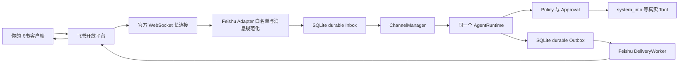
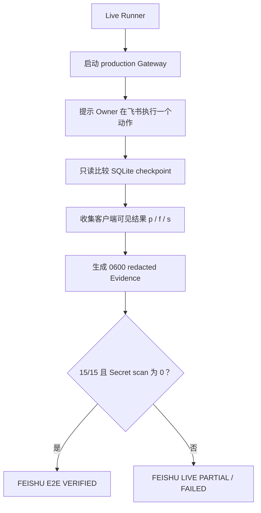
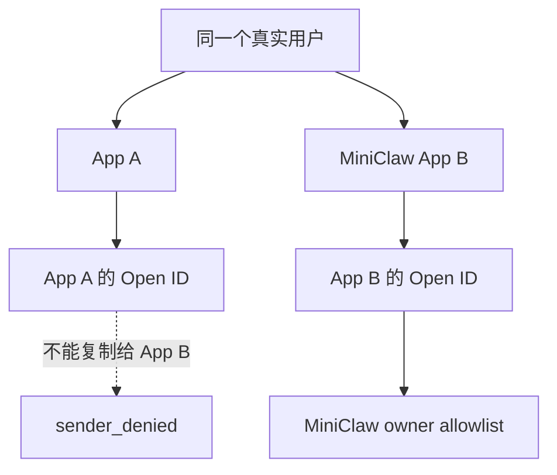
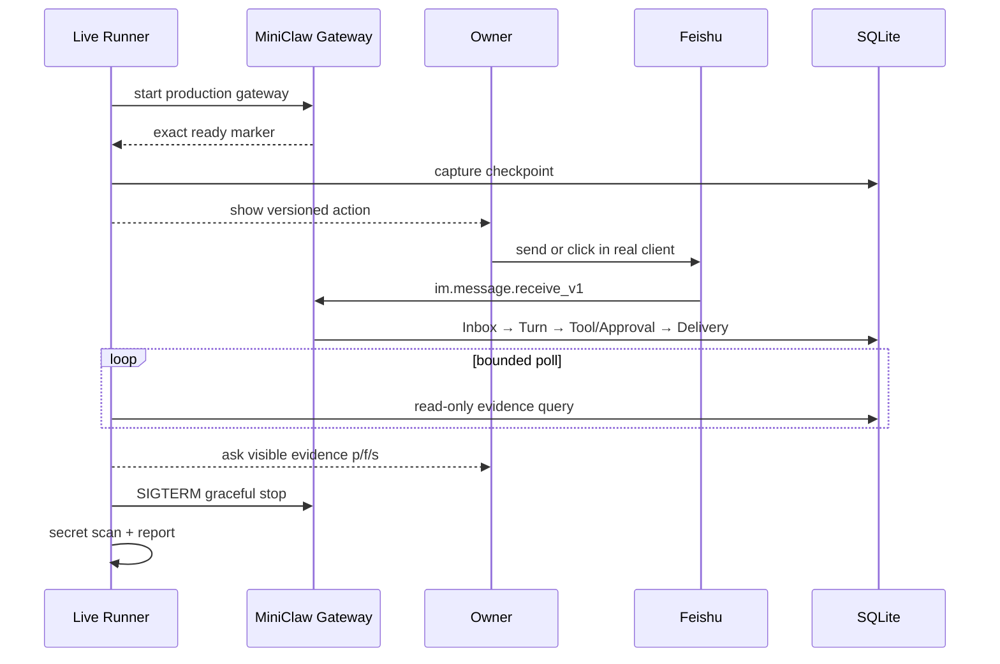
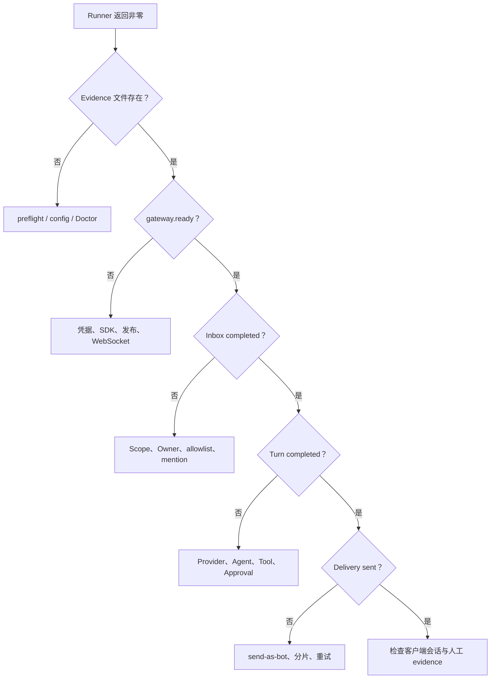
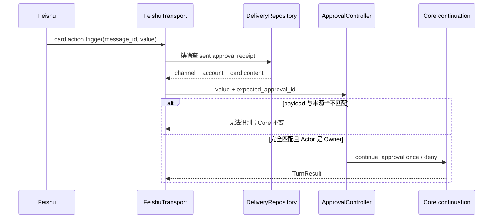

# Phase 5.1：真实飞书 Bot 与 Live E2E 工程落地

> 当前结论：**IMPLEMENTATION PASS / TARGETED CALLBACK LIVE VERIFIED / 15-CASE LIVE PENDING**
>
> 新鲜本地基线：556 Python tests、30 TypeScript tests、29/29 offline Agent cases、32/32 Channel cases、
> 20 轮 640/640 Channel checks。
>
> 这句话的意思是：专用飞书应用、机器人、事件订阅、同应用 Owner、真实 WebSocket 和两条 Owner 私聊回复已经
> 打通；Card callback receipt 与 Approval continuation 也已完成 targeted live 验证。完整 15/15 人工验收仍未执行，
> 因此现在不能写 `FEISHU_E2E_VERIFIED`。
> SDK 运行时与常驻说明见 [Gateway 运行时与 macOS 常驻](feishu-gateway-runtime-and-macos-service.md)。

这份文档是一份可以边看图、边照着操作的工程手册。它回答五个问题：

1. 飞书消息最后怎样进入同一个 MiniClaw Agent；
2. 怎样创建一个权限最小的真实飞书机器人；
3. App ID、App Secret、Owner Open ID 分别放在哪里；
4. 怎样运行 15 条真实 E2E，而不是只看 fake SDK；
5. 失败后怎样判断是平台、Gateway、Agent、Tool、Approval 还是 Delivery 的问题。

权威设计在 [Feishu Live E2E Design](../../superpowers/specs/2026-08-08-phase-5-feishu-live-e2e-design.md)，
逐步 TDD 计划在 [Feishu Live E2E Implementation Plan](../../superpowers/plans/2026-08-08-phase-5-feishu-live-e2e.md)。

## 1. 先用大白话理解它

你在飞书里发一句：

```text
请实际调用工具查看这台电脑的系统信息，不要只告诉我操作步骤。
```

真实链路不是“脚本假装收到一条消息”，而是：



Live Runner 不复制这条业务链。它只做三件事：

- 启动现有 production Gateway；
- 提示你在真实飞书客户端完成动作；
- 只读 SQLite，检查 Inbox、Turn、ToolRun、Approval、Delivery 与 Audit 是否真的发生。



## 2. 已经落地的代码

| 模块 | 文件 | 作用 |
| --- | --- | --- |
| 15 条场景 | `evals/scenarios/feishu-live.v1.jsonl` | 固定 ID、动作和自动/人工证据，不含真实 ID 或 Secret |
| 严格 Loader | `src/miniclaw/evals/cases.py` | 拒绝未知字段、错误 evidence、混入 offline fixture 和非 15 条 suite |
| Live 核心 | `src/miniclaw/evals/feishu_live.py` | preflight、Gateway、checkpoint、轮询、报告、Secret scan |
| 薄入口 | `scripts/feishu_live_smoke.py` | 只调用 `run_feishu_live_harness()` |
| 契约测试 | `tests/test_feishu_live_e2e.py` | 数据库、进程、隐私、确认门和编排回归 |
| 数据集测试 | `tests/test_feishu_evals.py` | 12 条旧 Feishu Channel + 15 条 Live 场景不漂移 |

核心提交使用中英混合标题，便于快速理解：

- `c1cde62 test(feishu): 固化 Live scenario 与 evidence contract`
- `42e13eb feat(feishu): 增加 read-only Live evidence probe`
- `b1372b3 feat(feishu): 管理 bounded Gateway live lifecycle`
- `00d4477 feat(feishu): 输出 redacted Live evidence report`
- `1301b31 feat(feishu): 编排真实 Bot Live E2E gate`

## 3. 安全边界

### 3.1 Runner 会做什么

- 显式 `--confirm-live` 后读取私有 `.env` 与 MiniClaw state；
- 要求只启用 Feishu，避免 Telegram/Discord 同时产生 evidence；
- 运行 22 项 Doctor 与完整 Gateway preflight；
- 要求 40 位 commit、clean worktree、15 条固定场景和 0 条旧 pending Approval；
- 启动当前 Python 的 `miniclaw gateway`；
- 捕获每个 case 动作前的数据库 checkpoint；
- 轮询只读 SQL，人工只确认飞书客户端是否可见；
- 最多扫描 1000 个普通文件，每个不超过 1 MiB；
- 写一份 owner-only、不可覆盖的脱敏 JSON。

### 3.2 Runner 不会做什么

- 不创建或发布飞书应用；
- 不自动扩大 Scope 或可用范围；
- 不主动替你发送测试消息；
- 不自动点击 Allow once、Deny 或发送审批命令；
- 不向 SQLite 插入假的 Inbox、Turn、ToolRun、Approval、Delivery 或 Audit；
- 不把 App Secret、模型 Key、完整 Open ID/Chat ID/Message ID、正文、Prompt、reasoning、Tool 参数写入 Evidence；
- 不调用 `kill -9`；
- 不因为人工输入 `p` 而覆盖自动证据失败。

### 3.3 未确认时为什么必须零副作用

下面命令只会退出 2：

```bash
uv run python scripts/feishu_live_smoke.py
```

即使你传了不存在的 `--home`、`--root` 和 `--output-dir`，没有 `--confirm-live` 时也不会解析状态目录、读取
`.env`、加载场景、创建目录或启动网络。这是为了防止 CI、误点击或复制命令时意外触碰真实 Bot。

## 4. 创建真实飞书机器人

这一节需要你在飞书开放平台网页中操作。建议创建一个专用测试应用，不要直接拿生产工作流机器人做实验。

### 4.1 创建企业自建应用

1. 登录飞书开放平台开发者后台；
2. 新建“企业自建应用”；
3. 名称建议为 `MiniClaw E2E Bot`；
4. 图标和说明可以自定义，但可用范围先只包含你自己；
5. 在“应用能力”中启用机器人；
6. 暂时不要把它加入真实工作群。

### 4.2 只申请最小权限

MVP 只需要三类消息能力：

| 用途 | Scope ID | 为什么需要 |
| --- | --- | --- |
| 读取发给机器人的私聊 | `im:message.p2p_msg:readonly` | Owner 私聊进入 MiniClaw |
| 读取群里明确 @机器人的消息 | `im:message.group_at_msg:readonly` | 专用测试群 mention |
| 以机器人身份回复 | `im:message:send_as_bot` | DeliveryWorker 发送最终回复 |

不要为了省事申请“读取群内所有消息”、通讯录全量、管理员或云盘权限。MiniClaw 的群聊设计是：测试群在
allowlist 中，并且消息明确 mention Bot，才会进入 Agent。

### 4.3 配置事件订阅

选择长连接/WebSocket 模式，订阅事件：

```text
im.message.receive_v1
```

不需要公网 Webhook、反向代理或公网回调 URL。MiniClaw 的 `FeishuTransport` 使用 official SDK 主动建立长连接。

### 4.4 发布测试版本

1. 新建应用版本；
2. 检查权限列表只包含本节需要的 Scope；
3. 可用范围先只选择 Owner；
4. 提交并发布测试版本；
5. 在飞书客户端中确认能搜索到 Bot；
6. 先不要扩大到测试群，私聊 P0 通过后再做群聊。

如果应用没有发布，常见现象是“后台看起来配置完整，但客户端找不到 Bot 或无法聊天”。

## 5. 凭据放在哪里

### 5.1 `.env` 只放 Secret

仓库根目录的 `.env` 至少需要：

```dotenv
MINICLAW_MODEL_API_KEY=<在本机填写>
MINICLAW_FEISHU_APP_ID=<在本机填写>
MINICLAW_FEISHU_APP_SECRET=<在本机填写>
```

设置权限：

```bash
chmod 600 .env
```

不要把真实值粘贴到 Markdown、issue、截图、终端历史或聊天里。验证变量时只检查“存在”和文件权限，不打印值。

### 5.2 `config.toml` 只放非 Secret 配置

示意结构如下，尖括号内容必须在本机替换，不能提交：

```toml
[channels.feishu]
enabled = true
account_id = "default"
app_id_env = "MINICLAW_FEISHU_APP_ID"
app_secret_env = "MINICLAW_FEISHU_APP_SECRET"
domain = "feishu"
owner_open_id = "<同应用 Owner Open ID>"
allowed_open_ids = ["<同应用 Owner Open ID>"]
allowed_chat_ids = []
allow_group_mentions = false
queue_size = 64
worker_count = 2
message_max_chars = 30000
streaming_card = true

[channels.telegram]
enabled = false

[channels.discord]
enabled = false
```

Live gate 要求 Telegram 和 Discord 暂时 disabled，因为本次 Evidence 必须只来自 Feishu。

## 6. 为什么 Owner Open ID 必须“同应用发现”

Open ID 不是一个人在整个飞书里的全局固定 ID；它和应用有关。从另一个机器人、另一个 lark-cli profile 或别的应用
复制来的 Open ID，可能长得完全合法，但对 MiniClaw Bot 无效。



### 6.1 创建独立 lark-cli profile

使用专用 profile，避免覆盖你现有的默认 profile：

```bash
lark-cli config init \
  --app-id <本机输入 App ID> \
  --app-secret-stdin \
  --brand feishu \
  --name miniclaw-e2e
```

App Secret 必须从 stdin 读取，不要放进 argv、shell pipe 或环境回显。

### 6.2 先看事件 schema，再消费一次事件

```bash
lark-cli --profile miniclaw-e2e event schema im.message.receive_v1 --json
lark-cli --profile miniclaw-e2e event consume \
  im.message.receive_v1 \
  --as bot \
  --max-events 1 \
  --timeout 2m
```

等终端出现 `[event] ready` 后，再从 Owner 飞书客户端给 MiniClaw Bot 发送一次性 challenge。只把该事件里的
`sender_id` 写进本地 `owner_open_id` 和 `allowed_open_ids`。不要把整条 event JSON、正文或 ID 保存到仓库。

## 7. 运行前检查

安装依赖：

```bash
uv sync --extra dev --extra feishu
```

初始化和 Doctor：

```bash
uv run miniclaw init
uv run miniclaw doctor
```

Live preflight 需要满足：

| 条件 | 不满足时的稳定错误码 |
| --- | --- |
| Feishu enabled | `feishu_channel_disabled` |
| Telegram/Discord disabled | `peer_channel_enabled` |
| commit 可解析 | `repository_commit_unavailable` |
| worktree clean | `repository_dirty` |
| Doctor 无 FAIL | `doctor_preflight_failed` |
| 没有旧 pending Approval | `pending_approval_exists` |
| 恰好 15 条 Live case | `live_case_count_invalid` |
| SDK/凭据/Owner 关系合法 | `feishu_live_preflight_failed` |

这些失败都发生在 Gateway 启动和 Evidence 目录创建之前。

## 8. 运行真实 Live E2E

先提交所有代码和文档，保证 worktree clean。然后运行：

```bash
uv run python scripts/feishu_live_smoke.py --confirm-live
```

可选参数：

```text
--home PATH
--root PATH
--output-dir PATH
--gateway-timeout 5..120
--case-timeout 5..300
```

默认 Gateway ready timeout 为 30 秒，每个 case 为 60 秒。`no_new_turn` 会等待完整 silence window，不会刚看到
“现在还没 Turn”就立刻误判通过。

### 8.1 Runner 内部时序



### 8.2 人工输入规则

- 完成发送/点击动作后按 Enter；
- 输入 `s` 跳过整条 case；
- 对客户端可见事实输入 `p`、`f` 或 `s`；
- 自动 evidence 失败时不会再询问 `p`，因为人工不能强行覆盖本地事实；
- 任意 fail/skip 都让进程返回 1；
- 只有 15 条全 pass、Gateway 优雅退出、Secret scan 为 0、HEAD 未变化才返回 0。

## 9. 十五条真实验收用例

| ID | 你要做什么 | 自动证据 | 人工证据 |
| --- | --- | --- | --- |
| `001` | 等 Gateway 与 WebSocket ready | `gateway_ready` | 无 |
| `002` | Owner 私聊要求固定回复 | Inbox、Turn、Delivery completed/sent | 客户端看到回复 |
| `003` | 同一私聊连续三轮记住代号 | 同一 Session 3 个 completed Turn | 上下文回答正确 |
| `004` | 明确要求实际调用 `system_info` | ToolRun succeeded + Delivery | 系统信息可见 |
| `005` | 读取 Runner 准备的 Workspace 哨兵 | `read_file` succeeded + Delivery | 哨兵内容正确 |
| `006` | 请求创建文件，停在审批 | pending Approval + waiting ToolRun | 审批提示可见 |
| `007` | 对上一条选择 Allow once | pending 行变 consumed，ToolRun succeeded | 结果可见且只执行一次 |
| `008` | 再请求写文件并选择 Deny | Approval/ToolRun denied | 拒绝结果可见，文件未写 |
| `009` | 非白名单账号私聊 | 完整 silence window 内无新 Feishu Turn | Bot 保持静默 |
| `010` | 在专用测试群明确 mention | Inbox、Turn、Delivery | 群内回复可见 |
| `011` | 测试群不 mention | 完整 silence window 内无新 Turn | Bot 保持静默 |
| `012` | 请求长中文 Markdown、emoji 和代码块 | 同一 Message 多个连续 sent part | 顺序和 Unicode 完整 |
| `013` | 记住代号，Runner 两次有界重启，再询问 | 两次 ready + 同一 Session 新 Turn | 重启后代号正确 |
| `014` | 临时断网再恢复并发送 challenge | reconnecting + connected + Delivery | 恢复后回复可见 |
| `015` | 不发消息，执行最终隐私扫描 | Secret/external ID/body/path match 为 0 | 无 |

### 9.1 Case 007 为什么需要 pending 快照

Case 006 创建的 Approval 在 Case 007 动作前已经存在。Case 007 不是插入新 Approval，而是把同一行从 `pending`
更新为 `consumed`。因此 checkpoint 除了六张事实表的最大内部 ID，还保存动作前 pending Approval 的内部 ID；取证只
允许这些“动作前确实 pending”的旧行变成 consumed，不能让历史 consumed 行冒充本轮成功。

### 9.2 Case 013 为什么会重启两次

为了让 checkpoint 后出现两个真实 ready Audit，Runner 会：

1. checkpoint；
2. 有界重启一次；
3. 让你发送“记住代号”；
4. 再有界重启一次；
5. 让你询问代号。

每次重启都使用同一个 state、SQLite 和配置。每次 stop 最多发送两次 SIGTERM，绝不自动 SIGKILL。

## 10. Evidence 怎么看

默认文件：

```text
.local/eval-results/feishu/<UTC>.json
```

顶层字段严格只有：

```text
schema_version
channel
commit
started_at
finished_at
gateway
checks
counts
release_status
```

报告不会保存原始消息、外部 ID、用户名、群名、Prompt、reasoning、Tool 参数或 Gateway stderr。文件使用：

- mode `0600`；
- `O_CREAT | O_EXCL`，不覆盖旧 Evidence；
- final path 不跟随 symlink；
- UTF-8 JSON，`allow_nan=False`；
- flush 后 `fsync`。

发布状态只有三种：

| 状态 | 含义 |
| --- | --- |
| `FEISHU_E2E_VERIFIED` | 15/15 pass、Gateway ready/优雅退出、Secret scan 0、commit 未变化 |
| `FEISHU_LIVE_PARTIAL` | 没有自动失败，但 case 不完整或存在 skip |
| `FEISHU_LIVE_FAILED` | 自动/人工失败、Secret 命中、Gateway 失败或 repository 变化 |

`secret_matches > 0` 会强制把 `FEISHU-LIVE-015` 改为 fail，人工不能覆盖。计数会从 checks 重新推导，修改 JSON 中
的 count 或 release status 后，serializer 会拒绝它。

## 11. 本地调试

### 11.1 只跑 Live 模块测试

```bash
uv run python -m unittest tests.test_feishu_live_e2e -v
```

### 11.2 只验证场景和旧飞书纵切

```bash
uv run python -m unittest tests.test_eval_cases tests.test_feishu_evals -v
uv run miniclaw eval validate --root evals/scenarios
uv run miniclaw eval run --suite channel --root evals/scenarios
```

### 11.3 验证 Gateway 与 CLI 没有回归

```bash
uv run python -m unittest tests.test_gateway tests.test_cli tests.test_channel_supervisor -v
```

### 11.4 完整门禁

```bash
uv run python -m unittest discover -s tests -v
corepack pnpm --dir tui test
uv run ruff check .
uv run miniclaw eval validate --root evals/scenarios
uv run miniclaw eval run --suite all --root evals/scenarios
uv run miniclaw eval run --suite channel --repeat 20 --json --root evals/scenarios
uv run python scripts/validate_docs.py
uv lock --check
uv build
git diff --check
git status --short
```

## 12. 常见失败的分层判断



详细错误表见 [Phase 5 Troubleshooting](troubleshooting.md)。几个最容易踩的坑：

- Bot 没发布：客户端找不到或不能聊天；
- Open ID 来自另一个应用：消息进入 SDK，但 admission 以 `sender_denied` 静默拒绝；
- 只有 send 权限，没有 read event Scope：Gateway ready 但 Inbox 不增长；
- 群聊未在 allowlist 或没有 mention：设计上静默；
- Case 006 留下旧 pending 后中断 Runner：下次 preflight 会拒绝，必须由 Owner 明确处理，Runner 不替你批准；
- 运行过程中修改代码或切 commit：最终 `repository_changed`；
- App Secret 放在 argv：终端历史可能泄露，必须立即轮换；
- 看到 `32/32` 就写真实通过：错误，32 条是本地 fake SDK 纵切。

## 13. 真实验收的分阶段策略

不要一开始就做群聊和断网。建议按三步扩展：

### P0：Owner 私聊

先做 `001/002/004/005/006/007/008`。证明 WebSocket、Agent、Tool、Approval 和 Delivery 基本闭环。

### P1：上下文、重启与长消息

再做 `003/012/013/014`。证明 Session、分片、持久化和连接恢复。

### P2：安全边界与群聊

最后把 Bot 加入唯一专用测试群，配置唯一 `allowed_chat_ids` 和 `allow_group_mentions=true`，完成
`009/010/011/015`。不要把真实工作群用作第一轮实验。

## 14. 完成定义

真实 Feishu gate 只有在下面全部满足时完成：

- [x] MiniClaw 专用企业自建应用已经创建；
- [x] 机器人能力已启用；
- [ ] 只申请最小三个 Scope；
- [x] `im.message.receive_v1` 使用长连接；
- [x] 测试版本已发布并可由 Owner 使用；
- [x] `.env` 是本机私密 regular file；
- [x] Owner Open ID 来自同一个 Bot App；
- [x] 两条真实 Owner 私聊均产生一次成功 Delivery；
- [ ] 私聊 P0 先通过；
- [ ] 只加入专用测试群；
- [ ] Runner 返回 0；
- [ ] Evidence 是 15 pass、0 fail、0 skip、0 Secret match；
- [ ] Evidence commit 等于验收时 HEAD；
- [ ] 文档和进度页只记录匿名计数，不复制真实 ID、正文或 Secret。

在这些复选框完成前，项目的准确状态仍然是：

```text
IMPLEMENTATION PASS
FEISHU E2E HARNESS PASS
TARGETED CALLBACK LIVE VERIFIED
15-CASE LIVE PENDING
```

## 15. Phase 5.3 真实审批事故与修复

2026-08-09 的真实 Owner DM 验收补齐了开放平台 Callback Configuration，并发布
`card.action.trigger`。这次验收发现两个只有真实卡片点击才能暴露的问题。

### 15.1 Source card 必须绑定 Approval

只校验按钮 payload 不够。生产 callback 同时带 `message_id`，MiniClaw 现在先用它反查 durable Delivery：



反向查找有五个 fail-closed 条件：

1. `channel` 必须是 `feishu`；
2. `account_id` 必须是当前 Gateway 账号；
3. `delivery_kind` 必须是 `approval`；
4. 状态必须是 `sent`，且 receipt 只能命中一行；
5. 持久化 envelope 中的 ID 必须等于 callback payload 的 ID。

因此旧卡重放、伪造 `message_id`、跨账号卡片和“旧卡批准新审批”都不能进入 Core。

### 15.2 Channel notice 不是 Provider 历史

审批卡为了兼容不支持卡片的客户端，会持久化一条 `channel_notice=true` 的 fallback 文本。它属于 IM
投影视图，不是模型说过的话。旧实现的 approval continuation 使用通用 recent messages，导致顺序变成：

```text
assistant(tool_call) → assistant(channel notice) → tool(result)
```

OpenAI-compatible Provider 会把这视为非法 Tool 协议。现在 Provider-safe Context 先移除 Channel notice，再验证
完整 Tool Call/Result 配对；continuation 使用同一 `list_context()` 边界，最终顺序恢复为：

```text
assistant(tool_call) → tool(result) → assistant(final)
```

### 15.3 已验证与仍待验证

已真实观察：Gateway ready、Owner DM、三轮 Context、`system_info`、`read_file`、单 Approval card、
Owner “仅本次”、绑定 ToolRun succeeded、child Turn completed 和结果 Delivery sent。

完整 15-case 仍是 pending。长期个人私聊会混入旧上下文和额外审批，不适合作为最终 Release Gate；下一轮必须先
创建专用测试群/会话，并准备非 Owner 测试账号。权威计数和状态见
[Eval v0.5.3](../../evals/releases/v0.5.3.md)。
