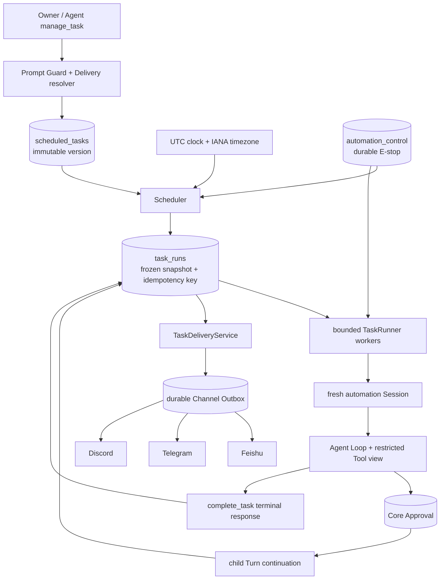
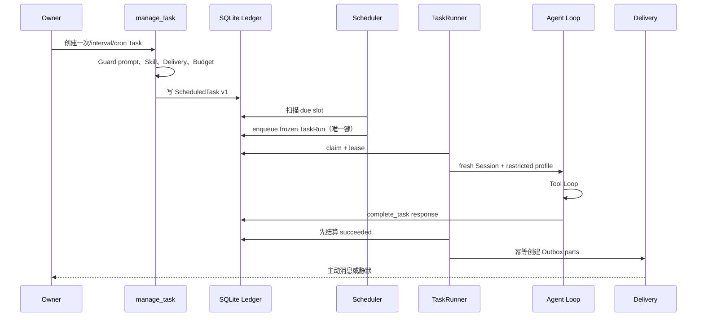
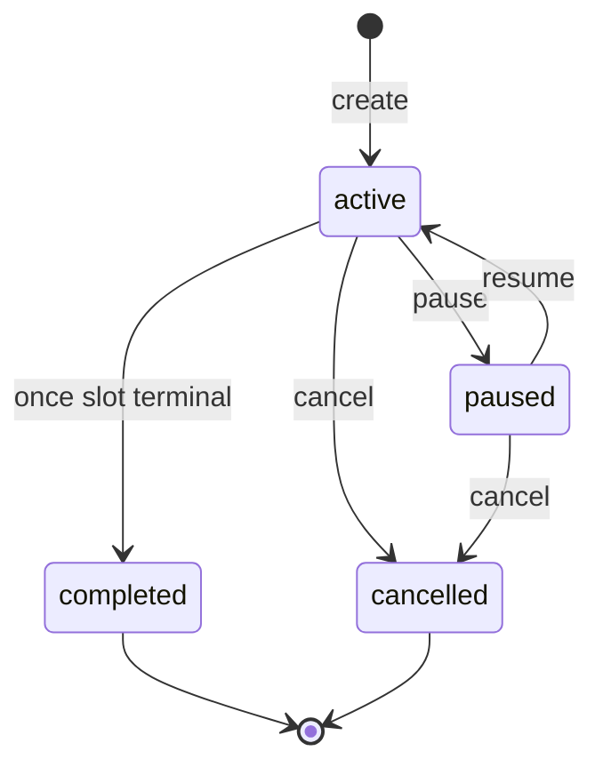
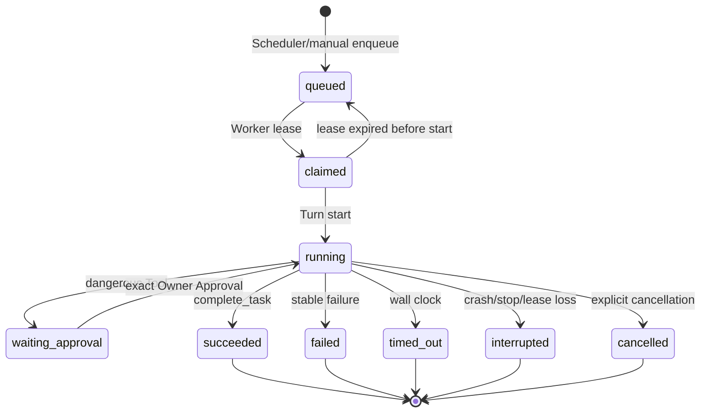
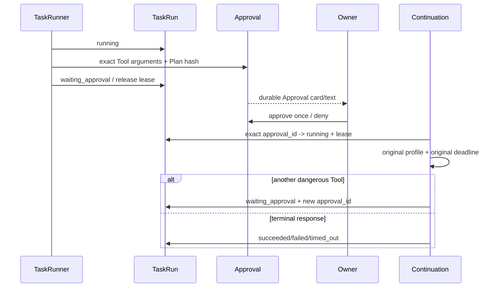
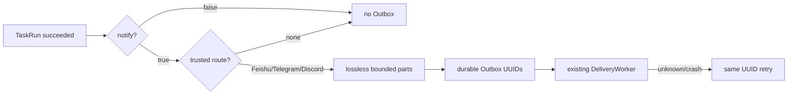

# Phase 6 Autonomy Runtime 工程实现

> 实现日期：2026-08-09
>
> 状态：**IMPLEMENTATION PASS**
>
> 证据边界：SQLite、Scheduler、TaskRunner、Approval、Delivery、Heartbeat 与 15 条 Automation case 已完成离线确定性验收；真实 Feishu/Telegram/Discord 主动消息仍沿用各平台 Live Gate，不能写成 Live PASS。

Phase 6 发布时门禁：**798/798 Python**、**35/35 TypeScript**、**39/39 offline Agent**、
**33/33 Channel**、**660/660 local Channel soak**、**15/15 Automation**，状态为
**IMPLEMENTATION PASS**。Feishu 仍为 **TARGETED CALLBACK LIVE VERIFIED / 15-CASE LIVE PENDING**，
Telegram/Discord 仍为 **LIVE PENDING**；Docker containment 为 **LIVE VERIFIED**，Seatbelt 为 **LIVE PENDING**。
这些外部结论没有被离线 Automation gate 改写。

这次 Phase 6 不是让模型“想做什么就做什么”，而是给 MiniClaw 增加一套可停、可查、可恢复、受预算限制的后台任务系统。
一句大白话：模型只负责完成一条已经被 Core 冻结的任务，什么时候运行、能用哪些 Tool、能花多少资源、是否需要
Owner 审批、结果投到哪里，全部由 MiniClaw 的确定性代码和 SQLite 决定。

## 1. 现在能做什么

- 创建一次性、固定间隔、cron 自动任务；
- Gateway 常驻时由 Scheduler 扫描到期任务，生成 durable TaskRun；
- 每个 Run 使用独立 Automation Session，不继承创建任务时的聊天上下文；
- 运行时隐藏 `manage_task`，阻止自动任务继续创建自动任务；
- 使用 wall-clock、Agent turn、Tool call、输入输出 Token 和可选费用预算；
- 只有 `complete_task` 能声明任务成功，普通模型正文不能冒充成功；
- 危险 Tool 进入现有 Core Approval，等待时释放 Worker lease，重启后仍可继续；
- terminal response 先落 TaskRun，再幂等投影到现有 Channel Outbox；
- `miniclaw task halt` 提供 durable E-stop，重启后仍然保持停止；
- Heartbeat 作为唯一 system-owned Task 使用同一 Scheduler/Runner，不建立第二套循环；
- CLI 可以列 Task、查 Run、暂停、恢复、手动触发、取消、halt 与 unhalt；
- `automation.v1` 固定 15 条回归场景，每个版本必须全部通过。

默认配置中 `automation.enabled = false`、`heartbeat.enabled = false`。升级后不会偷偷启动后台 Agent。

## 2. 总体架构



这里有三个事实源，职责不能混：

| 事实源 | 保存什么 | 不保存什么 |
| --- | --- | --- |
| `scheduled_tasks` | 当前任务定义、版本、Schedule、预算、投递目标 | 某一次执行的临时状态 |
| `task_runs` | 入队时冻结的 Task snapshot、lease、终态、response | 后续更新过的 Task 定义 |
| `deliveries` | terminal response 的分片、幂等键、发送状态 | Provider 推理过程 |

## 3. 从“创建任务”到“收到结果”



关键点是“先冻结、再执行”。Task 在 Run 入队后即使被修改，旧 Run 仍使用旧 prompt、Skill、Delivery、Policy profile
和预算，不会在执行中途被换题。

## 4. 配置与启用

`miniclaw init` 已生成全部 Phase 6 section，但默认关闭 Automation。Docker 自动任务启用时 image 必须固定到
SHA-256 digest；普通 tag 会在配置加载阶段失败。

```toml
[automation]
enabled = true
max_active_tasks = 50
max_concurrent_runs = 2
misfire_grace_seconds = 300
lease_seconds = 60

[heartbeat]
enabled = false
interval_seconds = 1800
timezone = "Asia/Shanghai"
active_hours_start = "08:00"
active_hours_end = "23:00"

[sandbox]
backend = "docker"
image = "registry.example/miniclaw-sandbox@sha256:<64位digest>"
network = "none"
memory_mib = 512
cpu_seconds = 60
pids_limit = 128

[checkpoint]
enabled = true
max_entries = 2000
max_total_bytes = 67108864
max_file_bytes = 8388608
max_count = 100
```

配置使用 strict schema：未知 key、bool 冒充整数、越界并发/lease、非 IANA timezone、空 active hours、非固定 Docker
digest、非 `none` 网络都会拒绝启动。`heartbeat.enabled = true` 但 Automation 关闭也会直接报错。

启用前建议：

```bash
uv run miniclaw doctor
uv run miniclaw task list
uv run miniclaw eval run --suite automation --root evals/scenarios
```

## 5. Task 与 Run 状态机

### 5.1 ScheduledTask



更新、暂停、恢复和取消都使用 `expected_version` 乐观并发。旧版本写入返回稳定 conflict，不会静默覆盖别的终端、
Gateway 或 Agent 刚完成的修改。system-owned Heartbeat 不能通过普通 Task API 修改或取消。

### 5.2 TaskRun



`claimed` 过期可以安全重排，因为 Agent 尚未开始；`running` 过期只能标 `interrupted`，不会盲目重放可能已经发生的
副作用。

## 6. Schedule 语义

| 类型 | 表达式 | 语义 |
| --- | --- | --- |
| once | aware ISO-8601 时间 | 到期运行一次；超过 grace 留下 `schedule_misfire` 失败事实 |
| interval | 正整数秒 | 从持久 slot 单调推进；长时间停机最多补一次 |
| cron | 标准五段 cron + IANA timezone | 以本地 wall clock 解释，再转换到 UTC 持久化 |
| heartbeat | interval + active hours | 仅由 Reconciler 创建，和普通任务共享全局并发 |

DST gap 会推进到第一个有效本地时间；DST fold 选择第一次 occurrence。Scheduler 每个 tick 有扫描上限，并由
`(task_id, scheduled_for)` 唯一键保证多实例同一 slot 只有一个 Run。

## 7. CLI 运维入口

```bash
uv run miniclaw task list
uv run miniclaw task show <task-id>
uv run miniclaw task runs <task-id>
uv run miniclaw task pause <task-id>
uv run miniclaw task resume <task-id>
uv run miniclaw task run <task-id>
uv run miniclaw task cancel <task-id>
uv run miniclaw task halt --reason "incident response"
uv run miniclaw task unhalt
```

CLI 是 repository-only 控制面，不加载 Provider 或 Channel SDK。`show` 只显示 prompt byte count、Schedule、Delivery
类别等脱敏信息，不输出完整 prompt；`runs` 只显示 ID、状态、稳定错误码和关联 ID。

当前没有 Web 管理后台。SQLite 和 CLI 是 Phase 6 的唯一控制面；可视化后台属于后续独立需求。

## 8. Agent 执行边界

每个 Run 的会话键为 `task:<task_id>:run:<run_id>`，channel=`automation`、account=`local`。它不会继承飞书群聊、
Discord thread 或创建任务那一轮的临时上下文，只能按 Owner Disclosure 规则读取允许的长期 Memory。

运行 profile 固定：

- `manage_task` 永远移除；
- Tool 集合是“当前 Registry ∩ Automation allowlist”；
- 每次 Tool 前再次读取 durable E-stop；
- `safe/smart/autopilot/yolo` 都不能关闭敏感路径、网络、Sandbox 和预算硬限制；
- Task prompt 不能包含 Secret、bidi/C0 控制字符、未知/重复 Skill 或递归控制语句；
- 成功必须由 `complete_task {notify, text}` 产生结构化 `TaskResponse`。

`AgentRunBudget` 会随 Parent Turn snapshot 持久化，Approval continuation 继续使用原 `timeout_seconds`、turn/tool/token/
cost 上限，不能重新取一个更大的默认预算。

## 9. Approval continuation



审批绑定 Tool 名、规范参数 hash、ExecutionPlan hash、Owner、TTL 和可用 scope。参数、Plan、Owner、Approval ID 任一
不一致都在 side effect 前失败。两个并发消费者只有一个能得到 running ToolRun。

## 10. 主动投递与恢复

`TaskDeliveryService` 只接受已经持久化为 `succeeded`、并且 response 与 Run 中 `response_json` 完全一致的输入。
它按平台字符预算分片，并用 `task_run_id + part index` 创建稳定幂等键。



启动恢复会补投影“Run 已成功、Outbox 尚未创建”的崩溃窗口；重复 `project()` 和重复 recovery 返回同一组 Delivery，
不能更换正文或目的地。真实平台发送结果仍由 Phase 5 Channel Live Gate 判定。

## 11. Heartbeat

Heartbeat 是 `system:heartbeat:v1` 唯一 Task：重复 reconcile 复用同一 ID；关闭时只 pause 并保留历史；活跃窗口外只
推进 next slot；并发已满时延后一分钟。健康时必须 `complete_task notify=false`，需要 Owner 处理时才允许非空通知。

当前实现限制：Runtime 尚未配置 Heartbeat 的 Owner IM route，因此系统 Task 使用 `route=none`。它可以在 Ledger 中
执行和被 `task runs` 检查，但不会主动推送异常。为避免伪造“已通知”，这个限制在 v0.7.0 明确记录；后续应增加
Owner 可验证 route 配置后再开启默认通知。

## 12. Gateway 生命周期

启动：

```text
config → migration → stale lease recovery → Delivery recovery
→ Heartbeat reconcile → durable E-stop check
→ TaskRunner workers → Scheduler → Channel transports
```

关闭：

```text
stop Scheduler intake → cancel/await bounded TaskRunner
→ stop Channel receiving/delivery → flush Memory → close Provider
```

Automation 默认关闭时不创建任何 Scheduler/Runner worker。halted 启动仍做安全 recovery，但不启动新 claim。单个 Worker
iteration 遇到 SQLite 等意外异常会记录无正文 warning、退避并继续；不会出现 Gateway 看似在线但 Worker 已静默死亡。

## 13. Audit 与稳定错误码

生命周期审计只记录 ID、状态、计数、revision 和稳定 code：

- `automation.started`、`automation.halted`、`automation.stopped`；
- `task_run.claimed`、`task_run.waiting_approval`、`task_run.terminal`。

不记录 Task prompt、模型 completion、Tool result、平台 conversation ID 或 Secret。常见错误：

| code | 含义 | 运维动作 |
| --- | --- | --- |
| `automation_halted` | durable E-stop 生效 | 排查后执行 `task unhalt` |
| `schedule_misfire` | once 已超过补做窗口 | 检查系统时间并重新建 Task |
| `task_prompt_secret` | Prompt 疑似包含凭据 | 改成环境变量名或安全引用 |
| `recursive_automation_denied` | Prompt 尝试创建更多 Task | 把编排留给 Owner |
| `automation_terminal_response_missing` | Agent 未调用 terminal Tool | 修 Prompt/Skill 并保留失败 Run |
| `task_timeout` | 原始 wall-clock 用尽 | 缩小任务或显式调整预算 |
| `task_execution_failed` | 未分类内部边界失败 | 查脱敏日志和 Run ID |

## 14. Versioned regression gate

`evals/scenarios/automation.v1.jsonl` 固定 `AUTO-001..015`，覆盖 Scheduler、misfire、E-stop、Prompt Guard、snapshot、
terminal/recovery、Approval、Delivery、ExecutionPlan、Docker hardening、Checkpoint、Rollback 和 Heartbeat。

```bash
uv run miniclaw eval run --suite automation --root evals/scenarios
uv run miniclaw eval run --suite automation --repeat 20 --json --root evals/scenarios
```

每条 case 显式声明 status、error code、Tool 集、Delivery count、evidence 和 forbidden behavior。fixture 使用固定时钟、
临时 SQLite/Workspace、Fake Provider/backend/transport 或不连接 daemon 的 argv 编译；不读取 `.env`、个人数据或真实平台。

## 15. 已知限制与下一步

- 单 Owner、单 SQLite；不是企业多租户调度器；
- 没有 Web 管理后台、分布式 leader election 或远程 worker；
- Automation 默认关闭；Docker image 由部署者构建并固定 digest；
- Heartbeat 目前无主动 IM route；
- interrupted Run 不自动重放可能已有副作用的动作；
- `complete_task` 只提供文本/静默，不提供任意 webhook；
- 本 Phase 6 快照发布时 Browser Agent 尚未实现；当前实现见
  [Phase 6.5 Browser Agent](browser-agent.md)；
- Controlled Evolution、自改 Prompt/Skill 是 Phase 7，不在 Phase 6；
- Feishu/Discord 严格 15-case 和 Telegram live 仍是各自 **LIVE PENDING**。

Sandbox、Checkpoint 与 Rollback 的详细安全边界见
[Sandbox and Checkpoint](20260809_sandbox-and-checkpoint.md)，发布证据见
[v0.7.0 Eval Record](../../evals/releases/v0.7.0.md)。
