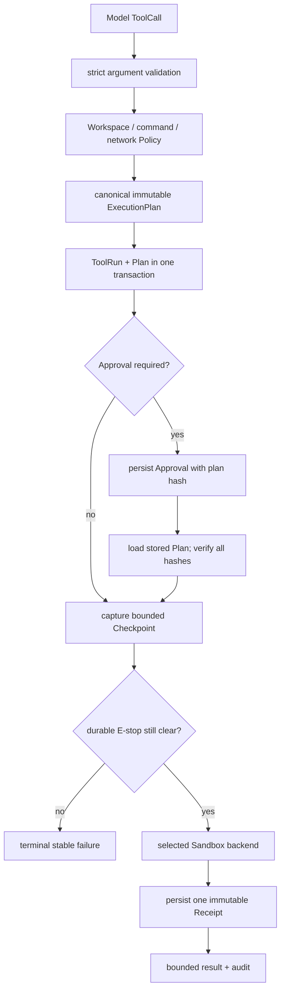
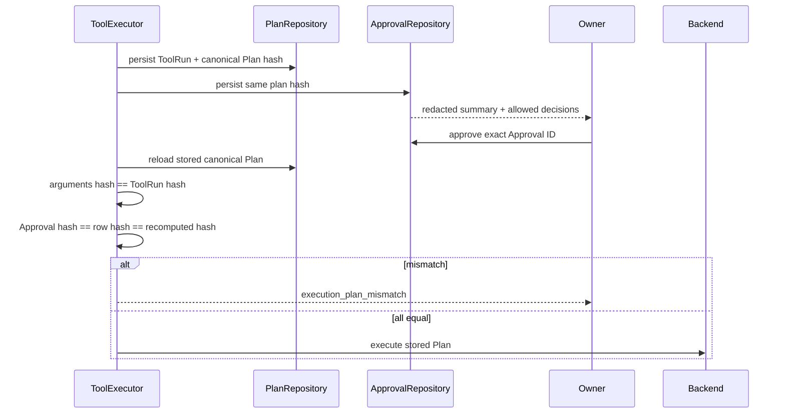
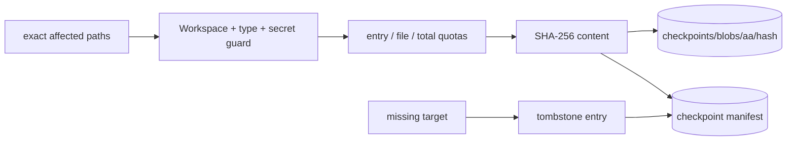

# Phase 6 Sandbox、ExecutionPlan、Checkpoint 与 Rollback

> 实现日期：2026-08-09
>
> 状态：**IMPLEMENTATION PASS / DOCKER LIVE VERIFIED / SEATBELT LIVE VERIFIED（当前 macOS）**
>
> 边界：合约、argv、持久绑定、故障恢复和离线安全回归已通过；Docker 与当前 Mac 的 Seatbelt
> 真实逃逸探针均已 PASS。Seatbelt 结论只覆盖本机已绑定的 executable chain，不代表其他 macOS/runtime 自动通过。
> 当前 release candidate 的 commit-bound Seatbelt 2/2 与 24h aggregate 仍为 **PRODUCTION SOAK PENDING**；见
> [macOS + 飞书生产级验收](20260810_macos-feishu-production-acceptance.md)。

Phase 6 发布时门禁：**798/798 Python**、**35/35 TypeScript**、**39/39 offline Agent**、
**33/33 Channel**、**660/660 local Channel soak**、**15/15 Automation**，状态为
**IMPLEMENTATION PASS**。Docker containment 为 **LIVE VERIFIED**；当前 Mac Seatbelt 为 **LIVE VERIFIED**。Feishu 仍为
**TARGETED CALLBACK LIVE VERIFIED / 15-CASE LIVE PENDING**，Telegram/Discord 仍为 **LIVE PENDING**。

Sandbox 不是“把命令放进另一个函数”。它要解决的是：模型请求、Policy 判断、Owner 审批和最终执行必须是同一个
不可变动作；执行前能保存有限 before image；失败后能判断是否安全回滚；缺少所选隔离后端时必须停止，不能偷偷降级到
Host。

## 1. 威胁模型

Phase 6 防御以下风险：

- 模型把 Shell 字符串、重定向或 pipeline 塞进命令；
- 等待审批期间参数、环境、cwd、mount 或 image 被替换；
- Docker 缺失后自动在宿主机执行；
- 父进程 API Key、Cookie、Proxy 或 HOME 凭据被继承；
- automation command 写任意 Workspace/Home；
- 文件修改前 checkpoint 捕获失败，但 side effect 仍继续；
- rollback preview 后用户继续编辑，旧确认覆盖新内容；
- symlink、`.git`、Secret 文件、数据库、socket 或超大文件进入 CAS；
- 崩溃后重复执行未知 side effect 或重复写 receipt。

不承诺防御宿主内核、容器运行时或 Docker daemon 自身漏洞；因此生产部署仍需要及时更新系统和最小宿主权限。

## 2. 唯一允许的执行顺序



任一前置步骤失败，后续步骤都不能运行。尤其是 checkpoint 失败不能“先写了再说”，Approval resume 不能从模型新参数
重新生成 Plan。

## 3. ExecutionPlan

`ExecutionPlan` 是冻结值对象，包含：

```text
schema_version
argv[]
executables[]  # v2 only: exact path + SHA-256
cwd
environment_names[]
read_roots[] / write_roots[]
timeout_seconds / memory_mib / cpu_seconds / pids_limit
network_mode
backend
```

v1 保持历史 canonical JSON 与 hash 逐字兼容；新 Seatbelt Plan 使用 v2，并按执行顺序保存 1～4 个
`ExecutableRef(path, sha256)`。canonical JSON 使用固定 key 顺序、规范绝对路径和排序后的环境变量名/mount，再计算
SHA-256。Plan 只保存环境变量名，
永远不保存值。相同事实得到相同 hash；argv、cwd、mount、预算或 backend 任一变化都会得到不同 hash。

`argv[0]` 必须是非空 executable；后续参数可以是合法空字符串，所以 `lark-cli --query ""` 能保持 exact argv。
所有参数仍拒绝控制字符，整个结构从不交给 Shell。

## 4. Approval hash binding



`ExecutionPlanRepository.create()` 对相同 Plan 幂等，对不同 Plan 拒绝覆盖。`complete()` 只接受匹配 plan hash/backend 的
Receipt；相同 Receipt 可重试，不同结果返回 `execution_receipt_conflict`。

## 5. Backend 矩阵

| Backend | 用途 | 隔离 | 缺失行为 | 当前结论 |
| --- | --- | --- | --- | --- |
| Host | 交互式 Owner exact-argv 命令 | 最小 env、固定 cwd、process group、timeout | 本机命令本身不可用则失败 | IMPLEMENTATION PASS |
| Docker | Linux/VPS Automation 推荐 | read-only rootfs、network none、cap drop、non-root、mount allowlist | fail closed，绝不 Host fallback | IMPLEMENTATION PASS / **LIVE VERIFIED** |
| Seatbelt | macOS Automation 可选 | deny-default profile、exact executable chain、literal roots、network deny | `sandbox-exec` 缺失或 chain 变化即 fail closed | IMPLEMENTATION PASS / **当前 Mac LIVE VERIFIED** |

Automation 使用配置的 Docker/Seatbelt；交互式 TUI/IM 命令继续使用 Host + Approval。这样不会让升级后所有正常本机命令
突然进容器，也不会让后台任务绕过显式 sandbox 配置。

## 6. Docker hardening

Docker backend 只编译并执行固定 argv，核心 flags：

```text
docker run --rm --init
  --network none
  --read-only
  --cap-drop ALL
  --security-opt no-new-privileges
  --pids-limit <bounded>
  --memory <bounded>m
  --cpus 1.0
  --user 65532:65532
  --tmpfs /tmp:rw,noexec,nosuid,size=64m
  --workdir /workspace
  --mount ... ro/rw
  -- <sha256-pinned-image> <exact argv...>
```

镜像必须是 `name@sha256:<64 hex>`。Automation command 默认只读挂载 Workspace，且没有可写 root；只有 Tool schema
未来明确声明的写范围才可进入 Plan。Docker executable 使用可信绝对路径，不通过模型 PATH 选择。

## 7. Seatbelt hardening

Seatbelt profile 从 deny-default 开始，导入现代 macOS 启动普通进程所需的 `system.sb`，随后再次显式禁止网络；
只开放 v2 Plan 中逐个绑定的 exact process、必要系统读取、literal read/write subpath，不使用 executable
`subpath`。每个声明 root 只对父目录开放
`file-read-metadata + path-ancestors`，不开放父目录内容。路径经过 canonicalize 和转义，不能把 `)`、引号或换行
注入 profile。profile 作为独立文件/参数传给 `sandbox-exec`，命令仍是 exact argv。

Core 在 Policy/Approval 前解析 executable chain，使用 no-follow 打开 regular executable 并保存 SHA-256；backend
执行前再次核对。支持 direct executable、absolute shebang 和单一 `/usr/bin/env NAME`。为避免 shell 重新解释，带参数
shebang、`env -S`、shell interpreter、symlink mutation 或超过四项的 chain 都稳定拒绝。Host 与 Docker 的历史 Plan
继续使用 v1；Host 只提供最小环境与 exact argv，**不等于 sandbox**。

Seatbelt 是 macOS 兼容后端，不是未来长期的跨平台承诺；如果系统移除 `/usr/bin/sandbox-exec`，Lobster0 返回
`sandbox_backend_unavailable`，不会在 Host 重试。

## 8. 最小环境

Backend 只解析 Plan 中列出的安全环境名。常见值来自 Lobster0 构造的固定集合：`PATH`、`LANG`、`LC_ALL` 和必要的
CLI notifier 开关。Automation 删除 `HOME`；API Key、App Secret、Token、Cookie、Proxy 和父进程任意环境不继承。

Receipt 只保存：plan hash、backend、exit/signal/timeout、bounded stdout/stderr、截断标记、耗时和相对 changed paths。
不保存环境值、完整私人路径或无限输出。

## 9. Checkpoint CAS

Checkpoint 是 Tool side effect 之前的有限 before image，不是整个磁盘快照。



Manifest entry 保存相对路径、是否存在、content hash、size 和 mode。相同内容只保存一个 `0600` CAS blob。不存在的
目标保存 tombstone，回滚时可以删除“操作后来新建的文件”。

配额：

- 单次 entry 数 `max_entries`；
- 全部内容 `max_total_bytes`；
- 单文件 `max_file_bytes`；
- retention manifest 数 `max_count`。

超过任一配额返回 `checkpoint_budget_exceeded`，Tool 不执行。Retention 只过期最旧 manifest；仍被有效 manifest 引用的
共享 CAS blob 不删除。

## 10. 永久拒绝进入 Checkpoint 的对象

- Workspace 外路径；
- symlink、目录逃逸、socket、device 和非 regular file；
- `.git`、`.ssh`、`.aws`、`.gnupg`、`.kube`；
- `.env*`、credentials、token、key、SQLite database 及 `-wal`/`-shm` sidecar；
- Lobster0 state/system/socket 路径；
- 超出 entry/file/total budget 的内容。

当前 CheckpointStore 只捕获主 Workspace 相对路径。Personal Profile 的额外 write roots 仍由 WorkspaceGuard、Policy 和
Approval 保护，但 v0.7.0 不为这些外部根创建 rollback checkpoint；文档不能声称已覆盖。

## 11. Rollback 两步协议

```mermaid
sequenceDiagram
    participant O as Owner
    participant R as RollbackService
    participant F as Workspace files
    participant C as Checkpoint CAS

    O->>R: preview(checkpoint_id)
    R->>F: hash current exact paths
    R-->>O: operations + preview_hash
    O->>R: apply(checkpoint_id, preview_hash)
    R->>F: recompute current state
    alt changed after preview / symlink / conflict
        R-->>O: rollback_conflict; write nothing
    else exact match
        R->>C: read bounded blobs
        R->>F: stage temp files + fsync
        R->>F: atomic replace/delete + directory fsync
        R-->>O: receipt + changed relative paths
    end
```

Preview 不产生副作用。Apply 重新计算同一 preview hash；任何并发编辑都拒绝整批，不能恢复一半。恢复 existing file 时
同时恢复 mode；恢复 tombstone 时删除操作新建的 regular file。目标被换成 symlink 时不会跟随。

当前 RollbackService 是内部 Python API，还没有独立 `lobster0 rollback` CLI。Checkpoint ID 可从 ToolRun/SQLite
诊断链路追踪；面向 Owner 的可视化预览与 CLI 属于后续运维增强。

## 12. Crash matrix

| 崩溃位置 | 重启行为 | 是否自动重放 side effect |
| --- | --- | --- |
| Plan 前 | 没有 ToolRun/Plan，可安全重新请求 | 否 |
| Plan 已落库、Approval 前 | 保留 immutable Plan | 否 |
| waiting Approval | 保持等待，Owner 可继续 | 否 |
| Checkpoint 前/失败 | Tool 不启动 | 否 |
| Backend 启动前 | ToolRun 可安全失败/interrupt | 否 |
| Backend 结果未知 | running → interrupted | 否 |
| Receipt 已落库 | 相同 complete 幂等 | 否 |
| Run succeeded、Delivery 前 | startup recovery 补 Outbox | 仅投递，不重跑 Tool |

## 13. 验收命令

离线：

```bash
uv run python -m unittest \
  tests.test_sandbox_contract \
  tests.test_docker_sandbox \
  tests.test_seatbelt_sandbox \
  tests.test_checkpoint_store \
  tests.test_rollback \
  tests.test_tool_executor -v
uv run lobster0 eval run --suite automation --root evals/scenarios
```

显式 live smoke：

```bash
uv run python scripts/sandbox_live_smoke.py --backend docker \
  --image 'registry.example/lobster0-sandbox@sha256:<digest>'
uv run python scripts/sandbox_live_smoke.py --backend seatbelt --confirm-live --probe python
uv run python scripts/sandbox_live_smoke.py --backend seatbelt --confirm-live --probe node-chain
```

Live smoke 必须证明：Workspace 允许范围可见；网络不可达；父进程 sentinel 不可见；未声明写路径失败；缺 backend 不
fallback。若本机没有可用 pinned image、Docker daemon 或 `sandbox-exec`，记录 **LIVE PENDING** 和具体 blocker，不能拿
`build_argv` 单测冒充 containment PASS。

本轮真实结果：Docker 使用本机已有的 sha256-pinned Python image，`exit=0`，Workspace 写、外部 Secret deny 与
network deny 全部 PASS。Seatbelt 的 managed Python 与 `/usr/bin/env node` chain 两个真实 probe 均为
`containment=PASS`，证明当前 Mac 的 executable chain、Workspace allow、外部 Secret deny 与 network deny 生效。
这项证据不外推到未执行 probe 的机器、解释器或操作系统版本。

## 14. 当前限制

- Docker 与当前 Mac Seatbelt live containment 已验证；更换 Python、Node 或 macOS 后必须重新运行两个 live probe；
- Docker socket 永远不能挂进 Lobster0 容器；
- Automation command 当前默认 Workspace 只读，尚未提供用户级 writable mount 配置；
- Checkpoint 只覆盖主 Workspace，不覆盖 Personal 外部 write roots；
- Rollback 没有 Owner CLI/TUI 页面；
- 不能自动回滚未知状态的任意外部 API、消息、邮件或数据库操作；
- 本 Phase 6 快照发布时 Browser Artifact 尚未实现；当前 Screenshot/Download 隔离见
  [Phase 6.5 Browser Agent](browser-agent.md)。

Autonomy 生命周期与 Task 操作见 [Autonomy Runtime](20260809_autonomy-runtime.md)，发布事实见
[v0.7.0 Eval Record](../../evals/releases/v0.7.0.md)。
