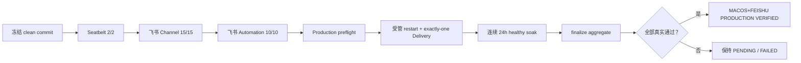
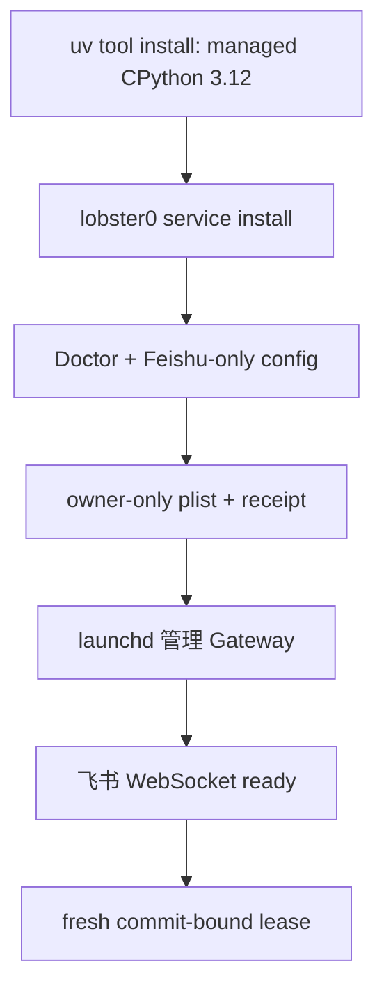
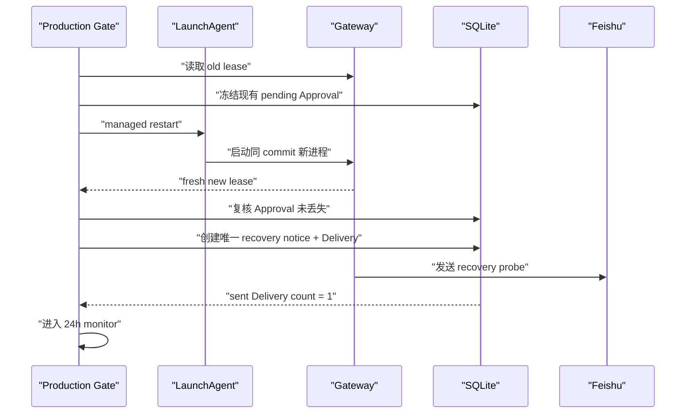

# Phase 6：macOS + 飞书生产级验收 Runbook

> 当前状态（2026-08-10）：**IMPLEMENTATION PASS / PRODUCTION SOAK PENDING**。
>
> 生产验收工具已经实现；真实 Seatbelt 2 项、飞书 Channel 15 项、飞书 Automation 10 项、受管重启和连续
> 24 小时 soak 尚未全部形成同一 commit 的最终 Evidence。因此本文现在是可执行手册，不是 `PRODUCTION VERIFIED`
> 声明。

这份文档给第一次做生产验收的人使用。最简单的理解是：先把代码和运行环境冻结，再依次证明“隔离真的有效”、
“飞书正常对话和自动任务真的可用”、“进程重启不会重复回复”，最后让同一个版本连续健康运行整整 24 小时。

## 1. 本次到底验收什么

本 Gate 只验收一组明确组合：

| 维度 | 固定值 |
| --- | --- |
| 操作系统 | 当前这台 macOS |
| IM | 飞书，且只启用一个 Feishu Channel |
| 模型 | 当前配置的 DeepSeek OpenAI-compatible Provider |
| 常驻方式 | Lobster0 自己管理的用户级 LaunchAgent |
| Python | 项目目录外的 managed CPython 3.12 |
| Tool 权限 | `safe` |
| Automation | 开启，用于真实 10-case 验收 |
| Sandbox | Seatbelt，网络策略为 `none` |
| 连续运行 | 至少 86,400 个健康秒，采样间隔 60 秒 |

它**不**顺便证明 Telegram、Discord、Linux/VPS、Docker 部署、Browser controlled live、整机重启或 Phase 7
Controlled Evolution。整机 reboot 是可选附加项；没做时 Evidence 必须写 `os_reboot=not_run`，不能写成 PASS。



## 2. 三种状态不要混用

| 状态 | 大白话 | 允许写什么 |
| --- | --- | --- |
| `IMPLEMENTATION PASS` | 代码和离线回归通过 | 功能已实现，但不能说生产可用 |
| `PRODUCTION SOAK PENDING` | 真实验收还没开始或前置 Evidence 不完整 | 只能写 pending |
| `PRODUCTION SOAK RUNNING` | 同一版本正在累计真实健康时间 | 展示 elapsed，不预写 PASS |
| `MACOS+FEISHU PRODUCTION VERIFIED` | 同一 commit 的全部 Gate 和 24h 都通过 | 只对本章固定组合生效 |

任何 20 轮离线 soak、fake SDK、人工截图或“飞书里看起来能回复”都不能替代最后一行。

## 3. 先准备一个私有 Evidence 目录

每次失败后都换一个新的 `<run-id>`，不要覆盖旧报告，也不要把两个 run 拼成 24 小时。

```bash
RUN_ID="$(date -u +%Y%m%dT%H%M%SZ)"
EVIDENCE_HOME="$HOME/.lobster0/evidence/phase6-production/$RUN_ID"
install -d -m 700 \
  "$EVIDENCE_HOME" \
  "$EVIDENCE_HOME/seatbelt" \
  "$EVIDENCE_HOME/feishu-channel" \
  "$EVIDENCE_HOME/feishu-automation"
```

目录和其中 JSON 必须分别是 `0700`、`0600`，属于当前登录用户，并且不能是 symlink。它们包含脱敏的真实运行
Evidence，不进入 Git：

```text
<run-id>/
├── seatbelt/            # 精确 2 个 JSON：python、node-chain
├── feishu-channel/      # 精确 1 个 JSON：15/15
├── feishu-automation/   # 精确 1 个 JSON：10/10
├── recovery.json        # 受管 restart 与 exactly-one Delivery aggregate
├── soak.json            # 可恢复的 24h checkpoint
└── release.json         # 只有 finalize 全绿后才出现
```

## 4. 冻结 release candidate

先在仓库根目录确认没有未提交文件，并跑确定性门禁：

```bash
git status --short
uv run python -m unittest discover -s tests -v
uv run ruff check .
uv run lobster0 eval run --suite channel --repeat 20 --json --root evals/scenarios
uv run lobster0 eval run --suite automation --repeat 20 --json --root evals/scenarios
uv run lobster0 eval run --suite browser --repeat 20 --json --root evals/scenarios
pnpm --dir browser-worker test
uv run python scripts/validate_docs.py
git diff --check
```

`git status --short` 必须为空。后面的所有真实 Evidence 都会记录这个 40 位 commit；中途一旦改代码或文档并产生
新 commit，旧 Evidence 不能继续用于新版本，必须从 Seatbelt 开始重跑。

## 5. 安装并检查受管 LaunchAgent

生产 Gateway 不能使用仓库 `.venv`。从当前 clean commit 安装独立 runtime：

```bash
uv tool install --force --no-cache --python 3.12 --managed-python '.[feishu]'
LOBSTER0_ENV_FILE="$PWD/.env" lobster0 service install
LOBSTER0_ENV_FILE="$PWD/.env" lobster0 service status
```

`service install` 同时完成安装和启动。Lobster0 当前没有单独的 `service stop`：

- 重启：`lobster0 service restart`；
- 查看：`lobster0 service status`；
- 停止并删除受管服务：`lobster0 service uninstall`。

不要手改 `~/Library/LaunchAgents/io.lobster0.gateway.plist`。Production preflight 会校验 label、固定 argv、工作目录、
commit、owner-only receipt 和 managed Python 3.12；手写或被替换的 plist 会 fail closed。



## 6. 运行 Seatbelt 真实隔离探针

两条命令都必须在同一个 clean commit 运行，并把报告写到同一个 `seatbelt/`：

```bash
uv run python scripts/sandbox_live_smoke.py \
  --backend seatbelt \
  --probe python \
  --confirm-live \
  --output-dir "$EVIDENCE_HOME/seatbelt"

uv run python scripts/sandbox_live_smoke.py \
  --backend seatbelt \
  --probe node-chain \
  --confirm-live \
  --output-dir "$EVIDENCE_HOME/seatbelt"
```

它们验证 Workspace 内允许、Workspace 外 Secret 拒绝、网络拒绝和 executable chain 绑定。两条都必须显示
`contained=true`，目录中必须正好有两个 `SEATBELT_CONTAINMENT_VERIFIED` 报告。

## 7. 完成飞书 Channel 15-case

先确认没有另一个 Gateway 或 live harness 抢占同一个 lease，然后运行：

```bash
LOBSTER0_ENV_FILE="$PWD/.env" uv run python scripts/feishu_live_smoke.py \
  --confirm-live \
  --home "$HOME/.lobster0" \
  --root evals/scenarios \
  --output-dir "$EVIDENCE_HOME/feishu-channel"
```

Harness 会逐项告诉 Owner 在飞书里做什么。需要真实完成私聊、三轮上下文、只读 Tool、Workspace 文件、等待审批、
允许一次、拒绝、重复事件、长消息、非 Owner/群聊边界、重启恢复和 Secret 检查。每个需要人工观察的 case 只能输入
真实的 `pass`、`fail` 或 `skip`；`skip` 不是 PASS。

最终必须是：

```text
FEISHU_E2E_VERIFIED
cases_total=15
cases_passed=15
cases_failed=0
cases_skipped=0
secret_matches=0
```

## 8. 完成飞书 Automation 10-case

```bash
LOBSTER0_ENV_FILE="$PWD/.env" uv run python scripts/feishu_automation_live.py \
  --confirm-live \
  --home "$HOME/.lobster0" \
  --root evals/scenarios \
  --output-dir "$EVIDENCE_HOME/feishu-automation"
```

这 10 项覆盖 one-shot、interval、cron、misfire、等待审批、审批 continuation、进程恢复、durable E-stop、预算和
Heartbeat。Harness 只操作测试 fixture；Owner 仍需在明确提示时检查飞书卡片或完成审批。

最终必须是 `FEISHU_AUTOMATION_VERIFIED`、`10/10`、零 skip、零 Secret 命中。运行结束不能遗留 pending
Approval、claimed/running TaskRun 或重复 Delivery。

## 9. Production preflight

四组 Evidence 准备好、受管 Gateway 正常后执行：

```bash
LOBSTER0_ENV_FILE="$PWD/.env" uv run python scripts/phase6_production_gate.py preflight \
  --confirm-live \
  --home "$HOME/.lobster0" \
  --evidence-dir "$EVIDENCE_HOME"
```

Preflight 是只读检查，必须输出：

```text
production preflight=PASS
```

它会重新验证 JSON schema，而不是相信文件名；也会检查同一 commit、LaunchAgent ownership、fresh lease、SQLite、
权限、当前 DeepSeek/Feishu/safe/Seatbelt 配置和匿名 Secret scan。

## 10. 受管恢复和 24 小时 soak

`start` 先执行一次强制恢复，再进入 60 秒采样循环：

1. 读取旧 Gateway lease；
2. 使用 `LaunchdService.restart()`，不 kill 任意 PID；
3. 等待同 commit 的新 lease；
4. 如果重启前有 pending Approval，确认它没有丢失或改写；
5. 向既有 Owner 私聊路由写一个系统 recovery probe；
6. 确认只产生一条 sent Delivery；
7. recovery PASS 后才开始累计 24 小时。



为避免 Mac 自动睡眠，推荐让 `caffeinate` 包住 monitor：

```bash
caffeinate -dimsu uv run python scripts/phase6_production_gate.py start \
  --confirm-live \
  --home "$HOME/.lobster0" \
  --evidence-dir "$EVIDENCE_HOME" \
  --progress-output "/Users/nedonion/Documents/Codex/2026-08-07/new-chat/outputs/lobster0-production-soak.txt"
```

输出只包含：

```text
status=running elapsed=04:12:00 required=24:00:00 samples=253 violations=0
```

不要合盖、退出登录、断网或手工停止 LaunchAgent。采样间隔超过 180 秒、系统时钟回退、疑似 sleep jump、服务停止、
lease 失效、SQLite 不健康、卡住的 Turn/TaskRun/Delivery/Approval、权限变宽或 Secret 命中都会令本次 run 永久失败。

### 10.1 查看状态

`status` 不加载 `.env`、不接触服务，只读 checkpoint：

```bash
uv run python scripts/phase6_production_gate.py status \
  --evidence-dir "$EVIDENCE_HOME"
```

Running 状态返回非零是为了防止 CI 把“还没结束”误认为 PASS。

### 10.2 终端或 Codex 中断后恢复

正常 Ctrl+C 只保留 `running` checkpoint；立刻在 180 秒 gap 以内执行：

```bash
caffeinate -dimsu uv run python scripts/phase6_production_gate.py resume \
  --confirm-live \
  --home "$HOME/.lobster0" \
  --evidence-dir "$EVIDENCE_HOME" \
  --progress-output "/Users/nedonion/Documents/Codex/2026-08-07/new-chat/outputs/lobster0-production-soak.txt"
```

Resume 会重新绑定 commit、run token、state home 和要求时长。任一不一致、checkpoint 已 failed 或 gap 超界都不能续算。

## 11. 满 24 小时后 finalize

Monitor 达到精确 86,400 健康秒后先显示 `status=passed`。然后执行：

```bash
LOBSTER0_ENV_FILE="$PWD/.env" uv run python scripts/phase6_production_gate.py finalize \
  --confirm-live \
  --home "$HOME/.lobster0" \
  --evidence-dir "$EVIDENCE_HOME"
```

唯一成功终态是：

```text
PHASE6_MACOS_FEISHU_PRODUCTION_VERIFIED
```

此时才会创建 `release.json`。23:59:59、任何 partial/skip、另一个 commit、重复 Delivery 或 Secret 命中都不会生成
VERIFIED。Tracked release record 只能根据这个 aggregate 更新，不能根据聊天截图手写。

## 12. 常见失败怎么处理

| 稳定错误码/现象 | 含义 | 正确动作 |
| --- | --- | --- |
| `repository_dirty` | 代码不是冻结版本 | 提交或移除本轮相关改动；生成新 run 并重跑全部 live Evidence |
| `evidence_commit_mismatch` | 报告来自另一个 commit | 不复制改名；重跑 Seatbelt、15-case、10-case |
| `service_unowned` | plist/receipt/argv/commit 不属于 Lobster0 | 卸载外部冲突，重新 `uv tool install` 和 `service install` |
| `gateway_lease_unhealthy` | 服务存在但不是当前活跃 Gateway | 查看受管状态和脱敏日志，修复后新 run |
| `recovery_delivery_duplicate` | 重启 probe 可见投递超过一次 | 停止验收，修复幂等根因并全部重跑 |
| `approval_recovery_failed` | 重启前的审批丢失或改变 | 停止验收，修复 durable Approval 恢复 |
| `monitor_gap_exceeded` | 采样中断超过 180 秒 | 新 run 从 0 开始，不能拼接时间 |
| `clock_rollback` / sleep jump | 真实时间不可证明连续 | 校准系统并新 run |
| `secret_match` | 私有 Evidence 或日志出现 exact Secret | 立即停止，按下节处置 |

所有 failed soak 都是 terminal。保留私有目录用于排查，但不要修改 `soak.json`，也不要用新 run 覆盖它。

## 13. Secret 命中处置

一旦出现 `secret_match`：

1. 停止 production gate 和 Gateway；
2. 不复制、不粘贴、不提交命中文件；
3. 在飞书开放平台和模型 Provider 轮换相应 Secret；
4. 删除或隔离含 Secret 的本地 Evidence/日志，确认权限；
5. 更新 owner-only `.env`；
6. 重新安装受管 runtime，创建新 run ID；
7. 从 Seatbelt 2/2 开始重跑。

Git 中只允许脱敏 aggregate 和 hash；真实 `.env`、SQLite、日志、对话、Open ID、Chat ID、Message ID 和 Evidence
原文永远不提交。

## 14. 验收结束后卸载

如果不再让当前 Mac 常驻：

```bash
LOBSTER0_ENV_FILE="$PWD/.env" lobster0 service status
LOBSTER0_ENV_FILE="$PWD/.env" lobster0 service uninstall
LOBSTER0_ENV_FILE="$PWD/.env" lobster0 service status
```

`uninstall` 只移除 ownership receipt 匹配的 Lobster0 plist；遇到外部或被篡改文件会拒绝删除。Evidence 目录不会随
服务卸载自动删除。

## 15. 最终逐项 Checklist

- [ ] 仓库 clean，所有确定性门禁通过。
- [ ] 独立 managed CPython 3.12 已安装，LaunchAgent installed/loaded/running。
- [ ] 只启用 Feishu；DeepSeek、safe、Automation、Seatbelt network=none 配置成立。
- [ ] Seatbelt Python 与 node-chain 为同 commit 的 2/2 VERIFIED。
- [ ] Feishu Channel 15/15，无 fail、skip、Secret 命中。
- [ ] Feishu Automation 10/10，无 fail、skip、遗留 Approval/Run/Delivery。
- [ ] Production preflight PASS。
- [ ] 受管 restart 产生新 lease，旧 lease 不再活跃。
- [ ] Active Approval（如存在）重启后保持稳定。
- [ ] Recovery probe 恰好一个 sent Delivery，飞书没有重复回复。
- [ ] Soak 连续至少 86,400 秒，sample gap 不超过 180 秒。
- [ ] 整段 soak 零 invariant violation、零 Secret 命中。
- [ ] `finalize` 输出 `PHASE6_MACOS_FEISHU_PRODUCTION_VERIFIED`。
- [ ] `os_reboot` 如未执行仍明确为 `not_run`。
- [ ] Tracked release record 只记录脱敏 totals、时间和 Evidence hash。
- [ ] Telegram、Discord、Browser、VPS 状态没有被错误改成 PASS。

## 16. 当前已知边界

- LaunchAgent 依赖 Mac 已开机、用户已登录、网络可用；它不等于真正 7×24 VPS。
- 本 Gate 不读取私人消息正文、Provider payload、Tool arguments 或 Memory；因此排障只提供固定错误码和匿名计数。
- progress 文件是方便人看的非权威投影；`soak.json` 与最终 schema-valid aggregate 才是 Evidence。
- 系统睡眠造成 gap 时宁可重跑，也不猜测中间是否健康。
- Phase 7 仍是 `ENGINEERING PLAN / NOT IMPLEMENTED`；生产验收不会自动开启自我修改能力。

## 17. 代码与测试入口

| 入口 | 职责 |
| --- | --- |
| `src/lobster0/evals/phase6_soak.py` | 只读 invariant、exact-duration checkpoint、progress |
| `src/lobster0/evals/phase6_production.py` | Evidence 聚合、preflight、recovery、soak/finalize 编排 |
| `scripts/phase6_production_gate.py` | 人工显式执行的薄 CLI |
| `scripts/sandbox_live_smoke.py` | Seatbelt 真实探针和 commit-bound Evidence |
| `tests/test_phase6_soak.py` | 时间、gap、权限、恢复和失败终态 |
| `tests/test_phase6_production.py` | preflight、Evidence、restart、Approval、exactly-one Delivery、report |
