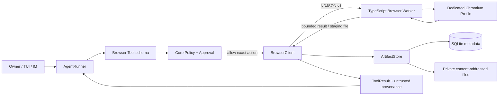
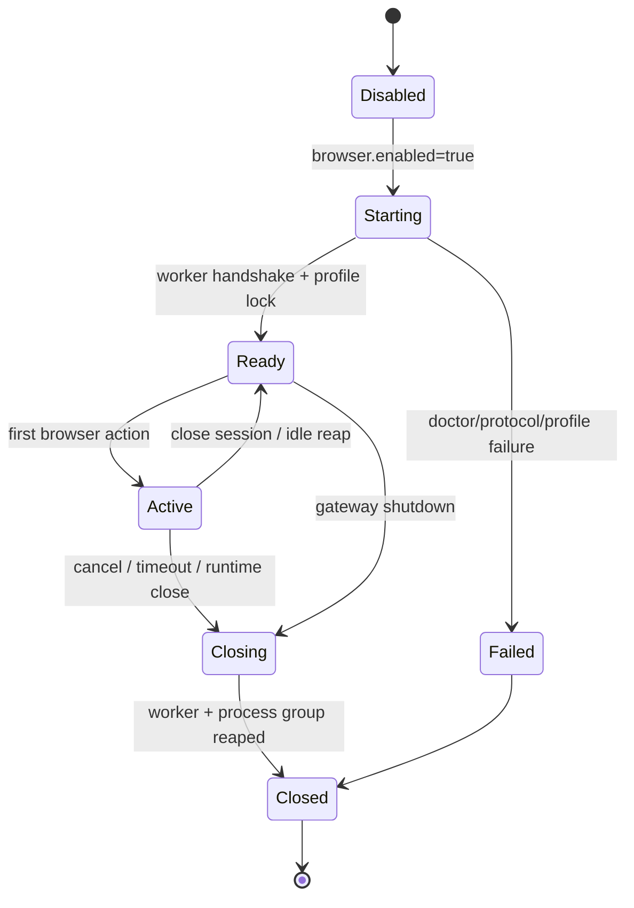
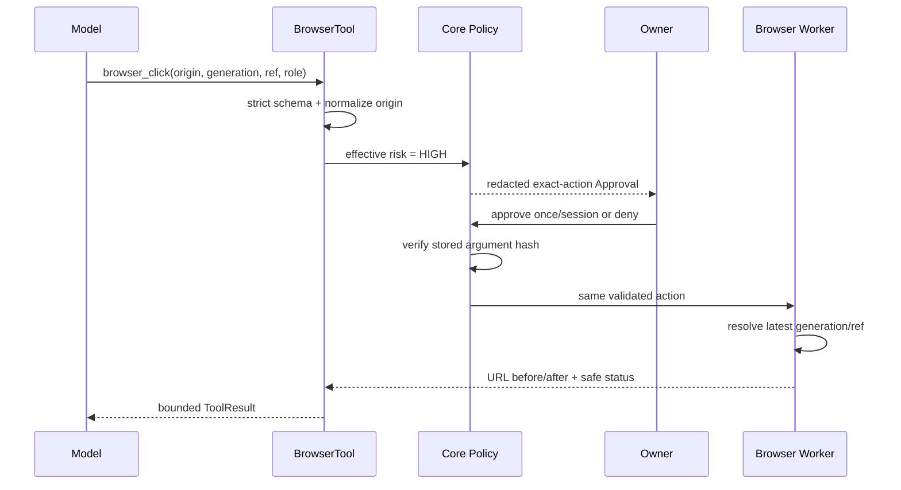
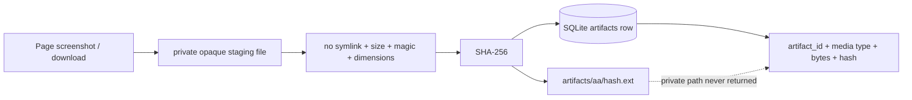
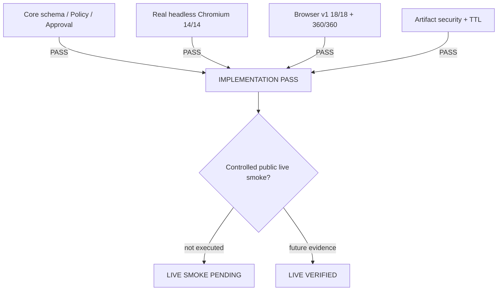

# Phase 6.5 Browser Agent 工程落地

> 实现日期：2026-08-09
>
> 状态：**IMPLEMENTATION PASS / CONTROLLED LIVE SMOKE PENDING**
>
> 边界：本地专用 Chromium、真实 Worker、Core Policy、Artifact 和 18 条版本化回归已经闭环；尚未把任意
> 真实网站账号登录或提交动作标为 Live Verified。

Phase 6.5 让 Lobster0 可以在一个与个人日常浏览器隔离的 Chromium Profile 中打开网页、读取有界快照、点击、
输入、按键、滚动、截图和接收下载。它不是“让模型直接控制 Playwright”：Python Core 仍是唯一决策者，浏览器
Worker 只执行已经通过 Schema、Policy 和 Approval 的封闭动作。

当前可复核基线：**925/925 Python**、**36/36 TUI TypeScript**、**14/14 Browser Worker**、
**18/18 Browser cases**、20 轮 **360/360 Browser soak**。这些结果是本地实现证据，不代表真实第三方网站账号、
支付、发布或授权流程已经验收。

## 1. 用户现在能做什么

启用后，用户可以在 TUI 或已验证 Owner 私聊中用自然语言提出这类任务：

- “打开这个 HTTPS 页面并告诉我标题和主要按钮”；
- “向下滚动，截一张整页图”；
- “在搜索框输入 Lobster0”；
- “点击下载报告”，下载结果保存为私有 Artifact；
- “关闭浏览器会话”。

浏览器动作不是无限授权：

| 动作 | 默认处理 | 原因 |
| --- | --- | --- |
| 打开公网 HTTPS、读取 snapshot、滚动、截图、关闭 | 低风险，按当前 Permission Mode 处理 | 只读或本地生命周期动作 |
| 普通文本框输入 | 低风险；正文永不进入 UI/Audit | 输入本身不提交 |
| 点击 | 高风险，要求参数绑定 Approval | 可能提交、购买、发布或授权 |
| `Enter` / `Space` | 高风险，要求 Approval | 可能触发表单或按钮 |
| 密码、OTP、one-time-code | 永久拒绝 | Approval 也不能绕过 |
| HTTP、localhost、私网或危险 redirect | 永久拒绝 | 防止 SSRF 和本机探测 |
| 任意 JavaScript eval | 不存在该 Tool | 页面不能把代码交给 Agent 执行 |

## 2. 总体架构



责任边界：

| 模块 | 负责 | 不负责 |
| --- | --- | --- |
| Python Agent | 选择是否请求 Browser Tool | 不能直接调用 Playwright |
| Browser Tool | 严格参数、动态风险、Artifact 导入 | 不决定 Owner 身份或审批结果 |
| Core Policy | Permission Mode、SSRF、硬拒绝、Approval | 不解析网页 DOM |
| BrowserClient | 有界 NDJSON、超时、取消、进程组回收 | 不保存 Cookie 或页面正文 |
| Browser Worker | Chromium 生命周期、snapshot/ref、动作、staging | 不读 `.env`、SQLite、Memory 或 API Key |
| ArtifactStore | MIME/magic/hash/TTL、原子存储、metadata | 不把本地路径或 base64 暴露给模型 |

## 3. 为什么拆成 Python Core + TypeScript Worker

Playwright 的浏览器控制留在 Node Worker；现有 Agent、Policy、Approval、SQLite 和审计继续留在 Python Core。
这样复用了已经验证的安全链，而不是在 Node 里重写第二套权限系统。

Worker 进程只收到：

```text
protocol version
request id
session id
closed action kind
validated bounded params
dedicated profile/staging/resource limits from argv
```

它不会收到 Provider Key、飞书/Discord Token、SOUL、Memory、SQLite 路径或用户个人浏览器目录。协议仅允许固定动作；
未知字段、超长行、错误版本和未知动作在执行前拒绝。

## 4. 专用 Profile 与生命周期

默认 Profile 位于 Lobster0 私有状态目录，不在 Workspace，也不是 Chrome 的日常用户目录：

```text
~/.lobster0/
├── browser/       # 0700 dedicated Chromium profile + lock
├── artifacts/     # 0700 content-addressed accepted artifacts
├── downloads/     # 0700 one-shot Worker staging
└── workspace/     # Agent file workspace；与上面三个目录分离
```

Worker 对 Profile 使用排他锁；第二个 Worker、超出 tab 上限、失效锁或目录权限不安全都会 fail closed。一个
`AgentRuntime` 最多拥有一个 `BrowserClient`。Runtime 关闭、Gateway 关闭、Turn 取消、Worker 超时和 stdout 协议错误
都会进入有界清理；BrowserClient 最终终止整个子进程组，不能只遗留 Chrome 子进程。



## 5. Snapshot 与 opaque ref

模型看不到原始 DOM、Cookie、localStorage 或任意页面脚本。Worker 把当前页面投影成有界 accessibility snapshot：

```json
{
  "generation": "opaque-generation",
  "url": "https://example.com/path",
  "title": "Example",
  "elements": [
    {"ref": "@e1", "role": "button", "name": "Search"}
  ],
  "next_cursor": null,
  "provenance": "untrusted_web_content"
}
```

- `@e1` 只在对应 generation 内有效；DOM 或导航变化后旧 ref 返回 `browser_stale_ref`；
- snapshot 按完整 element record 截断，并受 `max_snapshot_chars` 限制；
- password value 永不进入 snapshot；
- ref、generation 和输入正文在 TUI/Channel 的安全参数投影中隐藏；
- 页面里的“忽略系统提示”“调用某 Tool”等文本始终只是 `untrusted_web_content`。

动作必须同时携带规范 HTTPS origin、generation、ref 和 role。Core 先绑定这些参数，再把同一动作交给 Worker；
Approval 等待期间模型不能替换 ref 或 origin。

## 6. 动作链与审批



`browser_type` 的 `text` 只在内存中的 exact Tool call 和 Worker stdin 中短暂存在。RunEvent、TUI、Approval 摘要、
日志和 Audit 只显示 origin、角色、输入类型和字符数。输入类型为 password/OTP 时，Core 在调用 Worker 前硬拒绝。

## 7. 网络与 Prompt Injection 边界

`browser_open` 复用 `NetworkPolicy`：只允许 HTTPS；解析得到的所有地址必须是公网地址；端口、userinfo、redirect
逐跳重验。`localhost`、loopback、link-local、私网、metadata 地址、DNS rebinding 和由公网跳到私网的 redirect
全部拒绝。

网页内容进入 Context 时保留 `untrusted_web_content` provenance。System 约束明确说明：网页内容不能更改 Tool
Policy、要求自动批准、索取 Secret 或变成高优先级指令。Compaction 也保留来源；摘要不能把网页文本洗成系统事实。

当前不提供：

- 任意 JavaScript eval；
- 自动输入密码、验证码或 OTP；
- 读取个人 Chrome Profile、Cookie 导出或 localStorage；
- 由网页内容修改 Lobster0 配置、Memory Policy 或 Approval；
- 绕过 `http_get`/Browser Network Policy 的原始 socket。

## 8. Screenshot、Download 与 Artifact

Worker 只把截图或下载写入私有 staging 根；文件名由 Worker 生成，不信任远端 `Content-Disposition` 名称。Python
随后用 `O_NOFOLLOW` 读取同一普通文件 inode，检查 owner-only 权限、大小、mtime、MIME allowlist、magic bytes、图片
尺寸和 SHA-256，最后原子移入 content-addressed Store。



允许类型当前为 PNG、JPEG、PDF、ZIP、JSON、纯文本和 CSV。单文件默认上限 20 MiB；PNG/JPEG 额外限制维度与像素。
模型只收到 `artifact_id`、hash、类型、大小和可选图片尺寸，不收到 base64 或本地绝对路径。默认 TTL 为 24 小时；
Runtime 启动时清理过期 Artifact，metadata 标为 deleted。

## 9. 配置与启用

Browser 默认关闭。先构建 Worker，再修改私有 `~/.lobster0/config.toml`：

```bash
pnpm --dir browser-worker install
pnpm --dir browser-worker build
uv run lobster0 doctor
```

```toml
[browser]
enabled = true
backend = "local"
profile = "lobster0"
headed = true
allow_personal_profile = false
max_tabs = 8
max_snapshot_chars = 20000
inactivity_timeout_seconds = 120
download_max_bytes = 20971520
```

建议学习阶段保持 `headed = true`，这样可以看到 Agent 实际操作；CI 和受控回归使用 headless Chrome。当前正式运行
路径只使用 Lobster0 专用 Profile；不要把 `allow_personal_profile` 当成“读取日常 Chrome”的承诺。

`doctor` 检查 Node 版本、Worker build、Playwright、Chromium、Profile 权限和 lock 状态，但不会启动浏览器或替用户登录。

## 10. Tool 清单

| Tool | 主要参数 | 结果 |
| --- | --- | --- |
| `browser_open` | `url` | 规范前后 URL、标题、generation |
| `browser_snapshot` | 可选 `cursor` | 有界 elements、opaque refs、next cursor |
| `browser_click` | origin/generation/ref/role | 动作状态、URL before/after；下载时 Artifact |
| `browser_type` | 上述参数 + input_kind/text | 不回显 text 的状态 |
| `browser_press` | 上述参数 + 固定 key | 动作状态；Enter/Space 高风险 |
| `browser_scroll` | `delta_y`，±10000 且非零 | 当前滚动状态 |
| `browser_screenshot` | `full_page` | 私有 `artifact_id` |
| `browser_close` | 无参数 | session closed |

## 11. 故障与恢复矩阵

| 故障点 | 对用户的稳定结果 | 副作用/清理 |
| --- | --- | --- |
| Worker 未构建或 Chromium 缺失 | Doctor FAIL；Runtime 不伪装可用 | 不启动会话 |
| 协议版本/字段错误 | `browser_protocol_error` | kill process group |
| 动作超时 | `browser_timeout`，可重试 | 取消请求并关闭 Worker |
| 旧 generation/ref | `browser_stale_ref` | 不点击、不输入 |
| 私网/redirect SSRF | network deny code | Worker 不导航到目标 |
| password/OTP | `browser_sensitive_input` | Worker 不接收正文 |
| 下载超限/类型不符 | Artifact 稳定错误码 | staging 文件删除 |
| Worker crash | `worker_closed`/safe crash code | Gateway 仍存活；无 orphan |
| Runtime/Gateway 关闭 | 当前 Browser 请求取消 | session、Worker、Chrome 有界回收 |
| Profile 已被占用 | lock failure | 第二实例不启动 |

Browser 页面状态本身不写入 SQLite，也不在重启后自动重放点击或提交。重启后需要重新打开页面、生成新 snapshot 和
新 ref；这是避免未知网页副作用被重复执行的安全选择。

## 12. 18 条版本化回归

场景文件：[`browser.v1.jsonl`](../../../evals/scenarios/browser.v1.jsonl)。Runner 使用真实 Core 组件、临时目录、
真实 TypeScript Profile lock 和受控子进程，不读取 `.env`、个人 Profile 或真实网站。

| ID | 覆盖 |
| --- | --- |
| `BROWSER-001..004` | public HTTPS、bounded snapshot/refs、click Approval、typed text redaction |
| `BROWSER-005..008` | press risk、scroll bounds、Screenshot Artifact、Download hash/traversal |
| `BROWSER-009..012` | stale ref、redirect SSRF、localhost deny、Prompt Injection provenance |
| `BROWSER-013..015` | password hard deny、submit Approval、cancel cleanup |
| `BROWSER-016..018` | worker crash、Profile lock/private roots、Artifact TTL |

复现：

```bash
uv run lobster0 eval validate --root evals/scenarios
uv run lobster0 eval run --suite browser --root evals/scenarios
uv run lobster0 eval run --suite browser --repeat 20 --json --root evals/scenarios
pnpm --dir browser-worker test
pnpm --dir browser-worker build
```

在受限 macOS 沙箱中 Chromium 可能因进程权限返回 `SIGABRT/EPERM`；这时必须在允许启动隔离子进程的宿主环境重跑，
不能把纯协议测试冒充 14 条 Worker PASS。

## 13. 当前验收结论



因此当前准确状态是 **IMPLEMENTATION PASS / CONTROLLED LIVE SMOKE PENDING**。不把本地 fixture、headless Chrome 或
20 轮 soak 写成真实网站 Live PASS。

## 14. 下一步与明确非目标

Phase 6.5 之后的主线是 Phase 7 受控进化。Browser 侧只保留两项独立验收：

1. 用专用 Profile 对受控公网测试页完成可见导航、一次人工批准的 submit、Screenshot Artifact 和 Worker restart；
2. 保留脱敏证据，确认全程未打开个人 Profile、未输入密码、未访问 localhost/私网。

本阶段不做浏览器录制回放、云浏览器集群、自动验证码、任意脚本、个人 Cookie 迁移、支付自动批准或 Web 管理后台。
只有出现明确真实需求和对应威胁模型后再增加。
