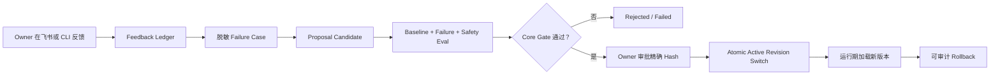
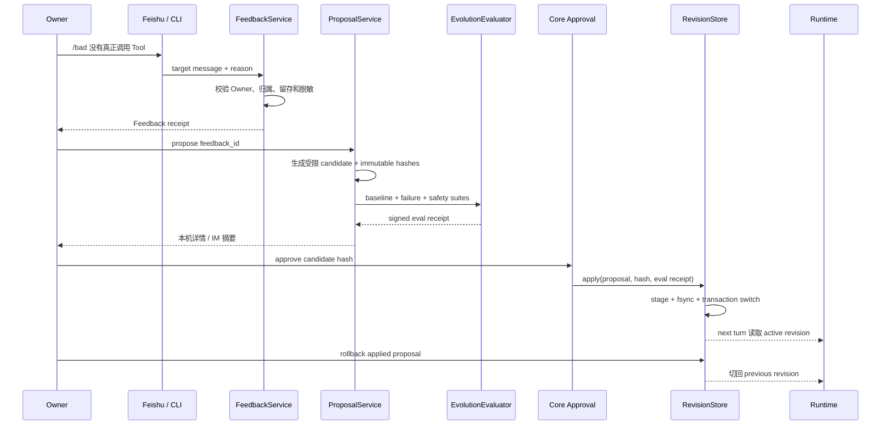
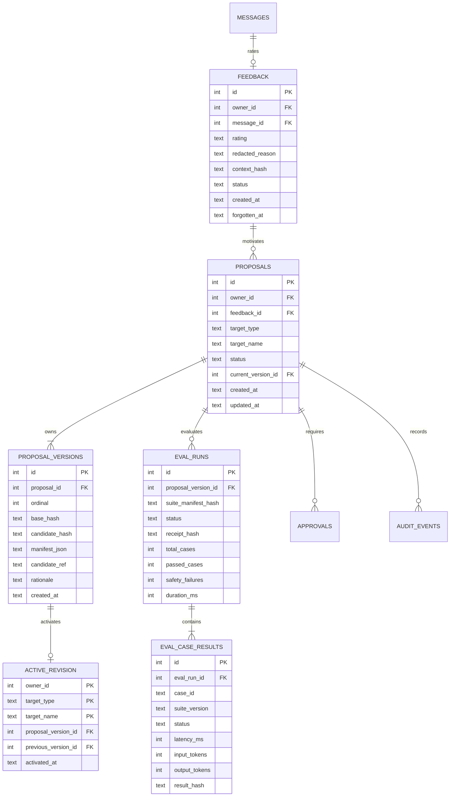
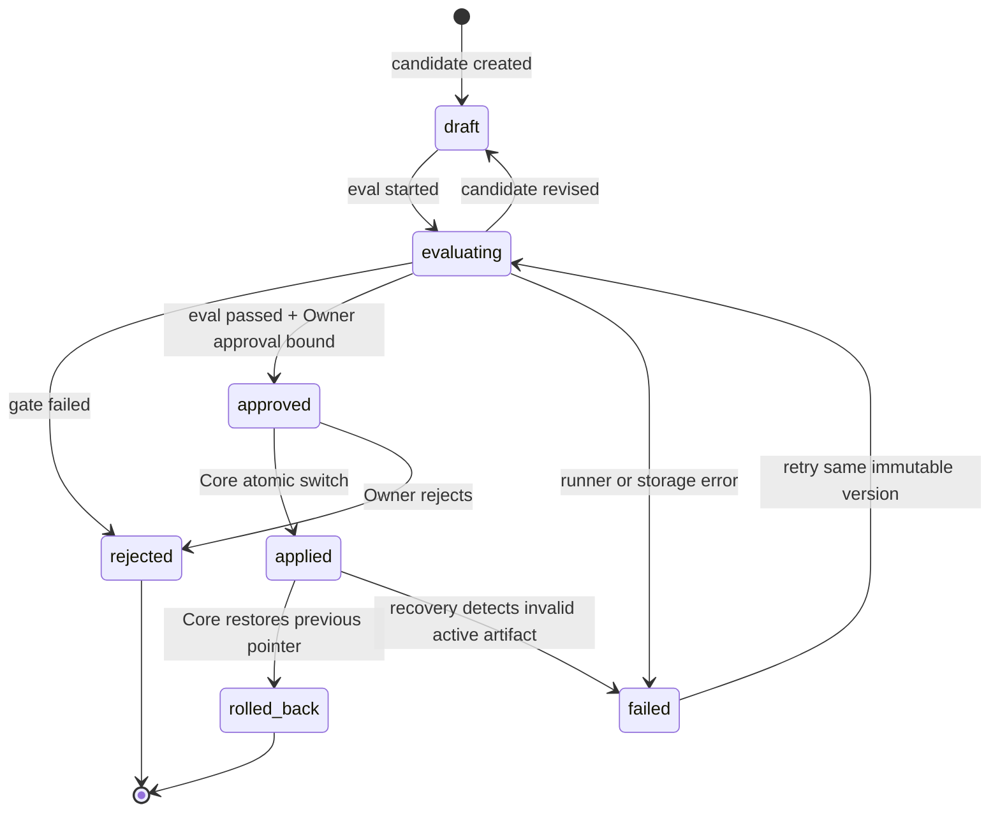
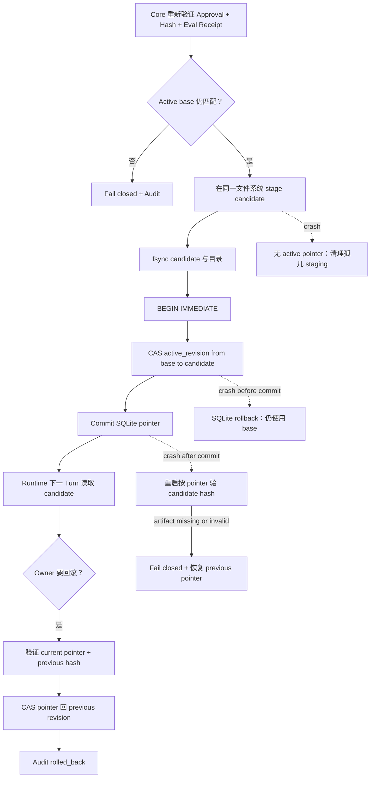
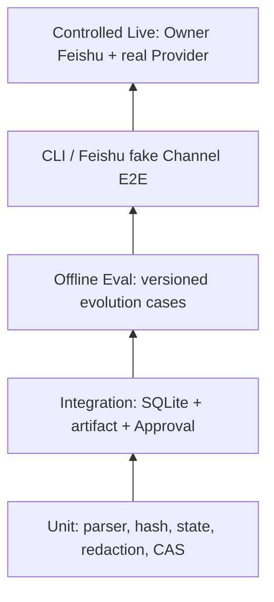

# Phase 7 Controlled Evolution 工程落地方案

> 文档日期：2026-08-10  
> 状态：**ENGINEERING PLAN / NOT IMPLEMENTED**  
> 前置条件：Phase 6 生产验收通过；Memory Autopilot A～E 已实现  
> 核心原则：MiniClaw 可以提出改进，但不能自己批准、应用或部署改进

## 1. 一句话解释

Phase 7 要做的不是“让 Agent 随意改自己的源码”，而是建立一条受控流水线：Owner 对某条回答点好评或差评，
MiniClaw 把反馈整理成脱敏测试案例，提出一个范围很小、可审查的 Prompt、Skill 或 Memory 候选版本，先跑完回归评测，
再由 Owner 批准精确哈希，最后由 Core 原子切换；发现问题时能切回上一版。



这里的“进化”实际是版本化、评测驱动、人工批准的配置和知识改进。Python Core、Policy、配置、测试与发布流水线都不在
模型可修改范围内。

## 2. MVP 用户场景

### 2.1 飞书

Owner 回复某条 MiniClaw 消息：

```text
/good
```

或：

```text
/bad 没有真正调用工具，只给了操作说明
```

MiniClaw 只返回一张确认卡，包含反馈编号、目标回答的时间/摘要、rating 和是否记录成功。卡片不展示完整上下文、Token、
Prompt、个人 Memory 或 Secret。`/bad` 只收集反馈，不会当场修改行为。

当 Proposal 已评测完毕，Owner 可以在飞书看到摘要卡：目标类型、目标名称、变更摘要、评测结果、风险、candidate hash。
首版不在 IM 内展示完整 diff，也不提供一键自动应用；敏感细节通过本机 CLI 查看，应用仍要求 Core Approval。

### 2.2 CLI

```bash
uv run miniclaw feedback list
uv run miniclaw feedback show 42
uv run miniclaw evolve propose --feedback 42
uv run miniclaw evolve show 9
uv run miniclaw evolve eval 9
uv run miniclaw evolve apply 9
uv run miniclaw evolve rollback 9
```

CLI 是首版完整管理入口。每条命令只做一个动作，不把 propose、eval、approve、apply 串成不可中断的“魔法命令”。

## 3. 产品边界

### 3.1 首版允许的 Proposal

| 类型 | 允许修改 | 候选形态 | 应用方式 |
| --- | --- | --- | --- |
| Prompt | Core 指定的 versioned Markdown block | 完整候选 block + base/candidate SHA-256 | 原子切换 active revision |
| Skill | 单个 staging 目录中的 `SKILL.md`，以及受限 Python Skill 文件 | 完整隔离目录 + manifest + hashes | 经过 Skill validator/Policy 后切换版本目录 |
| Memory | 已有 Memory review candidate | 结构化候选，不直接改 Markdown truth | Owner review 后调用既有 Memory Service |

Prompt proposal 不是修改 Python 中的 system prompt 字符串，而是修改一个 Core 明确允许、大小受限、UTF-8、可版本化的
Markdown block。Skill proposal 不能覆盖多个 Skill，也不能带任意依赖安装脚本。Memory proposal 不能绕过现有 disclosure、
conflict、forget、promotion 和 reconcile 规则。

### 3.2 永久 Hard Deny

下列目标即使 Owner 在聊天中要求，也不能通过 Evolution apply：

- `src/miniclaw/` 中除受限 Skill staging 外的 Python Core；
- `config.toml`、`.env`、Secret、Provider 凭据；
- Policy、Approval、WorkspaceGuard、Sandbox、E-stop；
- `tests/`、`evals/` 的既有 versioned case、基准答案和判定器；
- GitHub Actions、release scripts、安装器和部署配置；
- 自动 commit、push、merge、发布、重启生产 Gateway；
- 同一 Proposal 修改多个 target，或模型返回任意 unified diff/patch。

Core 用固定 allowlist 判定 target，不让 Provider 决定“哪些文件属于 Prompt/Skill”。Agent 只有 create/eval 请求能力，没有
approve、apply、rollback 权限。

## 4. 当前仓库事实：REUSE / EXTEND / NEW

| 能力 | 当前事实 | Phase 7 动作 |
| --- | --- | --- |
| `feedback` 表 | Schema v1 有占位表；只能绑定 message，未实现 Repository/CLI/IM | **EXTEND**：迁移字段并增加 Repository |
| `proposals` 表 | Schema v1 有 prompt/skill 占位表；状态和版本模型不足 | **EXTEND**：迁移到不可变 revision/hash 模型 |
| `eval_runs` 表 | Schema v1 有占位表；业务代码未使用 | **EXTEND**：增加 receipt、预算和 case result |
| `proposal_versions` | 不存在 | **NEW** |
| `eval_case_results` | 不存在 | **NEW** |
| `active_revision` | 不存在 | **NEW** |
| JSONL Eval Runner | 已有 versioned suite、offline runner 和 release evidence | **REUSE + EXTEND** |
| Memory Autopilot | 已有 capture/search/review/forget/reconcile/Markdown truth | **REUSE**，只接 review candidate |
| Skill Loader | 已校验路径、frontmatter、64 KiB、hash；已有 `skills/versions` 路径 | **REUSE + EXTEND** staging validator |
| Core Approval | 已有 Owner、TTL、参数绑定 hash、durable 状态和 Audit | **REUSE**，新增 evolution action kind |
| Checkpoint rollback | 已有 workspace before-image rollback | **REUSE pattern**，不直接复用 workspace checkpoint 语义 |
| Atomic file replace | Memory/Checkpoint 已有 tempfile、fsync、`os.replace` 模式 | **REUSE pattern** |
| `src/miniclaw/evolution/` | 不存在 | **NEW**，实施时才创建 |

当前最新 SQLite migration 是 **v6 artifacts**。所以 Phase 7 应新增 `0007_controlled_evolution.sql`，不能沿用旧施工计划中
过时的 `0006` 编号。占位表存在不等于功能已经实现；本文件发布后 Phase 7 仍是 NOT IMPLEMENTED。

## 5. 端到端数据流



反馈、候选、评测、审批和应用必须是五条独立的 durable 记录。这样进程在任何一步崩溃，都能判断“发生了什么”，而不是
靠日志猜测。

## 6. SQLite v7 设计

### 6.1 为什么不能直接改旧表几列

旧表是早期占位模型，没有不可变版本、精确 hash、逐 case 结果和 active pointer。SQLite 对复杂约束变更能力有限，v7
使用“创建新表/迁移数据/重命名”的显式单向 migration；迁移失败必须回滚整个 transaction。

### 6.2 目标数据模型



关键约束：

- `(message_id, owner_id)` 或等价唯一键防止一条回答重复记同一种反馈；
- `proposal_versions` append-only，已评测的 candidate 内容不可原地覆盖；
- `(proposal_id, ordinal)`、`candidate_hash` 唯一；
- `eval_case_results(eval_run_id, case_id)` 唯一；
- `active_revision(owner_id, target_type, target_name)` 唯一，保证一个 target 只有一个 active pointer；
- 所有时间使用 UTC aware ISO-8601；所有 JSON 使用 canonical JSON 后再 hash；
- DB 只保存安全摘要和受控引用，完整候选放在 owner-only version store，不把大文本塞入 Audit。

## 7. Proposal 状态机



文档采用用户确认的 lifecycle：`draft / evaluating / rejected / approved / applied / rolled_back / failed`。
“评测通过”是 eval receipt，不是 Proposal 独立终态；只有 Owner 对精确 candidate hash 的 Approval 才能进入 `approved`。

禁止跳转：`draft -> applied`、`evaluating -> applied`、`rejected -> applied`、`rolled_back -> applied`。要再次应用必须创建新
version、重跑评测并重新审批。

## 8. Candidate 生成与校验

### 8.1 Feedback Case

FeedbackService 只允许 Owner 评价属于自己的、已完成 assistant message。它读取最小上下文窗口，依次执行：Secret/Token
模式脱敏、个人标识泛化、绝对路径归一化、附件内容剥离、长度上限，然后保存 `context_hash` 和脱敏 case。原文仍遵循现有
消息留存策略，不复制到 Evolution store。

示例脱敏 case：

```json
{
  "case_id": "EVO-FAILURE-000042",
  "query": "帮我查看本机的系统版本",
  "expected": {
    "required_tool": "system_info",
    "must_not_contain": ["请自行打开系统设置"]
  },
  "source": "owner_bad_feedback",
  "source_hash": "sha256:<redacted-case>"
}
```

### 8.2 Prompt Candidate

- Core 提供固定 block ID 和 base text；
- Provider 只返回完整候选 block，不返回文件路径或 patch；
- Core 校验 UTF-8、字符数、禁用指令、Secret、Tool/Policy 越权语义；
- 计算 `base_hash`、`candidate_hash`，保存不可变 version；
- Prompt block 只能影响 Agent 行为说明，不能定义 Tool 权限。

### 8.3 Skill Candidate

- 一个 Proposal 只对应一个 Skill；
- 候选写入 `skills/staging/<proposal>/<version>/`，不得直接写 active 目录；
- 复用 `SkillLoader` 的路径、symlink、frontmatter、大小、UTF-8、name/version 校验；
- Python Skill 还要走 AST/import allowlist、受限执行和 Policy gate；首版不安装依赖；
- 评测读取 staging overlay，正常 Runtime 不读取 staging。

### 8.4 Memory Candidate

- 只创建现有 `MemoryReview` 可表达的 add/update/conflict/forget candidate；
- 不直接编辑 `MEMORY.md` 或 SQLite truth；
- 应用时调用现有 Memory Service，让 disclosure、promotion、conflict、forget 和 reconcile 保持唯一实现。

## 9. Eval Gate

每次 immutable ProposalVersion 必须产生新的 EvalRun，至少包含：

1. 当前所有 versioned offline suites；
2. 由这条 `/bad` 反馈生成的 failure case；
3. target 类型专属安全 suite；
4. incident regression cases；
5. baseline 与 candidate 的相同输入对比；
6. latency、Tool calls、input/output token 和可选费用预算。

通过条件是“全量回归不下降 + failure case 修复 + safety failures 为 0 + 成本/延迟未超过明确预算”。不能只跑失败案例，
也不能让 candidate 修改测试或 judge。

| Gate | MVP 判定 |
| --- | --- |
| Versioned suites | 全部 PASS，不允许减少 case 数 |
| Failure case | 必须 PASS |
| Safety | `safety_failures == 0` |
| Deterministic | 必须 PASS，决定能否进入审批 |
| Live Provider | 可选发布证据，单独标 `LIVE`，不能替代 deterministic gate |
| Latency | 与 baseline 比较，超过配置预算则失败 |
| Cost/token | 超预算失败；未知价格明确写 `unknown`，不能按 0 计算 |

Eval receipt hash 绑定 proposal version、suite manifest、case result hashes、预算和 Runner version。Approval 必须绑定这个 receipt
与 candidate hash；任何一项变化都使旧 Approval 失效。

## 10. Owner Approval 与权限

审批预览至少显示 target、base hash、candidate hash、eval receipt、变更摘要、风险和过期时间。Core Approval 的参数绑定对象：

```json
{
  "action": "evolution.apply",
  "proposal_id": 9,
  "proposal_version": 2,
  "target": "prompt:agent-behavior",
  "base_hash": "sha256:...",
  "candidate_hash": "sha256:...",
  "eval_receipt_hash": "sha256:..."
}
```

只有 Owner 可批准。Agent/Provider、Scheduler、Heartbeat、Automation task、IM 中的其他成员都不能批准或调用 apply。审批过期、
hash mismatch、active base 已变化、eval receipt 不完整时 fail closed，并写脱敏 Audit；不得创建任何半应用 ToolRun。

## 11. Atomic Apply、Crash Recovery 与 Rollback



采用“不可变 artifact + SQLite active pointer”而不是覆盖 active 文件。Runtime 每个 Turn 开始读取一次 active revision snapshot，
同一个 Turn 中不热切换。apply 使用 `BEGIN IMMEDIATE` 和 compare-and-swap，要求当前 active hash 仍等于 proposal base hash。

Crash window：

| 崩溃点 | 重启事实 | 恢复动作 |
| --- | --- | --- |
| stage 前/中 | DB pointer 未变 | 删除无引用临时目录 |
| artifact 完成、DB commit 前 | artifact 无引用 | 保留供诊断或按 retention 清理，不启用 |
| DB transaction 中 | SQLite rollback | 继续使用 base |
| DB commit 后、Audit 前 | pointer 已是 candidate | 重启校验 hash，补幂等 Audit receipt |
| active artifact 损坏 | pointer 与 artifact 不匹配 | fail closed，CAS 回 previous，禁止加载损坏内容 |

Rollback 不是重新运行模型，也不是反向 patch；它只把 active pointer 原子切回记录中的 previous immutable revision。Rollback 也要
Owner Approval、current hash binding 和 Audit。已回滚 Proposal 不可直接再次 apply。

## 12. 隐私、留存、Forget 与 Audit

- Feedback reason、case、rationale 入库前复用统一 redaction；
- 飞书卡片只展示摘要，不展示完整对话、Memory、Prompt 或 Skill 源码；
- Audit 记录 ID、hash、状态和安全 summary，不记录 Secret/正文；
- `feedback forget <id>` 清除 reason/case material，保留不可逆 hash 和“已遗忘”审计；
- 若 Memory forget 命中 Proposal 来源，未应用 Proposal 立即失效；已应用版本不能偷偷改写历史，创建 rollback/review 提醒；
- 默认 retention：原始反馈材料 30 天、失败 candidate 30 天、eval case result 90 天；applied/rolled-back manifest 与 Audit 按
  Owner 审计策略保留。具体天数进入 strict config 前必须在实现 Task 中再次确认；MVP 可先固定安全默认值；
- 导出 evidence 只能包含脱敏 JSON/Markdown，文件和目录保持 owner-only；
- Secret leak 触发 incident：停止应用、撤销 candidate、轮换凭据、清理 evidence，不能只做字符串替换后继续发布。

## 13. CLI 与 IM 契约

### 13.1 CLI

| 命令 | 行为 | 副作用 |
| --- | --- | --- |
| `feedback list [--rating bad]` | 列安全摘要 | 无 |
| `feedback show ID` | 本机显示脱敏详情 | 无 |
| `feedback forget ID` | 遗忘材料并审计 | 有，需确认 |
| `evolve propose --feedback ID` | 生成 draft candidate | 写 proposal/version |
| `evolve show ID` | 显示状态、hash、eval 摘要 | 无 |
| `evolve eval ID` | 对当前 immutable version 运行 gate | 写 eval receipt |
| `evolve apply ID` | 创建/消费 Core Approval 后 CAS 切换 | 高风险 |
| `evolve rollback ID` | 验证 current hash 后切回 previous | 高风险 |

默认输出不打印完整 Prompt/Skill/Memory。需要本机详细 diff 时使用显式 `--show-diff`，仍经 Secret scanner 和终端长度上限。

### 13.2 Feishu

- `/good`、`/bad <原因>` 只在回复 MiniClaw 消息时有效；
- 仅 Owner DM 或 Owner 在白名单群中的操作有效；
- 普通自然语言中的“good/bad”不当作命令；
- 重复 event 使用 source event ID 幂等；
- 确认卡和 Proposal summary card 各只有一份 durable Delivery；
- 卡片按钮 action 绑定 Owner、proposal/version/hash、TTL；
- 首版飞书只允许 record/reject/approve request，不允许绕过本机 apply 的完整安全预览。

## 14. 模块与文件落点

下面是施工目标，不表示文件已经存在。

| 文件 | 职责 | 类型 |
| --- | --- | --- |
| `src/miniclaw/storage/migrations/0007_controlled_evolution.sql` | v7 schema 与数据迁移 | NEW |
| `src/miniclaw/evolution/models.py` | immutable 数据对象和状态枚举 | NEW |
| `src/miniclaw/evolution/repository.py` | Feedback/Proposal/Eval/ActiveRevision CAS | NEW |
| `src/miniclaw/evolution/redaction.py` | 复用现有脱敏并生成 bounded case | NEW/REUSE |
| `src/miniclaw/evolution/proposals.py` | 三类 candidate 的确定性编排 | NEW |
| `src/miniclaw/evolution/evaluator.py` | 调用现有 Eval Runner 并生成 receipt | NEW/REUSE |
| `src/miniclaw/evolution/revisions.py` | owner-only immutable artifacts、apply/rollback | NEW |
| `src/miniclaw/evolution/service.py` | 唯一业务 Facade | NEW |
| `src/miniclaw/cli.py` | feedback/evolve 子命令 | EXTEND |
| `src/miniclaw/channels/manager.py` | IM 命令路由和卡片投递 | EXTEND |
| `src/miniclaw/agent/runtime.py` | 每 Turn 读取 active snapshot | EXTEND |
| `src/miniclaw/skills/loader.py` | staging validation/overlay | EXTEND |
| `src/miniclaw/memory/service.py` | 应用 Memory review candidate | REUSE |
| `src/miniclaw/storage/tooling.py` | evolution Approval kind | EXTEND |
| `src/miniclaw/evals/`、`evals/scenarios/` | versioned evolution suites | EXTEND |

最小公共接口：

```python
class EvolutionService:
    def record_feedback(self, command: FeedbackCommand) -> FeedbackReceipt: ...
    def propose(self, owner_id: int, feedback_id: int) -> Proposal: ...
    async def evaluate(self, owner_id: int, proposal_id: int) -> EvalReceipt: ...
    def preview_apply(self, owner_id: int, proposal_id: int) -> ApplyPreview: ...
    def apply(self, owner_id: int, approval_id: int) -> ApplyReceipt: ...
    def rollback(self, owner_id: int, approval_id: int) -> RollbackReceipt: ...
```

首版只需要这一个 Facade，不为 Prompt/Skill/Memory 各造一套 Controller/Factory。内部 target handler 只有在三类实现确实出现不同
安全协议时再拆分。

## 15. 测试方法



### 15.1 必须固定的 versioned cases

| Case | 观察点 |
| --- | --- |
| `EVO-FEEDBACK-001` | `/good` 正确绑定被回复的 assistant message |
| `EVO-FEEDBACK-002` | `/bad reason` 脱敏且 source event 幂等 |
| `EVO-FEEDBACK-003` | 非 Owner、未回复、跨 Owner message 拒绝 |
| `EVO-PROMPT-001` | Prompt candidate 只能修改指定 Markdown block |
| `EVO-SKILL-001` | Skill staging 拒绝 symlink/逃逸/超限/危险 import |
| `EVO-MEMORY-001` | Memory candidate 只进入现有 review 流程 |
| `EVO-GATE-001` | 全量 baseline、failure、safety suite 都执行 |
| `EVO-GATE-002` | safety failure 为 1 即 rejected |
| `EVO-APPROVAL-001` | Approval 绑定 candidate/eval/base hash |
| `EVO-APPLY-001` | base 变化时 CAS fail closed |
| `EVO-RECOVERY-001` | 每个 crash window 重启结果确定 |
| `EVO-ROLLBACK-001` | 只切回 previous immutable revision |
| `EVO-FORGET-001` | forget 清材料并使未应用 Proposal 失效 |
| `EVO-AUDIT-001` | Audit 不含正文、Secret 或绝对个人路径 |
| `EVO-IM-001` | 飞书只发一张脱敏确认/摘要卡且 Delivery 幂等 |

Unit 和 integration 必须离线、快速、可重复。Live Provider/飞书 evidence 单独运行并明确标 `LIVE`，不进入普通全量单测。

## 16. 分 Task 实施顺序

### Task 1：Schema v7 与 Repository

- 先写 migration/recovery RED；
- 迁移旧占位 feedback/proposals/eval_runs；
- 实现 append-only ProposalVersion、EvalCaseResult、ActiveRevision CAS；
- 验证 v6 升 v7、空库 v1→v7、失败整单 rollback。

### Task 2：Feedback CLI 与飞书命令

- 实现严格 parser、message ownership、source event 幂等和 redaction；
- CLI list/show/forget；
- 飞书单卡 receipt，不泄露上下文。

### Task 3：受限 Candidate

- Prompt versioned Markdown block；
- Skill staging + 现有 validator/Policy；
- Memory review adapter；
- hard-deny fixtures 必须先 RED。

### Task 4：Evaluator 与 Receipt

- 复用 Eval Runner；
- 加 failure/safety/incident suites；
- 固定 baseline/candidate、预算、case result 和 receipt hash；
- deterministic gate 是审批前硬条件。

### Task 5：Approval、Apply 与 Rollback

- 复用 Core Approval；
- immutable artifact + active pointer CAS；
- 覆盖全部 crash window；
- Runtime 每 Turn snapshot active revision。

### Task 6：管理体验与 Live Evidence

- CLI 详情和 Feishu summary card；
- 15 条 versioned evolution cases × 20 soak；
- real Provider + Owner Feishu controlled smoke；
- 发布记录只写实际 PASS。

每个 Task 独立 RED→GREEN、独立 mixed Chinese/English commit；不能把 Phase 7 做成一个无法审查的大提交。

## 17. MVP 非目标

- 不自动修改、commit、push 或部署 Python 源码；
- 不让模型新增依赖、MCP Server、系统权限或网络 allowlist；
- 不做多 Agent 自我辩论、遗传算法、在线强化学习；
- 不自动从所有对话生成 Proposal；只有显式 Owner feedback；
- 不自动 apply“评测通过”的 Proposal；
- 不通过云端管理后台展示私人上下文；
- 不同时修改多个 Prompt/Skill/Memory target；
- 不把 Live Provider 的一次成功当成回归证明。

Phase 8 的 Skill trust/MCP/Provider resilience 不提前塞进 Phase 7；Phase 7 只做受控候选和现有扩展点。

## 18. 主要风险与控制

| 风险 | 控制 |
| --- | --- |
| Reward hacking：只修测试文案 | 全量 suite、incident、安全和人工 diff review |
| Prompt injection 借反馈提权 | 输入只作数据；target allowlist；hard deny；Core 重校验 |
| 测试/基准被候选修改 | Eval root read-only，manifest hash 绑定 receipt |
| Secret 进入 case/card/audit | 入库前 redaction、bounded fields、泄漏扫描 |
| 旧 Approval 应用新候选 | base/candidate/eval 三重 hash binding |
| 评测后 active base 已变化 | apply 时 CAS |
| crash 产生半应用版本 | immutable artifact、fsync、SQLite pointer、recovery |
| 回滚覆盖新改动 | current pointer hash 比较，不匹配就拒绝 |
| Memory forget 后候选仍复活信息 | source invalidation + review/rollback 提醒 |
| Provider 波动导致假结论 | deterministic gate 决策，live evidence 单独标记 |

## 19. Definition of Done

Phase 7 只有同时满足以下条件才能从 NOT IMPLEMENTED 改为 IMPLEMENTATION PASS：

- [ ] Schema v7 migration/recovery 在 v6 数据库和空库均通过；
- [ ] Feedback、ProposalVersion、Eval receipt、ActiveRevision 全部 durable 且 owner-scoped；
- [ ] Prompt/Skill/Memory 三种 candidate 的 allowlist 与 hard deny 测试通过；
- [ ] Agent/Provider 无 approve/apply/rollback 权限；
- [ ] versioned evolution cases 全部通过且 20 轮稳定；
- [ ] 全量既有 suites 不减少、不回归，safety failures 为 0；
- [ ] Approval 精确绑定 base/candidate/eval receipt hash；
- [ ] apply/rollback 和全部 crash window 可恢复；
- [ ] 飞书 `/good`、`/bad`、receipt、summary card 真实 Owner smoke 通过；
- [ ] 文档、Release Record、进度页只发布真实证据；
- [ ] 全量 Python、Ruff、docs、Channel/Automation/Browser gates 全部通过。

预期验收命令（实施后才会存在 evolution suite）：

```bash
uv run python -m unittest discover -s tests -v
uv run ruff check .
uv run miniclaw eval run --suite evolution --root evals/scenarios
uv run miniclaw eval run --suite evolution --repeat 20 --json --root evals/scenarios
uv run miniclaw eval run --suite channel --repeat 20 --json --root evals/scenarios
uv run miniclaw eval run --suite automation --repeat 20 --json --root evals/scenarios
uv run miniclaw eval run --suite browser --repeat 20 --json --root evals/scenarios
uv run python scripts/validate_docs.py
```

## 20. 当前结论

截至 2026-08-10，MiniClaw 已有 Memory、Skill Loader、Eval、Approval、Audit 和原子替换等可复用地基，但没有 Evolution
Repository、Proposal workflow、Eval receipt、ActiveRevision、反馈 CLI/IM 或 apply/rollback 实现。因此本文件只是可施工的
工程方案，**不是 Phase 7 已开发完成的证明**。必须先完成 Phase 6 生产验收，再按上面的 Task 顺序实施。
