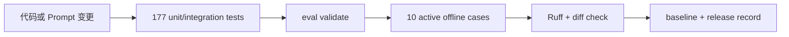

# MiniClaw 版本回归记录

这个目录保存“某个代码版本通过了哪些 Agent 场景”的脱敏发布记录。可执行场景数据在
[`evals/scenarios/`](../../evals/scenarios/)，详细工程实现见
[P2.1C Agent 回归工程文档](../engineering/phase-2/agent-regression-evals.md)。

## 三类文件不要混淆

| 位置 | 用途 | 是否提交 Git |
| --- | --- | --- |
| `evals/scenarios/*.jsonl` | 版本化 query、合成 Workspace、脚本模型响应和确定性断言 | 是 |
| `evals/baselines/vX.Y.Z.json` | 某个 source commit 的脱敏机器可读基线 | 是 |
| `docs/evals/releases/vX.Y.Z.md` | 人可以直接阅读的版本结论、限制和复现命令 | 是 |
| `~/.miniclaw/evals/runs/` | 未来 live 运行的原始本地记录 | 否 |

## 当前 gate

当前提交门禁要求：unittest 全绿、Ruff 全绿、场景输入全部有效、10 个 active offline case 100% PASS。
真实模型受网络、账户和模型漂移影响，R3 才加入 release-only 的 3 次采样门禁，不会伪装成当前已完成能力。

## 版本规则

- `suite_version` 变更表示场景 Schema 或 gate 语义变化；
- case ID 发布后永久稳定，语义变化新增 ID；
- 修复线上/本地事故时必须先制造对应 RED，再把事故 ID 写入测试或场景；
- baseline 记录被测试的 source commit，不要求等于随后添加文档的 commit；
- baseline 只存状态、短码、计数、环境大版本和命令，不存 Prompt、回答、主机详情或绝对路径。

## 发布记录

- [v0.1.0：offline-v1 首个 Agent 场景基线](releases/v0.1.0.md)
