# MiniClaw 版本回归记录

这个目录保存“某个代码版本通过了哪些 Agent 场景”的脱敏发布记录。可执行场景数据在
[`evals/scenarios/`](../../evals/scenarios/)，详细工程实现见
[P2.1C Agent 回归工程文档](../engineering/phase-2/20260808_agent-regression-evals.md)。

## 三类文件不要混淆

| 位置 | 用途 | 是否提交 Git |
| --- | --- | --- |
| `evals/scenarios/*.jsonl` | 版本化 query、合成 Workspace、脚本模型响应和确定性断言 | 是 |
| `evals/baselines/vX.Y.Z.json` | 某个 source commit 的脱敏机器可读基线 | 是 |
| `docs/evals/releases/vX.Y.Z.md` | 人可以直接阅读的版本结论、限制和复现命令 | 是 |
| `~/.miniclaw/evals/runs/` | 未来 live 运行的原始本地记录 | 否 |

## 当前 gate

```mermaid
flowchart LR
    CHANGE["代码或 Prompt 变更"] --> UNIT["1005 Python + 36/36 TUI + 14/14 Worker"]
    UNIT --> VALIDATE["eval validate"]
    VALIDATE --> OFFLINE["39 active offline cases"]
    OFFLINE --> CHANNEL["33 active Channel cases"]
    CHANNEL --> SOAK["20 runs / 660 checks"]
    SOAK --> AUTO["15 Automation / 300 soak"]
    AUTO --> BROWSER["18 Browser / 360 soak"]
    BROWSER --> RUFF["Ruff + docs + diff check"]
    RUFF --> LIVE["15-step live harness per platform"]
    LIVE --> RECORD["release record"]
```

当前全仓门禁是 **IMPLEMENTATION PASS**：1005/1005 Python、36/36 TUI TypeScript、14/14 Browser Worker、
39/39 active offline Agent、33/33 Channel、660/660 local Channel soak、15/15 Automation、300/300 Automation
soak、18/18 Browser 与 360/360 Browser soak。Feishu 是
**TARGETED CALLBACK LIVE VERIFIED / 15-CASE LIVE PENDING**；Telegram 与 Discord 的真实验收均为
**LIVE PENDING**；Docker 为 **LIVE VERIFIED**，Seatbelt 为 **LIVE PENDING**。
Phase 2 release 已执行一次脱敏 DeepSeek smoke；`ACTION-OPEN-APP-001` 已单独完成 3 次 planning probe。
通用 live runner、费用趋势和 compare CLI 仍是后续能力。
Browser 是 **CONTROLLED LIVE SMOKE PENDING**；本地 headless Chromium 与 fixture 不冒充公网 Live PASS。
Phase 6 macOS + 飞书生产验收工具已完成，仍为 **PRODUCTION SOAK PENDING**；没有同一 clean commit 的严格
25-case、受管 recovery 与连续 24h aggregate，就不能写 production verified。

## 版本规则

- `suite_version` 变更表示场景 Schema 或 gate 语义变化；
- case ID 发布后永久稳定，语义变化新增 ID；
- 修复线上/本地事故时必须先制造对应 RED，再把事故 ID 写入测试或场景；
- baseline 记录被测试的 source commit，不要求等于随后添加文档的 commit；
- baseline 只存状态、短码、计数、环境大版本和命令，不存 Prompt、回答、主机详情或绝对路径。

## 发布记录

- [v0.1.0：offline-v1 首个 Agent 场景基线](releases/v0.1.0.md)
- [v0.2.0：Phase 2 Tool、安全、Approval 与 live smoke](releases/v0.2.0.md)
- [v0.3.0：Phase 3 Memory、Skills 与 Compaction](releases/v0.3.0.md)
- [v0.4.0：Phase 4 Feishu Channel](releases/v0.4.0.md)
- [v0.4.1：Personal Machine 权限与本机 CLI 发现](releases/v0.4.1.md)
- [v0.5.0：Phase 5 Telegram/Discord multi-channel](releases/v0.5.0.md)
- [v0.5.1：Phase 5.1 Feishu real Bot Live E2E gate](releases/v0.5.1.md)
- [v0.5.2：Phase 5.2 Feishu single-card + direct lark-cli Skill](releases/v0.5.2.md)
- [v0.6.0：Memory Autopilot A～E](releases/v0.6.0.md)
- [v0.6.1：Memory A～E + Feishu callback/continuation hardening](releases/v0.6.1.md)
- [v0.7.0：Phase 6 Autonomy + Sandbox + Checkpoint](releases/v0.7.0.md)
- [v0.6.5：Phase 6.5 Isolated Browser Agent capability record](releases/v0.6.5.md)
