# MiniClaw 版本回归记录

这个目录保存“某个代码版本通过了哪些 Agent 场景”的脱敏发布记录。可执行场景数据在
[`evals/scenarios/`](../../evals/scenarios/)，详细工程实现见
[P2.1C Agent 回归工程文档](../engineering/phase-2/agent-regression-evals.md)。

## 三类文件不要混淆

| 位置 | 用途 | 是否提交 Git |
| --- | --- | --- |
| `evals/scenarios/*.jsonl` | 版本化 query、合成 Workspace、脚本模型响应和确定性断言 | 是 |
| `evals/baselines/vX.Y.Z.json` | 某个 source commit 的脱敏机器可读基线 | 是 |
| `docs/evals/releases/vX.Y.Z.md` | 人可以直接阅读的版本结论、限制和复现命令 | 是 |
| `~/.miniclaw/evals/runs/` | 未来 live 运行的原始本地记录 | 否 |

## 当前 gate

```mermaid
flowchart LR
    CHANGE["代码或 Prompt 变更"] --> UNIT["517 Python + 30 TypeScript"]
    UNIT --> VALIDATE["eval validate"]
    VALIDATE --> OFFLINE["28 active offline cases"]
    OFFLINE --> CHANNEL["32 active Channel cases"]
    CHANNEL --> SOAK["20 runs / 640 checks"]
    SOAK --> RUFF["Ruff + docs + diff check"]
    RUFF --> LIVE["15-step live harness per platform"]
    LIVE --> RECORD["release record"]
```

当前 Phase 5 门禁是 **IMPLEMENTATION PASS**：517/517 Python tests、30/30 TypeScript、28/28 active offline Agent、
32/32 Channel、640/640 local soak。Feishu 是 **FEISHU E2E HARNESS PASS / REAL BOT PENDING**；Telegram 与
Discord 的真实验收均为 **LIVE PENDING**。
Phase 2 release 已执行一次脱敏 DeepSeek smoke；`ACTION-OPEN-APP-001` 已单独完成 3 次 planning probe。
通用 live runner、费用趋势和 compare CLI 仍是后续能力。

## 版本规则

- `suite_version` 变更表示场景 Schema 或 gate 语义变化；
- case ID 发布后永久稳定，语义变化新增 ID；
- 修复线上/本地事故时必须先制造对应 RED，再把事故 ID 写入测试或场景；
- baseline 记录被测试的 source commit，不要求等于随后添加文档的 commit；
- baseline 只存状态、短码、计数、环境大版本和命令，不存 Prompt、回答、主机详情或绝对路径。

## 发布记录

- [v0.1.0：offline-v1 首个 Agent 场景基线](releases/v0.1.0.md)
- [v0.2.0：Phase 2 Tool、安全、Approval 与 live smoke](releases/v0.2.0.md)
- [v0.3.0：Phase 3 Memory、Skills 与 Compaction](releases/v0.3.0.md)
- [v0.4.0：Phase 4 Feishu Channel](releases/v0.4.0.md)
- [v0.4.1：Personal Machine 权限与本机 CLI 发现](releases/v0.4.1.md)
- [v0.5.0：Phase 5 Telegram/Discord multi-channel](releases/v0.5.0.md)
- [v0.5.1：Phase 5.1 Feishu real Bot Live E2E gate](releases/v0.5.1.md)
