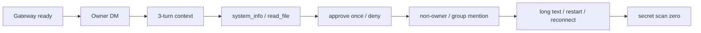

# MiniClaw Eval Record v0.5.1

> 日期：2026-08-08
>
> 阶段：Phase 5.1 Feishu real Bot Live E2E gate
>
> 当前结论：**IMPLEMENTATION PASS / FEISHU E2E HARNESS PASS / REAL BOT PENDING**

本记录把“飞书 production Channel 已实现”和“飞书真实企业应用已经验收”严格分开。当前已实现 15 条版本化真实场景、
有界 Gateway runner、只读 SQLite evidence、人工客户端 evidence、Secret scan 与严格报告；尚未创建/发布本轮专用真实
Bot，也没有 15/15 的真实平台 Evidence，因此不能写 `FEISHU E2E VERIFIED`。

## 1. 版本化实现

| 主题 | Commit |
| --- | --- |
| 设计规格 | `2bf4edf` |
| TDD 实施计划 | `fcffb1b` |
| 15 条 Live scenario contract | `c1cde62` |
| read-only SQLite evidence | `42e13eb` |
| bounded Gateway lifecycle | `b1372b3` |
| redacted Evidence / Secret scan | `00d4477` |
| interactive real Bot orchestrator | `1301b31` |

## 2. 门禁口径

```bash
uv run python -m unittest discover -s tests -v
corepack pnpm --dir tui test
uv run ruff check .
uv run miniclaw eval validate --root evals/scenarios
uv run miniclaw eval run --suite all --root evals/scenarios
uv run miniclaw eval run --suite channel --repeat 20 --json --root evals/scenarios
uv run python scripts/validate_docs.py
uv lock --check
uv build
git diff --check
git status --short
```

| Gate | 当前记录 |
| --- | --- |
| Python suite size | **517/517 PASS** |
| TypeScript | **30/30 PASS** |
| active offline Agent | **28/28 PASS** |
| retained Feishu Channel | **12/12 PASS** |
| Telegram + Discord Channel | **20/20 PASS** |
| combined Channel | **32/32 PASS** |
| local Channel soak | **20 轮、640/640 PASS** |
| scenario validation | **75/75 PASS** |
| Feishu Live dataset | 15 条固定 ID、schema 校验通过 |
| Feishu Live harness | **PASS**；离线契约与 fake subprocess/SQLite 集成通过 |
| Ruff / docs / lock / build | **PASS** |
| real Feishu Bot | **REAL BOT PENDING** |
| real Feishu 15/15 | **PENDING**，没有伪造 Evidence |

以上本地门禁于 2026-08-08 从干净提交重新执行。真实平台状态仍必须由独立 Live Evidence 决定，不能由本地
517/517 或 640/640 替代。

## 3. 新增能力

- `FEISHU-LIVE-001` 到 `FEISHU-LIVE-015` 的固定 JSONL 数据集；
- strict local/human evidence allowlist；
- checkpoint 后的 Feishu-only Inbox、Turn、ToolRun、Approval、Delivery、Audit 查询；
- 跨 case pending → consumed Approval 快照；
- exact ready marker、stdout/stderr 并发排空、200×4096 有界 diagnostics；
- 两次 SIGTERM、无自动 SIGKILL；
- 0600、O_EXCL、fsync、strict nested schema Evidence；
- symlink/大文件/第 1001 个文件跳过的 Secret scan；
- `--confirm-live` 前 config/state/secret/network/output 零访问；
- 单 Feishu Channel、clean commit、Doctor、Gateway preflight 与旧审批检查；
- 自动 evidence 失败不能被人工 `p` 覆盖；
- restart case 的 checkpoint 后两次真实 Gateway restart；
- 运行中 HEAD/dirty 变化使最终 release fail。

## 4. 15 条真实场景覆盖



它们同时覆盖业务可用性和安全边界，但离线测试只证明 Runner 的判定逻辑，不证明真实飞书 Scope、发布范围、WebSocket、
消息 API 或客户端显示。

## 5. Evidence 发布判定

| 状态 | 必要条件 |
| --- | --- |
| `FEISHU_E2E_VERIFIED` | 恰好 15 case 全 pass、Gateway ready/优雅退出、Secret scan 0、commit 未变化 |
| `FEISHU_LIVE_PARTIAL` | case 不完整或存在 skip，但没有自动失败 |
| `FEISHU_LIVE_FAILED` | 自动/人工失败、Secret 命中、Gateway 失败或 repository 变化 |

Evidence 默认位于 Git 忽略的 `.local/eval-results/feishu/`。它只含 commit、UTC、case/evidence 状态和匿名计数；
不得提交到 Git，也不得复制完整 Open ID、Chat ID、Message ID、正文、Secret、Prompt、reasoning 或 Tool 参数。

## 6. 为什么当前仍是 REAL BOT PENDING

当前尚未完成：

1. 创建 `MiniClaw E2E Bot` 企业自建应用；
2. 启用机器人和最小消息 Scope；
3. 订阅 `im.message.receive_v1` 长连接；
4. 发布 Owner-only 测试版本；
5. 使用同应用 `miniclaw-e2e` profile 发现 Owner Open ID；
6. 完成私聊 P0；
7. 加入唯一专用测试群；
8. Runner 返回 0 并生成 15/15 redacted Evidence。

因此本版本准确状态是：

```text
IMPLEMENTATION PASS
FEISHU E2E HARNESS PASS
REAL BOT PENDING
```

详细操作见 [真实飞书 Bot 与 Live E2E 工程落地](../../engineering/phase-5/20260808_feishu-live-e2e.md)。
