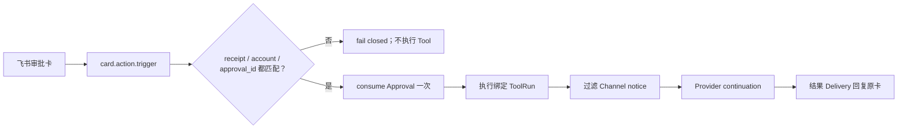

# MiniClaw Eval Record v0.5.3

> 日期：2026-08-09
>
> 阶段：Phase 5.3 Feishu Card callback hardening + Live Gate provenance
>
> 结论：**IMPLEMENTATION PASS / TARGETED FEISHU LIVE VERIFIED / 15-CASE LIVE PENDING**

本版本解决真实飞书审批链路暴露的两个生产问题：卡片 callback 只凭 payload 决策，缺少来源卡片 receipt
绑定；以及审批卡 fallback notice 混入 Provider Context，破坏 `assistant tool_call → tool result` 的协议顺序。
两项修复均先由真实链路复现，再写离线回归测试，最后回到真实机器人验证。

## 1. 用户可见结果



- 旧卡、伪造 `message_id`、跨账号 receipt 或 payload 中错误的 `approval_id` 不能改变 Core 状态；
- callback 的 source card 必须是 SQLite 中该账号已成功发送的 `approval` Delivery；
- SDK 的普通 outbound error 不再把健康 WebSocket 标成 failed；
- Channel fallback notice 只服务 IM 展示，永远不进入 Provider Context；
- Approval child Turn 恢复结构化 Tool Call/Result 后，Provider 可以继续生成最终答复；
- Feishu 三轮上下文 Live Query 明确禁止 Tool，避免测试本身诱发写入审批。

## 2. 永久回归

| 回归点 | 失败前 | v0.5.3 |
| --- | --- | --- |
| Card source binding | 只校验 callback payload | 同时校验 sent receipt、channel、account、kind、approval ID |
| Receipt ambiguity | 无反向查找 | 只有唯一 sent Delivery 才返回，0 条或多条均 fail closed |
| SDK outbound error | 把连接状态改成 failed | 连接状态只由 connect/reconnecting/reconnected 生命周期改变 |
| Approval continuation | Channel notice 插在 Tool Call 和 Result 之间 | notice 从 Provider-safe Context 删除 |
| Live context case | 模型可能自行调用写入 Tool | 三轮都显式要求“不要调用任何工具” |

核心测试位于：

- `tests/test_channel_approvals.py`
- `tests/test_channel_storage.py`
- `tests/test_feishu_transport.py`
- `tests/test_turn.py`

## 3. 发布门禁

| Gate | v0.5.3 结果 |
| --- | --- |
| Python | **556/556 PASS** |
| offline Agent | **29/29 PASS** |
| Channel | **32/32 PASS** |
| Channel 20-run soak | **640/640 PASS** |
| Ruff | **PASS** |
| Docs / Mermaid / links | **PASS** |
| `uv lock --check` | **PASS** |
| sdist / wheel build | **PASS** |

复现命令：

```bash
uv run python -m unittest discover -s tests -v
uv run miniclaw eval run --suite offline --root evals/scenarios
uv run miniclaw eval run --suite channel --root evals/scenarios
uv run miniclaw eval run --suite channel --repeat 20 --json --root evals/scenarios
uv run ruff check .
uv run python scripts/validate_docs.py
uv lock --check
uv build
git diff --check
```

## 4. 真实飞书证据

飞书开发者后台已发布 `card.action.trigger` callback。真实 Owner DM 已观察到：

| 范围 | 真实结果 |
| --- | --- |
| Gateway ready、Owner DM、三轮 Context | VERIFIED |
| `system_info`、`read_file` | VERIFIED |
| 只显示一张 Approval card | VERIFIED |
| “仅本次” callback | Approval consumed，绑定 `write_file` succeeded |
| Approval continuation | child Turn completed，结果 message Delivery sent |
| 完整 `FEISHU-LIVE-001..015` 报告 | **PENDING** |

这次真实验证使用长期 Owner 私聊时，后续场景受到旧会话和额外审批干扰，因此没有生成可声明
`FEISHU_E2E_VERIFIED` 的 15/15 Evidence。上表只能叫 **targeted live observation**，不能替代完整 Gate。
最终 Gate 必须使用专用测试会话/群组、非 Owner 测试账号、稳定网络中断步骤，并由同一 exact-commit Runner
生成脱敏报告。

## 5. 安全与清理

- Live Runner 使用独立 state home 和单实例 lease；
- 默认 Feishu Gateway 在测试期间临时禁用，结束后恢复；
- 测试生成的 `approved.txt` 和意外测试文件已精确删除；
- 未读取、输出或提交 App Secret、Token、`.env` 或私人文档内容；
- 临时 state 中的 pending approvals 只做 deny 清理，从未代替 Owner approve。

## 6. 下一步

1. 创建专用飞书测试群并写入唯一 `allowed_chat_ids`；
2. 准备非 Owner 测试账号，完成 009 的拒绝边界；
3. 在专用会话完成 008–015、restart、overflow、reconnect 和 Secret scan；
4. 配置 Discord 私有测试服务器与 Bot Token，运行 15-step Discord Live Gate；
5. 两个平台严格通过后，才把 Phase 5.3 标成 live complete，并进入 Phase 6 implementation。
