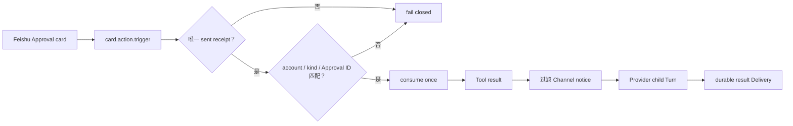

# Lobster0 Eval Record v0.6.1

> 日期：2026-08-09
>
> 范围：Memory Autopilot A～E + Feishu Card callback receipt/continuation hardening
>
> 结论：**IMPLEMENTATION PASS / TARGETED CALLBACK LIVE VERIFIED / 15-CASE LIVE PENDING**

本记录描述 v0.6.0 Memory 主线与 Phase 5.3 飞书修复合并后的统一状态。它证明本地 Core、安全门禁、
Provider continuation 与持久 Outbox 没有回归；它不把一次 targeted live observation 冒充完整 15-case。

## 1. 本次合并解决什么



- callback 来源必须反查同平台、同账号、`approval` kind 的唯一 sent Delivery；
- receipt 中的 v2 durable envelope 必须与按钮 Approval ID 精确一致；
- 缺失、歧义、损坏、legacy v1 或伪造来源都在更新卡片和执行 Tool 前 fail closed；
- Channel notice 只供 IM 展示，不进入 Provider Context；
- Approval continuation 使用 Provider-safe Context，保持 `assistant tool_call → tool result` 连续；
- Memory Autopilot 的 Owner disclosure、Markdown Truth、FTS5 与治理边界保持不变。

## 2. 当前确定性门禁

| Gate | v0.6.1 |
| --- | --- |
| Python | **671/671 PASS** |
| TypeScript | **35/35 PASS + build PASS** |
| Offline Agent | **39/39 PASS** |
| Channel | **32/32 PASS** |
| Channel local soak | **640/640 PASS** |
| Ruff / docs / lock / build / diff | **PASS** |

复现命令：

```bash
uv run python -m unittest discover -s tests -v
pnpm --dir tui test
pnpm --dir tui build
uv run lobster0 eval run --suite offline --root evals/scenarios
uv run lobster0 eval run --suite channel --root evals/scenarios
uv run lobster0 eval run --suite channel --repeat 20 --json --root evals/scenarios
uv run ruff check .
uv run python scripts/validate_docs.py
uv lock --check
uv build
git diff --check
```

## 3. 真实平台结论

| 范围 | 结论 |
| --- | --- |
| Feishu Owner DM / completed card | VERIFIED |
| Approval card 只保留一张 | VERIFIED |
| “仅本次” callback | Tool succeeded；child Turn completed；result Delivery sent |
| receipt / account / Approval ID 绑定 | targeted live + deterministic regression |
| Feishu `FEISHU-LIVE-001..015` 同 commit 报告 | **PENDING** |
| Telegram / Discord real-platform gate | **PENDING** |

因此只能写 **TARGETED CALLBACK LIVE VERIFIED / 15-CASE LIVE PENDING**。专用测试群、非 Owner 测试账号、
overflow/restart/reconnect 和 Secret scan 仍需由同一 exact-commit Runner 生成完整 evidence。

## 4. 安全与隐私

- 不保存 App Secret、Token、`.env`、私人消息正文、平台 ID 或绝对路径；
- 测试使用临时 SQLite、合成 envelope 和 fake SDK；
- Live 测试生成的临时文件已精确清理；
- 本地 fake/soak 只证明 implementation，不升级平台 Live 状态。

工程细节见 [Feishu Live E2E](../../engineering/phase-5/20260808_feishu-live-e2e.md)、
[测试与 Live Acceptance](../../engineering/phase-5/20260808_testing-and-live-acceptance.md)和
[Memory Autopilot](../../engineering/phase-5/20260809_memory-autopilot.md)。
