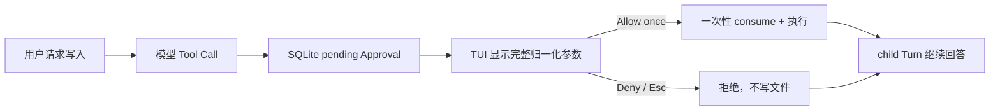

# MiniClaw 本地运行指南

## 当前可以运行什么

当前版本已完成默认 pi-tui 与 Phase 4 的代码/离线门禁：

```text
pi-tui → versioned NDJSON Bridge → AgentRuntime ← Feishu Gateway
                                      ↓
                         TurnService → AgentRunner → DeepSeek / ToolExecutor → SQLite
```

已支持：

- 裸 `miniclaw` 的唯一全屏 TUI；
- 流式回答、Tool 状态卡、Enter/Shift+Enter、Esc 取消；
- `system_info`、`read_file`、`glob`、`grep`；
- 受审批保护的 `write_file`、`edit_file`；
- 不经过 Shell、受 exact-argv Policy 与审批保护的 `run_command`；
- 只读、固定公网地址并限制文本响应的 `http_get`；
- SQLite 会话、ToolRun、Approval、Audit 和 child Turn 续跑；
- Markdown 长期/daily Memory、经审批的 `propose_memory` 与只读 `read_memory`；
- `SKILL.md` metadata 扫描、当前 Query 惰性匹配和最多 3 个正文注入；
- SQLite persistent compaction、原消息保留与进程重启恢复；
- 28 条 Claw-like query 的离线 Agent 回归，其中四条固定 Personal/CLI 权限事故。
- 飞书官方 WebSocket SDK、私聊/群 mention 白名单、durable Inbox/Outbox、Typing、进度卡和审批 fallback；
- 12 条飞书 Channel 离线回归与 `miniclaw gateway` 常驻入口。

Personal Profile、NVM/Node 路径发现和 `lark-cli --version` 只读纵切已经支持。尚未支持：Telegram/Discord、
向量检索与自动演进。本机尚未配置飞书企业应用凭据，所以 `lark-cli auth status`、真实 Scope、WebSocket 与平台
验收仍待执行；“能找到 CLI”不等于“已经登录飞书”。

## 1. 环境要求

- Python 3.12+；
- Node.js 22.19+ 与 pnpm（默认 pi-tui）；
- `uv`；
- macOS 或 Linux；
- 支持全屏应用的真实 TTY，且 `TERM` 不能是 `dumb`；
- `init` 和 offline/channel eval 不需要模型 Key 或外网；`doctor` 不联网，但会读取私密 `.env` 检查变量；
- TUI 对话需要 DeepSeek Key 与网络。

## 2. 安装

```bash
uv venv
uv sync --extra dev
corepack enable
pnpm --dir tui install --frozen-lockfile
pnpm --dir tui build
uv run miniclaw --version
```

Python 运行依赖包含 HTTPX 与迁移期 Textual fallback；TypeScript TUI 固定 pi-tui 版本。唯一脚本入口由 `pyproject.toml` 提供：

```toml
[project.scripts]
miniclaw = "miniclaw.cli:main"
```

## 3. 配置模型凭据

```bash
cp .env.example .env
chmod 600 .env
```

编辑仓库根目录 `.env`：

```dotenv
MINICLAW_MODEL_API_KEY=your-deepseek-api-key
```

安全规则：

- `.env` 必须是普通文件，POSIX 权限必须为 `0600`；
- 只解析简单 `KEY=value`，不执行 shell、变量展开或 command substitution；
- 裸 `miniclaw` 从启动命令的当前目录加载 `.env`；
- 进程环境优先于 `.env`；
- `.env` 被 Git 忽略，禁止复制到 issue、日志、测试 fixture 或文档；
- `init` 和 eval 不读取 Key；`doctor` 只检查 Key/Secret 变量是否非空，不显示值或联网。

初始化生成的默认 Provider：

```toml
[agent]
model = "deepseek-v4-pro"
max_tool_iterations = 8
context_budget_tokens = 32000
tool_result_max_chars = 20000

[provider]
base_url = "https://api.deepseek.com"
api_key_env = "MINICLAW_MODEL_API_KEY"
timeout_seconds = 120
```

## 4. 初始化与诊断

```bash
uv run miniclaw init
uv run miniclaw doctor
```

隔离状态可使用绝对路径：

```bash
uv run miniclaw init --home /absolute/path/to/miniclaw-state
uv run miniclaw doctor --home /absolute/path/to/miniclaw-state
```

也可设置 `MINICLAW_HOME`。优先级是 `--home`、`MINICLAW_HOME`、`~/.miniclaw`。相对路径返回退出码 2。

状态目录：

```text
~/.miniclaw/
├── config.toml
├── miniclaw.db
├── SOUL.md
├── USER.md
├── MEMORY.md
├── memory/
├── prompts/versions/
├── skills/versions/
├── evals/baseline/
├── evals/failures/
├── workspace/
├── logs/
└── run/
```

`init` 幂等补齐缺失文件和 migration，不覆盖身份、记忆或配置；符号链接状态会被拒绝。`doctor` 执行 15 项
只读检查，包括目录、TOML、Workspace、SQLite integrity/schema v2、POSIX 权限、Personal 根、用户 CLI 发现、
Node/pi-tui、飞书配置、SDK 和凭据变量，不会修复或联网，也不会显示 Home、完整 PATH 或 Token。

### 4.1 选择文件与 CLI 权限 Profile

新安装默认生成：

```toml
[permissions]
profile = "personal"
read_roots = []
write_roots = []
executable_roots = []
discover_user_executables = true
```

`personal` 允许 Agent 读取 Home 下普通文件，并发现系统、NVM、uv、pnpm、`~/.local/bin`、Cargo 与 Bun CLI；
Keychain、浏览器登录库、私钥、应用凭据和 MiniClaw 数据库等敏感路径始终硬拒绝。写入只允许 Workspace 与
Documents/Desktop/Downloads/IDE 项目根，而且每次只可 **Allow once**。`read_roots`、`write_roots` 和
`executable_roots` 可增加绝对路径或 `~/...`，不会改变敏感路径规则。

旧安装没有 `[permissions]` 时继续使用 `workspace`，不会升级后突然扩大权限。确认后手工加入上面的配置，
再重启 MiniClaw；Profile 在 Runtime 启动时固定，不会在会话中静默变化。

### 4.2 启用飞书 Gateway

```bash
uv sync --extra feishu
```

在私密 `.env` 增加：

```dotenv
MINICLAW_FEISHU_APP_ID=cli_xxx
MINICLAW_FEISHU_APP_SECRET=replace-with-real-secret
```

在 `~/.miniclaw/config.toml` 增加最小私聊配置：

```toml
[channels.feishu]
enabled = true
owner_open_id = "ou_replace_with_owner"
allowed_open_ids = ["ou_replace_with_owner"]
allow_group_mentions = false
```

先执行 `uv run miniclaw doctor`，无 FAIL 后运行：

```bash
uv run miniclaw gateway
```

Gateway 不需要公网入站端口，使用官方 SDK 的出站 WebSocket。群聊还必须显式配置 `allowed_chat_ids` 并开启
`allow_group_mentions`。完整飞书后台准备、退出方式和故障排查见
[Phase 4 运行手册](../engineering/phase-4/testing-and-operations.md)。

## 5. 启动唯一 TUI

```bash
uv run miniclaw
```

指定状态目录时，`--home` 位于裸命令之后：

```bash
uv run miniclaw --home /absolute/path/to/miniclaw-state
```

没有状态时，仍进入同一个 App，点击 **Initialize** 完成初始化；不会跳到另一套命令行界面。

默认模式优先 pi-tui；可显式选择迁移期 fallback：

```bash
MINICLAW_TUI=pi uv run miniclaw
MINICLAW_TUI=textual uv run miniclaw
MINICLAW_NODE=/absolute/path/to/node uv run miniclaw
```

旧命令已经删除：

```text
miniclaw chat                 # 不存在
miniclaw tui                  # 不存在
miniclaw chat --message ...   # 不存在
miniclaw approvals ...        # 不存在
```

## 6. TUI 操作

| 操作 | 效果 |
| --- | --- |
| Enter | 发送当前输入 |
| Shift+Enter | 输入换行 |
| Esc | 取消当前 Turn；审批弹窗中等价于 Deny |
| Ctrl+O | 展开全部 Tool/Reasoning 详情；已全展开时收起全部 |
| Ctrl+Q | 退出 |

本地 Slash Command：

```text
/help  /status  /copy  /trace all|compact|编号  /new  /clear  /lang zh|en  /exit  /quit
```

这些命令不会调用模型。`/new` 切换 conversation ID 并清空当前屏幕，但仍复用同一个 App、Runtime 和
Provider。UI 默认中文；`/lang en` 原地切换英文，`/lang zh` 切回中文。`/status` 会显示最近一次
Provider Request ID 与真实上下文/Token/Tool/迭代/耗时。

状态栏下方的紧凑审计栏只使用 Provider usage：

```text
上下文 1.2k/128k · 输入 1.5k · 输出 64 · 工具 2 · 迭代 2 · 耗时 432 ms
```

Provider 未返回 usage 时显示 `N/A`，不会按文本长度估算。Turn 失败或 Esc 取消时，已提交的长文本会完整恢复
到 Composer；成功后输入框保持为空。

## 7. Tool 使用示例

把测试文件放入默认 Workspace：

```bash
printf 'MiniClaw workspace demo\n' > ~/.miniclaw/workspace/demo.txt
```

进入 TUI 后依次输入：

```text
请使用 read_file 读取 demo.txt。
请使用 glob 找出 Workspace 的 txt 文件。
请使用 grep 在 txt 文件中查找 MiniClaw。
帮我看看我的电脑是什么配置。
```

模型是否调用 Tool 由模型响应决定。Tool 卡会始终显示 requested、running、succeeded/failed
等文字状态；用 Enter/点击展开后可查看请求参数、耗时和结果预览。如果 Provider 返回
`reasoning_content`，会以弱色、无厚边框、默认展开的紧凑 reasoning 行保留；没有该字段时不伪造思考过程。
中文提问使用中文 System Prompt 约束 reasoning，英文提问使用英文 Prompt；UI 不二次翻译模型原文。
`.env`、私钥、凭据库和 MiniClaw 状态数据库会被 Policy 拒绝。Workspace Profile 仍拒绝 Workspace 外路径；
Personal Profile 只放行已解析的普通读取根，不能靠 `..`、symlink、大小写变化或命令绕过敏感路径。

## 8. 文件写入审批

在 TUI 输入：

```text
请把 hello 写入 note.txt。
```

`write_file` / `edit_file` 不会立即执行。正常流程：



弹窗默认焦点为 **拒绝 / Deny**，文件写入只提供 **仅允许一次 / Allow once**，没有 Session 或永久文件规则。
批准或拒绝都经同一个 `TurnService.continue_approval()`；
过期、参数被改、Owner 不一致或重复执行都会 fail closed。

## 9. 受限命令

在 TUI 输入：

```text
请使用 run_command 运行 git status --short。
请帮我打开飞书。
```

`run_command` 只接受 `program`、`args[]` 和有上限的 `timeout_seconds`，不会解析管道、重定向、`$()`、
反引号或其他 Shell 语法。默认 `allowlist + on-miss`：安全命令未命中规则时显示完整归一化参数，Core 可提供
**仅允许一次**、**本次运行允许** 和 **始终允许**。Session 只对当前 Runtime 的同一 exact argv 生效；Always
只在命令成功后持久化同一 exact argv。inline `osascript -e` 不提供 Always。Shell、删除、提权、上传、包安装和
`git push` 等动作在审批前硬拒绝。
在 macOS 上打开应用时，Provider 应直接请求 `program=open`、`args=[-a, Application]`；需要审批不代表
Tool 不可用，不能退化成“请你自己在终端运行”的口头说明。

确认长期需要的精确只读命令，可在 `config.toml` 中显式写入 exact rule：

```toml
[tools]
security = "allowlist"
ask = "on-miss"

[tools.run_command]
allow_commands = [{ program = "git", args = ["status", "--short"] }]
timeout_seconds = 30
max_timeout_seconds = 120

[ui]
language = "zh-CN" # 或 "en"
```

规则匹配解析后的 executable 与完整 argv；多一个参数、顺序变化或路径变化都不会放行。Personal Profile 会在
启动时确定性找到 NVM 目录及 wrapper 的 `#!/usr/bin/env node` 解释器；Policy 和执行器共享同一 PATH。
子进程只继承 PATH、HOME、LANG/LC_ALL 与两个 Lark notifier 开关，不继承 API Key、Cookie、Proxy 或
Python path。可以在 TUI 输入“调用本机 lark-cli 查看版本”验证发现与启动；涉及认证的命令必须作为 live gate
单独审批和验证。

## 10. Pinned HTTPS GET

在 TUI 输入：

```text
请使用 http_get 读取 https://example.com/ 的公开文本并总结。
```

默认 `allowlist + on-miss` 会先校验 URL 与全部 DNS 地址，再显示参数绑定审批。Owner 可选择单次、当前 Runtime
的 exact hostname + port，或成功后持久化相同 authority。只允许 HTTPS GET，不提供
Header、Cookie、Authorization、请求体或任意 method；私网、loopback、link-local 和云元数据地址在审批前
硬拒绝。批准后连接固定到刚验证的公网 IP，TLS 仍校验原 hostname，每次重定向重新检查，正文只接受有界文本并
标记 `untrusted=true`。

长期需要的公开 authority 可显式配置：

```toml
[tools.http_get]
allow_hosts = ["example.com", "api.example.com:8443"]
timeout_seconds = 20
max_response_bytes = 2097152
```

规则只匹配小写 hostname + exact port，不保存 path/query。详见
[Phase 2.4 Pinned HTTPS 工程文档](../engineering/phase-2/https-get-and-ssrf.md)。

## 11. 配置覆盖

加载顺序：代码默认值 → `config.toml` → `MINICLAW_*` 环境变量 → 调用方显式覆盖。

常用变量：

```text
MINICLAW_MODEL_NAME
MINICLAW_MODEL_BASE_URL
MINICLAW_MODEL_API_KEY_ENV
MINICLAW_MODEL_TIMEOUT_SECONDS
MINICLAW_MAX_TOOL_ITERATIONS
MINICLAW_CONTEXT_BUDGET_TOKENS
MINICLAW_TOOL_RESULT_MAX_CHARS
MINICLAW_WORKSPACE
```

配置拒绝未知字段、错误类型、相对 Workspace、携带凭据/query/fragment 的 Provider URL 和损坏 TOML。

## 12. 退出码

| 码 | 意义 |
| ---: | --- |
| 0 | 成功 |
| 1 | `eval run` 至少一条场景失败 |
| 2 | 参数、路径、配置、`.env`、缺 Key 或非交互终端 |
| 5 | SQLite、migration 或本地 I/O 失败 |
| 130 | 启动阶段被用户中断 |

模型/Agent 的运行期错误显示在 TUI 内，App 不会因为一次请求失败退出。

## 13. Agent 回归门禁

```bash
uv run miniclaw eval list --root evals/scenarios
uv run miniclaw eval validate --root evals/scenarios
uv run miniclaw eval run --suite offline --root evals/scenarios
uv run miniclaw eval run --suite channel --root evals/scenarios
uv run miniclaw eval run --suite all --root evals/scenarios
```

预期 Agent 28/28、Channel 12/12。Eval 不读取 `.env` 或个人状态；Personal case 使用临时 Home、临时多根和
fake executable，不扫描真实电脑。Agent case 使用独立临时 state 与 ScriptedProvider，Channel case 调用真实
Adapter、Repository、Worker、Approval、Delivery 和错误映射。

## 14. 开发检查

```bash
.venv/bin/python -m unittest discover -s tests -v
pnpm --dir tui test
.venv/bin/ruff check --no-cache .
uv run miniclaw eval run --suite offline --root evals/scenarios
uv run miniclaw eval run --suite channel --root evals/scenarios
git diff --check
uv build
```

当前基线：**412/412 Python tests、27/27 TypeScript tests、28/28 active offline Agent cases、12/12 Feishu Channel cases、Ruff PASS**。

TUI 的进程边界、协议、长文本、选择、审批与测试说明见
[Python Core + pi-tui Bridge 工程文档](../engineering/phase-2/python-core-pi-tui-bridge.md)。历史 Textual fallback 见
[单入口 TUI 工程文档](../engineering/phase-2/single-entry-tui.md)。命令安全边界见
[Phase 2.3A exact-argv 工程文档](../engineering/phase-2/command-execution.md)。Personal 多根、敏感路径、CLI 发现
与最小环境见 [Phase 2.3B 工程文档](../engineering/phase-2/personal-machine-permissions.md)；真实 `auth status`
仍是独立 live gate。Phase 4 Channel 细节见
[飞书生产 Channel 工程文档](../engineering/phase-4/feishu-channel.md)与
[运行、测试和排障手册](../engineering/phase-4/testing-and-operations.md)。

TUI 双语、长文本恢复、真实遥测和 scoped approvals 详见
[TUI 可观测、长文本与分级审批](../engineering/phase-2/tui-observability-and-scoped-approvals.md)。

## 15. 使用 Memory 与 Skills

`uv run miniclaw init` 会创建缺失的 `MEMORY.md`、`memory/`、`skills/`，以及一个可编辑的
`skills/summarize/SKILL.md` 示例，不会覆盖已有内容。长期稳定信息由 Owner 直接编辑：

```bash
${EDITOR:-vi} ~/.miniclaw/MEMORY.md
```

在 TUI 中可以说“记住我偏好 Python 3.12”。模型必须先调用 `propose_memory`，TUI 展示参数绑定审批；批准后
事实只追加到当天 `memory/YYYY-MM-DD.md`。也可以要求模型调用 `read_memory` 读取长期、今天或最近记忆。

Skill 只是一份 Markdown 说明书，不会执行其中的 Python/Shell。目录名必须和 frontmatter `name` 相同：

```markdown
---
name: summarize
description: 总结长文本，提取决定、风险和下一步行动。
version: 1
---

先给结论，再列决定、风险和 action items。
```

更完整的加载、安全、压缩与恢复边界见
[Phase 3 工程文档](../engineering/phase-3/memory-skills-compaction.md)。
