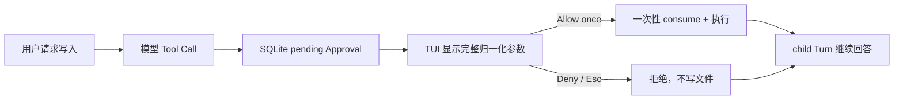

# MiniClaw 本地运行指南

## 当前可以运行什么

当前版本是 Phase 2.3A：

```text
Textual TUI → AgentRuntime → TurnService → AgentRunner → DeepSeek / ToolExecutor → SQLite
```

已支持：

- 裸 `miniclaw` 的唯一全屏 TUI；
- 流式回答、Tool 状态卡、Enter/Shift+Enter、Esc 取消；
- `system_info`、`read_file`、`glob`、`grep`；
- 受审批保护的 `write_file`、`edit_file`；
- 不经过 Shell、受 exact-argv Policy 与审批保护的 `run_command`；
- SQLite 会话、ToolRun、Approval、Audit 和 child Turn 续跑；
- 10 条 Claw-like query 的离线 Agent 回归。

尚未支持：`http_get`、NVM/Node 路径下 `lark-cli` 的真实 smoke、飞书/Telegram/Discord Channel、长期
Memory/Skill Loader 与自动演进。

## 1. 环境要求

- Python 3.12+；
- `uv`；
- macOS 或 Linux；
- 支持全屏应用的真实 TTY，且 `TERM` 不能是 `dumb`；
- `init`、`doctor` 和 offline eval 不需要模型 Key 或外网；
- TUI 对话需要 DeepSeek Key 与网络。

## 2. 安装

```bash
uv venv
uv sync --extra dev
uv run miniclaw --version
```

运行依赖包含 HTTPX 与 Textual；开发依赖使用 Ruff。唯一脚本入口由 `pyproject.toml` 提供：

```toml
[project.scripts]
miniclaw = "miniclaw.cli:main"
```

## 3. 配置模型凭据

```bash
cp .env.example .env
chmod 600 .env
```

编辑仓库根目录 `.env`：

```dotenv
MINICLAW_MODEL_API_KEY=your-deepseek-api-key
```

安全规则：

- `.env` 必须是普通文件，POSIX 权限必须为 `0600`；
- 只解析简单 `KEY=value`，不执行 shell、变量展开或 command substitution；
- 裸 `miniclaw` 从启动命令的当前目录加载 `.env`；
- 进程环境优先于 `.env`；
- `.env` 被 Git 忽略，禁止复制到 issue、日志、测试 fixture 或文档；
- `init`、`doctor` 和 offline eval 不读取 Key。

初始化生成的默认 Provider：

```toml
[agent]
model = "deepseek-v4-pro"
max_tool_iterations = 8
context_budget_tokens = 32000
tool_result_max_chars = 20000

[provider]
base_url = "https://api.deepseek.com"
api_key_env = "MINICLAW_MODEL_API_KEY"
timeout_seconds = 120
```

## 4. 初始化与诊断

```bash
uv run miniclaw init
uv run miniclaw doctor
```

隔离状态可使用绝对路径：

```bash
uv run miniclaw init --home /absolute/path/to/miniclaw-state
uv run miniclaw doctor --home /absolute/path/to/miniclaw-state
```

也可设置 `MINICLAW_HOME`。优先级是 `--home`、`MINICLAW_HOME`、`~/.miniclaw`。相对路径返回退出码 2。

状态目录：

```text
~/.miniclaw/
├── config.toml
├── miniclaw.db
├── SOUL.md
├── USER.md
├── MEMORY.md
├── memory/
├── prompts/versions/
├── skills/versions/
├── evals/baseline/
├── evals/failures/
├── workspace/
├── logs/
└── run/
```

`init` 幂等补齐缺失文件和 migration，不覆盖身份、记忆或配置；符号链接状态会被拒绝。`doctor` 只读检查
目录、TOML、Workspace、SQLite integrity/Schema 和 POSIX 权限，不会修复或联网。

## 5. 启动唯一 TUI

```bash
uv run miniclaw
```

指定状态目录时，`--home` 位于裸命令之后：

```bash
uv run miniclaw --home /absolute/path/to/miniclaw-state
```

没有状态时，仍进入同一个 App，点击 **Initialize** 完成初始化；不会跳到另一套命令行界面。

旧命令已经删除：

```text
miniclaw chat                 # 不存在
miniclaw tui                  # 不存在
miniclaw chat --message ...   # 不存在
miniclaw approvals ...        # 不存在
```

## 6. TUI 操作

| 操作 | 效果 |
| --- | --- |
| Enter | 发送当前输入 |
| Shift+Enter | 输入换行 |
| Esc | 取消当前 Turn；审批弹窗中等价于 Deny |
| Ctrl+O | 显示/隐藏 Tool 卡 |
| Ctrl+D | 空闲时退出 |

本地 Slash Command：

```text
/help  /status  /tools  /new  /exit  /quit
```

这些命令不会调用模型。`/new` 切换 conversation ID 并清空当前屏幕，但仍复用同一个 App、Runtime 和
Provider。

## 7. Tool 使用示例

把测试文件放入默认 Workspace：

```bash
printf 'MiniClaw workspace demo\n' > ~/.miniclaw/workspace/demo.txt
```

进入 TUI 后依次输入：

```text
请使用 read_file 读取 demo.txt。
请使用 glob 找出 Workspace 的 txt 文件。
请使用 grep 在 txt 文件中查找 MiniClaw。
帮我看看我的电脑是什么配置。
```

模型是否调用 Tool 由模型响应决定。Tool 卡会显示 requested、running、succeeded/failed 等文字状态。
`.env`、私钥、凭据库、MiniClaw 状态数据库和 Workspace 外路径会被 Policy 拒绝。

## 8. 文件写入审批

在 TUI 输入：

```text
请把 hello 写入 note.txt。
```

`write_file` / `edit_file` 不会立即执行。正常流程：



弹窗默认焦点为 **Deny**，没有永久文件规则。批准或拒绝都经同一个 `TurnService.continue_approval()`；
过期、参数被改、Owner 不一致或重复执行都会 fail closed。

## 9. 受限命令

在 TUI 输入：

```text
请使用 run_command 运行 git status --short。
```

`run_command` 只接受 `program`、`args[]` 和有上限的 `timeout_seconds`，不会解析管道、重定向、`$()`、
反引号或其他 Shell 语法。默认 `allowlist + on-miss`：安全命令未命中规则时显示完整归一化参数，并只允许
**Allow once** 或 **Deny**。Shell、删除、提权、上传、包安装和 `git push` 等动作在审批前硬拒绝。

确认长期需要的精确只读命令，可在 `config.toml` 中显式写入 exact rule：

```toml
[tools]
security = "allowlist"
ask = "on-miss"

[tools.run_command]
allow_commands = [{ program = "git", args = ["status", "--short"] }]
timeout_seconds = 30
max_timeout_seconds = 120
```

规则匹配解析后的 executable 与完整 argv；多一个参数、顺序变化或路径变化都不会放行。当前本机
`lark-cli` 位于 NVM 目录并依赖 Node shebang，不在固定最小 PATH 内；P2.3B 完成 doctor/path/runtime 与真实
`auth status` smoke 前，不把它列为已验证用法。

## 10. 配置覆盖

加载顺序：代码默认值 → `config.toml` → `MINICLAW_*` 环境变量 → 调用方显式覆盖。

常用变量：

```text
MINICLAW_MODEL_NAME
MINICLAW_MODEL_BASE_URL
MINICLAW_MODEL_API_KEY_ENV
MINICLAW_MODEL_TIMEOUT_SECONDS
MINICLAW_MAX_TOOL_ITERATIONS
MINICLAW_CONTEXT_BUDGET_TOKENS
MINICLAW_TOOL_RESULT_MAX_CHARS
MINICLAW_WORKSPACE
```

配置拒绝未知字段、错误类型、相对 Workspace、携带凭据/query/fragment 的 Provider URL 和损坏 TOML。

## 11. 退出码

| 码 | 意义 |
| ---: | --- |
| 0 | 成功 |
| 1 | `eval run` 至少一条场景失败 |
| 2 | 参数、路径、配置、`.env`、缺 Key 或非交互终端 |
| 5 | SQLite、migration 或本地 I/O 失败 |
| 130 | 启动阶段被用户中断 |

模型/Agent 的运行期错误显示在 TUI 内，App 不会因为一次请求失败退出。

## 12. Agent 回归门禁

```bash
uv run miniclaw eval list --root evals/scenarios
uv run miniclaw eval validate --root evals/scenarios
uv run miniclaw eval run --suite offline --root evals/scenarios
```

预期 10/10 PASS。Offline eval 不读取 `.env` 或个人状态；每条 case 使用独立临时 state 与 ScriptedProvider，
但 TurnService、Policy、ToolExecutor、Tool 和 SQLite 都是生产实现。

## 13. 开发检查

```bash
.venv/bin/python -m unittest discover -s tests -v
.venv/bin/ruff check --no-cache .
uv run miniclaw eval run --suite offline --root evals/scenarios
git diff --check
uv build
```

当前基线：**232/232 tests、10/10 active offline Agent cases、Ruff PASS**。

TUI 的完整事件、Worker、审批竞态与测试说明见
[Phase 2.2B 单入口 Textual TUI 工程文档](../engineering/phase-2/single-entry-tui.md)。命令安全边界见
[Phase 2.3A exact-argv 工程文档](../engineering/phase-2/command-execution.md)；下一步 P2.3B 是
`lark-cli`/Node 路径、doctor 与真实 `auth status` smoke。
