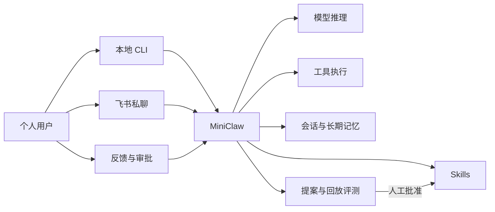
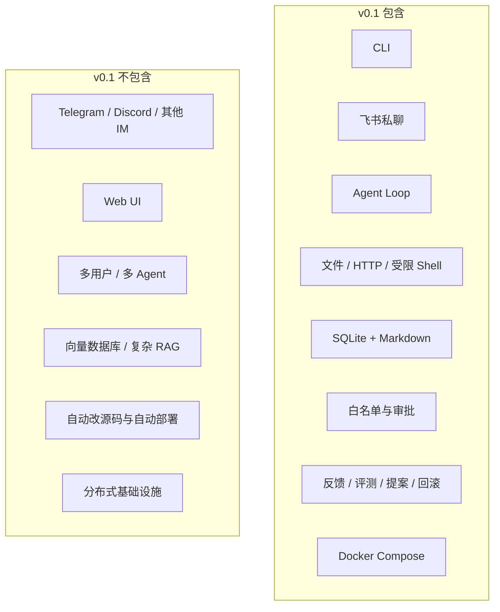
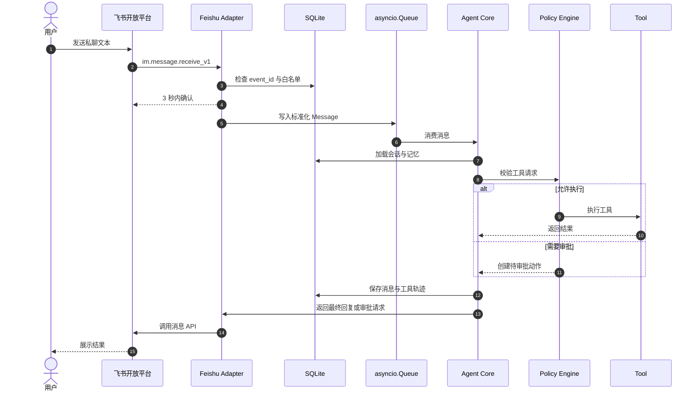
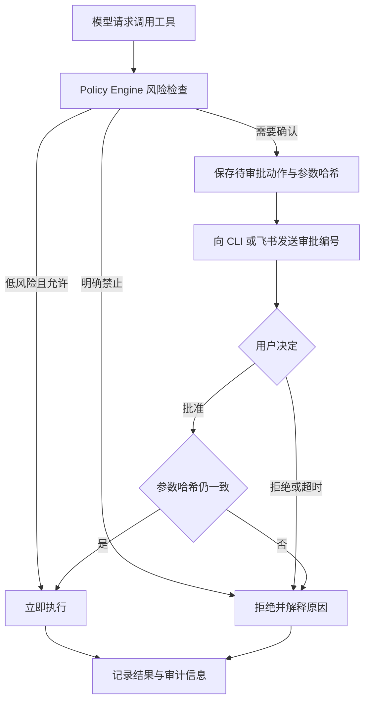
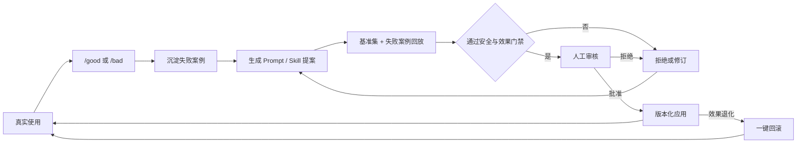
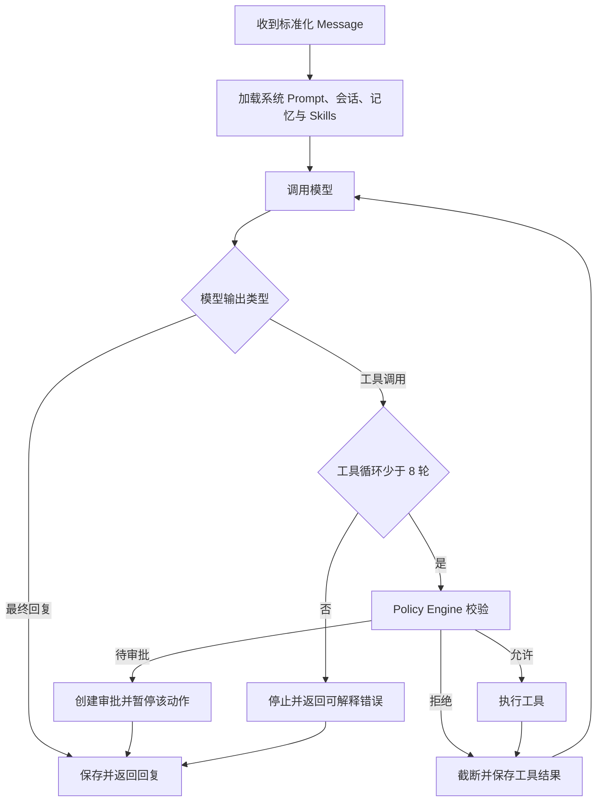
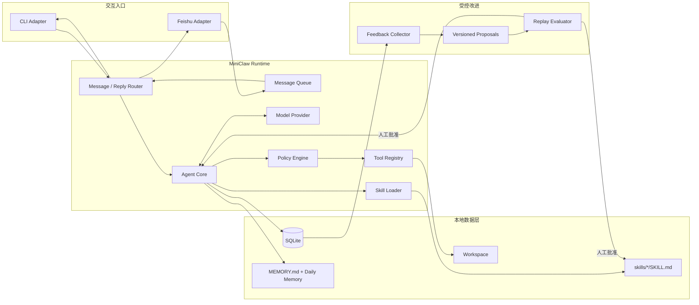
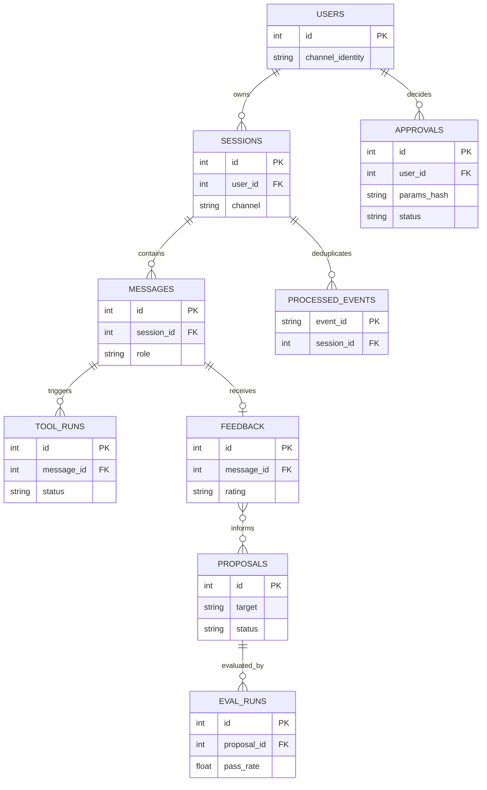
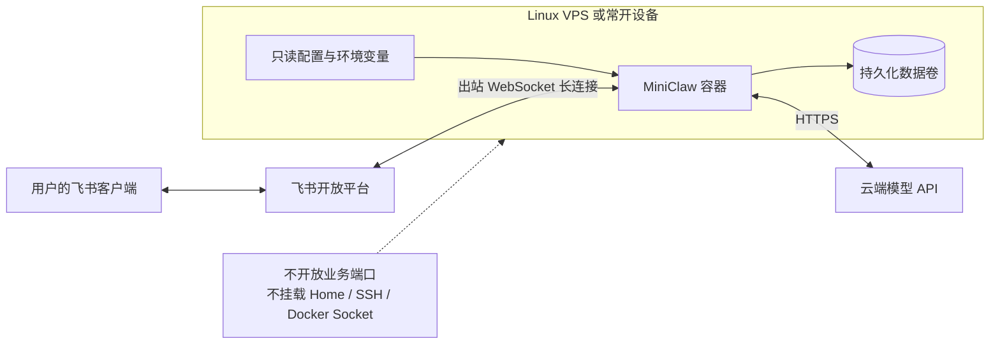
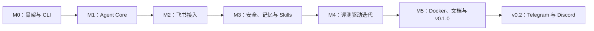

# MiniClaw PRD v0.1

> 一个小而可读、默认安全、可通过反馈持续改进的自托管个人 Agent。

## 1. 文档信息

- 产品工作名：MiniClaw
- 版本：PRD v0.1
- 状态：开发中（已完成 Phase 2.1C R1/R2 离线 Agent 回归门禁）
- 日期：2026-08-07
- 产品形态：Python 开源项目、CLI、飞书机器人、常驻 Gateway
- 首要用途：个人学习、个人日常使用、Agent 工程作品集

## 2. 产品概述

MiniClaw 是一个面向单个用户的自托管个人 Agent。用户可以在本地 CLI 或飞书中与同一个 Agent 对话，由 Agent 根据上下文调用工具、读写工作区、保存会话和长期记忆，并通过人工审核的反馈与评测流程持续改进 Prompt 和 Skills。

MiniClaw 不追求复制 OpenClaw 的完整功能。v0.1 的目标是用一套规模可控、容易阅读的 Python 代码，跑通个人 Agent 的完整工程闭环：消息接入、Agent Loop、工具执行、记忆、权限、反馈、评测、迭代和部署。

### 产品全景图

## 3. 产品定位

### 3.1 目标用户

- 首要用户：项目作者本人。
- 次要用户：希望学习个人 Agent 工作原理的 Python 开发者。
- v0.1 不服务团队、企业租户或非技术大众用户。

### 3.2 核心价值

1. **可使用**：能从 CLI 和飞书随时对话并完成实际任务。
2. **可理解**：开发者能顺着代码读懂一条消息的完整生命周期。
3. **可扩展**：通过 Tool 和 `SKILL.md` 增加能力，不修改 Agent Loop。
4. **可控制**：文件范围、命令执行和危险操作都有明确边界。
5. **可改进**：失败对话能变成评测用例和受控修改提案。

## 4. 目标与非目标

### 4.1 v0.1 目标

- Python 3.12 单进程运行。
- 提供可安装的 `miniclaw` CLI。
- 支持本地终端连续对话。
- 通过飞书 WebSocket 长连接接收私聊文本消息并回复。
- 实现最小 Agent Loop 和模型 Tool Calling。
- 提供文件、HTTP 和受限 Shell 工具。
- 使用 SQLite 保存会话、消息、工具执行、反馈和修改提案。
- 使用 Markdown 保存可审阅的长期记忆和 Skills。
- 支持危险操作的拒绝或人工批准。
- 支持反馈、回放评测、Prompt/Skill 修改提案、应用和回滚。
- 支持本地运行和 Docker Compose 常驻部署。

### 4.2 v0.1 非目标

- Telegram、Discord、微信等其他 IM 渠道。
- Web 管理后台、桌面客户端或移动客户端。
- 多用户、多租户、多 Agent 或子 Agent。
- 语音、图片、文件附件等多模态消息。
- 向量数据库、知识库平台或复杂 RAG。
- Skill 市场、插件市场或远程代码安装。
- 定时任务和主动推送。
- Agent 自动修改、合并或部署自身源代码。
- Kubernetes、Redis、PostgreSQL 或分布式队列。

Telegram 和 Discord 属于 v0.2 路线图，届时复用 v0.1 的统一消息模型和 Channel Adapter 边界。

### v0.1 范围图

## 5. 产品原则

1. 单用户优先，不提前设计多租户。
2. 一个进程、一个 SQLite、一个 Workspace。
3. 默认拒绝超出 Workspace 的文件访问。
4. Agent 不直接拥有无限制 Shell。
5. 所有自我改进都先提案、再评测、后人工批准。
6. 用户数据和凭证默认保存在本地，不写入日志或 Git。
7. 核心代码的可读性优先于框架功能数量。

## 6. 核心用户流程

### 6.1 首次初始化

1. 用户安装 Python 包并运行 `miniclaw init`。
2. CLI 创建本地配置目录、Workspace、SQLite 数据库和示例 Skill。
3. 用户配置一个 OpenAI-compatible 模型端点、API Key 和模型名。
4. 用户选择是否配置飞书 App ID、App Secret 和允许访问的 Open ID。
5. `miniclaw doctor` 检查模型、数据库、Workspace 和飞书连接配置。

### 6.2 CLI 对话

1. 用户运行 `miniclaw chat`。
2. CLI 将输入标准化为内部 `Message`。
3. Agent 加载系统 Prompt、相关会话、长期记忆、Skills 和可用工具。
4. 模型回复或请求调用工具。
5. Agent 校验权限、执行工具并把结果返回模型。
6. 最终答案输出到终端并写入 SQLite。

### 6.3 飞书对话

1. 用户运行 `miniclaw gateway`。
2. Gateway 通过飞书官方 Python SDK 建立 WebSocket 长连接。
3. Adapter 校验用户白名单和 `event_id` 幂等性。
4. 回调把消息写入 `asyncio.Queue` 后立即结束，避免阻塞飞书回调。
5. Worker 调用与 CLI 相同的 Agent Core。
6. 最终回复通过飞书消息 API 发回原会话。

### 6.4 危险操作审批

1. Agent 请求执行非只读或不在允许列表中的操作。
2. Policy Engine 生成待审批记录，不执行工具。
3. CLI 显示确认提示；飞书返回审批编号和操作摘要。
4. 用户运行或发送 `/approve <id>` 或 `/deny <id>`。
5. 批准后只执行该次绑定参数的操作；参数变化必须重新审批。

### 6.5 反馈与自我迭代

1. 用户通过 `/good` 或 `/bad <原因>` 标记最近一次回复。
2. MiniClaw 保存原始输入、上下文摘要、工具轨迹、输出和反馈。
3. `miniclaw evolve propose` 根据失败案例生成 Prompt 或 Skill 修改提案。
4. `miniclaw eval --proposal <id>` 对基准案例和失败案例做回放。
5. CLI 展示修改前后通过率、耗时、Token 使用量和安全违规。
6. 用户执行 `miniclaw evolve apply <id>` 后，新版本生效。
7. 用户可以执行 `miniclaw evolve rollback` 恢复上一版本。

## 7. 功能需求

### 7.1 CLI

| 命令 | 作用 |
| --- | --- |
| `miniclaw init` | 创建配置、Workspace 和数据库 |
| `miniclaw chat` | 本地交互式对话 |
| `miniclaw gateway` | 启动飞书 Gateway 和消息 Worker |
| `miniclaw doctor` | 检查配置、模型、权限和连接 |
| `miniclaw sessions` | 查看本地会话列表 |
| `miniclaw eval` | 运行回归评测 |
| `miniclaw evolve propose` | 生成改进提案 |
| `miniclaw evolve apply <id>` | 应用已通过评测的提案 |
| `miniclaw evolve rollback` | 回滚最近一次改进 |

CLI 使用 Python 标准库 `argparse` 和 `pyproject.toml` 脚本入口实现，不引入额外 CLI 框架。

### 7.2 飞书 Channel

- 使用官方 `lark-oapi` Python SDK。
- v0.1 只支持企业自建应用、WebSocket 长连接、机器人私聊和文本消息。
- 只处理配置白名单中的 Open ID。
- 使用 `event_id` 去重，避免重复回复。
- 回调不得执行 LLM 调用或慢工具，只负责校验和入队。
- 消息处理失败时向用户返回短错误提示，并记录不含凭证的诊断信息。

### 7.3 Agent Loop

- 每条消息最多执行 8 轮模型/工具循环。
- 支持模型原生 Tool Calling。
- 每轮记录模型、耗时、Token 和工具调用摘要。
- 达到循环上限时停止执行并返回可解释错误。
- 模型请求失败时最多重试 1 次，只重试网络或服务端临时错误。
- v0.1 只实现一个 OpenAI-compatible Provider；Provider 边界允许后续增加其他实现。

### 7.4 工具

v0.1 内置以下工具：

- `read_file`：读取 Workspace 内文件。
- `write_file`：写入 Workspace 内文件；覆盖现有文件需要审批。
- `http_get`：获取 HTTPS 文本内容，限制响应大小和超时。
- `run_command`：运行允许列表中的命令，工作目录固定为 Workspace。

所有路径必须解析为绝对路径并验证仍位于 Workspace 内。Shell 不接受拼接字符串，只接受程序名与参数数组。命令默认超时 30 秒。

### 7.5 会话与记忆

- SQLite 保存会话、消息、工具调用和状态。
- `MEMORY.md` 保存经过整理、用户可直接审阅的长期事实和偏好。
- `memory/YYYY-MM-DD.md` 保存当日工作记录和待整理观察。
- CLI 与飞书默认映射到同一个个人 Agent，但保留各自会话历史。
- 私聊可以检索同一用户其他私聊中的长期记忆；群聊不在 v0.1 范围内。
- 记忆写入必须包含日期和来源会话，不保存 API Key、Token 或密码。

### 7.6 Skills

- 每个 Skill 位于 `skills/<name>/SKILL.md`。
- 文件包含 YAML Frontmatter 和 Markdown 指令正文。
- Frontmatter 至少包含 `name` 和 `description`。
- Agent 根据描述选择相关 Skill，并将正文按需加入上下文。
- Skill 修改进入版本目录，支持评测、应用和回滚。
- v0.1 不支持从互联网自动安装 Skill。

### 7.7 安全与权限

- 飞书默认白名单，禁止匿名或公开访问。
- API Key 和 App Secret 只从环境变量或本地私密配置读取。
- 日志必须对 Token、Secret 和 Authorization Header 脱敏。
- 文件工具只能访问 Workspace。
- Shell 使用程序允许列表；删除、网络上传、包安装和 Git 推送默认拒绝。
- 每个待审批动作绑定工具名、参数哈希、用户和过期时间。
- 容器部署时不挂载宿主机 Home、SSH、云凭证或 Docker Socket。

### 7.8 评测与演进

- 评测案例使用可版本控制的 JSONL 文件；一行一个严格 Schema case，不新增 YAML 依赖。
- v0.1 支持以下断言：回答包含/不包含文本、必须/不得调用某工具、最大工具次数、最大耗时和无安全违规。
- 每次改进同时运行固定基准集与最新失败案例。
- 提案未通过全部安全断言时不得应用。
- 提案应用后保留旧版本和评测报告。
- v0.1 不使用 Agent 自动修改 Python 源代码。

## 8. 系统架构

组件边界：

- **Channel Adapter**：平台事件与内部消息互转，不包含 Agent 逻辑。
- **Agent Core**：管理模型与工具循环，不知道消息来自 CLI 还是飞书。
- **Tool Registry**：声明工具 Schema 并执行受控操作。
- **Policy Engine**：在工具执行前做路径、命令、风险和审批检查。
- **Storage**：通过 SQLite 保存结构化运行数据，通过 Markdown 保存可审阅知识。
- **Evolution**：从反馈构造提案和评测，不直接修改正在运行的配置。

## 9. 最小数据模型

SQLite 包含以下表：

- `users`：内部用户与渠道身份映射。
- `sessions`：CLI 或飞书会话。
- `messages`：用户、助手和工具消息。
- `tool_runs`：工具参数摘要、结果、耗时和状态。
- `processed_events`：飞书事件幂等记录。
- `approvals`：待审批、已批准、已拒绝和已过期动作。
- `feedback`：用户对回复的评价和原因。
- `proposals`：Prompt/Skill 修改内容、状态和版本。
- `eval_runs`：评测结果、耗时、Token 和安全断言。

v0.1 使用 Python 标准库 `sqlite3`，不引入 ORM。

## 10. 技术选型

| 范围 | 选择 |
| --- | --- |
| 语言 | Python 3.12 |
| 包管理 | `uv` |
| CLI | `argparse` |
| 飞书 | `lark-oapi` |
| 数据库 | SQLite / `sqlite3` |
| 模型 | 一个 OpenAI-compatible HTTP Provider |
| 配置 | TOML + 环境变量 |
| 异步 | `asyncio.Queue` |
| 测试 | 标准库 `unittest` |
| 部署 | Docker Compose |
| License | MIT |

不使用 LangGraph、FastAPI、Redis、Celery、SQLAlchemy 或向量数据库。只有在明确出现 v0.1 无法解决的问题时再增加依赖。

## 11. 部署设计

### 11.1 本地开发

- 在 macOS 或 Linux 上运行 `miniclaw gateway`。
- 飞书使用出站 WebSocket，不要求公网 IP、域名或入站端口。
- SQLite、Workspace 和日志保存在用户指定的数据目录。

### 11.2 常驻运行

- 使用 Docker Compose 部署到一台 Linux VPS 或常开家用设备。
- 一个应用容器、一个持久化数据卷、一个只读配置挂载。
- 容器使用非 root 用户并设置自动重启。
- 使用云端模型 API 时不需要 GPU。
- v0.1 不暴露公网 HTTP 服务。

## 12. 错误处理

- 飞书事件先持久化并入队，避免超过 3 秒回调限制。
- 重复 `event_id` 直接确认但不重复执行。
- 模型或工具错误写入当前会话，并返回用户可理解的短消息。
- 工具结果过大时截断并记录原始文件路径，不将完整内容塞入上下文。
- 进程重启后，未开始的队列消息可以从数据库恢复；执行到一半的工具标记为中断，不自动重放有副作用的操作。
- 配置或数据库不可用时 Gateway 拒绝启动，并由 `miniclaw doctor` 给出修复建议。

## 13. 验收标准

v0.1 发布必须同时满足：

1. 新用户按 README 能在 15 分钟内完成 CLI 首次对话，不计算飞书应用审批时间。
2. `miniclaw doctor` 能发现缺失模型配置、不可写 Workspace 和无效飞书凭证。
3. CLI 和飞书消息走同一个 Agent Core。
4. 飞书私聊可以连续完成至少 20 轮对话。
5. 同一飞书事件重复投递不会产生第二次回复。
6. 会话和长期记忆在进程重启后仍然可用。
7. Agent 能正确调用至少一个只读工具和一个需审批工具。
8. 未经批准的高风险工具调用不会执行。
9. `/bad` 反馈可以生成一个修改提案和对应回放案例。
10. 提案可以完成评测、应用并回滚，且历史版本不丢失。
11. 固定的至少 20 条 active 端到端回归案例必须 100% 通过；retired case 必须在版本记录说明原因。
12. Docker Compose 重启后数据不丢失，且没有挂载宿主机敏感目录。

## 14. 里程碑

### M0：项目骨架与 CLI

- Python 包、配置、Workspace、SQLite 初始化。
- `init`、`chat`、`doctor` 命令。

### M1：Agent Core

- OpenAI-compatible Provider。
- Agent Loop、工具 Schema、文件与 HTTP 工具。
- CLI 端到端对话与最小测试。

### M2：飞书接入

- WebSocket、白名单、事件去重、消息队列和文本回复。
- `gateway` 命令与连接诊断。

### M3：安全、记忆与 Skills

- Workspace 边界、Shell 允许列表、审批。
- SQLite 会话、Markdown 长期记忆、`SKILL.md` 加载。

### M4：评测驱动迭代

- `/good`、`/bad`、失败案例、提案、回放评测、应用和回滚。

### M5：开源发布

- Docker Compose、README、架构文档、安全说明、贡献指南和 MIT License。
- 发布 v0.1.0。

## 15. 成功指标

- 作者连续 30 天使用 MiniClaw，并每周至少产生 10 次有效对话。
- 30 天内至少沉淀 10 个回归案例和 3 个实际应用的改进提案。
- 关键代码路径有端到端测试，发布前无已知高风险越权问题。
- 新贡献者能从架构文档定位 Channel、Agent、Tool、Storage 和 Evolution 五条主路径。
- v0.1 期间不因提前扩展多用户、Web UI 或分布式基础设施而延期。

## 16. 主要风险与缓解

| 风险 | 缓解方式 |
| --- | --- |
| 范围膨胀成完整 OpenClaw | 固定 v0.1 非目标，先只做 CLI + 飞书 |
| Agent 执行危险命令 | Workspace 隔离、允许列表、参数绑定审批 |
| 飞书重复或超时推送 | 3 秒内入队确认、`event_id` 幂等 |
| 长对话成本失控 | 上下文预算、工具结果截断、记录 Token |
| 自我改进导致能力退化 | 固定基准集、安全断言、人工批准、回滚 |
| Python 项目缺乏差异 | 强调可读内核、默认安全、评测门禁演进 |
| 凭证或个人数据泄露 | 本地保存、日志脱敏、禁止提交数据目录 |

## 17. 开源策略

- 仓库采用 MIT License。
- 仓库只包含源码、示例配置和脱敏评测案例。
- `data/`、真实对话、凭证和个人记忆默认加入 `.gitignore`。
- README 明确项目是学习型 mini personal agent，不声称兼容或替代 OpenClaw。
- 参考项目包括 [OpenClaw](https://github.com/openclaw/openclaw)、[nanobot](https://github.com/HKUDS/nanobot)、[ZeroClaw](https://github.com/zeroclaw-labs/zeroclaw) 和 [RayClaw](https://github.com/rayclaw/rayclaw)。复制代码时必须单独核对许可证并保留必要声明。

## 18. 命名说明

项目正式工作名为 **MiniClaw**，仓库名、Python 导入包和 CLI 统一使用 `miniclaw`。

- `Mini` 表明这是用于个人学习和工程实践的最小实现，不追求复刻 OpenClaw 全部能力。
- `Claw` 直接表达项目受到 OpenClaw 类个人 Agent 产品启发。
- 项目不声称与 OpenClaw 官方、API 或插件生态兼容，也不声称是其替代品。

如果未来发布到 PyPI 时分发名不可用，可以只调整 PyPI 分发名称；GitHub 仓库、导入包、CLI 和
本 PRD 的产品范围保持不变。
