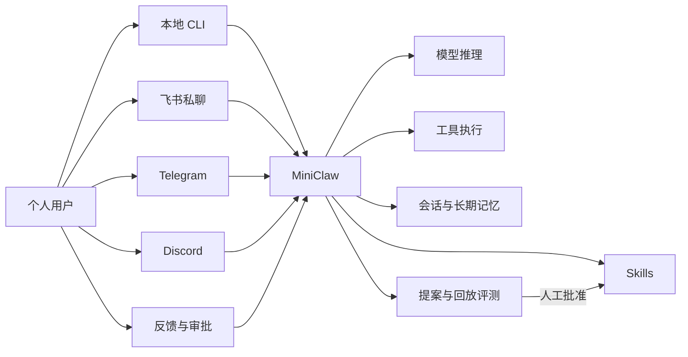
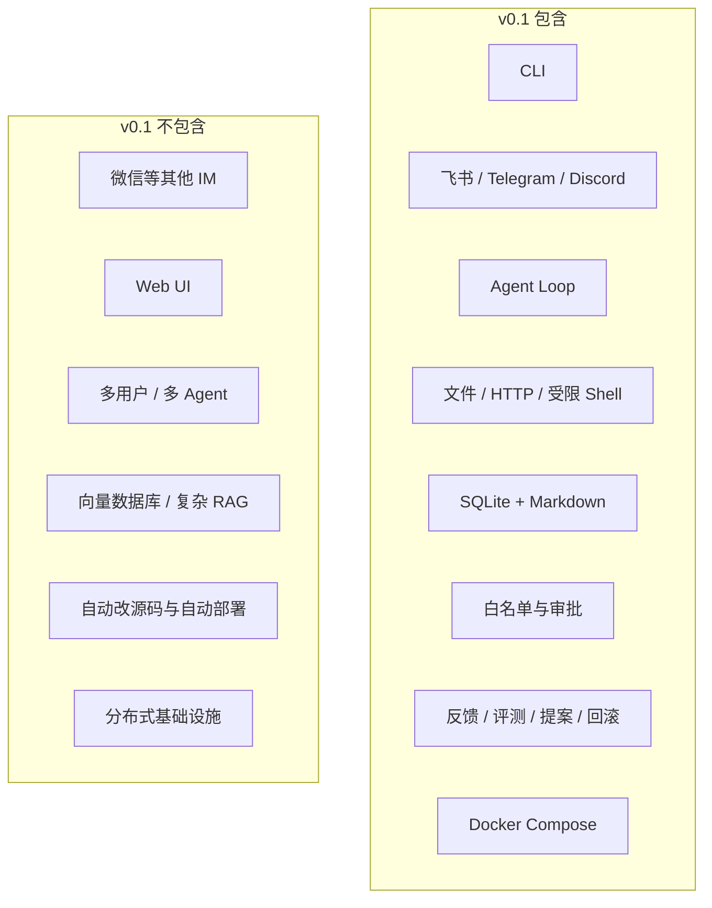
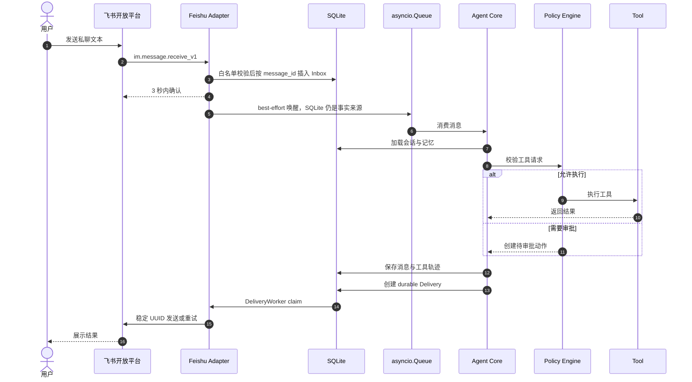
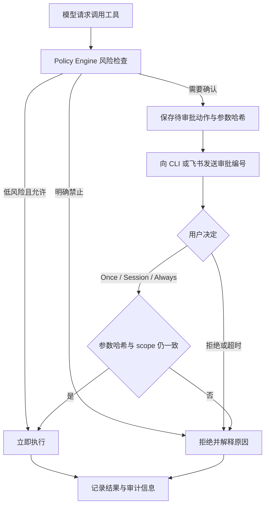
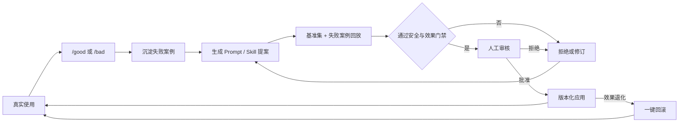
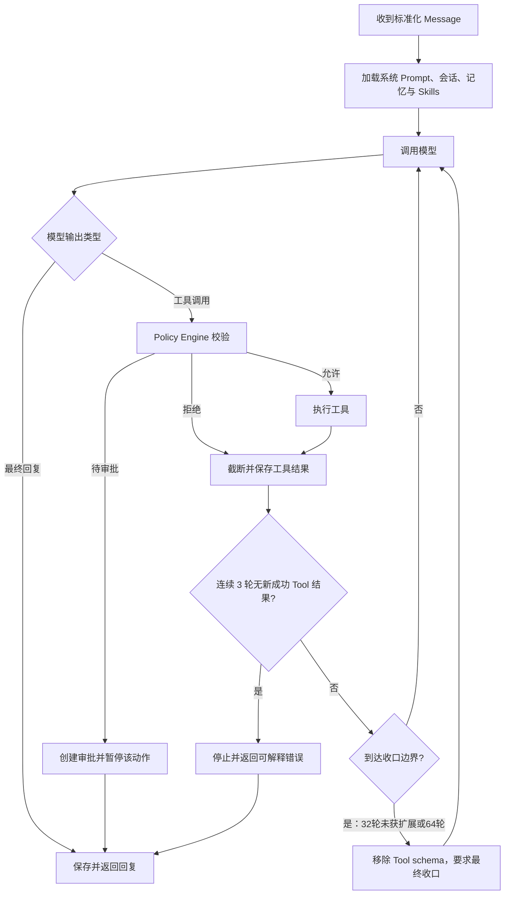
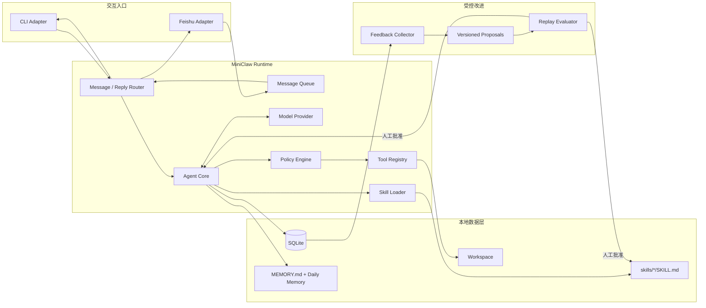
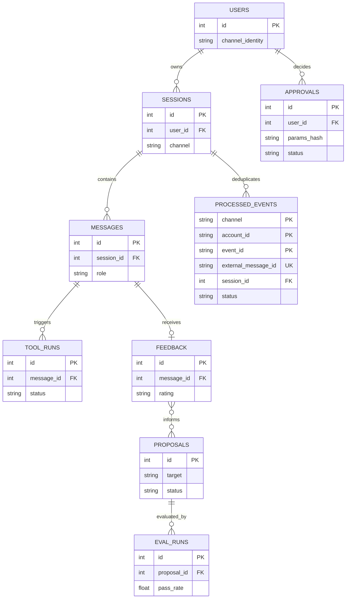
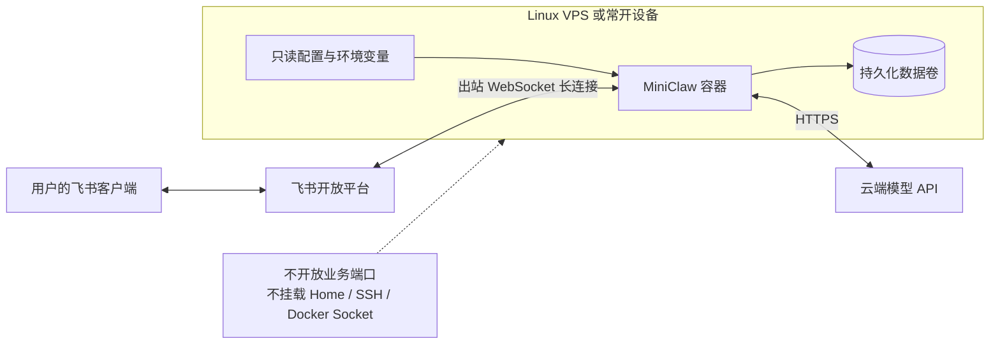

# MiniClaw PRD v0.1

> 一个小而可读、默认安全、可通过反馈持续改进的自托管个人 Agent。

## 1. 文档信息

- 产品工作名：MiniClaw
- 版本：PRD v0.1
- 状态：开发中（Phase 6 Autonomy/Sandbox 与 Phase 6.5 Browser **IMPLEMENTATION PASS**；Docker **LIVE VERIFIED**；
  Browser **CONTROLLED LIVE SMOKE PENDING**；Feishu **TARGETED CALLBACK LIVE VERIFIED / 15-CASE LIVE PENDING**；
  Telegram/Discord/Seatbelt **LIVE PENDING**；Desktop W0/W1 development build **AUTOMATED GATE PASS /
  ELECTRON MANUAL PENDING**；Phase 7 Evolution 与部署尚未开始）
- 日期：2026-08-07
- 产品形态：Python 开源项目、本地 TUI、Desktop development build、飞书/Telegram/Discord Bot、常驻 Gateway
- 首要用途：个人学习、个人日常使用、Agent 工程作品集

## 2. 产品概述

MiniClaw 是一个面向单个用户的自托管个人 Agent。用户可以在本地 TUI、Desktop、飞书、Telegram 或 Discord 中与同一个
Agent 对话，由 Agent 根据上下文调用工具、读写工作区、保存会话和长期记忆，并通过人工审核的反馈与评测流程持续改进
Prompt 和 Skills。四个入口共享一个 Agent Core，但各 IM 会话、队列、Delivery 与故障边界保持隔离。

MiniClaw 不追求复制 OpenClaw 的完整功能。v0.1 的目标是用一套规模可控、容易阅读的 Python 代码，跑通个人 Agent 的完整工程闭环：消息接入、Agent Loop、工具执行、记忆、权限、反馈、评测、迭代和部署。

### 产品全景图

## 3. 产品定位

### 3.1 目标用户

- 首要用户：项目作者本人。
- 次要用户：希望学习个人 Agent 工作原理的 Python 开发者。
- v0.1 不服务团队、企业租户或非技术大众用户。

### 3.2 核心价值

1. **可使用**：能从本地 TUI、飞书、Telegram 和 Discord 随时对话并完成实际任务。
2. **可理解**：开发者能顺着代码读懂一条消息的完整生命周期。
3. **可扩展**：通过 Tool 和 `SKILL.md` 增加能力，不修改 Agent Loop。
4. **可控制**：文件范围、命令执行和危险操作都有明确边界。
5. **可改进**：失败对话能变成评测用例和受控修改提案。

## 4. 目标与非目标

### 4.1 v0.1 目标

- Agent Core 使用 Python 3.12；本地默认 TUI 允许 Node/TypeScript 异构进程，IM Gateway 保持单 Python Runtime。
- 提供可安装的 `miniclaw` CLI。
- 支持本地终端连续对话。
- 通过飞书 WebSocket 接收私聊文本和白名单群聊明确 mention 并回复。
- 通过 Telegram long polling 接收 allowlisted DM、群 mention/reply 与 forum topic。
- 通过 Discord Gateway 接收 allowlisted DM、Guild mention/reply 与 Thread。
- 一个 Gateway 进程复用一个 AgentRuntime，并为三个平台保留独立 durable pipeline。
- 实现最小 Agent Loop 和模型 Tool Calling。
- 提供文件、HTTP 和受限 Shell 工具。
- 使用 SQLite 保存会话、消息、工具执行、反馈和修改提案。
- 使用 Markdown 保存可审阅的长期记忆和 Skills。
- 支持危险操作的拒绝或人工批准。
- 支持反馈、回放评测、Prompt/Skill 修改提案、应用和回滚。
- 支持本地运行和 Docker Compose 常驻部署。

### 4.2 v0.1 非目标

- 微信等尚未实现的其他 IM 渠道。
- Web 管理后台、桌面客户端或移动客户端。
- 多用户、多租户、多 Agent 或子 Agent。
- 语音、图片、文件附件等多模态消息。
- 向量数据库、知识库平台或复杂 RAG。
- Skill 市场、插件市场或远程代码安装。
- 定时任务和主动推送。
- Agent 自动修改、合并或部署自身源代码。
- Kubernetes、Redis、PostgreSQL 或分布式队列。

Telegram 和 Discord 已在 Phase 5 按统一消息模型和 Channel Adapter 边界实现。它们的真实账号验收仍是独立 live
门禁，不能由 fake SDK 或本地回归替代。

### v0.1 范围图

## 5. 产品原则

1. 单用户优先，不提前设计多租户。
2. 一个进程、一个 SQLite、一个 Workspace。
3. 默认拒绝超出 Workspace 的文件访问。
4. Agent 不直接拥有无限制 Shell。
5. 所有自我改进都先提案、再评测、后人工批准。
6. 用户数据和凭证默认保存在本地，不写入日志或 Git。
7. 核心代码的可读性优先于框架功能数量。

## 6. 核心用户流程

### 6.1 首次初始化

1. 用户安装 Python 包并运行 `miniclaw init`。
2. CLI 创建本地配置目录、Workspace、SQLite 数据库和示例 Skill。
3. 用户配置一个 OpenAI-compatible 模型端点、API Key 和模型名。
4. 用户选择是否配置飞书 App ID、App Secret 和允许访问的 Open ID。
5. `miniclaw doctor` 检查模型、数据库、Workspace 和飞书连接配置。

### 6.2 本地 TUI 对话

1. 用户运行裸 `miniclaw`，默认进入唯一的 TypeScript pi-tui；依赖不可用时进入 Textual fallback。
2. pi-tui 通过 versioned NDJSON Bridge 把输入交给 Python `AgentRuntime`；fallback 直接复用同一个 Runtime。
3. Agent 加载系统 Prompt、相关会话、长期记忆、Skills 和可用工具。
4. 模型回复或请求调用工具。
5. Agent 校验权限；普通 Tool 展示状态卡，危险 Tool 在 TUI 显示完整归一化参数和 Core 允许的审批范围。
6. 最终答案流式显示并写入 SQLite；底部显示真实上下文/Token/Tool/迭代/耗时。
7. UI 默认中文，可用 `/lang zh|en` 切换；模型回答与 reasoning 跟随用户提问语言。
8. 模型失败或用户取消时，已提交长文本完整恢复到输入框。

### 6.3 飞书对话

1. 用户运行 `miniclaw gateway`。
2. Gateway 通过飞书官方 Python SDK 建立 WebSocket 长连接。
3. Adapter 校验用户/群白名单、mention，并按 `message_id` 幂等。
4. 回调先把标准化消息写入 SQLite Inbox，再 best-effort 唤醒有界 Queue 并立即结束。
5. Worker 调用与 CLI 相同的 Agent Core。
6. 最终回复先进入 SQLite Outbox，再由 DeliveryWorker 分片、重试并发回原会话。

### 6.4 危险操作审批

1. Agent 请求执行非只读或不在允许列表中的操作。
2. Policy Engine 生成待审批记录，不执行工具。
3. TUI 显示完整参数审批 Modal；飞书返回审批编号和有界操作摘要，不展示命令正文、Token 或完整 argv。
4. TUI 用户选择 Deny、Allow once，或 Core 对安全 exact scope 开放的 Session/Always。
5. 文件写入始终只有 Once；Session 只在当前 Runtime；Always 只在操作成功后保存 exact argv/hostname 规则。
6. 参数变化必须重新审批；inline AppleScript、Shell 和硬拒绝操作不能持久放行。
7. 飞书按钮点击后必须立即在原卡显示处理中；成功、拒绝和失败都在原卡移除按钮并收口。续跑产生的最终消息或下一条
   Approval 必须先写 durable Outbox，重复点击不得重复执行。

### 6.5 反馈与自我迭代

1. 用户通过 `/good` 或 `/bad <原因>` 标记最近一次回复。
2. MiniClaw 保存原始输入、上下文摘要、工具轨迹、输出和反馈。
3. `miniclaw evolve propose` 根据失败案例生成 Prompt 或 Skill 修改提案。
4. `miniclaw eval --proposal <id>` 对基准案例和失败案例做回放。
5. CLI 展示修改前后通过率、耗时、Token 使用量和安全违规。
6. 用户执行 `miniclaw evolve apply <id>` 后，新版本生效。
7. 用户可以执行 `miniclaw evolve rollback` 恢复上一版本。

## 7. 功能需求

### 7.1 CLI 与本地 TUI

| 命令 | 作用 |
| --- | --- |
| `miniclaw` | 唯一的本地对话入口；默认 pi-tui，Textual 仅作 fallback |
| `miniclaw init` | 创建配置、Workspace 和数据库 |
| `miniclaw gateway` | 启动飞书 Gateway 和消息 Worker |
| `miniclaw doctor` | 检查配置、模型、权限和连接 |
| `miniclaw sessions` | 查看本地会话列表 |
| `miniclaw eval` | 运行回归评测 |
| `miniclaw evolve propose` | 生成改进提案 |
| `miniclaw evolve apply <id>` | 应用已通过评测的提案 |
| `miniclaw evolve rollback` | 回滚最近一次改进 |

外层命令使用 Python 标准库 `argparse` 和 `pyproject.toml` 脚本入口；默认本地交互使用 TypeScript pi-tui，
Python Textual 暂作 onboarding/fallback。产品不提供
`miniclaw chat`、`miniclaw tui`、one-shot 或另一套 plain REPL。

当前本地 TUI 已实现：用户/Agent 文字角色标签、流式 Markdown、紧凑 reasoning、Tool Trace、长文本失败恢复、
默认中文/英文切换、真实 usage 审计栏，以及 Core 受限的 Once/Session/Always 审批。`miniclaw gateway`、
飞书 official WebSocket、durable Inbox/Outbox、白名单、群 mention、Typing、结构化 Agent 进度卡和跨 Channel 审批
也已进入代码。正常飞书回答使用一张 `Claw Trail` 卡片展示脱敏步骤、Tool 调用、安全目标、状态、耗时、过程摘要和
最终答案；原始模型 reasoning、Tool 参数和 Tool 输出不得进入卡片；
真实企业应用权限、WebSocket 和 20 轮对话尚未验收，不能从 fake SDK 回归推断为 production verified。

### 7.2 飞书 Channel

- 使用官方独立 Python Channel SDK `lark-channel-sdk`，导入名为 `lark_channel`。
- v0.1 支持企业自建应用、WebSocket、机器人私聊文本和白名单群聊明确 mention。
- 同时校验 Open ID 与群 Chat ID 白名单，并过滤机器人自身消息。
- 使用 `message_id` 作为持久化幂等键，`event_id` 只用于诊断。
- 回调不得执行 LLM 调用或慢工具，只负责校验和入队。
- SQLite 是 Inbox/Outbox 事实来源，内存 Queue 只负责唤醒 Worker。
- Typing 可降级。飞书成功 completed card 使用 12px Markdown；能完整容纳时是正常回答的唯一平台终态，超限时
  只把未展示后缀回复到该卡片，卡片失败时通过 durable text Delivery fallback 完整正文。completed Turn 的启动
  恢复复用稳定 progress UUID。飞书在确认 Turn completed 前只限长缓冲公开 delta，因此 tool-call 同时返回文本时，
  waiting approval 仍只发布 Approval card。Telegram/Discord 的最终文本仍必须经过 durable Delivery。
- 消息处理失败时向用户返回短错误提示，并记录不含凭证和完整外部 ID 的稳定错误码。

### 7.3 Agent Loop

- 每条消息采用 32 轮模型调用软预算、64 轮硬预算和连续 3 轮无进展保护；它们统计模型调用次数，
  不统计 Tool 数量。上一批有新的成功 Tool 结果时可越过软预算；语义重复的 Tool 不会重复执行。
- 支持模型原生 Tool Calling。
- 每轮记录模型、耗时、Token 和工具调用摘要。
- 到达未获扩展的软边界或硬边界时，下一次模型请求移除 Tool schema，只根据已有证据收口最终答案；若仍返回
  Tool Call，则不执行该批并返回可解释错误。连续 3 轮没有新的成功 Tool 结果以稳定码 `loop_no_progress` 停止。
- 模型请求失败时最多重试 1 次：未产生可见文本时可重试网络/服务端临时错误和 2xx 响应协议解析失败；已展示文本后
  不重试。残缺 Tool JSON 不得修补或执行。
- Channel 失败卡按 Provider 与 Agent Loop 稳定错误类型显示可行动提示；`loop_limit` 必须明确说明无 Tool 的
  预算收口轮仍请求 Tool 且最后请求未执行，不回显响应正文、Tool 参数、Tool 结果或凭据。
- 失败或 Gateway 中断必须在同一张卡中用 bullet points 展示失败阶段、稳定错误码、Turn/Event 调试编号、Tool
  数量/副作用状态和下一步建议；禁止只显示无原因的“未完成”。
- v0.1 只实现一个 OpenAI-compatible Provider；Provider 边界允许后续增加其他实现。

### 7.4 工具

v0.1 内置以下工具：

- `read_file` / `glob` / `grep`：按 Workspace/Personal Profile 读取普通文件；敏感路径硬拒绝。
- `write_file` / `edit_file`：只写 Workspace 或 Personal 的有限写根；`safe`/`smart` 按 Policy 请求参数绑定
  审批，`autopilot` 只允许经过验证的 Owner 在硬安全边界内自动执行低风险写入。
- `http_get`：获取 HTTPS 文本内容，限制响应大小和超时。
- `run_command`：运行 exact-argv 规则或经审批的本机 CLI，工作目录固定为 Workspace。

所有路径必须解析为绝对路径并验证仍位于配置根内；symlink、大小写逃逸和敏感路径 fail closed。Personal
Profile 只把 Home 普通文件加入读取面，不开放 Keychain、浏览器登录库、私钥、应用凭据或任意 Home 写入。
Shell 不接受拼接字符串，只接受程序名与参数数组。命令默认超时 30 秒。

### 7.5 会话与记忆

- SQLite 保存会话、消息、工具调用和状态。
- TUI、飞书、Telegram 与 Discord 的已验证 Owner 私聊共享同一个 `owner_id` 和 Memory Space；各 Session 历史仍隔离。
- 普通完成 Turn 只写 durable source-range buffer，由后台 Worker 提取；明确“记住”在 Markdown 原子落盘后才返回成功。
- 已接受 Memory Unit 写入 `memory/owners/<owner_id>/memory.md`，Owner 可以审阅和直接编辑；SQLite 保存来源、
  候选、lease、Review、审计与可重建 FTS5/CJK Projection。
- 首次低风险事实进入 `short_term`，独立重复可晋升 `active`；高敏、行为/权限规则和冲突进入 Owner Review。
- 群聊、非 Owner、未知或冲突身份不得读取私人 Memory；Memory 不能扩大 Tool Policy 或 Approval 权限。
- 每个 Unit 至少引用一条内部 User Message；API Key、Token、OTP、Authorization、密码和私钥在 Candidate 前拒绝。
- Forget、纠错、TTL、weekly review、direct-edit reconcile 和 legacy `MEMORY.md`/daily 只读迁移均保留来源与审计。

### 7.6 Skills

- 每个 Skill 位于 `skills/<name>/SKILL.md`。
- 文件包含 YAML Frontmatter 和 Markdown 指令正文。
- Frontmatter 至少包含 `name` 和 `description`。
- Agent 根据描述选择相关 Skill，并将正文按需加入上下文。
- Skill 修改进入版本目录，支持评测、应用和回滚。
- v0.1 不支持从互联网自动安装 Skill。

### 7.7 安全与权限

- 飞书默认白名单，禁止匿名或公开访问。
- API Key 和 App Secret 只从环境变量或本地私密配置读取。
- 日志必须对 Token、Secret 和 Authorization Header 脱敏。
- 旧配置缺少 `[permissions]` 时保持 Workspace-only；新安装默认 Personal Profile。
- 缺少 `tools.mode` 的旧配置与新安装都默认 `autopilot`；显式 `safe`/`smart` 继续保留审批。Autopilot 只对本地
  入口和经过验证的 Owner 私聊生效，群聊、其他用户与硬拒绝规则不变。
- Personal 读取限 Home 普通文件与明确系统根，敏感凭据目录无审批、直接拒绝；写入限 Documents、Desktop、
  Downloads、IDE 项目根与 Workspace，并且只提供 Allow once。
- 用户 CLI 只从系统、显式 executable roots、NVM、uv、pnpm、`~/.local/bin`、Cargo、Bun 等确定性目录发现；
  不 source shell rc，不把 API Key、Cookie、Proxy 或 Python path 传入子进程。
- Shell 使用程序允许列表；删除、网络上传、包安装和 Git 推送默认拒绝。
- 每个待审批动作绑定工具名、参数哈希、用户和过期时间。
- TUI 只能显示 Core 计算的 `grant_modes`；不允许从摘要猜测权限。
- Session/Always 只在绑定 Tool 成功后生效；文件写入和 inline AppleScript 不可持久放行。
- 飞书审批按钮只允许配置 Owner；callback 对坏 payload、过期、重复消费和内部异常 fail closed，原卡显示稳定终态。
- 容器部署时不挂载宿主机 Home、SSH、云凭证或 Docker Socket。

### 7.8 评测与演进

- 评测案例使用可版本控制的 JSONL 文件；一行一个严格 Schema case，不新增 YAML 依赖。
- v0.1 支持以下断言：回答包含/不包含文本、必须/不得调用某工具、最大工具次数、最大耗时和无安全违规。
- 每次改进同时运行固定基准集与最新失败案例。
- 提案未通过全部安全断言时不得应用。
- 提案应用后保留旧版本和评测报告。
- v0.1 不使用 Agent 自动修改 Python 源代码。

## 8. 系统架构

组件边界：

- **Channel Adapter**：平台事件与内部消息互转，不包含 Agent 逻辑。
- **Agent Core**：管理模型与工具循环，不知道消息来自 CLI 还是飞书。
- **Tool Registry**：声明工具 Schema 并执行受控操作。
- **Policy Engine**：在工具执行前做路径、命令、风险和审批检查。
- **Storage**：通过 SQLite 保存结构化运行数据，通过 Markdown 保存可审阅知识。
- **Evolution**：从反馈构造提案和评测，不直接修改正在运行的配置。

## 9. 最小数据模型

SQLite 包含以下表：

- `users`：内部用户与渠道身份映射。
- `sessions`：CLI 或飞书会话。
- `messages`：用户、助手和工具消息。
- `tool_runs`：工具参数摘要、结果、耗时和状态。
- `processed_events`：飞书事件幂等记录。
- `approvals`：待审批、已批准、已拒绝和已过期动作。
- `feedback`：用户对回复的评价和原因。
- `proposals`：Prompt/Skill 修改内容、状态和版本。
- `eval_runs`：评测结果、耗时、Token 和安全断言。

v0.1 使用 Python 标准库 `sqlite3`，不引入 ORM。

## 10. 技术选型

| 范围 | 选择 |
| --- | --- |
| 语言 | Python 3.12 Core + TypeScript TUI |
| 包管理 | `uv` |
| CLI / TUI | `argparse` launcher + pi-tui；Textual onboarding/fallback |
| 飞书 | `lark-channel-sdk`（official Channel SDK，可选依赖） |
| 数据库 | SQLite / `sqlite3` |
| 模型 | 一个 OpenAI-compatible HTTP Provider |
| 配置 | TOML + 环境变量 |
| 异步 | Python `asyncio` + NDJSON Bridge；pi-tui 事件循环；飞书有界 Queue |
| 测试 | 标准库 `unittest` + Node test runner + 虚拟终端 |
| 部署 | Docker Compose |
| License | MIT |

不使用 LangGraph、FastAPI、Redis、Celery、SQLAlchemy 或向量数据库。只有在明确出现 v0.1 无法解决的问题时再增加依赖。

## 11. 部署设计

### 11.1 本地开发

- 在 macOS 或 Linux 上运行 `miniclaw gateway`。
- 飞书使用出站 WebSocket，不要求公网 IP、域名或入站端口。
- SQLite、Workspace 和日志保存在用户指定的数据目录。

### 11.2 常驻运行

- macOS 个人常开机使用用户级 `launchd` 启动 `miniclaw gateway`；Secret 不写入 plist。
- 使用 Docker Compose 部署到一台 Linux VPS 或常开家用设备。
- 一个应用容器、一个持久化数据卷、一个只读配置挂载。
- 容器使用非 root 用户并设置自动重启。
- 使用云端模型 API 时不需要 GPU。
- v0.1 不暴露公网 HTTP 服务。

## 12. 错误处理

- 飞书事件先持久化并入队，避免超过 3 秒回调限制。
- 重复 `message_id` 直接确认但不重复执行；`event_id` 冲突单独失败关闭。
- 模型或工具错误写入当前会话，并返回用户可理解的短消息。
- 工具结果过大时截断并记录原始文件路径，不将完整内容塞入上下文。
- 进程重启后，未开始的队列消息可以从数据库恢复；执行到一半的工具标记为中断，不自动重放有副作用的操作。
- 配置或数据库不可用时 Gateway 拒绝启动，并由 `miniclaw doctor` 给出修复建议。

## 13. 验收标准

v0.1 发布必须同时满足：

1. 新用户按 README 准备 Python 3.12 与 Node 22.19+ 后，能在 15 分钟内完成 CLI 首次对话，不计算下载和飞书应用审批时间。
2. `miniclaw doctor` 能发现缺失模型配置、不可写 Workspace、缺失飞书变量和 SDK/schema 问题；真实凭证有效性由 live smoke 验证。
3. CLI 和飞书消息走同一个 Agent Core。
4. 飞书私聊可以连续完成至少 20 轮对话。
5. 同一飞书事件重复投递不会产生第二次回复。
6. 会话和长期记忆在进程重启后仍然可用。
7. Agent 能正确调用至少一个只读工具和一个需审批工具。
8. 未经批准的高风险工具调用不会执行。
9. `/bad` 反馈可以生成一个修改提案和对应回放案例。
10. 提案可以完成评测、应用并回滚，且历史版本不丢失。
11. 固定的至少 20 条 active 端到端回归案例必须 100% 通过；retired case 必须在版本记录说明原因。
12. Docker Compose 重启后数据不丢失，且没有挂载宿主机敏感目录。

当前阶段证据：Phase 6.5 **IMPLEMENTATION PASS**；925/925 Python tests、36/36 TUI TypeScript、
14/14 Browser Worker、39/39 active offline Agent cases、33/33 Channel cases、20 轮 660/660 local Channel soak、
15/15 Automation，以及 18/18 Browser cases 和 20 轮 360/360 Browser soak。
Feishu 专用 App/Bot、Scope、Owner allowlist、
WebSocket ready、Owner 私聊 Delivery、Card callback receipt 绑定与 Approval continuation 已经真实定向验证，状态是
**FEISHU TARGETED CALLBACK LIVE VERIFIED / 15-CASE LIVE PENDING**；Telegram 与 Discord 真实平台均为 **LIVE PENDING**。
这证明本地 Agent Core/TUI、Memory/Skills/compaction、fake transport 全链路，以及飞书 Owner DM 的真实
Adapter、Inbox、Agent、Outbox 和回复闭环。Docker containment 已用 pinned image 真实验证；它不代表完整
Feishu 15-case、Seatbelt containment、Browser controlled public live smoke、Evolution、24×7 soak 或当前版本
DeepSeek live release smoke 已完成。

## 14. 里程碑

2026-08-08 起，后续能力以
[OpenClaw / Hermes 能力 Gap](../architecture/20260808_OpenClaw-Hermes能力Gap与演进路线.md)和
[能力对齐工程落地总方案](../engineering/20260808_openclaw-hermes-alignment-engineering-roadmap.md)为权威路线。下列 `M` 是
产品交付里程碑，不等同于架构 Phase；真实交付顺序见[开发与交付时间线](../engineering/20260809_development-timeline.md)。
每项分别记录实现状态和 Live Evidence，不能用本地门禁替代真实平台结论。

### M0：项目骨架与 CLI

- Python 包、配置、Workspace、SQLite 初始化。
- 裸 `miniclaw` 单入口，以及 `init`、`doctor` 维护命令。
- 状态：已实现。

### M1：Agent Core

- OpenAI-compatible Provider。
- Agent Loop、工具 Schema、文件与 HTTP 工具。
- CLI 端到端对话与最小测试。
- 状态：已实现；旧 `miniclaw chat` 已由裸 `miniclaw` pi-tui 入口替代。

### M2：飞书接入

- WebSocket、白名单、事件去重、消息队列和文本回复。
- `gateway` 命令与连接诊断。
- 状态：工程实现完成，真实 Bot、Scope、WebSocket ready 与 Owner DM Delivery 已验证；严格 15-case
  Evidence 仍为 LIVE PENDING。

### M3：安全、记忆与 Skills

- Workspace 边界、Shell 允许列表、审批。
- SQLite 会话、Markdown 长期记忆、`SKILL.md` 加载。
- 状态：已实现；Memory Autopilot A～E 不在本里程碑的已实现范围内。

### M3.5：Telegram 与 Discord 多 Channel

- official Telegram long polling 与 Discord Gateway；
- 单 AgentRuntime、三条隔离 pipeline、共享 Policy/Memory/Skills；
- 工程实现、32-case 与 640-check 本地门禁完成；两个真实平台均 LIVE PENDING。

### M3.7：跨渠道 Memory Autopilot A～E

- Owner Disclosure 与四入口单 Memory Space；
- durable buffer/lease/Flush、明确 remember、Markdown Truth 与 FTS5/CJK Recall；
- short-term/晋升、Review、冲突、纠错、forget、TTL 与 weekly review；
- direct-edit reconcile、legacy hash migration、Doctor 与 `MEM-AUTO-001..010` versioned gate；
- 本地实现门禁完成，真实 IM Live 状态继续沿用各平台独立证据。

### M4 / v0.5.x：真实稳定化

- v0.5.1～v0.5.3 已实现 Feishu Live Runner、单卡片、direct lark-cli、SDK 日志脱敏、Gateway
  lease/provenance 与受管 Live Runner；
- Feishu/Discord 严格 15/15、跨平台 isolation、长期 soak 和完整部署 Evidence 仍待完成；
- 当前状态：`CORE IMPLEMENTATION PASS / LIVE PENDING`，只有真实证据存在后才能更新为 `LIVE VERIFIED`。

### M5 / Phase 6：自治运行与安全

- 已实现 one-shot、interval、cron、Heartbeat 和 durable Task/Run Ledger；
- 已实现主动 Channel 投递、重启恢复、幂等、预算、Approval continuation 与 durable E-stop；
- 已实现 immutable ExecutionPlan、Docker/Seatbelt fail-closed backend、工作区 Checkpoint CAS 与冲突感知 rollback；
- 15/15 Automation versioned gate 与 20 轮 300/300 soak 完成；Automation/Heartbeat 默认关闭；
- 当前状态：**IMPLEMENTATION PASS / DOCKER LIVE VERIFIED / SEATBELT LIVE PENDING**。Heartbeat 尚无 Owner IM
  route，Checkpoint 只覆盖主 Workspace，Rollback 暂无 CLI/TUI。

### M6 / Phase 6.5：Browser Agent

- 已实现 MiniClaw 专用 Chromium Profile、排他锁、tab/idle 上限和进程组清理；
- 已实现 snapshot/ref、点击、输入、按键、滚动、截图、下载和参数绑定浏览器审批；
- 已实现公网 HTTPS/redirect SSRF、password/OTP 硬拒绝、网页 Prompt Injection provenance 与私有 Artifact；
- 18/18 Browser versioned gate、20 轮 360/360 soak 与 14/14 真实 headless Chrome Worker tests 完成；
- 当前状态：**IMPLEMENTATION PASS / CONTROLLED LIVE SMOKE PENDING**。Browser 默认关闭，不读取个人 Profile，
  受控公网导航/submit/Artifact/restart 的人工 live smoke 尚未执行。

### M7 / Phase 7：评测驱动的受控迭代

- `/good`、`/bad`、FTS5 Session Search 和 Memory 治理；
- Memory/Skill Proposal、扫描、全量评测、人工批准、应用和回滚；
- Agent 不能自行批准，也不能修改 Core、配置、Policy 或测试。

### M8 / Phase 8：可信扩展与 Provider 韧性

- AgentSkills 风格 manifest、Skill staging/扫描/验证；
- MCP stdio/loopback HTTP，Tool 继续经过 Core Policy；
- Provider fallback、Session stickiness、Token/费用预算与可观测路由。

### M9 / Phase 9：Sub-agent 与多模态

- depth-1、权限/预算受限的后台 Sub-agent；
- 图片附件、Vision 和可选 STT/TTS；
- Multi-agent persona、远程设备 Nodes 和公开 Skill 市场继续放到 v2。

### Desktop Workbench 横向交付轨道（W0/W1 development，W2/W3 规划）

- 同仓 Electron + React，继续复用 Python Bridge、Policy、Storage 和 Automation；
- 首发为首页、任务工作台、自动化和设置四个浅色界面；
- W0～W2 先交付通用单 Agent 与 Artifact，W3 再消费 Phase 9 depth-1 Sub-agent；
- 当前状态：`W0/W1 DEVELOPMENT BUILD / AUTOMATED GATE PASS / ELECTRON MANUAL PENDING`；Artifact、
  installer/signing 和 Sub-agent 仍未实现，详见
  [通用桌面 Agent 工作台设计](../architecture/20260809_通用桌面Agent工作台设计.md)。

```mermaid
flowchart LR
    M0["M0：骨架与 CLI"] --> M1["M1：Agent Core"]
    M1 --> M2["M2：飞书接入"]
    M2 --> M3["M3：安全、记忆与 Skills"]
    M3 --> MC["M3.5：Telegram 与 Discord"]
    MC --> MM["M3.7：Memory Autopilot A-E"]
    MM --> M4["M4 / Phase 5.2：真实稳定化"]
    M4 --> M5["M5 / Phase 6：自治 + Sandbox"]
    M5 --> M6["M6 / Phase 6.5：Browser"]
    M6 --> M7["M7 / Phase 7：受控进化"]
    M7 --> M8["M8 / Phase 8：Skill / MCP / Provider"]
    M8 --> M9["M9 / Phase 9：Sub-agent / 多模态"]
```

## 15. 成功指标

- 作者连续 30 天使用 MiniClaw，并每周至少产生 10 次有效对话。
- 30 天内至少沉淀 10 个回归案例和 3 个实际应用的改进提案。
- 关键代码路径有端到端测试，发布前无已知高风险越权问题。
- 新贡献者能从架构文档定位 Channel、Agent、Tool、Storage 和 Evolution 五条主路径。
- v0.1 期间不因提前扩展多用户、Web UI 或分布式基础设施而延期。

## 16. 主要风险与缓解

| 风险 | 缓解方式 |
| --- | --- |
| 范围膨胀成完整 OpenClaw | 每个 Phase 用 versioned gate 和明确非目标控制范围 |
| Agent 执行危险命令 | Workspace 隔离、允许列表、参数绑定审批 |
| 飞书重复或超时推送 | 先落 durable Inbox、`message_id` 幂等、Outbox 稳定 UUID |
| 长对话成本失控 | 上下文预算、工具结果截断、记录 Token |
| 自我改进导致能力退化 | 固定基准集、安全断言、人工批准、回滚 |
| Python 项目缺乏差异 | 强调可读内核、默认安全、评测门禁演进 |
| 凭证或个人数据泄露 | 本地保存、日志脱敏、禁止提交数据目录 |

## 17. 开源策略

- 仓库采用 MIT License。
- 仓库只包含源码、示例配置和脱敏评测案例。
- `data/`、真实对话、凭证和个人记忆默认加入 `.gitignore`。
- README 明确项目是学习型 mini personal agent，不声称兼容或替代 OpenClaw。
- 参考项目包括 [OpenClaw](https://github.com/openclaw/openclaw)、[nanobot](https://github.com/HKUDS/nanobot)、[ZeroClaw](https://github.com/zeroclaw-labs/zeroclaw) 和 [RayClaw](https://github.com/rayclaw/rayclaw)。复制代码时必须单独核对许可证并保留必要声明。

## 18. 命名说明

项目正式工作名为 **MiniClaw**，仓库名、Python 导入包和 CLI 统一使用 `miniclaw`。

- `Mini` 表明这是用于个人学习和工程实践的最小实现，不追求复刻 OpenClaw 全部能力。
- `Claw` 直接表达项目受到 OpenClaw 类个人 Agent 产品启发。
- 项目不声称与 OpenClaw 官方、API 或插件生态兼容，也不声称是其替代品。

如果未来发布到 PyPI 时分发名不可用，可以只调整 PyPI 分发名称；GitHub 仓库、导入包、CLI 和
本 PRD 的产品范围保持不变。
