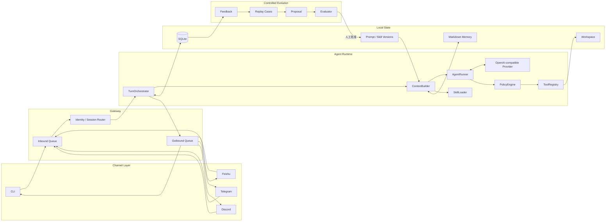
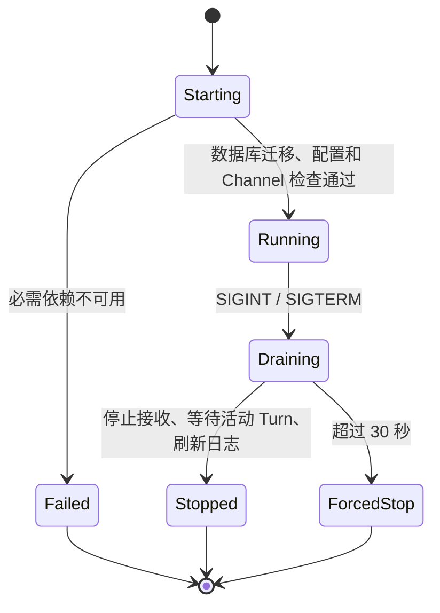
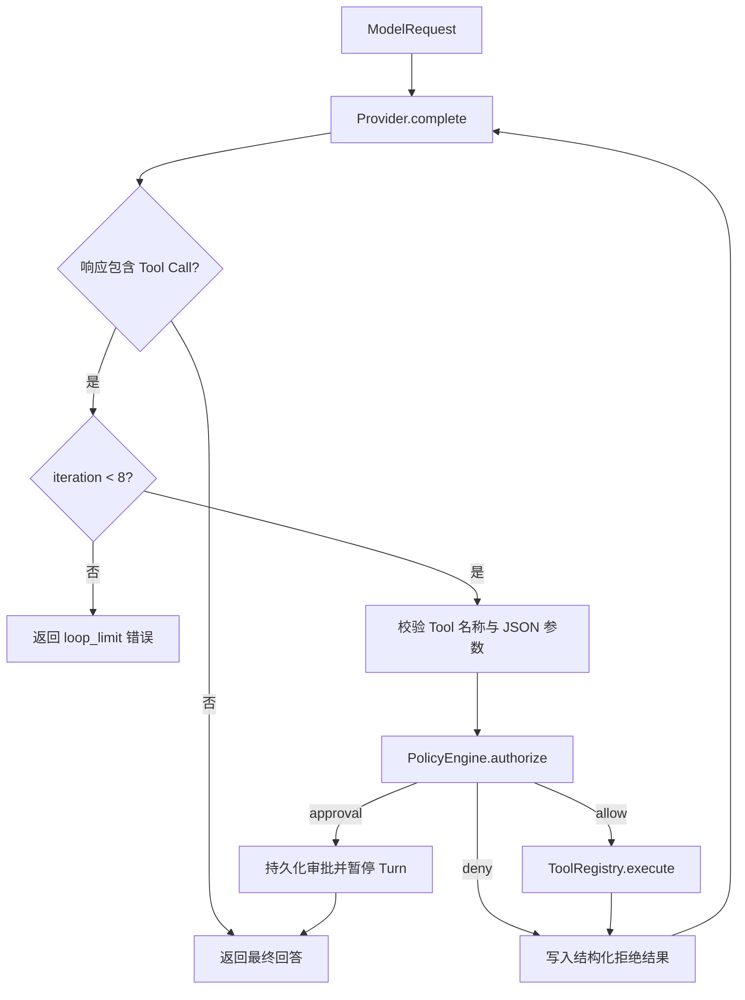
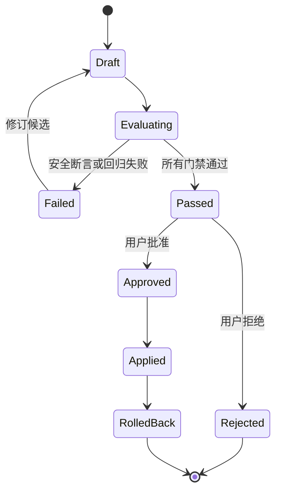

# Lobster0 完整工程落地设计

> 状态：待评审。用户确认后作为 Lobster0 v1.0 的工程设计基线。本文描述目标架构与落地边界，
> 文中标记为“目标”的能力在实现和验证前不得写成仓库现状。

## 1. 文档目的

Lobster0 是一个 Python 3.12 编写、面向单个所有者、自托管并长期运行的个人 Agent。它贯彻
OpenClaw 类产品的核心思想：用户拥有运行环境、数据、凭证和工具权限；CLI、飞书、Telegram 和
Discord 背后共享同一个 Agent Core、身份、记忆、Skills 与安全策略。

本文把现有 PRD 拆成能够指导代码落地的完整工程设计，固定：

- v1.0 功能范围与质量门槛；
- 包、模块和文件职责；
- 核心数据结构与公共接口；
- SQLite 数据模型与运行目录；
- Agent Loop、Channel、Tool、Policy、Memory、Skill 和 Evolution 的边界；
- 参考项目的移植规则与许可证要求；
- 分阶段交付顺序、测试策略和完成定义。

现有 `docs/product/20260807_产品需求文档.md` 继续作为 v0.1 第一阶段的产品基线；本文覆盖从当前脚手架
到高完成度 v1.0 的完整路径。v0.1 先交付 CLI 与飞书，v1.0 再完成 Telegram、Discord 和受控演进，
二者不是互相冲突的范围。

## 2. 工程决策摘要

采用“自有 Python 内核 + 选择性移植成熟实现”，不直接 Fork 任一参考仓库，也不依赖另一个本地兄弟
仓库。Lobster0 保持单仓库、单 Python 发行包、单进程 Gateway 和一个 SQLite 数据库。

| 决策 | 选择 | 原因 |
| --- | --- | --- |
| 运行模型 | 单进程 `asyncio` | 个人使用足够，能清楚学习完整链路 |
| Agent 分层 | `TurnOrchestrator` 与 `AgentRunner` 分离 | 渠道/会话问题与模型/工具问题可独立测试 |
| 渠道通信 | 有界 `asyncio.Queue` Message Bus | 隔离平台回调和慢速模型调用，提供背压 |
| 存储 | 标准库 `sqlite3` + Markdown 文件 | 事务可靠、可检查，不引入 ORM 或向量库 |
| Provider | 一个 OpenAI-compatible 异步实现 | 覆盖主流云端和本地兼容端点，避免提前做 20 个适配器 |
| Tool Calling | 模型原生 Tool Calling | 不解析自然语言伪协议 |
| 安全模型 | `deny / allowlist / full` × `off / on-miss / always` | 同时表达能力上限和人工确认策略 |
| 长期记忆 | `MEMORY.md` + daily memory | 可审阅、可版本化、无需向量数据库 |
| Skills | `SKILL.md` 按描述惰性激活 | 保持扩展简单并控制上下文大小 |
| 自我演进 | 提案、回放评测、人工批准、版本化回滚 | Agent 不直接修改或部署自己的 Python 源码 |
| 部署 | 本地进程、Docker Compose、可选 systemd | 覆盖开发、VPS 和常开设备，不引入 K8s |

## 3. 参考项目与代码复用规则

### 3.1 固定参考快照

工程实现应优先参考下列文件和快照。后续升级参考版本必须单独记录，不允许无审查地持续追踪上游
`main` 或 `master`。

| 项目 | 固定参考 commit | 主要借鉴 | License |
| --- | --- | --- | --- |
| [nanobot](https://github.com/HKUDS/nanobot) | `02a002a0e6691cffcfedf7df4a9d298224afea9b` | Message Bus、Loop/Runner 分层、Context、Channel Package、Memory | MIT |
| [ZeroClaw](https://github.com/zeroclaw-labs/zeroclaw) | `dd9cc80732357dc4a6fd6920b13960169b948f8e` | Security Policy、权限预设、Sandbox、Channel 生命周期 | MIT OR Apache-2.0 |
| [RayClaw](https://github.com/rayclaw/rayclaw) | `a08e49a1e39f43e032ad9b4f658aa9453031a7bb` | Channel Adapter、平台能力声明、消息分片、SQLite 持久化 | MIT |
| [openclaw-python](https://github.com/openxjarvis/openclaw-python) | `a6ce3e607a03127ed3ee04d61cedf0452eba0eb6` | 飞书 WebSocket、去重、流式卡片、Exec Approval、功能映射 | MIT |

优先阅读和移植入口固定为：

- nanobot：`nanobot/agent/loop.py`、`nanobot/channels/base.py`、
  `nanobot/channels/feishu/runtime.py`；
- ZeroClaw：`docs/book/src/security/model.md`、`crates/zeroclaw-config/src/policy.rs`；
- RayClaw：`src/channel_adapter.rs`、`src/channels/feishu.rs`；
- openclaw-python：`openclaw/channels/feishu/channel.py`、`dedup.py`、`streaming_card.py`，以及
  `openclaw/infra/exec_approvals_file.py`。

路径以表中 commit 为准；上游改名或删除文件不改变本设计的固定参考版本。

### 3.2 允许复用的方式

1. 可直接移植 MIT 或 ZeroClaw MIT 许可下的代码，但必须保留原版权头或在文件头写明来源。
2. 每个实质性移植文件必须在 `THIRD_PARTY_NOTICES.md` 记录上游仓库、commit、原路径、License 和
   Lobster0 中的新路径。
3. 对 Apache-2.0 路径的直接移植必须保留修改声明和 NOTICE 要求；默认优先采用 ZeroClaw 的 MIT
   许可选项，除非上游单文件另有说明。
4. 只借鉴思想、重新实现且未复制表达时，在设计文档记录参考即可，不需要伪造版权头。
5. 禁止复制上游密钥、品牌资产、测试凭证、生成产物和未明确许可的第三方资源。
6. 每次移植都要先写 Lobster0 的行为测试，再移植满足测试的最小代码；不能整目录复制后再删。

### 3.3 明确不继承的设计

- 不继承 openclaw-python 的 `pi-mono-python` 兄弟仓库依赖。
- 不复制 nanobot 的 WebUI、Cron、MCP、多 Agent、文档处理和全部 Provider。
- 不复制 ZeroClaw 的 WASM 插件系统和硬件通道。
- 不复制 RayClaw 的 Web UI、向量记忆、定时任务和子 Agent。
- 不以 OpenClaw API 全兼容为 v1.0 验收条件；Lobster0 只承诺自己的公开接口。

## 4. v1.0 范围

### 4.1 必须完成

- 可安装的 `lobster0` Python 包和 CLI。
- `init`、`onboard`、`chat`、`gateway`、`doctor`、`sessions`、`approvals`、`eval`、`evolve` 命令。
- CLI、飞书、Telegram、Discord 四个 Channel，共用同一个 Agent Core。
- 统一身份映射、会话路由、事件去重、有限队列、消息分片和失败重试。
- 一个支持流式输出、原生工具调用和一次临时错误重试的 OpenAI-compatible Provider。
- 最多 8 轮的 Agent Runner、上下文预算、工具结果截断和会话压缩。
- 文件读取、写入、精确编辑、glob、grep、HTTPS 获取和受限 Shell 工具。
- SQLite 会话、消息、工具轨迹、幂等事件、审批、反馈、提案、评测和审计。
- `MEMORY.md`、daily memory、`SOUL.md`、`USER.md` 与 `SKILL.md`。
- Workspace 边界、SSRF 防护、命令策略、参数绑定审批、日志脱敏和默认白名单。
- `/good`、`/bad`、失败案例、Prompt/Skill 提案、回放评测、应用和回滚。
- 本地运行、Docker Compose、健康检查、优雅停机和持久化数据卷。
- 离线单元测试、契约测试、集成测试和带真实凭证的显式端到端检查。

### 4.2 v1.0 不做

- Web 管理后台、桌面端和移动端。
- 多租户、团队 RBAC、多 Agent、子 Agent 和 Agent 间通信。
- 语音、视频、OCR、图片理解和文件附件处理；Channel 只接收文本，出站可发送文本。
- Cron、主动推送、浏览器自动化、MCP Client、Skill 市场和远程插件安装。
- 向量数据库、语义检索平台和复杂 RAG。
- Agent 自动修改、合并、推送或部署 Lobster0 Python 源码。
- Kubernetes、Redis、PostgreSQL、Celery 和分布式 Worker。

## 5. 完整架构



### 5.1 关键边界

- Channel 不调用 Provider，不读取长期记忆，也不执行 Tool。
- `TurnOrchestrator` 管理一次用户 Turn；`AgentRunner` 只管理模型和 Tool 循环。
- `AgentRunner` 只能通过 `PolicyEngine` 调用 `ToolRegistry`，不存在绕过安全层的公开入口。
- Repository 负责事务和 SQL；领域逻辑不得拼接 SQL。
- Markdown Memory 与 SQLite Message History 是不同数据源，不能互相冒充。
- Evolution 只能写入版本候选和激活指针，不能修改 `src/lobster0/`。

## 6. 目标仓库结构

目录在对应里程碑开始时创建，不一次性提交空模块。

```text
lobster0/
├── AGENTS.md
├── LICENSE
├── THIRD_PARTY_NOTICES.md
├── README.md
├── pyproject.toml
├── docker-compose.yml
├── docker/
│   └── Dockerfile
├── docs/
│   ├── architecture/
│   ├── development/
│   ├── getting-started/
│   ├── product/
│   └── superpowers/
│       ├── specs/
│       └── plans/
├── examples/
│   ├── config.example.toml
│   ├── evals/basic.yaml
│   └── skills/summarize/SKILL.md
├── src/lobster0/
│   ├── __init__.py
│   ├── __main__.py
│   ├── cli.py
│   ├── bootstrap.py
│   ├── config.py
│   ├── paths.py
│   ├── logging.py
│   ├── bus/
│   │   ├── events.py
│   │   └── queue.py
│   ├── agent/
│   │   ├── context.py
│   │   ├── runner.py
│   │   ├── turn.py
│   │   ├── compaction.py
│   │   └── prompts.py
│   ├── channels/
│   │   ├── base.py
│   │   ├── capabilities.py
│   │   ├── delivery.py
│   │   ├── manager.py
│   │   ├── cli.py
│   │   ├── feishu.py
│   │   ├── telegram.py
│   │   └── discord.py
│   ├── providers/
│   │   ├── base.py
│   │   └── openai_compatible.py
│   ├── tools/
│   │   ├── base.py
│   │   ├── registry.py
│   │   ├── filesystem.py
│   │   ├── search.py
│   │   ├── web.py
│   │   └── shell.py
│   ├── policy/
│   │   ├── engine.py
│   │   ├── approvals.py
│   │   ├── network.py
│   │   └── workspace.py
│   ├── storage/
│   │   ├── database.py
│   │   ├── migrations.py
│   │   ├── repositories.py
│   │   └── schema.sql
│   ├── memory/
│   │   ├── store.py
│   │   └── consolidator.py
│   ├── skills/
│   │   ├── loader.py
│   │   └── models.py
│   ├── gateway/
│   │   ├── runtime.py
│   │   ├── health.py
│   │   └── shutdown.py
│   ├── evolution/
│   │   ├── feedback.py
│   │   ├── cases.py
│   │   ├── evaluator.py
│   │   ├── proposals.py
│   │   └── versions.py
│   └── doctor.py
└── tests/
    ├── unit/
    ├── contract/
    ├── integration/
    ├── e2e/
    └── fakes/
```

## 7. 核心数据契约

公共数据类型放在使用它们的稳定边界，不建立一个无所不包的 `models.py`。

### 7.1 Channel 事件

```python
from dataclasses import dataclass, field
from datetime import datetime
from enum import StrEnum

type JsonValue = (
    str | int | float | bool | None | list[JsonValue] | dict[str, JsonValue]
)


class ChannelName(StrEnum):
    CLI = "cli"
    FEISHU = "feishu"
    TELEGRAM = "telegram"
    DISCORD = "discord"


@dataclass(frozen=True, slots=True)
class InboundMessage:
    event_id: str
    message_id: str
    channel: ChannelName
    account_id: str
    conversation_id: str
    sender_id: str
    text: str
    received_at: datetime
    reply_to_message_id: str | None = None
    thread_id: str | None = None
    metadata: dict[str, JsonValue] = field(default_factory=dict)


@dataclass(frozen=True, slots=True)
class OutboundMessage:
    channel: ChannelName
    account_id: str
    conversation_id: str
    text: str
    reply_to_message_id: str | None = None
    thread_id: str | None = None
    stream_key: str | None = None
```

内部 `event_id` 与 `message_id` 必须稳定：平台有原生 ID 时直接使用；CLI 为一次输入生成同一个
`cli:<uuid>`。事件和平台消息分别去重，避免同一消息被不同事件重复投递。

### 7.2 Channel 协议

```python
from collections.abc import Awaitable, Callable
from typing import Protocol


@dataclass(frozen=True, slots=True)
class ChannelCapabilities:
    supports_edit: bool
    supports_reply: bool
    supports_threads: bool
    supports_typing: bool
    supports_streaming_card: bool
    max_text_chars: int


InboundHandler = Callable[[InboundMessage], Awaitable[None]]


class Channel(Protocol):
    name: ChannelName
    capabilities: ChannelCapabilities

    async def start(self, handler: InboundHandler) -> None: ...
    async def stop(self) -> None: ...
    async def send(self, message: OutboundMessage) -> str: ...
    async def update_stream(self, message: OutboundMessage) -> None: ...
```

`update_stream` 只在 `supports_edit` 或平台流式卡片能力存在时使用；其他 Channel 由 Delivery 层聚合为
最终消息，不能在 Adapter 内伪造同一接口的不同语义。

### 7.3 Model Provider 事件

```python
@dataclass(frozen=True, slots=True)
class ToolCall:
    call_id: str
    name: str
    arguments: dict[str, JsonValue]


@dataclass(frozen=True, slots=True)
class ModelMessage:
    role: str
    content: str
    tool_calls: tuple[ToolCall, ...] = ()
    tool_call_id: str | None = None


@dataclass(frozen=True, slots=True)
class ModelRequest:
    model: str
    messages: tuple[ModelMessage, ...]
    tools: tuple[dict[str, JsonValue], ...]
    temperature: float | None = None
    max_output_tokens: int | None = None


@dataclass(frozen=True, slots=True)
class ModelResponse:
    content: str
    tool_calls: tuple[ToolCall, ...]
    finish_reason: str
    input_tokens: int | None
    output_tokens: int | None
    provider_request_id: str | None


StreamHandler = Callable[[str], Awaitable[None]]


class ModelProvider(Protocol):
    async def complete(
        self,
        request: ModelRequest,
        on_text: StreamHandler | None = None,
    ) -> ModelResponse: ...
```

v1.0 内核使用一次请求返回一个 `ModelResponse` 的稳定接口；Provider 内部消费 SSE，并用可选回调
上报文本增量。这样 Tool Loop 不依赖某个 SDK 的流式事件类型。Provider 必须把结构化 Tool Call 放在
最终响应中，不能把不完整的增量参数交给 ToolRegistry。

### 7.4 Tool 契约

```python
@dataclass(frozen=True, slots=True)
class ToolContext:
    user_id: int
    session_id: int
    workspace: Path
    channel: ChannelName


@dataclass(frozen=True, slots=True)
class ToolResult:
    ok: bool
    content: str
    metadata: dict[str, JsonValue] = field(default_factory=dict)


class Tool(Protocol):
    name: str
    description: str
    parameters: dict[str, JsonValue]

    async def execute(self, context: ToolContext, arguments: dict[str, JsonValue]) -> ToolResult: ...
```

Tool Schema 是模型契约的一部分。工具名、参数名和错误分类一旦进入回归集，不做无迁移的破坏性修改。

### 7.5 Policy 结果

```python
class PolicyAction(StrEnum):
    ALLOW = "allow"
    DENY = "deny"
    REQUIRE_APPROVAL = "require_approval"


@dataclass(frozen=True, slots=True)
class PolicyDecision:
    action: PolicyAction
    reason: str
    risk_level: str
    approval_id: int | None = None
```

`PolicyDecision` 必须在任何 Tool 副作用之前持久化。`REQUIRE_APPROVAL` 不执行 Tool，也不预创建目标文件。

## 8. 配置与运行目录

### 8.1 默认目录

默认状态根目录为 `~/.lobster0/`，可由 `LOBSTER0_HOME` 覆盖。覆盖值必须展开并解析为绝对路径，不能
默默接受相对路径。

```text
~/.lobster0/
├── config.toml
├── lobster0.db
├── SOUL.md
├── USER.md
├── MEMORY.md
├── memory/
│   └── YYYY-MM-DD.md
├── prompts/
│   ├── active.json
│   └── versions/
├── skills/
│   ├── <name>/SKILL.md
│   └── versions/
├── evals/
│   ├── baseline/
│   └── failures/
├── workspace/
├── logs/
└── run/
    ├── gateway.pid
    └── health.json
```

### 8.2 配置加载顺序

1. 代码内安全默认值。
2. `config.toml`。
3. `LOBSTER0_*` 环境变量。
4. 显式 CLI 参数。

高优先级只覆盖明确传入的字段。敏感值允许写环境变量或权限为 `0600` 的本地配置，但 `doctor` 必须
提醒用户优先使用环境变量；日志和诊断输出永远只显示“已配置/未配置”。

### 8.3 配置结构

```toml
[agent]
model = "provider/model"
max_tool_iterations = 8
context_budget_tokens = 32000
tool_result_max_chars = 20000

[provider]
base_url = "https://api.example.com/v1"
api_key_env = "LOBSTER0_MODEL_API_KEY"
timeout_seconds = 120

[workspace]
path = "~/.lobster0/workspace"
read_only_roots = []

[tools.shell]
security = "allowlist"
ask = "on-miss"
timeout_seconds = 30
allowed_programs = []

[tools.http]
timeout_seconds = 20
max_bytes = 2000000

[channels.feishu]
enabled = false
app_id_env = "LOBSTER0_FEISHU_APP_ID"
app_secret_env = "LOBSTER0_FEISHU_APP_SECRET"
allowed_open_ids = []

[channels.telegram]
enabled = false
bot_token_env = "LOBSTER0_TELEGRAM_BOT_TOKEN"
allowed_user_ids = []

[channels.discord]
enabled = false
bot_token_env = "LOBSTER0_DISCORD_BOT_TOKEN"
allowed_user_ids = []
```

`tomllib` 负责读取；写配置使用项目内固定序列化器，只修改 Lobster0 自己生成的文件。v1.0 不为了写
TOML 引入一个通用配置框架。

## 9. SQLite 数据模型

### 9.1 数据库规则

- 启动时执行显式、单向、带版本号的 migration；禁止运行时自动猜测 schema 差异。
- 启用 `PRAGMA foreign_keys = ON`、`journal_mode = WAL` 和 `busy_timeout = 5000`。
- 每条入站消息、状态变更和出站投递都在短事务中完成。
- Agent 进行网络调用和 Tool 执行时不得持有数据库事务。
- JSON 列只保存平台扩展元数据和评测明细；核心查询字段必须是普通列。
- 所有时间以 UTC ISO 8601 字符串保存，代码中使用 `datetime` aware 对象。

### 9.2 核心 Schema

```sql
CREATE TABLE schema_migrations (
    version INTEGER PRIMARY KEY,
    applied_at TEXT NOT NULL
);

CREATE TABLE users (
    id INTEGER PRIMARY KEY,
    display_name TEXT NOT NULL,
    created_at TEXT NOT NULL
);

CREATE TABLE channel_identities (
    id INTEGER PRIMARY KEY,
    user_id INTEGER NOT NULL REFERENCES users(id),
    channel TEXT NOT NULL,
    account_id TEXT NOT NULL,
    external_user_id TEXT NOT NULL,
    created_at TEXT NOT NULL,
    UNIQUE(channel, account_id, external_user_id)
);

CREATE TABLE sessions (
    id INTEGER PRIMARY KEY,
    user_id INTEGER NOT NULL REFERENCES users(id),
    channel TEXT NOT NULL,
    account_id TEXT NOT NULL,
    external_conversation_id TEXT NOT NULL,
    title TEXT,
    status TEXT NOT NULL CHECK(status IN ('active', 'archived')),
    created_at TEXT NOT NULL,
    updated_at TEXT NOT NULL,
    UNIQUE(channel, account_id, external_conversation_id)
);

CREATE TABLE turns (
    id INTEGER PRIMARY KEY,
    session_id INTEGER NOT NULL REFERENCES sessions(id),
    parent_turn_id INTEGER REFERENCES turns(id),
    inbound_event_id TEXT NOT NULL,
    status TEXT NOT NULL CHECK(status IN (
        'queued', 'running', 'waiting_approval', 'completed', 'failed', 'cancelled'
    )),
    model TEXT NOT NULL,
    started_at TEXT,
    completed_at TEXT,
    input_tokens INTEGER NOT NULL DEFAULT 0,
    output_tokens INTEGER NOT NULL DEFAULT 0,
    runtime_snapshot_json TEXT NOT NULL DEFAULT '{}',
    error_code TEXT,
    error_message TEXT,
    UNIQUE(session_id, inbound_event_id)
);

CREATE TABLE messages (
    id INTEGER PRIMARY KEY,
    session_id INTEGER NOT NULL REFERENCES sessions(id),
    turn_id INTEGER REFERENCES turns(id),
    role TEXT NOT NULL CHECK(role IN ('system', 'user', 'assistant', 'tool')),
    content TEXT NOT NULL,
    provider_message_id TEXT,
    tool_call_id TEXT,
    metadata_json TEXT NOT NULL DEFAULT '{}',
    created_at TEXT NOT NULL
);

CREATE TABLE tool_runs (
    id INTEGER PRIMARY KEY,
    turn_id INTEGER NOT NULL REFERENCES turns(id),
    tool_call_id TEXT NOT NULL,
    tool_name TEXT NOT NULL,
    arguments_json TEXT NOT NULL,
    arguments_hash TEXT NOT NULL,
    policy_action TEXT NOT NULL,
    status TEXT NOT NULL CHECK(status IN (
        'pending', 'waiting_approval', 'running', 'succeeded', 'failed', 'denied', 'interrupted'
    )),
    result_preview TEXT,
    duration_ms INTEGER,
    created_at TEXT NOT NULL,
    completed_at TEXT,
    UNIQUE(turn_id, tool_call_id)
);

CREATE TABLE processed_events (
    channel TEXT NOT NULL,
    account_id TEXT NOT NULL,
    event_id TEXT NOT NULL,
    external_message_id TEXT NOT NULL,
    session_id INTEGER REFERENCES sessions(id),
    received_at TEXT NOT NULL,
    PRIMARY KEY(channel, account_id, event_id),
    UNIQUE(channel, account_id, external_message_id)
);

CREATE TABLE deliveries (
    id INTEGER PRIMARY KEY,
    message_id INTEGER NOT NULL REFERENCES messages(id),
    channel TEXT NOT NULL,
    account_id TEXT NOT NULL,
    external_conversation_id TEXT NOT NULL,
    part_index INTEGER NOT NULL,
    content_hash TEXT NOT NULL,
    platform_message_id TEXT,
    status TEXT NOT NULL CHECK(status IN ('queued', 'sending', 'sent', 'failed', 'unknown')),
    attempts INTEGER NOT NULL DEFAULT 0,
    last_error_code TEXT,
    created_at TEXT NOT NULL,
    sent_at TEXT,
    UNIQUE(message_id, channel, part_index)
);

CREATE TABLE approvals (
    id INTEGER PRIMARY KEY,
    user_id INTEGER NOT NULL REFERENCES users(id),
    turn_id INTEGER NOT NULL REFERENCES turns(id),
    tool_run_id INTEGER NOT NULL UNIQUE REFERENCES tool_runs(id),
    tool_name TEXT NOT NULL,
    arguments_hash TEXT NOT NULL,
    summary TEXT NOT NULL,
    status TEXT NOT NULL CHECK(status IN ('pending', 'approved', 'denied', 'expired', 'consumed')),
    expires_at TEXT NOT NULL,
    decided_at TEXT,
    created_at TEXT NOT NULL
);

CREATE TABLE policy_rules (
    id INTEGER PRIMARY KEY,
    user_id INTEGER NOT NULL REFERENCES users(id),
    tool_name TEXT NOT NULL,
    rule_json TEXT NOT NULL,
    source_approval_id INTEGER REFERENCES approvals(id),
    enabled INTEGER NOT NULL DEFAULT 1 CHECK(enabled IN (0, 1)),
    created_at TEXT NOT NULL,
    revoked_at TEXT
);

CREATE TABLE feedback (
    id INTEGER PRIMARY KEY,
    message_id INTEGER NOT NULL UNIQUE REFERENCES messages(id),
    rating TEXT NOT NULL CHECK(rating IN ('good', 'bad')),
    reason TEXT,
    created_at TEXT NOT NULL
);

CREATE TABLE proposals (
    id INTEGER PRIMARY KEY,
    target_type TEXT NOT NULL CHECK(target_type IN ('prompt', 'skill')),
    target_name TEXT NOT NULL,
    base_version TEXT NOT NULL,
    candidate_version TEXT NOT NULL,
    diff_text TEXT NOT NULL,
    rationale TEXT NOT NULL,
    status TEXT NOT NULL CHECK(status IN (
        'draft', 'evaluating', 'failed', 'passed', 'approved', 'applied', 'rejected', 'rolled_back'
    )),
    created_at TEXT NOT NULL,
    applied_at TEXT
);

CREATE TABLE eval_runs (
    id INTEGER PRIMARY KEY,
    proposal_id INTEGER REFERENCES proposals(id),
    suite_version TEXT NOT NULL,
    status TEXT NOT NULL CHECK(status IN ('running', 'passed', 'failed', 'error')),
    total_cases INTEGER NOT NULL,
    passed_cases INTEGER NOT NULL,
    safety_failures INTEGER NOT NULL,
    duration_ms INTEGER,
    result_json TEXT NOT NULL,
    created_at TEXT NOT NULL,
    completed_at TEXT
);

CREATE TABLE audit_events (
    id INTEGER PRIMARY KEY,
    event_type TEXT NOT NULL,
    user_id INTEGER REFERENCES users(id),
    session_id INTEGER REFERENCES sessions(id),
    turn_id INTEGER REFERENCES turns(id),
    summary TEXT NOT NULL,
    metadata_json TEXT NOT NULL DEFAULT '{}',
    created_at TEXT NOT NULL
);

CREATE INDEX messages_session_time_idx ON messages(session_id, created_at);
CREATE INDEX turns_session_time_idx ON turns(session_id, id);
CREATE INDEX tool_runs_turn_idx ON tool_runs(turn_id);
CREATE INDEX approvals_status_expiry_idx ON approvals(status, expires_at);
CREATE INDEX deliveries_status_idx ON deliveries(status, id);
CREATE INDEX policy_rules_active_idx ON policy_rules(user_id, tool_name, enabled);
CREATE INDEX audit_events_turn_idx ON audit_events(turn_id, id);
```

`runtime_snapshot_json` 只保存模型、配置版本、Prompt/Memory/Skill 哈希和 Provider 请求 ID，不复制完整
Prompt 或凭证。完整 Tool 参数只存本地数据库且可能包含敏感路径；日志只记录工具名、参数哈希和脱敏摘要。
流式中间更新不逐条写入 `deliveries`，最终消息的每个分片必须持久化，进程重启后才能判断是否需要重试。

## 10. Gateway 与消息总线

### 10.1 队列

- `InboundQueue` 默认容量 100；满时 Channel 返回“任务繁忙，请稍后重试”，不能无限占用内存。
- `OutboundQueue` 按 Channel 分队列，每个容量 100，避免单个平台故障阻塞其他平台。
- 单个 Session 同时只执行一个 Turn；不同 Session 可并发，默认最大并发 4。
- 同一 Session 在已有 Turn 运行时收到的新消息，v1.0 采用 `collect`：按到达顺序排队，不中断当前 Turn。
- Gateway 重启后从数据库恢复 `queued` Turn；`running` Tool 标记为 `interrupted`，有副作用的 Tool 不自动重放。
- 未开始的 `queued` Delivery 可以恢复；崩溃时处于 `sending` 的 Delivery 标为 `unknown` 且不自动重发，
  避免平台已接收但本地尚未提交时产生重复消息。

### 10.2 生命周期



启动顺序固定为：配置 → 路径权限 → 数据库迁移 → Repository → Provider → Tool/Policy → Agent →
Outbound Worker → Channel。停止顺序相反。任一已启动组件都必须在后续组件失败时被关闭。

## 11. TurnOrchestrator

`TurnOrchestrator.handle(message)` 是所有 Channel 的唯一 Agent 入口，职责如下：

1. 用 `processed_events` 原子插入完成幂等占位；重复事件直接返回已处理状态。
2. 解析或创建内部用户、Channel Identity 和 Session。
3. 创建 `queued` Turn 并保存用户消息。
4. 获取 Session 级异步锁，把状态改为 `running`。
5. 调用 `ContextBuilder` 生成 `ModelRequest`。
6. 调用 `AgentRunner.run()`，把文本增量交给 Delivery。
7. 保存 Assistant、Tool 和 Token 记录。
8. 投递最终回复并把 Turn 改为 `completed`。
9. 对可分类错误写入 `error_code`，向用户返回不泄露内部信息的短消息。

Channel 发送失败不回滚已经完成的 Agent Turn。Delivery 记录失败并按指数退避重试 3 次；仍失败则写
Audit，用户可以通过 `sessions show` 查看结果。

### 11.1 任务回放

`sessions replay <turn-id>` 按时间展示该 Turn 的入站消息、运行快照、模型用量、Tool Call、Policy 决策、
审批、最终回答、Delivery 和 Audit。回放默认只读，不再次调用模型或执行 Tool；这保证排障不会重复产生
副作用。v1.0 的“可回放”指可重建执行轨迹，不承诺对非确定模型进行字节级复现。

## 12. ContextBuilder

上下文按以下稳定顺序构造：

1. 当前激活的 System Prompt。
2. `SOUL.md` 与 `USER.md`。
3. Workspace 中适用的 `AGENTS.md`。
4. `MEMORY.md` 中的长期事实。
5. 根据描述匹配并激活的 Skills。
6. Session 的压缩摘要。
7. 最近未压缩的消息与 Tool 结果。
8. 当前用户消息。

预算分配默认：System/Identity 15%，Memory/Skills 20%，History 50%，当前 Turn 与输出预留 15%。预算
不足时先截断 Tool 结果，再压缩旧 History，最后减少非必需 Skill；不得截断当前用户消息或安全规则。

压缩产物包含覆盖的消息 ID 范围、使用模型、生成时间和摘要文本。摘要生成失败时保留原历史并减少
加载条数，不能删除消息。

## 13. AgentRunner



实现规则：

- 每轮最多接受 8 个 Tool Call，总迭代最多 8；v1.0 顺序执行 Tool，避免并行副作用顺序不确定。
- 未注册工具、非法 JSON、缺失必填参数都转换为可回传模型的 Tool Result，不让进程崩溃。
- Provider 只对连接失败、429 和 5xx 重试 1 次；认证失败、参数错误和内容策略错误不重试。
- 重试沿用同一个 Turn ID，记录 attempt；Tool 不因 Provider 重试而重复执行。
- Waiting Approval 时向模型返回“动作待用户批准”并结束当前 Turn。批准后创建一个新的系统续执行 Turn，
  `parent_turn_id` 指向原 Turn，`inbound_event_id` 使用 `approval:<approval-id>`；续执行只执行绑定到
  `tool_run_id + arguments_hash` 的动作。
- 最终空响应视为 `empty_response` 错误，不保存为正常 Assistant Message。

## 14. Provider

v1.0 只实现 `OpenAICompatibleProvider`，支持 `/chat/completions`、工具 Schema、SSE 文本增量、Token
usage、超时和 request ID。Provider 配置允许自定义 `base_url`、模型名和额外 HTTP Header，但
Authorization Header 只能来自私密配置边界。

Provider 必须定义稳定错误类型：

- `ProviderAuthenticationError`
- `ProviderRateLimitError`
- `ProviderTimeoutError`
- `ProviderProtocolError`
- `ProviderServerError`

HTTP 响应正文只在脱敏、截断到 2 KB 后进入诊断日志。测试使用本地 fake HTTP Server，不调用真实模型。

## 15. Tool 系统

### 15.1 v1.0 工具

| 工具 | 主要参数 | 默认风险 | 规则 |
| --- | --- | --- | --- |
| `read_file` | `path`, `offset`, `limit` | low | 仅允许 Workspace 与显式只读根 |
| `write_file` | `path`, `content`, `overwrite` | medium/high | 新文件可配置允许；覆盖必须审批 |
| `edit_file` | `path`, `old_text`, `new_text` | medium | `old_text` 必须唯一，否则失败 |
| `glob` | `pattern`, `root` | low | 禁止逃逸 Workspace |
| `grep` | `pattern`, `glob`, `root` | low | 结果数量和字节数设上限 |
| `http_get` | `url` | medium | 仅 HTTPS，执行 SSRF 和响应限制 |
| `run_command` | `program`, `args`, `timeout` | high | 不接收 shell 字符串，固定 cwd |
| `read_memory` | `scope` | low | 只读 Lobster0 Memory 文件 |
| `propose_memory` | `content`, `source` | medium | 生成候选，用户或 consolidator 应用 |

### 15.2 结果限制

- Tool 结果默认最多 20,000 字符，超过部分写入 Workspace 下的 `.lobster0-results/` 并返回路径。
- Tool Error 使用 `code`、`message`、`retryable` 三字段；不把 Python traceback 返回模型。
- `run_command` stdout 与 stderr 分开收集，各自最多 1 MiB；超时后先发送 TERM，2 秒后 KILL。
- 文件读写显式使用 UTF-8；二进制文件返回 `binary_file`，v1.0 不做自动解码。

## 16. Policy 与安全

### 16.1 两轴策略

`security` 决定能力上限：

- `deny`：工具始终拒绝。
- `allowlist`：匹配规则的动作可以自动执行；未匹配动作能否申请一次审批由 `ask` 决定。
- `full`：允许所有未命中硬禁止规则的动作。

`ask` 决定人工确认：

- `off`：策略允许时直接执行。
- `on-miss`：允许列表命中直接执行，未命中但可申请的动作进入审批。
- `always`：每次都审批。

组合规则固定：`deny` 和硬禁止永远不能申请审批；`allowlist + off` 对未命中动作直接拒绝；
`allowlist + on-miss` 才允许用户做参数绑定的一次性授权。默认 Shell allowlist 为空，用户必须主动配置或
逐次批准，不能因为安装 Lobster0 就获得任意本机命令执行权。

硬禁止规则优先级最高，不能被 `full` 绕过：访问状态目录中的凭证、挂载 Docker Socket、访问 SSH
私钥、向外部上传 Workspace、递归删除 Workspace 根、修改 Lobster0 源码后自动提交/推送。

### 16.2 Workspace 防逃逸

1. 对目标路径执行 `expanduser()` 和 `resolve(strict=False)`。
2. 写操作同时验证最近存在的父目录，防止符号链接父路径逃逸。
3. 打开文件后在支持的平台用实际文件描述符路径再次验证。
4. 默认拒绝 Workspace 外路径；只读根必须在配置中逐个声明。
5. 禁止通过 `..`、符号链接、macOS alias 或容器挂载间接扩大边界。

### 16.3 HTTP SSRF 防护

- 只允许 `https`，拒绝 URL 用户信息和非标准编码主机名。
- DNS 解析后的每个地址都拒绝 loopback、private、link-local、multicast、unspecified 和保留网段。
- 最多跟随 3 次重定向，每次重定向重新解析并检查目标。
- 连接后核对实际 peer IP 仍在已验证集合中，缓解 DNS rebinding。
- 限制 20 秒、2 MiB，只接受文本类 Content-Type。

### 16.4 审批

- 审批绑定 `user_id`、`turn_id`、`tool_run_id`、工具名、规范化参数 SHA-256 和 10 分钟过期时间。
- `allow-once` 只消费一次；参数发生任何变化必须重新审批。
- `allow-always` 只为可安全归纳的命令或路径生成新 allowlist 规则，不能保存任意完整参数通配符。
- CLI 交互确认和 `/approve <id>`、`/deny <id>` 共用同一 Repository。
- 过期审批由每次查询和 Gateway 周期任务惰性清理，不引入独立调度器。

### 16.5 日志脱敏

统一 Redactor 处理：Authorization、API Key、App Secret、Bot Token、URL query token、Cookie、常见
Bearer 格式和配置声明的额外敏感值。脱敏发生在日志 Record 创建前，而不是输出 Handler 之后。

## 17. 会话、记忆与上下文压缩

### 17.1 三类状态

| 状态 | 存储 | 用途 | 写入者 |
| --- | --- | --- | --- |
| 会话历史 | SQLite `messages` | 近期原始对话和 Tool 轨迹 | TurnOrchestrator |
| 长期记忆 | `MEMORY.md` | 稳定偏好、事实和长期目标 | 用户批准或 Consolidator |
| 每日记忆 | `memory/YYYY-MM-DD.md` | 当日观察和待整理事实 | Agent 的受控 Memory Tool |

Session History 不直接跨 Channel 合并。Channel Identity 映射到同一个内部 User 后，长期记忆可共享；
CLI、飞书、Telegram 和 Discord 仍保留各自 Session，避免平台上下文互相污染。

### 17.2 Memory 写入格式

```markdown
## 2026-08-07

- fact: 用户偏好 Python 3.12 和 uv。
  source_session: 42
  source_message: 108
  confidence: confirmed
```

不得写入 Key、Token、密码、验证码、身份证件、精确住址和原始私聊全文。Consolidator 只把
`confidence=confirmed` 或用户明确要求记住的事实合并进 `MEMORY.md`，合并前先去重并保留来源。

### 17.3 压缩

当估算上下文超过预算的 80% 时触发压缩。一次压缩覆盖最旧的连续消息区间，保留最近两轮和未完成
审批关联消息。摘要必须包含：目标、已完成动作、重要结果、失败、未完成事项和安全决定。原消息不删除；
新摘要通过消息 ID 范围引用原文。

## 18. Skills

### 18.1 文件格式

```markdown
---
name: summarize
description: Summarize a long text into decisions and action items.
version: 1
---

# Instructions

Use this skill when the user asks for a structured summary.
```

必填字段为 `name`、`description`、`version`。`name` 只能包含小写字母、数字和连字符，并与目录名
一致。Loader 拒绝未知 Frontmatter 类型、超过 64 KiB 的文件和指向 Skill 目录外的资源。

### 18.2 激活流程

1. 启动时加载 metadata，不把所有正文塞入 System Prompt。
2. ContextBuilder 用当前请求与 `description` 做轻量关键词匹配，选择最多 3 个候选。
3. 模型可以调用内部 `activate_skill` 读取候选正文；该工具只读且不访问互联网。
4. 已激活 Skill 的名称、版本和内容哈希写入 Turn metadata，保证评测可复现。
5. Skill 变更写入版本目录，只有通过评测并人工批准后才更新 active 指针。

v1.0 不实现通用插件执行。Skill 是 Prompt 扩展，不拥有绕过 Policy 的代码执行能力。

## 19. Channel 设计

### 19.1 能力矩阵

| 能力 | CLI | 飞书 | Telegram | Discord |
| --- | --- | --- | --- | --- |
| 私聊文本 | 是 | 是 | 是 | 是 |
| 群聊文本 | 不适用 | v1.0 仅 @机器人 | v1.0 仅 @机器人 | v1.0 仅 @机器人 |
| Reply/Thread | 本地显示 | 是 | Reply | Thread/Reply |
| 流式更新 | 终端增量 | 卡片或消息编辑 | 消息编辑 | 消息编辑 |
| Typing | 不适用 | Reaction/卡片状态 | Chat Action | Typing Context |
| 消息上限处理 | 终端不分片 | 4,000 字符软上限 | 4,096 字符 | 2,000 字符 |
| 白名单 | 本机用户 | Open ID | Numeric User ID | Numeric User ID |

ChannelCapabilities 至少包含：`supports_edit`、`supports_reply`、`supports_threads`、
`supports_typing`、`max_text_chars` 和 `supports_streaming_card`。Delivery 根据能力选择更新或分片；平台
差异不进入 AgentRunner。

### 19.2 CLI Channel

- `lobster0 chat` 使用同一个 `InboundMessage` 和 TurnOrchestrator，不建立第二套直连逻辑。
- 支持 `/new`、`/sessions`、`/approve <id>`、`/deny <id>`、`/good`、`/bad <reason>` 和 `/exit`。
- EOF 与 Ctrl+C 第一次取消当前输入，第二次在 2 秒内请求优雅退出。
- 非 TTY 环境支持 `lobster0 chat --message "..."` 单次调用，便于脚本和端到端测试。

### 19.3 飞书

移植 openclaw-python 与 nanobot 中经过验证的边界行为，但收敛为单账号、文本优先：

- 使用 `lark-oapi` WebSocket 长连接，不要求公网入站端口。
- 回调只校验、规范化并入队；数据库幂等写统一由 TurnOrchestrator 完成，不在 SDK 回调线程执行模型调用。
- 只接受 `im.message.receive_v1` 文本消息；私聊直接处理，群聊必须明确 @机器人。
- `event_id` 和 `message_id` 双重去重；重复事件返回成功但不再入队。
- 优先使用流式卡片；缺少卡片权限时回退为最终文本回复。
- Typing Reaction 创建失败不影响 Turn；错误只记录为 debug 级脱敏事件。
- 发送长消息按 Markdown 段落和代码块边界拆分，不能把代码围栏拆开。
- Gateway 断线使用 1、2、4、8、30 秒退避，30 秒为上限；成功收到事件后重置退避。

### 19.4 Telegram

- 使用 `python-telegram-bot` 的 long polling；v1.0 不要求 webhook 和公网端口。
- 启动时通过 `get_me()` 校验 Token，保存 bot user ID 用于群聊 mention 判断。
- 使用 Update ID 去重；offset 由库维护，Lobster0 仍保存业务事件幂等记录。
- 私聊只接受白名单用户；群聊同时要求白名单和 @机器人或 Reply 机器人消息。
- 文本更新最低间隔 800 ms，避免频繁编辑触发限流；最终消息强制刷新。
- 429 使用平台返回的 retry-after；其他发送失败进入 Delivery 通用重试。

### 19.5 Discord

- 使用 `discord.py` Gateway，不启用不需要的 privileged intents。
- 私聊接受白名单用户；Guild 消息要求 @机器人或 Thread 内回复。
- 处理 `on_message` 时忽略所有 bot 消息，包括自己，防止回复循环。
- Typing Context 每 8 秒续期直到 Turn 完成。
- 2,000 字符限制按段落分片，代码块跨片时每片闭合并在下一片重新打开语言标记。
- Discord Channel 异常不得停止飞书或 Telegram；ChannelManager 独立监督每个 Adapter。

### 19.6 统一身份

`channel_identities` 明确绑定外部身份到内部 User。首次 `init` 创建唯一 Owner；Channel 白名单命中的
外部身份自动绑定 Owner。多个外部用户不能因为显示名相同而合并。v1.0 不提供访客模式。

## 20. Evolution：受控自我迭代

### 20.1 反馈

- `/good` 和 `/bad` 只作用于当前 Session 最近一条 Assistant Message。
- `/bad <reason>` 保存用户输入、相关历史 ID、Tool Run、Prompt/Skill 版本、模型、输出和原因。
- 失败案例导出为脱敏 YAML；包含真实个人信息的原文只留 SQLite，不进入 Git。

### 20.2 Eval Case

```yaml
id: file-read-001
input: "Read notes/today.md and summarize it."
workspace_fixture: fixtures/file-read-001
assertions:
  answer_contains: ["decision"]
  answer_not_contains: ["LOBSTER0_MODEL_API_KEY"]
  required_tools: ["read_file"]
  forbidden_tools: ["run_command"]
  max_tool_calls: 3
  max_duration_ms: 30000
  no_safety_violations: true
```

断言由确定性代码评估；v1.0 不用另一个 LLM 充当唯一 Judge。需要语义判断的案例必须同时保留人工
评分栏，不能把非确定结果用于自动应用门禁。

### 20.3 Proposal 状态机



自动门禁：全部安全断言通过；固定基准无回归；失败案例通过率提高；总 Tool Call 不增加超过 25%；
P95 延迟不增加超过 30%。样本不足 10 条时，性能指标只展示不阻止，但安全断言始终阻止。

### 20.4 版本与回滚

- Prompt 与 Skill 内容按 SHA-256 命名，active pointer 使用原子文件替换。
- `apply` 前再次核对 proposal 的 base version 仍等于 active version，避免并发覆盖。
- `rollback` 激活上一版本，不删除候选、评测报告和 Audit。
- 运行中的 Turn 固定使用进入 Turn 时解析出的版本，新版本只影响后续 Turn。

## 21. CLI 信息架构

```text
lobster0 init
lobster0 onboard
lobster0 chat [--message TEXT] [--session ID]
lobster0 gateway [--channel NAME]
lobster0 doctor [--check NAME]
lobster0 sessions list
lobster0 sessions show ID
lobster0 sessions replay TURN_ID
lobster0 approvals list
lobster0 approvals approve ID [--always]
lobster0 approvals deny ID
lobster0 eval run [--suite PATH] [--proposal ID]
lobster0 evolve propose --feedback ID
lobster0 evolve show ID
lobster0 evolve apply ID
lobster0 evolve rollback [--target NAME]
```

退出码统一：`0` 成功、`2` 参数/配置错误、`3` 外部依赖不可用、`4` 权限/策略拒绝、`5` 运行失败。
CLI 面向人的输出写 stdout，诊断写 stderr；`--json` 只在 `doctor`、`sessions`、`approvals` 和 `eval`
提供，JSON 字段进入测试后保持兼容。

`onboard` 只配置一个 Provider 和用户选择的 Channel，不在向导中暴露所有高级参数。所有凭证输入使用
隐藏输入并只保存到用户明确选择的位置。

## 22. Doctor 与可观测性

### 22.1 Doctor 检查

- Python 与包版本。
- 状态目录、Workspace 和数据库的读写权限。
- Migration 版本和数据库完整性。
- Provider endpoint、模型和认证；真实网络检查需用户显式执行。
- 每个启用 Channel 的必需配置与白名单。
- 飞书/Telegram/Discord 身份探测。
- Shell allowlist、危险挂载和状态目录权限。
- Prompt、Memory、Skill 文件的解析和大小限制。

`doctor` 默认只做本地检查；`doctor --check network` 才调用 Provider 和平台 API。

### 22.2 结构化日志

每个日志事件包含：timestamp、level、event、turn_id、session_id、channel、duration_ms 和 error_code；
不存在的字段省略。默认 JSON Lines 写入文件，人类可读格式写终端。日志按 10 MiB 轮转，保留 5 个，
不得包含完整 Prompt、Message、Tool 参数或响应正文。

### 22.3 健康状态

不开放公网 HTTP。Gateway 每 10 秒原子写 `run/health.json`：进程 ID、启动时间、数据库状态、Provider
配置状态、各 Channel 状态、队列深度和最后成功 Turn 时间。Docker `HEALTHCHECK` 调用
`lobster0 doctor --check runtime --json`。

## 23. 依赖策略

核心依赖按能力分组，避免安装飞书时被迫安装所有 Channel：

```toml
[project]
dependencies = [
  "httpx>=0.28,<1",
  "PyYAML>=6,<7",
]

[project.optional-dependencies]
feishu = ["lark-oapi>=1.5,<2"]
telegram = ["python-telegram-bot>=21,<23"]
discord = ["discord.py>=2.4,<3"]
all-channels = [
  "lark-oapi>=1.5,<2",
  "python-telegram-bot>=21,<23",
  "discord.py>=2.4,<3",
]
dev = [
  "pytest>=8,<10",
  "pytest-asyncio>=0.24,<2",
  "pytest-cov>=6,<8",
  "mypy>=1.14,<2",
  "ruff>=0.9",
]
```

保留标准库 `argparse`、`sqlite3`、`tomllib`、`logging`、`asyncio` 和 `pathlib`。实现前必须用实际 SDK
兼容性验证上述上限；升级依赖时更新 `uv.lock` 并运行所有契约测试。

## 24. 部署

### 24.1 本地开发

```bash
uv sync --extra dev --extra all-channels
uv run lobster0 init
uv run lobster0 doctor
uv run lobster0 chat
uv run lobster0 gateway
```

开发默认使用云端 OpenAI-compatible API，不要求 GPU。飞书 WebSocket、Telegram polling 和 Discord
Gateway 都是出站连接。

### 24.2 Docker Compose

- 镜像使用非 root UID，基础镜像固定 Python 3.12 slim digest。
- 只挂载 `/data`，映射 Lobster0 Home、SQLite、Workspace、Memory、Skills 和日志。
- 不挂载宿主 Home、SSH、云凭证、Docker Socket 和源码目录。
- 配置以只读文件或环境变量注入，Secret 不写进镜像层。
- `restart: unless-stopped`，停止宽限期 35 秒。
- 不暴露业务端口；健康检查在容器内执行 CLI。

### 24.3 systemd

文档提供可选 user service 示例，`WorkingDirectory` 指向安装目录，`EnvironmentFile` 权限为 `0600`，
`Restart=on-failure`。systemd 是部署说明，不进入 Python 核心。

## 25. 测试策略

### 25.1 测试层级

| 层级 | 内容 | 是否默认运行 |
| --- | --- | --- |
| Unit | 路径、Policy、Schema、分片、状态机、Repository | 是 |
| Contract | Provider、Channel、Tool 的公共契约 | 是 |
| Integration | SQLite、fake HTTP、fake Channel、Gateway 生命周期 | 是 |
| E2E offline | CLI → Agent → fake Provider → Tool → SQLite → Reply | 是 |
| E2E live | 真实模型、飞书、Telegram、Discord | 否，显式凭证和 marker |
| Security | 路径逃逸、符号链接、SSRF、命令注入、Secret redaction | 是 |

### 25.2 必须存在的关键测试

- 重复飞书事件只产生一个 Turn 和一个回复。
- 同一 Session 的两个消息不并发执行，不同 Session 可并发。
- Provider 在 500 后重试一次，401 不重试。
- Tool Loop 第 8 轮停止并保存可解释错误。
- 未注册 Tool 和非法参数不会执行任何副作用。
- Workspace 外路径、符号链接逃逸和 `..` 全部拒绝。
- `run_command` 不接受字符串命令、管道、重定向和命令替换。
- SSRF 拒绝 localhost、RFC1918、link-local、重定向到私网和 DNS rebinding。
- Approval 参数哈希变化、过期、重复消费和其他用户批准全部拒绝。
- 日志中不出现测试 Secret、Authorization Header 和 Bot Token。
- Session 重启后恢复；中断的副作用 Tool 不自动重放。
- Memory 不保存凭证，Skill 激活记录版本与哈希。
- Proposal 未通过安全断言不能 Apply，Apply 后可以 Rollback。
- Docker Compose 重启后 SQLite、Memory、Skills 和 Workspace 保留。

### 25.3 覆盖率与门禁

- 全仓语句覆盖率最低 85%；`policy`、`storage`、`tools`、事件去重和版本应用路径最低 95%。
- Ruff、测试、类型检查、Secret Scan、Markdown link check 和 Docker build 必须通过。
- Live E2E 不进入普通 PR 必需检查，但发布 v1.0 前四个入口至少各完成一次人工记录的真实验证。

## 26. 分阶段工程落地

每个阶段必须形成一个独立 Implementation Plan，并在当前阶段验收通过后再进入下一阶段。

### Phase 0：基础与存储

**创建/修改：** `config.py`、`paths.py`、`bootstrap.py`、`storage/*`、`init`、`doctor`、数据库测试。

**交付：** `lobster0 init` 幂等创建状态目录和 Owner；Migration 可从空库升级；Doctor 能发现路径、配置
和数据库错误。

**退出门禁：** 临时目录端到端测试通过；重复 `init` 不丢数据；损坏配置返回退出码 2；Schema DDL 与
Repository 测试通过。

### Phase 1：CLI Agent 闭环

**创建/修改：** `bus/*`、`agent/context.py`、`agent/runner.py`、`agent/turn.py`、`providers/*`、
`channels/cli.py`、`tests/fakes/fake_provider.py`。

**交付：** `lobster0 chat --message` 通过 fake 和真实 OpenAI-compatible Provider 完成对话，消息、Turn、
Token 与错误持久化。

**退出门禁：** 离线 E2E 通过；真实 Provider 手工验证；8 轮上限、一次重试、空响应和优雅取消通过。

### Phase 2：Tool 与安全

**创建/修改：** `tools/*`、`policy/*`、Approvals Repository、CLI approvals、Security tests。

**交付：** 九个 v1.0 Tool、Workspace 隔离、SSRF 防护、Shell allowlist 和参数绑定审批。

**退出门禁：** 所有安全用例通过；一个只读 Tool 自动执行；写入/覆盖/Shell 可生成、批准、消费和拒绝
审批；无绕过 Policy 的 Tool 入口。

### Phase 3：Memory、Skills 与压缩

**创建/修改：** `memory/*`、`skills/*`、`agent/compaction.py`、`agent/prompts.py`、示例 Skill。

**交付：** Identity、长期/每日记忆、Skill 惰性激活、Session 压缩和版本哈希进入上下文。

**退出门禁：** 进程重启后记忆可用；凭证过滤测试通过；压缩不删除原消息；最多激活 3 个 Skill。

### Phase 4：飞书生产链路

**创建/修改：** `channels/base.py`、`capabilities.py`、`delivery.py`、`manager.py`、`feishu.py` 和飞书契约测试。

**交付：** WebSocket、白名单、私聊、群聊 mention、去重、Typing、流式卡片回退、消息分片和重连。

**退出门禁：** fake SDK 契约测试通过；重复事件不重复回复；真实飞书完成连续 20 轮、Tool、审批、重启
恢复和断线重连验证。

### Phase 5：Telegram 与 Discord

**创建/修改：** `telegram.py`、`discord.py`、ChannelManager 隔离与相应契约测试。

**交付：** 两个平台的私聊、mention、白名单、Typing、流式编辑、分片和限流处理。

**退出门禁：** fake 平台测试通过；有凭证的平台完成真实 20 轮验证；无凭证平台必须由另一名维护者或
CI Secret 完成发布前验证，不能只凭 Mock 声称生产可用。

### Phase 6：Evolution

**创建/修改：** `evolution/*`、eval YAML、CLI eval/evolve、版本目录和回滚测试。

**交付：** 反馈 → 失败案例 → Proposal → Eval → Approval → Apply → Rollback 完整闭环。

**退出门禁：** 固定 20 条回归案例至少 90% 通过；所有安全断言 100% 通过；失败 Proposal 无法 Apply；
回滚恢复旧版本且历史不丢失。

### Phase 7：部署与 v1.0 发布

**创建/修改：** Dockerfile、Compose、健康状态、systemd 示例、README、Security、Contributing、
Third-party notices 和 Release checklist。

**交付：** 本地与 Docker 一致运行，文档可让新用户在 15 分钟内完成首次 CLI 对话并配置至少一个
Channel。

**退出门禁：** 全部默认检查通过；Docker 重启数据不丢失；镜像无高危漏洞；四入口真实验证记录完成；
Git tag `v1.0.0` 只在门禁完成后创建。

## 27. Commit 与评审边界

- 每个 Phase 使用独立分支或 worktree，不在 `main` 上边写边试。
- 每个可独立验收的任务一个聚焦 commit，提交消息使用 `feat:`、`fix:`、`test:`、`docs:` 或 `chore:`。
- 移植上游代码的 commit 单独提交，消息包含 `port:` 和来源项目；不得与业务改造混成一个巨型 diff。
- 每个 Phase 合并前进行规格符合性评审和代码质量评审，并运行该 Phase 的完整门禁。
- 不为了维持覆盖率加入只断言实现细节的测试。

## 28. v1.0 完成定义

只有同时满足以下条件，才能声明 Lobster0 v1.0 完成：

1. CLI、飞书、Telegram、Discord 均调用同一个 TurnOrchestrator 和 AgentRunner。
2. 四入口至少各有一次真实平台或终端验证记录；缺少凭证的入口不能标记生产可用。
3. 所有消息、Tool、审批、反馈、Proposal、Eval 和 Audit 在重启后仍可查询。
4. Tool 不存在绕过 Policy 的调用路径；安全测试和安全 Eval 100% 通过。
5. Workspace、SSRF、Shell、Approval 和 Secret Redaction 的关键路径覆盖率达到 95%。
6. 长期记忆、daily memory、Skill 激活和上下文压缩均有可回放证据。
7. Feedback 到 Proposal、Apply 和 Rollback 的闭环通过端到端测试。
8. Docker Compose 重启不丢数据，不挂载宿主 Home、SSH 或 Docker Socket。
9. README、运行指南、架构、配置参考、安全说明和第三方声明与实现一致。
10. 全仓测试、Ruff、类型检查、Secret Scan、链接检查和 Docker build 全部通过。
11. 无已知 P0/P1 缺陷；P2 缺陷必须记录影响、绕过方式和计划版本。
12. 发布产物从干净 checkout 可复现构建，版本、Git tag 和包元数据一致。

## 29. 设计取舍记录

### ADR-001：不直接 Fork nanobot 或 openclaw-python

Lobster0 需要成为可解释的个人学习项目，并保留自己的安全和演进模型。直接 Fork 虽快，但会继承 WebUI、
Cron、多 Provider、兄弟仓库依赖和大量非目标功能。选择在文件级移植成熟实现，并用 Lobster0 契约约束。

### ADR-002：先单进程，不引入分布式队列

个人 Agent 的主要瓶颈是模型和平台网络，不是 CPU。`asyncio`、有限队列、Session 锁和 WAL SQLite 已能
提供足够并发、背压和恢复。出现多用户或多实例需求后再评估外部队列。

### ADR-003：Markdown Memory 而非向量数据库

v1.0 的首要目标是用户可直接审阅和修改长期事实。Markdown 加来源、版本和压缩已经覆盖个人使用；
向量检索只有在 Memory 大到上下文选择出现可量化问题时再引入。

### ADR-004：审批结束当前 Turn，不挂起模型协程

跨 IM 的人工审批可能持续数分钟。挂起协程会占用运行状态且难以在重启后恢复。Lobster0 保存 Tool Call，
结束当前 Turn；批准后创建续执行 Turn，并通过参数哈希保证执行的是原动作。

### ADR-005：高完成度来自纵向可靠性，不来自无限功能数量

v1.0 优先保证四入口、核心 Tool、安全、记忆、演进和部署完整可靠。WebUI、Cron、MCP、语音和多 Agent
保持非目标，避免得到一个功能列表很长但每条链路都无法稳定使用的系统。

## 30. 实施起点

当前仓库已完成 Python 包、最小 CLI、文档和测试脚手架。下一份实施计划从 Phase 0 开始，先交付：

1. `paths.py` 与安全状态目录；
2. `config.py` 与 TOML/环境变量加载；
3. SQLite migration 和 Repository；
4. `lobster0 init`；
5. 本地版 `lobster0 doctor`；
6. 临时目录内的离线端到端测试。

Phase 0 完成前不创建空的 Channel、Provider、Tool、Memory 或 Evolution 抽象。每个后续 Phase 都以本文
定义的公共契约、Schema 和退出门禁为实现依据；如果实现需要改变这些边界，先更新设计并记录 ADR。
