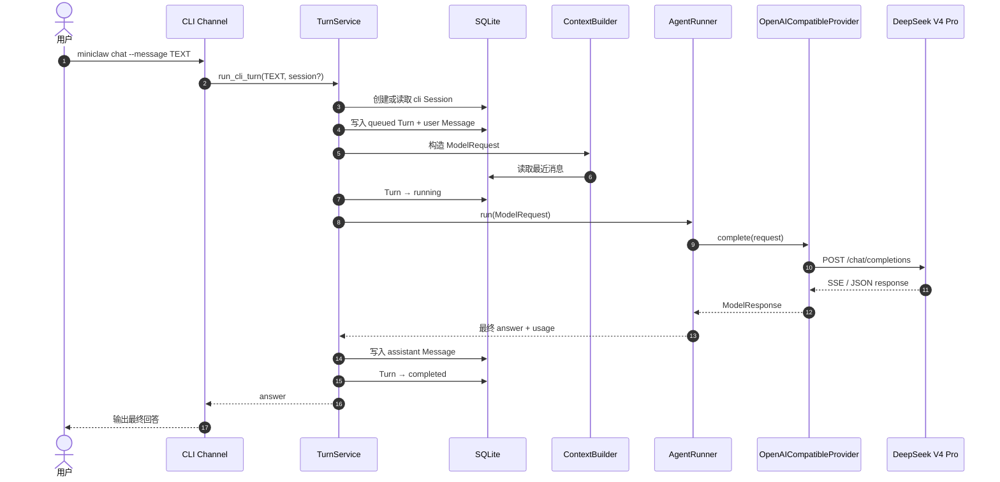

# MiniClaw Phase 1：CLI Agent 闭环设计

> 状态：已实现并通过离线门禁与真实 DeepSeek 验证  
> 日期：2026-08-07  
> 基线：Phase 0，commit `8afad33`  
> 当前开发分支：`phase-1-cli-agent`

## 1. 目标

Phase 1 交付第一条真实、可持久化、可诊断的 Agent 主链路：

```text
miniclaw chat --message
  → ContextBuilder
  → AgentRunner
  → OpenAI-compatible Provider
  → DeepSeek V4 Pro
  → SQLite Message / Turn
  → CLI answer
```

完成后，用户在仓库根目录配置本地 `.env`，即可执行：

```bash
uv run miniclaw init
uv run miniclaw chat --message "你好，请介绍你自己"
```

命令必须调用 `deepseek-v4-pro`，输出最终回答，并将用户消息、助手消息、Turn 状态、Token 用量和错误
分类写入 Phase 0 已创建的 SQLite Schema。

## 2. 已确认决策

| 主题 | 决策 |
| --- | --- |
| 基座模型 | `deepseek-v4-pro` |
| API 协议 | OpenAI Chat Completions compatible |
| Base URL | `https://api.deepseek.com` |
| 凭证 | 仓库根目录 `.env` 中的 `MINICLAW_MODEL_API_KEY` |
| 凭证来源 | 从 EvalHub 已加密保存的 DeepSeek Provider 凭据一次性复制 |
| 凭证边界 | `.env` 被 Git 忽略、权限 `0600`、环境变量优先、日志永不输出值 |
| HTTP Client | `httpx>=0.28,<1`，异步请求与 SSE 流式响应 |
| CLI | 标准库 `argparse` + `asyncio.run()` |
| 数据 | 复用现有 SQLite `sessions`、`turns`、`messages` 表 |
| 工具 | Runner 支持结构化 Tool Call 循环；内置工具在 Phase 2 接入 |
| 思考模式 | 使用 DeepSeek V4 Pro 默认思考模式，不额外关闭；解析但不向终端展示思维链 |

MiniClaw 不导入 EvalHub 包，也不读取 EvalHub 数据库。EvalHub 只在开发初始化时作为凭据来源，运行时
不存在兄弟仓库依赖。

### 2.1 凭据方案比较

| 方案 | 优点 | 代价 | 结论 |
| --- | --- | --- | --- |
| 运行时读取 EvalHub | 不复制凭据 | MiniClaw 被兄弟仓库路径、加密实现和运行目录绑定 | 拒绝 |
| `~/.miniclaw/secrets.toml` | 与项目目录分离 | 用户明确不选择；需要新增一套私密配置格式 | 拒绝 |
| 仓库根目录 `.env` | 本地开发直观，生态习惯成熟，Git 已忽略 | 只能从启动工作目录发现，必须保护文件权限 | 采用 |

`.env` 方案使用一次性本地迁移命令完成凭据复制；该命令不进入仓库，避免把 EvalHub 路径变成产品
接口。MiniClaw 自身只知道环境变量名。

## 3. 范围

### 3.1 本阶段实现

- `miniclaw chat --message TEXT [--session ID] [--home PATH]` 单次对话。
- 无 `--message` 且连接 TTY 时的最小交互循环；EOF 或 `/exit` 正常退出。
- 严格 `.env` 加载：只接受 `KEY=VALUE`，不执行 Shell、不展开变量，已有进程环境变量优先。
- Provider 稳定数据契约、错误类型和异步 OpenAI-compatible 实现。
- DeepSeek V4 Pro 的普通文本、SSE 文本、结构化 Tool Call、`reasoning_content` 和 Token usage 解析。
- 连接失败、HTTP 429 与 5xx 最多重试一次；401、403、400 不重试。
- `AgentRunner` 最多 8 轮；空最终响应、循环超限和取消有稳定错误。
- CLI 单用户身份、Session、Turn 和 Message Repository。
- System Prompt、`SOUL.md`、`USER.md` 与最近会话消息组成的最小 Context。
- 离线 fake Provider、Provider 本地 HTTP 契约测试和 CLI 端到端测试。
- 使用 EvalHub 的现有凭据进行一次显式真实 DeepSeek 冒烟验证。

### 3.2 本阶段不实现

- 文件、HTTP、Shell 工具及 Policy Engine；它们属于 Phase 2。
- 长期 `MEMORY.md` 检索、Skills 激活和上下文压缩；它们属于 Phase 3。
- 飞书、Telegram、Discord 和 Gateway；它们属于后续 Channel Phase。
- 多用户、并行 Tool Call、Web UI、流式终端 Markdown 渲染。
- 在仓库脚本中保留 EvalHub 路径或自动解密其凭据。

## 4. 主链路



任一 Provider 或 Runner 错误都必须把 Turn 标记为 `failed`，保存稳定 `error_code`，并向 CLI 返回不含
响应正文、认证 Header 或 API Key 的短消息。用户按 `Ctrl-C` 取消时将 Turn 标记为 `cancelled`。

## 5. 模块与接口

### 5.1 `.env` 边界

新增 `src/miniclaw/env.py`：

```python
def load_dotenv(path: Path, environ: MutableMapping[str, str] | None = None) -> tuple[str, ...]:
    """从可信本地文件加载尚未存在的环境变量，并返回实际写入的变量名。"""
```

约束：

- 文件不存在时安静返回空元组。
- 空行和 `#` 注释被忽略。
- 键必须匹配 `[A-Z_][A-Z0-9_]*`。
- 值允许无引号、单引号或双引号；不支持 `export`、命令替换、变量插值和多行值。
- 解析错误只报告行号和路径，不回显该行内容。
- CLI 只从当前工作目录的 `.env` 加载；现有环境变量不被覆盖。

### 5.2 Provider 契约

新增 `src/miniclaw/providers/base.py`，定义：

```python
@dataclass(frozen=True, slots=True)
class ToolCall:
    call_id: str
    name: str
    arguments: dict[str, JsonValue]


@dataclass(frozen=True, slots=True)
class ModelMessage:
    role: str
    content: str
    tool_calls: tuple[ToolCall, ...] = ()
    tool_call_id: str | None = None
    reasoning_content: str | None = None


@dataclass(frozen=True, slots=True)
class ModelRequest:
    model: str
    messages: tuple[ModelMessage, ...]
    tools: tuple[dict[str, JsonValue], ...] = ()


@dataclass(frozen=True, slots=True)
class ModelResponse:
    content: str
    tool_calls: tuple[ToolCall, ...]
    reasoning_content: str | None
    finish_reason: str
    input_tokens: int | None
    output_tokens: int | None
    provider_request_id: str | None
```

`reasoning_content` 是 DeepSeek 思考模式下 Tool Call 继续请求所必需的数据。它只存在于 Provider 与
Runner 的内部消息，不写入普通 Assistant Message，也不输出到终端。

### 5.3 OpenAI-compatible Provider

新增 `src/miniclaw/providers/openai_compatible.py`：

- 构造时接收 `base_url`、`api_key`、`timeout_seconds` 和可注入 `httpx.AsyncClient`。
- API Key 只保存在私有属性，类不实现包含字段值的自定义 `repr`。
- 请求使用 `Authorization: Bearer ...`，不会记录请求 Header。
- `stream=True` 时聚合 `delta.content`、`delta.reasoning_content` 和分片 Tool Call arguments。
- 非流式 JSON 作为同一公共响应解析器的兼容路径。
- Tool arguments 必须解析为 JSON object；非法 JSON 转换为 `ProviderProtocolError`。
- 读取 `x-request-id` 或 JSON `id` 作为诊断 request ID。

稳定错误类型：

| 错误 | 来源 | 是否重试 |
| --- | --- | --- |
| `ProviderAuthenticationError` | 401 / 403 | 否 |
| `ProviderRateLimitError` | 429 | 一次 |
| `ProviderTimeoutError` | 连接或读取超时 | 一次 |
| `ProviderServerError` | 5xx | 一次 |
| `ProviderProtocolError` | 400、无效 JSON/SSE、缺字段 | 否 |

重试等待优先使用 `Retry-After`，否则首次失败等待 0.5 秒。测试通过注入的 sleep 函数避免真实等待。

### 5.4 Agent Runner

新增 `src/miniclaw/agent/runner.py`：

```python
class AgentRunner:
    async def run(self, request: ModelRequest) -> AgentRunResult: ...
```

Phase 1 的 Tool Executor 是一个窄协议；默认 Registry 为空。模型未请求工具时返回最终答案；请求未知
工具时生成结构化 Tool Message 并继续模型循环，最多 8 轮。Phase 2 用 Policy + ToolRegistry 替换该
执行边界，不改变 Provider 或 Turn 接口。

Runner 规则：

- 每次 Provider 返回的 Assistant 消息完整加入本 Turn 内存上下文。
- 有 Tool Call 时必须保留并回传 `reasoning_content`。
- 没有 Tool Call 且 `content.strip()` 为空时抛出 `EmptyModelResponseError`。
- 第 8 轮仍请求工具时抛出 `AgentLoopLimitError`。
- Tool Call 按响应顺序执行；Phase 1 未注册工具返回 `tool_not_found` 结果。

### 5.5 Context 与 Turn

`ContextBuilder` 按固定顺序加载：System Prompt、`SOUL.md`、`USER.md`、最近 20 条 Session Message、
当前用户消息。本阶段不做 token 精确估算；只按配置的 `context_budget_tokens` 设置最多读取 20 条的保守
上限，完整预算和压缩在 Phase 3 实现。

新增窄 Repository：

- `SessionRepository.get_or_create_cli(owner_id, external_conversation_id)`
- `MessageRepository.list_recent(session_id, limit)`
- `TurnRepository.create(...)`、`mark_running(...)`、`complete(...)`、`fail(...)`、`cancel(...)`

所有状态变更使用参数化 SQL。完成写入 Assistant Message、Token 与 Turn 状态在一个事务中提交，避免
出现“CLI 已输出但数据库仍 running”的半完成记录。

## 6. CLI 行为

```text
miniclaw chat --message TEXT [--session ID] [--home ABSOLUTE_PATH]
```

退出码：

| Code | 含义 |
| --- | --- |
| `0` | 对话成功或交互式正常退出 |
| `2` | 参数、路径、配置或 `.env` 格式错误 |
| `3` | Provider 认证错误 |
| `4` | Provider 临时错误或协议错误 |
| `5` | 本地数据库、初始化或 I/O 错误 |
| `130` | 用户取消 |

未执行 `miniclaw init` 时，`chat` 返回可操作提示，不在对话入口偷偷创建状态。缺少 API Key 时只显示：
`MINICLAW_MODEL_API_KEY is not configured`。

## 7. DeepSeek V4 Pro 兼容策略

DeepSeek 官方当前资料确认 `deepseek-v4-pro` 支持 OpenAI Chat Completions、SSE、思考模式和 Tool
Calls。思考模式默认开启；在包含 Tool Call 的连续请求中，必须原样回传本轮 Assistant 的
`reasoning_content`，否则接口返回 400。

Phase 1 不发送 `temperature`、`top_p` 等在思考模式中无效的参数，不显示或持久化思维链。未来若提供
思考强度配置，只允许 `high` 或 `max`，默认沿用服务端 `high`。

官方依据：

- <https://api-docs.deepseek.com/zh-cn/guides/thinking_mode>
- <https://api-docs.deepseek.com/zh-cn/guides/tool_calls>
- <https://api-docs.deepseek.com/zh-cn/quick_start/pricing/>

## 8. 测试与验收

### 8.1 离线测试

- `.env`：不存在、注释、引号、环境优先、非法键、禁止 `export`、错误不泄露值。
- Provider：普通 JSON、SSE 文本、分片 Tool Call、reasoning、usage、request ID。
- Provider：500 后成功只重试一次；401 不重试；429 尊重 `Retry-After`；错误不含 Key。
- Runner：文本结束、未知工具结果、8 轮上限、空响应、取消传播。
- Repository：Session 幂等、消息顺序、完成事务、失败和取消状态。
- CLI E2E：fake Provider 下输入 → Context → Runner → SQLite → stdout。

### 8.2 真实验证

真实 DeepSeek 验证必须显式执行，且不进入普通单元测试：

```bash
chmod 600 .env
uv run miniclaw init --home /tmp/miniclaw-live
uv run miniclaw chat --home /tmp/miniclaw-live --message "只回复：MiniClaw online"
```

成功标准：退出码 0；stdout 有非空最终回答；SQLite Turn 为 `completed`；模型为
`deepseek-v4-pro`；Token 至少一侧大于 0；任何输出、Git diff 和日志中都没有 API Key。

## 9. 完成定义

Phase 1 只有在以下条件全部满足后才能合并到 `main`：

1. `miniclaw chat --message` 的离线 E2E 通过。
2. Provider 的重试、认证、SSE、Tool Call 和 reasoning 契约测试通过。
3. Runner 的空响应、8 轮上限和取消测试通过。
4. 真实 `deepseek-v4-pro` 冒烟调用成功，且凭据未出现在输出和 diff 中。
5. 全部 unittest、Ruff 与 `git diff --check` 通过。
6. README、本地运行指南、架构文档和开发进度页与已实现行为一致。
