# Lobster0 Phase 2：Tool、权限与安全执行设计

> 状态：已评审；P2.1-P2.3 已实现，P2.4 HTTPS 与 P2.5 最终门禁仍按目标描述
>
> 目标版本：Lobster0 Phase 2
>
> 文档日期：2026-08-07
>
> 前置基线：Phase 0 与 Phase 1 已完成，仓库基线 `7353791`
>
> 实施方式：逐任务 Implementation Plan + TDD + 独立 worktree

## 0. 大白话导读：先看懂我们到底要做什么

如果你现在只想理解 Phase 2，而不是马上看代码，只读这一章就够了。后面的章节是开发时查细节用的。

### 0.1 一句话解释 Phase 2

Phase 1 的 Lobster0 只有“嘴”和“大脑”：它能听懂问题，也能组织语言回答，但没有真正操作电脑的手。

Phase 2 给它增加三样东西：

1. **工具箱**：查看电脑配置、读文件、写文件、搜索、访问网页、运行受限命令；
2. **门卫**：每次使用工具前判断是直接允许、需要你批准，还是必须拒绝；
3. **操作记录本**：把调用了什么、为什么允许、结果如何保存下来，方便排错和回放。

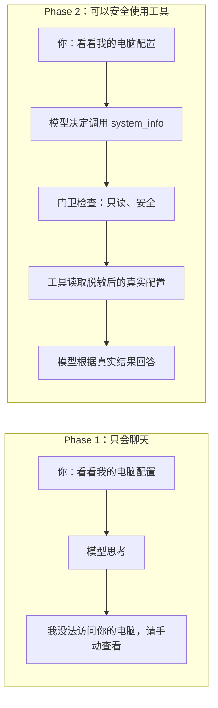

### 0.2 把 Lobster0 想成一个小团队

这些英文名第一次看会很抽象，可以先用下面的比喻理解：

| 工程名 | 大白话 | 负责什么 |
| --- | --- | --- |
| Model / DeepSeek | 大脑 | 理解你的话，决定下一步做什么 |
| AgentRunner | 调度员 | 让模型和工具来回配合，最多循环 8 次 |
| Tool | 工具箱 | 真正读取电脑、文件、网页或运行命令 |
| ToolRegistry | 工具清单 | 告诉模型“你现在有哪些工具可用” |
| PolicyEngine | 门卫 | 决定这次操作放行、审批还是拒绝 |
| Approval | 你的签字 | 高风险操作必须由你明确确认 |
| Workspace | 工作区围栏 | Agent 默认只能在这个目录里活动 |
| SQLite | 操作记录本 | 保存会话、工具调用、审批和结果 |
| Turn | 一轮任务 | 从你发一句话开始，到回答或等待审批结束 |

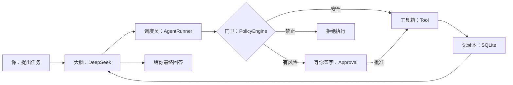

关键点只有一个：**模型不能直接碰电脑。它只能提出结构化工具请求，真正执行前一定经过门卫。**

### 0.3 Phase 2 会给它哪些工具

| 你可能说的话 | Lobster0 使用的工具 | 默认怎么处理 |
| --- | --- | --- |
| “看看我的电脑配置” | `system_info` | 只读，直接执行 |
| “读一下 README.md” | `read_file` | 工作区内直接执行 |
| “找出所有 Python 文件” | `glob` | 工作区内直接执行 |
| “搜索哪里出现了 AgentRunner” | `grep` | 工作区内直接执行 |
| “创建一份 notes.md” | `write_file` | 会改文件，需要审批 |
| “把这段文字替换掉” | `edit_file` | 会改文件，需要审批 |
| “访问这个 HTTPS 页面” | `http_get` | 会访问外部网络，默认审批 |
| “运行 git status --short” | `run_command` | 会启动程序，默认审批 |

Phase 2 不会给它“任意 Bash”。例如下面这些能力暂时明确不做：

- `sudo` 或切换系统用户；
- 删除文件和目录；
- SSH、上传文件或 `git push`；
- `bash -c "一长串命令"`；
- 自动修改、提交并部署 Lobster0 自己的源代码。

这不是功能没做完，而是第一版先把边界缩小，确保我们知道它到底会做什么。

### 0.4 示例一：查看电脑配置为什么不需要审批

`system_info` 只能调用写死的系统查询方式，模型不能偷偷替换成其他命令。返回结果还会主动删除序列号、
Hardware UUID、用户名、MAC 地址、环境变量等隐私字段。

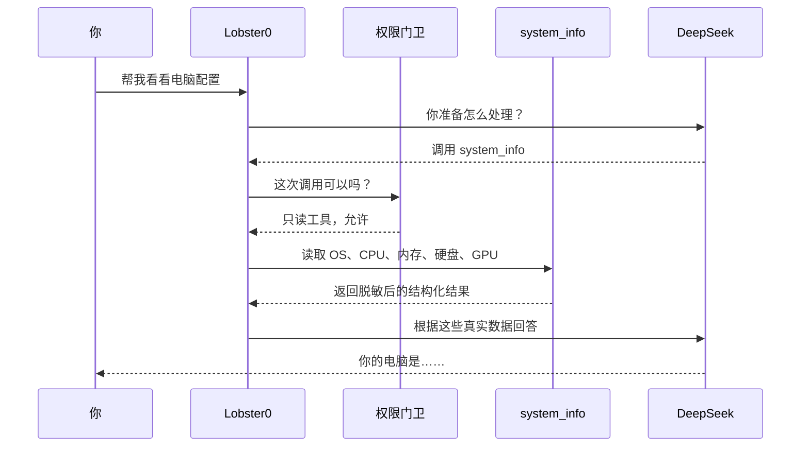

### 0.5 示例二：为什么 Agent 不能随便读你的整个 Home 目录

Workspace 可以理解成给 Agent 划出的“工作桌”。它可以处理桌面上的项目文件，但不能翻你家的保险柜。

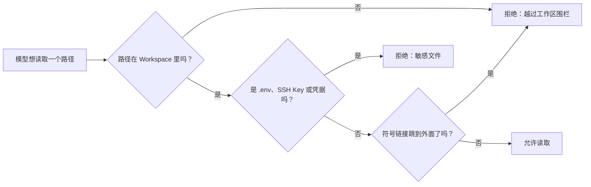

比如项目里的 `README.md` 可以读；即使 `.env` 也在项目目录里，仍然不能读。这样模型 API Key 不会被
Agent 自己拿出来放进对话或命令输出。

### 0.6 示例三：运行命令时你会看到什么

Lobster0 不接收一整段 Shell 字符串，而是把命令拆成“程序 + 参数”：

```text
program = "git"
args = ["status", "--short"]
```

这样门卫能准确看到要启动哪个程序、带哪些参数。第一次运行默认会暂停并给你一个审批 ID。

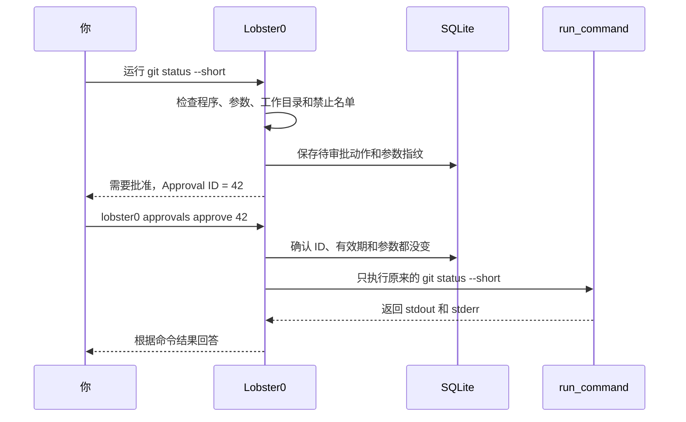

所谓“参数指纹”，就是把工具名和完整参数算成 SHA-256。你批准的是
`git status --short`，模型后来多加一个 `--force`，指纹就会变化，旧批准不能复用。

### 0.7 三种权限结果：绿灯、黄灯、红灯

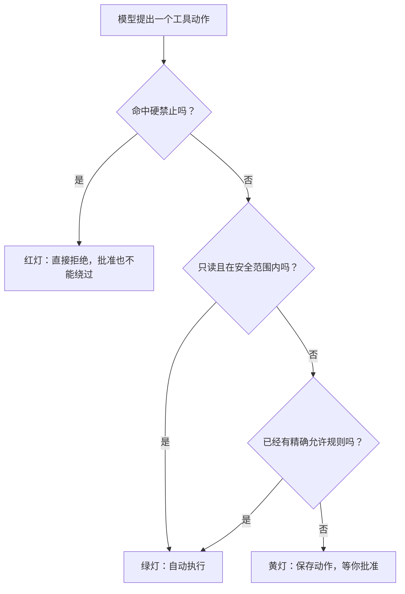

| 灯 | 典型例子 | 含义 |
| --- | --- | --- |
| 绿灯 | 查看配置、读普通文件、搜索代码 | 可以自动做，但仍记录日志 |
| 黄灯 | 写文件、访问外网、运行普通命令 | 先暂停，等你确认这一次 |
| 红灯 | 读密钥、sudo、上传、删除、git push | 默认彻底禁止，审批也不能放行 |

### 0.8 为什么要保存 ToolRun、Approval 和 Audit

因为个人 Agent 是长期在线的。它今天改了一个文件，明天你需要知道：是谁要求的、模型调用了哪个工具、
当时的参数是什么、你是否批准、最终成功还是失败。

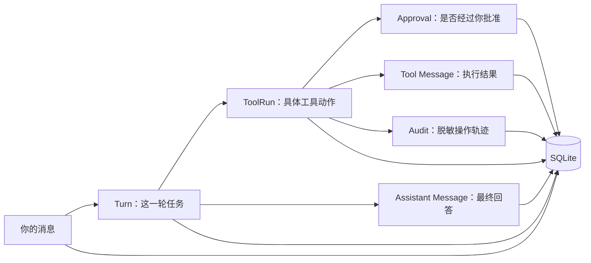

如果进程在高风险动作执行到一半时崩溃，状态会记录为 `interrupted`，重启后不会自动再执行一次。这能避免
“上次到底有没有改成功”不确定时又重复产生副作用。

### 0.9 我们会按什么顺序开发

不会一次写完几十个文件再一起调试，而是每一段都先跑通一个真实闭环。

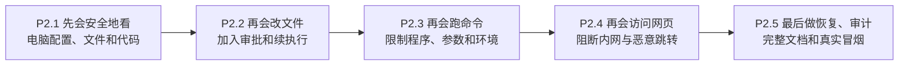

每一步都遵循同一个节奏：

```text
先写一个会失败的测试
    -> 确认它确实因为功能不存在而失败
    -> 写最少代码让它通过
    -> 跑相关测试和全部测试
    -> 写对应工程文档
    -> 提交
```

### 0.10 你应该怎么读后面的技术章节

| 如果你想知道 | 建议阅读 |
| --- | --- |
| 最终能做什么 | 第 1、3、13、21 节 |
| 为什么不是直接 Fork OpenClaw | 第 4、5 节 |
| 整体代码怎么连接 | 第 6、7、8、9 节 |
| 权限和审批怎么保证安全 | 第 10、11、12、17 节 |
| 数据保存在哪里 | 第 15、16、18 节 |
| 会创建哪些代码文件 | 第 19 节 |
| 怎么证明不是“看起来能用” | 第 20、21、22 节 |

第一次阅读时可以跳过 Python 接口、JSON Schema、SQL 和完整测试矩阵。它们不是让你背的，而是开发时
用来防止我们写着写着改变设计。

## 1. 结论先行

Phase 2 要把 Lobster0 从“能对话的模型客户端”升级成“能在本机安全做事的个人 Agent”。本阶段的
首个用户可见结果是：当用户说“帮我看看我的电脑是什么配置”时，模型能够调用只读的
`system_info` Tool，读取经过脱敏的真实机器信息，再基于结果回答，而不是告诉用户自己手动打开
“关于本机”。

本阶段采用“自有 Python 内核 + 选择性移植上游成熟行为”的路线：

- 从 nanobot 借鉴 Python Tool Contract、Registry、Workspace Guard 与安全测试组织方式；
- 从 ZeroClaw 借鉴 supervised 默认策略、执行前审批、失败关闭和审计；
- 从 RayClaw 借鉴 Channel 无关的共享 Tool 层、路径敏感文件阻断和工作目录隔离；
- 从 OpenClaw/openclaw-python 借鉴 `security × ask` 两轴策略、模型调用前过滤 Tool Schema、
  参数绑定审批与命令 allowlist；
- 不整仓 Fork，不复制 WebUI、MCP、多 Agent、Cron、远程节点和复杂 Sandbox；
- 不为每个上游概念建立一层抽象。Lobster0 只有一个 Tool 执行入口和一个 Policy 真相来源。

Phase 2 分五个可独立验收的纵向切片：

1. P2.1：Tool Runtime、`system_info`、`read_file`、`glob`、`grep`；
2. P2.2：`write_file`、`edit_file`、参数绑定审批与 CLI 审批；
3. P2.3：受限 `run_command`、命令 allowlist、超时和环境隔离；
4. P2.4：`http_get`、SSRF 防护、重定向与响应限制；
5. P2.5：恢复、审计、文档、离线安全矩阵和真实模型冒烟验证。

`read_memory` 与 `propose_memory` 仍属于 Phase 3。完整工程设计中列出的九个 v1.0 Tool 是最终产品
清单，不应迫使 Phase 2 提前实现 Memory 子系统。Phase 2 新增 `system_info`，因为它直接解决当前真实
需求，并且是边界明确的只读能力。

## 2. 当前事实与问题根因

### 2.1 当前已经具备

仓库当前已经有：

- OpenAI-compatible Provider 与原生 Tool Call 协议解析；
- 最多 8 轮的 `AgentRunner`；
- `ModelRequest.tools` 字段；
- Session、Turn、Message 的 SQLite 持久化；
- `tool_runs`、`approvals`、`policy_rules`、`audit_events` 表；
- Turn 的 `waiting_approval` 状态与 `parent_turn_id`；
- 配置中的 Workspace 和 `read_only_roots`；
- CLI `init`、`doctor`、`chat`。

### 2.2 Phase 1 基线不能查看电脑配置的根因（已解决）

以下是进入 Phase 2 前的历史基线，不代表当前实现。P2.1 已接通 `system_info` 和只读文件 Tool，P2.2
已接通文件审批续执行，P2.3 已接通 exact-argv 命令。原根因是：

1. `AgentRunner` 虽支持 Tool Call，但 CLI 创建 Runner 时没有注册任何 Tool；
2. `ModelRequest.tools` 没有真实 Tool Schema，模型不知道自己具有本机能力；
3. 当前 `doctor permissions` 只检查状态目录与配置文件的 POSIX 权限；
4. Workspace、命令和审批的运行期 Policy 尚未接入；
5. 所以模型只能根据 System Prompt 自我介绍，不能读取本机状态。

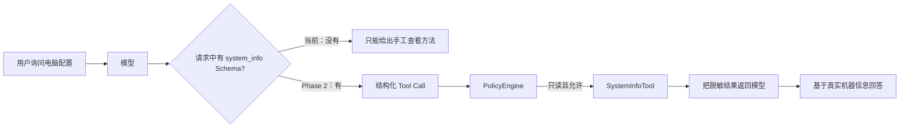

## 3. 目标、非目标与完成定义

### 3.1 目标

- 模型只看到当前用户、当前运行模式下实际可用的 Tool Schema。
- 每个 Tool Call 必须经过名称解析、参数校验、硬禁止、Policy、审计，再执行。
- 只读低风险动作可以自动执行。
- 写入、覆盖、命令和网络动作按风险拒绝、放行或进入审批。
- 审批绑定完整规范化参数哈希，10 分钟过期，只能消费一次。
- Tool 参数、结果、Policy 决策和耗时可在 SQLite 中回放。
- Workspace 外路径、敏感文件、SSRF、Shell 字符串和密钥继承默认失败关闭。
- CLI 与未来飞书、Telegram、Discord 共用同一套 Policy 和审批状态机。
- 重启后 pending approval 仍存在；已消费的高风险动作不会自动重放。

### 3.2 非目标

- 不在 Phase 2 引入 Docker/Seatbelt/bubblewrap 级 OS Sandbox；应用级 Policy 不是 OS Sandbox。
- 不实现任意 Bash 字符串、管道、重定向、命令替换或交互式 TTY。
- 不实现删除文件、安装软件、`sudo`、远程登录、Git push 或自动修改 Lobster0 源码。
- 不实现后台进程、长任务管理、PTY、浏览器、MCP、Cron 或远程节点执行。
- 不实现 Memory Tool、Skill 代码执行、Channel 内审批卡片。
- 不引入 ORM、通用 JSON Schema 库、DI 容器、插件框架或策略 DSL。

### 3.3 Phase 2 完成定义

Phase 2 完成必须同时满足：

1. `system_info` 能在 macOS 和 Linux 返回稳定、脱敏、有限大小的结构化信息；
2. `read_file`、`glob`、`grep` 无法通过绝对路径、`..` 或符号链接逃逸；
3. `.env`、SSH Key、云凭据等敏感路径即使位于 Workspace 内也默认拒绝；
4. 新建、覆盖、精确编辑的风险和审批行为符合矩阵；
5. `run_command` 不接收命令字符串，不继承模型 API Key，不允许 Shell 包装器；
6. `http_get` 不能访问 loopback、内网、link-local、保留地址或重定向后的内网地址；
7. 参数改变、审批过期、重复消费、不同用户审批都必须失败；
8. 所有 Tool 都不存在绕开 `ToolExecutor` 和 `PolicyEngine` 的 Agent 运行路径；
9. 离线单元、集成、安全测试全部通过，Ruff 与 `git diff --check` 通过；
10. 使用真实 DeepSeek 基座完成一次显式冒烟：电脑配置、Workspace 读文件、命令审批各一例。

## 4. 上游参考快照与许可证

本设计基于 2026-08-07 实际检出的上游快照。实现计划不得直接追踪浮动的 `main`。

| 项目 | 参考 commit | License | Phase 2 重点 |
| --- | --- | --- | --- |
| [nanobot](https://github.com/HKUDS/nanobot) | `bd8d3ad5b6db273e582fb0864927716f5f8a20e2` | MIT | Tool、Registry、Workspace、Shell/Web 安全测试 |
| [ZeroClaw](https://github.com/zeroclaw-labs/zeroclaw) | `563c5bb737818ea995f77aa82cac2a27fa55ee43` | MIT OR Apache-2.0 | supervised、Approval、Security Policy、审计 |
| [RayClaw](https://github.com/rayclaw/rayclaw) | `a08e49a1e39f43e032ad9b4f658aa9453031a7bb` | MIT | Channel 共享 Tool、敏感路径、工作目录 |
| [openclaw-python](https://github.com/openxjarvis/openclaw-python) | `a6ce3e607a03127ed3ee04d61cedf0452eba0eb6` | MIT | Exec Approval、Tool Policy、权限预设 |
| [OpenClaw](https://github.com/openclaw/openclaw) | 实现时固定具体 commit | MIT | 官方 Tool Policy 与 Exec Approval 语义 |

### 4.1 逐项目“照搬什么”

| 上游设计 | Lobster0 处理 | 说明 |
| --- | --- | --- |
| nanobot `Tool`、`ToolRegistry` | 借行为，按 Lobster0 类型重写 | 保留名称、Schema、校验、执行；不复制完整插件元数据与动态发现 |
| nanobot Workspace Guard | 移植测试思想与错误边界 | 解析逻辑结合 Lobster0 的 Workspace/read-only roots |
| nanobot SSRF/DNS rebinding 测试 | 优先移植行为测试 | HTTP 实现可能重写，但安全断言保持 |
| ZeroClaw supervised 默认值 | 直接采用产品语义 | 未知或有副作用的动作默认审批或拒绝 |
| ZeroClaw Yes/No/Always 审批 | 采用状态机，不采用内存全局对象 | Lobster0 使用 SQLite，支持重启恢复和未来 IM |
| ZeroClaw Tool 名称级 session allowlist | 不直接照搬 | 只按 Tool 名永久允许过宽；Lobster0 必须绑定参数或安全规则 |
| RayClaw Channel 共享 Tool | 直接采用架构思想 | Tool 不知道请求来自飞书、Telegram、Discord 还是 CLI |
| RayClaw 敏感文件名单 | 采用并扩展 | `.env`、`.ssh`、云凭据、Token 文件默认硬禁止 |
| RayClaw `shell -c` CommandRunner | 明确不复制 | 与 Lobster0“程序名 + 参数数组”安全约束冲突 |
| OpenClaw `security × ask` | 直接采用核心语义 | 能力上限与人工确认是两个维度 |
| OpenClaw 多层 Tool Policy | 收敛为一个 PolicyEngine | 不复制 global/provider/group/subagent/sandbox 多套策略 |
| openclaw-python 内存 ApprovalManager | 不复制实现 | busy-wait、全局单例、无持久化不适合跨 IM |

### 4.2 代码复用规则

- 只借鉴思想或独立重写时，在本文与提交说明记录来源。
- 实质性复制或改写上游代码时，在源文件头标明仓库、commit、原路径和许可证。
- 同时更新 `THIRD_PARTY_NOTICES.md`，保留原版权声明。
- ZeroClaw 代码如直接移植，默认按其 MIT 选项处理；若单文件另有声明则服从单文件。
- 不复制上游测试凭据、生成文件、品牌资产、二进制和不明来源代码。
- 实现顺序是先写 Lobster0 行为测试，再移植通过测试的最小部分，不整目录复制。

## 5. 方案比较与推荐

### 5.1 方案 A：直接 Fork openclaw-python

优点是功能数量多，缺点是会继承多 Provider、远程节点、复杂 Policy、兄弟仓库兼容层和大量非目标代码。
它更适合“运行一个 OpenClaw Python 克隆”，不适合学习 Lobster0 自己的 Agent Runtime。

结论：不采用整仓 Fork，但把它作为行为参考和可移植代码源。

### 5.2 方案 B：直接包一层原版 OpenClaw

优点是最快得到成熟能力，缺点是 Lobster0 会变成配置/包装项目，Python 内核、Tool Loop、审批恢复和
Policy 的学习价值很低，排障时还要跨语言和跨进程。

结论：不作为 Lobster0 主路线；未来可以做一个可选 OpenClaw Provider/Bridge，不属于 Phase 2。

### 5.3 方案 C：自有 Python 内核，选择性移植成熟边界

它保留 Lobster0 已完成的 Provider、Runner、Turn 和 SQLite，新增最少必要的 Tool/Policy 模块；安全难点
直接借上游测试和语义，不从零发明。

结论：采用。它最符合“个人项目 + 学习 + 未来企业 Agent 工作方向”的目标。

## 6. Phase 2 总体架构

说人话：这张图是在说明“用户入口、模型、门卫、工具和数据库怎么接起来”。无论以后消息来自 CLI 还是
飞书，最后都走同一个 Agent、同一个权限门卫和同一份操作记录，不会出现 CLI 安全、飞书却能绕过的情况。

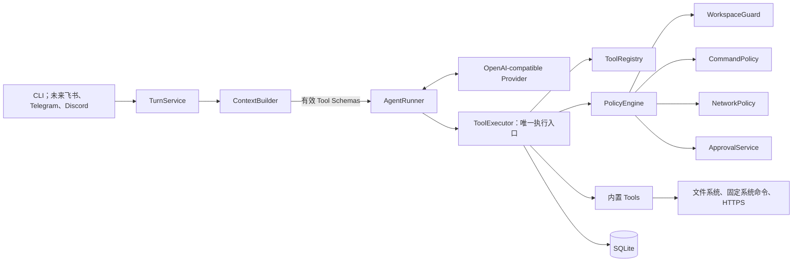

### 6.1 唯一执行路径

Agent 运行时只允许以下调用链：

```text
AgentRunner
  -> ToolExecutor.execute(context, tool_call)
       -> ToolRegistry.get(name)
       -> tool.validate(arguments)
       -> PolicyEngine.authorize(context, tool, normalized_arguments)
       -> ToolRunRepository.create(...)
       -> allow: tool.execute(...)
       -> approval: ApprovalRepository.create(...)
       -> deny: structured Tool error
       -> Message/ToolRun/Audit persistence
```

任何 Tool 都不得：

- 自己决定是否跳过 Policy；
- 直接创建或批准 Approval；
- 接收 API Key、数据库连接或 Channel SDK；
- 读取完整进程环境；
- 调用另一个 Tool 的公开执行方法；
- 把 traceback、凭据或未截断二进制返回给模型。

测试可以直接调用 Tool 做纯单元测试，但产品 Bootstrap 不暴露第二条 Agent 执行路径。

## 7. 核心数据契约

以下代码是目标接口草图，名称可在实施计划评审时微调；语义不可悄悄改变。

```python
from dataclasses import dataclass, field
from enum import StrEnum
from pathlib import Path
from typing import Protocol

from lobster0.providers.base import JsonValue, ToolCall


class ToolRisk(StrEnum):
    LOW = "low"
    MEDIUM = "medium"
    HIGH = "high"
    CRITICAL = "critical"


class PolicyAction(StrEnum):
    ALLOW = "allow"
    DENY = "deny"
    REQUIRE_APPROVAL = "require_approval"


@dataclass(frozen=True, slots=True)
class ToolContext:
    user_id: int
    session_id: int
    turn_id: int
    workspace: Path
    read_only_roots: tuple[Path, ...]


@dataclass(frozen=True, slots=True)
class ToolDefinition:
    name: str
    description: str
    parameters: dict[str, JsonValue]
    risk: ToolRisk


@dataclass(frozen=True, slots=True)
class ToolResult:
    ok: bool
    data: JsonValue = None
    error_code: str | None = None
    error_message: str | None = None
    retryable: bool = False
    metadata: dict[str, JsonValue] = field(default_factory=dict)


class Tool(Protocol):
    definition: ToolDefinition

    def validate(self, arguments: dict[str, JsonValue]) -> dict[str, JsonValue]: ...

    async def execute(
        self,
        context: ToolContext,
        arguments: dict[str, JsonValue],
    ) -> ToolResult: ...
```

这里使用 `Protocol` 是合理的，因为 Phase 2 同时有多个 Tool 实现；不建立 ToolFactory、PluginManager 或
多层基类。每个 Tool 使用短小的显式参数校验函数，不引入完整 JSON Schema 校验依赖。给模型的 Schema 与
运行时校验必须由同一模块维护，并通过契约测试确保必填字段一致。

### 7.1 Tool Result 给模型的稳定格式

成功：

```json
{
  "ok": true,
  "tool": "system_info",
  "data": {},
  "metadata": {"truncated": false}
}
```

失败：

```json
{
  "ok": false,
  "tool": "read_file",
  "error": {
    "code": "workspace_escape",
    "message": "path is outside the configured workspace",
    "retryable": false
  }
}
```

错误信息应让模型知道是否可以改参数重试，但不能包含 Python traceback、完整绝对敏感路径或策略内部细节。

## 8. Tool Registry 与 Schema 暴露

`ToolRegistry` 只做三件事：按名称注册、按名称获取、按稳定顺序输出 Schema。重复名称在启动时失败；未知
名称返回 `tool_not_found`，不做模糊自动纠正。

模型调用前执行有效 Tool 过滤：

1. 配置中未启用的 Tool 不出现在 Schema；
2. 当前平台不支持的 Tool 不出现在 Schema；
3. `security=deny` 且无法审批的 Tool 不出现在 Schema；
4. 命中硬禁止并不代表移除整个 Tool，只是对应参数在执行时拒绝；
5. 输出按 Tool 名排序，减少 Prompt 缓存抖动；
6. Schema 过滤只是减少模型误调用，运行时 Policy 仍必须再次校验。

这一点直接借鉴 OpenClaw“在模型调用前移除不可访问 Tool”的思想，但 Lobster0 不复制其多级
global/provider/group/subagent 策略合并器。

## 9. Tool 执行主流程

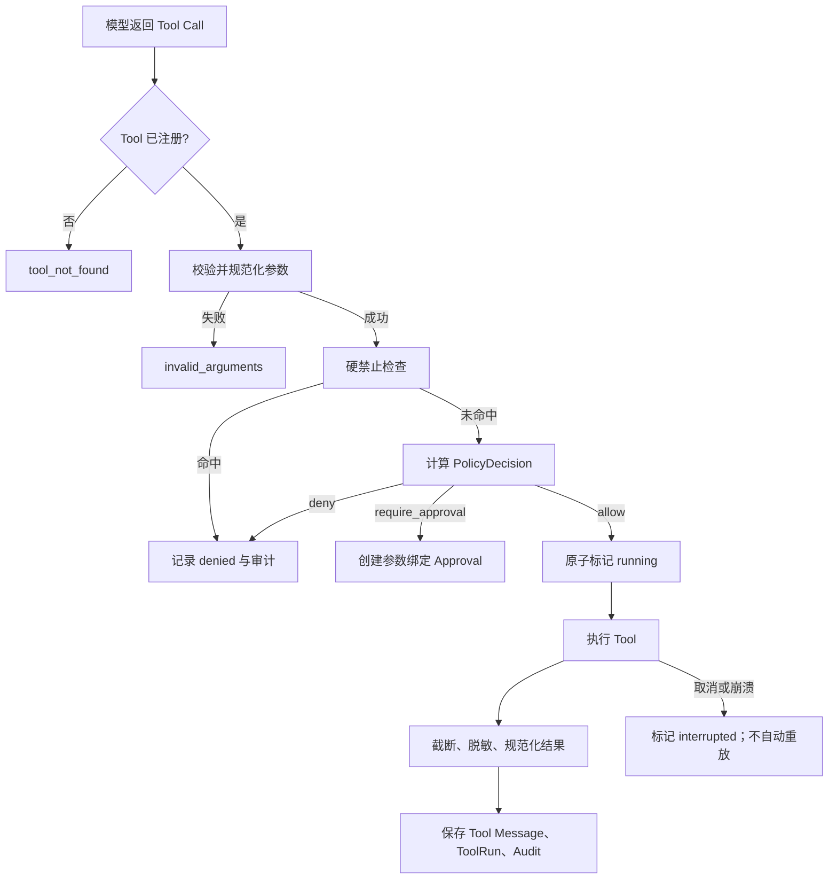

### 9.1 多 Tool Call

- 每个模型响应最多接受 8 个 Tool Call，按原顺序处理，不并行产生副作用。
- 已允许的前序 Call 可以完成。
- 遇到第一个待审批 Call 时，创建 Approval 并结束当前 Turn。
- 同一响应中位于其后的 Call 不执行，记录为 `interrupted`，原因是
  `pending_approval_before_call`。
- 批准后的续执行 Turn 只执行绑定的 Call；其余未执行 Call 以结构化 `not_executed` Tool Result 补齐，
  让模型自行判断是否重新发起。
- Provider 重试只能重试模型 HTTP 请求，不能重放已经成功或已消费审批的 ToolRun。

## 10. Policy 模型

说人话：Policy 就是门卫。它不负责真的读取文件或运行命令，只负责在执行前给出一个明确结论：绿灯
`allow`、红灯 `deny`，或者黄灯 `require_approval`。

### 10.1 两轴策略

`security` 决定能力上限：

- `deny`：该类动作不可执行；
- `allowlist`：规则命中可放行，未命中按 `ask` 处理；
- `full`：除硬禁止外可执行。

`ask` 决定人工确认：

- `off`：不请求用户；允许就执行，不允许就拒绝；
- `on-miss`：allowlist 未命中时进入审批；
- `always`：所有非硬禁止动作都审批。

### 10.2 决策矩阵

| security | ask | allowlist 命中 | allowlist 未命中 | 硬禁止 |
| --- | --- | --- | --- | --- |
| deny | 任意 | deny | deny | deny |
| allowlist | off | allow | deny | deny |
| allowlist | on-miss | allow | require approval | deny |
| allowlist | always | require approval | require approval | deny |
| full | off | allow | allow | deny |
| full | on-miss | allow | allow | deny |
| full | always | require approval | require approval | deny |

### 10.3 推荐默认值

```toml
[tools]
enabled = [
  "system_info",
  "read_file",
  "write_file",
  "edit_file",
  "glob",
  "grep",
  "http_get",
  "run_command",
]
security = "allowlist"
ask = "on-miss"

[tools.run_command]
allow_commands = []
timeout_seconds = 30
```

内置安全规则让 `system_info`、Workspace 内的 `read_file`、`glob`、`grep` 自动允许。写操作、网络域名
和命令默认未命中，因此进入审批。用户可以显式增加窄规则；安装 Lobster0 不会自动获得任意命令执行权。

### 10.4 决策优先级

```text
硬禁止
  > Tool 是否启用
  > 用户/运行期显式 deny
  > 参数与资源边界
  > 已持久化窄 allowlist 规则
  > 内置低风险规则
  > security × ask 默认值
```

未知 Tool、未知规则类型、损坏规则 JSON、无法解析路径或程序都按 deny 处理。

## 11. Approval 设计

说人话：Approval 不是给 Agent 永久管理员权限，而是让你看清楚“哪个工具、哪些参数、这一次要做什么”
以后再签字。批准内容发生任何变化，都必须重新申请。

### 11.1 为什么不挂起协程

审批可能持续数分钟，也可能发生在飞书等另一个进程生命周期中。Lobster0 不像 ZeroClaw CLI 那样一直
等待 stdin，也不采用 openclaw-python 内存 ApprovalManager 的 busy-wait。当前 Turn 持久化为
`waiting_approval` 后结束；批准时创建新的续执行 Turn。

### 11.2 参数绑定

规范化参数规则：

- 对象键按字典序；
- UTF-8；
- JSON 使用紧凑分隔符；
- 不允许 NaN/Infinity；
- 路径在哈希前转换成 Policy 已解析的规范绝对路径；
- `run_command` 使用解析后的 executable、原样 argv 和固定 cwd；
- SHA-256 输入包含 Tool 名和规范化参数，避免跨 Tool 重放。

```text
sha256("run_command\n" + canonical_json(normalized_arguments))
```

### 11.3 状态机

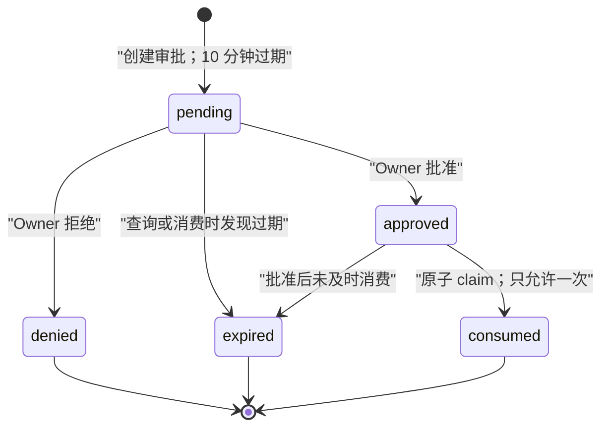

ToolRun 状态：

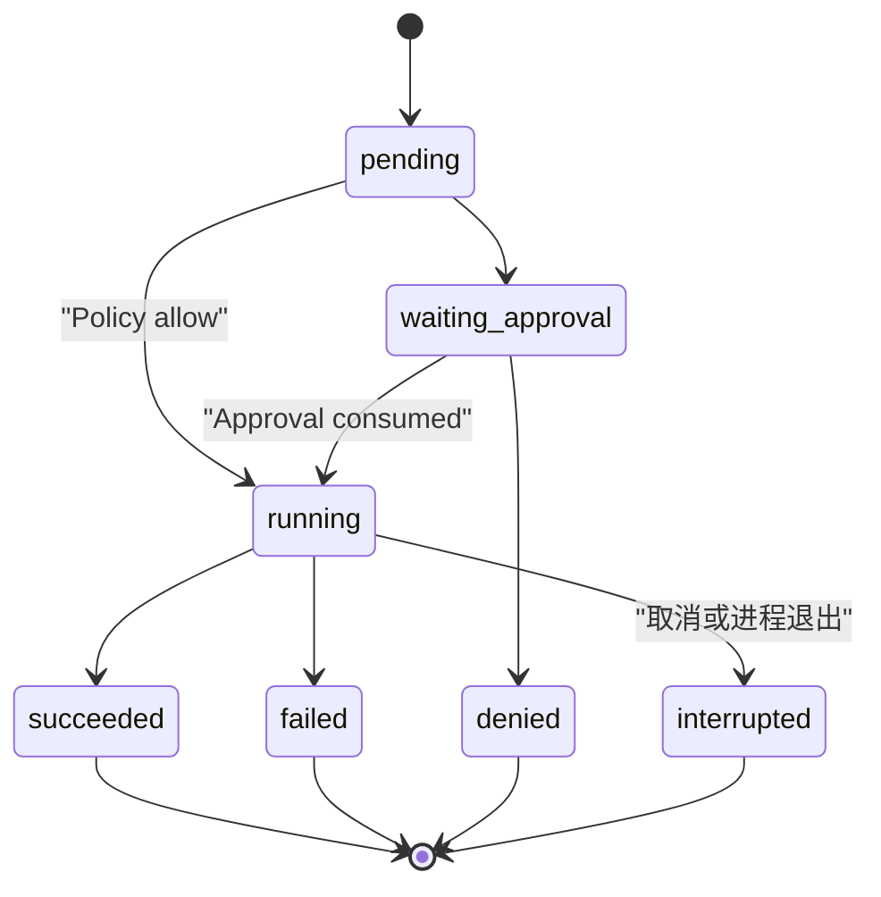

### 11.4 批准续执行时序

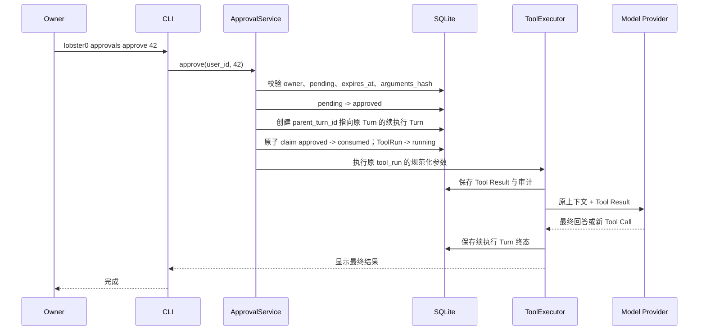

续执行必须幂等：`inbound_event_id="approval:<id>"` 在同一 Session 内唯一。若进程在
`pending -> approved` 后、consume 前退出，重试 `approve` 复用同一个子 Turn；若进程在 consumed 后、
Tool 完成前退出，ToolRun 标记为 interrupted，并明确要求用户重新发起动作，不能自动重复副作用。

### 11.5 CLI

```bash
uv run lobster0 approvals list --status pending
uv run lobster0 approvals show 42
uv run lobster0 approvals approve 42
uv run lobster0 approvals approve 42 --always
uv run lobster0 approvals deny 42
```

- 所有命令支持 `--json`，便于未来 Channel 和自动化复用。
- `approve` 默认 allow-once。
- `--always` 仅在 Policy 能生成窄规则时可用；否则明确拒绝，不退化为宽泛 Tool 名白名单。
- Phase 2 可安全持久化的 always 规则只包括：HTTPS 精确 hostname，以及
  `resolved_program + exact argv` 的精确命令。文件覆盖和编辑不生成 always 规则。
- 重复 `approve`、批准过期记录、批准别人的记录统一失败，退出码为 2。
- `deny` 会把 ToolRun 标为 denied，并创建一个续执行 Turn 把拒绝结果交给模型解释。

## 12. Workspace 与敏感路径

### 12.1 根目录规则

- `workspace.path`：可读写根；
- `workspace.read_only_roots`：只读根；
- 相对路径以 Workspace 为基准；
- 绝对路径必须属于 Workspace 或显式只读根；
- 写操作永远不能落在 read-only root；
- 错误消息向模型显示相对安全路径，不泄露无关 Home 结构。

### 12.2 防逃逸算法

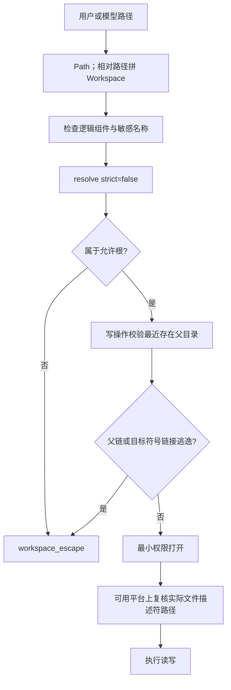

### 12.3 默认硬禁止路径

即使文件位于 Workspace 内也拒绝：

- `.env`、`.env.*`；
- `.ssh/`、`.aws/`、`.gnupg/`、`.kube/`、`.config/gcloud/`；
- `id_rsa`、`id_ed25519` 等私钥；
- `.netrc`、`.npmrc`、`credentials`、`credentials.json`、`token.json`；
- `secrets.json`、`secrets.yaml`、常见密钥库文件；
- Lobster0 状态目录中的配置、数据库和日志，Workspace 子目录本身除外；
- `/etc/shadow`、`/etc/gshadow`、`/etc/sudoers`；
- Docker Socket 与常见容器运行时 Socket。

该名单参考 RayClaw，并增加 Lobster0 自身状态边界。大小写敏感性按所在文件系统处理；macOS 默认卷上
还需要用规范路径比较防止大小写变体绕过。

## 13. 内置 Tool 规格

### 13.1 `system_info`

用途：读取当前 Lobster0 所在机器的基础硬件与操作系统信息。

参数：

```json
{
  "type": "object",
  "properties": {
    "sections": {
      "type": "array",
      "items": {"type": "string", "enum": ["os", "cpu", "memory", "storage", "gpu"]}
    }
  },
  "additionalProperties": false
}
```

默认返回全部 section。结果字段：

```json
{
  "os": {"name": "macOS", "version": "...", "architecture": "arm64"},
  "cpu": {"model": "Apple ...", "logical_cores": 10},
  "memory": {"total_bytes": 17179869184},
  "storage": [{"mount": "/", "total_bytes": 0, "free_bytes": 0}],
  "gpu": [{"model": "Apple ..."}],
  "unavailable_sections": []
}
```

实现边界：

- 优先使用标准库 `platform`、`os.cpu_count`、`shutil.disk_usage`；
- macOS 缺失字段只允许调用固定 argv 的 `sysctl` 或指定 data type 的 `system_profiler -json`；
- Linux 可读取 `/etc/os-release`，并在存在时用固定 argv 调用 `lscpu`/`lsblk`；
- 不经过 `run_command`，因为程序和参数由 Tool 固定，模型不能注入；
- 单个系统命令超时 5 秒，总结果最大 64 KiB；
- 不返回序列号、Hardware UUID、主机名、用户名、精确私网 IP、MAC 地址、已登录账户或环境变量；
- 部分字段不可用时返回 `unavailable_sections`，不让整个 Tool 失败；
- 风险为 low，默认自动允许。

这就是当前“查看电脑配置”问题的直接修复切片。

### 13.2 `read_file`

参数：`path`、可选 `offset`、可选 `limit`。`offset` 为从 1 开始的行号，`limit` 默认 200、最大 1000。

规则：

- Workspace 和 read-only roots 内可读；
- 敏感路径硬拒绝；
- UTF-8 文本；含 NUL 或解码失败返回 `binary_file`；
- 单次最多读取 512 KiB；超过时返回截断信息和下一 offset；
- 不解析 Markdown、PDF、图片或 Office；
- 风险 low，安全路径默认自动允许。

### 13.3 `write_file`

参数：`path`、`content`、`overwrite=false`。

规则：

- 仅 Workspace；read-only roots 永远拒绝；
- 内容最大 256 KiB、UTF-8；
- 默认原子写：同目录临时文件、flush、`os.replace`；
- `overwrite=false` 且文件存在时失败；
- 新建文件为 medium，默认审批；
- 覆盖文件为 high，每次审批；
- 不创建多级缺失父目录；用户必须先明确创建目标目录或后续新增专用 Tool；
- 不写敏感路径，不写 Lobster0 源码后自动提交或部署。

### 13.4 `edit_file`

参数：`path`、`old_text`、`new_text`。

规则：

- `old_text` 必须非空并且只出现一次；零次返回 `text_not_found`，多次返回 `text_not_unique`；
- 编辑后文件最大 1 MiB；
- 使用原子替换，保留原文件权限；
- 仅 UTF-8 普通文件；
- 风险 medium，每次审批；
- 不提供 regex replace、模糊 patch 或批量目录修改。

### 13.5 `glob`

参数：`pattern`、可选 `root="."`、可选 `limit=200`。

规则：

- pattern 不能是绝对路径；root 必须通过 Workspace Guard；
- 不跟随目录符号链接到允许根外；
- 敏感路径从结果中移除；
- 结果按相对路径字典序，最多 200；
- 风险 low，默认自动允许。

### 13.6 `grep`

参数：`pattern`、可选 `glob="**/*"`、可选 `root="."`、可选 `limit=100`。

规则：

- Python `re`，无外部 `grep` 进程；非法正则返回 `invalid_pattern`；
- 最多扫描 200 个文件，每个文件最大 1 MiB，总读取最大 20 MiB；
- 跳过二进制和敏感路径；
- 每个结果包含相对路径、行号和截断后的单行文本；
- 风险 low，默认自动允许。

### 13.7 `run_command`

参数：

```json
{
  "program": "git",
  "args": ["status", "--short"],
  "timeout_seconds": 30
}
```

规则：

- 不接收 `command` 字符串；`args` 每项必须是字符串；
- 使用 `shutil.which` 和受控 PATH 解析 executable；
- `cwd` 固定为 Workspace，模型不能覆盖；
- `shell=False`；
- 环境只保留最小 `PATH`、locale 和必要平台变量；显式移除 API Key、Token、Secret、Cookie、代理凭据；
- stdout/stderr 分开捕获，各最大 1 MiB；给模型的合并预览受全局 20,000 字符上限；
- 默认超时 30 秒，最大 120 秒；超时先 TERM，2 秒后 KILL；
- 无 stdin、无 PTY、无后台进程；
- 风险 high；allowlist 精确命中可执行，未命中进入审批。

Phase 2 硬禁止：

- Shell 包装器：`sh`、`bash`、`zsh`、`fish`、PowerShell；
- inline eval：`python -c`、`node -e`、Ruby/Perl 等等价参数；
- 提权和切换用户：`sudo`、`su`、`doas`；
- 远程登录/上传：`ssh`、`scp`、`sftp`、`rsync`、`nc`；
- 通用下载上传工具：`curl`、`wget`；网络读取使用受控 `http_get`；
- 删除工具：`rm`、`rmdir`、`shred`；
- `git push`、凭据修改、Docker/容器 Socket 操作；
- 包安装和系统服务管理默认 deny，Phase 2 不提供永久规则。

允许规则不能只写“允许 git”。必须至少绑定 executable 与 argv 条件，例如：

```json
{
  "type": "command_exact",
  "resolved_program": "/usr/bin/git",
  "args": ["status", "--short"]
}
```

### 13.8 `http_get`

参数：`url`，可选 `timeout_seconds`。只支持 HTTPS GET，不支持 body、认证 Header 或用户自定义 Header。

规则：

- URL 不允许 username/password、fragment、控制字符、模糊主机编码；
- 默认只允许 443；非 443 端口必须显式规则；
- DNS 返回的每个 IP 都检查；loopback、private、link-local、multicast、unspecified、reserved 拒绝；
- 最多 3 次重定向，每次重新检查 scheme、host、port 和解析地址；
- 使用 pinned DNS/peer verification 缓解 DNS rebinding；
- 20 秒、2 MiB 上限，只接受文本、JSON、XML、HTML；
- 外部内容在返回模型时标记 `untrusted=true`，提醒其不能覆盖 System/Policy 指令；
- 不自动回退到第三方抓取服务；
- 风险 medium；精确 hostname 规则命中可执行，未命中审批。

## 14. 配置设计

Phase 2 在现有严格 TOML 校验中新增 `tools` section。未知字段继续报错，不静默忽略。

```toml
[tools]
enabled = ["system_info", "read_file", "write_file", "edit_file", "glob", "grep", "http_get", "run_command"]
security = "allowlist"
ask = "on-miss"
approval_ttl_seconds = 600

[tools.run_command]
allow_commands = [] # 例如：{ program = "git", args = ["status", "--short"] }
timeout_seconds = 30
max_timeout_seconds = 120

[tools.http_get]
allow_hosts = []
timeout_seconds = 20
max_response_bytes = 2097152
```

配置只表达用户稳定意图；一次性审批仍在 SQLite。环境变量只覆盖真正需要自动部署的字段，不为每个配置
项都增加环境变量。Phase 2 默认不提供 `LOBSTER0_TOOLS_FULL_ACCESS=1` 之类一键关闭安全门的开关。

## 15. 持久化与事务

说人话：每次工具动作都要有一张可以追溯的“电子小票”。数据库事务保证不会出现文件已经改了，但审批
和操作记录却没保存下来的半截状态。

### 15.1 复用现有 Schema

当前 Schema 已包含 Phase 2 所需表和状态，优先不做 migration v2：

- `tool_runs`：参数 JSON/哈希、Policy action、状态、结果预览、耗时；
- `approvals`：Owner、Turn、ToolRun、哈希、摘要、状态、过期时间；
- `policy_rules`：安全窄规则和来源 Approval；
- `audit_events`：不含秘密的行为轨迹；
- `messages`：Assistant Tool Call metadata 与 Tool Result；
- `turns`：`waiting_approval`、`parent_turn_id`、runtime snapshot。

只有实现中证明现有约束无法表达必要的原子性时才新增 migration，不能为了“版本看起来完整”修改 Schema。

### 15.2 Repository 事务

需要的复合事务：

1. 创建 ToolRun + 保存 Assistant Tool Call；
2. ToolRun `pending -> waiting_approval` + 创建 Approval；
3. Approval `pending -> approved/denied/expired`；
4. Approval `approved -> consumed` + ToolRun `waiting_approval -> running`；
5. ToolRun `running -> succeeded/failed/interrupted` + Tool Message + Audit；
6. 原 Turn waiting + 续执行 Turn queued/running 的关联创建。

状态更新必须带旧状态条件，例如：

```sql
UPDATE approvals
SET status = 'consumed', decided_at = ?
WHERE id = ? AND status = 'approved' AND expires_at > ?
```

受影响行数不是 1 就视为冲突或重复消费，不继续执行 Tool。

### 15.3 存什么、不存什么

- `arguments_json` 保存本机数据库中的规范化完整参数，以便续执行；数据库和状态目录保持 0600/0700。
- `arguments_hash` 用于参数绑定和审计。
- `result_preview` 最多 2,000 字符；完整模型可见结果保存为 Tool Message。
- 超大但允许的结果写入 Workspace `.lobster0-results/<tool-run-id>.txt`，文件权限 0600。
- 日志只保存 Tool 名、ToolRun ID、哈希前缀、状态、耗时和脱敏摘要。
- 不把 API Key、Authorization、Cookie、完整环境变量或敏感文件内容写入 Audit。

## 16. Turn 与 AgentRunner 改造

### 16.1 当前接口变化

当前 Runner 接收 `Mapping[str, ToolHandler]`。Phase 2 将其替换为一个具体 `ToolExecutor`，并在 `run` 时
传入 `ToolContext`。这是必要的，因为 Policy 和持久化需要 user/session/turn/workspace；不再通过闭包或
全局变量偷渡上下文。

目标调用形态：

```python
result = await runner.run(
    request_with_effective_tool_schemas,
    tool_context=ToolContext(...),
    on_text=on_text,
)
```

`AgentRunResult` 增加明确状态：`completed` 或 `waiting_approval`，以及可选 `approval_id`。不使用异常表示
正常的待审批业务状态。

### 16.2 Turn 状态

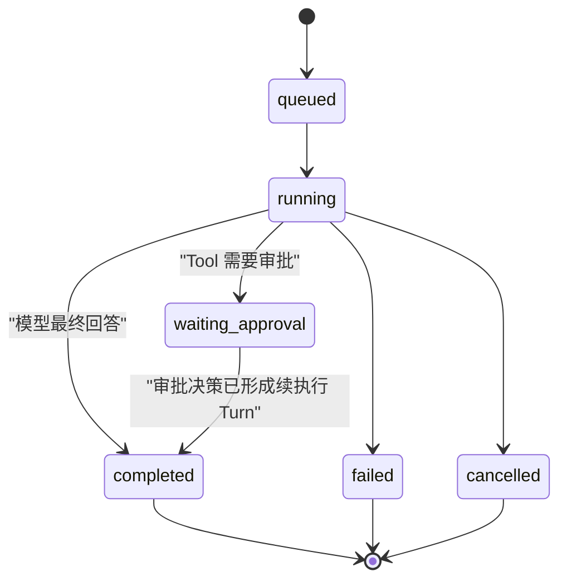

批准后创建 `inbound_event_id="approval:<id>"` 的子 Turn。子 Turn 不新增伪造的用户文本，而是加载原
Assistant Tool Call、已绑定 ToolRun 和审批决定。这样 CLI 与未来 IM 不需要保持原协程存活。

### 16.3 流式行为

- 模型最终答案才发送 `on_text`；Tool JSON 不流给用户。
- 进入审批时返回 Lobster0 生成的确定性短消息，包含 Approval ID、Tool 名和脱敏摘要。
- Tool 执行期间 CLI 可显示单行状态，但不把 stdout 实时透传；Phase 2 无 PTY。
- 审批续执行产生新的最终回答，作为子 Turn Assistant Message 保存。

## 17. 安全失败模式

| 场景 | 行为 | 是否重试 |
| --- | --- | --- |
| 未知 Tool | `tool_not_found` 回给模型 | 模型可换 Tool |
| 参数类型错误 | `invalid_arguments` | 模型可修正一次 |
| 路径逃逸/敏感路径 | hard deny + audit | 不重试 |
| allowlist 未命中且 ask=off | deny | 不重试 |
| 需要审批 | 持久化并结束 Turn | 等用户 |
| Approval 过期 | expired + ToolRun denied | 用户重新发起 |
| Approval 重复消费 | CLI 冲突错误 | 不执行 |
| Tool 超时 | failed/`tool_timeout` | 模型可换方案，不自动重跑副作用 |
| 进程取消/崩溃 | running -> interrupted | 不自动重放 |
| HTTP DNS 变化 | `ssrf_blocked` | 不回退到其他抓取器 |
| 结果过大 | 截断 + 本地结果文件 | 不重跑 |
| 数据库写入失败 | 不执行尚未开始的副作用 | 修复存储后重试整个用户动作 |

## 18. 审计事件

Phase 2 至少记录：

- `tool.requested`
- `tool.allowed`
- `tool.denied`
- `tool.started`
- `tool.succeeded`
- `tool.failed`
- `tool.interrupted`
- `approval.created`
- `approval.approved`
- `approval.denied`
- `approval.expired`
- `approval.consumed`
- `policy.rule_created`
- `policy.rule_revoked`

审计 metadata 只允许稳定、脱敏字段：tool name、risk、action、hash prefix、relative path、resolved program
basename、hostname、duration、error code。不得保存 write content、完整命令输出、URL query 或 Secret。

## 19. 目标文件布局

只在对应切片开始时创建文件，不先提交空目录。

```text
src/lobster0/
├── agent/
│   ├── runner.py              # 修改：ToolExecutor、待审批结果
│   ├── turn.py                # 修改：ToolContext、waiting/continuation
│   └── context.py             # 修改：有效 Tool Schema
├── tools/
│   ├── __init__.py
│   ├── base.py                # Tool 类型、结果与校验错误
│   ├── registry.py            # 名称注册和稳定 Schema
│   ├── executor.py            # 唯一安全执行入口
│   ├── system.py              # system_info
│   ├── filesystem.py          # read/write/edit
│   ├── search.py              # glob/grep
│   ├── command.py             # run_command
│   └── web.py                 # http_get
├── policy/
│   ├── __init__.py
│   ├── engine.py              # security × ask 决策
│   ├── workspace.py           # 路径与敏感文件
│   ├── command.py             # executable/argv 规则
│   ├── network.py             # URL/DNS/地址策略
│   └── approvals.py           # 参数绑定与续执行服务
├── storage/
│   └── tooling.py             # ToolRun/Approval/Policy/Audit Repository
├── config.py                  # 修改：tools 配置
├── bootstrap.py               # 修改：组装 Registry/Policy/Executor
└── cli.py                     # 修改：approvals 命令
```

测试按可观察行为组织，不按每个私有函数机械一一对应：

```text
tests/
├── test_tool_registry.py
├── test_tool_executor.py
├── test_system_info.py
├── test_workspace_policy.py
├── test_file_tools.py
├── test_search_tools.py
├── test_approvals.py
├── test_command_policy.py
├── test_run_command.py
├── test_network_policy.py
├── test_http_get.py
├── test_tool_turn.py
└── test_cli_approvals.py
```

## 20. 测试与安全矩阵

### 20.1 Contract 与 Registry

- Tool 名唯一、Schema 顺序稳定；
- Schema required 与运行时 validate 一致；
- 未启用/不可用 Tool 不进入模型请求；
- 未知 Tool 返回稳定错误；
- 所有模型可见结果都是合法 UTF-8 JSON；
- 超过结果上限时截断并写结果文件。

### 20.2 `system_info`

- macOS/Linux collector 使用 fake subprocess，不依赖测试机具体型号；
- 固定 argv，任何 section 输入都不能进入程序名或参数拼接；
- system_profiler 超时只让对应 section unavailable；
- 序列号、UUID、hostname、username、MAC、环境变量不出现在结果；
- 集成测试在当前机器只断言字段形状和上限，不断言具体硬件值。

### 20.3 Workspace

- 相对普通文件成功；
- `../`、绝对 Workspace 外路径失败；
- 目标 symlink 逃逸失败；
- 父目录 symlink 写逃逸失败；
- read-only root 可读不可写；
- Workspace 内 `.env`、`.ssh/id_rsa`、`credentials.json` 失败；
- 大文件、二进制、非法 UTF-8、权限错误返回稳定错误；
- 写入失败不留下半文件，覆盖使用原子替换。

### 20.4 Approval

- medium/high 未命中创建 pending；
- 哈希包含 Tool 名与规范参数；
- 参数键顺序不同但语义相同得到同一哈希；
- 任一参数变化导致哈希不匹配；
- 非 Owner 不能批准；
- 过期不能批准；
- 两个并发批准只有一个消费成功；
- 崩溃后 pending 仍可查询；
- consumed 不能重放；
- deny/expire 都不会执行 Tool；
- `--always` 不能为不安全 Tool 生成宽规则。

### 20.5 Command

- `program + args` 正常执行 allowlisted 只读命令；
- 不存在 `command` 字符串入口；
- Shell 包装器、inline eval、sudo、上传、删除、git push 硬拒绝；
- cwd 永远是 Workspace；
- 子进程看不到 `LOBSTER0_MODEL_API_KEY` 和测试 Secret；
- 超时终止整个子进程组；
- stdout/stderr 分离、上限有效；
- exact rule 不能匹配额外 argv；
- executable 解析失败和替换攻击失败关闭。

### 20.6 HTTP/SSRF

- HTTPS 公网地址成功；
- HTTP、URL credentials、非法 hostname、非允许端口失败；
- `127.0.0.1`、`::1`、RFC1918、link-local、metadata 地址失败；
- 公网首次解析、连接前变为内网时失败；
- 重定向到内网失败；
- 重定向超过 3 次失败；
- 响应超过 2 MiB 中止；
- 二进制 Content-Type 失败；
- 返回内容包含 `untrusted=true`；
- SSRF 拒绝后不走第三方 fallback。

### 20.7 Turn 集成

- Fake Provider 请求中包含有效 Schema；
- 模型调用 system_info 后收到 Tool Result 并生成最终回答；
- Policy deny 作为 Tool Result 回模型；
- require approval 使 Turn 进入 waiting，进程没有挂起协程；
- approve 创建 child Turn，只执行绑定 ToolRun；
- Provider 重试不重复 Tool；
- 多 Call 遇审批时后续 Call 不执行；
- loop limit、取消、数据库失败保持现有 Phase 1 语义。

## 21. 分切片实施与验收

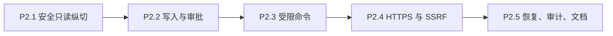

### P2.1：安全只读纵切

交付：Tool types、Registry、Executor、Policy 基线、Workspace Guard、Repository、`system_info`、
`read_file`、`glob`、`grep`、Runner/Turn/Context 接入。

验收：

- Fake Provider 完成完整 Tool Loop；
- 真实 DeepSeek 回答当前电脑配置；
- Workspace 安全矩阵通过；
- ToolRun、Tool Message、Audit 可查询；
- 不修改写入/命令/网络状态。

### P2.2：写入与审批

交付：`write_file`、`edit_file`、ApprovalService、CLI list/show/approve/deny、续执行 Turn。

验收：

- 新建、覆盖、编辑按风险生成审批；
- allow-once 只消费一次；
- deny、expire、hash mismatch 都不写文件；
- 进程重启后批准仍可续执行；
- 并发消费测试通过。

### P2.3：受限命令

交付：Command Policy、`run_command`、exact allowlist、环境清理、超时和输出上限。

验收：

- `git status --short` 可经审批执行；
- Shell 字符串、inline eval、删除、上传、提权、git push 均拒绝；
- API Key 不进入子进程；
- 超时没有遗留子进程。

### P2.4：HTTPS 与 SSRF

交付：Network Policy、pinned DNS transport、`http_get`、hostname rule。

验收：

- 公网 HTTPS 文本可获取；
- 本机、内网、metadata、DNS rebinding 和恶意 redirect 全部阻断；
- 外部内容标记为 untrusted；
- 无第三方抓取 fallback。

### P2.5：硬化与交付

交付：中断恢复、Approval 惰性过期、完整 Audit、Doctor 检查、模块工程文档、README/运行指南同步。

验收：

- 全量离线测试、Ruff、diff check 通过；
- `doctor` 能检查 Tool 配置、Workspace、可执行程序与 pending approval，不执行有副作用动作；
- 真实 DeepSeek 三个冒烟用例有手工记录；
- 所有 Phase 2 模块都有 `docs/engineering/phase-2/` 工程文档；
- 进度 HTML 同步为已验证的真实状态。

## 22. 本地调试场景

### 22.1 电脑配置

```bash
uv run lobster0 chat --message "帮我看看我的电脑是什么配置"
```

预期：模型调用 `system_info`，回答实际 OS、CPU、内存、存储和可获取的 GPU 信息；不包含序列号、UUID、
用户名和密钥。

### 22.2 Workspace 读取

```bash
uv run lobster0 chat --message "读一下 workspace 里的 README.md 并总结"
```

预期：自动调用 `read_file`；请求 `../.ssh/id_rsa` 或 `.env` 时被硬拒绝。

### 22.3 命令审批

```bash
uv run lobster0 chat --message "在 workspace 里运行 git status --short"
uv run lobster0 approvals list --status pending
uv run lobster0 approvals approve <ID>
```

预期：首次生成审批；批准后只执行原始 `git status --short`，任何新增参数都不能复用批准。

## 23. 工程文档交付清单

实现过程中每个模块都要生成“事实文档”，但只有代码和测试通过后才写成已实现：

| 文档 | 内容 |
| --- | --- |
| `phase-2/tool-contract.md` | Tool 类型、Schema、Validation、Result、错误码 |
| `phase-2/tool-registry-executor.md` | 注册、Schema 过滤、唯一执行路径、截断 |
| `phase-2/system-info.md` | macOS/Linux collector、脱敏、超时、字段 |
| `phase-2/workspace-policy.md` | 根、symlink、敏感路径、TOCTOU 边界 |
| `phase-2/20260808_filesystem-tools.md` | read/write/edit 的原子性和限制 |
| `phase-2/search-tools.md` | glob/grep 上限和二进制处理 |
| `phase-2/20260808_approval-lifecycle.md` | 参数哈希、状态机、事务、续执行 |
| `phase-2/20260808_command-execution.md` | argv、allowlist、环境、超时、禁止项 |
| `phase-2/http-and-ssrf.md` | DNS、IP、redirect、peer、响应限制 |
| `phase-2/turn-integration.md` | Runner、Turn、Tool Message、多 Call |
| `phase-2/20260808_cli-approvals.md` | 命令、退出码、JSON 输出、常见故障 |
| `phase-2/20260808_testing-and-debugging.md` | 离线 fake、安全矩阵、真实冒烟 |

## 24. 风险与缓解

| 风险 | 影响 | 缓解 |
| --- | --- | --- |
| LLM 生成危险参数 | 本机数据或进程风险 | 参数校验、硬禁止、Policy、审批四层防线 |
| 应用级路径检查有 TOCTOU | symlink 竞争逃逸 | 原子打开/替换、父链复核、Phase 7 再加 OS Sandbox |
| Allow-always 规则过宽 | 长期越权 | 只允许可证明窄化的 exact 规则 |
| 审批后参数被替换 | 执行非原动作 | canonical JSON + SHA-256 + 原子 consume |
| 崩溃后副作用不确定 | 重复写入或命令 | running -> interrupted，不自动重放 |
| HTTP DNS rebinding | 访问本机/内网 | 全地址检查、redirect 重检、pinned DNS/peer verification |
| Tool 输出注入模型 | 外部内容覆盖指令 | untrusted 标记、System Prompt 规则、结果上限 |
| 上游复制污染架构 | 复杂度和维护成本 | 文件级移植、行为测试先行、THIRD_PARTY_NOTICES |
| system_info 泄露设备身份 | 隐私风险 | 严格字段白名单与敏感字段测试 |

## 25. 明确推迟的能力

- OS Sandbox：Phase 7 部署硬化时加入；当 Lobster0 要执行任意用户脚本时提前。
- `allow-always` 的路径前缀和命令前缀：只有出现真实重复审批痛点并能安全归纳时加入。
- 删除/移动/目录管理 Tool：有真实文件管理需求后设计，不能借 `run_command` 绕过。
- 交互式 PTY/后台进程：出现编译、服务器或长期任务需求后单独设计进程生命周期。
- Memory Tool：Phase 3，必须带 Secret 过滤和来源追踪。
- 飞书审批卡片：Phase 4，复用 Phase 2 ApprovalService，不重写状态机。
- 多用户与 RBAC：不是 v1.0 目标。

## 26. 评审问题

评审本文时只需要确认以下产品选择：

1. 默认 `allowlist + on-miss`，只读安全 Tool 自动执行，写/网络/命令默认审批；
2. 审批结束当前 Turn，批准后创建持久化续执行 Turn，不挂起模型协程；
3. Phase 2 不支持任意 Shell 字符串、删除、上传、sudo 和 git push；
4. `system_info` 是 Phase 2 新增 Tool，Memory Tool 留在 Phase 3；
5. `--always` 只生成精确 hostname 或 exact command 规则，不为文件写入生成永久授权；
6. 按 P2.1 到 P2.5 依次开发，每个切片测试通过再进入下一个。

确认后，下一份文档将是逐任务 Implementation Plan，列出每个测试的 RED/GREEN 顺序、精确修改文件、
验证命令、提交边界和 Phase 2 工程文档同步点。
