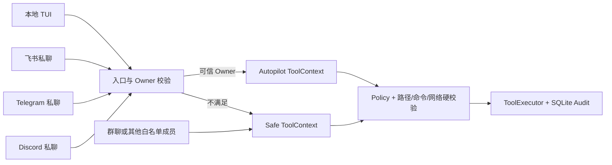

# Lobster0 Autopilot 权限模式与紧凑审批 UI 设计

> 状态：已确认，进入实现  
> 日期：2026-08-08  
> 参考：OpenClaw Exec Approvals、Hermes Agent Smart/YOLO Approvals

## 1. 目标

Lobster0 要让唯一 Owner 在本地 TUI、飞书私聊、Telegram 私聊和 Discord 私聊中使用同一个长期在线 Agent，并显著减少重复审批。

本设计同时解决两个问题：

1. 当前 pi-tui 审批框把完整 JSON 一次性展开，外层 `maxHeight` 只负责裁剪，导致长参数把底部按钮推到可视区域之外。
2. 当前 `security × ask` 只能控制 `run_command` 和 `http_get`，不能表达个人 Agent 需要的 `safe / smart / autopilot / yolo` 四档信任状态，写文件仍会反复审批。

## 2. 信任边界

完全自动化只授予经过强校验的 Owner 入口：

| 入口 | Owner 判定 | Autopilot |
|---|---|---:|
| 本地 pi-tui | 本机 Bridge 直接绑定 SQLite Owner | 是 |
| 飞书私聊 | `sender_open_id == owner_open_id` 且 `chat_type == p2p` | 是 |
| Telegram 私聊 | `user_id == owner_user_id` 且 private chat | 是 |
| Discord 私聊 | `author_id == owner_user_id` 且 DM | 是 |
| 群聊 / Guild / Topic | 即使消息来自 Owner，也视为较低信任入口 | 否 |
| 白名单中的其他成员 | 允许对话，但不继承 Owner 自动化权限 | 否 |

群聊和其他白名单成员仍可使用只读 Workspace 能力；Personal Profile 的额外全局读取根、写入根和自动执行能力不会进入其 `ToolContext`。



## 3. 四档权限模式

新增 `PermissionMode`：

| 模式 | 只读 Tool | `http_get` | `run_command` | 写文件 / 修改记忆 | 硬禁止规则 |
|---|---:|---:|---:|---:|---:|
| `safe` | 自动 | 规则命中自动，否则审批 | 规则命中自动，否则审批 | 审批 | 保留 |
| `smart` | 自动 | 通过 HTTPS/DNS 校验后自动 | 规则命中自动，否则审批 | 审批 | 保留 |
| `autopilot` | 自动 | 自动 | 自动 | 在允许写根内自动 | 保留 |
| `yolo` | 自动 | 自动 | 自动 | 在允许写根内自动 | 保留 |

当前十个内置 Tool 中，`autopilot` 与 `yolo` 的执行结果相同；两者仍作为不同的产品状态保留：

- `autopilot` 是个人 Agent 的推荐自动化模式。
- `yolo` 是显式 break-glass 状态，TUI 永久显示红色警告，便于未来接入更高风险 Tool 时保持兼容。
- 敏感路径、Workspace 逃逸、Shell 字符串执行、提权、硬禁止命令和危险网络目标在所有模式下都不能绕过。

`[tools].security` 与 `[tools].ask` 暂时保留，作为 `safe` 模式下对既有 exact command/network rule 的兼容配置；新配置使用 `mode` 作为主要入口。

```toml
[tools]
mode = "autopilot"
security = "allowlist"
ask = "on-miss"
approval_ttl_seconds = 600
```

为避免升级时静默扩权：

- 此条已被 2026-08-09 Owner 默认值决策取代：旧配置未写 `mode` 时按 `autopilot` 加载；显式 `safe`/`smart`
  继续保留审批，且群聊、其他用户与硬拒绝规则不变。
- `lobster0 init` 新生成的 Personal Profile 明确写入 `mode = "autopilot"`。
- 本机现有 Owner 配置只在这次用户明确授权后单独更新。

## 4. 动态切换与审计

Python Core 持有唯一进程级 `PermissionState`。TUI 和三个 Channel 共享它，因此切换后立即影响后续 Turn。

本地命令：

```text
/permissions
/permissions safe
/permissions smart
/permissions autopilot
/permissions yolo
```

约束：

- 运行中的 Turn 或待处理 Approval 存在时，Bridge 拒绝切换，避免同一 Turn 前后使用两个模式。
- Channel 只允许 Owner 私聊执行 `/permissions`；群聊或其他成员收到稳定拒绝提示，命令不进入模型。
- 每次模式变化写入 `audit_events`，只记录旧模式、新模式和入口类型，不记录平台 ID、消息正文或凭据。
- Tool 本身继续通过现有 `tool.started / tool.succeeded / tool.failed / tool.denied` 审计链记录。

## 5. 紧凑审批框

审批框不再把所有参数无限展开。组件每次 render 根据终端行数计算最大高度，并保持三段式布局：

```text
┌─ 审批 #7 · run_command ──────────────────────────┐
│ run lark-cli                                      │
│ 参数 1–5 / 18                  ↑↓ PgUp PgDn 滚动 │
│ {                                                  │
│   "program": "/usr/local/bin/lark-cli",          │
│   "args": [                                       │
│     "doc",                                        │
│     "list"                                        │
│                                                    │
│ 当前用户身份执行；可读取当前用户可访问的文件。     │
├────────────────────────────────────────────────────┤
│ [1 拒绝] [2 一次] [3 本次运行] [4 始终允许]        │
└────────────────────────────────────────────────────┘
```

交互：

- `↑/↓`：移动一行。
- `PageUp/PageDown`：移动一页。
- `Home/End`：首行/末行。
- `1/2/3/4`：沿用现有审批决定。
- `Esc`：拒绝。
- 头部、风险提示和按钮始终可见；只有参数区滚动。
- Overlay 宽度最多 84 列，高度最多 18 行；80×24 小终端仍显示完整按钮。

## 6. TUI 状态呈现

握手响应增加 `permission_mode`。Header 保持单行紧凑：

```text
Lobster0 0.1.0 · deepseek-v4-pro · 会话 default · 工作区 workspace · ⚡ AUTOPILOT
```

- `safe`：灰色 `SAFE`
- `smart`：绿色 `SMART`
- `autopilot`：琥珀色 `⚡ AUTOPILOT`
- `yolo`：红色 `⚠ YOLO`

`/status` 同时显示权限模式；`/help` 列出 `/permissions`。

## 7. 协议变更

NDJSON 继续使用 protocol v1，新增向后兼容请求类型：

```json
{"v":1,"id":"ui-7","type":"permissions.set","payload":{"mode":"autopilot"}}
```

响应：

```json
{"v":1,"id":"ui-7","type":"response.ok","payload":{"permission_mode":"autopilot"}}
```

旧客户端不会发送该请求，旧的 Turn、Approval 和 Session 帧保持不变。

## 8. 回归测试

Python：

- 四种模式对十个 Tool 风险级别的状态表。
- Autopilot 只对 `trusted_owner=True` 生效。
- 非 Owner、群聊和其他白名单成员不会获得 Personal read/write roots。
- TUI Bridge 切换模式、busy/pending fail-closed、握手返回当前模式。
- 三个平台 Owner 私聊切换成功；群聊和非 Owner 不进入模型。
- 模式变化产生脱敏审计记录。

TypeScript：

- 80×24、100×30、160×48 下审批框不超过预算，底部按钮可见。
- 100 行中文/JSON 参数可以按行、按页、首尾滚动。
- Core 只授权 `once/session/always` 中的哪些按钮，TUI 就只显示哪些。
- `/permissions` 请求、Header 状态、`/status` 与 `/help` 文案。
- 现有长文本粘贴、鼠标选择、流式渲染和审批续跑测试全部继续通过。

## 9. 不在本次范围

- 不把模式变化跨进程持久化回 `config.toml`；持久默认值仍由配置管理。
- 不用第二个模型判断命令风险；`smart` 使用确定性 Policy。
- 不取消路径、命令、网络、结果大小和超时硬边界。
- 不向未验证身份、群聊或 Webhook 开放 Autopilot。
