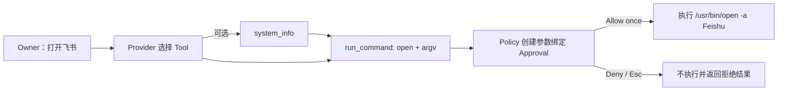

# Direct Application Launch 设计

## 目标

当 Owner 明确要求 MiniClaw 在本机执行一个可由现有 Tool 完成的动作时，Agent 不得直接声称“没有权限”。
以 macOS 的“打开飞书”为首个事故回归：模型可以先读取操作系统信息，但随后必须通过现有
`run_command` 请求执行 `open -a Feishu`，并在执行前进入参数绑定的 TUI Approval。

## 根因

`run_command` 的 Provider 可见描述只有“运行一个已批准 executable”，没有说明以下真实边界：

- 只能直接执行一个 executable 和独立的 argv，不能使用 Shell、管道或内联代码；
- 未命中规则并不等于 Tool 不可用，而是应先发起 Tool Call，再由 Policy 创建 Approval；
- macOS 打开应用应直接调用 `open -a <Application>`。

真实 DeepSeek planning probe 因此先调用了 `system_info`，随后错误地产生被 Policy 硬拒绝的
`bash -c`。截图中的另一次采样则直接口头拒绝，没有产生 Tool Call。

## 方案选择

采用最小方案：复用现有 `run_command`、Policy、Approval、Tool Executor 和 TUI Trace，只增强
Provider 可见的系统规则与 Tool description。

不采用以下方案：

- 不新增 `open_application` 第九个 Tool；现有 exact-argv 能安全表达该动作。
- 不在 Agent Core 中硬编码“飞书”或中文意图路由；这会把通用 Agent 退化成脆弱规则表。
- 不自动批准或直接执行桌面动作；用户仍需在 TUI 中 Allow once。

## 行为流程

## 安全边界

- `run_command` 仍不接受命令字符串，不经过 Shell。
- `bash`、`sh`、`zsh` 和内联执行开关仍为硬拒绝，不能审批。
- `open -a Feishu` 未命中 exact rule 时只能进入 waiting approval，批准前不得启动应用。
- Prompt 只解释已有能力，不绕过 Policy，也不承诺任意命令都可执行。

## 回归与验收

新增 `ACTION-OPEN-APP-001`，同时属于 `offline` 与 `live`：

- offline：脚本化 Provider 发出 `run_command(open, [-a, Feishu])`，断言只创建 waiting Approval；
- live planning：真实 DeepSeek 至少三次采样不得口头声称 Tool 不可用，不得生成 Shell/管道；
- TUI：显示 `run_command` 参数与 Approval，未批准前无外部副作用；
- full gate：全部 unittest、全部 active offline eval、Ruff、构建与真实 PTY smoke 通过。

live planning 只观察 Tool Call，不自动点击 Approval，因此不会在验证期间启动飞书。
