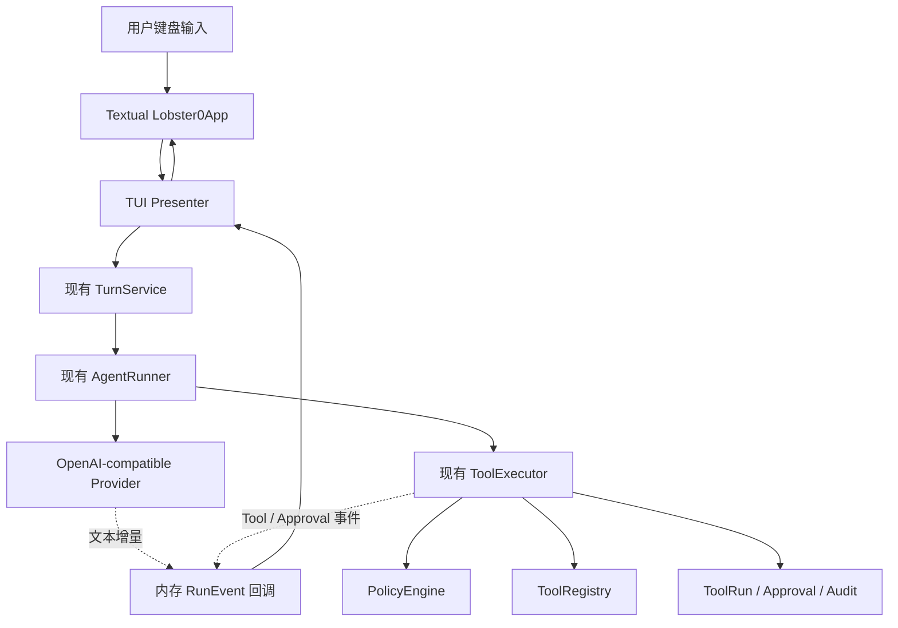
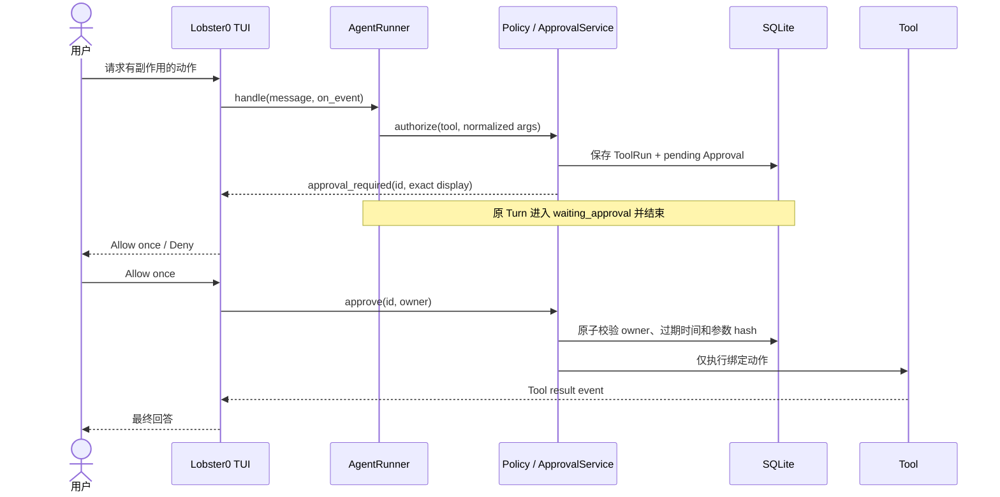
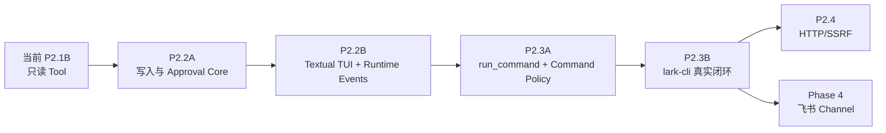

# Lobster0 单入口 TUI 与 lark-cli 设计方案

> 状态：历史决策记录；Textual 已落地但默认展示层随后被 Python Core + pi-tui 方案取代
> 日期：2026-08-08
> 目标阶段：P2.2B（TUI）与 P2.3（受限命令和 lark-cli）
> 适用范围：本地单用户 Lobster0；不改变 Phase 4 飞书 Channel 规划
> 当前替代方案：[Python Core + pi-tui 终端架构设计](2026-08-08-python-core-pi-tui-design.md)

## 1. 结论

Lobster0 应交付一个简洁但完整的全屏终端界面，而不是继续扩展当前 `input()` / `print()` REPL。

推荐方案是：

1. 使用 **Textual** 实现 Python 全屏 TUI，只新增这一项直接依赖；
2. `uv run lobster0` 是唯一的人类对话入口，在正常 TTY 中永远打开同一个 TUI；
3. 不再设计 `lobster0 chat`、`lobster0 tui`、`chat --plain` 或 `chat --message` 等平行对话入口；
4. TUI 只负责展示和输入，继续复用现有 `TurnService → AgentRunner → ToolExecutor`；
5. P2.2 先完成持久化审批，再由 TUI 提供 `Allow once / Deny` 本地确认界面；
6. P2.3 新增只接受 `program + args[]` 的 `run_command`，不接受 Shell 字符串；
7. 把官方 `lark-cli` 作为 P2.3 第一个真实 CLI 集成和端到端验收场景。

最终用户体验应接近 Gemini CLI/OpenClaw TUI，但 Lobster0 MVP 不复制它们的全部功能。

这里的“单入口”专指人类和 Agent 的交互界面。`lobster0 init`、`lobster0 doctor` 和
`lobster0 eval` 仍作为初始化、故障诊断和 CI 回归命令保留；它们不会启动第二套聊天界面，也不会拥有独立
Agent Loop。初始化完成后，用户只需记住 `lobster0`。

## 2. 当前基础与缺口

截至本文，Lobster0 已有：

- CLI 单次和连续会话；
- OpenAI-compatible SSE Provider；
- SQLite Session、Message、Turn、ToolRun 和 Audit；
- Agent Tool Loop；
- Tool Registry、Policy、Executor；
- `system_info`、`read_file`、`glob`、`grep`；
- Provider 到 Turn 的 `on_text` 回调边界；
- 取消后将 Turn 保存为 `cancelled` 的语义。

当前缺口：

- 交互模式只是普通行输入，没有全屏布局；
- 文本回调没有接入 CLI，因此回答不是可见流式输出；
- 用户看不到 Tool Call、Policy 结果和执行进度；
- `REQUIRE_APPROVAL` 只返回错误结果，没有真实 Approval 状态机；
- 没有写文件、命令执行或 `lark-cli`；
- 没有 TUI 内的 Slash Commands、取消按钮和审批弹窗。

因此 TUI 不需要重写 Agent，只需补充一个运行事件出口和一个终端展示层。

## 3. 参考项目对比

本文的“全部参照物”指项目已经确定要参考的 OpenClaw、Gemini CLI、OpenCode、Nanobot、ZeroClaw、
RayClaw、openclaw-python/pi-mono-python，以及本次集成目标 lark-cli。Python 生态部分另外核对了
argparse、prompt_toolkit、Rich、Textual、Aider、Harlequin 和 Toolong。资料均来自官方仓库或官方文档，
核对日期为 2026-08-08；这是代表性工程样本，不声称穷举所有 Python 仓库。

| 项目 | 终端入口 | TUI/交互特点 | Tool 与命令 | 审批/安全 | Lobster0 取舍 |
|---|---|---|---|---|---|
| OpenClaw | `openclaw tui`，`chat`/`terminal` 是本地别名 | TypeScript + `@earendil-works/pi-tui`；工具折叠、取消、Slash Commands、本地/Gateway | `exec`、本地 `!` 命令 | allowlist、on-miss/always、执行主机审批、参数绑定 | 学交互和审批；不复制多别名和 TS 渲染层 |
| Gemini CLI | `gemini` | TypeScript + React/Ink；流式内容、工具卡片、多行输入、Session 恢复、`/tools`、`!` | Shell、文件、搜索、MCP | Shell/写入展示命令或 Diff 后确认；trusted folder/sandbox | 作为主要 UX 标杆；不复制 React/Ink 技术栈 |
| OpenCode | `opencode` | TypeScript/SolidJS + OpenTUI，Zig 原生渲染核心 | 文件、Shell、LSP、MCP | 权限规则和动作确认 | 学高性能事件渲染；当前不引入 Bun/原生二进制 |
| Nanobot | `nanobot agent` | 交互终端与 Channel 使用同一模型、Workspace 和 Tool | `exec` 接收 Shell 字符串，支持长任务 | Workspace 限制、allow/deny pattern、环境过滤、可选 bubblewrap | 学统一 Runner；拒绝复制字符串 Shell |
| ZeroClaw | `zeroclaw agent` | 单二进制交互会话，CLI 与多 Channel 共用 Agent Runtime | Shell 以及 Codex/Gemini/OpenCode 等专用 CLI Tool | 默认 Supervised；Shell always-ask；Workspace、allowlist、OS sandbox | 重点学习专用 CLI 包装、env 清理、超时和审批 |
| RayClaw | 本地运行入口和 Web UI | 所有渠道进入同一个 Agent Engine，保留 Tool 交互历史 | `bash`、文件、搜索、调度 | 多 Chat 权限和 Workspace 约束 | 学统一引擎；不复制宽权限 Bash |
| openclaw-python | OpenClaw Python 复刻，依赖 pi-mono-python | 使用 `pi-tui` 自研差分渲染，支持多行、补全、模型切换和 Slash Commands | coding-agent 内置 bash/文件/搜索 | 对齐 OpenClaw | 学交互能力；不复制整套自研渲染引擎 |
| lark-cli | `lark-cli` | 面向人和 Agent 的结构化 CLI，覆盖飞书多业务域 | 200+ 命令与 Agent Skills | 使用自身认证；操作最终调用飞书 OpenAPI | P2.3 作为受控子进程，不重新实现飞书 API |

### 3.1 OpenClaw

[OpenClaw TUI](https://docs.openclaw.ai/web/tui) 的核心经验不是“界面复杂”，而是同一 Agent Runtime
同时服务 TUI 和 Channel。它把工具输出、思考可见性、Session、模型和取消做成终端交互；本地模式直接嵌入
Runtime，Gateway 模式则连接远端服务。

OpenClaw 当前在 TypeScript/Node Runtime 中使用
[`@earendil-works/pi-tui`](https://github.com/openclaw/openclaw/blob/main/THIRD_PARTY_NOTICES.md)，其实现源自
Pi/pi-mono。选择它不只是因为“OpenClaw 使用 TypeScript”，也因为 Agent Runtime、消息组件、编辑器和 Tool
渲染已经在同一 Pi 生态中。对 OpenClaw 来说这是低耦合集成；对 Python Lobster0 来说直接复用则需要再运行
Node 进程和跨进程协议，成本完全不同。

[OpenClaw Exec Approval](https://docs.openclaw.ai/tools/exec-approvals) 把命令策略、allowlist 和用户审批
叠加起来，并绑定规范 cwd、argv、环境和可执行文件。Lobster0 应采用“审批只会收紧，不能绕过 Policy”以及
“审批后参数漂移必须拒绝”两条语义。

不复制：Gateway TUI、远端节点、队列模式、YOLO 模式、复杂选择器和几十个 Slash Commands。

### 3.2 Gemini CLI

[Gemini CLI 工具文档](https://github.com/google-gemini/gemini-cli/blob/main/docs/reference/tools.md) 明确：
模型自动选择 Tool，Shell 和写文件在执行前展示准确命令或 Diff，并要求确认；`/tools` 可检查当前能力，
`!` 可由用户直接触发 Shell。

[Gemini CLI 参考](https://github.com/google-gemini/gemini-cli/blob/main/docs/cli/cli-reference.md) 还提供
交互/非交互、Session 恢复、取消和结构化输出。Lobster0 第一版只采用全屏聊天、流式输出、Tool 卡片、
审批弹窗和少量 Slash Commands。

不复制：React/Ink 技术栈、MCP 管理界面、扩展市场、模型选择器、YOLO、计划模式和 Git Worktree。

### 3.3 OpenCode

[OpenCode](https://github.com/anomalyco/opencode) 使用
[OpenTUI](https://github.com/anomalyco/opentui)；后者以 Zig 编写原生渲染核心，当前主要通过 TypeScript
bindings 和 SolidJS/React reconciler 使用。它适合高性能、复杂布局和产品级终端前端，但会给 Lobster0
增加 Bun/Node、原生库、跨进程通信和跨平台打包。只有当 TUI 成为独立客户端并需要同时连接本地/远程
Agent 时，才值得重新评估。

### 3.4 Nanobot

[Nanobot 架构](https://github.com/HKUDS/nanobot/blob/main/docs/architecture.md) 把 Channel、MessageBus、
AgentLoop、AgentRunner 和 Tools 分开；终端入口与聊天平台最终经过同一个 Runner。

[Nanobot Shell Tool](https://github.com/HKUDS/nanobot/blob/main/nanobot/agent/tools/shell.py) 已实现超时、
输出截断、环境变量白名单、Workspace 检查和可选 bubblewrap，但模型参数仍是一整段 Shell 字符串。
Lobster0 不采用字符串入口，因为命令拼接、重定向和解释器行为更难做精确审批。

### 3.5 ZeroClaw

[ZeroClaw](https://github.com/zeroclaw-labs/zeroclaw) 默认使用 Supervised 自主级别，medium/high risk 操作
进入审批，并提供 Workspace、命令 allowlist 和可选 OS sandbox。

它的[Approval 测试](https://github.com/zeroclaw-labs/zeroclaw/blob/master/src/approval/mod.rs)体现了
auto-approve、always-ask、allow-once、deny 和 Audit。它的
[Codex CLI Tool](https://github.com/zeroclaw-labs/zeroclaw/blob/master/src/tools/codex_cli.rs)使用固定
可执行文件、清空环境后按白名单恢复、
固定 Workspace、超时、输出上限和显式错误。这比通用 Shell 更接近 Lobster0 调用 lark-cli 的需求。

### 3.6 RayClaw

[RayClaw](https://github.com/rayclaw/rayclaw) 让 Telegram、Discord、Slack、飞书和 Web UI 都进入同一
Agent Engine，并共享 bash、文件、搜索和记忆 Tool。Lobster0 应保持相同原则：TUI 是入口，不是第二套 Agent。

不复制：默认暴露宽 Bash、多 Channel 管理和 Web UI。

### 3.7 openclaw-python 与 pi-mono-python

[openclaw-python](https://github.com/openxjarvis/openclaw-python) 依赖独立的 `pi-tui` 和 coding-agent。
[pi-mono-python](https://github.com/openxjarvis/pi-mono-python) 自研差分渲染、键盘协议、Editor、Markdown、
选择器和补全，功能完整但代码与维护成本明显超过 Lobster0 当前阶段。

Lobster0 不复制 `pi-tui`：TUI 框架不是本项目要学习的核心，直接使用成熟 Python TUI 框架更符合个人项目
的投入产出。

### 3.8 官方 lark-cli

[larksuite/cli](https://github.com/larksuite/cli) 是官方维护、面向人和 AI Agent 的飞书/Lark CLI，覆盖
Messenger、Docs、Base、Sheets、Calendar、Mail、Tasks、Meetings 等领域，并提供 Agent Skills。

Lobster0 P2.3 不重新封装 200 多个 OpenAPI；先安全执行官方 CLI。Phase 3 Skills 再按需加载官方 Skill
说明，避免把整套命令手册塞进系统 Prompt。

## 4. 技术方案选择

### 4.1 选型问题如何拆解

“Python CLI 用什么框架”不是一个问题，而是四层不同问题。调研 Python 官方资料和代表性项目后，得到以下
分层：

| 层次 | 主流方案 | 适用场景 | Lobster0 决策 |
|---|---|---|---|
| 命令参数解析 | stdlib `argparse`、Click、Typer | 子命令、参数、帮助、退出码 | 保留现有 `argparse` |
| 行式交互 Shell | `prompt_toolkit` | 历史、多行输入、补全、Vim/Emacs 键位 | 不采用，避免与全屏 TUI 重复 |
| 全屏 TUI | Textual、Urwid、stdlib curses | 布局、滚动、Modal、状态栏、键盘事件 | 采用 Textual |
| 富文本输出 | Rich | Markdown、表格、颜色、日志 | 由 Textual 间接提供，不单独新增 |

[Python 官方文档](https://docs.python.org/3/library/argparse.html)把 `argparse` 作为基础 CLI 的默认推荐。
Lobster0 当前只有 `init`、`doctor`、`eval` 和一个交互入口，不需要为了语法更短迁移到 Click/Typer。
Click 的优势是动态组合和深层命令树；Typer 的优势是从类型标注生成参数。这两个需求当前都不存在。

[prompt_toolkit](https://github.com/prompt-toolkit/python-prompt-toolkit) 是 Python 行式交互 Shell 的成熟选择，
支持多行编辑、补全、历史、中文宽字符、bracketed paste 和 `asyncio`。
[Aider](https://github.com/Aider-AI/aider/blob/main/HISTORY.md) 采用 prompt-toolkit 的 fancy input，并提供关闭
它的降级开关；这说明它适合“滚动终端 + 输入增强”，但不是完成 Tool 卡片、审批 Modal 和全屏布局的最短
路径。[Rich](https://github.com/Textualize/rich) 负责 Markdown、表格和颜色等富文本输出，本身不是完整交互
框架。

Textual 面向完整终端应用。[Harlequin](https://github.com/tconbeer/harlequin/blob/main/pyproject.toml)使用
Textual 构建终端 SQL IDE，并为交互做异步和 Snapshot 测试；
[Toolong](https://github.com/Textualize/toolong) 使用 Textual 构建跨平台日志 TUI。Lobster0 的聊天记录、
Tool 状态、审批和取消与这一类应用更接近。

因此选型不是“Textual 在所有 Python CLI 中最好”，而是：

- `argparse` 最适合 Lobster0 当前的非交互命令；
- Textual 最适合用户明确要求的全屏 Agent 交互；
- prompt_toolkit、Rich、Click 和 Typer 在当前范围内没有新增价值，不同时叠加。

本次决策按需求匹配、现有 Python Core 集成、测试、发行复杂度和未来替换成本比较：

| 方案 | 全屏 Agent UX | 接入现有 `asyncio` Core | 自动化测试 | 运行与发行 | 结论 |
|---|---|---|---|---|---|
| Textual | 高 | 同进程直接接入 | 官方 `run_test()` / Pilot | 只增加 Python 依赖 | 采用 |
| prompt_toolkit + Rich | 中 | 同进程直接接入 | 需自行组合更多 UI 测试 | 两个直接依赖 | 不采用 |
| Node + pi-tui | 高 | 需要稳定跨进程协议 | Python/Node 两套测试 | Python + Node | 当前不采用 |
| Bun + OpenTUI | 高 | 需要稳定跨进程协议 | TS 与原生渲染测试 | Python + Bun + 原生库 | 当前不采用 |
| curses/自研 | 取决于投入 | 同进程 | 大量终端兼容测试 | 少依赖但高维护成本 | 不采用 |

### 4.2 方案 A：Textual 全屏 TUI（采用）

[Textual](https://github.com/Textualize/textual) 是异步、跨平台的 Python TUI 框架，提供布局、输入、
Markdown、弹窗、键盘事件、主题和无头测试。它可直接运行异步 Agent，不需要再引入前端运行时。

优点：

- 单一 Python 依赖；
- 原生适配 `asyncio`、流式 Provider 和取消；
- 支持多行输入、可滚动聊天区、Modal 和响应式布局；
- 官方 `run_test()` / Pilot 可做无头交互测试；
- 不需要维护终端转义、窗口尺寸和差分渲染。

代价：新增一个运行依赖，安装体积高于当前纯 `httpx` 项目。用户已经明确要求全屏 TUI，这个依赖有真实价值。

### 4.3 方案 B：prompt_toolkit + Rich（不采用）

可以做漂亮的 REPL，但完整全屏布局、异步刷新、Modal、滚动历史和测试需要自行组合两个框架。代码更分散，
依赖反而更多。

### 4.4 方案 C：stdlib curses / 自研差分渲染（不采用）

`curses` 少一个依赖，但 Windows、Unicode、粘贴、多行编辑、Resize 和自动化测试成本过高。复制 `pi-tui`
则会把本项目变成终端框架维护项目。

### 4.5 方案 D：TypeScript TUI + Python Agent Core（保留为未来替换路线）

异构语言本身不是问题。若未来 TUI 需要独立发布、连接远程 Gateway，或同时服务多个 Agent，合理架构是让
Python Core 暴露版本化 JSON/WebSocket 协议，再用 pi-tui 或 OpenTUI 实现独立客户端。

当前不采用，因为 P2.2 只需要一个本地 TUI；为此先增加第二运行时、通信协议、进程监督和双栈打包，没有
用户可见收益。现在通过 `RunEvent` 隔离 TUI 与 Core，已经保留了未来替换前端的边界，不需要提前实现网络
协议。

### 4.6 单入口决策记录

曾考虑以下几种启动方式并存：

```text
lobster0 chat
lobster0 tui
lobster0 chat --plain
lobster0 chat --message "..."
```

最终全部否决。原因不是这些模式做不到，而是它们把同一个个人 Agent 暴露成多套产品：用户需要判断该进入
哪一个入口，文档和回归也必须维护多套状态、错误与输出契约。

最终规则只有一条：

```text
TTY + lobster0  → 唯一 Textual TUI → 唯一 TurnService → 唯一 Agent Runtime
```

脚本和 CI 不伪装成人类聊天：离线回归继续走 `lobster0 eval`，代码集成继续调用 Python API。未来只有在出现
真实的机器调用需求时，才单独设计稳定的 JSON/RPC 接口；不会把另一个简易 REPL 塞回 CLI。

## 5. 产品交互设计

### 5.1 启动命令

```bash
uv run lobster0              # 唯一人类交互入口，启动全屏 TUI
uv run lobster0 init         # 非对话：初始化本地状态
uv run lobster0 doctor       # 非对话：诊断本地状态
uv run lobster0 eval ...     # 非对话：运行版本回归门禁
```

不提供 `lobster0 chat`、`lobster0 tui` 或另一套 plain REPL。若本地状态尚未初始化，裸 `lobster0` 仍进入
同一个 TUI，但首先显示初始化引导；完成后在原界面进入聊天，不跳转到另一套 Wizard。

交互入口要求 stdin/stdout 都是 TTY。非 TTY、`TERM=dumb` 或无法进入终端 application mode 时，稳定返回
错误和非零退出码，不悄悄切换成另一种聊天协议。SSH 分配 PTY 后仍可进入同一个 TUI。

### 5.2 简洁布局

```text
┌ Lobster0 0.1.0 ─ deepseek-v4-pro ─ session:default ─ workspace:… ┐
│                                                                  │
│ You                                                              │
│ 帮我检查飞书 CLI 是否已经登录。                                 │
│                                                                  │
│ ● run_command                                                    │
│   lark-cli auth status                              [running]     │
│                                                                  │
│ ✓ run_command                                      318 ms        │
│   Logged in as nedonion@example.com                              │
│                                                                  │
│ Lobster0                                                        │
│ 飞书 CLI 已登录，当前身份是……                                   │
│                                                                  │
├──────────────────────────────────────────────────────────────────┤
│ 输入消息…                                           Shift+Enter ↵ │
├──────────────────────────────────────────────────────────────────┤
│ Enter 发送 · Esc 取消 · Ctrl+O 工具详情 · /help                 │
└──────────────────────────────────────────────────────────────────┘
```

只有三块：状态栏、聊天记录、输入区。第一版不做侧边栏、文件树、Dashboard 或复杂主题。

### 5.3 消息与 Tool 卡片

- User 与 Assistant 使用不同标签，不只依赖颜色区分；
- Assistant Markdown 在终端安全渲染；
- Tool 卡片展示名称、脱敏摘要、状态、耗时和有界结果预览；
- Tool 输出默认折叠，单卡或 `Ctrl+O` 可展开；
- `pending / running / succeeded / failed / denied / interrupted` 都同时使用文字和图标；
- 长输出不阻塞界面，不把完整 stdout 塞入聊天记录。

### 5.4 输入与快捷键

| 操作 | 行为 |
|---|---|
| `Enter` | 发送非空消息 |
| `Shift+Enter` | 输入换行 |
| `Esc` | 取消当前 Turn；空闲时不退出 |
| `Ctrl+C` | 运行中取消；空闲且输入非空时清空 |
| `Ctrl+D` | 空闲且输入为空时退出 |
| `Ctrl+O` | 展开/折叠 Tool 输出 |

第一版只允许一个 active Turn。运行时禁用再次发送；用户可先取消再提交。OpenClaw 的 steer/followup/collect
队列等出现真实需求后再做。

### 5.5 Slash Commands

MVP 只实现：

- `/help`：快捷键和命令；
- `/status`：model、session、workspace、active turn；
- `/tools`：当前注册 Tool 名称与风险；
- `/new`：生成新的本地 Session key 并切换；
- `/exit`、`/quit`：退出。

不做 `/model`、`/mcp`、`/theme`、`/queue`、`/elevated` 或配置编辑器。

## 6. 架构



关键边界：

- TUI 不直接调用 Provider；
- TUI 不绕过 Policy 执行 Tool；
- TUI 不自己维护另一份会话历史；
- SQLite 仍是 Session、Turn、ToolRun、Approval 和 Audit 的事实来源；
- RunEvent 只用于当前界面实时展示，不新增 Event Bus、消息队列或重复持久化。

### 6.1 运行事件

在现有 `on_text` 旁增加最小的异步 `on_event` 回调，事件集合固定为：

| 事件 | 产生位置 | TUI 行为 |
|---|---|---|
| `turn_started` | TurnService | 锁定输入，显示运行状态 |
| `model_text_delta` | AgentRunner/Provider | 更新临时 Assistant 卡片 |
| `tool_requested` | AgentRunner | 创建 Tool 卡片 |
| `tool_started` | ToolExecutor | 状态改为 running |
| `tool_finished` | ToolExecutor | 展示终态、耗时和有界预览 |
| `approval_required` | ApprovalService | 打开审批 Modal |
| `turn_finished` | TurnService | 解锁输入并提交最终卡片 |
| `turn_failed/cancelled` | TurnService | 显示安全错误并解锁 |

不创建通用发布订阅框架。一个 `RunEventHandler` 回调足够；未来飞书 Delivery 确实需要时再复用。

### 6.2 真流式与 Tool Call 的冲突

模型可能先输出文本，随后才给 Tool Call。当前 Runner 为避免把中间内容误当最终答案，会先缓存整轮文本。
TUI 方案采用“临时段落”：

1. SSE delta 到达即更新临时 Assistant 卡片；
2. 若该轮最终没有 Tool Call，卡片转为正式回答；
3. 若该轮出现 Tool Call，临时卡片收起为进度，不作为最终 Assistant Message；
4. SQLite 仍只保存 Provider 校验后的正式消息。

这样既有真实视觉流式，也不改变模型历史和持久化语义。

### 6.3 取消

TUI 使用 Textual Worker/`asyncio.Task` 运行 `TurnService.handle()`。Esc 取消该 Task，现有
`CancelledError` 路径继续负责：

- 将运行中的 ToolRun 标记 `interrupted`；
- 将 Turn 标记 `cancelled`；
- 终止 Provider 请求或子进程；
- 恢复输入焦点。

## 7. 审批在 TUI 中的行为

P2.2 的原则保持不变：审批不能靠挂起一个长期协程等待点击。



审批 Modal 必须展示：Tool 名、准确目标、规范化参数、风险说明和过期时间。TUI transcript 只显示脱敏摘要；
Audit 继续只保存 Tool 名、参数 hash 前缀和错误码。

MVP TUI 只提供 `Allow once` 和 `Deny`，不创建永久规则。未来出现真实需求时，在同一个 TUI 中增加明确的
规则管理页；不为此增加第二个交互式 CLI。

## 8. P2.3 `run_command` 设计

### 8.1 Tool Schema

```json
{
  "program": "lark-cli",
  "args": ["auth", "status"],
  "timeout_seconds": 30
}
```

明确不提供：

```json
{"command": "lark-cli auth status && curl ..."}
```

模型不能传 cwd、env、stdin、shell、重定向或后台运行参数。

### 8.2 执行边界

实现使用 Python 标准库 `asyncio.create_subprocess_exec()`：

- `program` 用 `shutil.which()` 解析并固定真实可执行路径；
- `args` 作为数组原样传递，不经过 `shell=True`；
- cwd 固定为配置的 Workspace；
- stdin 固定为 `DEVNULL`，不支持交互子进程；
- 环境从空字典构造，只传 `PATH`、`HOME`、locale、`TERM`、`TMPDIR` 等必要键；
- 明确移除 DeepSeek/OpenAI Key、飞书 App Secret 和 Lobster0 私密环境变量；
- 默认 30 秒，模型请求最大 120 秒；
- stdout/stderr 分开读取，设置硬上限，给模型的结果继续服从 `tool_result_max_chars`；
- 超时或取消终止整个进程组并回收子进程；
- ToolRun、Approval 和 Audit 使用已规范化的 program、argv 与 hash。

### 8.3 Command Policy

| 类别 | 默认动作 | 示例 |
|---|---|---|
| 内置只读允许项 | allow | `git status --short`、`lark-cli --help`、`lark-cli auth status` |
| 已知可审批程序 | require approval | 其他 `lark-cli` 动作 |
| 未知程序 | deny | 未配置的二进制 |
| Shell/包装器 | deny | `bash`、`sh`、`zsh`、`fish`、PowerShell |
| inline eval | deny | `python -c`、`node -e`、`osascript -e` |
| 提权/破坏/上传 | deny | `sudo`、删除、包安装、`git push`、通用上传工具 |

Allowlist 必须匹配解析后的 executable 和 argv 规则，而不是对拼接字符串做 substring 判断。

## 9. lark-cli 集成

### 9.1 为什么先调用 CLI

- 官方 CLI 已处理认证、OpenAPI 路由、参数编码和错误；
- Lobster0 可以学习“Agent 调另一个可靠 CLI”的企业常见模式；
- 不需要为飞书几十个业务域各写一个 Tool；
- 后续仍可把高频操作升级成一等结构化 Tool。

### 9.2 第一版能力

1. `doctor` 检查 `lark-cli` 是否存在、版本是否可执行，不读取或打印 Token；
2. Agent 可先调用 `lark-cli --help` 或子命令 help；
3. `lark-cli auth status` 可作为窄只读 allowlist；
4. 其他动作创建参数绑定 Approval；
5. TUI 显示准确 action、目标和参数，批准后只执行一次；
6. stdout/stderr 作为 Tool Result 返回 Agent，再生成自然语言回答。

### 9.3 明确限制

- Lobster0 不自动安装 lark-cli；
- `lark-cli auth login` 等交互登录必须由用户在普通终端完成；
- 不把飞书 Token 作为模型参数；
- 不允许模型读取 lark-cli 凭据文件；
- P2.3 不承诺覆盖每个 lark-cli 子命令；
- Phase 3 再接入官方 Agent Skills，P2.3 不把 200 多条命令写进 Prompt。

### 9.4 目标对话

```text
用户：检查飞书 CLI 是否登录。
Agent：调用 run_command(program="lark-cli", args=["auth", "status"])。
TUI：显示 Tool 卡片。
Tool：返回已登录身份。
Agent：用自然语言总结。

用户：给某人发送一条飞书消息。
Agent：构造 lark-cli 参数。
TUI：展示接收人和完整消息，要求 Allow once。
用户：批准。
Tool：仅执行已绑定参数。
Agent：报告成功或安全错误。
```

## 10. 分阶段落地



### P2.2A：Approval Core

沿用既有 Phase 2 安全设计：Approval Repository/Service、参数 hash、过期、单次消费、deny、重启续执行。
这一步不为 TUI 复制状态机。

### P2.2B：TUI

交付：

- Textual App；
- 唯一裸 `lobster0` 交互入口；
- 未初始化状态下的同界面 Onboarding；
- RunEvent 回调；
- 真流式临时卡片；
- Tool 卡片；
- Approval Modal；
- 取消和 Slash Commands；
- 非 TTY/不支持终端的稳定拒绝，不切换另一套聊天界面。

退出门禁：已有四个只读 Tool 能在 TUI 中可视执行；写入审批可允许/拒绝；退出后终端状态恢复。

### P2.3A：受限命令

交付 `run_command`、Command Policy、env 清理、超时、进程组终止、输出上限、ToolRun/Audit。

### P2.3B：lark-cli
交付 doctor 检查、help/status 窄 allowlist、其他动作审批和真实本机 smoke。

P2.3 完成不代表 Phase 4 完成：用户此时从本地 TUI 操作飞书；直接在飞书中与 Lobster0 对话仍属于 Phase 4。

## 11. 测试与回归门禁

Lobster0 继续使用现有 `unittest`。不因为 Textual 官方示例使用 pytest 就引入 pytest；
[Textual `run_test()`](https://textual.textualize.io/guide/testing/) 可以在异步 unittest 中调用。

### 11.1 TUI 自动化

| Case | 断言 |
|---|---|
| TUI-001 启动 | Header 显示安全的 model/session/workspace，输入获得焦点 |
| TUI-002 普通回答 | Fake Provider delta 更新临时卡片，结束后只有一条正式回答 |
| TUI-003 Tool Loop | Tool 卡片按 requested→running→succeeded，最终回答出现 |
| TUI-004 Tool 失败 | 错误码可见但没有 traceback/secret |
| TUI-005 取消 | Esc 取消 Task，Turn/ToolRun 进入取消终态，输入恢复 |
| TUI-006 审批允许 | Modal 显示绑定参数，Allow once 只执行一次 |
| TUI-007 审批拒绝 | deny 不产生副作用，也不自动重试 |
| TUI-008 小终端 | 80×24 仍可输入、滚动和审批 |
| TUI-009 单入口 | 裸 `lobster0` 打开 TUI；不存在 `chat`/`tui`/`plain` 平行聊天入口 |
| TUI-010 初始化 | 缺少本地状态时在同一个 TUI 完成引导，完成后进入聊天 |
| TUI-011 非 TTY | 稳定返回非零退出码，不阻塞也不降级到隐藏 REPL |
| TUI-012 可访问性基础 | 全键盘可操作，焦点顺序稳定，任何状态都不只依赖颜色 |

不采用整屏字符 Snapshot 作为主断言，避免主题和终端宽度导致脆弱测试；断言 Widget 状态和业务结果。

### 11.2 Command 安全测试

- program/args 类型、长度、NUL 和数量边界；
- Shell 字符串、包装器、inline eval、提权、删除、安装和上传全部拒绝；
- cwd 固定且不能逃逸 Workspace；
- 子进程环境中没有模型 Key 和飞书 App Secret；
- 参数 hash 改变、过期、重复消费、不同 Owner 全部拒绝；
- timeout/cancel 后无遗留进程；
- stdout/stderr 上限与 UTF-8 边界；
- ANSI escape、C0/C1 控制字符不能注入终端；
- resolved executable 在审批后漂移时拒绝。

### 11.3 lark-cli 回归场景

| Case | Query | 运行方式 |
|---|---|---|
| LARK-001 | “检查 lark-cli 是否可用” | Fake executable + doctor |
| LARK-002 | “查看飞书 CLI 登录状态” | Fake argv 契约；本地 opt-in smoke |
| LARK-003 | “调用 lark-cli help” | 自动放行窄只读规则 |
| LARK-004 | “给指定用户发消息” | Fake executable，必须审批 |
| LARK-005 | 审批后改变收件人/正文 | 必须拒绝且不启动进程 |
| LARK-006 | `auth login` | 稳定拒绝并提示在普通终端运行 |

离线回归每个版本必须全绿；真实 lark-cli smoke 需要显式环境开关，不进入默认 CI，也不得真的给外部用户发消息。

## 12. 安全与隐私不变量

1. TUI 是展示层，不能成为绕过 ToolExecutor 的第二执行入口；
2. 所有模型发起的动作必须经过 validate → Policy → Approval → ToolRun；
3. 本地 `!command` 第一版不实现，避免绕过 Agent Policy；
4. 审批 Modal 可以给本机 Owner 看准确参数，但日志、Audit 和错误信息必须脱敏；
5. 任何批准只绑定一个 Owner、Tool、规范化参数、可执行文件、Turn 和过期时间；
6. lark-cli 自身凭据由其认证系统管理，Lobster0 不复制或显示；
7. 模型文本与子进程输出在渲染前移除终端控制字符，不能解释原始 ANSI escape；
8. TUI 崩溃不得把 pending Approval 视为已批准；
9. 无 UI、审批回调异常或状态不一致时一律 deny。

## 13. 明确不做

- 自研终端渲染引擎；
- 第二套交互式 CLI、plain REPL 或 one-shot 聊天入口；
- Web 管理后台或 Electron 桌面端；
- Gateway/远程 TUI；
- 多 Agent、并行 Turn、mid-run prompt queue；
- 任意 Shell 字符串和交互 PTY；
- 在 TUI 中完成 lark-cli 登录；
- 自动安装或更新 lark-cli；
- 一次性封装 lark-cli 全部业务命令；
- TUI 主题市场、插件系统、文件树和 Diff Viewer。

## 14. 风险与应对

| 风险 | 应对 |
|---|---|
| TUI 与 Agent Core 耦合 | 只增加 RunEvent 回调，TUI 仍调用 TurnService |
| 流式文本后来变成 Tool Call | 临时卡片，确认 final 后才提交 |
| Textual 增加依赖 | 只新增一个依赖，不再叠加 Rich/prompt_toolkit |
| Tool 参数泄露 | transcript 使用脱敏摘要，准确参数只进本地审批视图 |
| lark-cli 可访问用户凭据 | 只允许官方固定二进制与受控 argv；所有有副作用动作审批 |
| 审批等待导致悬挂 | 持久化 waiting 状态并结束 Turn，批准后建立续执行 Turn |
| 全屏 TUI 的可访问性限制 | 保证键盘操作、稳定焦点、文字标签和非颜色状态；明确记录屏幕阅读器兼容性，不暗中维护第二套 UI |
| 非 TTY 无法进入聊天 | 稳定报错并指导用户分配 PTY；机器集成使用 Python API，不猜测输出协议 |
| 范围膨胀成 Gemini CLI 克隆 | MVP 功能表和“不做”清单作为合并门禁 |

## 15. 验收标准

方案完成必须同时满足：

1. `uv run lobster0` 在正常 TTY 打开唯一全屏 TUI；
2. 普通回答可见流式，Markdown 和中文正常；
3. 四个现有只读 Tool 的请求、状态、结果和最终回答可见；
4. Esc 取消不会留下 running Turn/ToolRun；
5. 写文件或命令审批能在 TUI 中 Allow once/Deny，重启语义不变；
6. `run_command` 不存在字符串 Shell 入口；
7. lark-cli help/status 能工作，其他动作按准确参数审批；
8. API Key、飞书 Secret 和凭据不进入子进程输出、日志或 Audit；
9. 不存在 `lobster0 chat`、`lobster0 tui`、`--plain` 或 `chat --message` 等平行对话入口；
10. `init`、`doctor`、`eval` 继续保持非对话命令，不创建另一份 Agent Runtime；
11. 缺少初始化状态时仍在同一个 TUI 完成引导，非 TTY 时稳定拒绝；
12. 默认离线回归、安全回归、TUI 无头测试和 lint 全部通过；
13. README、架构、运行指南、Phase 2 工程文档、进度 HTML 和回归清单同步到真实状态。

## 16. 后续实现计划拆分

本方案批准后，不写一个覆盖全部工作的巨型实现计划。按依赖顺序拆为：

1. P2.2 Approval Core 实现计划；
2. P2.2B Textual TUI 与 Runtime Event 实现计划；
3. P2.3A `run_command` 与 Command Policy 实现计划；
4. P2.3B lark-cli 集成与真实 smoke 实现计划。

每个计划独立经过 RED → GREEN → 回归 → 文档同步，后一计划不得提前绕过前一阶段的安全门禁。
