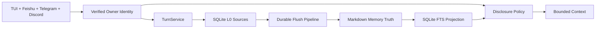
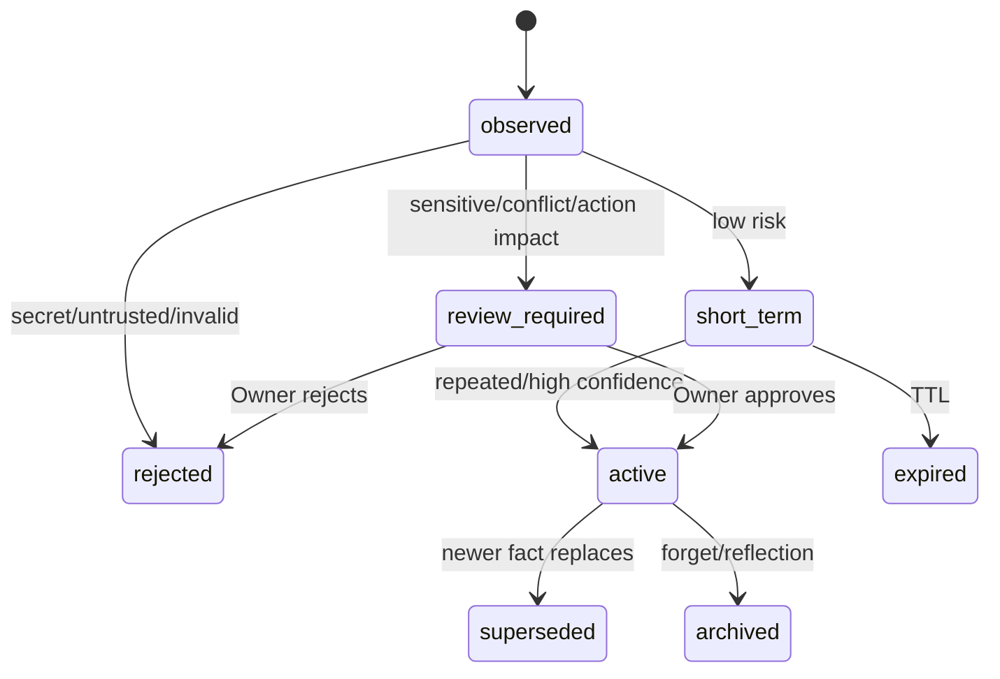

# Memory Autopilot Design

> Date: 2026-08-08
> Status: **APPROVED DESIGN / PLANNED / NOT IMPLEMENTED**
> Approved direction: automatic capture and low-risk promotion, explicit remember without a second approval, mandatory review for sensitive/conflicting/action-changing memory, credential rejection, automatic Markdown flush.

## 1. Problem

MiniClaw currently injects `MEMORY.md` and recent daily files into every Turn, but it only writes a daily entry after the Owner explicitly requests memory and approves `propose_memory`. Raw messages are stored per Session and are not searched across Sessions. A new Feishu Session therefore cannot recall a fact mentioned only in a CLI Session.

The design must give one verified Owner a continuous identity across local TUI, Feishu, Telegram and Discord without exposing private memory in groups or to other users.

## 2. Approved Product Semantics

1. Completed trusted conversations are durably captured as L0 evidence.
2. Background extraction proposes atomic L1 Memory Units.
3. Low-risk facts may enter short-term memory automatically.
4. Repeated, high-confidence, ordinary facts may be promoted automatically.
5. An explicit Owner instruction such as “记住……” is itself authorization and persists immediately; no redundant approval is shown.
6. Sensitive facts, conflicts, permission/action rules and behavior-changing claims require Owner review.
7. Credentials, tokens, passwords, OTPs and private keys are rejected and never written.
8. Accepted units are flushed automatically to human-readable Markdown.
9. Every active/profile claim has a source chain to original messages.
10. Memory is context, never authority: it cannot bypass Policy, Approval or Sandbox.

## 3. Architecture Decision

Use **Markdown Truth + SQLite Control Plane**:

- existing SQLite messages remain L0 conversation truth;
- accepted semantic memory is canonical Markdown;
- SQLite stores buffer, flush ledger, candidates, reviews, conflicts, manifests, audit and FTS projection;
- indexes are disposable and rebuildable from Markdown;
- vector retrieval is an optional future adapter, not a v1 dependency.

Rejected alternatives:

- SQLite-only: insufficient human editability and portability;
- Markdown-only: insufficient idempotency, concurrency, audit and recovery;
- mandatory vector DB: unnecessary operational and privacy cost before retrieval evals prove need.

## 4. Memory Layers

- L0 Source: original messages, Turns and relevant Tool references;
- L1 Unit: one fact, preference, goal, constraint, commitment, event, relationship or decision;
- L2 Scenario: readable grouping of related Unit IDs;
- L3 Profile: small, stable, source-backed Owner claims injected only in trusted private contexts.

User memory and Agent experience/Skill proposals are separate namespaces.

## 5. Trust and Disclosure

`ChannelIdentity.user_id` anchors the Owner Memory Space. Session and channel IDs are provenance, not separate profiles.

| Request context | Private profile/recall |
| --- | --- |
| Local TUI | Allowed |
| Verified Owner direct message | Allowed |
| Owner group message | Denied by default; public/group scope only |
| Other allowlisted user | Denied |
| Unknown/conflicting identity | Denied |

The Core supplies a typed DisclosureContext to Memory and ContextBuilder. The model cannot select another `owner_id` or widen scope.

## 6. State and Governance

Provider output is a candidate only. Core code owns IDs, scope, status, sensitivity, policy decisions and state transitions.

## 7. Durability

- normal Turn capture never waits for extraction;
- explicit remember waits for validation and atomic Markdown persistence so success is truthful;
- a flush run is keyed by owner, source range, extractor version and prompt hash;
- Markdown is written by temporary file, fsync and atomic replace;
- projection failure after Markdown commit is recoverable by reconcile;
- startup reclaims expired leases and resumes queued/retry runs;
- already completed source ranges never emit duplicate Units.

Flush triggers: 5 completed trusted private Turns, 10-minute idle, `/new`/`/reset`, pre-compaction, bounded shutdown, startup recovery, daily/weekly maintenance and `/memory flush`.

## 8. Retrieval

v1 uses owner-scoped SQLite FTS5 with normalized CJK n-gram shadow text, deterministic ranking and strict token budgets. Profile and Query Recall are separate. Recall filters identity, scope, status, validity and sensitivity before ranking.

The default Context budget is bounded to 8% of the Provider window and no more than 2,200 tokens. Complete Units are selected; they are not truncated mid-fact. `memory_get(unit_id)` supports evidence drill-down when needed.

## 9. User Surface

Planned Core tools/commands:

- `memory_search`, `memory_get`, `memory_list`;
- `memory_remember`, `memory_forget`, `memory_flush`;
- `/memory status|list|search|why|flush|remember|forget|rebuild`.

`read_memory` and `propose_memory` remain temporarily compatible and emit migration/deprecation audit.

TUI/IM surfaces display redacted events for buffered, extracted, flushed, recalled, review-required, forgotten and reconcile operations. Private content is not copied into logs.

## 10. Error Handling

| Error | Required behavior |
| --- | --- |
| Extractor/Provider failure | User Turn succeeds; durable run retries |
| Invalid JSON/source | Reject or retry run; never trust fabricated source |
| Markdown write failure | Do not advance completed checkpoint |
| Projection failure | Keep Markdown; mark projection pending; rebuild |
| Invalid direct edit | Preserve file, isolate parser error, report path/line |
| Identity ambiguity | Do not capture or recall private memory |
| Budget overflow | Deterministically drop low-value whole Units |
| Profile generation failure | Continue using last valid Profile |

## 11. Migration

Existing `MEMORY.md` and daily files are imported read-only as `legacy_manual` units, hash-verified and deduplicated. Original files are not overwritten or deleted until migration verification and at least one compatibility release. Existing messages and compaction records are never rewritten.

## 12. Verification

The implementation is not complete until it passes:

- four-channel same-Owner recall;
- group/non-Owner disclosure denial;
- explicit remember and forget across restart;
- provider failure and every critical crash window;
- secret and prompt-injection rejection;
- conflict/review/supersede transitions;
- direct Markdown edit, lint and rebuild;
- Chinese Recall@5 ≥ 90% on a fixed regression set;
- zero fabricated sources, duplicate crash Units or private-memory leaks;
- all existing Python, TypeScript, Agent and Channel gates.

Every release records the exact scenario version, test counts and sanitized baseline. “The answer looks reasonable” is not a valid pass criterion.

## 13. Delivery Order

1. Identity + Disclosure;
2. Durable buffer + flush + Markdown Store;
3. FTS recall + ContextBuilder integration;
4. automatic extraction/promotion + review/conflict/forget;
5. direct-edit reconcile + legacy migration + maintenance review.

The foundation is scheduled after the Phase 5.3 live gate closes and before Phase 6 autonomous tasks. Advanced Reflection and Agent Skill evolution remain Phase 7 work.

## 14. Detailed References

- [Gap and target architecture](../../architecture/20260808_Memory-Autopilot能力Gap与重构架构.md)
- [Engineering best practices and technology selection](../../engineering/20260808_memory-autopilot-best-practices-and-technology-selection.md)
- [Memory A–E TDD implementation plan](../plans/2026-08-09-memory-autopilot.md)
- [Current Phase 3 implementation](../../engineering/phase-3/20260808_memory-skills-compaction.md)
- [EverOS](https://github.com/EverMind-AI/EverOS)
- [TencentDB Agent Memory](https://github.com/TencentCloud/TencentDB-Agent-Memory)
- [OpenClaw Memory](https://github.com/openclaw/openclaw/blob/main/docs/concepts/memory.md)
