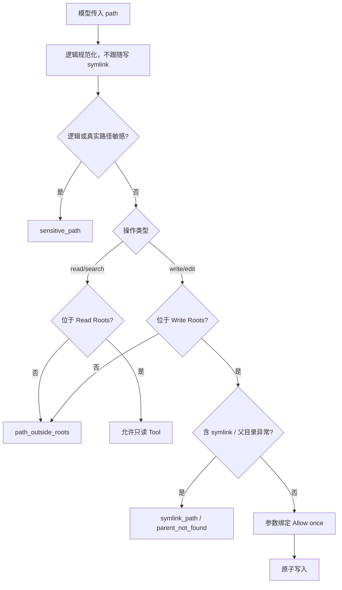
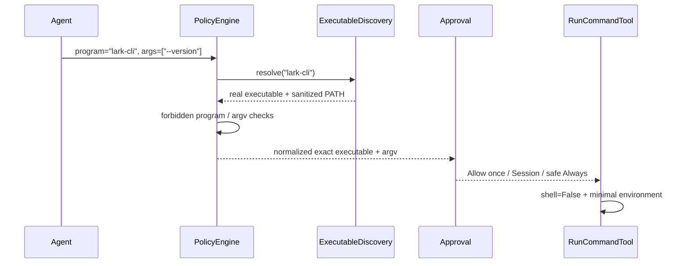
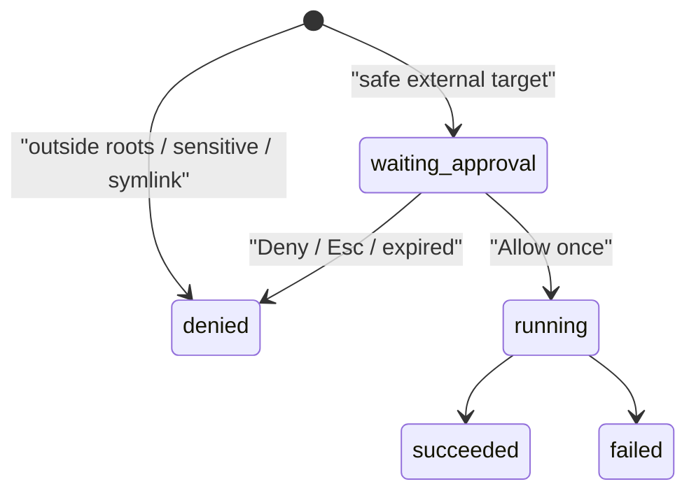

# Lobster0 Personal Machine 权限与本机 CLI 发现设计

> 状态：Design approved，等待实现计划与 TDD 落地
>
> 目标版本：Phase 2.3B
>
> 适用平台：首个验收平台为 macOS；核心路径策略保持 Python 跨平台

## 1. 为什么要做这一阶段

当前 Lobster0 的文件工具只能读取 Workspace，`run_command` 又只在固定系统 PATH 中查找程序。这套边界适合
最早期 Demo，却不符合 personal agent 的产品定位：Agent 看不到 Owner 的普通项目、文档和通过 NVM、uv、pnpm
安装的本机 CLI，也无法在 Owner 明确确认后修改 Workspace 外的普通文件。

本阶段把 Lobster0 从“Workspace 聊天 Demo”升级为“当前 macOS 用户下的受控 Personal Agent”：

- 普通个人文件可以全局搜索和读取；
- `lark-cli` 等用户安装的可信 CLI 可以被稳定发现和执行；
- Workspace 外写入仍须参数绑定 Approval；
- 凭据、密钥、Lobster0 状态和系统高敏感文件仍然拒绝；
- 不引入 `root`、`sudo`、任意 Shell 字符串或静默写入；
- 文件工具和命令工具共享可解释、可审计的权限事实。

## 2. 用户场景与验收 Query

### 2.1 普通个人文件

```text
帮我找一下 PycharmProjects 里所有包含 ProviderProtocolError 的 Python 文件。
读取 ~/Documents/notes/weekly.md 并总结。
找出我 Downloads 目录最近保存的 Markdown 文件。
```

验收结果：`glob`、`grep`、`read_file` 可以访问配置的 Personal Read Roots；结果不泄露绝对 Home 前缀；命中敏感
文件时返回稳定 `sensitive_path`。

### 2.2 本机 CLI

```text
检查我电脑上的 lark-cli 版本。
调用 lark-cli 查看当前登录身份。
用我已经安装的 CLI 查询本周创建的飞书文档。
```

验收结果：Lobster0 能发现 NVM 中的 `lark-cli`，Approval 展示解析后的真实 executable 与完整 argv；批准后使用
最小环境执行，不需要模型用 `find /` 猜路径。

### 2.3 Workspace 外受控写入

```text
在 ~/Documents/Notes 新建 meeting-summary.md。
把 ~/Documents/Notes/todo.md 中唯一的“明天”改成“今天”。
```

验收结果：写目标位于配置的 Personal Write Roots 且不敏感时生成 Approval；批准前磁盘不变化；Allow once 后沿用
现有原子写、no-clobber、并发变化保护。Session/Always 不用于文件写入。

### 2.4 必须拒绝的场景

```text
读取 ~/.ssh/id_ed25519。
读取任意 .env 文件。
读取 Lobster0 SQLite 数据库。
直接运行 sudo、bash -c、rm 或 git push。
```

以上请求必须在副作用前稳定拒绝；TUI 不能提供可放宽的 Approval。

## 3. 不做什么

- 不授予 `root` 或自动修改 macOS Full Disk Access；
- 不读取 Keychain、浏览器 Cookie/密码、SSH/AWS/GCP/Kubernetes 凭据；
- 不增加任意 Shell、管道、重定向、交互 PTY 或后台进程；
- 不增加删除、移动、目录递归写入或包安装；
- 不把整个进程环境、API Key、Token、Cookie、代理变量交给子进程；
- 不把一次 `lark-cli` Approval 泛化为“永久允许整个 lark-cli”；
- 不把 Provider 原始 reasoning 当成权限依据。

## 4. 方案比较

### 方案 A：直接继承登录 Shell 与全部 PATH

优点是实现快，终端里能运行的命令通常都能被 Agent 找到。缺点是启动登录 Shell 会执行用户脚本，完整环境可能
携带密钥和代理，PATH 中还可能出现相对目录或可被其他进程替换的位置。该方案不可审计，也无法解释一次命令究竟
从哪里解析，因此不采用。

### 方案 B：只为飞书硬编码一个 `lark_cli` Tool

优点是边界最窄。缺点是每增加一个本机 CLI 都要写新代码，不能支持 GitHub、Notion、云平台或用户自己的脚本，
不符合通用 personal agent 定位。专用 Skill 可以建立在通用发现层上，但不能替代发现层。

### 方案 C：Personal Profile + 显式 Roots + 安全发现（采用）

权限配置声明文件读取根、写入根和 executable 根；运行期只继承通过校验的目录，不执行登录 Shell。macOS 常见的
Homebrew、NVM、uv、pnpm 和 `~/.local/bin` 由确定性发现器补充，并把每个 executable 解析为真实绝对路径。

该方案兼顾通用性、可解释性和测试性，是本阶段采用方案。

## 5. 权限 Profile

新增独立 `[permissions]` 配置：

```toml
[permissions]
profile = "personal"
read_roots = []
write_roots = []
executable_roots = []
discover_user_executables = true
```

### 5.1 Profile 语义

| Profile | 普通读取 | Workspace 外写入 | 用户 CLI 发现 |
| --- | --- | --- | --- |
| `workspace` | Workspace + 旧 `read_only_roots` | 禁止 | 固定系统 PATH |
| `personal` | Personal 默认根 + 显式根 | 显式/默认 Personal Write Roots，逐次审批 | 固定根 + 确定性用户根 |

配置缺少 `[permissions]` 时保持 `workspace`，避免升级时静默扩大旧安装权限。新生成的示例配置明确展示
`profile = "personal"`，本地运行指南要求 Owner 主动选择。现有 `[workspace].read_only_roots` 继续兼容，并入最终
Read Roots；后续版本再决定是否弃用。

### 5.2 Personal 默认根

macOS `personal` Profile 默认读取：

```text
$HOME
/Applications
/opt/homebrew
/usr/local
```

默认写入只覆盖 Owner 常用内容目录，且每次仍需 Approval：

```text
$HOME/Desktop
$HOME/Documents
$HOME/Downloads
$HOME/PycharmProjects
$HOME/WebstormProjects
```

不存在的默认目录直接忽略，不自动创建。`write_roots` 可增加其他已存在绝对目录；Workspace 永远是可写根。

容器或非 macOS 环境不会凭平台猜测宿主机路径；仅使用 Workspace 与显式配置。

## 6. 统一路径策略



`WorkspaceGuard` 更名暂不进行，避免无关迁移；内部职责扩展为多根 `FileAccessGuard` 语义。公共方法仍为
`resolve_read`、`resolve_write` 与 `display`。

`display` 返回 `<root-label>/<relative-path>`，例如：

```text
home/Documents/Notes/todo.md
workspace/README.md
applications/Lark.app
```

模型和普通 Audit 不出现 `/Users/nedonion`。Approval 必须显示完整规范目标，因为只有 Owner 能看见并需要据此确认。

### 6.1 敏感路径

现有敏感规则继续生效，并补充以下类别：

- `~/Library/Keychains`、Safari/Chrome/Firefox Profile 中的 Cookie、Login Data；
- `~/.config` 下已知云凭据与认证目录；
- `~/.local/share` 下已知凭据存储；
- 密码管理器、VPN、即时通讯应用的私密数据目录；
- Lobster0 `.env`、状态数据库、日志和配置；
- socket、设备文件和非普通文件。

敏感读取在 Phase 2.3B 仍是硬拒绝，不提供 Approval。未来若引入 `sensitive-read-once`，必须使用独立设计和数据
外发提示，不能复用普通文件 Approval。

## 7. 可信 executable 发现

### 7.1 来源

`ExecutableDiscovery` 只返回存在、绝对、目录类型且去重后的路径：

```text
/usr/bin
/bin
/usr/sbin
/sbin
/opt/homebrew/bin
/usr/local/bin
~/.local/bin
~/.local/share/pnpm
~/.config/nvm/versions/node/*/bin
~/.nvm/versions/node/*/bin
~/.local/share/uv/tools/*/bin
显式 permissions.executable_roots
```

发现过程不读取 `.zshrc`、不启动登录 Shell、不执行包管理器，也不扫描整个磁盘。目录按稳定优先级排序；同名程序
只选择第一项，并在 Doctor 中展示来源类别而非完整 Home 路径。

### 7.2 解析与执行



子进程环境仅包含：

```text
PATH=<validated executable roots>
HOME=<owner home，仅 personal profile>
LANG/LC_ALL
LARKSUITE_CLI_NO_UPDATE_NOTIFIER=1
LARKSUITE_CLI_NO_SKILLS_NOTIFIER=1
```

`HOME` 使经过审批的用户 CLI 能找到自己的认证配置，但不会继承任意 `*_TOKEN`、`*_KEY`、代理、`PYTHONPATH` 或
Shell 函数。`workspace` Profile 继续不传 HOME。

### 7.3 `lark-cli` 的本机事实

当前开发机已确认：

```text
wrapper: ~/.config/nvm/versions/node/v20.19.0/bin/lark-cli
native:  ~/.config/nvm/versions/node/v20.19.0/lib/node_modules/@larksuite/cli/bin/lark-cli
version: 1.0.83
```

实现不能硬编码用户名、版本或该绝对路径；回归测试使用临时 NVM 目录。Doctor 在发现 `lark-cli` 时只报告版本检查
是否可启动，不执行认证或网络请求。

## 8. 命令、文件与防绕过边界

`run_command` 是显式高风险能力。即使命令看起来只读，首次未命中规则也需要 Owner 查看完整 argv。已批准命令可以
访问当前 macOS 用户本来能访问的文件，这是审批的真实含义；文件 Tool 的自动读取权限不能被解释为命令权限。

为避免误导：

- `read_file` 的硬拒绝不能自动触发模型改用 `cat`；System Prompt 明确要求敏感拒绝后停止；
- `cat/head/tail/find` 等未命中规则时仍必须审批；
- TUI 在命令审批中标记“该程序继承当前用户 OS 读取权限”；
- `Always allow` 继续绑定 exact executable + argv，不提供程序级全放开；
- `sudo`、Shell、删除、上传、包安装和 Git push 继续不可审批。

Phase 2.3B 不声称应用层可以完全约束已批准的第三方二进制。真正阻止恶意程序绕过文件边界需要后续 OS sandbox；
当前安全保证是“未批准不执行、批准内容可见、环境最小、结果有界、全程审计”。

## 9. 写入审批

Workspace 外 `write_file` / `edit_file` 复用现有 Approval 生命周期：

1. Guard 先验证目标属于 Write Roots、不是敏感路径且不含 symlink；
2. Policy 创建绑定完整规范参数的 pending Approval；
3. TUI 只显示 Allow once；
4. 批准后再次解析路径并执行现有原子写；
5. 成功或失败写入 ToolRun/Audit；
6. 不创建目录级 Session/Always 规则。



## 10. 配置、升级与 Doctor

### 10.1 向后兼容

- 缺少 `[permissions]`：按 `workspace` Profile；
- 旧 `workspace.read_only_roots`：继续读取并并入 Read Roots；
- 未知字段、相对 root、文件 root、symlink root和重复 root：配置加载失败；
- Profile 切换不修改历史 Approval 或持久 exact command rules。

### 10.2 Doctor 新检查

新增 `personal_permissions` 与 `executables`：

- 展示当前 Profile；
- 展示 Read/Write/Executable root 数量，不展示完整 Home；
- 检查每个显式 root 的存在、类型和所有权；
- 报告 `lark-cli`、`git`、`open` 等已发现程序的 basename 与来源类别；
- 不运行认证、不读取配置正文、不输出 PATH 全值。

## 11. 审计

新增或扩展的 Audit metadata 只能包含：

```text
permission_profile
root_label
operation
tool_name
arguments_hash_prefix
executable_basename
discovery_source
decision
```

不得包含绝对 Home、文件正文、完整 argv、认证状态、Token 或环境变量值。Owner-only Approval 仍可展示完整目标和 argv。

## 12. 错误码

| 错误码 | 含义 | 可审批 |
| --- | --- | --- |
| `path_outside_roots` | 不属于当前 Profile 的 Read/Write Roots | 否 |
| `sensitive_path` | 命中凭据、状态或高敏感路径 | 否 |
| `symlink_path` | 写路径包含 symlink | 否 |
| `parent_not_found` | 写目标父目录不存在 | 否 |
| `executable_not_found` | 所有可信 executable root 中均未找到 | 否 |
| `untrusted_executable_root` | 显式 executable root 不满足配置约束 | 否 |
| `approval_required` | 安全但未获得当前动作授权 | 是 |
| `command_forbidden` | Shell、提权、删除、上传或其他红线 | 否 |

旧 `workspace_escape` 在 Bridge/TUI 保持兼容一个版本；新多根路径统一对外使用 `path_outside_roots`。

## 13. 测试策略

### 13.1 单元测试

- `ConfigTest`：Profile、Roots、未知字段、相对路径、重复与向后兼容；
- `WorkspaceGuardTest`：Home 普通读取、系统根、外部拒绝、敏感路径、symlink、root label；
- `ExecutableDiscoveryTest`：NVM/uv/pnpm 发现、稳定顺序、去重、不执行 Shell；
- `CommandPolicyTest`：解析 NVM `lark-cli`、最小 PATH、精确规则和 forbidden 不回归；
- `RunCommandTest`：personal HOME 白名单、秘密环境仍清除、wrapper/native 两种启动；
- `DoctorTest`：只显示计数和 basename，不泄露 Home/Token；
- `FileToolTest`：Workspace 外写入批准前不落盘、批准后原子写、敏感目标拒绝。

### 13.2 纵切场景

新增版本化 offline cases：

```text
FILES-PERSONAL-READ-001
FILES-PERSONAL-WRITE-APPROVAL-001
CLI-DISCOVERY-LARK-001
CLI-SENSITIVE-DENY-001
```

所有场景使用临时 Home 和 fake executable，不读取开发机个人数据、不调用真实飞书或模型。

### 13.3 完成门禁

```bash
uv run python -m unittest discover -s tests -v
corepack pnpm --dir tui test
uv run lobster0 eval run --suite offline --root evals/scenarios
uv run ruff check .
git diff --check
```

真实本机 smoke 只验证：Doctor 能发现 `lark-cli`、`--version` 能在 Owner 批准后返回。`auth status` 和真实飞书查询
属于 P2.3C live eval，不进入离线 CI，也不能在没有授权时自动执行。

## 14. 实施拆分

本设计分三次可独立审查的交付：

1. **P2.3B-1 Personal File Roots**：配置、Guard、全局安全读取和 Workspace 外 Allow-once 写入；
2. **P2.3B-2 Executable Discovery**：可信 Roots、NVM/uv/pnpm 发现、最小环境和 Doctor；
3. **P2.3B-3 Integration & Regression**：Runtime 接线、TUI 审批文案、offline cases、README/架构/工程文档。

P2.3C 再实现 `lark-cli` Skill 与真实认证/文档查询 live eval；它建立在本设计的通用发现能力上，不反向硬编码
Phase 2.3B。

## 15. Definition of Done

- `personal` Profile 能读取普通 Home 文件且继续拒绝全部敏感回归集；
- Workspace 外写入只能在显式 Write Roots 内通过 Allow once 执行；
- Lobster0 能确定性发现临时 NVM 与当前开发机的 `lark-cli`；
- 子进程环境不含模型 Key、代理、Cookie、Token、`PYTHONPATH`；
- 旧安装缺少新配置时仍保持 workspace-only；
- TUI/Doctor 能解释当前 Profile、根数量、命令来源和审批含义；
- 全量 Python、TypeScript、offline eval、Ruff 和 diff check 通过；
- README、PRD、系统架构、Phase 2 工程索引和进度页同步实际验证结果。
