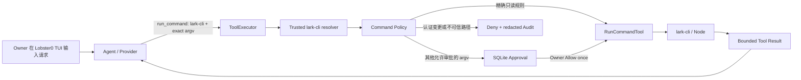

# Lobster0 Phase 2 收尾：lark-cli 与 Live Eval 设计

> 状态：方案已确认，待书面评审后进入实施计划  
> 目标阶段：P2.3B + P2.5 exit gate  
> 明确边界：这是本机 Agent 调用飞书 CLI，不是飞书消息 Channel

## 1. 一句话目标

让 Lobster0 在不放开 Shell、不复制飞书凭据、不实现飞书 Channel 的前提下，安全发现 NVM 中的
`lark-cli`，执行精确只读命令，对其他动作继续使用参数绑定 Approval，并用真实 DeepSeek live eval
证明完整链路。

## 2. 当前事实与根因

当前仓库已经完成：

- `open -a Lark` 的应用发现、Tool Call 和 Approval 闭环；
- `run_command(program, args[])`、固定 Workspace、`shell=False`、最小环境、超时和进程组回收；
- exact command rule、参数 hash、一次性审批和 SQLite 审计；
- 258 项单元测试与 21 条离线 Agent 回归。

本机环境已经确认：

- `lark-cli` 版本为 1.0.83；
- 可执行入口位于 `~/.config/nvm/versions/node/v20.19.0/bin/lark-cli`；
- 入口是指向 `@larksuite/cli/scripts/run.js` 的 symlink，shebang 为 `/usr/bin/env node`；
- Lobster0 的固定 `SAFE_EXECUTABLE_PATH` 不包含 NVM 目录，因此模型传入 `program="lark-cli"` 时会得到
  `command_not_found`；
- 当前 `eval run` 只有确定性 offline runner，`layers=["live"]` 只是场景标签，不是可执行门禁。

所以需要修的是两个共享根因：可信 Node/NVM executable 解析，以及可真实运行的 live eval。无需增加
飞书消息接收能力。

## 3. 方案比较

### 方案 A：复用 `run_command`，增加可信 lark-cli 解析（采用）

- 只为 `lark-cli` 增加固定系统目录与固定 NVM 根的可信发现；
- 安全只读 argv 进入内置 exact rules；
- 其他 argv 继续走现有 Approval；
- Tool、Policy、ToolRun、Audit 和 TUI 不产生第二条执行链。

优点：符合现有架构，改动集中，能学习“Agent 调可靠 CLI”的企业模式。缺点：需要正确处理 NVM symlink
和 Node runtime PATH。

### 方案 B：新增专用 `lark_cli` Tool（不采用）

它能提供更强的结构化参数，但会复制 `lark-cli` 已经提供的命令路由，并提前把 200 多个飞书命令映射成
Lobster0 API。Phase 3 才会加载官方 Skills，Phase 2 不需要这层重复封装。

### 方案 C：要求用户在 config.toml 填绝对路径（不采用）

代码最少，但 NVM 升级后路径会失效，GUI/TUI 与登录 Shell 的 PATH 差异仍由用户承担，也无法形成可移植的
Doctor 和回归契约。

## 4. 产品边界

### 4.1 Phase 2 收尾交付

1. Lobster0 能发现可信目录中的 `lark-cli`；
2. `doctor` 只读报告 CLI 是否可用，不读取登录身份、Token 或 scope；
3. Agent 能调用 `lark-cli --version`、`--help`、`auth status --json`；
4. 上述三条精确命令可自动执行，不能用前缀或 substring 放宽；
5. 其他 `lark-cli` argv 创建现有参数绑定 Approval；
6. 交互认证、注销、升级和重新配置在 Lobster0 内硬拒绝；
7. 新增可执行的真实 Provider live runner，默认不运行且不进入普通离线测试；
8. 完成不执行写操作的真实 `lark-cli auth status --json` smoke；
9. 同步 README、架构、工程文档、发布记录和两份进度 HTML；
10. Phase 2 达标后编写 Phase 3 `Memory + Skills + Context Compaction` 工程落地文档。

### 4.2 明确不做

- 不接收飞书私聊、群聊或事件；它们仍属于 Phase 4；
- 不自动安装、更新或登录 `lark-cli`；
- 不读取、复制或打印 lark-cli 凭据文件；
- 不自动给联系人发消息或修改任何飞书资源；
- 不在审批后静默追加 `--yes`；
- 不增加 Shell、PTY、stdin、管道、重定向或后台进程；
- 不创建第二个飞书专用执行器。

## 5. 总体架构



唯一执行链保持不变：

```text
AgentRunner -> ToolExecutor -> PolicyEngine -> RunCommandTool -> lark-cli
```

TUI 只展示 Tool 与 Approval 状态，不直接运行飞书命令。

## 6. 可信 executable 发现

### 6.1 允许搜索的位置

按顺序搜索：

1. 现有 `SAFE_EXECUTABLE_PATH`；
2. 当前进程 PATH 中的候选，但候选必须落在下面的可信根；
3. `~/.config/nvm/versions/node/v*/bin/lark-cli`；
4. `~/.nvm/versions/node/v*/bin/lark-cli`。

可信 NVM 候选必须同时满足：

- 候选名严格为 `lark-cli`；
- 候选可执行；
- symlink 严格解析成功；
- 真实目标仍位于同一个 Node version prefix；
- 目标是普通文件，不接受目录、断链或 symlink loop；
- 多版本时优先当前可信 PATH 命中的版本，否则选数字版本最高者；
- 错误只返回稳定 `command_not_found`，不回显用户目录和内部异常。

### 6.2 Node runtime

NVM 的 `lark-cli` 最终执行 `run.js`，并通过 `/usr/bin/env node` 找解释器。执行环境只为已识别的可信
lark-cli 增加其同一 Node version 的 `bin` 目录，随后拼接原有 `SAFE_EXECUTABLE_PATH`。不继承整个用户
PATH，也不把 API Key、代理、App Secret 或其他环境变量带给子进程。

### 6.3 审批后的漂移

Policy 保存的仍是严格解析后的真实程序与完整 argv。Approval 消费时继续复算 hash；NVM symlink 或真实目标
在审批后发生变化时，执行必须 fail closed，不能因为显示名仍为 `lark-cli` 而继续运行。

## 7. Command Policy

### 7.1 内置精确只读规则

只有下面三条规范 argv 自动允许：

```text
lark-cli --version
lark-cli --help
lark-cli auth status --json
```

`auth status --json --verify` 会访问网络并可能刷新身份，不在自动允许列表。参数顺序、参数数量或 executable
任意不同都视为不匹配。

### 7.2 必须硬拒绝

以下动作不能通过 Approval 放行：

```text
lark-cli auth login ...
lark-cli auth logout ...
lark-cli update ...
lark-cli config init ...
```

原因是它们涉及交互授权、凭据状态或程序更新，应由 Owner 在普通终端中显式完成。

### 7.3 其他动作

其他可信 `lark-cli` 动作使用现有 `REQUIRE_APPROVAL`：

- Modal 展示完整 argv；
- Approval 绑定 Owner、Tool、真实 executable、完整参数和 TTL；
- Allow once 只消费一次；
- Deny、过期、篡改和重放不执行；
- Lobster0 不静默修改 argv。

如果 lark-cli 自身返回 exit 10 `confirmation_required`，Agent 可以根据结构化结果再次提出包含 `--yes` 的
新 Tool Call；这会创建一条新的、绑定新 argv 的 Lobster0 Approval。禁止自动追加或自动重试。

## 8. Doctor

`doctor` 增加 `lark_cli` 检查项：

- 可信路径可解析：PASS，消息只说明可用，不显示完整用户路径；
- 未安装或路径不可信：WARN，因为 Lobster0 其他本地能力仍可使用；
- 检查不运行认证 API、不读取 auth status、不触发 Token refresh；
- `tools` 原有配置检查保持不变。

本机 Phase 2 发布门禁要求该项 PASS；普通开源用户没有安装 lark-cli 时 Doctor 仍可完成，且得到明确安装提示。

## 9. Provider 可见契约

`run_command` description 增加最小指引：

- 检查飞书 CLI 状态使用 `program="lark-cli"`、`args=["auth", "status", "--json"]`；
- 不声称没有权限，先发出 Tool Call；
- 不通过 Shell、Node wrapper 或绝对 `run.js` 路径绕过；
- 认证变更请提示 Owner 在普通终端操作；
- 其他动作会进入 Lobster0 Approval。

不把 lark-cli 的全部命令帮助塞进系统 Prompt；Phase 3 用 Skills 惰性加载解决长指令问题。

## 10. Live Eval Runner

### 10.1 CLI

新增显式入口：

```bash
uv run lobster0 eval run --suite live --root evals/scenarios --samples 3 --confirm-live
```

约束：

- `--suite offline` 行为完全不变；
- live 必须显式提供 `--confirm-live`；
- `--samples` 取值 1–5，默认 1；
- 缺少 `.env`、API Key、真实 Provider 或 live case 时返回退出码 2；
- CLI 只打印 case ID、PASS/FAIL、耗时与稳定短码；不打印 Prompt、reasoning、身份、scope、stdout 或 Token；
- 每个 sample 使用独立临时 Lobster0 state 和 SQLite；
- pending Approval 不消费，结束后临时状态删除。

### 10.2 场景 Schema

保留现有 offline scripted responses，并为 live layer 增加独立的结构化期望。两层不能共用一套 Tool 数量，
因为真实 Provider 可能先调用发现 Tool，再调用最终动作。

核心 live case：

| ID | Query | 真实行为 | 结构断言 |
|---|---|---|---|
| `ACTION-OPEN-APP-001` | 你能帮我打开飞书吗 | 只规划并创建 Approval，不打开应用 | `system_info -> run_command(waiting_approval)` |
| `LARK-STATUS-001` | 使用飞书 CLI 检查登录状态 | 自动执行精确只读 auth status | `run_command(succeeded)`，无 Approval |

live runner 不能执行带 `approval_actions` 的场景，不能自动批准，也不能执行写入型副作用。

### 10.3 发布判定

Phase 2 出口要求：

- 两个 live case 各运行 3 个 sample；
- `6/6` 结构判定通过；
- 不记录 Provider reasoning 原文；
- 不打开 Lark、不发送消息、不修改飞书数据；
- 脱敏结果写入新的发布记录，不把本地身份或 Tool stdout 提交到 Git。

## 11. 测试矩阵

### 11.1 lark-cli 解析与安全

- 系统 PATH 命中；
- 当前可信 NVM PATH 命中；
- GUI 环境无 NVM PATH 时固定根扫描；
- 多版本选择；
- 断链、loop、目录、不可执行文件和根外 symlink 拒绝；
- NVM Node bin 仅对可信 lark-cli 注入；
- Key、Token、Secret、代理环境不继承；
- 审批后 executable 漂移拒绝。

### 11.2 Policy 与 Approval

- 三条精确只读命令自动允许；
- 参数增加、删除、换序均不匹配；
- login/logout/update/config init 硬拒绝且不创建 ToolRun；
- 其他 lark-cli 动作等待 Approval；
- approve/deny/tamper/replay 保持现有安全语义；
- exit 10 不会触发静默 `--yes`。

### 11.3 Doctor 与 Eval

- Doctor PASS/WARN 且不调用 auth status；
- offline suite 不读取 `.env`、不联网；
- live suite 缺确认参数时拒绝；
- live 输出不包含 prompt、reasoning、stdout、openId、scope 或 credential-shaped value；
- 每个 sample 临时隔离；
- Provider 拒绝 Tool、错误 Tool、越界 Tool 和正确 Tool 分别得到稳定判定。

## 12. 文档与进度同步

Phase 2 收尾时更新：

- `README.md`；
- `docs/architecture/20260807_系统架构.md`；
- `docs/getting-started/20260807_本地运行指南.md`；
- `docs/engineering/README.md`；
- `docs/engineering/phase-2/lark-cli-and-live-eval.md`；
- `docs/engineering/phase-2/20260808_testing-and-debugging.md`；
- `docs/evals/README.md` 与新发布记录；
- `docs/progress/index.html`；
- `/Users/nedonion/Documents/Codex/2026-08-07/new-chat/outputs/lobster0-progress.html`。

两份进度页都必须显示真实测试数、offline/live 结果、Phase 2 完成状态和 Phase 3 下一步。独立 HTML 不进入
Git，但必须经过 HTML parser、可访问性基础和链接检查。

## 13. Phase 2 完成定义

同时满足才可把 Phase 2 标成完成：

1. 现有 8 个 Tool 数量不变；
2. 本机 `lark-cli` Doctor 为 PASS；
3. 三条精确只读命令通过 Policy 与真实执行；
4. 其他动作继续走参数绑定 Approval；
5. 认证变更硬拒绝；
6. 全量 unittest、Ruff、build、diff、文档与 TUI PTY 门禁通过；
7. offline Agent cases 100% 通过；
8. live 两个 case × 3 samples 为 6/6；
9. Git diff 和 live 输出不含凭据、个人身份明细或构建产物；
10. 仓库文档和两份进度 HTML 同步；
11. Phase 3 工程落地文档基于完成后的真实接口编写。

## 14. Phase 3 文档边界

Phase 2 完成后，Phase 3 工程落地文档只规划：

- Identity 上下文整理；
- `MEMORY.md` 长期记忆与 daily memory；
- 凭据/敏感信息过滤；
- Markdown/Python Skills 发现、版本 hash 与最多 3 个惰性激活；
- Token budget、旧消息摘要与原消息保留；
- ContextBuilder 的稳定插入顺序；
- 重启恢复、回归场景、迁移、调试和回滚。

Phase 3 不实现飞书 Channel、Telegram、Discord 或自动修改 Python 源码。
