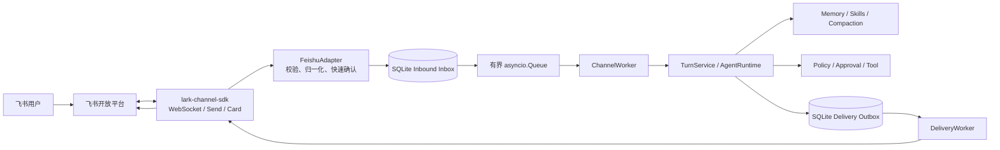
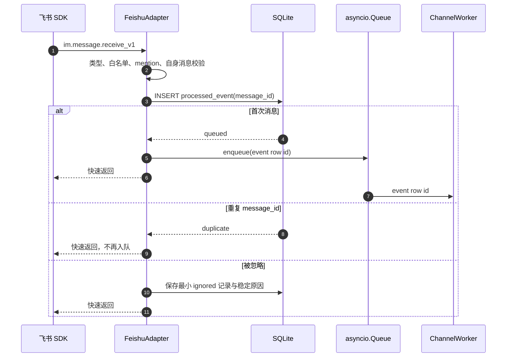
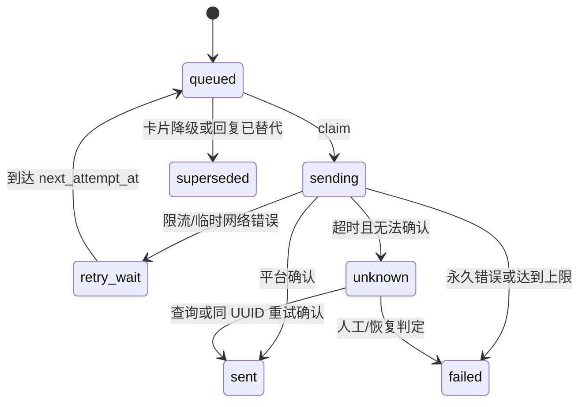
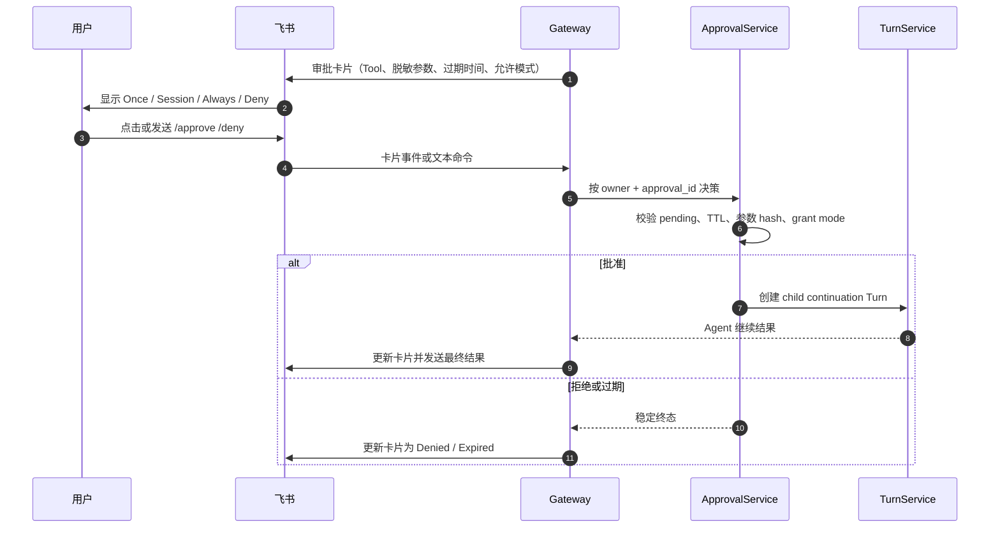
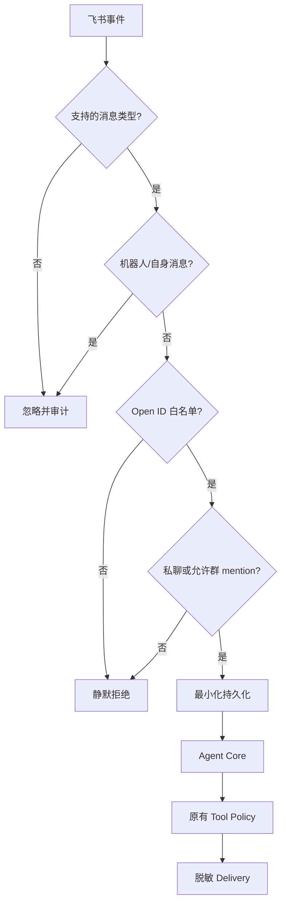

# Phase 4：飞书生产 Channel 工程设计

> 日期：2026-08-08
> 状态：Approved for implementation
> 目标分支：`main`
> 适用范围：单用户、自托管 MiniClaw；飞书企业自建应用

## 1. 一句话说明

Phase 4 把已经可用的 MiniClaw Agent Core 接到飞书。用户从飞书私聊或在白名单群里明确 `@机器人`
发消息，消息会先可靠写入 SQLite，再由后台 Worker 调用与 TUI 完全相同的 Agent、Memory、Skills、Tool 和
Approval，最后通过可恢复的 Delivery Outbox 回复飞书。

这不是一个“收到消息后直接调用模型”的演示脚本。它必须在重复投递、进程重启、断线、限流、超长回复、
危险 Tool 待审批以及部分发送失败时仍能说清楚系统处于什么状态，并且不重复执行有副作用的动作。

## 2. 为什么现在做 Phase 4

Phase 0 至 Phase 3 已经完成：

- SQLite、Workspace、配置和 Doctor；
- OpenAI-compatible Provider、Agent Loop 与统一 TurnService；
- 十个 Tool、Policy、Approval、审计与崩溃恢复；
- Textual TUI、Trace、Memory、Skills、上下文压缩；
- 296 条确定性测试和 24 条 active Agent 回归基线。

当前缺口不是 Agent 不会思考，而是它只在本地前台进程中可用。Phase 4 的价值是把它变成一个长期在线、
可从 IM 随时访问的个人 Agent，同时验证现有 Core 是否真的与 Channel 解耦。

## 3. 需求来源与冲突处理

仓库中存在两套历史口径：

1. 产品 PRD 的 v0.1 只要求飞书私聊与文本消息；
2. 完整工程设计的 Phase 4 还要求群聊 mention、Typing、流式卡片回退、消息分片和重连。

本阶段按用户要求的“Phase 4 全量落地”采用第二套完整范围，并同步更新 PRD 的阶段状态。仍不扩大到
Telegram、Discord、多用户、公开机器人、语音、文件消息和任意卡片工作流。

另外修正两个已经过时的技术事实：

- 正式 Runtime 使用飞书官方独立 Python Channel SDK `lark-channel-sdk`，导入名为 `lark_channel`；
  `lark-cli` 只用于认证诊断、事件 Schema 检查和真实联调。
- `im.message.receive_v1` 可能重复投递，消息幂等键必须是 `message_id`，不能只依赖 `event_id`。

## 4. Phase 4 完整范围

### 4.1 必须交付

- 飞书官方 WebSocket 长连接，无公网入站端口；
- 企业自建应用的 App ID / App Secret 配置；
- 私聊文本消息；
- 白名单群聊中的明确 mention；
- Open ID 和 Chat ID 双层白名单；
- 机器人自身消息过滤；
- 标准化 `InboundMessage`；
- 基于 `message_id` 的持久化幂等；
- 回调先落库、后入有界队列、立即返回；
- SQLite 可恢复 Inbound Queue；
- 按会话串行、跨会话有限并发；
- CLI 与飞书复用同一个 TurnService / AgentRuntime；
- Typing reaction，失败时不影响正式回复；
- 最终 Markdown 回复；
- 长回复按安全边界分片；
- 流式卡片能力和普通消息降级；
- Delivery Outbox、稳定 UUID、发送重试与终态；
- WebSocket 断线自动重连和可观测状态；
- 待审批 Tool 的飞书通知、交互卡片和文本命令降级；
- `miniclaw gateway` 前台守护命令；
- SIGINT / SIGTERM 优雅停止；
- `miniclaw doctor` 飞书静态配置与 SDK 检查；
- 脱敏结构化日志和 Audit；
- fake SDK 契约测试、故障恢复测试和真实飞书验收记录。

### 4.2 明确不做

- Telegram 和 Discord；
- 多租户、多 Owner 或公开机器人；
- 飞书文件、图片、语音、富文本输入；
- 任意群消息监听；
- 自动邀请机器人入群或修改飞书管理后台；
- 让模型直接调用飞书 SDK；
- 绕过现有 Tool Policy 的飞书专用执行路径；
- Redis、Kafka、Celery 或外部数据库；
- 多进程抢占同一 SQLite 队列；
- 自动重放已经开始的有副作用 Tool；
- 把 App Secret、Access Token、原始事件 JSON 写入日志或数据库。

## 5. 技术方案选择

### 5.1 方案 A：官方 `lark-channel-sdk`（采用）

SDK 负责 WebSocket transport、标准事件封装、出站消息、Typing、卡片及连接恢复；MiniClaw 负责持久队列、
身份、Session、Agent、Approval、Delivery 和审计。这样能复用官方协议实现，又不会把业务可靠性寄托在内存回调上。

### 5.2 方案 B：直接使用 `lark-oapi`

优点是更接近底层 OpenAPI；缺点是要自己处理更多 transport、重连、安全策略和消息归一化。Phase 4 的学习重点
应该是 Channel 与 Agent 的可靠边界，而不是重复实现官方 SDK 已解决的协议层。

### 5.3 方案 C：常驻 `lark-cli event consume`

最快，但生产 Runtime 会依赖 Node/NVM 子进程，生命周期、背压、错误分类和 Python 打包都更复杂。保留它作为
Doctor 深度诊断和真实 smoke 工具，不作为 Gateway 的核心 transport。

## 6. 总体架构



### 6.1 责任边界

| 模块 | 负责 | 不负责 |
|---|---|---|
| `FeishuTransport` | SDK 生命周期、收事件、发消息、Typing、卡片 | SQLite、Agent、Tool |
| `FeishuAdapter` | 白名单、类型过滤、mention 清洗、标准化 | 调模型、执行 Tool |
| `InboundRepository` | 幂等插入、claim、状态、重启恢复 | 网络连接 |
| `ChannelManager` | 队列、Worker、会话锁、优雅停止 | 飞书协议细节 |
| `TurnService` | Session、消息、Turn、Agent、Approval | 平台消息格式 |
| `DeliveryRepository` | 分片、outbox、attempt、发送终态 | 直接调用 SDK |
| `DeliveryWorker` | 发送、重试、降级、错误分类 | 生成 Agent 内容 |

## 7. 标准消息契约

```python
@dataclass(frozen=True, slots=True)
class InboundMessage:
    channel: str
    account_id: str
    event_id: str
    message_id: str
    external_user_id: str
    external_conversation_id: str
    chat_type: Literal["p2p", "group"]
    message_type: Literal["text"]
    text: str
    reply_to_message_id: str
    received_at: datetime
```

约束：

- `channel` 固定为 `feishu`；
- `account_id` 是本地配置的非秘密逻辑名，不是 App Secret；
- `message_id` 是幂等键；
- 文本去除 NUL、ANSI 和危险控制字符，保留正常换行；
- 空白文本、非文本消息和超过输入预算的消息不进入 Agent；
- 群聊先确认机器人被 mention，再删除机器人的 mention 占位符；
- 不保存完整原始事件，只保存处理所需的最小字段。

## 8. 配置设计

`config.toml` 增加：

```toml
[channels.feishu]
enabled = false
account_id = "default"
app_id_env = "MINICLAW_FEISHU_APP_ID"
app_secret_env = "MINICLAW_FEISHU_APP_SECRET"
domain = "feishu"
owner_open_id = "ou_replace_with_owner_open_id"
allowed_open_ids = []
allowed_chat_ids = []
allow_group_mentions = true
queue_size = 64
worker_count = 2
message_max_chars = 30000
streaming_card = true
```

安全规则：

- 配置只保存环境变量名，不保存秘密值；
- `owner_open_id` 是唯一可以批准 Tool 动作的飞书身份，并且必须同时位于 `allowed_open_ids`；
- `enabled=true` 时必须有至少一个 `allowed_open_ids`；
- 群聊开启时必须有至少一个 `allowed_chat_ids`；
- `account_id` 只允许小写字母、数字、短横线和下划线；
- `worker_count` 限制为 1 至 8，`queue_size` 限制为 1 至 1024；
- `message_max_chars` 限制为 1000 至 30000；
- 未安装可选依赖时普通 TUI 仍可运行，Gateway 和 Doctor 给出明确修复命令；
- `.env` 由现有 dotenv 加载，示例文件只放变量名和空值。

依赖分组：

```toml
[project.optional-dependencies]
feishu = ["lark-channel-sdk>=1.2,<2"]
```

设计时官方 PyPI 最新稳定版为 1.2.0；兼容范围固定在 1.2 至下一主版本之前，并由 `uv.lock` 固化
实际解析版本。

## 9. SQLite 与 Migration v2

现有 schema v1 已有 `channel_identities`、`processed_events` 和 `deliveries`，但 `processed_events` 没有足够字段
恢复尚未开始的消息。Migration v2 扩展它，而不是另建含义重复的消息队列表。

### 9.1 `processed_events` 新语义

新增字段：

| 字段 | 含义 |
|---|---|
| `external_user_id` | 飞书发送者 Open ID |
| `external_conversation_id` | Chat ID |
| `chat_type` | `p2p` / `group` |
| `message_type` | 当前仅 `text` |
| `content` | 已清洗的标准化文本 |
| `reply_to_message_id` | 原消息 ID |
| `status` | `queued/running/completed/failed/ignored` |
| `attempts` | claim 次数 |
| `last_error_code` | 稳定错误码，不放异常原文 |
| `updated_at` | 状态更新时间 |

保留 `event_id` 供诊断；唯一幂等仍由 `(channel, account_id, external_message_id)` 保证。

### 9.2 `deliveries` 扩展

增加：

- `reply_to_message_id`；
- `delivery_kind`：`message/card/approval/typing`；
- `idempotency_key`；
- `updated_at`；
- `next_attempt_at`；
- `last_error_detail` 的脱敏、有限摘要；
- 状态增加 `retry_wait` 和 `superseded`。

Delivery 的唯一性仍绑定内部 `message_id + channel + part_index + delivery_kind`。同一 part 重试使用相同
`idempotency_key`，不得每次生成新 UUID。

### 9.3 Migration 原则

- v1 新安装仍按 v1 schema 创建，再事务执行 v2；
- 升级现有数据库时不删除任何消息、Turn、ToolRun 或 Audit；
- migration 在单事务内完成；
- 新 binary 拒绝比自身更高的 schema；
- migration 失败回滚，不留下半表；
- 测试同时覆盖空库、真实 v1 fixture、重复 apply 和新版本拒绝。

## 10. 事件接收与幂等



关键点：

- 数据库插入先于内存入队；即使进程在两者之间崩溃，重启扫描仍能找回 `queued`；
- 队列满时不阻塞 SDK 回调，事件继续留在数据库，由 feeder 稍后补入；
- 先按 `message_id` 去重，再创建 Turn，避免重复 Tool；
- 重复事件不会更新原事件正文，也不会生成第二条回复；
- 非白名单拒绝只记录哈希化外部 ID 和错误码，默认不向攻击者回复。

## 11. Worker、顺序与背压

- 全局使用有界 `asyncio.Queue[int]`，只传数据库 row id；
- `worker_count` 控制跨会话并发；
- 每个 `(channel, account_id, external_conversation_id)` 使用一个 Session Lock；
- 同一会话严格按接收顺序执行，不让后一句越过前一句；
- claim 使用事务条件更新：仅 `queued -> running` 成功者可以执行；
- queue feeder 周期扫描未 claim 的 `queued`，不依赖内存队列为事实来源；
- Worker 处理完成后更新 event `completed`，失败写稳定错误码；
- 模型或 Tool 的长耗时不会阻塞 SDK 回调线程。

## 12. TurnService 泛化

当前 `TurnService.handle()` 写死 CLI Session 和随机 `cli:` 事件 ID。Phase 4 增加 Channel 无关入口：

```python
handle_inbound(
    *,
    user_id: int,
    channel: str,
    account_id: str,
    external_conversation_id: str,
    inbound_event_id: str,
    text: str,
    on_event: RunEventCallback | None = None,
) -> TurnResult
```

- CLI 的 `handle()` 成为传固定 `channel="cli"` 的兼容包装；
- 飞书传稳定 `message_id` 作为 `inbound_event_id`；
- SessionRepository 使用通用 `get_or_create()`；
- 相同 Session + inbound event 的 Turn 唯一约束作为第二道幂等防线；
- `TurnResult` 返回已持久化 Assistant `message_id`，供 Delivery 建立外键；
- AgentRunner、ToolExecutor、Memory 和 Skills 不增加任何飞书判断。

## 13. 回复与 Delivery Outbox



### 13.1 分片

- 优先按段落，再按换行，再按 Unicode 字符边界切分；
- 绝不在 UTF-8 code point 中间切断；
- 每段增加稳定 `[i/n]` 前缀时也不能越过上限；
- 所有 part 在发送前一次性写入 Outbox；
- 同一消息的 part 按 `part_index` 串行发送；
- 中间 part 永久失败时，后续 part 不继续制造残缺上下文。

### 13.2 重试

- 仅网络中断、连接未就绪、429 和可重试 5xx 进入指数退避；
- 使用有限次数、抖动和 `next_attempt_at`，不得紧循环；
- 权限缺失、参数无效、消息不存在属于永久失败；
- 发送超时进入 `unknown`，使用相同 idempotency UUID 恢复，不盲目创建新消息；
- 用户可见错误短且不含 request、token、URL query 或 SDK 原始异常。

## 14. Typing 与流式卡片

### 14.1 Typing

- Worker 开始执行 Turn 后 best-effort 添加 Typing reaction；
- Turn、失败或取消结束时 best-effort 移除；
- Typing 失败只写脱敏 Audit，不能让正式 Turn 失败；
- 重启清理不依赖内存 token，过期 Typing 由平台自然结束。

### 14.2 流式卡片

- Provider 可见文本 delta 通过现有 `RunEvent` 聚合；
- 限频更新同一张卡片，不为每个 token 调 API；
- reasoning、Tool 参数、密钥和内部错误不进入卡片正文；
- Tool Trace 只显示安全摘要；
- 卡片创建或更新失败时，标记原卡片 Delivery `superseded`，最终内容改发普通 Markdown；
- Provider 在已经显示部分文本后失败，卡片明确标注未完成，不把半段内容伪装成成功；
- 配置 `streaming_card=false` 时只发送最终普通消息。

## 15. Approval 跨 Channel 闭环

现有 ApprovalRepository、ApprovalService 和 TurnService 是唯一状态机，飞书只增加交互外壳。



安全约束：

- 只有配置 Owner Open ID 可以决策；
- 卡片按钮的 mode 必须包含在 Core 返回的 `grant_modes`；
- `/approve <id> once|session|always` 和 `/deny <id>` 是卡片不可用时的降级命令；
- 文本命令不经过模型，避免模型自己批准动作；
- 文件写入仍只有 Once，inline AppleScript 等硬拒绝保持不可批准；
- 批准后执行的参数必须和原参数 hash 完全一致；
- 重复点击返回原终态，不重复执行 child Turn。

## 16. 启动、停止和恢复

### 16.1 `miniclaw gateway`

启动顺序：

1. 加载 `.env` 和 TOML；
2. 校验 state home、SQLite migration、Provider 与飞书配置；
3. 构建唯一 AgentRuntime；
4. 恢复 stale Turn / ToolRun；
5. 把 stale `running` event 分类恢复；
6. 启动 DeliveryWorker 和 ChannelWorker；
7. 建立飞书 WebSocket；
8. 输出不含秘密的 ready 状态；
9. 等待信号。

停止顺序：

1. 停止接收新事件；
2. 给内存队列有限 drain 时间；
3. 未开始事件保留为 `queued`；
4. 取消仍运行的 Agent task；
5. 将相关 Turn/ToolRun 标记 interrupted/failed；
6. 关闭 DeliveryWorker；
7. 调 SDK `disconnect()`；
8. 关闭数据库和日志 handler。

禁止 `kill -9` 作为正常关闭方案。

### 16.2 恢复语义

| 崩溃位置 | 重启行为 |
|---|---|
| DB insert 前 | 等平台重投；本地无记录 |
| DB insert 后、enqueue 前 | feeder 找回 queued |
| enqueue 后、claim 前 | 条件 claim 保证只执行一次 |
| Turn 创建前 | event 回到 queued 可执行 |
| Turn running | 不重放潜在副作用；标记 interrupted，发送安全恢复提示 |
| Turn completed、Delivery 未创建 | 从已持久 Assistant message 重建 Delivery |
| Delivery queued/retry_wait | 恢复发送 |
| Delivery sending | 标为 unknown，以相同 UUID 恢复 |
| waiting_approval | 重发/更新审批通知，不执行 Tool |

## 17. Doctor 设计

默认 `miniclaw doctor` 只做安全、快速、无副作用检查：

- `feishu_config`：开关、account、白名单、环境变量存在性；
- `feishu_sdk`：可选依赖能否导入及兼容版本；
- `feishu_database`：schema v2 和队列表索引；
- `feishu_runtime`：仅检查本地运行约束，不建立长连接；
- 结果只显示变量名，不显示值。

真实凭证/权限/事件订阅检查由显式命令或发布 smoke 执行，并输出脱敏结果。`lark-cli auth status`、
`event schema` 和 `event consume` 是诊断手段，不是 Gateway 健康的唯一依据。

## 18. 错误码

稳定错误码至少包括：

- `feishu_config_invalid`
- `feishu_sdk_missing`
- `feishu_auth_failed`
- `feishu_not_connected`
- `feishu_permission_denied`
- `feishu_rate_limited`
- `feishu_send_timeout`
- `feishu_send_failed`
- `feishu_event_invalid`
- `feishu_message_unsupported`
- `feishu_sender_denied`
- `feishu_chat_denied`
- `feishu_queue_recovered`
- `feishu_turn_interrupted`
- `feishu_delivery_unknown`

SDK 原始异常在 adapter 边界映射为这些错误码。数据库、用户回复和测试都依赖稳定码，不依赖英文异常文本。

## 19. 日志与可观测性

每条链路使用本地生成的 correlation id，结构化记录：

- channel / account；
- event row id、message ID 的短哈希；
- session / turn / internal message / delivery id；
- queue wait、Agent duration、delivery duration；
- tool count、approval state、delivery attempts；
- 稳定错误码和重试决定。

不得记录：

- App Secret、tenant/user access token；
- Authorization header；
- `.env` 内容；
- 完整外部 Open ID、Chat ID、Message ID；
- 未脱敏 Tool 参数；
- SDK 原始事件 JSON；
- Provider 隐藏 reasoning。

`miniclaw gateway` 的 stdout/stderr 是运维日志，不混入普通 Agent 回复格式。

## 20. 安全模型



飞书不是新的信任根。即使发送者在白名单中，Tool 仍必须经过 WorkspaceGuard、Policy、Approval 和 Executor；
Channel Adapter 不能直接运行文件、HTTP 或本机命令。

## 21. 测试策略

### 21.1 单元与契约

- 配置未知字段、边界、秘密不驻留；
- 文本标准化、群 mention、机器人过滤；
- Open ID / Chat ID 白名单；
- `message_id` 去重，event ID 不作为唯一消息键；
- queue 满、重复 enqueue、并发 claim；
- 同会话顺序和跨会话并发；
- v1 -> v2 migration、回滚和重复 apply；
- TurnService CLI 兼容与 Feishu Session；
- Assistant message id 进入 Delivery；
- Unicode 分片和 part 顺序；
- 429、5xx、权限错误、超时和 unknown；
- Typing best-effort；
- 卡片更新、限频与普通消息降级；
- 审批按钮、文本命令、Owner、TTL、hash 与重复点击；
- SIGTERM drain 和各崩溃点恢复；
- 日志与 Audit 脱敏。

所有默认测试使用 fake transport，不访问真实网络、不依赖个人飞书账号。

### 21.2 Agent 回归集

新增 R4 Channel cases，至少覆盖：

- `FEISHU-DM-001`：私聊普通问答；
- `FEISHU-GROUP-001`：群聊 mention；
- `FEISHU-GROUP-002`：未 mention 不响应；
- `FEISHU-DEDUPE-001`：重复 message ID；
- `FEISHU-TOOL-001`：只读 Tool；
- `FEISHU-APPROVAL-001`：待审批、批准、续执行；
- `FEISHU-APPROVAL-002`：拒绝不执行；
- `FEISHU-RESTART-001`：queued 恢复；
- `FEISHU-RESTART-002`：running Tool 不重放；
- `FEISHU-DELIVERY-001`：分片和重试；
- `FEISHU-CARD-001`：卡片失败降级；
- `FEISHU-RECONNECT-001`：连接恢复后继续处理。

### 21.3 真实验收

真实飞书 release smoke 必须记录时间、commit、配置摘要、用例结果和脱敏证据：

1. WebSocket ready；
2. 私聊连续 20 轮；
3. 群聊 mention 与未 mention；
4. Memory 跨重启可用；
5. 至少一个只读 Tool；
6. 至少一个需审批 Tool 的批准与拒绝；
7. 重复投递不产生第二次回复；
8. Gateway 重启恢复 queued；
9. 主动断开后自动重连；
10. 长消息分片；
11. 卡片失败时普通消息降级；
12. 日志 Secret scan 为零。

缺少真实凭证时可以完成代码和 fake 契约，但不得把 Phase 4 标记为 production verified。

## 22. 发布门禁

Phase 4 只有同时满足以下条件才算完成：

1. 设计、实施、运维、测试和故障恢复文档与实现一致；
2. 全仓确定性测试 100% 通过；
3. active Agent 回归 100% 通过；
4. R4 Channel 回归 100% 通过；
5. Ruff、构建、文档链接、Mermaid 和 HTML 检查通过；
6. `miniclaw doctor` 能区分 disabled、misconfigured、ready；
7. 真实飞书 20 轮、Tool、Approval、重启和重连记录通过；
8. `.env`、数据库、日志、Git diff 均无秘密；
9. README、PRD、系统架构、工程索引和进度页同步；
10. 聚焦 commit 使用中英各半标题，最终 merge/push 到 `main` 并核验 `origin/main`。

## 23. 实施切片

1. Config + Migration v2 + Repository；
2. Channel contracts + fake transport；
3. TurnService 泛化 + identity/session；
4. persistent inbox + queue/worker/recovery；
5. delivery outbox + 分片/重试；
6. official Feishu transport + WebSocket lifecycle；
7. Typing + streaming card fallback；
8. Approval card + text fallback；
9. gateway CLI + Doctor + signals；
10. R4 eval + real smoke harness；
11. docs/progress/release evidence；
12. full verification + main push。

每个切片必须先写失败测试，再写最小实现；一个切片通过聚焦测试后再进入下一片。不得最后一次性补测试。

## 24. 文档同步清单

- `docs/engineering/phase-4/feishu-channel.md`：面向学习者的完整工程说明；
- `docs/engineering/phase-4/testing-and-operations.md`：测试、联调、恢复、排障；
- `docs/superpowers/plans/2026-08-08-phase-4-feishu-channel.md`：逐文件 TDD 计划；
- `docs/product/20260807_产品需求文档.md`：SDK、幂等、群 mention 与阶段状态；
- `docs/architecture/20260807_系统架构.md`：运行时和数据流现状；
- `docs/engineering/README.md`：Phase 4 索引；
- `README.md`：安装、配置、Gateway 和飞书应用设置；
- `docs/progress/index.html`：进度、测试数量、commit、下一阶段；
- 外部 `outputs/miniclaw-progress.html`：与仓库进度页同口径；
- `docs/evals/releases/`：Phase 4 release evidence。

## 25. 参考资料

- 飞书官方 Channel SDK：<https://github.com/larksuite/channel-sdk-python>
- 官方迁移说明：<https://github.com/larksuite/channel-sdk-python/blob/main/docs/migration-from-lark-oapi.md>
- 官方快速开始：<https://github.com/larksuite/channel-sdk-python/blob/main/docs/quickstart.md>
- 官方安全说明：<https://github.com/larksuite/channel-sdk-python/blob/main/docs/security.md>
- 飞书消息接收事件：<https://open.feishu.cn/document/uAjLw4CM/ukTMukTMukTM/reference/im-v1/message/events/receive>
- 飞书事件订阅概览：<https://open.feishu.cn/document/server-docs/event-subscription-guide/overview>
- MiniClaw 产品 PRD：`docs/product/20260807_产品需求文档.md`
- MiniClaw 完整工程设计：`docs/superpowers/specs/2026-08-07-miniclaw-complete-engineering-design.md`
