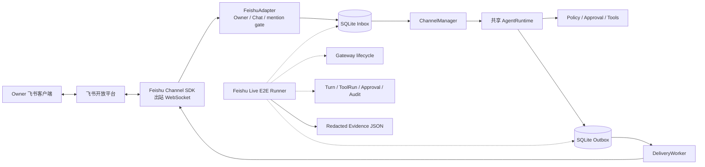
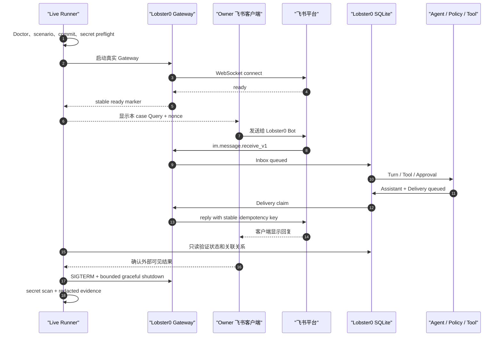
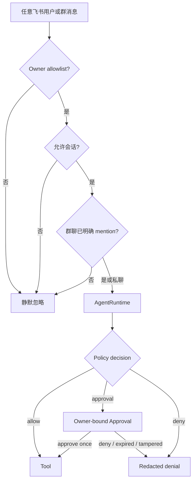
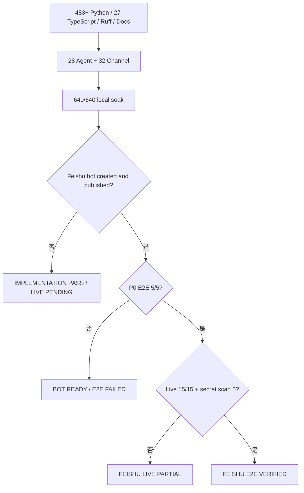

# Lobster0 Phase 5：真实飞书机器人与 Live E2E 设计

> 状态：设计已确认，等待书面评审后进入实施计划
> 日期：2026-08-08
> 目标：创建一个真实飞书企业自建机器人，跑通“飞书 → Lobster0 → Tool/Approval → 飞书”基础 E2E
> 当前基线：Python 483/483、TypeScript 27/27、Agent 28/28、Channel 32/32、local soak 640/640
> 当前真实状态：`channels.feishu` 未启用，真实机器人、凭据、Scope 与 Live Evidence 尚未完成

## 1. 一句话目标

把现有的飞书 Channel 从“代码与 fake SDK 已通过”推进到“真实飞书机器人已创建、Owner 能在飞书里操控
Lobster0、Lobster0 能把 Tool/审批结果回复到飞书，并留下不泄密的可复核证据”。

本设计只完成基础机器人 E2E，不扩展日历、任务、文档、云盘等飞书业务域，也不穷举 `lark-cli` 的所有命令。

## 2. 为什么现状还不能算验收完成

当前仓库已经有完整的本地实现：飞书 Adapter、官方 Channel SDK Transport、SQLite Inbox/Outbox、去重、Worker、
Delivery、Typing、进度卡、Approval、重启恢复、日志和 12 条飞书离线场景。但本机最新 `doctor` 明确显示：

```text
[PASS] feishu_config: Feishu channel is disabled
[PASS] feishu_sdk: official Feishu SDK is not required while channel is disabled
[PASS] feishu_runtime: Feishu runtime is not started by doctor
```

这三个 PASS 只表示“关闭状态是合法的”，不表示飞书已经接通。现有 `scripts/feishu_live_smoke.py` 也只是人工逐项
输入 `p/f/s`，不会创建机器人、不会启动 Gateway、不会自动观察真实 Inbox/Outbox/ToolRun，也不能证明回复已经
送达飞书。

因此当前准确状态仍是：

```text
IMPLEMENTATION PASS / FEISHU LIVE PENDING
```

## 3. 范围

### 3.1 本次交付

1. 创建一个专用的飞书企业自建应用，名称建议为 `Lobster0 E2E Bot`；
2. 启用机器人能力、长连接事件订阅和最小消息权限；
3. 发布一个仅对 Owner/测试人员可见的应用版本；
4. 用真实 App ID/App Secret 配置 Lobster0，但永不提交或打印 Secret；
5. 获取这个应用命名空间下的 Owner Open ID，建立严格白名单；
6. 跑通 Owner 私聊机器人并收到真实回复；
7. 跑通连续上下文、只读 Tool、危险 Tool 审批、拒绝和重启恢复；
8. 跑通允许群的明确 mention 与未 mention 静默；
9. 把真实验收场景版本化，并由 E2E Runner 自动核对尽可能多的本地事实；
10. 保存绑定 commit 的脱敏 Evidence，更新 Phase 5、发布记录和进度页。

### 3.2 明确不做

- 不接入日历、任务、文档、云盘、审批中心或通讯录业务能力；
- 不测试 `lark-cli` 的全部命令；
- 不创建公开机器人、群自定义 Webhook 机器人或面向全公司的应用；
- 不申请读取群内所有消息的敏感权限；
- 不部署公网 Webhook，本地通过出站 WebSocket 长连接工作；
- 不自动生成、读取、复制或提交 App Secret；
- 不绕过 Lobster0 Policy，不自动批准危险 Tool；
- 不把 fake SDK、人工勾选或 SQLite `sent` 单独冒充外部送达证明；
- 不自动修改或部署 Lobster0 源码作为“自我进化”。

## 4. 方案比较

### 4.1 方案 A：真实机器人 + WebSocket + 半自动 Evidence（采用）

用户只在飞书客户端完成必要的人类动作；Runner 负责启动/观察 Gateway、比较数据库状态、识别 Tool/Approval、
检查回复和生成脱敏 Evidence。

优点：复用生产链路，不需要公网服务器，最小权限，证据强于纯手工。缺点：飞书后台创建应用、发布版本以及在
客户端发送消息仍需人类参与。

### 4.2 方案 B：使用 `lark-cli --as user` 全自动模拟用户（暂不采用）

它可以自动发送和搜索消息，但要求额外 OAuth、用户身份权限和消息读取 Scope，也会把机器人身份与用户身份放进
同一个测试链，增加安全面。等基础 E2E 稳定后可作为 Phase 5.1 增强。

### 4.3 方案 C：继续使用纯人工 `p/f/s` Recorder（不采用）

开发成本最低，但只能证明“人点击了 pass”，不能证明哪个 commit、哪个 Turn、哪个 Delivery 或 Approval 真正发生。

## 5. 总体架构



唯一 Agent 执行链保持不变：

```text
FeishuTransport -> ChannelManager -> TurnService -> AgentRunner
-> ToolExecutor -> PolicyEngine -> Tool -> DeliveryWorker -> FeishuTransport
```

E2E Runner 只做编排和只读取证；它不能直接调用 Tool、篡改状态、替代 Owner 审批或向数据库伪造成功。

## 6. 真实机器人创建

### 6.1 应用类型与可见范围

- 创建企业自建应用，不使用“群自定义机器人”；
- 名称建议为 `Lobster0 E2E Bot`，图标可后补；
- 第一版只对 Owner 或专用测试用户可见；
- 先完成私聊，再把机器人加入一个专用测试群；
- 测试群建议命名为 `Lobster0 E2E`，不要加入真实工作群。

飞书官方发送消息接口只支持开发者后台创建的应用机器人；机器人能力启用后还需要发布版本才会生效。参考：

- [发送消息](https://open.feishu.cn/document/server-docs/im-v1/message/create?lang=zh-CN)
- [开发机器人](https://open.feishu.cn/document/uQjL04CN/uYTMuYTMuYTM?lang=zh-CN)

### 6.2 最小权限

第一版只申请完成基础 E2E 所需的最小集合：

| 用途 | Scope | 必需性 |
| --- | --- | --- |
| 接收 Owner 单聊 | `im:message.p2p_msg:readonly` | 必需 |
| 接收群内明确 @机器人 | `im:message.group_at_msg:readonly` | 群聊验收必需 |
| 以机器人身份回复 | `im:message:send_as_bot` | 必需 |
| 添加/移除 Typing reaction | 以当前后台展示的 reaction 写权限为准 | 体验能力，可降级 |

不申请 `im:message.group_msg`，因为 Lobster0 只应看到明确寻址给机器人的群消息。平台会依据接收消息 Scope 决定
推送哪些事件；同一消息可能重复推送，官方也建议用 `message_id` 去重。参考：

- [接收消息事件](https://open.feishu.cn/document/server-docs/im-v1/message/events/receive?lang=zh-CN)

若后台在 2026-08-08 之后调整显示名称，以官方页面的 Scope ID 为准；规范和 Evidence 记录 Scope ID，不依赖中文
显示名。

### 6.3 事件订阅

1. 选择“使用长连接接收事件”；
2. 订阅 `im.message.receive_v1`；
3. 如启用审批卡片按钮，再按 Channel SDK 当前文档启用 card action；
4. 保存并发布应用版本；
5. 不填写公网回调 URL。

官方长连接由 SDK 在本地建立出站 WebSocket，只要求本机能访问公网，不要求公网入站端口。参考：

- [使用长连接接收事件](https://open.feishu.cn/document/server-docs/event-subscription-guide/event-subscription-configure-/request-url-configuration-case?lang=zh-CN)
- [接入飞书 Channel SDK](https://open.feishu.cn/document/mcp_open_tools/integrating-agents-with-feishu/integrate-feishu-channel)

## 7. 凭据与 Owner 绑定

### 7.1 Secret 边界

真实值只进入权限为 `0600` 的本地 `.env`：

```dotenv
LOBSTER0_FEISHU_APP_ID=cli_xxx
LOBSTER0_FEISHU_APP_SECRET=...
```

禁止把 Secret 放入：

- `config.toml`；
- 命令行参数或 shell 历史；
- Git、Issue、截图、日志、SQLite、Evidence；
- Agent Prompt、Tool 参数或模型上下文。

### 7.2 为什么不能复制其他应用的 Open ID

Open ID 是应用维度标识。同一个人在不同飞书应用里的 Open ID 不同，因此不能直接把当前其他 `lark-cli` profile
返回的 `ou_...` 写入 Lobster0 Bot 白名单。

### 7.3 一次性 Owner 发现

使用与 Lobster0 Bot 相同 App ID/App Secret 创建独立命名 profile `lobster0-e2e`，不能覆盖用户已有的默认 profile。
App Secret 通过 stdin 或交互式 TTY 输入，不能出现在 argv。然后：

1. 先查看 `im.message.receive_v1` schema；
2. 启动一个有 `--max-events 1 --timeout 2m` 的 bot event consumer；
3. 等待 stderr 的 `[event] ready`，不能用固定 `sleep` 猜测；
4. 用户在机器人私聊发送一次性 challenge；
5. 只从该事件提取 `sender_id` 与 `chat_id`；
6. 将 `sender_id` 写入 `owner_open_id` 和 `allowed_open_ids`；
7. 停止 consumer 后再启动 Lobster0 Gateway，避免同一应用并发抢占事件通道；
8. 不保存消息正文或原始事件 JSON。

consumer 必须有界退出或使用 SIGTERM；禁止 `kill -9`，避免遗留服务端订阅或本地 event bus 状态。

## 8. Lobster0 配置

第一阶段只启用 Owner 私聊：

```toml
[channels.feishu]
enabled = true
account_id = "default"
app_id_env = "LOBSTER0_FEISHU_APP_ID"
app_secret_env = "LOBSTER0_FEISHU_APP_SECRET"
domain = "feishu"
owner_open_id = "ou_owner_for_this_app"
allowed_open_ids = ["ou_owner_for_this_app"]
allowed_chat_ids = []
allow_group_mentions = false
queue_size = 64
worker_count = 2
message_max_chars = 30000
streaming_card = true
```

私聊通过后再加入测试群：

```toml
allowed_chat_ids = ["oc_lobster0_e2e_group"]
allow_group_mentions = true
```

群聊必须同时满足 Chat allowlist 与明确 mention；只满足一项时保持静默。

## 9. Live E2E Runner

### 9.1 入口

现有 Recorder 升级为安全的编排器，保留显式确认：

```bash
uv run python scripts/feishu_live_smoke.py --confirm-live
```

不带 `--confirm-live` 时，必须在读取 `.env`、启动 Gateway 或发起网络连接前退出 2。

### 9.2 Runner 可以做什么

- 执行本地 Doctor 与版本化场景校验；
- 校验 Feishu enabled、SDK 可导入、凭据变量存在且 `.env` 为 `0600`；
- 记录运行前数据库匿名计数；
- 启动一个真实 Gateway 子进程并等待明确 ready marker；
- 为每个 case 生成无敏感信息的随机 nonce；
- 提示用户在自己的测试私聊/群聊发送指定 Query；
- 轮询 SQLite 中新增的 Inbox、Turn、ToolRun、Approval、Delivery 和 Audit 状态；
- 在内存中验证 Workspace 哨兵与 Assistant 结果，不把正文写入 Evidence；
- 对只能由飞书客户端证明的外部可见结果要求一次人工确认；
- 正常 SIGTERM Gateway，并等待反向清理完成；
- 生成绑定 Git commit 的脱敏 Evidence。

### 9.3 Runner 绝不能做什么

- 不能调用内部 Repository 伪造入站事件、Delivery sent 或 Approval；
- 不能自动发送 `/approve`、替 Owner 点击卡片或静默追加 `--yes`；
- 不能自动放开非 Owner、群 Chat、Shell 或敏感文件权限；
- 不能打印或保存完整外部 ID、消息正文、Prompt、reasoning、Tool 参数、Token 或 Secret；
- 不能把 live 不可强制复现的“平台重复投递”伪装成已验证；该语义继续由 12 条离线纵切证明。

## 10. 版本化真实验收集

新增 `evals/scenarios/feishu-live.v1.jsonl`。每条记录必须包含：

```json
{
  "schema_version": 1,
  "id": "FEISHU-LIVE-002",
  "title": "Owner 私聊进入真实 Agent 并回复",
  "status": "active",
  "layers": ["live"],
  "capability": "feishu_e2e",
  "query": "回复 LOBSTER0_E2E_OK，不要省略下划线",
  "expected": {
    "local_evidence": ["inbox_completed", "turn_completed", "delivery_sent"],
    "human_evidence": ["reply_visible_in_feishu"]
  }
}
```

Loader 必须拒绝重复 ID、未知字段、未知 evidence key、空 Query、控制字符和非 `feishu_e2e` capability。Live case 不进入
普通离线 `eval run --suite channel`，避免 CI 读取凭据或联网。

## 11. 十五项真实验收

| ID | 场景 | 自动证据 | 人工证据 |
| --- | --- | --- | --- |
| `FEISHU-LIVE-001` | Gateway 与真实 WebSocket ready | ready、transport connected | 无 |
| `FEISHU-LIVE-002` | Owner 私聊普通问答 | Inbox/Turn/Delivery completed | 飞书可见回复 |
| `FEISHU-LIVE-003` | 同一私聊三轮上下文 | 同一 Channel Session、3 个 Turn | 第三轮引用首轮 nonce |
| `FEISHU-LIVE-004` | `system_info` Tool | ToolRun succeeded | 回复包含预期 OS 类型 |
| `FEISHU-LIVE-005` | `read_file` Workspace 哨兵 | ToolRun succeeded、哨兵只在内存匹配 | 回复准确返回哨兵 |
| `FEISHU-LIVE-006` | 危险 Tool 等待审批 | pending Approval、无副作用 | 飞书出现审批提示 |
| `FEISHU-LIVE-007` | Owner approve once | Approval approved、单个 child Turn/ToolRun | 最终结果可见 |
| `FEISHU-LIVE-008` | Owner deny | Approval denied、Tool 未执行 | 拒绝结果可见 |
| `FEISHU-LIVE-009` | 非 Owner/非白名单 | 无新 Turn/ToolRun | 机器人保持静默 |
| `FEISHU-LIVE-010` | 允许群明确 mention | group Inbox/Turn completed | 群内收到回复 |
| `FEISHU-LIVE-011` | 允许群未 mention | 无新 Turn/ToolRun | 群内保持静默 |
| `FEISHU-LIVE-012` | 中文、emoji、Markdown 长回复 | 多 part Delivery 全 sent、顺序连续 | 客户端内容完整 |
| `FEISHU-LIVE-013` | Gateway 正常重启与记忆恢复 | 停止干净、重启 ready、Session/Memory 可读 | 重启后回答正确 |
| `FEISHU-LIVE-014` | 临时断网与 WebSocket 重连 | reconnect 状态、后续 Delivery sent | 恢复后可继续对话 |
| `FEISHU-LIVE-015` | Secret/隐私扫描 | 精确 Secret scan 0、敏感字段 scan 0 | 无 |

其中 `FEISHU-LIVE-002`、`004`、`005`、`006`、`007` 是基础 E2E 的 P0 核心；其余项目完成后才能把飞书平台写成
完整 Live PASS。

## 12. 一次测试的完整流程



## 13. Evidence 契约

Evidence 默认保存到 Git 忽略目录：

```text
.local/eval-results/feishu/<UTC>.json
```

允许字段：

- schema version；
- 40 位 Git commit；
- 开始/结束 UTC；
- case ID 与 pass/fail/skip；
- 稳定错误码；
- Doctor、Inbox、Turn、ToolRun、Approval、Delivery、Audit 的匿名状态计数；
- Gateway 是否 ready、是否优雅退出；
- Secret scan 命中数；
- 总结与发布判定。

禁止字段：

- App ID/App Secret/access token/API Key；
- 完整 Open ID/Chat ID/Message ID/Approval ID；
- 用户名、群名、消息正文、回复正文、Prompt、reasoning；
- Tool 原始参数/stdout/stderr；
- `.env` 路径和本机用户名路径。

Evidence 只证明它记录的 commit。工作树不干净、commit 无法解析或测试期间 HEAD 变化时，Runner 必须失败关闭。

## 14. 自动与人工证据边界

| 事实 | 自动判断 | 是否仍需人工 |
| --- | --- | --- |
| WebSocket ready | 是 | 否 |
| Inbox/Turn/ToolRun/Approval/Delivery 状态 | 是 | 否 |
| 飞书客户端实际看到回复 | 不能仅靠 SQLite 证明 | 是 |
| 未 mention 时客户端无回复 | 本地可证明无 Turn | 是，确认外部静默窗口 |
| 长 Markdown/emoji 显示完整 | 本地只能证明 part sent | 是 |
| Secret 未进入本地日志/Evidence | 是 | 否 |
| 平台从未复制、延迟或丢消息 | 一次 smoke 无法证明 | 需要长期监控，不在本次范围 |

人工输入只接受结构化 `p/f/s`，但只有在对应自动证据已经满足时才允许 `p`。自动证据失败时，人工不能强行覆盖为
PASS。

## 15. 失败与恢复

| 失败 | 稳定结果 | 修复方向 |
| --- | --- | --- |
| Channel disabled | preflight fail | 开启 `[channels.feishu]` |
| SDK 未安装 | preflight fail | `uv sync --extra feishu` |
| App ID/Secret 缺失 | preflight fail | 修正私有 `.env`，权限保持 `0600` |
| App 凭据无效 | Gateway fail before ready | 核对同一应用的凭据，不输出值 |
| 缺消息 Scope | stable authorization failure | 只补错误指示的最小 Scope |
| Owner Open ID 属于其他应用 | 入站 `sender_denied` | 重新做同 App 的一次性 Owner 发现 |
| 未发布应用版本 | 找不到/不能聊天 | 发布测试版本并确认可用范围 |
| 群聊未响应 | no Turn | 检查 Chat allowlist、mention 与 group Scope |
| Delivery `retry_wait` | bounded retry | 等待退避，保留相同 idempotency key |
| Delivery `unknown` | 不盲目双发 | 同 key 恢复，人工确认外部状态 |
| Gateway 被强杀 | 本轮 FAIL | 使用 SIGTERM，检查恢复状态 |
| 人工 skip | release gate FAIL | 补齐该 case，不能把 skip 当通过 |

## 16. 安全威胁与控制



- 白名单和 mention 在模型前执行；
- 入站只接受受支持的文本类型；
- 同一 `message_id` 只进入一个 Inbox 事实；
- Tool 仍走统一 Policy，Channel 不拥有第二套权限；
- Approval 绑定 Owner、Tool、规范化参数、TTL 与消费次数；
- 日志只使用短哈希和稳定错误码；
- Runner 不保存 raw SDK event；
- 测试群与真实工作群隔离；
- App 可用范围保持最小。

## 17. 发布判定



不能因为数字增加而删除旧测试。实施后基线数字必须等于新鲜门禁输出，不预先锁死为 483。

## 18. 代码与文档落点

预计修改：

- `evals/scenarios/feishu-live.v1.jsonl`：15 条真实场景；
- `scripts/feishu_live_smoke.py`：从人工 Recorder 升级为安全 E2E 编排器；
- `src/lobster0/evals/live.py` 或新建聚焦模块：schema、证据和状态断言；
- `tests/test_feishu_live_e2e.py`：secret-free fake process/SQLite 契约；
- `tests/test_feishu_evals.py`：保持旧入口兼容并扩充安全门禁；
- `docs/engineering/phase-5/20260808_feishu-live-e2e.md`：大白话操作手册；
- `docs/engineering/phase-5/20260808_testing-and-live-acceptance.md`：三平台真实状态；
- `docs/engineering/phase-5/20260808_troubleshooting.md`：真实机器人排障；
- `docs/evals/releases/v0.5.1.md`：发布证据；
- `README.md`、工程索引、架构、仓库进度 HTML 与外部进度 HTML。

若实现发现现有 Gateway 缺少可测试的 ready/stop 契约，只允许增加稳定观察接口，不复制第二套 Gateway。

## 19. 测试策略

### 19.1 离线自动化

- 未确认 live 时零网络、零 `.env` 读取；
- live scenario schema 严格失败关闭；
- Gateway 子进程 ready、超时、异常退出和 SIGTERM 清理；
- 数据库 delta 必须属于本次 case 的关联链；
- 人工 PASS 不能覆盖自动失败；
- Evidence 字段 allowlist 和完整敏感字段 denylist；
- Secret 精确字节扫描；
- dirty worktree、HEAD 变化和 unknown commit 拒绝；
- 测试使用临时状态、fake Gateway/clock/input，不访问真实飞书或模型。

### 19.2 真实平台

- 专用 Bot、Owner、测试群和 Workspace 哨兵；
- 先 P0 私聊，再审批，再群聊、重启和重连；
- 每次失败保留脱敏日志和数据库副本，不先清库掩盖证据；
- 修复后从失败 case 重跑，再运行完整 15/15；
- 正常测试不使用 `kill -9`。

## 20. 完成定义

同时满足以下条件，才能声明本任务完成：

1. 真实 `Lobster0 E2E Bot` 已创建、启用、发布并限制可用范围；
2. App ID/App Secret 只在本地私有环境，Secret scan 为零；
3. Owner Open ID 来自同一应用命名空间；
4. `doctor` 显示 Feishu enabled、SDK、runtime prerequisites 全部 PASS；
5. Gateway 真实 WebSocket ready；
6. P0 基础 E2E 5/5；
7. Live 15/15，无 fail、无 skip；
8. Python、TypeScript、Ruff、build、文档、Agent/Channel eval、20 轮 soak 全通过；
9. Evidence 绑定最终 commit，且不含敏感数据；
10. Phase 5 文档、发布记录和两份进度 HTML 同步真实状态；
11. 不把 Telegram/Discord 或未验证能力顺带标成 live PASS；
12. Git diff 无 Secret、构建产物、运行日志或本地身份数据。

## 21. 实施顺序

1. 先固化 live scenario 与 Evidence 契约；
2. 再升级 secret-free E2E Runner；
3. 补齐离线自动化测试与文档；
4. 全量门禁通过后创建/配置真实机器人；
5. 获取同应用 Owner Open ID，启用私聊；
6. 完成 P0 5/5；
7. 开启专用测试群并完成 15/15；
8. 记录 v0.5.1、更新进度并合并到 `main`。

这个顺序确保平台配置没有完成时，仓库仍能先获得可重复、可审查的安全测试框架；真实凭据也不会进入开发提交。
