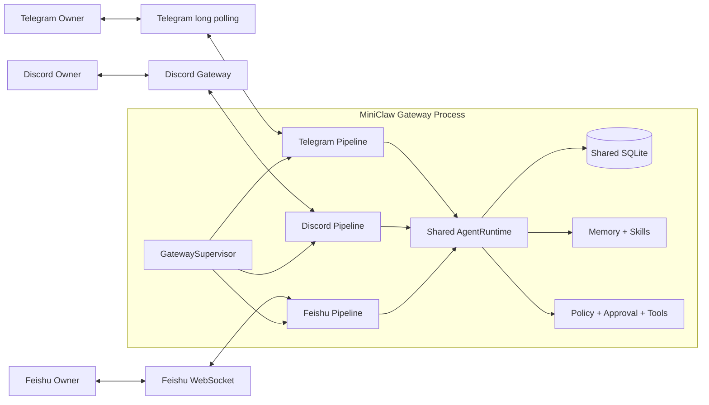
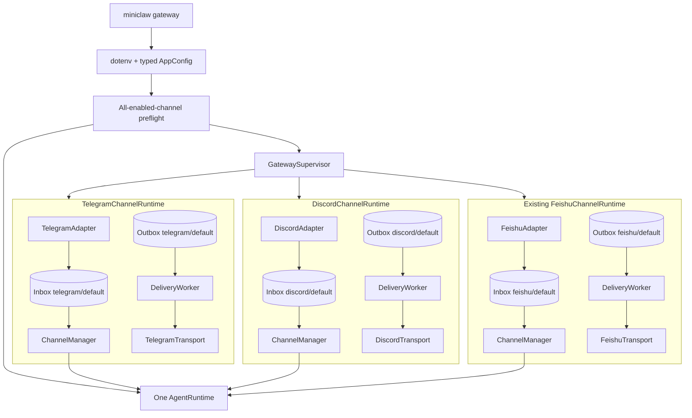
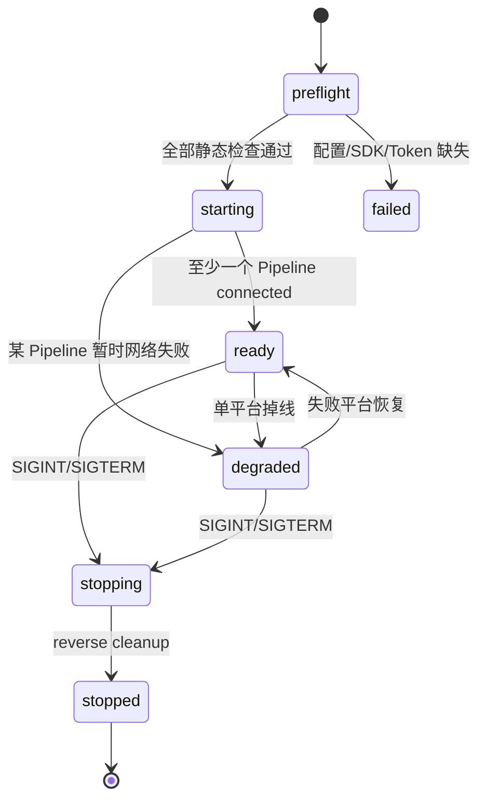
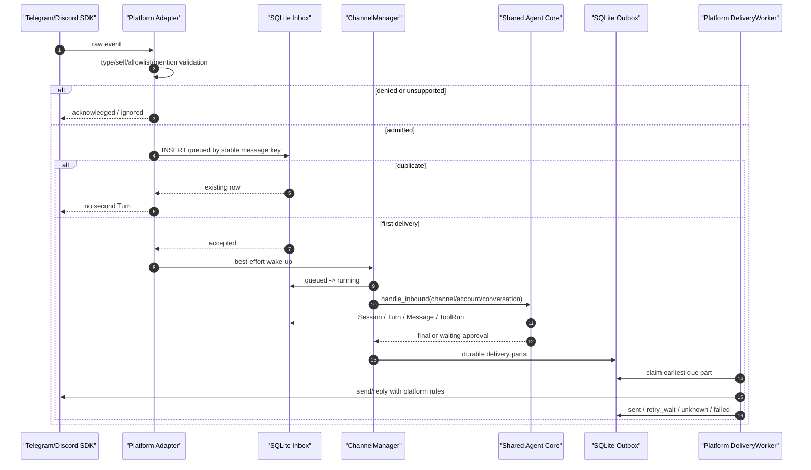
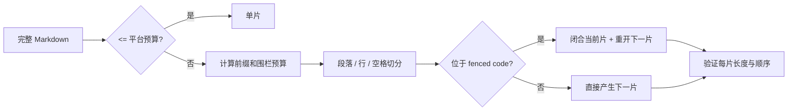

# Phase 5：Telegram 与 Discord 多 Channel 工程设计

> 日期：2026-08-08
>
> 状态：设计已批准，implementation pending
>
> 前置基线：Phase 4 implementation PASS；真实飞书 live acceptance 因本机无企业应用凭据而 PENDING
>
> 目标版本：v0.5.0
>
> 入口：`miniclaw gateway`

## 1. 一句话说明

Phase 5 要让 Telegram、Discord 和飞书同时接入同一个 MiniClaw。三个平台各自负责收发消息、限流和重连，
背后只存在一个 AgentRuntime、一份 SQLite、一个 Owner、一套 Memory/Skills/Policy/Approval。任何一个平台故障，
不能拖垮另外两个平台，也不能绕过 Agent Core 的安全边界。

## 2. 大白话目标

这不是给 Telegram 和 Discord 各写一个“收到消息就请求模型”的脚本。真正要交付的是三条可以长期运行的生产管线：

1. 平台消息先经过白名单、群聊 mention、机器人消息和类型检查；
2. 通过检查的消息先进入 SQLite Inbox，再由有限 Worker 调用 Agent；
3. Agent 的最终回复先进入 SQLite Outbox，再由平台 DeliveryWorker 发送；
4. 重复事件不产生第二个 Turn，进程重启可以找回 queued 消息；
5. Typing 和流式预览是 best effort，失败不能影响最终 durable 回复；
6. 危险 Tool 继续走同一个 Core Approval，平台按钮只是展示层；
7. Telegram、Discord、飞书共享长期记忆和 Skills，但各自保留独立会话历史。



## 3. 当前仓库事实与必须解决的问题

Phase 4 已经提供了可复用的生产骨架：

- `channels/base.py`：标准入站、出站和 Transport 契约；
- `storage/channels.py`：通用 Identity、Inbox 和 Outbox；
- `channels/manager.py`：数据库先行、有界 Worker、会话串行和重启恢复；
- `channels/delivery.py`：分片、稳定幂等键、retry/unknown/failed；
- `channels/observability.py`：correlation、短哈希、JSON 日志和 durable Audit；
- `runtime.py`：唯一 TurnService、Tool、Memory、Skills 和 Policy；
- `gateway.py`：信号、启动、反向清理和飞书生产装配。

但是 Phase 5 不能直接复制 `feishu.py`，因为当前仍有四个飞书特化边界：

1. `gateway.py` 只验证和装配一个 Feishu Pipeline；
2. `runtime.create_channel_manager()` 把 `channel="feishu"` 和飞书预算写死；
3. `ChannelCapabilities` 使用 `add_typing/send_card/update_card`，名称和 payload 都偏向飞书；
4. `ChannelApprovalController` 和持久化 Approval payload 内含飞书卡片 JSON；
5. `DeliveryWorker` 的兜底错误码仍存在 `feishu_*` 前缀。

Phase 5 必须先把这些边界收敛成平台无关接口，再接入两个新 Transport。只新增两个巨型 Adapter 文件但保留上述
耦合，不算完成。

## 4. 需求来源与冲突处理

优先级如下：

1. 用户确认：先写完整文档，再同时实现 Telegram 和 Discord；
2. `docs/product/20260807_产品需求文档.md`：两个平台复用统一消息模型和 Channel Adapter；
3. `docs/superpowers/specs/2026-08-07-miniclaw-complete-engineering-design.md`：long polling、Discord
   Gateway、白名单、mention、Typing、流式编辑、分片和限流；
4. Phase 4 已验证实现：durable Inbox/Outbox、Worker、Approval、Observer 和 Gateway 生命周期；
5. 本设计：解决现有实现与 Phase 5 之间的具体接口冲突。

若旧总设计与已验证 Phase 4 实现冲突，以不破坏当前安全和恢复语义为前提。本阶段不恢复已经删除的 `chat` CLI，
也不创建第二套 Agent Loop。

## 5. 完整范围

### 5.1 必须交付

- Telegram：`python-telegram-bot` long polling，无公网 webhook；
- Discord：`discord.py` Gateway；
- 两个平台的私聊文本、群聊白名单、明确 mention 或 reply-to-bot；
- 忽略 bot/webhook/self 消息，避免回复循环；
- 严格 numeric user/chat/guild/channel allowlist；
- 标准 `InboundMessage`，不把 SDK event 传进 Core；
- Update/message ID 业务幂等和 durable Inbox；
- 每个平台独立 Manager、DeliveryWorker、Transport 和恢复状态；
- 一个 GatewaySupervisor 管理所有 enabled Channel；
- 一个共享 AgentRuntime、Provider、Memory、Skills、Policy 和 SQLite；
- Telegram Chat Action、Discord Typing；
- 两个平台的有界流式预览编辑，最终回复仍以 durable Outbox 为准；
- 4096/2000 字符预算下的 Markdown/代码围栏安全分片；
- 平台限流和 retry-after 映射；
- Approval 文本命令，以及平台按钮可用时的交互展示；
- Channel 通用 Observer、稳定错误码和故障隔离；
- 配置、可选依赖、Doctor、回归场景、local soak 和 live harness；
- README、PRD、架构、工程索引、运行手册、release record 和进度页同步。

### 5.2 明确不做

- Telegram webhook、Discord HTTP interaction server 或公网入站端口；
- 图片、文件、贴纸、语音、视频、reaction 指令和富媒体理解；
- 公开群机器人、陌生人临时访问、多用户或访客模式；
- 自动加入群、自动邀请用户、私信非白名单用户；
- Telegram MarkdownV2/Discord embed 的完整富文本渲染器；
- 跨平台共享同一短期 Conversation；
- Channel 插件市场、动态 Python 插件加载或远程代码；
- 自动创建 Bot、自动修改平台权限或自动填充 Token；
- 自动修改/部署 MiniClaw 源码；
- Phase 6 Evolution 和 Phase 7 容器/系统服务部署。

## 6. 技术方案比较

### 6.1 单进程、共享 Core、独立 Pipeline（采用）

一个进程只创建一个 AgentRuntime；每个平台创建独立的 Adapter、Transport、ChannelManager 和 DeliveryWorker。
优点是个人 Agent 的身份、记忆和工具真正统一，同时平台网络故障可以隔离。代价是 GatewaySupervisor 必须拥有清晰
的组件生命周期和降级状态。

### 6.2 每个平台一个进程

网络隔离最强，但会产生三个 Provider 客户端、三套内存级 Session grant、SQLite 多进程协调和重复模型并发预算。
这与“一个个人 Agent”相违背，本阶段不采用。

### 6.3 先做通用插件框架

可以为未来 Slack/Teams 扩展，但需要动态发现、版本兼容、配置 schema 和隔离执行等额外系统。Phase 5 只有两个明确
平台，先抽取最小稳定接口即可，不采用插件框架。

## 7. 总体架构与责任边界



| 组件 | 只负责 | 明确不负责 |
| --- | --- | --- |
| Platform Adapter | SDK event → 标准消息、白名单和 mention | SQLite、模型、Tool、发送重试 |
| Platform Transport | connect/disconnect/send/typing/progress | Agent 推理、身份合并、持久队列 |
| ChannelManager | Inbox、Worker、Turn、Approval 路由、Outbox 创建 | SDK event 解析、Token、平台限流 |
| DeliveryWorker | claim、发送、retry、unknown、终态 | 重新运行 Agent、修改 Approval |
| GatewaySupervisor | enabled Channel 装配、生命周期、隔离和 readiness | 平台业务消息解析 |
| AgentRuntime | Provider、Memory、Skills、Policy、Tools | 渠道 SDK 和平台 ID 规则 |
| SQLite | 唯一 durable truth | 网络连接和内存 wake-up |

## 8. 文件与模块地图

计划创建：

```text
src/miniclaw/channels/
├── telegram.py          # Telegram event view、Adapter、Transport、错误映射
├── discord.py           # Discord event view、Adapter、Transport、错误映射
├── experience.py        # 平台无关 Typing / progress preview 接口与活动状态
└── supervisor.py        # 多 Channel runtime bundle 与生命周期监督

src/miniclaw/evals/
└── multi_channel.py     # Telegram/Discord 确定性纵切 fixture

scripts/
├── telegram_live_smoke.py
└── discord_live_smoke.py

tests/
├── test_telegram_adapter.py
├── test_telegram_transport.py
├── test_discord_adapter.py
├── test_discord_transport.py
├── test_channel_supervisor.py
├── test_channel_experience.py
└── test_multi_channel_evals.py
```

计划修改：`config.py`、`runtime.py`、`gateway.py`、`doctor.py`、`channels/capabilities.py`、
`channels/approvals.py`、`channels/delivery.py`、`cli.py`、`.env.example`、`pyproject.toml`、回归数据和文档。

文件边界必须保持小而明确。不得把 Telegram、Discord 和 Feishu 三套 SDK 逻辑堆进 `gateway.py`。

## 9. 公共 Channel 契约

现有 `InboundMessage`、`OutboundMessage`、`IgnoredInbound`、`SendReceipt` 和 `ChannelTransport` 继续作为 Core
边界。Phase 5 只允许增加真正跨平台的能力契约：

```python
@dataclass(frozen=True, slots=True)
class ChannelLimits:
    channel: str
    account_id: str
    queue_size: int
    worker_count: int
    message_max_chars: int
    progress_update_interval: float


class ChannelExperienceTransport(Protocol):
    async def start_typing(self, event: StoredInboundEvent) -> str | None: ...
    async def stop_typing(self, token: str | None) -> None: ...
    async def create_progress(
        self,
        event: StoredInboundEvent,
        text: str,
        *,
        idempotency_key: str,
    ) -> SendReceipt: ...
    async def update_progress(
        self,
        platform_message_id: str,
        text: str,
        *,
        incomplete: bool,
        completed: bool,
    ) -> SendReceipt: ...
```

这些接口表达“用户体验意图”，而不是 Feishu Card、Telegram Message 或 Discord View。平台 payload 只能在
concrete Transport 内构造。

## 10. 强类型配置

### 10.1 TOML 目标形状

```toml
[channels.feishu]
enabled = false
account_id = "default"
app_id_env = "MINICLAW_FEISHU_APP_ID"
app_secret_env = "MINICLAW_FEISHU_APP_SECRET"
owner_open_id = ""
allowed_open_ids = []
allowed_chat_ids = []
allow_group_mentions = false

[channels.telegram]
enabled = false
account_id = "default"
bot_token_env = "MINICLAW_TELEGRAM_BOT_TOKEN"
owner_user_id = 0
allowed_user_ids = []
allowed_chat_ids = []
allow_group_mentions = false
queue_size = 64
worker_count = 2
message_max_chars = 4096
progress_update_interval = 0.8

[channels.discord]
enabled = false
account_id = "default"
bot_token_env = "MINICLAW_DISCORD_BOT_TOKEN"
owner_user_id = 0
allowed_user_ids = []
allowed_guild_ids = []
allowed_channel_ids = []
allow_guild_mentions = false
queue_size = 64
worker_count = 2
message_max_chars = 2000
progress_update_interval = 1.0
typing_renew_interval = 8.0
```

### 10.2 校验规则

- 所有未知 section/key 拒绝；布尔值不能冒充整数；
- `account_id` 继续使用 `[a-z0-9][a-z0-9_-]{0,31}`；
- Telegram user ID 必须为正整数，chat ID 允许负整数；
- Discord user/guild/channel ID 必须为正整数且不超过 unsigned 64-bit；
- enabled 时 Owner 必须非零，并且必须位于 allowed user IDs；
- 开启群聊/guild mention 时必须存在 chat/guild/channel allowlist；
- `queue_size`、`worker_count`、字符预算和时间间隔必须在代码规定的有界范围；
- Token 变量名进入 AppConfig，Token 值只存在于进程环境和短生命周期 credentials；
- 配置错误必须在任何平台网络请求、数据库业务写入和 Provider 创建前失败；
- disabled Channel 不要求安装 SDK，也不要求 Token。

### 10.3 可选依赖

```toml
[project.optional-dependencies]
telegram = ["python-telegram-bot>=21,<23"]
discord = ["discord.py>=2.4,<3"]
channels = [
  "lark-channel-sdk>=1.2,<2",
  "python-telegram-bot>=21,<23",
  "discord.py>=2.4,<3",
]
```

SDK 必须延迟导入。安装 Telegram extra 不应成为运行 TUI 或飞书 Gateway 的前提。

## 11. 统一身份、会话与跨渠道边界

`channel_identities` 已使用 `(channel, account_id, external_user_id)` 唯一键，Phase 5 不按用户名、昵称或显示名
合并身份。白名单命中的平台 ID 自动绑定唯一 Owner；同一外部 ID 已绑定其他本地用户时 fail closed。

Session 键保持：

```text
(owner_id, channel, account_id, external_conversation_id)
```

因此：

- Owner 在 Telegram、Discord、飞书共享长期 Memory/Skills；
- 三个平台的短期对话历史互不污染；
- Telegram DM、群、forum topic 使用不同 conversation key；
- Discord DM、Guild channel、Thread 使用不同 conversation key；
- 同一平台同一 Conversation 严格串行，不同 Conversation 可并发；
- 外部用户 ID 永远不进入 Prompt，只用于身份绑定和 Owner gate。

## 12. GatewaySupervisor

### 12.1 预检

`miniclaw gateway` 的新语义是启动全部 enabled Channels：

1. 加载私密 `.env`；
2. 解析完整 AppConfig；
3. 收集 enabled Channels，空集合返回配置错误；
4. 一次性校验所有 enabled Channel 的 Token 名、Owner、白名单和 SDK；
5. 任一静态配置失败时，在联网前退出，避免半配置运行；
6. 预检通过后只创建一个 AgentRuntime；
7. 为每个平台构建独立 `ChannelRuntime`。

### 12.2 生命周期



静态错误是 fatal；运行期网络错误是 isolated。一个合法配置的平台断线时，它自己的 Transport 按 SDK/平台语义
重连，其他 Pipeline 继续处理。若所有 enabled Pipeline 均处于长期失败状态，进程保持可诊断 degraded 状态，
由健康检查和日志报告，而不是循环创建新 AgentRuntime。

### 12.3 启停顺序

每个 Pipeline 的启动顺序仍为：Transport connect → Delivery start → Manager start。停止顺序为：停止接收 →
Manager 有界 drain → Delivery stop → Transport disconnect。Supervisor 在一个 Channel 清理失败时继续清理其余
Channel 和共享 Runtime；第二个终止信号只取消当前阻塞清理。

ready 日志只输出本地逻辑名，例如：

```text
MiniClaw gateway ready: feishu/default, telegram/default, discord/default
```

不得输出 Token、Bot ID、Owner ID、Chat/Guild/Channel ID。

## 13. Telegram 设计

### 13.1 Transport

- 使用 `python-telegram-bot` Application long polling；
- 不启用 webhook，不监听公网端口；
- 启动时 `get_me()` 校验 Token 并只在内存保存 bot user ID/username；
- allowed updates 仅包含新文本 message，不消费 edited/channel post；
- SDK 管理 polling offset；MiniClaw 仍按业务 message key 去重；
- `stop_receiving()` 先停止 updater，再由 Supervisor drain；
- SDK 原始 Update 不进入 SQLite、日志或 Agent Core。

### 13.2 标准化

| 标准字段 | Telegram 来源 |
| --- | --- |
| `event_id` | `update.update_id` |
| `message_id` | `chat.id + message.message_id` 的稳定组合 |
| `external_user_id` | `from_user.id` |
| `external_conversation_id` | DM/group 为 chat ID；forum topic 加 thread ID |
| `chat_type` | private → `p2p`；group/supergroup → `group` |
| `reply_to_message_id` | 当前 message key |
| `received_at` | Telegram UTC message time |

私聊要求 sender 位于 allowed users。群聊同时要求 sender、chat 白名单，以及满足以下任一条件：

- 文本明确 `@bot_username`；
- 当前消息 reply 的目标由本 Bot 发出。

所有 bot sender、service message、空文本、过长 ID、缺失字段和不支持类型静默忽略并记录稳定 reason。只删除
明确指向 Bot 的 mention token，不删除普通 `@someone` 或用户正文。

### 13.3 发送、Typing 与预览

- 最终普通文本使用 `send_message(parse_mode=None)`，避免 MarkdownV2 注入/转义失败；
- 第一片 reply 原始消息，后续片按顺序发送到同一 chat/topic；
- `allowed_mentions` 不适用于 Telegram，正文中的 @ 只作为普通文本发送；
- Typing 使用 `send_chat_action(typing)`，失败是 best effort；
- 第一段公开 delta 创建带 `⏳` 的预览消息；
- 后续 `edit_message_text` 最快每 800 ms 一次；
- 成功结束时预览改为“✅ 回复完成，最终内容见下一条消息”；
- 失败时预览标记“⚠️ 回复未完成”；
- 无论预览成功与否，最终回答必须创建 durable Outbox Delivery。

### 13.4 限流和错误

- Telegram `RetryAfter` 使用平台秒数并映射 `telegram_rate_limited`；
- `TimedOut` 在无法确认发送结果时映射 `telegram_delivery_unknown`；
- 临时网络错误映射 retryable；
- Forbidden/Unauthorized 映射 terminal auth/permission code；
- 重试复用同一 Outbox idempotency key，但 Telegram API 不提供原生 client UUID，因此 unknown 可能产生平台级
  重复，必须在运维文档明确该限制；
- 不能通过清空 Inbox/Outbox 掩盖重复发送。

## 14. Discord 设计

### 14.1 Gateway 与 Intents

- 使用 `discord.py` Gateway，不启动 interaction HTTP server；
- 启用 guilds、dm_messages、guild_messages；
- 为读取自然语言正文，必须启用 `message_content` privileged intent，这是唯一必要 privileged intent；
- 不启用 members、presences、voice_states；
- Developer Portal 未开启 Message Content Intent 时 Doctor/启动提示明确配置错误；
- SDK 自动处理 heartbeat 和基础 reconnect，MiniClaw 观测 connecting/connected/reconnecting/disconnected。

### 14.2 标准化

| 标准字段 | Discord 来源 |
| --- | --- |
| `event_id` | message snowflake ID |
| `message_id` | message snowflake ID |
| `external_user_id` | author snowflake ID |
| `external_conversation_id` | DM channel、Guild channel 或 Thread snowflake ID |
| `chat_type` | DM → `p2p`；Guild/Thread → `group` |
| `reply_to_message_id` | 当前 message snowflake ID |
| `received_at` | snowflake timestamp / aware UTC |

DM 要求 sender 白名单。Guild/Thread 消息要求 sender 白名单、Guild 和 Channel/parent allowlist，并满足：

- 明确 mention 当前 Bot；
- reply 的目标由当前 Bot 发出；
- 已允许 Thread 中回复 Bot 创建的消息。

忽略 `author.bot`、webhook、system message、空正文和不支持类型。清理 mention 后若正文为空则忽略。SDK object
只能在 callback 内读取，不进入持久层。

### 14.3 发送、Typing 与预览

- 最终文本使用普通 message，不自动生成 Embed；
- 发送时使用 `AllowedMentions.none()`，防止模型正文触发 `@everyone`、角色或用户通知；
- 第一片 reply 原消息，后续片在同一 Channel/Thread 顺序发送；
- Typing Context 每 8 秒续期，Turn 完成或取消时停止；
- 第一段公开 delta 创建带 `⏳` 的预览消息；
- 后续 edit 最快每 1 秒一次；
- 成功/失败终态与 Telegram 一致，最终回答仍来自 durable Outbox；
- 预览消息不是 Tool trace，不显示 reasoning、参数、系统 Prompt 或隐藏内容。

### 14.4 限流和错误

- 优先让 `discord.py` 使用 route bucket 限流；
- HTTP 429/retry_after 映射 retryable `discord_rate_limited`；
- 连接关闭按 close code 分为 reconnectable、auth_failed、intent_denied；
- 发送超时且结果未知时标记 `discord_delivery_unknown`；
- 403/404 根据操作映射 permission/not_found terminal code；
- SDK 异常正文、route、Token 和 raw response 不进入日志或 SQLite。

## 15. 入站消息生命周期



Callback 的成功含义是“消息已经安全忽略或持久化”，不是“Agent 已回答”。callback 不等待模型调用。

## 16. 分片与 Markdown 边界

平台硬限制：Telegram 4096 字符、Discord 2000 字符。配置不能超过硬限制。分片器按以下优先级切分：

1. Markdown 代码围栏之外的段落边界；
2. 换行；
3. 空格；
4. Python Unicode code point 边界。

每片需要预留 `[i/n] ` 前缀。若必须在 fenced code block 内切分，当前片补闭合围栏，下一片重新打开并保留有限
语言标记。合成围栏不计入原文重建，但必须计入平台字符预算。任何单片不得超过配置上限，emoji 和组合字符不能被
UTF-8 字节截断。



## 17. 平台无关 Typing 与流式预览

现有 `ChannelCapabilities` 改名/迁移为平台无关 Experience 层。活动状态只消费 `model_text_delta`，明确忽略：

- Provider reasoning；
- Tool name、arguments、result；
- System Prompt、Memory 原文和 Skill 正文；
- Approval 绑定 hash；
- SDK raw event 和异常正文。

预览最多保留配置的可见字符，更新有最小间隔。create/update/finish 任一失败后，本 Turn 永久关闭预览，但继续
Agent 和最终 Outbox。Typing 与预览永远不能成为 Turn 成败条件。

## 18. Approval 跨平台设计

### 18.1 Core 仍是唯一权威

Owner、TTL、参数 hash、grant mode、一次消费、Session/Always 规则继续由 Core Repository 和 TurnService 决定。
Channel 只能请求 `presentation()` 和 `continue_approval()`。

### 18.2 中立 payload

Phase 4 v1 payload 保存 Feishu Card。Phase 5 改为 v2 中立 envelope：

```json
{
  "version": 2,
  "approval_id": 42,
  "tool_name": "run_command",
  "safe_summary": "运行已绑定的本地命令",
  "grant_modes": ["once", "session"],
  "fallback_text": "/approve 42 once|session，或 /deny 42"
}
```

不保存原始 Tool 参数。Feishu/Telegram/Discord 在发送时各自渲染按钮；平台不支持或按钮失败时使用同一 fallback
文本。解析器兼容已经持久化的 v1 payload：v1 在非飞书 Channel 只使用 fallback，不尝试解释飞书 JSON。

### 18.3 文本与按钮

- `/approve <id> once|session|always` 和 `/deny <id>` 在三个 Channel 统一支持；
- Telegram InlineKeyboard callback data 必须短、固定 schema、一次解析；
- Discord View custom_id 必须包含有限 action/id/decision，不包含参数或 hash；
- callback actor 必须等于当前 Channel 的 Owner external ID；
- callback 超时、重复、篡改或非 Owner 均 fail closed；
- Channel 错误提示只使用稳定中文文案，不回显 Core 异常正文。

## 19. 故障隔离与恢复

| 故障 | 正确行为 |
| --- | --- |
| Telegram polling 掉线 | Telegram reconnecting；Discord/Feishu 继续 |
| Discord Gateway resume 失败 | Discord 重新 identify；其他 Channel 继续 |
| 某 Channel callback 抛错 | 记录稳定码，不终止 SDK event loop |
| Manager queue 满 | 消息已在 SQLite；feeder 稍后找回 |
| 进程在 queued 后崩溃 | 重启重新 claim |
| 进程在 running Tool 中崩溃 | 标记 interrupted/failed，不盲目重放副作用 |
| Delivery 在发送中取消 | 标记 unknown，保留相同 idempotency key |
| Typing/preview 失败 | 关闭体验能力，最终 Outbox 继续 |
| Audit SQLite 写失败 | JSON 标记 `audit_persisted=false`，业务 Channel 继续 |
| 单个平台权限撤销 | 该平台 terminal/degraded，其他平台继续 |
| 共享 Provider 失败 | 各 Turn 写安全失败；Gateway 与 Inbox Worker 继续服务后续消息 |

跨平台隔离不代表每个平台创建独立 Core。共享 Provider 的全局故障会影响当时的 Turn，但不能杀死 Gateway 任务或
破坏其他平台的持久消息。

## 20. 并发、背压与公平性

每个平台有独立 `queue_size`、`worker_count` 和 Conversation lock。Telegram 的大量消息不能占满 Discord 的内存
wake-up queue。SQLite 是共享事实源，但每次事务必须短；Agent 网络调用期间不持有事务。

首版不做复杂全局调度器。Provider 并发上界为所有 enabled Channel worker_count 之和，Doctor 在总数过大时 WARN。
默认三平台各 2 Worker，个人部署最多 6 个并发 Conversation。后续若真实数据证明需要全局 semaphore，再单独设计，
不在 Phase 5 提前加入不可验证的调度框架。

## 21. 稳定错误码

错误码不得包含 Token、URL、route、平台响应正文、ID 或用户文本。

| 平台 | 示例稳定码 |
| --- | --- |
| 通用 | `channel_config_invalid`、`channel_delivery_unknown`、`channel_send_failed` |
| Telegram | `telegram_auth_failed`、`telegram_rate_limited`、`telegram_poll_failed`、`telegram_permission_denied` |
| Discord | `discord_auth_failed`、`discord_intent_denied`、`discord_rate_limited`、`discord_gateway_closed` |

DeliveryWorker 只根据 `retryable`、`unknown` 和 max attempts 做状态迁移，不再自行制造 `feishu_*` 默认码。
concrete Transport 负责将 SDK 错误映射为平台码；未知 Python 异常在边界压缩为通用安全码。

## 22. 可观测性

所有 Channel 使用同一个 `ChannelObserver` schema：

```json
{
  "event_type": "channel.delivery.retry_wait",
  "channel": "telegram",
  "account_id": "default",
  "correlation_id": "本地派生短值",
  "external_message_hash": "短哈希",
  "conversation_hash": "短哈希",
  "attempts": 2,
  "error_code": "telegram_rate_limited",
  "audit_persisted": true
}
```

允许：本地 row/session/turn/delivery ID、短哈希、毫秒耗时、计数、枚举状态和稳定错误码。

禁止：消息正文、完整 user/chat/guild/channel/message ID、Bot Token、App Secret、Authorization、SDK raw event、
Provider hidden reasoning、Tool 原始参数和异常正文。

Supervisor 增加 `channel.supervisor.ready/degraded/stopping` 事件，但不记录 credentials 或完整平台身份。

## 23. 安全模型

### 23.1 Admission fail closed

- 缺失 sender/chat/guild/channel/message ID 直接忽略；
- 白名单、群聊开关和 mention/reply 必须全部满足；
- bot、webhook、self 和 unsupported content 不能进入 Inbox；
- 平台显示名、用户名和昵称不参与授权；
- mention 清洗只处理精确 Bot identity；
- callback 不直接执行 Tool，只能进入 Core continuation。

### 23.2 出站安全

- Discord 永久关闭模型生成 mention；
- Telegram 首版不用 MarkdownV2 parse mode；
- SDK payload 只从有限字段构建；
- 分片、预览和按钮都有字符/字段上限；
- unknown Delivery 不伪装 sent；
- 平台发送失败不能把正文写进错误详情或日志。

### 23.3 Secret 边界

- `.env` 必须为 owner-only regular file；
- Token 只从配置指定的环境变量读取；
- dataclass `repr` 只显示 `configured=True`；
- Doctor 只显示 present/missing，不连接平台；
- tests、fixtures、release record 和 progress HTML 不包含真实 Token/ID；
- Git staged diff 和生成的 live evidence 必须通过 Secret scan。

## 24. Doctor 设计

Doctor 保持只读、离线，不调用 `get_me()` 或 Discord login。它报告：

| 检查 | disabled | enabled 且正确 | 错误 |
| --- | --- | --- | --- |
| `telegram_config` | PASS disabled | PASS allowlist ready | FAIL 配置关系 |
| `telegram_sdk` | PASS not required | PASS importable | FAIL 安装 extra |
| `telegram_runtime` | PASS not started | PASS Token present | FAIL Token missing |
| `discord_config` | PASS disabled | PASS allowlist/intents ready | FAIL 配置关系 |
| `discord_sdk` | PASS not required | PASS importable | FAIL 安装 extra |
| `discord_runtime` | PASS not started | PASS Token present | FAIL Token missing |
| `channel_database` | schema/表/index ready | 同左 | FAIL schema mismatch |

Doctor 明确区分“本地变量存在”和“平台认证成功”。真实 `get_me()/login` 只属于 live smoke。

## 25. 测试策略

### 25.1 配置和公共契约

- disabled 不需要 Token/SDK；enabled 必须 Owner/白名单/Token；
- Telegram signed chat ID 和 Discord snowflake 边界；
- unknown key、bool-as-int、重复 ID、非法预算拒绝；
- ChannelLimits 和 runtime bundle 不携带 Secret；
- Gateway 空 Channel、单 Channel、三 Channel 组合。

### 25.2 Telegram Adapter/Transport

- 私聊允许/拒绝；
- 群 mention、reply bot、无 mention、非允许 chat；
- bot/service/edited/non-text 忽略；
- composite message key 和 forum topic；
- `get_me()`、polling connect/stop；
- send/reply/edit/typing；
- RetryAfter/TimedOut/Forbidden 稳定映射；
- raw Update、Token、正文不进入 repr/log。

### 25.3 Discord Adapter/Transport

- DM 允许/拒绝；
- Guild mention、reply/thread、无 mention、非允许 guild/channel；
- bot/webhook/system/non-text 忽略；
- intents 精确集合；
- Gateway connect/disconnect/resume；
- send/reply/edit/typing 和 AllowedMentions.none；
- 429/403/close code 稳定映射；
- SDK object、Token、正文不进入 repr/log。

### 25.4 Supervisor 和恢复

- 全部静态错误发生在 Runtime/网络创建前；
- 三 Pipeline 只共享一个 AgentRuntime；
- 启动/停止顺序；
- 单 Channel 运行期失败不取消其他任务；
- 第二信号清理；
- queued/running/waiting/sending/unknown 恢复；
- Observer/Audit 失败不改变业务状态。

### 25.5 版本化 Channel 场景

Phase 5 至少新增 20 条 active Channel cases：

| Telegram ID | 场景 |
| --- | --- |
| `TELEGRAM-DM-001` | Owner 私聊 |
| `TELEGRAM-GROUP-001` | 允许群 mention |
| `TELEGRAM-GROUP-002` | 无 mention/非白名单忽略 |
| `TELEGRAM-REPLY-001` | reply-to-bot admitted |
| `TELEGRAM-DEDUPE-001` | composite message ID 去重 |
| `TELEGRAM-TOOL-001` | 只读 Tool 共用 Policy |
| `TELEGRAM-APPROVAL-001` | approve/deny 共用 Core |
| `TELEGRAM-DELIVERY-001` | 4096 分片和 retry-after |
| `TELEGRAM-RESTART-001` | queued/unknown 恢复 |
| `TELEGRAM-ISOLATION-001` | Telegram 故障不影响 Discord fake |

| Discord ID | 场景 |
| --- | --- |
| `DISCORD-DM-001` | Owner DM |
| `DISCORD-GUILD-001` | 允许 Guild mention |
| `DISCORD-GUILD-002` | 无 mention/非白名单忽略 |
| `DISCORD-THREAD-001` | reply/thread admitted |
| `DISCORD-DEDUPE-001` | snowflake 去重 |
| `DISCORD-TOOL-001` | 只读 Tool 共用 Policy |
| `DISCORD-APPROVAL-001` | approve/deny 共用 Core |
| `DISCORD-DELIVERY-001` | 2000 分片和 rate limit |
| `DISCORD-RESTART-001` | queued/unknown 恢复 |
| `DISCORD-ISOLATION-001` | Discord 故障不影响 Telegram fake |

已有 12 条 Feishu Channel case 必须继续通过。Phase 5 完成时 Channel suite 至少是 32/32，不能删除旧场景换取
新数字。

### 25.6 Local soak

```bash
uv run miniclaw eval run --suite channel --repeat 20 --root evals/scenarios
```

至少执行 20 轮完整 32-case matrix，即 640 个本地纵切检查。它证明状态机和故障隔离可重复，不证明真实平台
Token、权限、限流和 Gateway 网络。

### 25.7 真实验收

每个有凭据的平台执行：

1. auth/get_me/login ready；
2. 私聊连续 20 轮；
3. group/guild mention 与无 mention；
4. reply/thread；
5. Memory 跨重启；
6. 只读 Tool；
7. 需审批 Tool approve 和 deny；
8. 非 Owner 不能批准；
9. 重复事件不产生第二次回复；
10. 长中文/emoji/代码块分片；
11. rate limit/retry-after；
12. Gateway 重启恢复；
13. 断网重连；
14. preview/typing 失败后最终文本仍到达；
15. 日志和 evidence Secret scan 为零。

用户当前没有 Telegram，因此 Telegram 可以达到 implementation gate PASS，但真实 Telegram live gate 必须保持
PENDING，直到用户、另一名维护者或 CI Secret 完成验收。不能用 Discord live 或 fake Telegram 测试代替。

## 26. Live harness

`telegram_live_smoke.py` 和 `discord_live_smoke.py` 必须：

- 默认拒绝运行，要求显式 `--confirm-live`；
- 不主动给任何用户/群发消息；
- 先跑 Doctor/preflight；
- 只提示人工在另一个终端启动 Gateway 并发送规定消息；
- 只记录 pass/fail/skip、commit、计数、时间和数据库状态计数；
- 输出写入 Git ignored `.local/eval-results/<channel>/`；
- 不保存 Token、完整 ID、消息正文、群名、用户名或截图；
- 任一 skip/fail 返回非零。

## 27. 实施切片

1. 强类型 Telegram/Discord config、extras、`.env.example` 和 Doctor RED→GREEN；
2. 抽取平台无关 Channel limits、Manager factory 和错误码；
3. Approval v2 中立 envelope 与 v1 兼容；
4. Experience/Capabilities 平台无关化，确保 Feishu 回归不变；
5. Telegram Adapter RED→GREEN；
6. Telegram Transport、Delivery、Typing、preview RED→GREEN；
7. Discord Adapter RED→GREEN；
8. Discord Transport、Delivery、Typing、preview RED→GREEN；
9. GatewaySupervisor 与单 Runtime/多 Pipeline 故障隔离 RED→GREEN；
10. 20 条版本化场景、32-case gate 和 640-check local soak；
11. live harness、运行手册、故障排查和 release record；
12. 全量测试、Ruff、build、文档、Secret scan、main push 和远端核验。

每一切片必须先有真实 RED，再写最小 GREEN；每个可独立评审意图使用中英各半 commit 标题。

## 28. 发布门禁

Phase 5 implementation gate 同时要求：

1. 本设计、实施计划、工程文档和代码一致；
2. Telegram/Discord Adapter、Transport、Experience、Approval、Supervisor 全部落地；
3. Feishu 功能和 12 条旧 Channel cases 无回归；
4. 全仓 Python、TypeScript、24 条 Agent 和至少 32 条 Channel cases 100% 通过；
5. 20 轮 local Channel soak 至少 640/640；
6. Ruff、wheel/sdist、文档链接、Mermaid、HTML、diff check 和 Secret scan 通过；
7. Doctor 正确区分 disabled/misconfigured/locally ready；
8. README、PRD、系统架构、工程索引、运行指南、release record 和进度页同步；
9. mixed CN/EN commits 推送 `main` 并核验 `origin/main`；
10. 没有凭据的平台明确写 `LIVE PENDING`。

Phase 5 production verified 还必须要求 Telegram 和 Discord 各自通过 15 项真实验收。只有一方有凭据时，只能写该
平台 live PASS，另一方保持 PENDING。

## 29. 完成度口径

| 状态 | 含义 |
| --- | --- |
| DESIGN READY | 本文档已批准，但生产代码尚未实现 |
| IMPLEMENTATION PASS | 代码、fake SDK、全量回归、local soak 和文档通过 |
| LIVE PARTIAL | 只有一个新平台真实验收通过 |
| PRODUCTION VERIFIED | Telegram、Discord 两个平台真实验收均通过 |

实现复核（2026-08-08）：合并 Personal Machine 权限后的当前标记为 **IMPLEMENTATION PASS / LIVE PENDING**。
483 Python、27 TypeScript、28/28 Agent、32/32 Channel 与 640/640 local soak 已通过；Telegram/Discord 真实
15 项验收均未执行。

## 30. 文档同步清单

实现期间必须同步：

- `README.md`：安装 extras、配置、Gateway 和回归命令；
- `.env.example`：两个 Token 变量名，值留空；
- `docs/product/20260807_产品需求文档.md`：Phase 5 真实状态；
- `docs/architecture/20260807_系统架构.md`：Supervisor 与三 Pipeline；
- `docs/engineering/README.md`：Phase 5 文档入口；
- `docs/engineering/phase-5/`：模块、运行、测试、排障和完成性审计；
- `docs/getting-started/20260807_本地运行指南.md`：Bot 创建与本地启动；
- `docs/evals/releases/v0.5.0.md`：implementation/live 证据；
- `docs/progress/index.html` 和外部 progress HTML：准确进度与门禁数字；
- `AGENTS.md`：只有工程规范确实变化时才修改。

## 31. 参考资料与参考原则

- MiniClaw Phase 4 已验证 Channel 实现：优先复用状态机和安全边界；
- `python-telegram-bot` 官方文档：Application、long polling、RetryAfter、ChatAction；
- `discord.py` 官方文档：Client/Bot、Intents、Gateway、AllowedMentions、Typing；
- nanobot：参考多 Channel 目录和轻量装配，不复制安全较弱的直连模型路径；
- RayClaw：参考平台 Adapter 隔离和统一 Channel 思想；
- ZeroClaw：参考单进程生命周期、审批和故障边界；
- OpenClaw/openclaw-python：参考产品语义和能力映射，不复制未验证的全量框架。

技术实现时只以官方 SDK 文档和本仓库测试作为协议事实；第三方项目用于架构启发，不作为安全契约。
