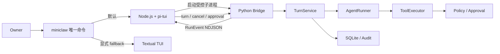

# MiniClaw Python Core + pi-tui 终端架构设计

> 状态：已由 Owner 于 2026-08-08 确认实施  
> 范围：Provider 历史修复、版本化 NDJSON Bridge、TypeScript pi-tui、Textual fallback、终端回归测试  
> 结论：Python 保留唯一 Agent Core；TypeScript `@earendil-works/pi-tui` 成为默认 TUI；Textual 仅作迁移期回退

## 1. 为什么更换终端壳

当前 Textual 界面把流式正文、活动过程、滚动位置和审批组件都放在同一个 Widget 生命周期里。已确认的两个直接问题是：

1. 流式增量反复重建 Markdown 子节点，终端选区引用的节点消失；
2. 每个 `RunEvent` 都强制滚到底部，用户向上阅读或跨屏拖选时视口被抢走。

这两个缺陷必须先在 Textual fallback 中修复，避免迁移期间现有入口不可用。但 MiniClaw 追求的是 Codex 风格的高密度活动流、稳定大段输入、可展开工具过程和审批 Overlay；继续把这些行为全部定制在 Textual 中，会让 UI 与 Python Agent Core 再次耦合。

因此采用异构前端：Python 继续负责模型、记忆、Tool Loop、Policy、Approval、SQLite 和审计；TypeScript 只消费一个受版本约束的事件协议并渲染终端。

## 2. 产品不变量

- 人类入口只有 `miniclaw`；不新增面向用户的 `chat`、`tui` 或 `bridge` 子命令。
- 默认启动 pi-tui；`MINICLAW_TUI=textual` 可显式进入迁移期 fallback。
- Node.js、构建产物或 TTY 不满足要求时，给出可操作诊断并安全回退 Textual。
- TUI 不能直接访问 Provider Key、SQLite、文件系统 Tool 或 Shell；所有动作都必须经过 Python Core。
- Python Bridge stdout 只允许 NDJSON；日志和诊断只能写 stderr。
- 所有协议帧使用 UTF-8、单行 JSON、`v: 1`，单帧最大 2 MiB。
- 同一时刻只运行一个前台 Turn；取消和审批续跑都由 Python Core 判定。
- Reasoning 默认展开，但使用弱化样式；正文、用户消息和审批始终拥有更高视觉权重。
- 中文问题由 Core System Prompt 要求 Provider 使用中文 reasoning；TUI 不伪造或二次翻译模型思考。
- Token、上下文、工具次数、迭代和耗时只显示 Core 发布的真实值；缺失显示 `N/A`。
- 终端真实字号由 Terminal/iTerm/IDE 控制；MiniClaw 通过零卡片边距、单行状态和紧凑树形活动流提高信息密度。

## 3. 总体架构



进程关系：

```text
uv run miniclaw
└─ Python launcher
   └─ node tui/dist/main.js        # 继承真实终端
      └─ python -m miniclaw.bridge # stdin/stdout 仅传 NDJSON
```

Python launcher 通过环境变量把当前 `sys.executable`、MiniClaw home 和 UI language 传给 Node。Node 使用 argv 启动 Bridge，禁止 `shell: true`。Node 或 Bridge 退出时，父进程转发退出码并回收子进程。

## 4. NDJSON 协议 v1

### 4.1 Envelope

客户端请求：

```json
{"v":1,"id":"req-1","type":"turn.start","payload":{"session_key":"default","text":"你好"}}
```

服务端响应或事件：

```json
{"v":1,"id":"req-1","type":"response.ok","payload":{}}
{"v":1,"type":"event.model_text_delta","payload":{"turn_id":21,"text":"你好"}}
```

字段约束：

| 字段 | 约束 |
|---|---|
| `v` | 必须等于整数 `1` |
| `id` | 请求必填，1–128 个 ASCII 字符；事件可省略 |
| `type` | 小写点分名称，最长 64 字符 |
| `payload` | JSON object；禁止 NaN、Infinity 和任意 Python 对象编码 |
| 帧长 | UTF-8 编码后不超过 2 MiB |

### 4.2 请求

| Type | Payload | 结果 |
|---|---|---|
| `client.hello` | `client_name`, `client_version`, `protocols:[1]` | 返回 Core/模型/Workspace/能力 |
| `turn.start` | `session_key`, `text` | 接受后异步发布 Turn 事件 |
| `turn.cancel` | 空 object | 取消当前 Turn；空闲时幂等成功 |
| `approval.resolve` | `approval_id`, `decision` | `deny/once/session/always`，Core 再校验允许模式 |
| `session.new` | `session_key` | 切换后续 Turn 的会话键 |
| `bridge.shutdown` | 空 object | 仅关闭 Bridge，不执行其他动作 |

### 4.3 事件

现有 `RunEvent.kind` 原样映射为 `event.<kind>`，`turn_id` 提升到 payload 顶层：

- `event.turn_started`
- `event.model_usage`
- `event.model_reasoning`
- `event.model_text_delta`
- `event.tool_requested`
- `event.tool_started`
- `event.tool_finished`
- `event.approval_required`
- `event.turn_finished`
- `event.turn_failed`

Bridge 只透传 RunEvent 已定义的安全字段。未识别事件可被新客户端忽略；同一 major protocol 内不能改变既有字段语义。

### 4.4 错误

```json
{"v":1,"id":"req-1","type":"response.error","payload":{"code":"turn_busy","message":"已有任务正在运行","retryable":true}}
```

错误正文必须来自稳定映射，不得包含 Provider 原始 body、API Key、Prompt、工具输出或 Python traceback。协议错误不会终止 Bridge；连续超限帧、stdout 写失败或 EOF 才关闭进程。

## 5. pi-tui 界面设计

视觉主题是“本机运行日志”，不是聊天气泡：正文留白，活动过程用一条弱化树线串起来，状态只占一行。

```text
 MiniClaw 0.1.0 · deepseek-v4-pro · 会话 default · workspace
────────────────────────────────────────────────────────────────
 你
   帮我统计本周飞书文档

 MiniClaw
   我先确认可用的飞书 CLI，再查询本周创建记录。

 · 思考  #32  展开
   └─ 正在确认飞书命令及时间范围……
 · 执行  run_command                         42 ms  ✓
   ├─ /usr/local/bin/lark-cli doc list ...
   └─ 结果 17 条

────────────────────────────────────────────────────────────────
 上下文 12.4k/128k · 输入 10.8k · 输出 1.6k · 工具 1 · 迭代 2 · 842 ms
╭──────────────────────────────────────────────────────────────╮
│ 输入消息；Enter 发送，Shift/Alt+Enter 换行                   │
╰──────────────────────────────────────────────────────────────╯
```

设计规则：

- Header 与 Telemetry 都是一行 `TruncatedText`；窄终端按优先级隐藏低价值字段。
- Transcript 使用 `TuiAltScreen + ScrollView(follow: "end")`，人工滚动后不再自动跟随。
- User 与 Agent 通过角色、左侧颜色和间距区分，不使用厚边框或大背景块。
- Assistant 流式阶段复用同一组件；完成时把内容切换为 Markdown，不新增重复消息。
- Reasoning 默认展开、灰色显示；`Ctrl+O` 展开/收起全部活动详情，`/trace <编号>` 控制单项。
- Tool 行始终显示名称、状态、耗时；展开后显示安全参数、requested→started→finished 生命周期和结果预览。
- Editor 使用 pi-tui `Editor`，保留 bracketed paste；超过 10 行的粘贴以内部 marker 管理，但提交时恢复完整原文。
- `/copy` 把最近一条完整 Assistant 原文交给系统剪贴板；鼠标选择使用 pi-tui Alt Screen 的选择与 OSC 52。
- UI language 默认 `zh-CN`，`/lang zh`、`/lang en` 只切换界面文案，不修改会话内容。

## 6. 审批 Overlay

`event.approval_required` 到达后冻结 Editor 提交并显示居中 Overlay：

```text
┌─ 审批 #7 · run_command ───────────────────────────────┐
│ /usr/local/bin/lark-cli doc list --created-this-week │
│                                                      │
│ [拒绝] [仅一次] [本次运行] [始终允许]                │
└──────────────────────────────────────────────────────┘
```

- 只显示 Core 提供的 `grant_modes`；不存在的模式不能在前端自行补全。
- 按钮语义映射为 `deny/once/session/always`。
- `Always allow` 仍由 Core 限制为明确 Skill 或精确受限命令规则。
- Overlay 关闭前禁止提交新 Turn；Bridge 只接受当前 pending approval id。
- 审批续跑的 Tool/Reasoning/Final 继续进入原时间线，不新建另一个聊天壳。

## 7. Textual fallback

迁移期继续维护以下保证：

- Provider 历史窗口不能从孤立 Tool result 开始；审批 parent/child Turn 必须作为一段合法消息序列发送。
- Assistant 顶层 Widget 在连续 delta 中保持身份不变。
- 只有更新前已经位于底部时才继续自动跟随。
- Provider 分类错误显示安全 `error_code + 中文摘要`，不只显示异常类名。
- 中文问题的 System Prompt 明确要求中文 `reasoning_content`。

Textual 不再新增 Codex 风格高级活动组件。pi-tui 通过全部迁移验收、稳定一个版本后，再提交独立删除计划。

## 8. 测试与验收

### 8.1 Python

- 真实 SQLite parent approval + child tool result + 后续 Turn，任何 recent limit 都不能产生孤立 Tool result。
- Bridge 对合法/非法版本、未知请求、超限帧、繁忙 Turn、取消和审批做契约测试。
- Bridge stdout 每一行都能独立 JSON decode，stderr 不进入协议。
- fake TurnService 产生的全部 RunEvent 顺序和安全字段原样映射。

### 8.2 TypeScript

- reducer 测试：流式正文只更新一个 Assistant item；Tool lifecycle 合并到同一 activity item。
- VirtualTerminal 快照：80×24、120×36、中文宽字符和窄终端都不溢出。
- 250,000 字符 bracketed paste 提交后与原文逐字一致；失败后草稿恢复。
- 100 个 delta 后，人工上滚位置不变；回到底部后恢复 follow。
- 鼠标跨屏选择不因 delta 消失；`/copy` 保留中文、换行和 Markdown 原文。
- Approval Overlay 只显示允许模式，四种决定映射正确，pending 时禁止第二个 Turn。
- Reasoning 默认可见；全局和单项展开控制、中文标签与安全转义有效。
- Core 异常退出、畸形帧和 Provider 错误显示可行动提示，不泄露原始异常。

### 8.3 门禁

```bash
uv run python -m unittest discover -s tests -v
uv run ruff check .
pnpm --dir tui test
pnpm --dir tui build
uv run miniclaw eval validate
uv run miniclaw eval run --offline
git diff --check
```

验收必须同时覆盖 macOS Terminal/IDE Terminal 的一次人工烟测。测试不能访问真实 Provider 或飞书。

## 9. 运行与兼容性

- `@earendil-works/pi-tui 0.82.1` 要求 Node.js `>=22.19.0`。
- 开发期使用 `pnpm`；Python 项目仍使用 `uv`。
- `miniclaw doctor` 检查 Node 版本、`tui/dist/main.js` 和 Bridge 握手。
- `MINICLAW_TUI=textual` 强制 fallback；`MINICLAW_TUI=pi` 在缺依赖时失败并输出安装指导。
- 无 TTY 的 `init/doctor/eval/--version` 维护命令不启动 Node。

## 10. 非目标

- 本阶段不做 Electron 桌面端、Web 管理台、多会话侧栏、语音、文件拖放或自动更新。
- 不把 Python Agent Core 改写为 TypeScript。
- 不通过 TUI 直接调用 Shell、文件、HTTP 或 lark-cli。
- 不显示模型不可公开的隐藏推理；这里只展示 Provider 明确返回的 `reasoning_content` 和可审计运行事件。
- 不在终端内强制字体大小；用户仍通过终端设置调整真实字号。

