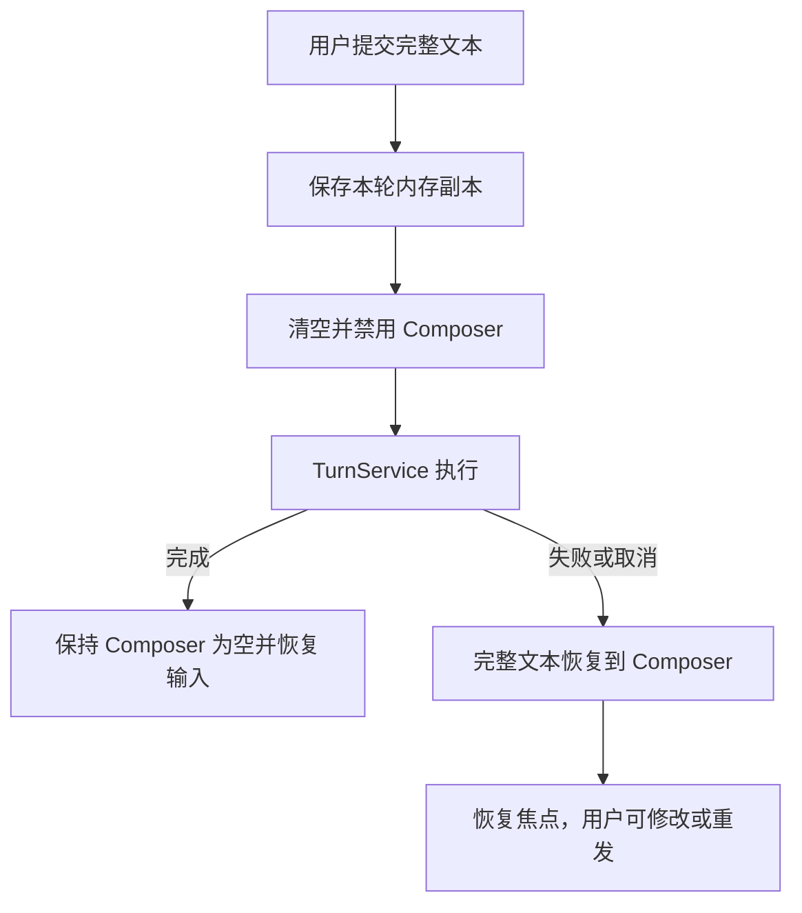

# MiniClaw TUI 对话层级与长文本可靠性设计

> 状态：已实现；270/270 tests、20/20 offline Agent cases 验证通过
> 日期：2026-08-08
> 目标：改善对话层级、Reasoning、长文本可靠性、运行审计和受限审批授权

## 1. 已确认结论

本次采用“轻量消息卡片”方案，不做左右聊天气泡，也不增加新的 TUI 框架：

1. 用户消息和 MiniClaw 消息使用不同标签、边线、底色和间距；
2. Provider reasoning 默认折叠，改成低对比度、紧凑的一行概要；
3. reasoning 内容应跟随当前用户提问语言，不固定为中文；
4. 长文本在发送失败或取消后必须完整恢复到输入框；
5. 审批增加受限的 Session/Always 决策，不允许永久放行整个通用命令工具；
6. TUI 直接显示紧凑的真实运行指标，默认中文并可切换英文；
7. 保留现有 Textual、RunEvent、TurnService 和单入口架构。

终端使用固定字符单元，Textual 不能真正缩小局部字体。本设计用 `dim`、弱色、减少边框和空白实现“小字感”，不伪造不存在的字体能力。

## 2. 现状与根因证据

### 2.1 Reasoning 和对话拥挤

当前用户消息只是 `You` 加正文；Assistant 只有 Markdown 正文，没有固定角色标签。Reasoning 和 Tool 共用厚重圆框，因此三类内容的视觉权重接近。

### 2.2 长文本

已用 250,003 个字符验证：

```text
终端 bracketed paste parser -> TextArea -> Composer.Submitted -> TurnService
                完整              完整            完整
```

Textual 8.2.8 和 MiniClaw 当前提交链路没有字符数截断。已确认的数据完整性缺口是：提交处理会先清空 Composer；Turn 之后若失败或取消，原始草稿不会恢复。

本次修复这个已证实的根因。输入框仍可滚动查看超出可见高度的文本，不额外引入草稿数据库或剪贴板依赖。

## 3. 交互设计

```text
┌──────────────────────────────────────────────────────────────┐
│ 你                                             用户强调色 │
│ 你是谁                                                       │
│                                                              │
│ ▸ 推理（Provider） · Turn 15          弱色、dim、默认折叠 │
│                                                              │
│ MiniClaw                                      Agent 强调色 │
│ 我是你的私人自托管个人代理。                                 │
└──────────────────────────────────────────────────────────────┘
```

### 3.1 用户与 Agent

- 用户标签固定显示“你”；
- Agent 标签固定显示“MiniClaw”；
- 两种消息使用不同的 CSS class、边线方向和低饱和背景；
- 不只依赖颜色，角色文字标签必须始终存在；
- Assistant 正文仍由现有 Markdown Widget 渲染，流式更新逻辑不变。

### 3.2 Reasoning

- 标题改为 `推理（Provider） · Turn N`；
- 默认折叠，`Ctrl+O` 仍统一展开或折叠 Tool/Reasoning；
- 使用弱色和 `dim`，去掉与 Tool 相同的厚重卡片感；
- 用户主动展开后仍可查看 Provider 返回的完整有界内容；
- 仍只展示 Provider 明确返回的 `reasoning_content`，不生成或冒充隐藏思维链。

### 3.3 语言跟随

System Prompt 增加一条输出约束：可见 reasoning 应简洁，并跟随当前用户消息的主要语言；用户明确指定其他语言时服从用户要求。

只使用 Prompt 约束，不在 TUI 中二次翻译 Provider 内容。这样不会增加一次模型调用，也不会改变原始 reasoning 语义。Provider 不遵循时原样展示。

### 3.4 长文本失败恢复



- 恢复内容必须逐字符等于提交内容；
- 仅保留当前正在执行的一份内存草稿，不做持久化草稿系统；
- 本轮运行时 Composer 已禁用，不存在覆盖用户新输入的问题；
- Slash Command 成功执行后仍正常清空，不恢复；
- Runtime 未配置时不应丢弃输入。

### 3.5 紧凑审计栏

状态栏下方增加一条低对比背景的审计栏，标签弱化、数值使用强调色，并用细分隔符分组。宽终端显示完整标签，80 列终端显示短标签，不使用横向滚动。

```text
上下文 12.4k/32k · 输入 18.9k · 输出 1.2k · 工具 2 · 迭代 3 · 耗时 2.4秒
```

指标语义必须固定：

- 上下文：最后一次 Provider 请求的真实 Prompt Token / `context_budget_tokens`；
- 输入/输出：当前 Turn 多轮模型调用的累计 Token；
- 模型：当前 Turn 的 Provider 调用轮数；
- 工具：当前 Turn 中模型请求的 Tool Call 数；
- 耗时：当前 Turn 从开始到终态的单调时钟耗时；
- Provider 不返回 Token 用量时显示 `N/A`，不能自行估算或把未知值显示为 0；
- `/status` 补充显示 Provider Request ID 和完整指标；
- 审计栏不显示原始 Prompt、密钥、未脱敏参数或完整 Tool 结果。

Core 使用现有 `AgentRunResult`、Tool 事件和 `RunEvent` 传递数据；只补齐最后一次 Prompt Token、Tool Call 计数和耗时，不创建第二套遥测系统。

### 3.6 界面语言

- TUI 默认语言为 `zh-CN`；
- `config.toml` 的 `[ui].language` 支持 `zh-CN` 和 `en`，作为启动默认值；
- `/lang zh` 与 `/lang en` 立即切换当前 TUI；
- 角色、状态、审批按钮、Slash Command 帮助和审计标签跟随 UI 语言；
- Tool 名、稳定错误码和 Provider Request ID 保持原始英文，便于搜索日志；
- 模型回答和 reasoning 不跟随 UI 语言，仍跟随当前用户提问语言；
- 只使用两组静态文案映射，不引入 gettext 或 i18n 框架。

### 3.7 Approval 决策范围

审批弹窗支持四种结果，但只在 Policy 能生成安全范围时显示更宽的授权：

| 决策 | 生命周期 | 安全范围 |
|---|---|---|
| Deny | 单次 | 拒绝当前绑定调用 |
| Allow once | 单次 | 只消费当前 Approval 的精确参数 |
| Allow this session | 当前 Runtime | 同一条受限 Policy scope；重启丢弃 |
| Always allow | 持久化 | 明确 Skill scope、精确命令规则或精确 hostname 规则 |

约束：

- UI 不能自行从文字摘要推导规则，scope 必须由 Policy/Core 生成；
- `run_command` 只允许精确规范化 argv 规则，不能永久放行整个 executable；
- 任意 Shell、AppleScript 正文或解释器不能整体永久授权；
- 截图中的 `/usr/bin/osascript -e ...` 只提供 Allow once 与 Session；相同精确 argv 仅在当前 Runtime 复用，正文改变即重新审批；
- “创建备忘录”只有封装成带版本和能力声明的 `apple_notes.create` Skill 后，才可获得可复用的 Skill scope；
- `http_get` 可使用现有精确 hostname + port 规则；URL path/query 不进入持久规则；
- Always 规则只能在当前绑定调用成功后写入现有 `policy_rules`，并产生脱敏 Audit；
- Session 规则只保存在 `AgentRuntime` 内存中，不写 SQLite；
- Deny 和所有硬 Policy 拒绝优先，Session/Always 只能减少重复询问，不能绕过安全边界。

## 4. 最小代码范围

| 文件 | 改动 |
|---|---|
| `src/miniclaw/tui/app.py` | 消息角色/CSS、紧凑 Reasoning、审计栏、语言切换、Approval 选项、失败恢复 |
| `src/miniclaw/agent/context.py` | 可见 reasoning 跟随用户语言的 Prompt 规则 |
| `src/miniclaw/agent/runner.py`、`src/miniclaw/agent/turn.py` | 补齐真实用量、调用计数和耗时事件 |
| `src/miniclaw/config.py`、`src/miniclaw/bootstrap.py` | 默认中文和受限 UI language 配置 |
| `src/miniclaw/policy/engine.py`、`src/miniclaw/storage/tooling.py`、`src/miniclaw/runtime.py` | 受限 Session/Always scope 与现有规则落库 |
| `tests/test_tui.py` | 角色、Reasoning、审计、双语、Approval、长粘贴和草稿恢复回归 |
| `tests/test_context.py` | 语言跟随 Prompt 契约 |
| `tests/test_agent_runner.py`、`tests/test_turn.py` | 运行指标事件契约 |
| `tests/test_approvals.py`、`tests/test_tool_executor.py` | Session/Always 安全与审计契约 |
| `tests/test_config.py`、`tests/test_bootstrap.py` | UI 默认语言和配置校验 |
| `docs/engineering/phase-2/single-entry-tui.md` | 交互与数据完整性说明 |
| `docs/engineering/phase-2/tui-regression-testing.md` | 新回归矩阵 |
| `docs/progress/index.html` | 完成后更新当前进度与测试数 |

不增加依赖、Presenter、主题系统、语言识别器、消息虚拟化或第二个 CLI 入口。

## 5. 回归验收

1. 用户和 Agent 都有可见文字标签，并有不同的非颜色视觉结构；
2. Assistant 流式增量仍只更新同一个 Markdown Widget；
3. Reasoning 默认折叠、低视觉权重，键盘仍可展开；
4. 中英文用户消息都进入同一条“跟随当前用户语言”Prompt 契约；
5. 至少 250,000 字符粘贴后，Composer 和提交文本完全一致；
6. Turn 失败和取消后，完整草稿恢复且 Composer 重新获得焦点；
7. Turn 成功后 Composer 保持为空；
8. 80x24 终端下状态栏、对话区和 Composer 仍可用；
9. 审计栏只显示 Provider 真实数据，未知用量显示 `N/A`；
10. `/lang zh|en` 即时切换，默认配置为中文，reasoning 语言仍跟随用户；
11. Session 规则重启失效，Always 规则只从成功调用生成且可审计；
12. 通用 Shell/AppleScript/整个 executable 永远不能被 Always 整体放行；
13. 现有 Tool、Approval、Slash Commands 和终端控制字符防护全部回归通过。

## 6. 非目标

- 不实现通用 glob/regex 命令规则、整个 executable 放行或 UI 自定义规则编辑器；
- 不对 Provider reasoning 做二次翻译或摘要；
- 不持久化未发送草稿；
- 不实现左右气泡、头像、鼠标菜单或自定义终端字体；
- 不增加新的 Approval 数据库状态；四种 UI 决策最终仍使用现有 pending → approved/denied → consumed 生命周期。
