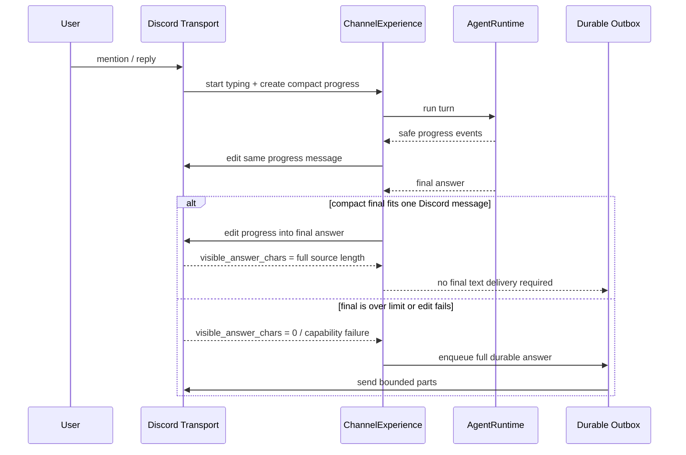

# MiniClaw Discord 紧凑单回复设计

> 状态：用户已确认设计，等待实施
>
> 日期：2026-08-09

## 1. 问题与根因

当前 Discord 普通完成路径会产生两条 Bot 消息：

1. `ChannelExperience` 创建并持续编辑一条 `Claw Trail` 进度消息；
2. Discord Transport 在终态把进度消息改成“最终内容见下一条消息”，随后 Outbox 再发送最终回答。

这不是模型重复回答，而是 Discord 适配器把 best-effort 进度和 durable 最终文本拆开交付。与此同时，
模型输出中的 `#`、`##`、`###` 会被 Discord Markdown 渲染成大标题；多级标题与连续空行会让中等长度回答
占满聊天视口。

## 2. 目标与非目标

### 2.1 目标

- 普通成功路径只保留一条 Bot 回复：运行时显示简短进度，完成后原地替换为最终回答。
- Discord 最终回答使用正文大小的紧凑排版，不出现大号 Markdown 标题。
- 完成态不再显示 `Claw Trail`、步骤数、Tool 数、模型轮数或耗时。
- 保留列表、链接、行内代码、代码块和引用的可读语义。
- 超过 Discord 单条消息预算时才追加 durable 分片。
- edit、format 或 progress 能力失败时继续用现有 Outbox 投递最终答案。
- 改动只影响 Discord，不改变飞书卡片和 Telegram 文本体验。

### 2.2 非目标

- 不使用 Discord `-#` subtext 把整篇回答变成低对比度灰色小字。
- 不修改 Discord 客户端的全局缩放或用户字体设置。
- 不为了压缩回答再次调用模型，也不删改回答中的事实内容。
- 不引入 Embed、Components、Slash Command 或新的 Discord 权限。
- 不展示隐藏 reasoning、原始 Tool 参数、Secret 或内部异常正文。

## 3. 用户可见行为

| 场景 | Discord 行为 |
| --- | --- |
| 正在运行 | 回复原消息一条简短状态，只显示当前阶段，不展开完整 `Claw Trail` |
| 短回答成功 | 原地编辑状态消息为紧凑最终回答；频道里只有一条 Bot 回复 |
| 长回答成功 | 状态消息改成简短完成提示，完整回答由 durable Outbox 按平台上限分片发送 |
| edit 失败 | 保留现有状态消息，由 durable Outbox 发送完整最终回答 |
| Provider/Turn 失败 | 能原地编辑时显示稳定失败提示；否则由 durable failure delivery 兜底 |
| 等待审批 | Approval 仍是独立、安全且可恢复的交互；不为了单消息合并审批与结果 |

普通完成态只显示回答正文。例如模型输出：

```markdown
# 我的核心能力

## 文件与代码

- 读取文件
- 编辑代码
```

Discord 发送前转换为：

```markdown
**我的核心能力**

**文件与代码**

- 读取文件
- 编辑代码
```

## 4. Discord 专属紧凑渲染

紧凑渲染发生在 `channels/discord.py` 的平台边界，不进入 `agent`，也不让共享 Runtime 感知消息来源。

渲染规则：

1. 逐行扫描 Markdown，并跟踪 fenced code block 状态。
2. 代码块内部保持原样，不解释其中的 `#`、列表或空行。
3. 代码块外的 ATX 标题转成正文大小的粗体行。
4. 连续空行折叠为一个空行，并移除首尾空行。
5. 列表、引用、链接、行内代码、粗体和斜体保持原语义。
6. 不插入 mention；Transport 继续使用 `suppress_mentions=True`。
7. 如果粗体标题转换会让一个已经分片的消息超过平台预算，则退化为无标题标记的普通正文行；不得截断
   durable 最终内容。

同一个 renderer 同时用于：

- progress 消息被替换后的短最终回答；
- Outbox 交给 `DiscordTransport.send()` 的普通文本和分片。

运行中 progress 使用单独的紧凑 renderer，只显示状态和当前安全步骤摘要。它可以按预算截断，因为它不是最终
答案；最终答案不得通过这个截断路径发送。

## 5. 单消息生命周期

Discord Gateway 装配把 `ChannelExperience` 配置为“progress 可以承载最终回答”。生命周期如下：



`ProgressReceipt.visible_answer_chars` 只在紧凑后的完整回答全部可见时返回原始回答长度；不能完整承载时返回
`0`，避免 Outbox 与被编辑消息产生重叠或缺口。长回答因此保持完整 durable 分片，不尝试用不可靠的字符偏移
拼接经过 Markdown 转换的半段内容。

## 6. 可靠性与恢复边界

- progress create/edit 继续是 best-effort 体验能力。
- edit 明确失败时，`ExperienceOutcome.final_delivery_required=True`，现有 Outbox 发送完整答案。
- edit 成功且完整回答可见时，不再创建第二条普通 Delivery。
- 超时或平台返回未知结果时宁可触发 durable fallback；Discord API 不提供本项目可绑定的发送幂等键，因此极端
  网络未知窗口仍可能出现重复，这是现有 Discord Delivery 的已知上限，不能虚假承诺 exactly-once。
- 重启恢复继续使用已持久化的 Assistant Message 和脱敏 `experience_trace`；不得把平台消息 ID、Guild 名称、
  用户正文或 Token 写入规格、日志和公开 evidence。

## 7. 长度与格式预算

- 使用配置中的 `channels.discord.message_max_chars`，不得写死一个比配置更大的预算。
- Discord 配置仍受现有最大 2000 字符校验约束。
- 紧凑 renderer 的最终输出必须不超过 Transport 预算。
- durable 内容先由现有 Unicode-safe splitter 分片，再在每个 Discord part 上执行不丢内容的紧凑渲染。
- fenced code 的跨片平衡继续由现有 Delivery splitter 负责；Discord renderer 不删除 synthetic fence。

## 8. 测试与验收

实施必须先添加失败测试，再写生产代码，至少覆盖：

1. `#`、`##`、`###` 在代码块外转成正文大小粗体；代码块内保持原样。
2. 连续空行被折叠，列表、引用、链接和行内代码保持可读。
3. 紧凑转换接近长度上限时退化为普通标题，最终文本不丢字符。
4. 短回答只创建一条 progress，并原地 edit 为最终回答；不含 `Claw Trail` 和统计。
5. edit 返回失败或异常时仍创建完整 durable final delivery。
6. 超长回答返回 `visible_answer_chars=0`，由 Outbox 完整分片，不重叠、不缺失。
7. mentions 继续被抑制，Discord fake SDK 不接触真实网络或私人数据。
8. 飞书单卡、Telegram 独立最终文本和三平台隔离测试无回归。
9. 新增一个 versioned Discord UX case，并保留既有 Discord 10 条、Telegram 10 条、飞书 12 条场景。

完成前运行：

```bash
uv run python -m unittest tests.test_discord_transport tests.test_channel_experience \
  tests.test_channel_manager -v
uv run python -m unittest discover -s tests -v
uv run ruff check .
uv run miniclaw eval run --suite channel --root evals/scenarios
uv run miniclaw eval run --suite channel --repeat 20 --json --root evals/scenarios
uv run python scripts/validate_docs.py
git diff --check
```

真实 Discord 验收至少发送一条带多级标题和空行的短回答，确认：频道内只有一条 Bot 回复、标题为正文大小、
完成态没有 `Claw Trail`。长回答另测分片；live evidence 只记录 pass/fail 和计数，不保存正文、账号或频道 ID。

## 9. 预计修改边界

- `src/miniclaw/channels/discord.py`：紧凑 Markdown 与 progress/final 渲染。
- `src/miniclaw/gateway.py`：Discord Experience 使用单消息完成语义。
- `tests/test_discord_transport.py`：renderer、edit、长度和 fallback 回归。
- `tests/test_channel_manager.py`：短回答无额外 Delivery、长回答/失败有 durable fallback。
- `evals/scenarios/`：新增 Discord 紧凑单回复 versioned case。
- Discord 工程说明与运行文档：同步用户可见行为、限制和验收事实。

不修改 Provider、Agent Loop、Policy、Memory、飞书卡片 renderer、Telegram Transport 或数据库 schema。
