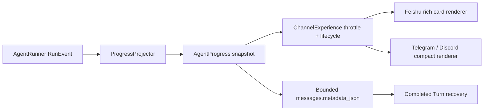

# MiniClaw 飞书 Agent 过程卡设计

> 状态：已确认，等待书面规格复核
> 日期：2026-08-09
> 参考：OpenClaw Control UI 与 tool cards

## 1. 产品定位

这张卡服务于通过飞书使用个人 MiniClaw 的 Owner。它的唯一任务是让用户在同一张消息卡片中看懂
Agent 正在做什么、调用了什么工具、查看了什么对象、每一步是否成功，以及最终答案是什么。

当前飞书卡只把最终 Markdown 包进“MiniClaw 回复”，`ChannelExperience` 明确忽略 Tool trace 与
reasoning，因而复杂任务看起来仍像普通聊天机器人。目标体验借鉴 OpenClaw 的 live digest、按工具类型
展示活动和完成后保留轨迹，但不复制 Web UI，也不引入额外模型调用。

官方参考：

- <https://docs.openclaw.ai/web/control-ui>
- <https://github.com/openclaw/openclaw/blob/main/ui/src/ui/chat/tool-cards.ts>

## 2. 目标与非目标

### 2.1 目标

- 飞书 Owner 看到单张持续更新的 Agent 过程卡，而不是只有最终回答。
- 卡片保留按时间排序的计划、Tool 请求、执行状态、查看对象、结果摘要和最终回答。
- Tool 行使用确定性的类型化摘要；未知 Tool 也有安全退化显示。
- 完成态保留过程轨迹，并在进程恢复时尽量重建相同内容。
- Telegram、Discord 继续使用紧凑文本进度，不被迫复制飞书布局。
- 所有卡片内容有严格长度、条目和更新频率预算。

### 2.2 非目标

- 不展示 Provider 的原始 `reasoning_content`、隐藏 chain-of-thought 或系统 Prompt。
- 不展示完整 Tool 参数、完整 stdout/stderr、HTTP 正文、文件正文或认证数据。
- 不增加“为了标题或摘要再调用一次模型”的隐性成本。
- 不在本轮实现任意展开面板、分页浏览器或新的 Web UI。
- 不删除显式 `safe`/`smart` 与不可信入口仍需要的 Approval 生命周期。

## 3. 方案选择

采用结构化 `AgentProgress` 投影，而不是拼接一大段 Markdown，也不新建完整 Event Store。



理由：事件语义只解析一次，平台渲染各自负责；安全摘要在进入展示状态前完成，避免 Feishu renderer
接触原始参数。最终 snapshot 写入现有 `messages.metadata_json`，无需数据库迁移。

## 4. 数据模型与文件边界

新增 `src/miniclaw/channels/progress.py`：

- `ProgressStatus`：`running / completed / incomplete / waiting`。
- `ProgressStep`：稳定序号、类别、标题、安全详情、状态、耗时。
- `AgentProgress`：当前摘要、步骤、最终回答、迭代/Tool/Token/耗时统计。
- `ProgressProjector`：按顺序消费 `RunEvent`，生成不可变 snapshot。
- Tool 类型化展示与脱敏函数；未知 Tool 只显示名称、状态和耗时。
- 持久化 serializer 省略 `final_answer`；恢复时从同一 Assistant Message 的正文重新组合，避免在
  metadata 中复制长回答。

新增 `src/miniclaw/channels/feishu_cards.py`：

- 只把 `AgentProgress` 映射为 Feishu Card JSON 2.0。
- 不解析 RunEvent，不接触原始 Tool 参数，不处理持久化。
- 同时保留 Approval card 与简单状态卡所需的小型 renderer，逐步消除重复 `_progress_card`。

修改 `channels/experience.py`：

- 每个 `ExperienceActivity` 私有持有一个 `ProgressProjector`。
- 结构事件可以触发卡片创建或合并更新；普通文本 delta 仍受节流。
- Transport 接收 `AgentProgress`，不再只接收一个失去语义的字符串。

修改 `storage/conversations.py`：

- 提供专用方法原子合并最终、已脱敏的 `experience_trace` metadata。
- snapshot 最大 16 KiB、最多 16 个可见步骤；不接受任意调用方 metadata。

## 5. RunEvent 投影规则

| RunEvent | 可见行为 |
| --- | --- |
| `turn_started` | 建立“理解请求”步骤，但不立即发送空卡 |
| `model_text_delta` | 只收集模型明确作为公开输出发出的前言或回答片段 |
| `model_reasoning` | 永久忽略，不进入 snapshot、日志或卡片 |
| `model_usage` | 更新迭代、Token 与 Tool 数量统计，不创建独立步骤 |
| `tool_requested` | 建立 pending Tool 步骤并立即把原始参数投影为安全摘要 |
| `tool_started` | 标记步骤 running；首个真实执行的 Tool 可以创建飞书卡 |
| `tool_finished` | 标记成功/失败、记录耗时和类型化结果摘要；不保存原始 preview |
| `approval_required` | 标记 waiting；若还没有过程卡，继续沿用现有 durable Approval card |
| `turn_finished` | 写入最终回答、完成摘要和总耗时 |
| `turn_failed/cancelled` | 把未完成步骤冻结为 incomplete，并给出稳定错误指引 |

当前摘要不读取隐藏 reasoning，也不再次调用模型。没有公开前言时使用“正在理解请求”；首个 Tool 出现后按
Tool 类型和安全参数确定性更新为“正在查询飞书云空间”“正在读取文件”等阶段文案。

不在 `tool_requested` 时立即公开建卡：Policy 可能随后要求审批。等到 `tool_started` 才建卡，可以保持
“审批发生在首个 Tool 前时只有审批卡”的现有单卡约束。若一个 Turn 已完成若干 Tool 后又进入审批，过程卡
会冻结为“等待确认”，durable Approval card 仍单独发送；这是显式安全模式下的有界例外，Owner 默认
Autopilot 路径不会触发它。

## 6. Tool 安全摘要

投影器使用字段 allowlist，不做通用字符串脱敏后就直接展示：

| Tool | 卡片显示 |
| --- | --- |
| `run_command` | executable basename、允许的业务子命令、参数个数；认证/Token/Cookie/Secret 值全部替换 |
| `read_file` / `write_file` / `edit_file` | Workspace 相对路径或 basename、读取/写入字符数，不显示正文 |
| `glob` / `grep` | 搜索根、受限 pattern 摘要、匹配数量，不显示全部匹配行 |
| `http_get` | hostname、规范化 path、HTTP 状态与字节数，不显示 query 凭据或正文 |
| `system_info` | 查询分区与返回项目数 |
| `read_memory` / `propose_memory` | 记忆分区、候选字符数与状态，不显示记忆正文 |
| 未知 Tool | Tool 名、running/succeeded/failed 与耗时；参数和结果为空 |

所有文本先移除控制字符并限制单字段 240 字符。可见步骤总计最多 16 条，超过后保留首条、最近 14 条和一条
“较早 N 步已折叠”摘要。最终回答独立使用既有 `message_max_chars` 与后缀 Delivery 机制。

## 7. 飞书视觉系统

受 Feishu Card 2.0 的系统字体和 Header template 限制，不加载自定义字体或 CSS。设计把大胆之处集中在
“Claw Trail”竖向轨迹，其余保持企业聊天中的高密度可读性。

颜色语义：

- Active Blue `#3370FF`：执行中 Header 与当前步骤。
- Success Green `#34C724`：完成 Header 与成功步骤。
- Attention Amber `#F5A623`：等待、降级与未完成。
- Failure Red `#F54A45`：失败与明确错误。
- Ink `#1F2329`：正文。
- Muted `#8F959E`：统计与辅助说明。

实际 Card JSON 使用 Feishu 支持的 `blue / green / orange / red` template；十六进制值只用于设计语义和
测试命名，不向平台注入不支持的 CSS。

排版：Header 使用系统标题；正文 `text_size=small`；Tool 名、命令和路径使用 inline code；步骤标题使用
加粗 Markdown。状态符号固定为 `● running / ✓ succeeded / ! waiting / × failed`，不使用装饰性 emoji。

```text
┌ MiniClaw · 执行中                         8s ┐
│ 正在统计你的飞书文档                         │
├ Claw Trail ────────────────────────────────┤
│ ✓ 1  理解请求                               │
│      识别为飞书云盘统计任务                   │
│ ✓ 2  查询云空间                             │
│      run_command · lark-cli drive +search   │
│      查看：当前用户可访问的飞书文档           │
│      完成 · 返回 100 项 · 428ms              │
│ ● 3  汇总结果                               │
│      正在计算文档总数                         │
├ 最终回答 ──────────────────────────────────┤
│ 你当前可以访问 327 个飞书文档……              │
├─────────────────────────────────────────────┤
│ 3 步 · 1 个工具 · 2 轮模型 · 8s              │
└─────────────────────────────────────────────┘
```

## 8. 卡片生命周期、限频与恢复

1. Turn 开始时只在内存创建 projector，并开启 Typing。
2. 首个 `tool_started` 创建过程卡；没有 Tool 的普通回答仍在终态创建卡片。
3. Tool started/finished 是高优先级更新；连续事件在 0.5 秒窗口内合并，避免平台限流。
4. Turn 完成后先把 bounded snapshot 合并进最终 Assistant Message metadata，再更新远端完成卡。
5. 进程在远端更新前中断时，恢复路径从 metadata 重建完成卡；远端已经成功时继续使用稳定
   idempotency key，不创建第二张回答卡。
6. Card 创建或更新失败时，现有 durable Markdown Delivery 继续兜底；体验层异常不影响 Tool 与 Turn 结果。

卡片 payload 预算为 20 KiB；snapshot metadata 预算为 16 KiB；步骤 16 条；每个参数/结果摘要 240 字符；
所有预算由本地常量控制，平台输入和模型不能放大。

## 9. 错误与隐私行为

- Tool 失败：步骤标红，显示稳定错误类别和修复方向，不显示内部异常原文。
- Provider 失败：卡片显示“回答未完成”，普通文本失败提示仍可恢复。
- Card API 失败：记录稳定 capability code，回退 durable Markdown。
- metadata 损坏：丢弃 trace，只用最终回答重建，不阻断 Inbox 恢复。
- Group/非 Owner：继续使用剥离 Personal roots 的 ToolContext；卡片不会因为富展示扩大执行权限。
- 日志和 `repr` 不含原始 args、output、平台 ID、问题正文或 trace 内容。

## 10. 测试与验收

新增和修改测试至少覆盖：

- Projector 的完整事件序列、乱序/重复终态、16 步折叠和长度预算。
- `model_reasoning`、Secret 参数、文件/HTTP/Tool 原始输出永远不进入 snapshot 或 Card JSON。
- 各内置 Tool 的类型化输入与结果摘要；未知 Tool 安全退化。
- 飞书 running/completed/incomplete/waiting 四种 Header 与 Claw Trail 布局。
- 首个 `tool_started` 建卡、0.5 秒合并更新、纯回答终态建卡、Card 失败 Markdown fallback。
- 首 Tool 之前 Approval 不产生过程卡；Owner Autopilot 安全命令不产生 Approval card。
- 完成 snapshot metadata round-trip、损坏/超限拒绝和 completed Turn 恢复。
- 飞书现有 12 条 versioned case、三平台 32 条 Channel case 与 20 轮 640-check soak 全部通过。

文档同步 README、产品需求、系统架构、Phase 5 飞书单卡与发布记录。真实飞书只能在具备专用机器人环境时
标记 LIVE PASS；本地 fake SDK 与 soak 仍只标 IMPLEMENTATION PASS。
