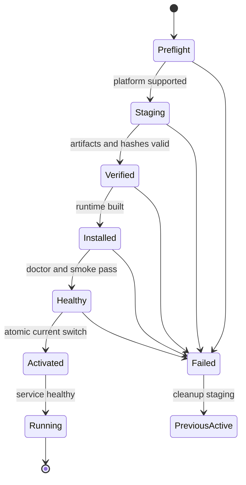

# Lobster0 一键安装、托管发布与原子升级设计

> 日期：2026-08-09
>
> 状态：**APPROVED DESIGN / IMPLEMENTATION PENDING**
>
> 目标版本：随首个完成本文门禁的稳定 Release 发布，不覆盖 Phase 6 的 `v0.7.0` 功能范围
>
> 当前代码基线：`main@d1ec23f`
>
> 用户确认：优先稳定和完整功能；支持 Linux 与 macOS，不支持 Windows；权限与安装体验对标
> OpenClaw 和 Hermes；默认托管 Node 24 LTS，兼容 Node 22.22.3+

## 1. 一句话目标

让用户在一台全新的受支持服务器或 Mac 上执行一条命令，即可获得可验证、可升级、可回滚、可卸载的完整
Lobster0；安装过程不要求克隆仓库，不把 Secret 写进命令行、日志或服务定义，也不让 Agent 以 root 身份运行。

```bash
curl -fsSL --proto '=https' --tlsv1.2 \
  https://github.com/NEDONION/lobster0/releases/latest/download/install.sh | bash
```

“安装完成”不是只有 `lobster0` 命令存在，而是必须同时满足：

- Python Core、默认 pi-tui、Feishu/Telegram/Discord SDK 与该 Release 已实现的功能均已安装；
- `lobster0 --version`、`lobster0 doctor` 和 install smoke 通过；
- Linux systemd user service 或 macOS LaunchAgent 已按用户选择注册；
- Gateway 使用非 root 身份运行并能报告健康状态；
- 失败不会破坏上一版运行环境或用户数据。

## 2. 当前问题

仓库当前仍是源码安装体验：

- `pyproject.toml` 的分发名是已被其他项目占用的 `lobster0`；
- Python 版本仍写作 `0.1.0`，与仓库 Release 线没有统一来源；
- `tui/dist/main.js` 依赖仓库内 `node_modules`，Python wheel 不包含可运行 pi-tui；
- 快速开始要求用户手工安装 uv、Python、Node、pnpm 并从源码构建；
- systemd/launchd 只有手工模板，没有稳定的 install/status/logs/restart/uninstall 契约；
- 没有可信发布流水线、跨平台 Release manifest、安装回归或原子升级入口。

本文补齐总体 Gap 文档中的 `GAP-OPS-002`。它只负责分发、安装和服务生命周期，不重新实现 Phase 6 的
Scheduler、TaskRunner、Sandbox 或 Checkpoint。

## 3. 参考项目与采用决策

### 3.1 OpenClaw

采用：

- 一行脚本作为默认入口；
- local prefix 模式，无 root 也能得到完整 CLI；
- 固定运行时版本并校验 SHA-256；
- onboarding、`--no-onboard`、`--dry-run`、非交互和 JSON 输出；
- 安装后运行 version、doctor、Gateway status；
- Linux systemd user service 与 macOS LaunchAgent。

不照搬：

- 不使用全局 npm 作为 Lobster0 的事实安装源；
- 不让系统 Node、shell rc 或用户当前 Python 环境决定运行结果；
- 不在安装成功前覆盖旧版本。

### 3.2 Hermes

采用：

- Lobster0 自己管理 uv、Python 与 Node；
- 普通用户模式与 root 发起模式均有清晰布局；
- 系统依赖确实需要 sudo 时才请求提权；
- 没有 sudo 时给出精确管理员命令，不伪装成功；
- 安装、更新和 Doctor 使用同一安装方式事实；
- 所有可用功能使用完整 extras，而不是默认装一个残缺 Core。

不照搬：

- 稳定通道不跟踪 `main`；
- 不把源码 Git checkout 作为默认生产运行目录；
- root 执行安装器也不让 Gateway 以 root 身份运行。

## 4. 采用方案

采用 **Managed Prefix + Versioned Release Bundle**：

1. GitHub Release 是版本、installer、manifest、TUI bundle、checksum、SBOM 与 attestation 的权威发布入口；
2. PyPI 使用分发名 `lobster0-agent` 发布相同 Python wheel/sdist；
3. 一键安装器按 Release manifest 安装精确 wheel 和锁定依赖，不从 `main` 构建；
4. uv、Python、Node、pi-tui 与 Python 环境放在 Lobster0 管理的版本目录；
5. 稳定 launcher 通过 `current` 指针进入当前版本；
6. 新版本通过全部本机 smoke 后才原子切换，失败时旧版本保持可用。

仅 PyPI 安装仍作为高级入口：

```bash
uv tool install 'lobster0-agent[channels]'
```

它不承诺自动注册服务和准备 Node/TUI/Sandbox 系统依赖，因此不是 README 的首选完整安装方式。

## 5. 命名

```toml
[project]
name = "lobster0-agent"
```

只改变 Python 分发名。以下公共名称保持不变：

- 产品：`Lobster0`；
- 仓库：`lobster0`；
- Python import：`lobster0`；
- CLI：`lobster0`；
- 状态根：`~/.lobster0`。

发布前必须实际创建 PyPI `lobster0-agent` 项目并配置 Trusted Publisher。PyPI 返回 404 只说明检查时未注册，
不能当成永久名称保留。

## 6. 支持矩阵

### 6.1 Tier 1

| 平台 | 版本 | 架构 | 服务管理 |
| --- | --- | --- | --- |
| Ubuntu | 22.04、24.04 | x86_64、arm64 | systemd user |
| Debian | 12、13 | x86_64、arm64 | systemd user |
| RHEL / Rocky / Alma | 9、10 | x86_64、arm64 | systemd user |
| macOS | 13 及以上 | Intel、Apple Silicon | LaunchAgent |

Tier 1 的含义是安装、升级、回滚、服务和卸载进入 Release gate。没有门禁证据的平台不能只凭“理论兼容”列为
Tier 1。

### 6.2 不支持

- Windows 原生与 WSL；
- Alpine/musl；
- NixOS 声明式安装；
- Android/Termux；
- 32 位架构；
- 没有 systemd 的 Linux 作为常驻服务宿主。

不支持的平台必须在任何写入前返回 `unsupported_platform`，不能尝试半安装。

## 7. 安装布局

普通用户默认布局：

```text
~/.lobster0/
├── bin/
│   ├── lobster0
│   └── uv
├── current -> runtimes/0.7.0
├── runtimes/
│   ├── 0.7.0/
│   │   ├── venv/
│   │   ├── node/
│   │   ├── tui/
│   │   ├── release-manifest.json
│   │   └── install-receipt.json
│   └── 0.8.0/
├── config.toml
├── state/
├── memory/
├── skills/
├── workspace/
└── logs/

~/.local/bin/lobster0 -> ~/.lobster0/bin/lobster0
```

规则：

- `runtimes/<version>` 是只由安装器管理的不可变目录；
- `state`、Memory、Skills、Workspace、日志和配置不属于任何一个 Runtime；
- launcher 根据 `current` 解析 venv、managed Node 与 TUI entry；
- service unit 永远指向稳定 launcher，不指向版本目录；
- 安装器只替换自己创建且 receipt/hash 匹配的链接或文件。

以 root 身份调用安装器时，默认仍安装给原始登录用户。只有显式 `--system-prefix` 才把只读程序文件放进
`/usr/local/lib/lobster0` 和 `/usr/local/bin/lobster0`；配置、Memory 和 SQLite 继续属于实际运行用户。Gateway
不得以 UID 0 启动。

## 8. 两层安装器

### 8.1 POSIX bootstrap

GitHub Release 的 `install.sh` 保持最小，只承担：

1. 解析固定 flags；
2. 检测 OS、架构、基础命令和临时目录；
3. 创建 owner-only 临时目录；
4. 使用脚本内嵌的 uv 版本、平台 URL 和 SHA-256 下载官方 uv archive；
5. 用 `sha256sum` 或 `shasum -a 256` 校验并解压 managed uv；
6. 下载同一 Release 的 manifest 和 `lobster0-installer.pyz`，并按脚本内嵌 hash 校验；
7. 用 managed uv 准备 Python 3.12；
8. 运行 stdlib-only installer zipapp；
9. 透传退出码并清理临时文件。

bootstrap 不能解析配置、保存 Secret、写 service unit 或执行数据库迁移。下载失败必须显式失败；不使用会掩盖
上游 `curl` 失败的嵌套 `curl | sh`。Release workflow 在生成 `install.sh` 时注入 uv、manifest 和 installer 的精确
hash；stable `latest/download/install.sh` 因此仍对应一个不可混装的完整 Release。

### 8.2 Python installer

Release artifact `lobster0-installer.pyz` 从 `src/lobster0/install/` 构建，只使用 Python 3.12 标准库，承担：

- manifest/schema 校验；
- 精确依赖与 Runtime 安装；
- 目录权限和安装 receipt；
- 平台依赖探测与显式提权计划；
- onboarding 调度；
- service install/refresh；
- doctor、smoke、原子切换和失败恢复；
- JSON/人类可读事件输出。

zipapp 只能导入标准库和 `lobster0.install` 同包模块，不能依赖尚未安装的 Runtime 包。archive 解包统一拒绝绝对
路径、`..`、symlink、hardlink、device 和目标目录逃逸，并在写入前执行 entry 数量与总字节预算。

安装器调用外部程序必须传 argv 数组，不经过 shell 字符串。下载 URL 只来自已验证 manifest 中的
`https://github.com/NEDONION/lobster0/`、`https://files.pythonhosted.org/`、`https://nodejs.org/` 和 Astral uv
官方 Release allowlist。

## 9. Release Manifest

每个 GitHub Release 包含版本化 `release-manifest.json`：

```json
{
  "schema_version": 1,
  "product": "lobster0",
  "version": "0.7.0",
  "git_commit": "40-hex-commit",
  "python": "3.12",
  "node": {
    "default": "24.18.0",
    "accepted": ["22.22.3+ on major 22", "24.15.0+ on major 24"]
  },
  "artifacts": [],
  "supported_platforms": [],
  "features": [],
  "database_schema": 5
}
```

正式 schema 使用结构化版本范围，而不是上例中的展示字符串。所有 artifact 项必须包含：

- OS、arch 与文件名；
- HTTPS URL；
- SHA-256；
- size；
- media type；
- component/version；
- source repository 与 license reference。

manifest、checksum、wheel、TUI bundle 与 installer 必须来自同一 tag/commit。安装器拒绝未知 schema、产品名不匹配、
非规范版本、重复 artifact、URL allowlist 之外来源、缺失 hash 或 size 超限。

## 10. Python 与依赖

- Python 固定为 3.12 系列；
- managed uv 固定精确版本与官方 artifact hash；
- 每个 Runtime 使用独立 venv；
- Python wheel 来自 GitHub Release，PyPI 保存同一 hash 的副本；
- Release 生成 `requirements-all.lock`，锁定 Core 与 `channels` extras 的精确版本和 artifact hash；
- 安装使用 hash-required 模式，不在用户机器重新自由求解依赖；
- 不运行任意 package post-install shell；
- wheel 安装后验证 metadata 中名称、版本和 `lobster0` entry point。

项目版本的单一源码是 `src/lobster0/_version.py`。`pyproject.toml` 通过 setuptools dynamic attr 读取该常量，
`lobster0.__version__` 只重新导出它；CLI、wheel metadata、Git tag、manifest 和 release record 必须一致。

## 11. Node 与 pi-tui

### 11.1 版本策略

- 新安装默认使用 manifest 固定的 Node 24 LTS 精确补丁版；
- 当前设计基线为 `24.18.0`，后续 Release 可更新到同一 LTS 大版本的新安全补丁；
- 可复用经过验证的 Node 22.22.3+ 或 Node 24.15.0+；
- CI 同时覆盖 Node 22 最低受支持补丁与 manifest 默认 Node 24；
- Node 20、23、25 已 EOL，不支持；
- Node 26 在进入 LTS 且完成 Lobster0 全门禁前不支持；
- managed Node 下载官方二进制并按 manifest SHA-256 校验，不使用系统 package manager 获得不确定补丁版。

### 11.2 TUI Bundle

当前 `tsc` 输出仍依赖 `@earendil-works/pi-tui`，不能只把 `dist/main.js` 放进 wheel。Release 按 OS/arch 构建
`lobster0-tui-<version>-<os>-<arch>.tar.gz`，使 Python 3.12 标准库可以直接安全解包；bundle 包含：

- 编译后的 `tui/dist`；
- 精确 lockfile 对应的 production Node dependency tree；
- 目标平台需要的 native prebuild；
- package/license 清单；
- 不包含 TypeScript、测试、pnpm cache 或开发依赖。

Runtime launcher 显式设置：

```text
LOBSTER0_NODE=<runtime>/node/bin/node
LOBSTER0_TUI_ENTRY=<runtime>/tui/dist/main.js
```

安装门禁必须在没有仓库 checkout、全局 pnpm 和全局 node_modules 的环境中实际启动 pi-tui。Textual 保留为显式
fallback，但安装器不能用 Textual 成功掩盖 pi-tui bundle 失败。

## 12. 系统依赖与权限

安装器先生成 `InstallPlan`，再执行任何 sudo：

```text
缺失组件 → 包管理器与精确 argv → 需要的权限 → 影响范围 → 用户确认
```

规则：

- 可写用户目录的操作不请求 sudo；
- sudo 只用于发行版系统库、systemd linger 或用户明确选择的 system prefix；
- 支持 apt、dnf/yum 和 Homebrew 的显式 adapter，不把模型或远端文本拼进命令；
- `--dry-run` 输出脱敏计划且零写入；
- 非交互模式除非传入 `--allow-system-packages`，否则遇到系统依赖立即失败；
- 拒绝 sudo 后保留零或可安全删除的 staging，不切换 `current`；
- 不自动修改 sudoers；
- 不自动把用户加入 `docker` 组；
- 不安装或暴露 Docker socket 给 Agent。

Linux Sandbox 优先 rootless Docker。已有 system Docker 只有在用户理解其权限风险并显式选择时才使用。macOS 接受
Docker Desktop、Colima 或该 Release 已实现并通过 Gate 的 Seatbelt backend。操作系统要求手工授予的权限由
onboarding 引导，Doctor 精确报告；安装器不能伪造授权成功。

## 13. Onboarding 与 Secret

交互安装默认运行 onboarding；`--no-onboard` 可跳过。规则：

- Secret 从 `/dev/tty` 隐藏输入、owner-only Secret 文件或平台 Secret manager 读取；
- 不允许把 Token/API Key 直接作为 installer flag；
- config 与 Secret 文件使用 `0600`，私有目录使用 `0700`；
- service unit/plist 只保存 Secret 文件路径或变量名，不保存值；
- JSON event、异常、shell history、process argv、install receipt 和日志都不能包含 Secret；
- onboarding 可先完成 Provider，再选择 Channel；未配置的 Channel 明确标记 disabled，不伪装完整连接；
- `--no-onboard` 仍可完成程序安装，但不自动启动缺少必需配置的 Gateway。

## 14. 服务管理

安装后公共命令：

```bash
lobster0 service install
lobster0 service status
lobster0 service logs
lobster0 service restart
lobster0 service uninstall
```

Linux：

- 默认 `~/.config/systemd/user/lobster0-gateway.service`；
- `ExecStart` 指向稳定 launcher；
- `Restart=on-failure`、有界退避、明确 stop timeout；
- headless VPS 可经确认执行 `loginctl enable-linger <user>`；
- service 环境使用最小 PATH；
- 不依赖 shell rc、alias 或激活 venv；
- unit 先写 staging，验证后原子替换。

macOS：

- `~/Library/LaunchAgents/io.lobster0.gateway.plist`；
- ProgramArguments 是绝对 launcher 与 exact argv；
- 不写 Secret；
- stdout/stderr 进入 owner-only logs；
- `plutil -lint` 通过后才替换；
- 使用现代 `launchctl bootstrap/bootout/kickstart/print`。

重复 install 幂等。卸载仅移除 label/path/hash 都与 receipt 匹配的服务文件。

## 15. 安装与升级状态机



同一 prefix 使用 owner-only install lock。并发 installer 第二个实例返回 `install_locked`，不能同时操作 `current`。

升级规则：

1. 读取当前 receipt 和目标 manifest；
2. 在新 Runtime 目录旁创建唯一 staging；
3. 下载、校验、安装与 smoke；
4. 停止旧服务的新请求；
5. 对数据库执行兼容性检查和受限备份；
6. 原子替换 `current` symlink；
7. 刷新 service 并探测健康；
8. 失败时按 schema compatibility 决定自动切回或进入人工恢复；
9. 成功后保留当前版和上一版，按 retention 清理更旧 Runtime。

数据库 migration 不能假装普通二进制回滚。若新版本已提交旧二进制不认识的 schema：

- 自动恢复必须同时恢复升级前数据库备份与旧 Runtime；
- 数据库在切换前发生外部新写入时停止自动恢复并报告冲突；
- 任何恢复都不能删除用户升级后的文件或 Memory 修改；
- release manifest 声明 `database_schema` 与 `minimum_readable_schema`。

## 16. 卸载与数据保留

```bash
lobster0 service uninstall
lobster0 uninstall
lobster0 uninstall --purge-data
```

默认卸载：

- 停止并移除受管服务；
- 删除受管 Runtime、launcher 与安装 receipt；
- 保留 config、state、Memory、Skills、Workspace 和用户日志；
- 输出保留目录和重新安装方法。

`--purge-data` 必须再次展示精确路径并要求交互确认；非交互模式还需 `--yes-i-understand-data-loss`。卸载器不递归
删除不受 receipt 管理的路径，不跟随 symlink，不接受 `/`、Home 根或 Workspace root 作为删除目标。

## 17. CLI 与自动化参数

```text
--version <semver>                 安装固定版本
--channel stable|dev              默认 stable；dev 只使用显式预发布 Release
--prefix <absolute-path>          用户可写绝对路径
--system-prefix                   显式系统程序布局
--no-onboard                      跳过交互配置
--config <absolute-file>          导入配置模板，不含明文 Secret
--secrets-file <absolute-file>    导入 owner-only Secret 文件
--install-service                 安装并启用服务
--no-service                      只安装程序
--allow-system-packages           非交互环境允许受支持包管理器
--dry-run                         输出计划，零写入
--json                            NDJSON 事件，stdout 不混普通文本
--verbose                         stderr 增加脱敏诊断
```

默认交互安装可以询问；stdin 非 TTY 且未提供完整非交互参数时 fail closed。未知 flag、相对 prefix、prefix symlink、
版本漂移和 stable 通道的预发布版本全部拒绝。

## 18. 托管与发布流水线

### 18.1 托管位置

| 内容 | 托管位置 | 作用 |
| --- | --- | --- |
| 源码、tag、Release | GitHub | 代码与版本事实 |
| wheel / sdist | PyPI `lobster0-agent` | 标准 Python 安装 |
| installer / manifest / TUI / checksum / SBOM | GitHub Releases | 一键安装权威 artifact |
| Runtime/部署镜像 | GHCR `ghcr.io/nedonion/lobster0` | 可选 Docker/VPS 路径 |

首版不建设自有包服务器、S3 bucket 或镜像代理。未来稳定域名只能作为 GitHub Release 的 HTTPS 入口，不成为第二套
artifact 事实源。

### 18.2 Tag 发布

受保护 tag 触发：

1. 检查 clean commit、版本和 release record；
2. 运行全仓离线门禁；
3. Node 22/24 构建并测试 pi-tui；
4. 构建 Python wheel/sdist；
5. 为 Tier 1 OS/arch 构建 TUI bundle；
6. 生成 hash-locked Python requirements；
7. 生成 manifest、SHA256SUMS、CycloneDX/SPDX SBOM；
8. 对 artifact 生成 GitHub attestation；
9. 在临时 Release 上运行 install matrix；
10. 通过 PyPI Trusted Publishing 发布；
11. 发布 GHCR image 与 digest；
12. 提升 GitHub Release 为 stable；
13. 从 public URL 再执行一次 fresh install smoke。

发布 workflow 的外部 Action 固定完整 commit SHA。PyPI 使用 OIDC Trusted Publishing，GHCR 使用最小权限
`GITHUB_TOKEN`，不保存长期发布 Token。

## 19. 安全与供应链

- bootstrap 强制 HTTPS/TLS 1.2+；
- 所有本机下载验证 SHA-256、size 与来源；GitHub attestation 由 Release workflow 在发布提升前独立验证并公开；
- stable 只接受 GitHub Release，不接受 branch tarball；
- Runtime 安装目录不可被 group/world 写；
- PATH 中已有同名 `lobster0` 不被静默覆盖；
- 不从当前目录导入 Python 模块；
- 不执行下载到 Workspace 的脚本；
- installer、service 和 doctor 日志统一凭据过滤；
- receipt 只保存版本、hash、路径的安全相对信息、时间和结果码；
- 安装器不可读取现有 Memory、对话正文或 Channel Token 值来决定安装逻辑；
- release artifact 和 tracked tree 执行 Secret scan；
- `dev` 通道必须在输出中持续标识非稳定来源。

## 20. 错误码

| 错误码 | 含义 |
| --- | --- |
| `unsupported_platform` | OS/版本/架构不在 Tier 1 |
| `install_locked` | 同一 prefix 正在被另一个 installer 修改 |
| `artifact_download_failed` | 下载失败或不完整 |
| `artifact_hash_mismatch` | hash 或 size 不匹配 |
| `manifest_invalid` | manifest schema 或来源非法 |
| `system_dependency_missing` | 缺少系统依赖且未获安装授权 |
| `privilege_denied` | 用户拒绝或无法获得必要权限 |
| `runtime_install_failed` | Python/Node/TUI/依赖安装失败 |
| `tui_smoke_failed` | 默认 pi-tui 无法在安装布局运行 |
| `service_install_failed` | unit/plist 校验或注册失败 |
| `doctor_blocked` | 新 Runtime 有阻断项 |
| `activation_failed` | 原子切换或启动健康检查失败 |
| `rollback_conflict` | schema/data 已变化，不能安全自动恢复 |
| `uninstall_ownership_mismatch` | 文件不再匹配受管 receipt |

错误详情不得包含 Secret、完整 config、用户消息、平台 ID、绝对私人路径或未截断 subprocess 输出。

## 21. 文件边界

计划新增：

| 文件 | 职责 |
| --- | --- |
| `scripts/install.sh` | 最小 POSIX bootstrap |
| `scripts/build_installer_zipapp.py` | 从受测安装模块构建 stdlib-only installer zipapp |
| `src/lobster0/install/models.py` | Manifest、Plan、Receipt 强类型模型 |
| `src/lobster0/install/platforms.py` | OS/arch/distro 与系统依赖 adapter |
| `src/lobster0/install/runtime.py` | versioned Runtime staging/verify/activate |
| `src/lobster0/install/service.py` | systemd/launchd 受管文件生成与校验 |
| `src/lobster0/install/receipt.py` | owner-only 安装事实与 ownership hash |
| `src/lobster0/install/update.py` | update/rollback 状态机 |
| `src/lobster0/install/__main__.py` | zipapp 与已安装 CLI 共用入口 |
| `deploy/Dockerfile` | 非 root Runtime 镜像 |
| `.github/workflows/release.yml` | 构建、attest、PyPI/GHCR 与 install gate |
| `tests/test_install_*.py` | 离线模型、计划、receipt、升级与服务测试 |
| `tests/install/` | VM/container/macOS install smoke fixture |

计划修改：

| 文件 | 变更 |
| --- | --- |
| `pyproject.toml` | 分发名、单一版本源、package data/release metadata |
| `tui/package.json` | 精确受支持 Node range 与 release build |
| `src/lobster0/tui_launcher.py` | 安装布局下的 managed Node/TUI 解析 |
| `src/lobster0/cli.py` | service/update/uninstall 公共入口 |
| `src/lobster0/doctor.py` | install method、Runtime、service 与 dependency facts |
| `README.md` | 一行安装为主入口，源码安装转开发说明 |
| `docs/getting-started/20260807_本地运行指南.md` | 安装、升级、回滚与卸载 |
| 产品、架构、工程与 Release 文档 | 已实现事实和门禁证据同步 |

具体实现计划必须先复查 Phase 6 完成时已经存在的 service/doctor/update 文件，复用公共能力，不按本表机械创建重复
模块。

## 22. 测试策略

### 22.1 离线确定性测试

- Manifest：schema、URL allowlist、hash、size、重复、未知字段；
- 平台：全部 Tier 1 映射、unsupported、arch normalization；
- InstallPlan：无 sudo、需 sudo、拒绝、non-interactive；
- Runtime：staging、lock、权限、重复安装、current 原子切换；
- Receipt：ownership hash、损坏、并发、未知版本；
- Node：22 最低值、24 默认值、EOL/odd/current 拒绝；
- TUI：managed env 与 repo/global dependency 隔离；
- Secret：argv/log/JSON/unit/plist/receipt 全部无泄露；
- Service：systemd/launchd exact content、lint、幂等与 ownership；
- Upgrade：下载/安装/doctor/activation 每个 crash window；
- Database：compatible rollback、backup restore、外部写冲突；
- Uninstall：默认保留数据、symlink、ownership mismatch、purge 双确认。

普通 unittest 不执行 sudo、不修改真实 service、不访问网络或 Home。

### 22.2 Release install matrix

每个 Tier 1 OS/arch 至少执行：

1. 空白用户目录 fresh install；
2. 无系统 Python/Node/pnpm 的 install；
3. 无 sudo 与拒绝 sudo；
4. `--dry-run` 零写入；
5. `--json --no-onboard` 自动化安装；
6. pi-tui entry/import smoke；
7. 三个 Channel SDK import/contract smoke；
8. `lobster0 --version` 与 Doctor；
9. service install/start/status/restart/logs/uninstall；
10. 重复安装幂等；
11. N-1 → N 升级；
12. 人工注入坏 hash、断网、磁盘不足和健康失败；
13. rollback 保持旧版可用；
14. 默认 uninstall 保留用户数据；
15. tracked/runtime/log/service Secret scan。

Linux 容器可以证明包与文件行为，不能冒充 systemd reboot。systemd linger、macOS LaunchAgent、真实重启、Docker
rootless containment 与 Apple Intel/ARM 差异必须使用对应 VM/实体 runner 的 Release evidence。

### 22.3 完整功能门禁

安装器不为尚未实现的功能制造假成功。每个 Release manifest 的 `features` 只能列入已有实现与测试的能力。Phase 6
进入 Release 后，一键安装 smoke 必须覆盖 Automation、Sandbox、Checkpoint 与 Gateway lifecycle；Phase 6.5 进入后再
加入 Chromium、Profile 和 Browser smoke。

## 23. 完成定义

只有同时满足以下条件，`GAP-OPS-002` 才能标记完成：

- [ ] `lobster0-agent` PyPI 项目与 Trusted Publisher 已建立；
- [ ] GitHub Release 包含同 commit 的 installer、manifest、wheel、TUI bundles、checksums、SBOM 与 attestations；
- [ ] README 的一行命令能在所有 Tier 1 组合完成 fresh install；
- [ ] 安装机器不需要预装 Python、Node 或 pnpm；
- [ ] 默认 pi-tui 不依赖源码 checkout 或全局 node_modules；
- [ ] 三 Channel 依赖和该 Release 全部已实现功能可用；
- [ ] sudo 只在展示计划并获授权后使用；
- [ ] Gateway 始终非 root；
- [ ] service 生命周期和机器重启证据通过；
- [ ] N-1 → N 原子升级与故障回滚通过；
- [ ] 默认卸载保留个人数据，purge 有破坏性双确认；
- [ ] 全量仓库门禁、install matrix、Ruff、docs、build 与 Secret scan 通过；
- [ ] Release record 绑定 clean commit 和真实证据；
- [ ] `origin/main` 与发布 commit 一致；
- [ ] 未执行的真实平台 Gate 明确为 `PENDING`，不由容器/fake 代替。

## 24. 明确不做

- 不支持 Windows；
- 不建设自有包服务器或更新服务；
- 不默认跟踪 `main`；
- 不在 package post-install hook 中修改系统；
- 不把 API Key/Token 放进一行命令；
- 不静默执行 sudo、修改 sudoers 或加入 docker group；
- 不以 root 运行 Agent/Gateway；
- 不为“看起来安装成功”而回退到 Textual 或关闭 Channel/Sandbox；
- 不让旧二进制打开未知新 schema；
- 不删除非 receipt 管理的文件；
- 不把 Phase 6、Browser、MCP 或 Evolution 的规划写成已安装功能。

## 25. 与当前开发主线的关系

Phase 6 正在实现自治任务、Sandbox 与 Checkpoint。本文是独立的 Release Engineering/Operations Gap，但最终文件可能与
Phase 6 的 CLI、Doctor、Gateway lifecycle 和 Docker 产物相交。因此执行顺序是：

1. 先完成并合并当前 Phase 6 开发；
2. 以合并后的公共接口重审本 Spec 的文件边界；
3. 编写一键安装实施计划；
4. 不复制 Phase 6 已存在的 service/health/sandbox 代码；
5. 在同一个稳定 Release gate 中证明功能安装与运行均成立。

本文可以先完成设计和实施计划，但生产代码应在隔离 worktree 中从最新 clean `main` 开始，避免覆盖当前 Phase 6
工作区。
