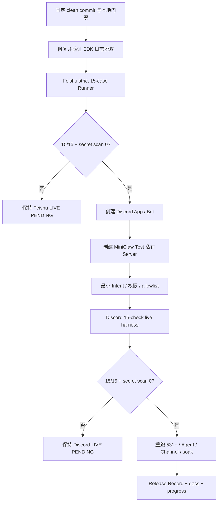

# MiniClaw Phase 5.3：Feishu / Discord Live Gate 收口设计

> 状态：书面设计已确认，等待实施计划
>
> 日期：2026-08-09
>
> 当前基线：531/531 Python、30/30 TypeScript、29/29 offline Agent、32/32 Channel、640/640 local soak
>
> 当前真实状态：Feishu Owner DM 与修复后单卡已验证；Feishu 完整 15-case、Discord 真实 Bot 均为 LIVE PENDING

## 1. 一句话目标

在不重写 Channel Core 的前提下，用真实飞书租户和一个隔离的 Discord Test Server 完成两个平台的 Live Gate，
修复飞书 SDK 连接日志泄露临时参数的问题，并生成绑定 Git commit、可复核且不含私人正文或凭据的验收记录。

Phase 5.3 完成后，MiniClaw 才能准确写成：

```text
Feishu 15/15 LIVE PASS
Discord 15/15 LIVE PASS
Telegram IMPLEMENTATION PASS / LIVE PENDING
```

它仍不等于完成 Phase 6 Evolution、Phase 7 Docker/VPS 或长期生产 SLA。

## 2. 已确认事实

### 2.1 已实现且不重复开发

- Feishu、Telegram、Discord 已共享一个 `AgentRuntime`、Policy、Tools、Memory、Skills 和 SQLite；
- 三个平台拥有独立 Transport、Manager、DeliveryWorker、queue 和降级状态；
- Discord DM、Guild mention、Thread、Approval、Delivery、Restart、Isolation 已有 10 条 versioned offline case；
- Feishu 已有严格的 `FEISHU-LIVE-001..015` 场景集和半自动 Live Runner；
- Telegram/Discord 已有共同的 15 项人工 Live Harness；
- 531 Python、30 TypeScript、29 Agent、32 Channel 和 640-check soak 当前全绿。

因此本阶段不会新写第二个 Discord Adapter、第二套 Agent Loop 或新的平台无关抽象。

### 2.2 已获得的用户授权

用户已明确允许：

- 使用真实 Feishu 与 Discord Bot 发送验收消息；
- 创建专用测试群、Discord Server、频道和 Thread；
- 生成不含正文、账号标识和 Secret 的脱敏 Evidence；
- 使用 `Lucas 的 MiniClaw` 作为 Bot 名称；
- 使用私有 `MiniClaw Test` 作为 Discord Server 名称。

每个独立消息写操作仍应在执行前展示收件人、内容和发送身份；危险 Tool 的批准或拒绝仍必须由 Owner 明确作出。

### 2.3 修复后 Feishu 单卡证据

2026-08-09 的真实 Owner DM 验证中：

- 输入消息 1 条；
- Bot `interactive` 卡片 1 条；
- Bot 普通文本 0 条；
- Gateway 的 Inbox 和 Turn 均完成。

此前截图中的“卡片 + 完整文本”来自修复提交后没有重启的旧 Gateway 进程。Python 进程不会在 `git pull` 或
源码变化后自动热更新，因此 Live Gate 必须把“当前进程对应哪个 commit”纳入运行前检查，不能只看工作树 HEAD。

### 2.4 新发现的安全问题

Feishu Channel SDK 在 INFO 连接日志中输出完整 WebSocket URL；URL query 包含临时 `access_key`、`ticket` 和设备
标识。MiniClaw 自己的 JSON Observer 没有记录这些值，但上游 `Lark` logger 的 handler 会直接写 stdout。

这违反“日志中不出现 Token、Ticket 或完整平台标识”的仓库边界，必须在继续完整 Live Gate 前修复并回归。

## 3. 范围

### 3.1 必须交付

1. 为上游 `Lark` logger 安装进程内日志脱敏边界；
2. 增加测试，证明 WebSocket URL、异常和 `repr` 中不含临时连接参数；
3. 记录 Gateway 启动 commit，并在 Live Runner 启动前拒绝旧进程或来源不明的 Gateway；
4. 复用现有 Feishu 严格 Runner 完成 `FEISHU-LIVE-001..015`；
5. 创建 Discord Developer Application 和 Bot；
6. 创建私有 `MiniClaw Test` Server、普通频道和 Thread 验收区；
7. 只启用 Discord 必需 Intent 和最小频道权限；
8. 把 Discord Bot Token 放入本地 0600 `.env`，把 numeric Owner/Guild/Channel ID 放入本地 `config.toml`；
9. 运行 Discord 15 项真实人工 Harness，任意 fail/skip 均不能标记 Live PASS；
10. 重新运行全部本地发布门禁；
11. 生成 Feishu 与 Discord 的 ignored、脱敏 Evidence；
12. 更新 README、PRD、架构、Phase 5 工程文档、Release Record 与两份进度页。

### 3.2 明确不做

- 不创建 Telegram 账号或 Bot；Telegram 保持 LIVE PENDING；
- 不重写现有 Feishu/Discord Transport；
- 不把 Discord 改成公网 Interaction/Webhook 服务；
- 不启用公开 Server、陌生人访问、多用户或访客模式；
- 不申请 Administrator 权限；
- 不保存真实消息正文、截图、用户名、完整平台 ID 或原始事件 JSON到 Git；
- 不把人工输入 `p` 当成自动 evidence 的替代品；
- 不做 Web 管理后台；
- 不开始 Phase 6 Evolution 或 Phase 7 Docker/VPS；
- 不自动批准危险 Tool，不自动修改或部署 MiniClaw 源码。

## 4. 方案比较

### 4.1 完整 Live Gate + 最小安全加固（采用）

复用生产 Gateway 和现有 Harness，只补日志脱敏、运行版本证明、真实平台配置和证据收口。

优点：范围最小，能直接证明现有架构是否可用；缺点：Discord 的 15 项清单仍包含必须由 Owner 在客户端判断的事实。

### 4.2 只做 DM Smoke（不采用）

只验证 Discord READY、Owner DM 和回复，半小时内可以完成，但无法证明 Guild mention、Thread、Approval、重启、
重连和安全边界，不足以把项目状态改成 Discord LIVE PASS。

### 4.3 重写全自动 Discord E2E 平台（暂不采用）

建立第二个用户 Bot、自动制造 Gateway event、限流与断网故障，可以减少人工操作，但会增加额外 Token、账号、
权限和测试系统。个人学习项目当前不需要为一次 Live Gate 建立整个平台实验室。

## 5. 总体流程



两个平台不并行跑故障注入。先完成 Feishu，再启用 Discord，避免无法判断某条日志、Approval 或 Delivery 属于哪个
平台。最终再运行双平台同时在线的 isolation smoke。

## 6. Workstream A：SDK 日志脱敏与运行版本证明

### 6.1 日志边界

MiniClaw 在导入 `lark_channel` 后、调用 `connect()` 前，为 `Lark` logger 的现有 handler 安装一个幂等 Filter。
Filter 只处理日志文本，不修改 SDK 请求或连接 URL。

最小规则：

- `wss://.../ws/v2?...` 只保留 scheme、host 和 path；完整 query 替换为 `?<redacted>`；
- 普通 URL query 中的 `access_key`、`ticket`、`token`、`device_id` 值替换为 `***`；
- `Authorization`、App Secret 和既有 Token 继续使用现有脱敏规则；
- Filter 不能抛异常；遇到无法解析的对象时输出稳定类型占位符；
- 多次 Gateway start 不得重复安装 handler 或 Filter；
- 测试只使用 sentinel Secret，禁止读取真实 `.env`。

关闭整个 `Lark` logger 不是首选：连接失败、重连和 SDK 错误仍具有运维价值。脱敏后保留事件类型和安全主机信息。

### 6.2 运行版本证明

Live Runner 已把 40 位 commit 写入 Evidence，但本次真实事故说明这不足以证明“正在运行的旧进程”对应同一 commit。
Phase 5.3 增加以下运行约束：

1. Runner 自己启动并持有 production Gateway 子进程时，Evidence 绑定当前 clean commit；
2. 人工 Harness 使用外部 Gateway 时，先确认本机只有一个 MiniClaw Gateway；
3. ready 状态同时记录进程 PID、启动 UTC 与 commit 的短哈希；
4. PID 和启动时间只用于本地 Evidence，不进入 Git 文档；
5. commit 不一致或存在两个 Gateway 时 fail closed，不继续发 Live 消息；
6. 源码更新后必须优雅 SIGTERM，再启动新 Gateway，不承诺热加载。

## 7. Workstream B：Feishu 15-case 收口

继续使用现有：

```bash
uv run python scripts/feishu_live_smoke.py --confirm-live
```

Runner 必须在 clean commit 上自行管理 Gateway，逐项执行 `FEISHU-LIVE-001..015`：

| 分组 | Case | 关键结果 |
| --- | --- | --- |
| 连接与 DM | `001..002` | exact ready、Owner 入站、单一最终回复 |
| 上下文与 Tool | `003..005` | 三轮上下文、`system_info`、Workspace 哨兵 |
| Approval | `006..008` | pending、Allow once 精确一次、Deny 不执行 |
| Admission | `009..011` | 非 Owner 静默、允许群 mention、未 mention 静默 |
| 输出与恢复 | `012..014` | Unicode/emoji/代码块无损、重启记忆、WebSocket reconnect |
| 隐私 | `015` | Secret、完整平台 ID、正文和绝对路径扫描为 0 |

Phase 5.2 新行为加入可见验收：

- 短回答只显示一张 12px completed card；
- 长回答卡片显示前缀，只有未展示后缀回复到卡片下方；
- 卡片前缀与后缀拼接等于完整 Assistant Message，不重复、不丢字符；
- waiting approval 只显示 Approval card；
- completed Turn 重启后不追加普通全文。

Owner 已授权使用 `lark-cli --as user` 发送测试 Query；但每条写操作仍展示目标会话、固定 Query 和身份。人工证据只
确认客户端可见事实，不能覆盖 SQLite、ToolRun、Approval 或 Secret scan 的自动失败。

## 8. Workstream C：Discord Application 与隔离环境

### 8.1 Application / Bot

- Developer Application：`Lucas 的 MiniClaw`；
- Bot 只用于当前用户的个人学习项目；
- Token 生成后只进入本地 `.env`；
- 不把 Token 粘贴到对话、终端 argv、截图、Git 或 Evidence；
- Token 若曾出现在日志或对话中，立即 reset，旧 Token 不再使用。

### 8.2 Gateway Intent

只启用当前 Adapter 实际需要的 Intent：

- Guilds；
- Guild Messages；
- Direct Messages；
- Message Content（当前文本 Agent 必需的 privileged intent）。

不启用 Presence、Server Members 或不相关 privileged intent。

### 8.3 Test Server 与权限

创建私有 `MiniClaw Test` Server，并建立：

```text
MiniClaw Test
├── #miniclaw-live
└── #miniclaw-thread-lab
    └── validation-thread
```

Bot 最小频道权限：

- View Channel；
- Send Messages；
- Read Message History；
- Embed Links；
- Send Messages in Threads；
- Create Public Threads（只有验收确实需要由 Bot 创建 Thread 时才启用）。

不授予 Administrator、Manage Server、Manage Roles、Ban/Kick Members 或访问其他私有频道。

Server 初始只有 Owner 和 Bot；若执行 `non_owner_denied`，再邀请一个明确的测试账号，仅加入测试频道且验收结束后
移除。不能用真实社区 Server 或工作群做故障注入。

### 8.4 本地配置

Secret 只进入 0600 `.env`：

```dotenv
MINICLAW_DISCORD_BOT_TOKEN=...
```

numeric Owner、Guild、Channel ID 进入本地 `config.toml`，不进入 Git：

```toml
[channels.discord]
enabled = true
account_id = "default"
bot_token_env = "MINICLAW_DISCORD_BOT_TOKEN"
owner_user_id = 0
allowed_user_ids = [0]
allowed_guild_ids = [0]
allowed_channel_ids = [0]
allow_guild_mentions = true
```

以上字段名来自当前 typed config；实际 numeric ID 只写入本地配置，不进入仓库文档或 Evidence。

## 9. Workstream D：Discord 15 项真实验收

继续使用现有人工驱动、默认拒绝且不主动发消息的入口：

```bash
uv run python scripts/discord_live_smoke.py --confirm-live
```

Harness 每项只接受 `p/f/s`；任意 `fail` 或 `skip` 返回非零。执行者必须实际完成对应动作后才能输入 `p`：

| Check | 真实动作与通过条件 |
| --- | --- |
| `auth_ready` | Discord Gateway 收到 READY，Bot 在线 |
| `dm_twenty_rounds` | Owner DM 连续 20 轮，无丢失、乱序或重复 |
| `group_addressing` | Guild mention/reply 进入，未寻址消息静默 |
| `reply_or_thread` | Thread 建立独立短期 Conversation |
| `memory_restart` | 记忆写入获批，重启后仍可读取 |
| `read_tool` | 读取配置 Workspace 中的合成哨兵文件 |
| `approval_approve_deny` | Allow once 精确执行一次；Deny 不执行 |
| `non_owner_denied` | 非 Owner 不能批准、切换权限或触发 trusted automation |
| `duplicate_event_once` | 同一平台 message 只创建一个 Inbox/Turn/回复 |
| `long_text_split` | 2000 字预算下中文、emoji、代码块分片完整有序 |
| `rate_limit_retry_after` | 429 映射 retry-after，恢复后不重复 Agent Turn |
| `gateway_restart_recovery` | queued 恢复；running Tool 不盲目重放 |
| `network_reconnect` | 临时断网后 Discord 恢复，Feishu pipeline 不停止 |
| `experience_fallback` | Typing/preview 失败仍收到 durable final text |
| `secret_scan_zero` | 日志和 Evidence 中没有模型 Key、Bot Token 或连接 Ticket |

Harness 的 Evidence 只记录 check/status、起止 UTC、commit 和 SQLite 匿名聚合计数。它不记录消息内容、Server 名称、
用户名、Guild/Channel/Message ID 或 Token。若 Secret 精确字节扫描命中，`secret_scan_zero` 必须被强制改成 fail。

## 10. 双平台隔离 Smoke

两个独立 Live Gate 通过后，最后只做一次有界双平台 smoke：

1. 同时启用 Feishu 和 Discord；
2. 启动一个 GatewaySupervisor；
3. 两个平台各发送一个带唯一 nonce 的 Owner DM；
4. 确认两边各只有一个 Turn 和一个最终回复；
5. 暂停 Discord 网络连接或客户端，确认 Feishu 仍可完成一轮；
6. 恢复 Discord，确认其 pipeline 回到 ready；
7. 优雅 SIGTERM，确认两个 Transport、Delivery、Manager 和共享 Runtime 反向清理。

此 smoke 不修改 15 项结果；它只证明“同时在线时单平台故障不拖垮另一平台”。

## 11. Evidence 与隐私边界

默认本地目录：

```text
.local/eval-results/feishu/<UTC>.json
.local/eval-results/discord/<UTC>.json
```

`.local/` 必须保持 Git ignored。Evidence 允许：

- schema/version；
- channel；
- 40 位 commit；
- 本地 Gateway PID 与启动 UTC（仅用于证明运行来源，不进入 Git 文档）；
- case/check ID；
- pass/fail/skip；
- 起止 UTC 和有界耗时；
- Inbox/Turn/ToolRun/Approval/Delivery/Audit 的匿名状态计数；
- Secret match count。

Evidence 禁止：

- App Secret、Bot Token、access key、ticket、Authorization；
- 用户名、邮箱、手机号、显示名；
- 完整 user/open/chat/guild/channel/message ID；
- Query、回复正文、Memory、Prompt、Tool 参数和本地绝对路径；
- Discord invite URL、OAuth state 或浏览器 session；
- 飞书或 Discord 原始 API / Gateway event。

Release Record 只写 Evidence 的 schema、结论、commit 和门禁摘要，不把 ignored 私有文件提交到 Git。

## 12. 错误处理与停止条件

以下任一情况立即停止对应平台，不继续输入 pass：

- 发现日志或 Evidence 含 Secret、Ticket 或完整平台 ID；
- Gateway commit 与当前 HEAD 不一致；
- 存在两个同配置的 Gateway；
- Bot 被授予 Administrator 或超出设计范围的 privileged intent；
- 非 Owner 能触发 Agent、Approval 或权限切换；
- Approval 重放、重复消息产生第二个 ToolRun/回复；
- 长回复丢失、重排或重复；
- Runner 自动 evidence 失败；
- Git worktree 在 Live Gate 中发生变化；
- 平台权限、账号或网络状态无法确定。

失败时保留脱敏 error code 和本地 Evidence，修复后从受影响 case 或整个 strict suite 重跑；不能修改 Evidence 把失败
改成通过。

## 13. 测试与发布门禁

代码改动按 TDD：

1. 先写含 sentinel `access_key`、`ticket`、`device_id` 的日志 RED；
2. 实现最小日志 Filter；
3. 增加幂等安装、格式化异常和不影响连接事件的测试；
4. 运行 Feishu/Gateway 聚焦测试；
5. 运行完整发布门禁。

最低门禁：

```bash
uv run python -m unittest discover -s tests -v
pnpm --dir tui test
uv run miniclaw eval run --suite offline --root evals/scenarios
uv run miniclaw eval run --suite channel --root evals/scenarios
uv run miniclaw eval run --suite channel --repeat 20 --json --root evals/scenarios
uv run ruff check .
uv run python scripts/validate_docs.py
uv lock --check
uv build
git diff --check
```

真实门禁：

```bash
uv run python scripts/feishu_live_smoke.py --confirm-live
uv run python scripts/discord_live_smoke.py --confirm-live
```

本地 fake SDK、offline cases 和 640 soak 只能证明 IMPLEMENTATION PASS。只有真实平台对应 15 项全部通过、Secret scan
为 0、Evidence 绑定 clean commit，文档才允许写 LIVE PASS。

## 14. 文档与提交

实施完成后同步：

- `README.md`；
- `docs/product/20260807_产品需求文档.md`；
- `docs/architecture/20260807_系统架构.md`；
- `docs/engineering/README.md`；
- Phase 5 Live、Gateway、Discord、Troubleshooting 和 Completion Audit 文档；
- 新的 `docs/evals/releases/v0.5.3.md`；
- 仓库与外部 progress HTML。

提交标题遵循中英文各半，例如：

```text
fix(logging): 脱敏 Feishu SDK connection query
test(feishu): 完成 strict 15-case Live gate
test(discord): 完成 real Bot 15-check acceptance
docs(phase5): 同步 Feishu/Discord Live evidence
```

不重写已推送历史，不把 Secret、ignored Evidence、截图或平台 ID 加入 Git。

## 15. 完成定义

Phase 5.3 只有同时满足以下条件才完成：

- [ ] Feishu SDK 连接日志不含 query Secret 或完整设备 ID；
- [ ] 当前 Gateway 与验收 commit 一致且只有一个实例；
- [ ] Feishu `FEISHU-LIVE-001..015` 全部通过；
- [ ] Feishu 短卡、长回复后缀、Approval 单卡和 restart 无重复真实通过；
- [ ] Discord App/Bot 与私有 Test Server 已按最小权限创建；
- [ ] Discord 15 项 Harness 全部通过，无 skip；
- [ ] 双平台 isolation smoke 通过；
- [ ] Secret scan 为 0；
- [ ] 全部本地门禁通过；
- [ ] 脱敏 Evidence 与 release record 绑定同一 clean commit；
- [ ] README、PRD、架构、工程文档和进度页准确更新；
- [ ] Telegram 仍明确标记 LIVE PENDING；
- [ ] `origin/main` 与本地交付 commit 一致。

## 16. 进入 Phase 6 的条件

Phase 5.3 完成后才编写 Phase 6A Feedback + Replay 的详细规格。Phase 6 可以消费真实失败 case 的脱敏结构，但不能
读取或复制 Live Evidence 中被禁止的数据，也不能把一次人工验收结果直接当成自动 Prompt/Skill 修改授权。
