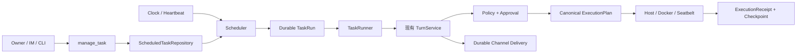
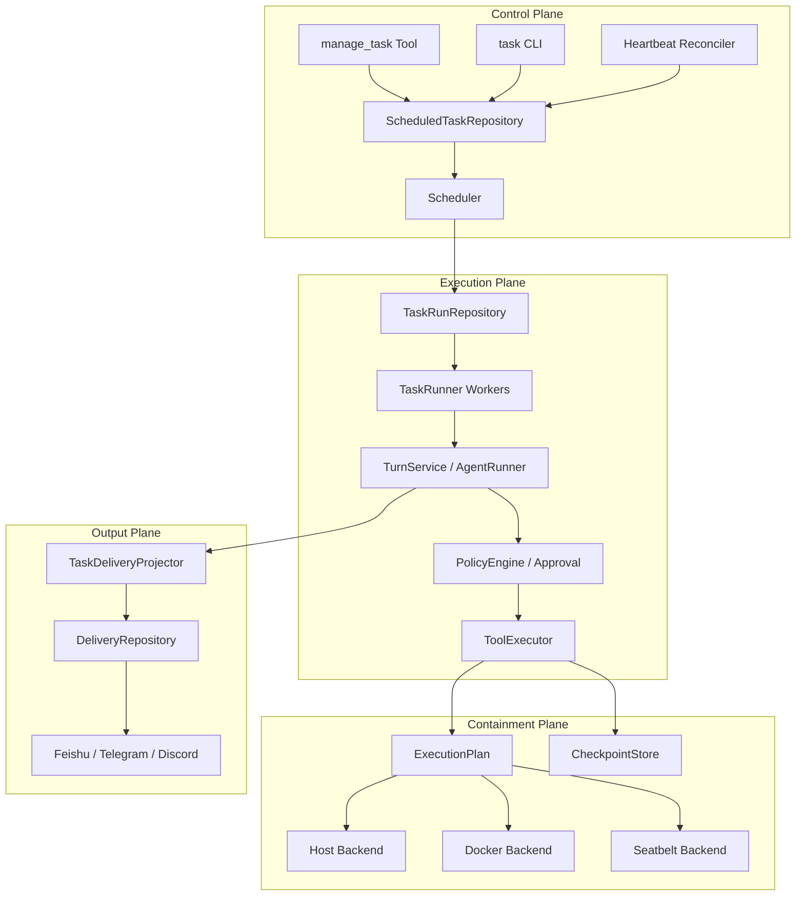
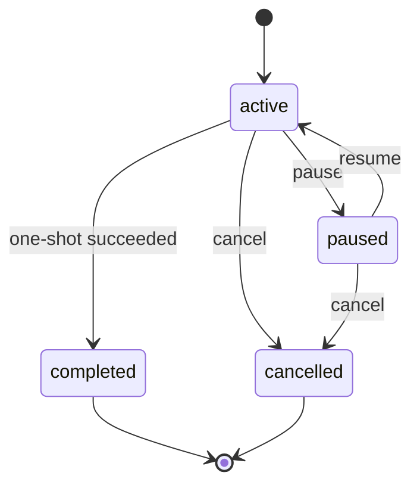
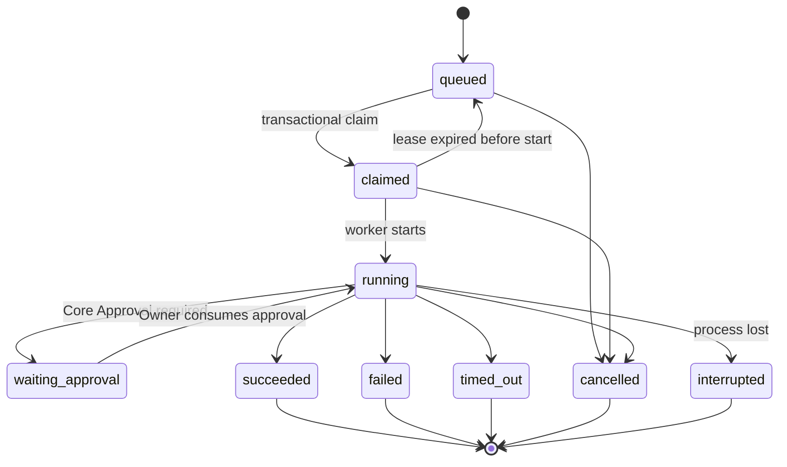
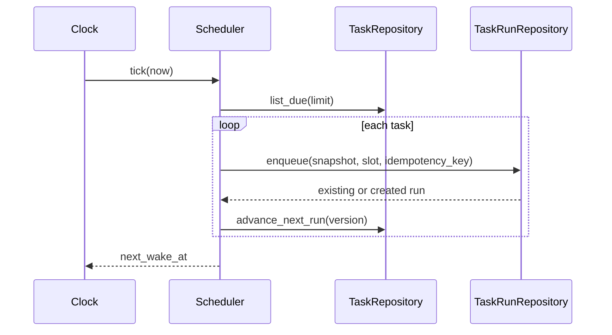
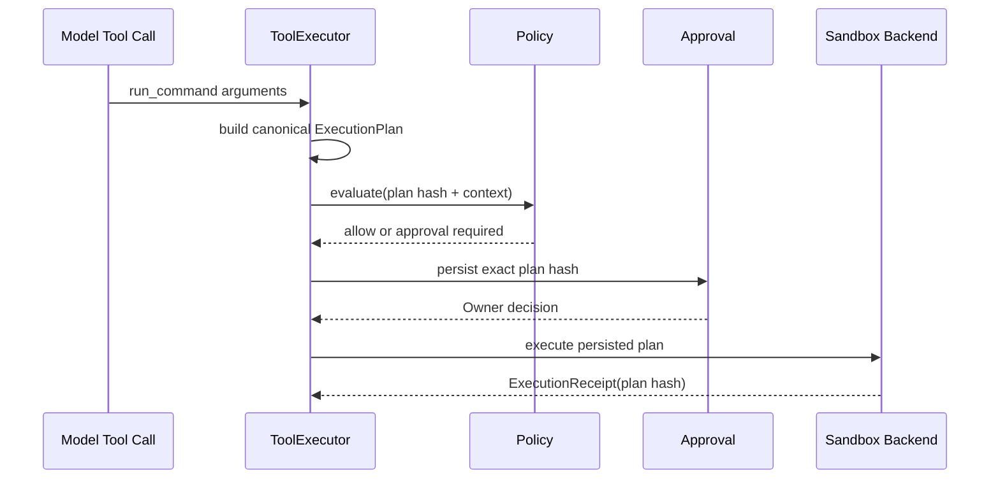

# MiniClaw Phase 6：自治任务、Sandbox 与 Checkpoint 设计

> 发布目标：`v0.7.0`。仓库现有 `v0.6.0`/`v0.6.1` 已用于 Memory Autopilot，Phase 6 不覆盖旧 release record。

> 状态：**APPROVED DESIGN / IMPLEMENTATION PENDING**
>
> 日期：2026-08-09
>
> 用户确认：采用 Durable Autonomy + Fail-closed Sandbox；本轮不包含 Phase 6.5 Browser Agent
>
> 当前代码基线：`main@b120a54`
>
> 当前验证基线：671/671 Python、35/35 TypeScript、39/39 offline Agent、32/32 Channel、
> 20 轮 640/640 local soak
>
> Phase 5.3 真实状态：Feishu **TARGETED CALLBACK LIVE VERIFIED / 15-CASE LIVE PENDING**；
> Discord、Telegram **LIVE PENDING**

## 1. 一句话目标

让 MiniClaw 可以安全地完成“明早九点提醒我”“每周五整理工作区报告并发到飞书”“每半小时检查一次，
没有变化就保持安静”这类长期任务，并保证任务在重启后仍存在、不会重复执行、不会绕过 Policy，且文件修改
可以在发生冲突前预览和回滚。

Phase 6 不是再造一套 Agent。它只增加三层能力：

1. **什么时候做**：one-shot、interval、cron、Heartbeat；
2. **怎么可靠地做**：durable Task Ledger、隔离 Session、预算、重启恢复、主动投递；
3. **最多能影响什么**：ExecutionPlan、Core Policy、Docker/Seatbelt Sandbox、Checkpoint/rollback。

## 2. 大白话解释

当前 MiniClaw 像一个“你叫它才开始干活”的个人助手。Phase 6 要让它像一个有工作台账的值班助手：

- 你先交代任务和时间；
- MiniClaw 把任务保存进 SQLite；
- 到时间后 Scheduler 只生成一张“待办执行单”；
- TaskRunner 拿执行单进入现有 Agent Loop；
- 每次 Tool 仍先过 Policy，危险操作仍需审批；
- Shell 等命令进入 Sandbox，不把整个 Home 暴露给任务；
- 结果先进入 durable Delivery，再发往飞书、Telegram、Discord；
- 进程中途退出时，重启后从账本恢复，而不是靠日志猜测发生了什么。



## 3. 范围

### 3.1 必须交付

1. `once`、`interval`、五字段 `cron`、内部 `heartbeat` 四种 Schedule；
2. IANA timezone、DST、misfire、最小 interval 和有界 catch-up 规则；
3. SQLite `scheduled_tasks`、`task_runs`、执行 lease、不可变 run snapshot；
4. create/list/show/update/pause/resume/cancel/run-now 完整生命周期；
5. 一个对模型公开的 action-style `manage_task` Tool；
6. 面向用户的 `miniclaw task` 子命令族；
7. Scheduler 与 TaskRunner 独立，Scheduler 不调用 Provider 或 Tool；
8. 每个 Run 使用独立 automation Session，并复用唯一 `TurnService`；
9. wall-clock、Turn、Tool、Token、输出、并发预算；
10. `waiting_approval` 持久化，重启不自动批准；
11. 主动 Feishu/Telegram/Discord Delivery 的 durable、幂等和静默语义；
12. 系统拥有的 Heartbeat、active hours、合并检查和无事静默；
13. canonical `ExecutionPlan`、稳定 plan hash、绑定审批的 `ExecutionReceipt`；
14. Docker 主要 Sandbox backend、macOS Seatbelt 可选 backend、Host 兼容 backend；
15. 非 root、只读 rootfs、无网络默认、cap drop、资源限制和显式 mount；
16. 文件 Tool 修改前的 content-addressed Checkpoint；
17. rollback preview、preview hash、当前文件冲突检查和原子恢复；
18. Gateway 生命周期、Doctor、运行健康和错误码；
19. versioned automation eval、确定性测试、local soak 和可执行的 Live Gate；
20. Task Prompt/Skill 引用扫描，以及只能由本地 CLI 控制的 durable E-stop；
21. README、PRD、架构、工程文档、发布记录和两份进度页同步。

### 3.2 明确不做

- 不包含 Phase 6.5 Browser Agent；
- 不做多 Agent、Sub-agent、工作流 DAG 或分布式队列；
- 不让自动任务递归创建、修改或删除其他自动任务；
- 不把任意 webhook URL 作为投递目标；
- 不做自然语言时间解析器；模型必须生成强类型 schedule；
- 不提供秒级 cron、年份字段或无界补跑；
- 不自动批准危险 Tool；
- 不把 Sandbox 当成 Policy 的替代品；
- 不对整个 Home、`.git`、数据库、Secret 或 socket 做 Checkpoint；
- 不承诺 Host backend 是恶意代码的安全边界；
- 不把 fake SDK、单元测试或短 soak 写成真实平台 `LIVE VERIFIED`；
- 不在本阶段实现 Feedback/Proposal/Evolution；那属于 Phase 7。

## 4. 参考项目与采用决策

本设计以官方文档、官方仓库和源码为依据，不根据二手功能清单照搬。

### 4.1 OpenClaw

参考：[Automation](https://docs.openclaw.ai/automation)、
[Scheduled Tasks](https://docs.openclaw.ai/automation/cron-jobs)、
[Background Tasks](https://docs.openclaw.ai/automation/tasks)、
[Heartbeat](https://docs.openclaw.ai/gateway/heartbeat)、
[Sandboxing](https://docs.openclaw.ai/gateway/sandboxing)。

| OpenClaw 做法 | MiniClaw 采用 | MiniClaw 不照搬 |
| --- | --- | --- |
| Cron 与 Task Ledger 分开 | Schedule 和 Run 使用两个 Repository | 不实现 TaskFlow/DAG |
| isolated run 使用新 Session | 每个 TaskRun 固定独立 Session | 不提供 main/current/custom 四种 Session |
| push completion，不鼓励轮询 | Run 终态主动投递或保持静默 | 不提供任意 webhook |
| Task 统一 queued→running→terminal | 使用显式状态机和终态不可变 | 不把所有 CLI 操作都纳入 Task |
| Docker 默认无网络、只读 rootfs、drop caps | 作为自动命令推荐 backend | 不挂 Docker socket 给 Agent |
| Cron 有 run history 和 failure diagnostics | TaskRun 保存错误码、usage、Delivery | 不保存用户正文到普通日志 |

OpenClaw 的重要教训是：Cron 是 Scheduler，Task 是执行账本，两者不能混为一个布尔状态；Sandbox、Tool Policy
和 elevated/host execution 也是三种不同边界。

### 4.2 Hermes Agent

参考：[Scheduled Tasks](https://hermes-agent.nousresearch.com/docs/user-guide/features/cron)、
[Cron Internals](https://hermes-agent.nousresearch.com/docs/developer-guide/cron-internals)、
[Security](https://hermes-agent.nousresearch.com/docs/user-guide/security/)、
[Features Overview](https://hermes-agent.nousresearch.com/docs/user-guide/features/overview/)。

| Hermes 做法 | MiniClaw 采用 | MiniClaw 改进 |
| --- | --- | --- |
| 一个 action-style `cronjob` Tool | 一个 action-style `manage_task` Tool | Tool 参数绑定 Core Policy 与 owner identity |
| Fresh agent session | automation Session 不继承聊天的临时上下文 | 明确复用 Owner Memory Disclosure，不复制历史正文 |
| Cron run execution ledger | Run 在 Provider 前先落账本 | SQLite 是唯一事实源，不再叠加 jobs.json |
| Cron 中禁止再次调用 cron Tool | TaskRun 的 Tool allowlist硬移除 `manage_task` | Provider 即使输出该调用也返回稳定拒绝 |
| prompt/skill 注入扫描 | Task prompt 做 Secret/控制指令扫描 | v1 不允许 Task 绑定未验证 Skill |
| abandoned attempt 标记 unknown | lease 过期后按副作用证据决定 interrupted/retry | 只有未开始或只读、有 receipt 的步骤允许安全恢复 |

### 4.3 nanobot

参考：[HKUDS/nanobot](https://github.com/HKUDS/nanobot) 及其官方 Release Notes。

重点吸收真实事故经验：

- 外部任务状态变化需要安全刷新，不能永久缓存；
- 固定 interval 在并发 store replace 时容易重复；
- Cron job 不能递归调度更多 Cron；
- `CancelledError` 必须清理子进程和异步 client；
- retry 必须依据结构化错误类型，不能只用错误文本正则；
- proactive delivery 必须有 origin message / idempotency key。

MiniClaw 使用 SQLite transaction、stable idempotency key 和结构化错误码解决这些问题，不复制 JSON job store。

### 4.4 ZeroClaw、RayClaw、PicoClaw、NanoClaw、IronClaw

参考：

- [ZeroClaw](https://github.com/zeroclaw-labs/zeroclaw)：动作/费用上限、审批、E-stop、Landlock/Bubblewrap；
- [RayClaw](https://github.com/rayclaw/rayclaw)：`schedule_task` 与 Channel Adapter 解耦；
- [PicoClaw](https://github.com/sipeed/picoclaw)：轻量二进制、Cron/Delivery/Sandbox 分层；
- [NanoClaw](https://github.com/nanocoai/nanoclaw)：container-first 的小型个人 Agent；
- [IronClaw Jobs](https://docs.ironclaw.com/capabilities/jobs)：统一 Job、队列顺序、per-job sandbox token；
- [IronClaw](https://github.com/nearai/ironclaw)：orchestrator/worker 与 per-project sandbox。

MiniClaw 采用“能力预算、紧急停止、Job 与 Channel 解耦、container-first”的共识，但保留 Python/SQLite 单机内核，
不因参考 Rust/Go 项目而重写语言或引入分布式基础设施。

## 5. 方案选择

### 5.1 方案 A：Durable Core + Fail-closed Sandbox（采用）

SQLite 保存调度与运行真相；Scheduler、Runner、Delivery、Sandbox 各有清晰边界；后台任务继续经过现有 Core。

优点：最适合学习可靠 Agent runtime；可审计、可恢复、可测试。缺点：实现量最大，需要迁移、状态机和故障测试。

### 5.2 方案 B：APScheduler + MiniClaw Adapter（不采用）

APScheduler 可以快速获得 cron 和持久化，但会形成 APScheduler job store 与 MiniClaw TaskRun 两套事实源；审批、
Delivery 和 recovery 仍需自建，最终边界更难理解。

### 5.3 方案 C：系统 cron/launchd（不采用）

实现最少，但不能统一 Channel 身份、Memory Disclosure、Approval、Budget、Task Ledger 和幂等恢复，也不适合 IM
中的自然语言管理。

## 6. 用户体验

### 6.1 IM / TUI Query

```text
明天上午九点提醒我检查 MiniClaw 的 GitHub Actions。
每周五下午五点，整理本周工作区里的 Markdown 变更并发到飞书。
每半小时检查一次项目测试状态；没有变化就不要发消息。
暂停“每周项目摘要”。
立即运行任务 12。
列出失败的自动任务。
```

模型必须调用 `manage_task`，不能只口头声称“已经设置”。最终回复必须包含 Task ID、规范化时间、时区、下次运行
时间、投递目标和权限摘要。

### 6.2 CLI

```bash
uv run miniclaw task list
uv run miniclaw task show 12
uv run miniclaw task pause 12
uv run miniclaw task resume 12
uv run miniclaw task run 12
uv run miniclaw task cancel 12
uv run miniclaw task runs 12 --limit 20
uv run miniclaw task halt --reason "unexpected automation behavior"
uv run miniclaw task unhalt
```

CLI 不接受任意 Python callback、shell string 或 Secret。创建和编辑仍主要通过 Agent Tool；CLI 提供可审计的运维与
恢复入口。`halt/unhalt` 是本机 Owner 的 durable E-stop，不向模型公开；halt 后 Scheduler 不再 enqueue，Runner 不再
claim 新 Run，正在运行的 Run 进入有界取消。

### 6.3 `manage_task` Tool

```python
manage_task(
    action="create",
    name="每周项目摘要",
    schedule={
        "kind": "cron",
        "expression": "0 17 * * 5",
        "timezone": "Asia/Shanghai",
    },
    prompt="统计工作区本周 Markdown 变更，输出中文摘要；保留文件名和代码术语。",
    delivery={
        "channel": "feishu",
        "account_id": "default",
        "conversation_id": "owner",
    },
    budget={
        "timeout_seconds": 600,
        "max_turns": 8,
        "max_tool_calls": 30,
        "max_input_tokens": 64000,
        "max_output_tokens": 16000,
    },
)
```

公开 action：`create`、`list`、`show`、`update`、`pause`、`resume`、`cancel`、`run_now`。

自动 Run 的 ToolRegistry 不包含 `manage_task`。因此第一层任务即使被 Prompt Injection 影响，也不能创建第二层任务。

### 6.4 Task Prompt Guard

创建和更新 Task 时，在写 SQLite 前执行确定性 Guard：

- 拒绝 private key、Bearer token、常见 API key/secret 赋值和不可见 Unicode 控制字符；
- 允许引用环境变量名，例如 `GITHUB_TOKEN`，但不允许把值写入 prompt；
- 拒绝要求修改 MiniClaw Policy、配置、Task Ledger、系统 Prompt 或再次创建 Cron 的正文；
- Skill 只能引用当前已加载、已通过 metadata 校验的本地 Skill name；
- Guard 只负责明显控制面/Secret 风险，不能把普通网页内容误报为“已安全”；
- 被拒绝的正文不写入普通日志，Audit 只保存错误码与有界 hash。

### 6.5 内部 `complete_task` Tool

自动 Run 不依赖模型输出魔法字符串，也不要求所有 OpenAI-compatible Provider 支持同一种 `response_format`。
TaskRunner 为 automation Session 注入一个仅内部可见的 terminal Tool：

```python
complete_task(notify=True, text="本周有 3 个 Markdown 文件发生变化……")
complete_task(notify=False, text="")
```

- Tool schema 只含 `notify: bool` 与有界 `text: str`；
- AgentRunner 执行成功后立即产生 terminal automation result，不再进行下一轮 Provider 调用；
- 普通 CLI/IM Session 看不到该 Tool；
- 自动 Run 未调用该 Tool、重复调用或参数非法时以 `task_completion_invalid` 失败；
- `notify=false` 要求 `text` 为空，避免把敏感正文保存后只是不投递。

## 7. 总体架构



### 7.1 单一事实源

- SQLite：Task、Run、lease、状态、预算、Approval 关联、Delivery 关联；
- Markdown Memory：语义长期记忆；
- 文件系统 Checkpoint store：受限 blob 与 manifest；
- 日志：只用于诊断，不用于恢复；
- 进程内 asyncio Task：只负责运行，不是持久状态。

## 8. 数据模型

当前 schema 已到 v4，因此 Phase 6 使用 `0005_autonomy.sql`，不能复用旧计划中的 `0004_autonomy.sql`。

### 8.1 `scheduled_tasks`

```sql
CREATE TABLE scheduled_tasks (
    id INTEGER PRIMARY KEY,
    owner_id INTEGER NOT NULL REFERENCES users(id),
    name TEXT NOT NULL,
    schedule_kind TEXT NOT NULL
        CHECK(schedule_kind IN ('once', 'interval', 'cron', 'heartbeat')),
    schedule_expression TEXT NOT NULL,
    timezone TEXT NOT NULL,
    prompt TEXT NOT NULL,
    skill_names_json TEXT NOT NULL DEFAULT '[]',
    delivery_json TEXT NOT NULL,
    policy_profile TEXT NOT NULL,
    budget_json TEXT NOT NULL,
    system_key TEXT,
    status TEXT NOT NULL
        CHECK(status IN ('active', 'paused', 'completed', 'cancelled')),
    next_run_at TEXT,
    last_run_at TEXT,
    version INTEGER NOT NULL DEFAULT 1,
    created_at TEXT NOT NULL,
    updated_at TEXT NOT NULL
);

CREATE INDEX scheduled_tasks_due_idx
ON scheduled_tasks(status, next_run_at, id);

CREATE UNIQUE INDEX scheduled_tasks_system_key_idx
ON scheduled_tasks(owner_id, system_key)
WHERE system_key IS NOT NULL;
```

`version` 用于 update/pause/resume 的 optimistic concurrency，避免模型用旧列表结果覆盖用户刚完成的修改。

### 8.2 `task_runs`

```sql
CREATE TABLE task_runs (
    id INTEGER PRIMARY KEY,
    task_id INTEGER NOT NULL REFERENCES scheduled_tasks(id),
    session_id INTEGER REFERENCES sessions(id),
    turn_id INTEGER REFERENCES turns(id),
    approval_id INTEGER REFERENCES approvals(id),
    scheduled_for TEXT NOT NULL,
    idempotency_key TEXT NOT NULL UNIQUE,
    snapshot_json TEXT NOT NULL,
    status TEXT NOT NULL CHECK(status IN (
        'queued', 'claimed', 'running', 'waiting_approval',
        'succeeded', 'failed', 'cancelled', 'timed_out', 'interrupted'
    )),
    attempt INTEGER NOT NULL DEFAULT 0,
    worker_id TEXT,
    lease_expires_at TEXT,
    claimed_at TEXT,
    started_at TEXT,
    completed_at TEXT,
    result_preview TEXT,
    response_json TEXT,
    error_code TEXT,
    usage_json TEXT NOT NULL DEFAULT '{}',
    created_at TEXT NOT NULL
);

CREATE INDEX task_runs_state_idx
ON task_runs(status, lease_expires_at, id);
```

`snapshot_json` 是创建 Run 时的不可变 Task 快照。Task 之后被编辑，不影响已经 queued 的 Run。

### 8.3 `automation_control`

```sql
CREATE TABLE automation_control (
    singleton INTEGER PRIMARY KEY CHECK(singleton = 1),
    halted INTEGER NOT NULL CHECK(halted IN (0, 1)),
    reason TEXT,
    revision INTEGER NOT NULL,
    scheduler_heartbeat_at TEXT,
    updated_at TEXT NOT NULL
);

INSERT INTO automation_control(
    singleton, halted, reason, revision, scheduler_heartbeat_at, updated_at
)
VALUES (1, 0, NULL, 1, NULL, CURRENT_TIMESTAMP);
```

只有本地 CLI/运维代码能修改该行；模型 Tool 没有 halt/unhalt action。Scheduler 和 Runner 每次产生/claim 新工作前均
读取这一 durable control，不能只依赖进程内 Event。

### 8.4 Checkpoint 表

```sql
CREATE TABLE checkpoints (
    id INTEGER PRIMARY KEY,
    owner_id INTEGER NOT NULL REFERENCES users(id),
    turn_id INTEGER REFERENCES turns(id),
    task_run_id INTEGER REFERENCES task_runs(id),
    tool_run_id INTEGER REFERENCES tool_runs(id),
    manifest_json TEXT NOT NULL,
    manifest_hash TEXT NOT NULL,
    status TEXT NOT NULL CHECK(status IN ('captured', 'restored', 'expired')),
    total_bytes INTEGER NOT NULL,
    created_at TEXT NOT NULL,
    restored_at TEXT
);

CREATE INDEX checkpoints_created_idx
ON checkpoints(owner_id, created_at DESC, id DESC);
```

Blob 使用 `state/checkpoints/blobs/<sha256>`，mode `0600`，同内容只保存一次。manifest 不记录绝对 Home 路径，只记录
Workspace 相对路径、类型、mode、size、before hash 和 after hash。

### 8.5 `execution_plans` 与 Approval binding

```sql
CREATE TABLE execution_plans (
    tool_run_id INTEGER PRIMARY KEY REFERENCES tool_runs(id),
    schema_version INTEGER NOT NULL,
    plan_json TEXT NOT NULL,
    plan_hash TEXT NOT NULL,
    backend TEXT NOT NULL CHECK(backend IN ('host', 'docker', 'seatbelt')),
    receipt_json TEXT,
    created_at TEXT NOT NULL,
    completed_at TEXT
);

ALTER TABLE approvals ADD COLUMN execution_plan_hash TEXT;
```

- 只有需要 Sandbox 的 ToolRun 才有 `execution_plans` 行；
- `ToolRunRepository.start()` 与 plan row 在同一 transaction 创建；
- Approval 创建时复制同一个 plan hash；
- continuation 同时校验 `arguments_hash`、Approval plan hash、plan row hash 和重新 canonicalize 的 hash；
- receipt 的 plan hash 必须与 plan row 一致才可终结 ToolRun；
- legacy Approval 的新列为空，继续按原参数绑定逻辑工作，但不能用于 Phase 6 Sandbox resume。

### 8.6 主动投递关联

v5 为现有 `deliveries` 增加 nullable `task_run_id`。普通 IM Delivery 继续以 `message_id` 关联；主动任务 Delivery
以 `task_run_id` 关联，两者必须且只能有一个非空。

```sql
ALTER TABLE deliveries ADD COLUMN task_run_id INTEGER REFERENCES task_runs(id);

CREATE UNIQUE INDEX deliveries_task_run_part_idx
ON deliveries(task_run_id, channel, part_index, delivery_kind)
WHERE task_run_id IS NOT NULL;
```

Repository 在写入时检查 `(message_id IS NULL) != (task_run_id IS NULL)`。`TaskRunner` 先把完整、结构化
`TaskResponse` 写入 `task_runs.response_json` 并提交，Projector 再创建 Delivery。这样即使进程在两步之间崩溃，重启仍能
从 Run 恢复完整回答；不能只保存截断的 `result_preview`。

## 9. 状态机

### 9.1 ScheduledTask



终态不能恢复。要重新使用相同内容必须创建新 Task，保留旧审计。

### 9.2 TaskRun



终态不可修改。新的 retry 创建新 Run/attempt，而不是把失败行改回 queued。

## 10. Schedule 语义

### 10.1 类型

| kind | expression | 例子 | 规则 |
| --- | --- | --- | --- |
| `once` | RFC 3339 timestamp | `2026-08-10T09:00:00+08:00` | 成功或终态后 Task completed |
| `interval` | 整数秒字符串 | `3600` | 最小 60 秒；从已规范化 slot 推进 |
| `cron` | 五字段 cron | `0 9 * * 1-5` | 必须带 IANA timezone |
| `heartbeat` | 配置生成 | `1800` | system-owned，用户 Tool 不创建 |

### 10.2 解析实现

- `zoneinfo.ZoneInfo` 负责 IANA timezone；
- `croniter>=6.2,<7` 只负责五字段 cron occurrence；
- 禁止 seconds/year 字段、`@reboot`、locale alias 和嵌入式命令；
- 输入规范化后保存原表达式与 UTC `next_run_at`；
- `croniter` 的输出必须再经过 MiniClaw 的 DST 和单调性检查；
- 测试固定时钟，不依赖机器本地 timezone。

### 10.3 DST

- 春季不存在的本地时间：跳到 croniter 返回的下一个有效 occurrence；
- 秋季重复时间：同一个本地 wall-clock slot 只运行一次；
- idempotency key 使用 `task_id + normalized scheduled_for UTC`；
- 每个边界都用 `America/New_York` 与 `Asia/Shanghai` 固定测试。

### 10.4 Misfire

- `misfire_grace_seconds` 默认 300；
- 超过 grace 的 once 任务标记 failed `schedule_misfire`，不突然补做；
- interval/cron 每次 tick 最多补一个最近 slot；
- Scheduler 直接推进 `next_run_at` 到未来，禁止开机后补跑数百次；
- 手工 `run_now` 使用独立 `manual:<uuid>` idempotency key，不改变正常下次时间。

## 11. Scheduler

Scheduler 只做三件事：

1. 查询有界数量的 due active tasks；
2. 在 `BEGIN IMMEDIATE` 中创建唯一 TaskRun 并推进 next occurrence；
3. 计算下一次 wake 时间。

它不得导入 Provider、AgentRunner、Channel Transport 或 Tool。



并发两个 Scheduler 时，唯一键和 transaction 必须保证同一 slot 只有一行。

## 12. TaskRunner

### 12.1 Claim 与 lease

- `BEGIN IMMEDIATE` 选择最早 queued Run；
- 写 `worker_id`、`claimed_at`、`lease_expires_at`、attempt；
- Worker 在执行期间周期性续 lease；
- claim 后尚未 start 的 lease 可回到 queued；
- running lease 丢失标记 interrupted，不能盲目重跑副作用。

### 12.2 Session 与身份

- Channel=`automation`；account=`local`；conversation=`task:<task_id>:run:<run_id>`；
- 每个 Run 创建新 Session，不继承创建聊天的临时对话历史；
- Owner identity 验证来自 Task row，不来自 Prompt；
- Owner private Memory 可以按 Disclosure 规则召回；
- 群聊/非 Owner 创建请求在进入 Repository 前已经 fail closed；
- run prompt 以 system-owned provenance 进入 User-equivalent Message，但不能伪造真实用户 message ID。

### 12.3 Tool 集合

Run 从普通 Registry 派生受限视图：

- 永远移除 `manage_task`；
- 移除任何 interactive-only Tool；
- 只保留 Task snapshot 中请求且配置允许的 Tool；
- 权限是“创建者权限 ∩ automation profile ∩ task request”；
- `yolo` 不得关闭 sensitive path、network 和 resource hard limits。

### 12.4 Approval

自动 Run 触发危险 Tool 时：

1. Core 创建 Approval；
2. Run 变为 `waiting_approval`；
3. Channel 投递审批卡；
4. Scheduler/Runner 不重复调用 Tool；
5. Owner 点击一次后按现有 child Turn continuation 执行；
6. 拒绝、过期或参数不一致形成稳定终态；
7. 重启后仍能从 Approval 与 Run 关联继续。

## 13. Budget

```python
@dataclass(frozen=True, slots=True)
class TaskBudget:
    timeout_seconds: int = 600
    max_turns: int = 8
    max_tool_calls: int = 30
    max_input_tokens: int = 64_000
    max_output_tokens: int = 16_000
    max_cost_microusd: int | None = None
```

规则：

- 用户/模型只能请求更小预算；
- Provider usage 缺失时不伪造 token/cost；仍执行 wall-clock、turn、tool 和 output hard limit；
- 超预算产生 `task_budget_*` 错误码和受限通知；
- timeout 会取消 Provider、Tool 和子进程，并等待有界清理；
- 全局 `max_concurrent_runs` 默认 2；同一 Task 默认最多 1 个 active Run；
- Heartbeat 和普通 Task 共享全局并发预算；
- 预算统计保存数值，不保存 Prompt、Tool Result 或 Secret。

## 14. 主动投递与静默

### 14.1 DeliveryTarget

只允许已有配置中启用且通过 allowlist 的目标：

```python
@dataclass(frozen=True, slots=True)
class DeliveryTarget:
    route: Literal["origin", "owner", "explicit", "none"]
    channel: Literal["feishu", "telegram", "discord", "cli", "none"]
    account_id: str | None
    conversation_id: str | None
```

`origin` 在创建时解析成当前 verified Owner Channel route；`owner` 解析成指定 Channel 的配置 Owner route；
`explicit` 只允许已经在 Channel allowlist 中的 conversation。最终 snapshot 保存解析后的 route，运行时不能根据模型文本
拼接平台 ID；CLI origin 默认 `none`，除非用户显式选择已配置 Channel。

### 14.2 Structured result

后台 Turn 的最终投影是：

```python
@dataclass(frozen=True, slots=True)
class TaskResponse:
    notify: bool
    text: str
```

- `notify=false` 时不创建 Delivery，但 Run 保留脱敏 preview；
- 不解析普通回答中的 `NO_REPLY`、`[SILENT]` 等魔法字符串；
- Agent 未调用一次且仅一次 `complete_task` 时默认发送受限失败提示，不静默丢失；
- Delivery UUID 由 `task_run_id + part_index` 稳定派生；
- 重启 Projector 不生成第二份消息；
- 长回复继续复用平台分片和飞书卡片 suffix 规则。

## 15. Heartbeat

Heartbeat 是 system-owned ScheduledTask，不是第二个 Scheduler。

- 默认 interval 30 分钟；
- 配置 `active_hours_start/end` 与 IANA timezone；
- Gateway 启动时 reconcile 一条固定 identity 的 Task；
- 配置关闭时 pause，不删除历史；
- active hours 外不 enqueue Run；
- 同一时刻已有普通 Run 占满并发时延后；
- check prompt 来自受管配置/文件，不接受网页或 IM 直接覆盖；
- 无事返回 `notify=false`；
- Heartbeat Run 不能调用 `manage_task`；
- Heartbeat 不创建新的 Cron，也不自动批准危险动作。

## 16. ExecutionPlan 与 Approval binding

```python
@dataclass(frozen=True, slots=True)
class ExecutionPlan:
    argv: tuple[str, ...]
    cwd: Path
    environment_names: tuple[str, ...]
    read_roots: tuple[Path, ...]
    write_roots: tuple[Path, ...]
    timeout_seconds: int
    memory_mib: int
    cpu_seconds: int
    pids_limit: int
    network_mode: Literal["none", "allowlisted"]
    backend: Literal["host", "docker", "seatbelt"]
```

`execution_plan_sha256(plan: ExecutionPlan) -> str` 使用版本化 canonical JSON：UTF-8、sorted keys、无浮点、
Path 规范化、环境变量名排序。Plan、数据库、Approval 与 Receipt 都不保存环境变量值；Backend 只在执行瞬间从受管
Secret/config 边界解析允许的名称。Approval 保存 plan hash；
恢复执行只读取持久化 plan，不重新接受模型参数。



## 17. Sandbox Backends

### 17.1 Host

- 保持现有 exact-argv、allowlisted executable、受限 env、Workspace cwd；
- 主要用于交互任务和兼容模式；
- 明确标记 `isolation=application-policy-only`；
- 无人值守命令默认不使用 Host，除非配置显式选择且 command profile 只读；
- Host 不是恶意代码安全边界。

### 17.2 Docker（推荐）

固定安全参数：

```text
docker run --rm
  --network none
  --read-only
  --cap-drop ALL
  --security-opt no-new-privileges
  --pids-limit <bounded>
  --memory <bounded>
  --cpus <bounded>
  --user <fixed-non-root-uid:gid>
  --mount type=bind,src=<workspace>,dst=/workspace,rw
```

- 只 mount canonical declared roots；
- 禁止 `/`、Home、`.ssh`、`.aws`、`.config`、Docker socket、state DB 和 socket；
- rootfs 只读，临时目录使用有限 tmpfs；
- 默认无网络；首版不实现动态 hostname egress proxy；
- image 使用配置中固定名称与可选 digest；
- 不允许模型传 `--privileged`、mount、env、user、entrypoint 或 Docker flags；
- Docker 不可用时 fail closed，不自动退回 Host。

### 17.3 macOS Seatbelt（可选）

- 启动时探测 `/usr/bin/sandbox-exec`；
- profile 仅由 canonical paths 生成，不能拼模型字符串；
- 默认 deny，允许必要 process、read roots、write roots；
- network none 时明确 deny network；
- 不支持的平台返回 `sandbox_backend_unavailable`；
- 文档说明 Seatbelt 是 macOS 兼容隔离，不取代 Docker release smoke。

## 18. Checkpoint 与 rollback

### 18.1 Capture

- `write_file`/`edit_file` 在副作用前 capture 精确目标；
- 自动 `run_command` 若拥有写权限，在执行前 capture 有界 Workspace manifest；
- 只处理 regular files；symlink fail closed；
- 排除 `.git`、MiniClaw state、DB/WAL/SHM、socket、日志、credentials；
- 默认最多 2,000 entries、64 MiB snapshot、单文件 8 MiB；
- 超限的自动写任务 fail closed `checkpoint_budget_exceeded`；
- 已不存在的文件记录 tombstone；
- capture 完成后才允许 Tool 执行。

### 18.2 Receipt

执行后记录 changed relative paths、before/after hash、exit code、timeout 和有界 stdout/stderr preview。Receipt 不记录
Secret environment、完整私人路径或未截断 Tool output。

### 18.3 Rollback

1. `preview(checkpoint_id)` 计算当前 hash 与冲突；
2. 返回将恢复、删除、跳过、冲突的相对路径；
3. Owner 确认 preview hash；
4. `apply(checkpoint_id, expected_preview_hash)` 再次核验；
5. 有任何用户后续修改则拒绝整个 atomic batch；
6. 使用临时文件、fsync、atomic replace；
7. rollback 自身写 Audit 和 checkpoint 状态；
8. 不恢复 Secret、数据库、`.git` 或超预算 blob。

## 19. 配置

新增顶层配置时，Automation/Heartbeat 默认关闭；Sandbox 没有自动 Run 时不主动执行；Checkpoint 默认开启但只在既有
受 Policy 允许的写 Tool 前增加恢复点，不改变成功回复格式：

```toml
[automation]
enabled = false
max_active_tasks = 50
max_concurrent_runs = 2
misfire_grace_seconds = 300
lease_seconds = 60

[heartbeat]
enabled = false
interval_seconds = 1800
timezone = "Asia/Shanghai"
active_hours_start = "08:00"
active_hours_end = "23:00"

[sandbox]
backend = "docker"
image = "miniclaw-sandbox:phase6"
network = "none"
memory_mib = 512
cpu_seconds = 60
pids_limit = 128

[checkpoint]
enabled = true
max_entries = 2000
max_total_bytes = 67108864
max_file_bytes = 8388608
max_count = 100
```

未知 key、错误类型、越界预算、非 IANA timezone、相对 image/mount 和不支持 backend 均在 config load 阶段失败。

## 20. Gateway 生命周期

启动顺序：

```text
config/db/migration → stale lease recovery → Heartbeat reconcile
→ Delivery workers → TaskRunner workers → Scheduler → Channel transports
```

关闭顺序：

```text
stop Scheduler → stop new claims → bounded TaskRunner drain/cancel
→ flush Delivery → stop Channel transports → stop Memory worker → close runtime
```

第一次 SIGTERM 进入有界优雅关闭；第二次信号取消仍在运行的 Tool/Provider 并将对应 Run 标记 interrupted/cancelled，
不能留下永久 claimed row。

## 21. Doctor 与运维

`miniclaw doctor` 新增只读检查：

- schema version；
- automation enabled/disabled；
- active/paused task 数；
- queued/running/waiting/stale run 数；
- 最近 Scheduler heartbeat；
- Sandbox backend availability；
- Docker image 是否存在；
- Seatbelt 是否支持；
- Checkpoint store mode、配额和 orphan blob；
- Delivery backlog；
- 不执行 Task、不连接 Provider、不回显 Secret。

## 22. 错误码

| 前缀 | 示例 | 含义 |
| --- | --- | --- |
| `schedule_` | `schedule_timezone_invalid` | 解析、DST、misfire |
| `task_` | `task_state_conflict` | 生命周期或 version 冲突 |
| `task_budget_` | `task_budget_tool_calls` | Run 预算耗尽 |
| `task_lease_` | `task_lease_lost` | Worker ownership |
| `delivery_` | `delivery_target_unavailable` | 主动投递失败 |
| `sandbox_` | `sandbox_backend_unavailable` | backend 或 containment |
| `execution_plan_` | `execution_plan_mismatch` | plan hash/receipt 不一致 |
| `checkpoint_` | `checkpoint_conflict` | capture/preview/rollback |

错误详情不得包含 Prompt、Token、完整 Tool output、平台 ID 或绝对 Owner 路径。

## 23. 文件边界

| 文件 | 职责 |
| --- | --- |
| `src/miniclaw/automation/models.py` | Schedule、Task、Run、Budget、Delivery 强类型模型 |
| `src/miniclaw/automation/parser.py` | cron/interval/once/timezone 规范化 |
| `src/miniclaw/automation/guard.py` | Task Prompt、Secret 与递归控制面扫描 |
| `src/miniclaw/automation/repository.py` | Task/Run transaction 与状态机 |
| `src/miniclaw/automation/scheduler.py` | due scan、enqueue、next wake |
| `src/miniclaw/automation/runner.py` | claim、lease、TurnService、预算 |
| `src/miniclaw/automation/delivery.py` | TaskResponse 到 durable Delivery |
| `src/miniclaw/automation/heartbeat.py` | system-owned heartbeat reconcile |
| `src/miniclaw/tools/automation.py` | `manage_task` Tool |
| `src/miniclaw/tools/task_completion.py` | automation-only terminal `complete_task` Tool |
| `src/miniclaw/sandbox/base.py` | ExecutionPlan、Receipt、Backend Protocol |
| `src/miniclaw/sandbox/host.py` | 现有 host execution 适配 |
| `src/miniclaw/sandbox/docker.py` | deterministic Docker argv |
| `src/miniclaw/sandbox/seatbelt.py` | deterministic Seatbelt profile |
| `src/miniclaw/checkpoints/store.py` | CAS blob、manifest、retention |
| `src/miniclaw/checkpoints/rollback.py` | preview、conflict、atomic restore |
| `src/miniclaw/storage/migrations/0005_autonomy.sql` | Phase 6 schema |

不提前创建 Phase 6.5、Evolution、MCP 或 Sub-agent 包。

## 24. 测试策略

### 24.1 单元/集成

| Gate | 必须覆盖 |
| --- | --- |
| Config | 默认关闭、unknown key、所有上下界 |
| Migration | v4→v5、fresh install、rollback-on-error、未来版本拒绝 |
| Repository | 单 slot 去重、双 worker claim、全部状态迁移、version conflict |
| Control/E-stop | halt 后不 enqueue/claim、在途取消、unhalt revision、模型不可调用 |
| Parser | once/interval/cron、IANA、DST gap/fold、leap day、misfire |
| Prompt Guard | Secret、Unicode、递归控制面、合法 env 名与 Skill 引用 |
| Scheduler | duplicate tick、bounded catch-up、pause/cancel race、restart |
| Runner | same Core、isolated Session、lease、cancel、timeout、budget |
| Approval | waiting restart、deny/expire、exact plan hash、once only |
| Delivery | notify false、三平台、long text、recovery dedupe、target denial |
| Completion | complete_task exactly once、terminal stop、invalid/missing fail closed |
| Heartbeat | active hours、busy delay、silence、config reconcile |
| Sandbox | exact argv、mount denial、non-root、network none、resource flags |
| Checkpoint | target capture、symlink、secret exclusion、quota、conflict、atomicity |
| Gateway | start/stop order、second signal、no permanent claim |
| Doctor | read-only、no network、no secret |

所有普通测试离线、快速、确定性；外部 Docker/Feishu 不进入普通 unittest。

### 24.2 Versioned Agent Eval

新增 `evals/scenarios/automation.v1.jsonl`，至少包含：

- `AUTO-001` 明早九点 one-shot；
- `AUTO-002` 每周五 cron + Asia/Shanghai；
- `AUTO-003` interval minimum；
- `AUTO-004` 缺少 timezone 时澄清；
- `AUTO-005` list/show；
- `AUTO-006` pause/resume；
- `AUTO-007` cancel；
- `AUTO-008` run now；
- `AUTO-009` 拒绝递归创建任务；
- `AUTO-010` 拒绝无人值守高权限 Host command；
- `AUTO-011` silent heartbeat；
- `AUTO-012` waiting approval；
- `AUTO-013` budget reduction only；
- `AUTO-014` invalid delivery target；
- `AUTO-015` checkpoint rollback conflict。

旧的 offline Agent、Channel 与 Memory 场景必须全部保持通过。

### 24.3 Local soak

- 20 轮 automation deterministic suite；
- 两个 Scheduler 并发 tick；
- Worker 在 claim/start/tool/delivery 四个时点故障；
- 100 个 future tasks 与有限 due backlog；
- 没有重复 Run、重复 Delivery、永久 lease 或 leaked asyncio task。

### 24.4 Sandbox live smoke

只在显式 release gate 运行：

- Docker 读取未 mount Secret 必须失败；
- 写 Workspace 外必须失败；
- network none 下 socket/connect 必须失败；
- fork bomb/pid、memory、CPU、timeout 受限；
- container 以非 root、cap drop、read-only rootfs 运行；
- Seatbelt 在支持的 macOS 上完成 path/network probe；
- 不可用时准确标记 `LIVE PENDING`，不能用 fake argv 冒充 containment PASS。

### 24.5 Channel live acceptance

在 Phase 5.3 strict gate 环境中追加：

1. 从 Feishu 创建 one-shot reminder；
2. 到期只收到一个结果；
3. interval 至少真实运行两次且 slot 不重复；
4. Gateway 重启后 Task 保留；
5. read-only running Run 中断后有明确恢复结果；
6. dangerous Tool 进入 waiting Approval，不自动执行；
7. Owner 批准后 child Turn 和 Delivery 完成一次；
8. silent Heartbeat 不发送消息；
9. Secret scan 为 0；
10. Evidence 绑定 clean commit。

这组证据与 Feishu/Discord 15-case 是不同 Gate；任一未完成都必须明确写 `LIVE PENDING`。

## 25. Phase 5.3 前置与并行原则

Phase 5.3 的 Core 已实现，但完整真实 Gate 尚未闭合。Phase 6 代码可以在不接触私人 Evidence 的情况下开发，
但 Phase 6 release 不能绕过以下前置事实：

- Feishu strict 15/15 尚未生成同 commit Evidence；
- Discord 真实 Bot、私有 Server、非 Owner 和 15/15 尚未完成；
- 双平台 isolation live smoke 尚未完成；
- Telegram 仍是 LIVE PENDING。

因此最终发布记录必须分别写：

```text
Phase 6 IMPLEMENTATION PASS | LIVE status separately reported
Phase 5.3 Feishu/Discord strict gate: PASS or PENDING from actual evidence only
```

不能因为 Phase 6 unittest 通过就把 Phase 5.3 的外部证据补写成 PASS。

## 26. 配置迁移与兼容性

- 新配置默认 `automation.enabled=false`；
- 升级只应用 schema v5，不创建任务、不启动 Scheduler；
- 现有 CLI/TUI/Channel 行为不变；
- 现有 `run_command` 先适配 Host backend，保持可观察结果一致；
- Docker/Seatbelt 只有显式配置后启用；
- checkpoint 默认用于文件 Tool，但不改变成功回复格式；
- v5 migration 单向，旧二进制遇到更高 schema 必须拒绝启动；
- 不重写历史 migration。

## 27. 安全不变量

1. 模型不能扩大 Task、Tool、Policy、Sandbox 或预算权限；
2. 自动任务不能调用 `manage_task`；
3. Task 创建前先持久化，Run 执行前先持久化；
4. Approval 绑定 canonical plan hash；
5. 同一 slot 最多一个 Run；
6. 同一 Run/part 最多一个 Delivery；
7. Sandbox 不可用时不自动 fallback；
8. Checkpoint 超限时自动写任务 fail closed；
9. 用户后续编辑存在时 rollback fail closed；
10. Prompt、Tool Result、Token、平台 ID 和 Secret 不进入普通日志；
11. 真实平台/fake/contract evidence 分层；
12. 所有状态机终态不可回退；
13. `yolo` 不能关闭 sensitive path、resource、network 和 identity hard boundary；
14. 第二次进程执行不能重复已有副作用；
15. 关闭 Gateway 不能留下永久 claimed/running row；
16. 本地 durable E-stop 对 Scheduler 与 Runner 同时生效，模型不能解除。

## 28. 完成定义

Phase 6 只有同时满足以下条件才可标记完成：

- [ ] schema v5 与 Task/Run/Checkpoint Repository 完整；
- [ ] four schedule kinds、timezone、DST、misfire、catch-up 全部有确定性测试；
- [ ] manage_task 与 task CLI 生命周期完整；
- [ ] Prompt Guard、automation-only complete_task 与 durable E-stop 完整；
- [ ] Scheduler/Runner/TurnService/Delivery 实际贯通；
- [ ] waiting Approval 在重启后仍精确绑定并可续跑；
- [ ] recursive task creation 在 Core 中拒绝；
- [ ] 所有 Task Budget 在 Core 中生效；
- [ ] Heartbeat active hours 与结构化 silence 生效；
- [ ] Docker exact configuration contract 与真实 containment smoke 分开记录；
- [ ] Seatbelt 支持状态被 Doctor 准确报告；
- [ ] ExecutionPlan/Receipt/Approval hash 一致；
- [ ] Checkpoint capture、retention、preview、conflict、rollback 完整；
- [ ] Gateway shutdown/restart/lease recovery 无永久 stuck Run；
- [ ] automation versioned cases 全部通过；
- [ ] 全量 Python/TUI/offline/Channel/Memory/soak/Ruff/docs/lock/build 通过；
- [ ] release record、README、PRD、架构、工程文档和两份进度页一致；
- [ ] tracked tree Secret/private evidence scan 为 0；
- [ ] 外部 Live 未通过的项目明确标记 PENDING；
- [ ] `origin/main` 与交付 commit 一致。

## 29. 下一阶段

Phase 6 完成后，Phase 6.5 Browser Agent 单独设计和验收。Browser 需要独立 Chromium Profile、snapshot/ref、
登录边界、下载目录、Prompt Injection 标记与截图/视觉验证，不应借 Phase 6 Sandbox 顺手塞入。
