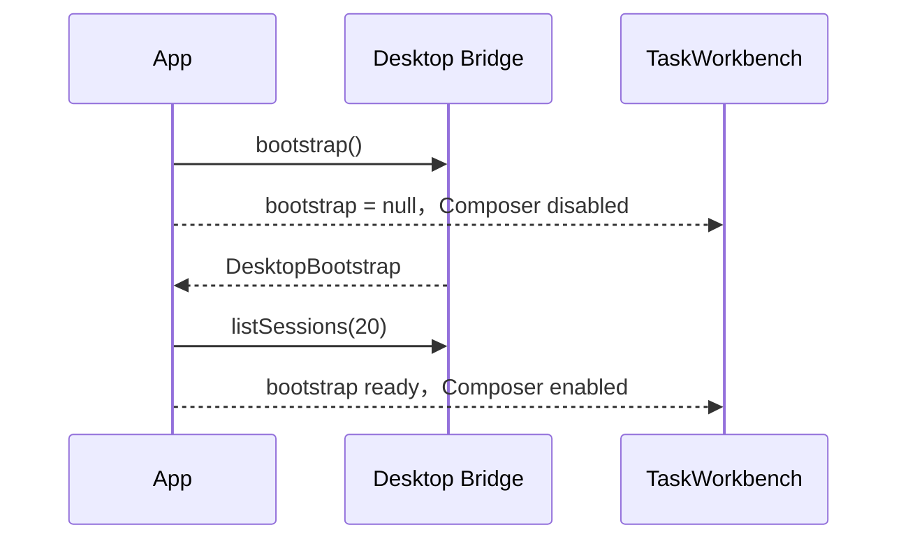
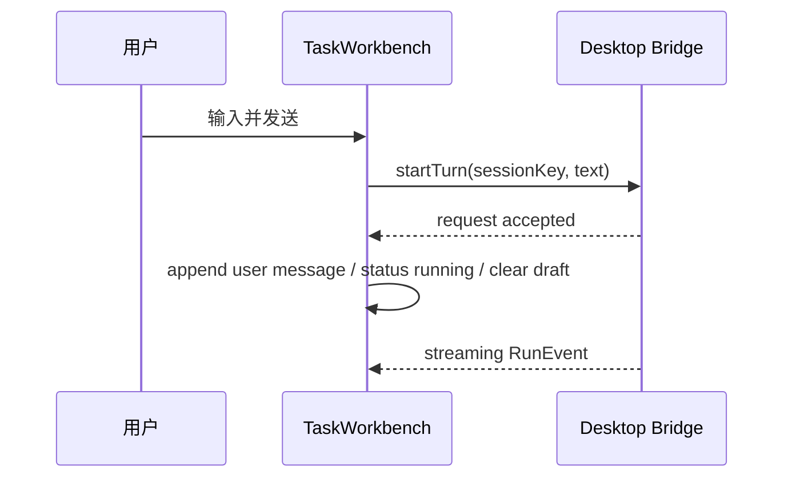

# MiniClaw Desktop D1 打开即聊设计

> 日期：2026-08-10
> 文档类型：Phase D1 产品与界面设计
> 状态：`DRAFT FOR REVIEW / IMPLEMENTATION PENDING`
> 上位需求：[桌面多 Agent 工作台开发需求](../../product/20260810_桌面多Agent工作台开发需求.md)
> 总体架构：[LobsterAI-first 桌面多 Agent 设计](../../architecture/20260810_LobsterAI-first桌面多Agent设计.md)

## 1. D1 目标

D1 只解决一个完整问题：用户打开 MiniClaw Desktop 后，不经过首页和“新建任务”跳转，就能在首屏大对话框中
提交真实任务，并继续使用现有 Tool、Approval、Cancel、History 和 Python Core。

D1 完成后的用户体验：

1. 启动应用即进入“对话”视图；
2. Core ready 后大 Composer 立即可输入；
3. 发送第一条消息后，同一页面自然变为任务时间线，Composer 固定到底部；
4. 左栏可以新建任务、打开最近任务、进入自动化和设置；
5. 历史任务可以继续追问；
6. 运行中可以停止，等待审批时可以处理审批；
7. 首屏不再出现挡住输入框的统计首页。

D1 不实现附件 admission、模型切换、Workspace 快捷切换、Agent 切换、Artifact 预览或 Sub-agent。这些控件必须
等 D2～D4 的真实 Core capability 完成后再开放。D1 只展示当前模型、Workspace、权限模式和 Main Agent 的真实
只读状态。

## 2. 当前问题

当前 `App` 默认 `view="home"`，首屏只有“新建任务”按钮；真正的 Composer 位于 `TaskWorkbench`，需要额外点击才
出现。任务页又包含一层任务列表，和应用级左侧导航形成双侧栏。结果是核心动作被隐藏，信息层级也比需要的复杂。

根因不是缺一个按钮，而是：

- `home` 被当成产品入口；
- 最近任务分别存在 Home 卡片和 Task 内侧栏；
- 空任务和已有任务没有共用同一套首屏布局；
- 全局状态文案占据视觉中心，Composer 只是任务页底部控件。

## 3. 方案比较

### 方案 A：只把默认 View 改成 Task

改动最小，但会保留应用侧栏、任务侧栏和结果侧栏三层结构；空态 Composer 仍在窗口底部，不像 Cowork 首屏。
它能修复“看不到输入框”，但不能形成用户确认的 LobsterAI-first 工作台。

### 方案 B：合并左栏，保留现有真实执行链（采用）

- 删除独立 Home 入口；
- 应用左栏同时承担新建任务、最近线程和二级导航；
- `TaskWorkbench` 只保留对话中心与现有结果栏；
- 空任务时同一 Composer 放大居中；
- 发送或打开历史后 Composer 自动回到底部。

这个方案改变信息架构，但不改变 Bridge、数据库或 Agent 运行逻辑，能用最少后端风险达到目标。

### 方案 C：直接移植 LobsterAI Cowork Renderer

视觉接近上游，但会带入 LobsterAI 的状态、组件和业务假设，重复 MiniClaw 已有任务、审批和 Bridge 逻辑。D1 不采用。

## 4. 页面结构

### 4.1 宽窗口

```text
┌──────────────────────┬────────────────────────────────────────┬──────────────────┐
│ MiniClaw             │ 新任务                                  │ 当前结果          │
│                      │                                        │                  │
│ ＋ 新建任务           │  今天想完成什么？                        │ 暂无结果时安静空态 │
│                      │  ┌──────────────────────────────────┐  │                  │
│ 对话                 │  │ 描述目标、背景和期望产物…          │  │                  │
│ 自动化               │  │                                  │  │                  │
│ 设置                 │  │ Main Agent · model · workspace   │  │                  │
│                      │  └──────────────────────────────────┘  │                  │
│ 最近任务             │                                        │                  │
│ · 市场调研            │                                        │                  │
│ · 周报整理            │                                        │                  │
│                      │                                        │                  │
│ ● Core ready         │                                        │                  │
└──────────────────────┴────────────────────────────────────────┴──────────────────┘
```

发送后，中栏变为消息/Tool/Approval 时间线，Composer 移到时间线底部。右栏继续使用当前真实最终回复和 telemetry；
D3 再把它替换为 Shared Outputs。

### 4.2 窄窗口

- 小于 980px 时收起右栏；
- 小于 760px 时左栏收为图标栏；
- 输入区仍保留至少 320px 有效宽度；
- 不引入抽屉或额外移动端路由。

Desktop D1 面向桌面窗口，不承诺手机浏览器布局。

## 5. 视觉方向

主题是“本地工作台”，不是聊天网站。整体浅色、安静，唯一明显强调放在 Composer。

### 5.1 色彩

| 名称 | Hex | 用途 |
| --- | --- | --- |
| Porcelain | `#F4F6F3` | 应用背景 |
| Paper | `#FFFFFF` | 主面板和 Composer |
| Ink | `#18221D` | 主要文字和品牌标记 |
| Moss | `#2F6B4F` | 发送、选中、焦点和 ready 状态 |
| Mist | `#E3E9E5` | 边框、hover 和分隔 |
| Amber | `#A85E24` | 审批与警告 |

不使用大面积渐变、玻璃拟态或深色侧栏。错误继续使用可区分的红色，不用颜色单独传达状态。

### 5.2 字体

- 标题：`Avenir Next` → `PingFang SC` → system sans，较紧字距；
- 正文：系统 UI sans，保证中文输入和跨平台可用；
- 模型、Workspace、状态：`SFMono-Regular` → `Consolas` → monospace。

不下载 Web Font，不增加网络和打包依赖。

### 5.3 标志性元素

大 Composer 是唯一视觉主角：像一块放在工作台中央的“任务托盘”，用 1px Moss 内边、轻阴影和底部状态轨道承载
Main Agent、模型、Workspace、权限与发送动作。发送后它缩为时间线底部的紧凑形态，用户始终能确认自己仍在同一任务。

其他元素保持平直、低对比，不和 Composer 争抢注意力。

## 6. 组件与职责

### 6.1 `App`

`App` 继续拥有：

- 当前 View；
- bootstrap、Session list、Automation 和 Settings 状态；
- 当前 `sessionKey` 和已加载 History；
- `taskBusy`，用于阻止运行中切换任务或设置。

调整：

- 初始 View 从 `home` 改为 `task`；
- Session list 在 Core bootstrap 成功后加载，不依赖 Home View；
- 删除 Home `ViewPreview` 分支；
- 左栏直接渲染“新建任务”和最近任务；
- 选中任务和 busy 状态由真实 `sessionKey`/`TaskWorkbench` 驱动。

### 6.2 `TaskWorkbench`

`TaskWorkbench` 继续拥有任务 reducer、草稿、提交、取消和审批状态。

调整：

- 删除内部 `task-list-panel` 及 Session list props；
- 根布局只保留 `conversation-panel` 和 `result-panel`；
- 用 `task.run.timeline.length === 0` 区分空任务；
- 空任务显示简短邀请文案和放大 Composer；
- 已有消息显示时间线和底部 Composer；
- Composer 底部显示真实 `Main Agent`、model、workspace basename 和 permission mode；
- Enter 发送，Shift+Enter 换行；输入法 composition 期间不误发送；
- Core 未连接、提交中、运行中或等待审批时保持现有禁用/停止逻辑。

### 6.3 `navigation.ts`

`ViewId` 变为：

```ts
export type ViewId = "task" | "automation" | "settings";
```

可见标签为“对话 / 自动化 / 设置”。“新建任务”是独立主操作，不再是导航 View。

### 6.4 CSS

继续使用一个 `styles.css`，避免为 D1 引入 CSS-in-JS 或组件库。删除 Home 和内部任务列表的无用规则；为合并左栏、
空态/线程态 Composer 和响应式布局增加明确 class。保留 `prefers-reduced-motion`、`:focus-visible` 和原生表单语义。

## 7. 状态与数据流

### 7.1 首次启动



bootstrap 失败时，Composer 保持可见但禁用，并在输入区上方显示“无法连接 MiniClaw Core，请检查本地启动配置”。

### 7.2 首条消息



只有 Bridge 接受后才清空草稿。失败时保留原文并显示稳定错误。

### 7.3 新建和切换任务

- 点击“新建任务”生成新 `sessionKey`、清空 History 并保持 Task View；
- 当前任务 busy 时禁用新建和 Session 切换；
- 打开 Session 前调用 `loadSession`，失败则保留当前任务；
- 历史任务 hydrate 后若不是运行终态，继续沿用现有 interrupted 投影；
- D1 不自动生成标题，也不改变 Session 存储格式。

## 8. 键盘和无障碍

- `textarea` 保持可见 `aria-label="任务内容"`；
- Enter 在非 composition 且没有 Shift 时发送；
- Shift+Enter 插入换行；
- 发送按钮文案为“发送”，运行中按钮为“停止”；
- 新建任务、对话、自动化、设置和最近任务均为原生 `button`；
- 当前 View 使用 `data-active`，当前 Session 使用 `aria-current="page"`；
- Core 错误和提交错误使用 `role="alert"`；
- 时间线保持 `aria-live="polite"`；
- 所有 focus ring 清晰可见，点击目标不小于 32px；
- `prefers-reduced-motion` 下不增加 Composer 位移动画。

## 9. 错误和边界

| 情况 | D1 行为 |
| --- | --- |
| Core booting | Composer 可见、禁用，placeholder 显示连接中 |
| Core bootstrap failed | Composer 可见、禁用，显示明确错误 |
| Session list failed | 左栏显示局部错误，不影响新任务 |
| Session history failed | 保持当前任务并显示左栏局部错误 |
| `startTurn` failed | 保留草稿，显示错误 |
| running / pending approval | 禁止切换 View/任务；提供停止或审批 |
| cancel failed | 保持当前状态，显示错误，可重试 |
| 空 Session list | 显示“还没有历史任务”，不显示统计卡 |
| 很长 Workspace | 状态轨道只显示 basename，完整路径留在 Settings |

## 10. 测试设计

D1 不新增测试库。使用已安装的 React/ReactDOM/Vitest：

- `renderToStaticMarkup(<App />)` 证明初始 HTML 直接包含真实任务 Composer，不含旧 Home 入口；
- navigation 单测证明只剩三个 View；
- Task state tests 继续覆盖流式、Approval、Cancel 和 History；
- 对 Enter/composition 的处理提取为一个小的纯函数，测试“发送 / 换行 / 输入法”三个分支；
- Desktop 全量 test、typecheck 和 build 防止 Electron 打包回归；
- 真实 Python Bridge + Electron 进程 smoke 证明仍走 MiniClaw Core；
- 手工视觉 smoke 检查首屏、发送后布局、窄窗口、中文输入法、焦点和审批。

测试必须先出现预期失败，再写最小实现。D1 不通过新增依赖模拟浏览器 DOM。

## 11. 文件范围

预计修改：

- `desktop/src/renderer/app.tsx`；
- `desktop/src/renderer/task-workbench.tsx`；
- `desktop/src/renderer/navigation.ts`；
- `desktop/src/renderer/styles.css`；
- `desktop/test/navigation.test.ts`；
- 新增 `desktop/test/app.test.tsx`；
- 新增 Composer keyboard 纯函数测试，文件名在实施计划中根据最终边界冻结；
- `desktop/tsconfig.json` 仅在需要纳入 `.tsx` test 时修改；
- D1 完成后同步 README、总产品/架构/落地文档和工程索引状态。

D1 不修改 Python Core、Bridge protocol、SQLite migration、Preload、IPC、ArtifactStore 或 Provider。

## 12. D1 完成标准

1. 启动后默认 HTML 和真实 Electron 窗口都直接显示 Composer；
2. 无需点击“新建任务”即可提交真实 `task.start`；
3. 首条消息发送后，时间线、停止/审批和 Composer 同屏；
4. 左栏新建、最近线程、对话、自动化和设置真实可用；
5. 历史任务可以打开并继续追问；
6. Enter/Shift+Enter/中文输入法行为正确；
7. 宽窗口为左栏 + 对话 + 结果，窄窗口隐藏结果并收起左栏；
8. 当前模型、Workspace、Main Agent 和 Permission Mode 只显示真实只读值；
9. D2～D4 控件和演示数据不提前出现；
10. Desktop tests、typecheck、build、Python Bridge/Electron smoke、文档校验和 `git diff --check` 通过。

## 13. 明确非目标

- 附件按钮或拖放；
- 可切换模型、Workspace 或 Agent 的下拉框；
- Artifact 列表或文件预览；
- 子 Agent、参与者或任务拓扑；
- 新 Bridge 请求、数据库迁移或前端状态库；
- 深色主题、动画系统、组件库和 Web Font；
- installer、签名和自动更新。
