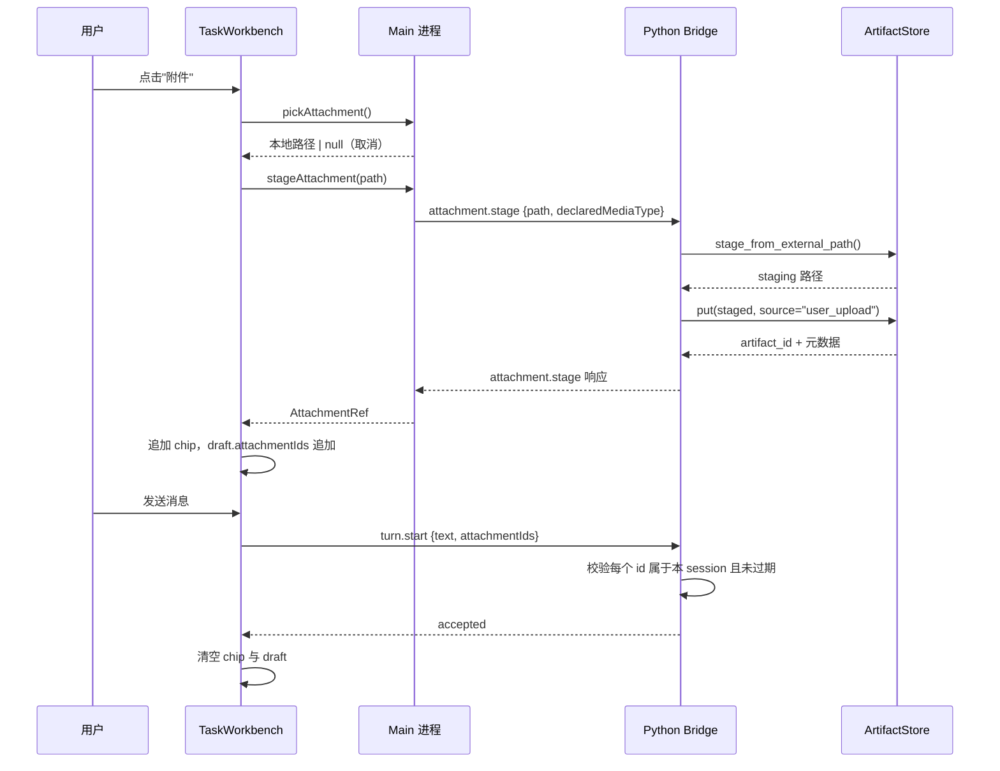

# Lobster0 Desktop D2 附件/模型/Workspace/Agent 控件设计

> 日期：2026-08-10
> 文档类型：Phase D2 产品、界面与协议设计
> 状态：`SUPERSEDED`（2026-08-11）——见 [D2c 附件与 Composer 控件（修订版）](2026-08-11-desktop-d2c-attachments-design.md)
>
> 其中 `models.list`/`agents.list` 两项已被推翻，另有两条现状描述与代码不符，理由见修订版 §1。
> 上位需求：[桌面多 Agent 工作台开发需求](../../product/20260810_桌面多Agent工作台开发需求.md)
> 总体架构：[LobsterAI-first 桌面多 Agent 设计](../../architecture/20260810_LobsterAI-first桌面多Agent设计.md)
> 大纲来源：[D1～D5 分 Phase 落地文档 §5](../../engineering/desktop/20260810_桌面多Agent分Phase落地.md)
> 前置实现：[D1 打开即聊设计](2026-08-10-desktop-d1-conversation-shell-design.md)（已 `IMPLEMENTED`）

## 1. D2 目标

D1 交付了"打开即聊"的对话工作台，但 Composer 只展示只读文案（`Main Agent · 模型 · workspace 目录名 ·
权限模式`），用户既不能带文件问问题，也不能确认自己正在用哪个模型/Agent、更不能在不离开对话的情况下
切换 Workspace。D2 把这一整条状态栏换成四个真实控件：

1. **附件**：从系统 Dialog 选文件、看到校验/上传状态、发送前可移除；
2. **模型**：展示 Core 当前真实可用模型（今天就是一项，不是假下拉）；
3. **Workspace**：展示当前目录 basename，点击可用系统 Dialog 切换，不必先跳转到"设置"；
4. **Agent**：展示 Core 返回的真实 Agent 列表（今天也是一项：Main Agent，但这个"一项"来自 Bridge
   而不是 Desktop 里写死的字符串）。

D2 完成后：

- 用户可以选一个本地文件（文本/图片/PDF 等已支持类型）随下一条消息一起发送；
- 附件真正经过 Core 的 `ArtifactStore` 校验（哈希、大小、magic byte、symlink 拒绝），不是简单地把
  路径字符串塞进 prompt；
- 模型/Agent 选择器显示的是 Bridge 返回的真实数据，不是 Desktop 端硬编码；
- Composer 内点击 Workspace 直接复用 D1 之前就已经在"设置"页可用的完整切换链路（Dialog → 校验 →
  重启 Bridge → 回滚），只是新增一个入口，不新建一条切换逻辑。

D2 明确不做：多模型路由平台、模型/Agent 的增删改配置界面、图片 Vision（除非 Provider 能力已配置）、
真正的多 Agent 并发执行（那是 D4 depth-1 子 Agent 的范围）、Artifact 关联查询/预览（D3 范围）。

## 2. 现状盘点（决定设计边界的关键事实）

在编码前先确认了后端现状，这决定了 D2 哪些是"接线"、哪些是"新建"：

| 能力 | 现状 | 结论 |
| --- | --- | --- |
| Bridge 协议 | `src/lobster0/bridge/protocol.py` 用 `_REQUEST_TYPES` 白名单 + 逐字段 `_validate_payload`；`hello` 的 `capabilities` 是 `server.py:97-106` 里的硬编码字符串数组 | 新增请求类型必须先进白名单，再加校验分支，再加 dispatch 分支——三处都要改，模式已有先例（如 `automation.list`） |
| 模型配置 | `AgentConfig`/`ProviderConfig`（`config.py:201-218`）都是单个扁平配置，`ModelProvider` 协议（`providers/base.py`）只有 `complete()`/`aclose()`，**没有 `list_models`** | `models.list` 是全新协议请求，Python 侧只能包一层：把 `runtime.model` 包成一项列表返回，不是真的多模型枚举 |
| Agent 配置 | `AgentRuntime`（`runtime.py:107-133`）就是一个 provider+tool 集合的运行时，**没有 agent_id、没有 Agent 注册表**，"Main Agent" 目前只是 `task-workbench.tsx:165` 里的字面量字符串 | `agents.list` 同样是全新协议请求；Python 侧返回一个硬编码单项（如 `{"id": "main", "label": "Main Agent"}`），但这一项从 Bridge 来，Desktop 不再自己写死文案，满足"真实只读状态"的 D1/D2 一贯要求 |
| Workspace 切换 | **已经是完整可用的真实链路**：`chooseWorkspace()` → `dialog.showOpenDialog`（`main/index.ts:73-76`）→ `bridge-service.ts:207-227 restartWorkspace()`（绝对路径/长度/NUL 校验 + idle 才允许 + 失败回滚）→ Python `config.py:_absolute_path` 独立再校验 | D2 不新建切换逻辑，只是在 Composer 状态栏新增一个可点击入口，复用 `window.lobster0.chooseWorkspace()` |
| 附件/Artifact | `ArtifactStore`（`src/lobster0/artifacts/store.py:67`）已有完整的 content-addressed 存储 + 深度校验（`O_NOFOLLOW`、owner-only mode、TOCTOU re-fstat、magic byte 嗅探、PNG 尺寸上限、原子写入），但 `source` 是封闭枚举 `{"browser_screenshot", "browser_download"}`（第 25 行），**没有 `list()` 查询**，也**没有任何 Bridge 请求类型连到它** | 这是 D2 唯一真正的新工程：加 `"user_upload"` 到 `_SOURCES`、新增一个安全的"外部路径 → staging → put()"拷贝步骤、新增 Bridge 请求类型 |
| 附件与消息的关联存储 | `messages` 表已有通用 `metadata_json` 列（`storage/conversations.py`，多处用于如 `experience_trace`） | 附件引用存进用户消息的 `metadata_json`，**不需要新迁移**，符合落地文档"仅现有 schema 无法表达时才迁移"的原则 |

## 3. 方案比较

### 方案 A：附件直接把本地路径塞进 Prompt 文本

最简单，但完全绕过 `ArtifactStore` 的安全校验，等于允许 Renderer 让 Core 读取任意本地路径。不采用。

### 方案 B：新增 Bridge 请求类型，Core 侧真实 admission（采用）

Renderer 用 Main 进程原生 Dialog 选文件 → 薄层路径校验（复用 `restartWorkspace` 同款绝对路径/长度/NUL
检查）→ 新 Bridge 请求 `attachment.stage` → Python 把文件安全拷进 `ArtifactStore` 的 staging 目录 →
`ArtifactStore.put(..., source="user_upload")` 做完整校验 → 返回 `artifact_id`。`turn.start` payload
新增可选 `attachmentIds: string[]`，Python 侧校验每个 id 都真实存在于 `ArtifactStore` 且属于当前
session（新增一张极小的 session↔artifact 关联，或直接把 artifact 元数据写进消息 `metadata_json`，见
§6.4）。这是唯一让"发送前校验状态""安全边界"两条 D1/D2 一贯要求同时成立的方案。

### 方案 C：模型/Agent 做成完整可配置的多项列表

会提前建一个目前后端完全不存在的"多模型路由""多 Agent 注册表"概念，违反落地文档"不为未来多模型建设
路由平台"的明确约束，而且没有真实数据支撑（今天就是一个模型一个 Agent）。不采用；等 Core 真的支持
多模型/多 Agent 时再扩展协议返回值，Desktop 的下拉组件本身已经是"渲染任意长度列表"，不需要为此重写。

## 4. Bridge 协议变更

### 4.1 新增请求类型

在 `src/lobster0/bridge/protocol.py` 的 `_REQUEST_TYPES`（第 13-27 行）追加三个只读/一个动作类型：

| 类型 | payload | 说明 |
| --- | --- | --- |
| `models.list` | `{}` | 只读，无参数，比照 `automation.list` 的校验分支写法 |
| `agents.list` | `{}` | 只读，无参数 |
| `attachment.stage` | `{"path": str, "declaredMediaType": str}` | 动作：把 Main 进程 Dialog 选中的绝对路径拷进 ArtifactStore |
| `turn.start`（改造，非新增） | 追加可选字段 `attachmentIds: list[str]` | 沿用现有校验框架，新增"每个 id 必须在本 session 已 stage 过"的检查 |

`client.hello` 的 `capabilities`（`server.py:97-106`）追加 `"models_read"`、`"agents_read"`、
`"attachments"` 三项，供 Desktop 做能力探测（复用 D1 已有的 capability 数组读取方式，不新增探测机制）。

### 4.2 Server 端处理

`BridgeServer._handle`（`server.py:78-224`）新增三个分支：

- `models.list` → 返回 `{"models": [{"id": runtime.model, "label": runtime.model}]}`（单项，直接包装
  `AgentRuntime.model`，不查询 Provider——因为 Provider 层根本没有 `list_models`）；
- `agents.list` → 返回 `{"agents": [{"id": "main", "label": "Main Agent"}]}`（硬编码单项，但**由 Python
  返回**，Desktop 端渲染这一项、并在 `turn.start` 时校验用户选的 agent id 必须等于列表里返回的某一
  项——即使今天只有一项，也拒绝伪造 id，满足落地文档"伪造 Agent id"这条安全门禁）；
- `attachment.stage` → 见 §4.3；
- `turn.start` 的现有分支（`server.py:111-141`）追加：payload 若带 `attachmentIds`，逐个核对是否在
  "本 session 已 stage 且未使用"的集合里（内存态即可，不需要持久化一张新表，session 结束/切换即清空，
  见 §6.4），任何一个 id 不在集合里就用新错误码 `attachment_unknown` 拒绝整个 `turn.start`（不部分发送）。

### 4.3 附件 admission 的安全实现

新增 `ArtifactStore.stage_from_external_path(source: Path, *, max_bytes: int) -> Path` 方法（新代码放
在 `artifacts/store.py`，不要把校验逻辑复制到 `bridge/server.py`——遵守协议文档 §10"Bridge 只调用既有
Core 服务，不在协议层写业务逻辑"的规则）：

1. 用 `os.open(source, os.O_RDONLY | os.O_NOFOLLOW)` 打开，拒绝 symlink（同 `_read_staging` 现有模式，
   第 240 行）；
2. `fstat` 校验 `S_ISREG`，大小 ≤ `max_bytes`（新增可配置上限，例如 20MB，具体数值在 TDD 阶段和用户
   确认）；
3. 把内容写入 `self._staging_root` 下一个新的 0600 临时文件（复用 `_write_private_atomic` 同款原子写
   模式）；
4. 返回这个 staging 内的路径，供调用方接着传给现有 `put(staged_path, declared_media_type=..., source=
   "user_upload")`。

`_SOURCES`（`store.py:25`）追加 `"user_upload"`。`declared_media_type` 由 Desktop 侧从文件扩展名映射
（复用 Main 进程 Dialog 的 `filters`），Python 侧仍按现有 `_inspect_content` magic byte 嗅探二次校验，
不信任 Desktop 声明的类型（`store.py:128-132` 现有的 declared-vs-actual 不一致检测逻辑天然覆盖）。

`_MEDIA_EXTENSIONS`（`store.py:16-24`）**本次不扩展**——D2 范围是"通用文件引用"，允许类型维持现有
png/jpeg/pdf/zip/json/text/csv 白名单；用户选了不支持的类型时，`attachment.stage` 直接返回明确错误
（`attachment_media_unsupported`），Desktop 侧提示"暂不支持该文件类型"，不做静默降级。

## 5. Desktop 端设计

### 5.1 Composer 状态栏改造

D1 的状态栏是一行只读文本（`task-workbench.tsx:165`）。D2 把它拆成四个可交互的小控件（沿用 D1
"任务托盘"视觉：Moss 强调边、浅瓷白底），从左到右：`📎 附件` · `模型选择` · `Workspace basename` ·
`Agent 选择`。三个选择器（模型/Workspace/Agent）在只有一项时渲染为"当前值 + 可点击"（Workspace）或
"当前值只读徽标"（模型/Agent，因为今天真的只有一个选项，做成下拉反而是假交互）；一旦 Bridge 返回
多项（未来），组件本身已按数组渲染，不需要重写。

附件区域：点击"📎 附件"触发 `window.lobster0.pickAttachment()`（新 IPC）→ Main 进程
`dialog.showOpenDialog({ properties: ["openFile"] })` → 拿到路径后 Renderer 调
`window.lobster0.stageAttachment(path)` → Bridge `attachment.stage` → 成功后 Composer 里出现一个
附件 chip（文件名 + 大小 + 移除按钮），draft 状态里累积 `attachmentIds: string[]`；发送时随
`startTurn` 一起提交，成功后清空。上传/校验中禁用该 chip 的移除按钮，失败态用现有 `composer-error`
`role="alert"` 展示具体原因（不支持的类型/过大/文件已变化等，直接透传 Bridge 错误码对应的中文提示）。

### 5.2 IPC / common/api.ts 新增

```ts
export interface ModelSummary { id: string; label: string; }
export interface AgentSummary { id: string; label: string; }
export interface AttachmentRef { artifactId: string; filename: string; mediaType: string; sizeBytes: number; }

// DesktopApi 新增：
listModels(): Promise<ModelSummary[]>;
listAgents(): Promise<AgentSummary[]>;
pickAttachment(): Promise<string | null>;          // Main 进程 Dialog，可能取消
stageAttachment(path: string): Promise<AttachmentRef>; // 经 Bridge attachment.stage

// StartTurnInput 新增可选字段：
attachmentIds?: string[];
agentId?: string;
```

`DESKTOP_CHANNELS` 新增 `modelsList`/`agentsList`/`attachmentPick`/`attachmentStage`，Main 进程
`ipc.ts` 新增对应 handler，`attachmentPick` 直接调 `dialog.showOpenDialog`（同 `chooseWorkspace` 模式，
不经过 Bridge，因为选文件本身不需要 Core 参与）；`attachmentStage`/`modelsList`/`agentsList` 转发给
`bridge-service.ts` 已有的请求-响应通道（复用 D1 就有的 `sendRequest` 基础设施，不新建一套）。

### 5.3 与现有 Workspace 切换的关系

Composer 里的 Workspace 控件点击后直接调用 D1 之前就已存在、已在真实 Electron+Bridge smoke 里验证过
的 `window.lobster0.chooseWorkspace()`，行为（包括"运行中禁止切换""失败回滚"）完全不变，只是多了一个
入口。不新增测试覆盖这条已有路径的核心逻辑，只新增"从 Composer 触发"这一条集成路径的测试。

## 6. 状态与数据流

### 6.1 附件选择与发送



### 6.2 模型/Agent 只读展示

D1 `bootstrap()` 已经在应用启动时拉一次快照；D2 新增独立的 `listModels()`/`listAgents()` 调用（不塞进
`bootstrap()`，因为它们是可独立失败、可独立重试的只读查询，遵循 D1 §9 错误处理表的既有模式：局部失败
不影响其余控件）。

### 6.3 会话切换与附件生命周期

`attachmentIds` 是**当前 session 内、未发送草稿**的临时状态，随 `createTask()`/`openSession()`
（`app.tsx:105-127`）清空——与 D1 现有的 `setHistory(null)` 同一批状态重置，不新增单独的清理路径。已经
随某条历史消息发送成功的附件引用，只作为该消息 `metadata_json` 里的只读元数据展示（文件名+类型+大小），
D2 不做"重新打开历史附件"功能（那是 D3 Artifact 预览的范围）。

### 6.4 附件与 session 的关联存储（不新增迁移）

Python Bridge 内存态维护一个 `session_key -> set[artifact_id]`（"本 session 已 stage、尚未使用"的
集合），仅用于 `turn.start` 时校验 id 合法性，进程重启即丢失（可接受：staging 本身也不是持久语义）。
真正写入 SQLite 的，是 `turn.start` 成功后，把每个附件的 `{artifact_id, filename, media_type,
size_bytes}` 写进对应用户消息的 `metadata_json`（`storage/conversations.py` 已有此列，用法参考现有
`experience_trace` 那条路径），历史消息读出时 Desktop 据此渲染只读附件徽标。**不新建表、不做
schema 迁移**。

## 7. 错误与边界

| 情况 | D2 行为 |
| --- | --- |
| 用户取消文件选择 Dialog | `pickAttachment()` 返回 `null`，Composer 无变化 |
| 文件类型不在 `_MEDIA_EXTENSIONS` 白名单 | `attachment.stage` 返回 `attachment_media_unsupported`，Composer 提示"暂不支持该文件类型" |
| 文件超过大小上限 | 返回 `attachment_too_large`，提示具体上限 |
| 文件是 symlink / 权限异常 | 返回 `attachment_source_invalid`（复用 `ArtifactStore` 现有的拒绝语义），不暴露底层路径细节给 UI |
| stage 成功但发送前用户移除 chip | 仅清 Renderer 状态；Bridge 侧该 artifact 保留在"已 stage 未使用"集合，直到 session 结束/超时被 `delete_expired()` 现有机制回收，不额外处理 |
| `turn.start` 携带未知/过期 `attachmentIds` | 整体拒绝（`attachment_unknown`），不部分发送，Composer 保留草稿并提示重新添加附件 |
| `models.list`/`agents.list` 失败 | 对应控件显示"读取失败"局部错误，不阻塞其余控件和发送（沿用 D1 §9 局部失败模式） |
| 运行中/等待审批时点开附件或 Workspace | 沿用 D1 现有 `taskBusy`/`liveBusy` 禁用逻辑，不新增状态机 |

## 8. 测试设计

Python 侧（新增，落在 `tests/test_bridge_protocol.py`、`tests/test_bridge_server.py`、新文件
`tests/test_artifacts_store.py` 附件相关用例）：

- protocol 层：`models.list`/`agents.list`/`attachment.stage` 的 exact-key、越界字段拒绝；
- `ArtifactStore.stage_from_external_path`：symlink 拒绝、超限拒绝、非 owner-only 源、TOCTOU（stage
  过程中源文件被替换）、正常路径的哈希/media type 落地；
- `attachment.stage` → `put(source="user_upload")` 全链路 fake reader/writer 集成用例，比照现有
  `client.hello → turn.start → approval.resolve` 序列写法；
- `turn.start` 校验未知/过期 `attachmentIds` 被拒绝，且不产生任何副作用（不建 turn、不追加消息）。

Desktop 侧（新增，遵循 D1 已用的 Vitest + `renderToStaticMarkup` 模式，不引入新测试依赖）：

- `common/api.ts` 类型与 `DESKTOP_CHANNELS` 新增项的静态测试（比照现有 IPC 测试模式）；
- Composer 附件 chip 的添加/移除/禁用状态纯函数测试；
- `app.test.tsx` 断言首屏 Composer 状态栏包含四个控件的可访问入口，且模型/Agent 展示的是通过 mock
  `window.lobster0.listModels()`/`listAgents()` 返回的数据而非任何硬编码字符串；
- 真实 Python Bridge + Electron smoke（复用并扩展 `scripts/smoke-electron.mjs`）新增一步：真实 stage
  一个小文本文件、断言返回 `artifactId`、断言 `turn.start` 携带该 id 被接受。

测试必须先出现预期失败，再写最小实现（沿用 D1 的 TDD 顺序要求）。

## 9. 文件范围

Python：

- `src/lobster0/bridge/protocol.py`（新请求类型 + 校验）；
- `src/lobster0/bridge/server.py`（新 dispatch 分支）；
- `src/lobster0/artifacts/store.py`（`stage_from_external_path`、`_SOURCES` 追加 `user_upload`）；
- `tests/test_bridge_protocol.py`、`tests/test_bridge_server.py`、`tests/test_artifacts_store.py`。

Desktop：

- `desktop/src/common/api.ts`（新类型、新 channel）；
- `desktop/src/main/ipc.ts`、`desktop/src/main/index.ts`（`attachmentPick` Dialog）；
- `desktop/src/main/bridge-service.ts`（新请求透传）；
- `desktop/src/renderer/task-workbench.tsx`（Composer 状态栏拆成四控件、附件 chip）；
- `desktop/src/renderer/styles.css`（新控件样式，延续 D1 LobsterAI classic-light 视觉）；
- `desktop/test/` 下对应新测试文件、`scripts/smoke-electron.mjs` 扩展。

D2 不修改 SQLite schema（复用现有 `metadata_json`）、不修改 Preload 的整体安全模型（沿用
`contextIsolation`/`sandbox` 现状，只新增几个走既有 `invoke` 桥的 channel）。

## 10. D2 完成标准

1. 文本 + 至少一种通用文件附件（如 `.txt`/`.png`）走完整 Core admission 并随消息发送成功；
2. 四类控件都展示真实 Bridge 数据，没有静态假选项（尤其模型/Agent 不再是 Desktop 端字面量）；
3. 单模型/单 Agent 配置下四个控件仍然可用，不因为"只有一项"而报错或空白；
4. 附件类型不支持/过大/来源异常时有明确、可操作的错误提示，不静默失败；
5. Workspace 控件从 Composer 直接可用，行为与既有"设置"页入口完全一致；
6. Python、Desktop 全量测试、typecheck、build 通过；
7. 真实 Python Bridge + Electron smoke 覆盖"选文件 → stage → 发送"全链路；
8. 文档同步：本设计文档状态更新为 `IMPLEMENTED`，[分 Phase 落地文档 §5](../../engineering/desktop/20260810_桌面多Agent分Phase落地.md) 的 D2 状态从 `PENDING` 更新。

## 11. 明确非目标

- 多模型路由、模型/Agent 的增删改配置界面；
- 图片 Vision（除非 Provider 能力已配置并明确启用，超出 D2 判断范围）；
- Artifact 的关联查询列表、预览、"在 Finder 中显示"（D3 范围）；
- 真正的多 Agent 并发执行、depth-1 子 Agent（D4 范围）；
- 附件的持久化关联表/迁移（用现有 `metadata_json` 表达）；
- 扩大 `ArtifactStore` 允许的媒体类型白名单（维持现状，不支持的类型明确拒绝而不是尝试兼容）。
