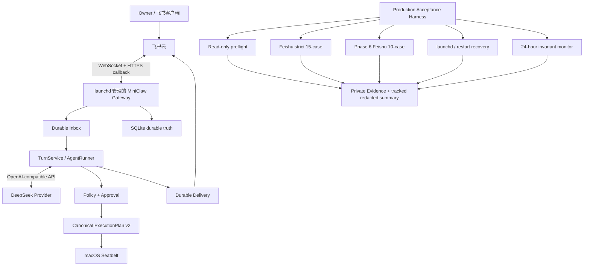
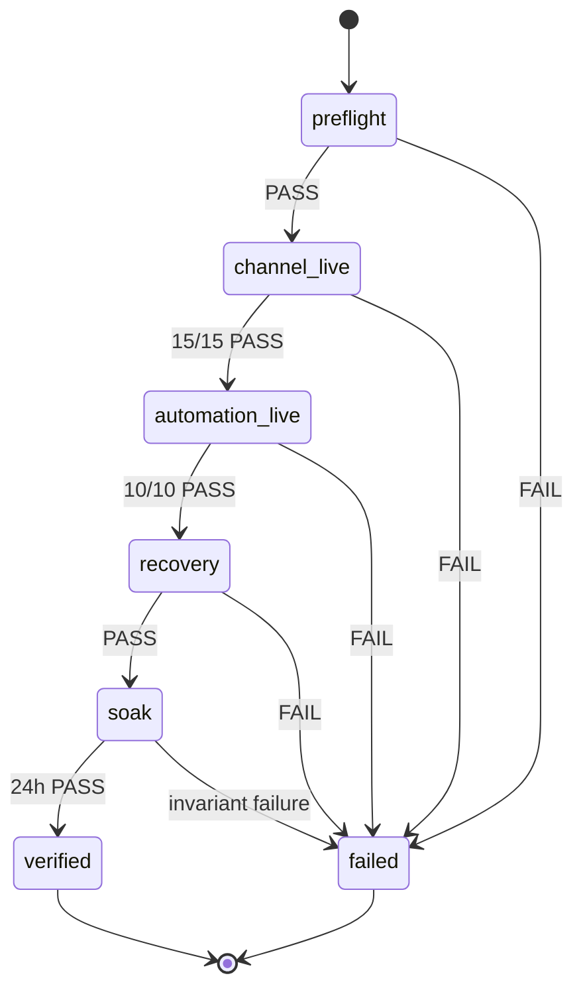

# MiniClaw Phase 6：macOS + 飞书生产验收设计

> 状态：**DESIGN APPROVED / IMPLEMENTATION PLANS COMPLETE**
>
> 日期：2026-08-10
>
> 设计基线：`main@df38118`
>
> 目标发布状态：`PHASE 6 MACOS+FEISHU PRODUCTION VERIFIED`
>
> 当前实现状态：`IMPLEMENTATION PASS / PRODUCTION PENDING`
>
> 用户确认范围：当前这台 Mac 常驻运行；生产 IM 只验收飞书；Telegram、Discord、Docker/VPS 不作为本 Gate
> 的阻塞项，也不得因此被写成 Live PASS。

## 1. 一句话目标

把已经通过离线门禁的 Phase 6，在真实 `launchd → Gateway → DeepSeek Provider → Agent/Policy → 飞书` 环境中完成
可重复、可恢复、可审计的生产验收；只有 Seatbelt containment、25 条飞书 Live case、服务恢复和连续 24 小时 soak
全部通过后，才把这一确切部署组合标记为生产已验证。

## 2. 为什么还需要这一轮

当前仓库已经证明 Phase 6 的实现契约成立：Task/Scheduler/Runner、预算、E-stop、Approval continuation、durable
Delivery、ExecutionPlan、Checkpoint 和 Rollback 都有确定性测试与 versioned eval。但是这些证据不能证明当前 Mac 上的
真实进程、真实 Provider、真实飞书 Bot 和真实系统隔离可以连续工作。

当前仍有四个明确缺口：

1. macOS Seatbelt live smoke 仍因 Homebrew Framework Python 二次 launcher 未绑定到 ExecutionPlan 而失败；
2. 飞书已有 targeted callback 证据，但严格 15 条 Channel Live case 尚未在同一 clean commit 上收口；
3. Phase 6 的 reminder、interval、重启恢复、Approval、E-stop 和主动 Delivery 尚无飞书生产证据；
4. 还没有绑定 commit 的 24 小时 service soak，因此不能声称长期运行稳定。

2026-08-10 的设计 spike 补充了一条真实边界：隔离 worktree 中由 uv 管理的 CPython 3.12.11 使用现有 Plan v1 和
Seatbelt profile 已得到 `engine=seatbelt containment=PASS`；此前失败来自 Homebrew Framework Python 3.13 的二次
`Python.app` launcher。因此生产 LaunchAgent 必须使用独立 managed Python 3.12 runtime，不能复用开发目录里碰巧存在的
Homebrew `.venv`。这条证据解决 Python probe 的 runtime 选择，但没有解决带 shebang 的 `lark-cli`/Node 等通用二次
executable chain，所以后者仍按 Workstream A 进入 Plan v2 和 Approval hash。

本轮不重新开发 Agent Core，也不新增另一套测试框架。它复用现有 live harness、SQLite durable truth、`launchd`、
versioned JSONL 和脱敏 Evidence，只补足真实部署证据和确有必要的安全修复。

## 3. 生产目标与精确结论

### 3.1 本轮唯一生产目标

```text
macOS 当前用户会话
  └── user LaunchAgent
      └── miniclaw gateway
          ├── DeepSeek OpenAI-compatible Provider
          ├── Feishu WebSocket + Card callback
          ├── SQLite / Markdown durable state
          └── Policy / Approval / Seatbelt
```

生产验收只对以下组合负责：

- 单 Owner；
- 当前 Mac 的用户级 `launchd`；
- 当前发布的 Python 包与 Node TUI/Bridge；
- 与开发 `.venv` 分离的 managed CPython 3.12 runtime；
- 一个已发布且 allowlist 正确的飞书 App/Bot；
- DeepSeek OpenAI-compatible Provider；
- `sandbox.backend="seatbelt"` 的 macOS command 路径；
- MiniClaw 自有 Workspace、State Home 和私有 Evidence 目录。

### 3.2 验收通过后允许写出的结论

```text
Phase 6 implementation: PASS
macOS + Feishu production gate: VERIFIED
Seatbelt containment on the verified Mac/runtime: PASS
Feishu strict channel live: 15/15 PASS
Feishu Phase 6 automation live: 10/10 PASS
24-hour launchd soak: PASS
```

### 3.3 验收通过后仍不能写出的结论

- 不能写 Telegram、Discord、Docker、VPS 或其他 Mac 已生产验证；
- 不能把一次成功对话写成 24×7 SLA；
- 不能把 fake SDK、local soak 或 argv 单测写成 Live Evidence；
- 不能声称 Host backend 是恶意代码安全边界；
- 不能声称 Browser Agent、Phase 7 Evolution 或自动源码部署已生产验证。

## 4. 方案选择

### 4.1 方案 A：Mac Native Gate（采用）

Gateway 由用户级 `launchd` 常驻；command path 使用 Seatbelt；飞书 Live harness 和 Phase 6 production harness 读取
同一 SQLite 真相并输出脱敏 Evidence。

采用原因：这是 Owner 的真实使用路径；无需为了验收引入第二套部署；`lark-cli`、本机 Workspace 与飞书 SDK 都保留
现有行为。

### 4.2 方案 B：Docker-only Gate（不采用）

优点是容器边界统一；缺点是当前 Mac 没有可用 rootless engine，而且本地 App、`lark-cli` 与 Personal Profile 的真实
使用路径会被替换。它可以成为独立 Linux/VPS 发布 Gate，但不能替代本轮 Mac 验收。

### 4.3 方案 C：Host Gateway + Docker Worker（不采用）

这种组合能进一步隔离命令，但会引入两套生命周期、socket/volume 边界和新的恢复状态。本轮没有证据证明它比修复原生
Seatbelt 更小或更可靠，个人单机项目暂不增加这层复杂度。

## 5. 总体架构



## 6. Workstream A：Seatbelt 与精确 executable chain

### 6.1 根因

现有 `ExecutionPlan` 只绑定 `argv[0]`。macOS 执行 Homebrew Framework Python、带 shebang 的 Node CLI 或其他 launcher
时，内核/launcher 可能再次 `exec` 一个真实解释器。Seatbelt 的 deny-default profile 只允许 `argv[0]`，因此合法命令在
第二次 `exec` 时失败。

直接允许整个 Framework、Homebrew 或 NVM 目录会扩大攻击面；在 profile 中临时拼接未进入 plan hash 的路径，也会破坏
Approval binding。两种做法都不接受。

### 6.2 ExecutionPlan v2

`ExecutionPlan` v2 增加一个不可变的 exact executable chain：

```python
@dataclass(frozen=True, slots=True)
class ExecutableRef:
    path: Path
    sha256: str

executables: tuple[ExecutableRef, ...]
```

约束如下：

- 每个 path 必须是绝对路径、已存在的 regular executable，经过 `resolve(strict=True)`；
- 每个 SHA-256 由 Core 对 no-follow 打开的 executable 内容计算，进入 canonical JSON 和 plan hash；
- `argv[0]` 的真实目标必须是 chain 第一项或能由第一项确定执行；
- chain 去重并保持执行顺序，数量有小上限；
- chain 由 Core 的 executable resolver 生成，模型不能提供或扩大；
- canonical JSON、plan hash、Approval 和 SQLite receipt 绑定完整 chain；
- Seatbelt 只为 chain 中每个 exact literal 生成 `process-exec` 规则；
- backend 执行前重新 no-follow 打开并核对 path、regular/executable 属性和 SHA-256；不一致时要求重新批准；
- 禁止 `subpath` executable 放行；
- v1 历史 plan 仍按原 canonical JSON/hash 读取，恢复时不得静默升级或改变 hash；
- 新创建的 Seatbelt plan 使用 v2，Host/Docker 行为保持兼容。

### 6.3 Chain 解析边界

第一版只解析生产中已出现且可以确定冻结的形式：

1. 直接 Mach-O/系统 executable；
2. Homebrew Framework Python 已知 launcher 与同版本 `Python.app` executable；
3. 带绝对 shebang 的脚本；
4. `/usr/bin/env <program>` shebang，其中 `<program>` 必须通过现有 allowlisted executable discovery 解析为 exact path。

无法安全确定 chain、脚本内容或解释器在批准后发生变化、解释器不在 allowlist 或 chain 超出上限时，命令返回稳定
拒绝码，不回退 Host。同一当前用户仍能在校验与系统 `exec` 之间制造极短 TOCTOU；MiniClaw 的防护假设是模型与 Tool
不能写安装目录，恶意本机 Owner 不在威胁模型内。这一剩余边界必须写入安全评审，不能宣称防御已控制 Owner 的本地篡改。

### 6.4 Seatbelt Live 必须证明

- Workspace 允许路径可读写；
- 未声明路径不可写；
- 外部 Secret sentinel 不可读；
- 网络连接失败；
- 父进程 Secret 环境值不可见；
- 合法 Python launcher chain 能运行；
- 合法 `lark-cli`/Node chain 能运行只读命令；
- 任一额外 executable 不在 plan chain 时被拒绝；
- profile、stdout、stderr 和 Evidence 不含 Secret 或真实 Home 路径。

## 7. Workstream B：飞书生产 Live Gate

### 7.1 复用现有严格 15-case

继续使用：

- `evals/scenarios/feishu-live.v1.jsonl`；
- `src/miniclaw/evals/feishu_live.py`；
- `scripts/feishu_live_smoke.py --confirm-live`；
- Owner-only Evidence、checkpoint resume、clean-commit binding 和 Secret scan。

不复制另一份 Channel harness。若现有 case 暴露生产缺陷，必须先添加离线 RED 回归，再做最小修复并重跑完整 Live Gate。

### 7.2 新增 Phase 6 飞书 10-case

新增独立 versioned 数据集 `feishu-automation-live.v1.jsonl`，固定以下 ID 与可观察结果：

| ID | 场景 | 必须观察到 | 禁止行为 |
| --- | --- | --- | --- |
| `FEISHU-AUTO-001` | 创建一次性提醒 | Task、Run 和唯一飞书 Delivery | 同一 slot 重复回复 |
| `FEISHU-AUTO-002` | interval 连续两次 | 两个不同 slot、各一次 Delivery | slot 重复或漏执行 |
| `FEISHU-AUTO-003` | Gateway 重启恢复 | Task 保留、下一 slot 正常执行 | 重建 Task 或重复历史 Delivery |
| `FEISHU-AUTO-004` | read-only Run 中断 | stable recovery terminal state | 永久 `running`/lease |
| `FEISHU-AUTO-005` | 高风险 Tool | `waiting_approval` 与飞书审批卡 | 未批准先执行 |
| `FEISHU-AUTO-006` | Owner 批准续跑 | child Turn 和唯一成功 Delivery | 重复消费 Approval |
| `FEISHU-AUTO-007` | structured silence | Run succeeded、零 Delivery | “没有变化”噪音消息 |
| `FEISHU-AUTO-008` | durable E-stop | 停止 enqueue/claim、飞书可查询状态 | 模型自行 unhalt |
| `FEISHU-AUTO-009` | 预算超限 | stable budget code、无下一副作用 | 超限后继续 Tool |
| `FEISHU-AUTO-010` | Delivery 超时恢复 | 相同 idempotency key、最终一条可见回复 | 全文重复或丢失 |

### 7.3 自动证据与人工证据

自动证据来自 SQLite、Gateway lease、ToolRun、Approval、Delivery receipt 和有界日志计数。人工证据只用于确认飞书客户端
确实显示一张正确卡片或一条正确回复；人工输入不能覆盖自动失败。

Harness 不把真实正文写入 Evidence。每条 case 只记录：case ID、PASS/FAIL、稳定错误码、内部记录数量、commit、schema
版本、开始/结束 UTC 时间和脱敏平台能力标记。

### 7.4 DeepSeek Live

同一 Gateway/commit 必须完成：

1. 普通中文问答；
2. 一次低风险 Tool Call；
3. 一次需要 Approval 的 Tool Call；
4. Approval 后继续并给出 grounded result；
5. Provider 参数损坏、超时或空 tool arguments 不造成 Gateway 退出。

Live Evidence 只记录 Provider profile 名、请求计数、Tool 名和稳定状态；不记录 API Key、完整 completion 或原始请求体。

## 8. Workstream C：launchd、恢复与 24 小时 soak

### 8.1 LaunchAgent

生产服务使用用户级 LaunchAgent：

- 绝对 executable 与固定工作目录；
- Secret 通过 owner-only 环境文件加载，不写入 plist；
- `KeepAlive` 与有界重启退避；
- stdout/stderr 写入 owner-only、轮转且脱敏的日志目录；
- 不以 root 运行；
- 不挂载或复制 Home、SSH、浏览器 Profile、Docker socket；
- 安装/卸载/状态命令必须幂等；
- receipt 记录服务 label、commit、配置 hash 和安装时间，不记录用户名或绝对 Home。

### 8.2 恢复测试

Harness 允许的故障注入只针对它启动并拥有的 MiniClaw Gateway 进程，不杀死飞书客户端、系统服务或其他用户进程。

必须验证：

- Gateway 进程退出后由 launchd 拉起；
- Inbox 已提交消息不丢失；
- completed Turn 不重复生成普通文本；
- waiting Approval 保持等待；
- queued Run 可重新 claim；
- 可能已有副作用的 stale running Run 进入 `interrupted`，不盲目重放；
- Delivery 以原 idempotency key 恢复；
- shutdown 后无永久 lease、orphan child 或残留受管进程。

整机重启不会由自动脚本触发。Owner 可以在 24 小时 Gate 内手工重启一次 Mac；若不执行，Evidence 必须准确写成
`OS_REBOOT_NOT_RUN`，不能把进程重启描述成整机重启。

### 8.3 24 小时 soak

Soak 必须在 clean commit、生产 LaunchAgent 和真实飞书连接下连续运行至少 24 小时。Owner 负责让 Mac 保持登录、唤醒
和联网；Harness 不修改电源设置。睡眠、退出登录或长时间断网会终止本轮并产生 `ENVIRONMENT_INTERRUPTED`，重新开始的
soak 不能继承此前时长。监视器只读 SQLite 和受管 service
状态，每分钟检查：

- Gateway lease 是否新鲜；
- 是否存在超过 lease/grace 的 queued/running Run；
- 同一 task/slot 是否重复；
- 同一 run/part 是否出现多个成功 Delivery；
- Inbox/Outbox backlog 是否持续增长；
- 是否出现非零未分类错误码；
- 受管进程是否发生异常重启；
- 日志 Secret scan 是否为零。

Soak 内至少包含：一次 one-shot、一个运行两次以上的 interval、一次 silent completion、一次受管 Gateway restart 和一次
Approval continuation。任何 invariant 失败都会使本轮 Gate 失败；停止后续写 release PASS，但保留脱敏失败证据供修复。

## 9. Evidence 模型

### 9.1 私有 Evidence

真实 Evidence 保存到 State Home 下的 owner-only 目录，不进入 Git：

```text
~/.miniclaw/evidence/phase6-production/<run-id>/
```

目录和文件权限分别为 `0700`、`0600`；使用 `O_EXCL`、原子 rename 和 `fsync`。内容可以包含内部 UUID 的哈希、单机运行
明细和人工 checkpoint，但仍不得保存 Secret、完整消息正文、完整平台 ID 或 API 响应体。

### 9.2 Tracked 脱敏摘要

仓库只提交新的 release record，字段限定为：

- schema version；
- exact Git commit；
- Gate 名和 case IDs；
- passed/failed/skipped 数量；
- UTC 起止时间与 duration；
- Python/MiniClaw major-minor version；
- Seatbelt/launchd/Feishu/Provider 的稳定能力结果；
- private Evidence 的 SHA-256 aggregate，不记录路径；
- Secret scan 结果。

摘要不能包含用户名、绝对路径、App ID、open_id、chat_id、message_id、Token、正文、截图或原始异常。

## 10. 状态机与失败规则



规则：

- 任一 mandatory case 为 FAIL/SKIP，整体不能 VERIFIED；
- preflight 失败不能启动 Gateway、发送消息或修改任务；
- Live case 失败不能通过修改 Evidence 或人工选择强制 PASS；
- 所有生产缺陷先转成离线 RED，再修代码；
- rerun 产生新 run ID，旧失败 Evidence 不覆盖；
- 飞书或 Provider 外部故障可以标记 `EXTERNAL_BLOCKED`，但整体仍是 PENDING；
- 24 小时未跑满不能按比例折算为 PASS。

## 11. 安全不变量

1. Agent、模型和飞书消息不能选择 Evidence 路径、扩展 executable chain 或解除 E-stop；
2. Seatbelt 不允许 executable `subpath`、Home 全读写或网络 fallback；
3. Approval 必须绑定 plan v2 canonical hash；
4. 生产 Harness 不能读取或输出 `.env` 值；
5. Harness 只管理 exact commit 的 Gateway，不接管已存在的未知进程；
6. 飞书只接受配置 Owner，群聊仍需 allowlist 与 mention/reply；
7. 失败或重启不能重复 Tool 副作用、Approval 消费或 Delivery；
8. 日志、Evidence 和 tracked docs 的 Secret/private scan 必须为零；
9. 不因验收方便关闭 Policy、审批、SSRF、Workspace 或 sensitive-path hard boundary；
10. 外部平台不可用时 fail closed，不用 fake evidence 补齐 Live PASS。

## 12. 测试与验收层级

| 层级 | 目的 | 是否可替代 Live |
| --- | --- | --- |
| Unit/contract | Plan v1/v2、Seatbelt profile、Evidence schema、状态机 | 否 |
| Offline integration | Scheduler/Runner/Approval/Delivery/recovery | 否 |
| Versioned soak | Automation `15 × 20` 等确定性回归 | 否 |
| Seatbelt live | 当前 Mac 的真实 path/network/exec containment | 是，本项唯一真实证据 |
| Feishu live | 真实 Bot、Owner、Provider、Card/Delivery | 是，本项唯一真实证据 |
| launchd recovery | 真实服务管理与 durable resume | 是，本项唯一真实证据 |
| 24-hour soak | 长时 lease、幂等、重连与日志 | 是，本项唯一真实证据 |

代码 Gate 至少包含仓库 `AGENTS.md` 已规定的 Python、Ruff、Automation 20 轮和文档验证；Channel/Feishu 改动还必须
运行 Channel 20 轮与飞书 focused tests。Seatbelt、Evidence 和 Harness 的每个行为严格遵循 RED→GREEN。

## 13. 文档与发布同步

生产 Gate 完成时同步：

- `README.md`；
- `docs/product/20260807_产品需求文档.md`；
- `docs/architecture/20260807_系统架构.md`；
- 两份 Phase 6 工程文档；
- 新的生产验收运行手册；
- 新的 release evidence record；
- tracked `docs/progress/index.html`；
- operator 通过 `--progress-output <absolute-path>` 选择的外部进度副本。该路径不写入 Git，Harness 使用精确复制与
  `cmp` 验证，Evidence 只保存内容 SHA-256。

历史 release record 保留当时事实，不重写历史数字。当前状态页使用最新完整门禁数字，并分别显示
`IMPLEMENTATION PASS`、`MACOS+FEISHU PRODUCTION VERIFIED` 和其他平台 `LIVE PENDING`。

## 14. 工作分解

### P6-PROD-A：Seatbelt + Mac Runtime

- ExecutionPlan v2 exact executable chain；
- backward-compatible v1 restore；
- Seatbelt profile 与 live smoke；
- launchd install/status/restart receipt；
- focused security review。

### P6-PROD-B：Feishu Production Live Runner

- 复用严格 15-case；
- 新增 Automation 10-case schema、runner 和私有 Evidence；
- DeepSeek live tool/approval checks；
- checkpoint/resume 与自动数据库 assertions。

### P6-PROD-C：Recovery + 24-hour Soak + Release

- launchd 故障注入和 durable recovery；
- 24 小时只读 invariant monitor；
- tracked redacted summary；
- 全量门禁、Secret scan、文档与进度同步。

三个工作包顺序执行；B 依赖 A 的生产 runtime，C 依赖 A/B 的 stable harness。任一包未通过时保持
`PRODUCTION PENDING`。

可执行计划：

- [PROD-A：macOS Runtime](../plans/2026-08-10-phase6-prod-a-macos-runtime.md)；
- [PROD-B：Feishu Live](../plans/2026-08-10-phase6-prod-b-feishu-live.md)；
- [PROD-C：Recovery、24h Soak 与发布](../plans/2026-08-10-phase6-prod-c-soak-release.md)。

## 15. 完成定义

只有以下项目全部满足，才能标记 `PHASE 6 MACOS+FEISHU PRODUCTION VERIFIED`：

- [ ] `origin/main` 与 Evidence commit 完全一致，tracked tree clean；
- [ ] 当前仓库规定的完整 Python/Node/Ruff/build/docs/eval Gate 全绿；
- [ ] ExecutionPlan v2、历史 v1、Approval/Receipt hash 测试全绿；
- [ ] Seatbelt exact executable chain live containment PASS；
- [ ] DeepSeek 普通回答、Tool、Approval continuation live PASS；
- [ ] 飞书 strict Channel `15/15` PASS；
- [ ] 飞书 Phase 6 Automation `10/10` PASS；
- [ ] launchd install/status/restart/uninstall 幂等且服务恢复 PASS；
- [ ] Gateway/Inbox/Turn/Approval/Run/Delivery 重启恢复 PASS；
- [ ] 24 小时 soak 跑满且所有 invariant PASS；
- [ ] private Evidence 权限、schema、aggregate hash 与 Secret scan PASS；
- [ ] tracked summary 不含 Secret、正文、完整平台 ID 或本机绝对路径；
- [ ] README、PRD、架构、工程文档、release record、tracked 进度页与 operator 外部进度副本一致；
- [ ] macOS+Feishu 之外的 Live 状态仍准确标记 PENDING；
- [ ] 最终交付 commit 已 push 并合入 `main`。

## 16. 明确不做

- 不在本 Gate 接入 Telegram 或 Discord；
- 不要求 Docker/VPS/rootless engine 通过；
- 不自动重启整台 Mac；
- 不申请飞书 Administrator 或超出 case 所需的 Scope；
- 不把真实消息、截图、平台 ID 或凭据提交到仓库；
- 不新增 Web 管理后台、远程 Worker 或分布式 Scheduler；
- 不开始 Phase 7 Controlled Evolution；
- 不允许 MiniClaw 自动修改、批准或部署 Python 源码。

## 17. 后续阶段

本 Gate 完成后，MiniClaw 才进入 Phase 7 Controlled Evolution：`/good`、`/bad`、失败案例沉淀、Prompt/Skill Proposal、
全量评测、Owner 批准、版本化应用和回滚。Phase 7 必须复用本 Gate 建立的 Evidence、回归和审批纪律，不能削弱任何
生产安全边界。
