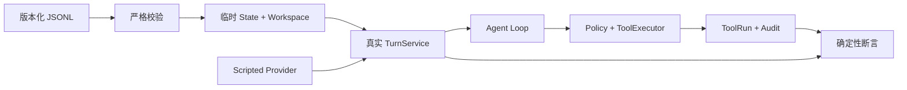

# MiniClaw Agent 回归场景集

Active offline gate: 39 cases
Active channel gate: 12 cases

这里保存随代码版本化的 Claw-like 使用场景。它回答两个问题：

1. 一个个人 Agent 现在到底会做什么？
2. 某次修改有没有把已经会的能力或安全边界弄坏？

## 当前门禁

| 分组 | 场景 |
| --- | --- |
| 基础对话 | `CORE-001` |
| Provider 事故 | `PROTO-001` |
| Tool Loop | `TOOL-001`、`ERROR-001` |
| Workspace | `FILE-READ-001`、`FILE-GLOB-001`、`FILE-GREP-001` |
| 安全 | `SAFE-001`、`SAFE-002` |
| 会话状态 | `STATE-001` |
| 写入与审批 | `WRITE-APPROVE-001`、`WRITE-OVERWRITE-001`、`EDIT-APPROVE-001`、`APPROVAL-DENY-001` |
| 审批完整性 | `APPROVAL-HASH-001`、`APPROVAL-REPLAY-001` |
| 受控命令 | `COMMAND-APPROVE-001`、`COMMAND-FORBID-001` |
| Personal 权限 | `FILES-PERSONAL-READ-001`、`FILES-PERSONAL-WRITE-APPROVAL-001`、`CLI-DISCOVERY-LARK-001`、`CLI-SENSITIVE-DENY-001` |
| HTTPS / SSRF | `HTTP-APPROVAL-001`、`HTTP-PRIVATE-001` |
| Memory | `MEMORY-READ-001`、`MEMORY-PROPOSE-001`、`MEM-AUTO-001..010` |
| Skills | `SKILL-ACTIVATE-001`、`FEISHU-LARK-DOCS-001` |
| 飞书 Channel | `FEISHU-DM-001`、`FEISHU-GROUP-001/002`、`FEISHU-DEDUPE-001`、`FEISHU-TOOL-001`、`FEISHU-APPROVAL-001/002`、`FEISHU-RESTART-001/002`、`FEISHU-DELIVERY-001`、`FEISHU-CARD-001`、`FEISHU-RECONNECT-001` |

所有 active offline 与 channel case 必须分别 100% PASS。任何 skipped 都按失败处理。

## 常用命令

```bash
uv run miniclaw eval list --root evals/scenarios
uv run miniclaw eval validate --root evals/scenarios
uv run miniclaw eval run --suite offline --root evals/scenarios
uv run miniclaw eval run --suite channel --root evals/scenarios
uv run miniclaw eval run --suite all --root evals/scenarios
```

在 `miniclaw eval` 完成前，可以先运行契约测试：

```bash
uv run python -m unittest tests.test_eval_cases -v
```

## 一条场景如何运行



`offline.responses` 只是模型边界的固定输出；Agent Loop、Policy、Tool 和 SQLite 都走生产实现。因此测试既
不访问真实模型，也不会绕过最需要防回归的核心链路。

`channel.fixture` 是固定枚举，不是可执行代码。Channel runner 会分别走 Adapter、Inbox、Manager、
Delivery、Approval Controller、Workspace Tool 和 Transport 生命周期的有限纵切，并将实际得到的
`channel_evidence` 与 JSONL 精确比较。它不读取 `.env`、不连接飞书，也不依赖个人账号。

真实飞书验收单独使用人工驱动脚本。脚本不会主动向任何联系人发消息，只有显式确认后才会提示测试者
逐条操作，并把脱敏计数保存到 Git 已忽略的 `.local/eval-results/feishu/`：

```bash
uv run python scripts/feishu_live_smoke.py --confirm-live
```

Phase 2 场景还可使用 `approval_actions` 的 `approve / deny / tamper / replay`，以及 `expected` 中的
`approval_statuses / files / absent_files / error_code`。Runner 会走真实 waiting Turn、ApprovalRepository、child
continuation 和文件/命令 Tool；公网 HTTPS pending 与私网拒绝场景不会发真实网络请求。字段契约和调试方式见
[`docs/engineering/phase-2/testing-and-debugging.md`](../docs/engineering/phase-2/testing-and-debugging.md)。

## 新增一次事故回归

1. 用最小输入稳定复现问题，先写会失败的单测或场景断言；
2. 分配永久 ID，例如 `PROTO-002` 或 `SAFE-003`；
3. 在对应 `*.v1.jsonl` 加一行，不复制真实对话、路径、Token 或主机详情；
4. 修共享根因，确认新增测试由 RED 变 GREEN；
5. 跑 `eval validate`、offline suite、全量 unittest 和 Ruff。

ID 一旦发布不能换含义。语义变化时新增 ID，旧 case 标成 `retired` 并在 release record 解释原因。

## 数据安全

- `setup.files` 只能创建临时 Workspace 内的相对 UTF-8 文件；
- `.env` 等敏感路径测试只使用合成哨兵值；
- 场景不提供 `api_key`、`token`、`secret` 或认证 Header 字段；
- `answer_excludes` 用于证明敏感哨兵没有进入最终回答；
- 原始运行数据不提交，Git 只保存脱敏 baseline 和版本摘要。

完整方法论见 `docs/superpowers/specs/2026-08-08-agent-regression-benchmark-design.md`。
